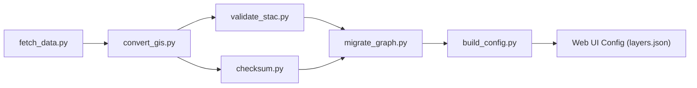

<div align="center">

# 🛠️ **Kansas Frontier Matrix — Tools (v2.5.0 · Tier-Ω+∞ Platinum++ Certified)**  
`/tools/`

**Automation Utilities · Data Pipelines · Validation & Deployment Helpers**

[](../.github/workflows/site.yml)
[](../.github/workflows/tests.yml)
[](../.github/workflows/codeql.yml)
[](../.github/workflows/trivy.yml)
[](../docs/)

</div>

---

## 🎯 Purpose
`/tools/` contains **production-grade CLIs and automation scripts** that orchestrate KFM’s **ingest → transform → validate → publish** pipeline.  
Each tool is **deterministic**, **provenance-aware**, and **observable** to enforce MCP-DL and FAIR/CARE.

> *Every transformation leaves a trail — reproducibility is built, not assumed.*

---

## 🧱 Directory Layout
```text
tools/
├── fetch_data.py          # Pull raw datasets from manifests (HTTP/STAC/API)
├── convert_gis.py         # Reproject/convert → GeoJSON / COG (EPSG:4326)
├── validate_stac.py       # Validate Items/Collections (+ links/licenses/ethics)
├── checksum.py            # SHA-256 generate/verify + sidecars (*.sha256)
├── migrate_graph.py       # Batch Cypher loads → Neo4j (CIDOC/OWL-Time)
├── build_config.py        # Generate web/config (layers.json, app.config.json)
├── export_bundle.py       # Release bundle: .prov.json + SBOM + SLSA
├── utils/                 # logging, config, http, stac helpers
├── config/                # default *.toml / *.yaml config examples
└── notebooks/             # exploratory notebooks (non-prod)
```

---

## ⚙️ Core Utilities

| Script              | What it does                                                                 | Standards / Libs                         |
|:--------------------|:-----------------------------------------------------------------------------|:-----------------------------------------|
| **fetch_data.py**   | Loads `data/sources/*.json`; fetches files; writes provenance & checksums    | requests · tqdm · PROV-O                 |
| **convert_gis.py**  | Reprojects to **EPSG:4326**, emits **GeoJSON/COG**, writes overviews         | GDAL · Rasterio · pyproj                 |
| **validate_stac.py**| Validates STAC JSON & links; enforces `license`, `providers`, `data_ethics`  | pystac · jsonschema                      |
| **checksum.py**     | Generates/verifies **SHA-256** `.sha256` sidecars for all artifacts          | hashlib                                  |
| **migrate_graph.py**| Bulk Cypher transactions → Neo4j; adds CIDOC/OWL-Time edges                  | neo4j-driver                             |
| **build_config.py** | Assembles `web/config/layers.json` & `app.config.json` from STAC catalogs    | Python stdlib (json, pathlib)            |
| **export_bundle.py**| Produces release bundle: `.prov.json`, `sbom.cdx.json`, `slsa.intoto.jsonl`  | syft/grype (invoked), provenance utils   |

---

## 🔧 Common CLI Contract
All tools support:

```
--config <file.[toml|yaml|json]>
--output <dir>           # default: ./build/<tool>/
--dry-run
--verbose / -v
--retries <n>            # default: 2 (exp backoff)
--timeout <s>            # default: 30
```

**Config example (`tools/config/fetch.toml`):**
```toml
[fetch]
manifest = "data/sources/noaa_daymet.json"
out_dir  = "data/raw/climate"
retries  = 3
timeout  = 45
```

---

## 🚀 Usage

**Makefile**
```makefile
make fetch            # fetch_data.py
make convert          # convert_gis.py
make stac-validate    # validate_stac.py
make checksums        # checksum.py --verify
make graph-migrate    # migrate_graph.py
make site-config      # build_config.py
make release-bundle   # export_bundle.py
```

**Direct CLI**
```bash
python tools/fetch_data.py --config tools/config/fetch.toml
python tools/convert_gis.py input.shp output.geojson
python tools/validate_stac.py data/stac/**/*
python tools/checksum.py --verify data/processed/
python tools/migrate_graph.py --config tools/config/graph.toml
python tools/build_config.py --output web/config/
python tools/export_bundle.py --output release-assets/
```

---

## 🧩 Pipeline Flow


End-to-end:
```bash
make fetch checksums convert stac-validate graph-migrate site-config release-bundle
```

---

## 🧾 Structured Logging Schema
Each tool logs newline-delimited JSON to `logs/<tool>.log`:

```json
{"ts":"2025-11-18T19:22:05Z","tool":"fetch_data","level":"INFO","msg":"start","run_id":"kfmr_20251118_192205_4392"}
{"ts":"2025-11-18T19:22:07Z","tool":"fetch_data","level":"INFO","msg":"fetched","manifest":"data/sources/noaa_daymet.json","files":12,"bytes":189230144}
{"ts":"2025-11-18T19:22:10Z","tool":"fetch_data","level":"INFO","msg":"end","duration_ms":48321,"errors":0}
```

**Fields:** `ts`, `tool`, `level`, `msg`, `run_id`, plus tool-specific keys (`manifest`, `files`, `bytes`, `duration_ms`, `errors`, …).

---

## 🚦 Exit Codes & Error Catalog
- `0` success  
- `1` validation_fail (schema/ethics/license/CRS)  
- `2` runtime_error (IO/network/driver)  
- `3` config_error (missing/invalid flags)

**Standard error JSON (stderr):**
```json
{"code":"TL/STAC","exit":1,"message":"license missing for item","item":"data/stac/items/noaa_2020.json"}
```

---

## ⏱ Per-Tool Performance Budgets
| Tool               | SLI                          | SLO          | Alert |
|:-------------------|:-----------------------------|:-------------|:------|
| fetch_data.py      | runtime per 1 GB             | ≤ 6 min/GB   | > 8m  |
| convert_gis.py     | reprojection throughput      | ≥ 120 MB/min | < 80  |
| validate_stac.py   | items/sec                    | ≥ 60         | < 30  |
| checksum.py        | files/sec (1–200 MB files)   | ≥ 80         | < 40  |
| migrate_graph.py   | Cypher txn/min               | ≥ 600        | < 300 |
| build_config.py    | config rebuild (ms)          | ≤ 1500       | > 2500|
| export_bundle.py   | bundle assembly (ms)         | ≤ 3000       | > 5000|

---

## 📈 Telemetry (emitted per tool)
```yaml
tool_runtime_ms: 48321
records_processed: 124000
stac_items_valid: 342
checksum_mismatches: 0
graph_txn_rate: 720          # txn/min
retry_count: 1
errors_count: 0
```
**Field defs**:  
`tool_runtime_ms` (ms) · `records_processed` (files/items/rows) · `stac_items_valid` (count) · `checksum_mismatches` (count) · `graph_txn_rate` (txn/min) · `retry_count` · `errors_count`.  
Metrics stream to **metrics.kfm.ai/tools** and get attached to CI artifacts.

---

## 📦 Run-Level Provenance (`.prov.json`)
Written to `build/<tool>/run-<run_id>.prov.json`:

```json
{
  "@context":"https://kfm.ai/contexts/tools.jsonld",
  "@type":"prov:Activity",
  "tool":"convert_gis",
  "run_id":"kfmr_20251118_192205_4392",
  "startedAtTime":"2025-11-18T19:22:05Z",
  "endedAtTime":"2025-11-18T19:27:41Z",
  "prov:used":["data/raw/climate/daymet_2020.tif"],
  "prov:generated":["data/processed/climate/daymet_2020_cog.tif","data/processed/climate/daymet_2020_cog.tif.sha256"],
  "checksums":{"data/processed/climate/daymet_2020_cog.tif":"sha256-<hex>"},
  "exit_code":0,
  "metrics":{"tool_runtime_ms":336000,"records_processed":1,"errors_count":0}
}
```

---

## 🔒 Checksum Sidecar & Directory Convention
- Sidecars live next to artifacts as `<filename>.sha256`  
- Content: `<SHA256_HEX>  <BASENAME>`  
- Aggregate digests saved to `checksums/<YYYYMMDD>/<tool>.sha256sum`

**Output Layout**
```
build/
  fetch_data/
    run-<id>.prov.json
    logs/fetch_data.log
  convert_gis/
    outputs/*.tif *.geojson
    logs/convert_gis.log
    checksums/*.sha256
```

---

## 🧵 Concurrency & Parallel Safety
- Tools are **idempotent**; outputs written atomically via temp files + rename.  
- Per-dataset lock: `.locks/<dataset>.lock` prevents duplicate workers.  
- `migrate_graph.py` batches writes; `--batch` defaults to 10,000; `--workers` guarded to avoid contention.

---

## ✅ Data Quality Gates (Great Expectations)
Optional `great_expectations/` suite invoked by `make dq`:
- geometry validity (no self-intersections)  
- CRS = EPSG:4326  
- attribute completeness  
- categorical domain checks  
Failures set exit `1` and block `graph-migrate`.

---

## 🖥️ Cross-Platform Support
- Linux/macOS: fully supported (GDAL/Rasterio wheels).  
- Windows: **WSL2 recommended**; native requires GDAL in `PATH`.  
- Devcontainer `.devcontainer/` pins GDAL/Rasterio/pystac versions.

---

## 🐳 Containerized Runs
```bash
docker build -f tools/Dockerfile -t kfm-tools .
docker run --rm -v "$PWD":/workspace kfm-tools \
  python tools/convert_gis.py input.shp output.geojson
```
`tools/Dockerfile` pins Python, GDAL, Rasterio, pystac, neo4j-driver, and CLI deps.

---

## 🛡 Python Supply-Chain (SCA)
- Dependency pinning via `requirements.lock` (pip-tools).  
- `pip-audit` / `safety` run in CI (`tests.yml`); PR blocked on high CVEs.  
- Wheels verified with hashes (`--require-hashes`).

---

## 📚 STAC Policy (accepted versions & link checks)
- Accepts STAC **1.0.x** only.  
- Required: `license`, `providers`, `data_ethics`, `proj:epsg` (if spatial).  
- Link checks: all `href` must be valid (HTTP 2xx) except `rel ∈ { root, parent }`.

---

## 🧰 Geometry Repair Policy
- `convert_gis.py` performs: make valid (buffer(0)-style), dissolve slivers (`area < 1e-10`).  
- Failing shapes logged and written to `rejects/<tool>/<dataset>.geojson`.

---

## 🔧 Configuration Examples

**Graph migration (`tools/config/graph.toml`):**
```toml
[neo4j]
uri   = "bolt://localhost:7687"
user  = "neo4j"
pass  = "neo4j"
batch = 10000
workers = 1
```

**STAC validation (`tools/config/stac.yaml`):**
```yaml
validate:
  require_license: true
  require_providers: true
  require_data_ethics: true
  link_check: "all"
```

---

## 🧱 IaC & Containers
- Minimal IaC in `tools/iac/` (Terraform) for dashboards & buckets.  
- Docker build args pinned in CI; images scanned by **Trivy**.

---

## 💰 Cost & Sustainability
- Tile/CDN egress budget < **$X/month** (prefer **PMTiles**).  
- Archive cold datasets to OSF annually; compress logs >90d.

---

## 🌐 I18n & Time Zones
- All timestamps **UTC** in logs; CLIs print ISO-8601 with offset.  
- Layer names/legends emitted as i18n-ready strings for UI.

---

## ➕ Adding a New Dataset (Checklist)
- [ ] Create manifest in `data/sources/*.json` (license, coverage, ethics)  
- [ ] `make fetch convert stac-validate checksums`  
- [ ] Add legends if needed; run `build_config.py`  
- [ ] Migrate to graph; verify relations & counts  
- [ ] Create release bundle via `make release-bundle` (SBOM/SLSA/.prov.json)

---

## 🧰 New Tool Template
```
tools/new_tool.py
#!/usr/bin/env python3
"""New tool — purpose & usage."""
# argparse with --config/--output/--dry-run/--verbose
# structured logger, run_id, exit codes per catalog
if __name__ == "__main__":
  # parse args → run() → write logs/prov → sys.exit(code)
```
Add tests in `tests/tools/test_new_tool.py` and a section in this README.

---

## 🧪 Testing & CI
- **Unit**: `tests/tools/` (pytest)  
- **Pre-Commit**: ruff/black/isort + json/yaml schema checks  
- **CI**: `tests.yml` uses mock manifests; uploads logs + metrics  
- **Contracts**: JSON schema tests for STAC, config, tool outputs  
Run locally:
```bash
pytest -q tests/tools
pre-commit run --all-files
```

---

## 🔗 Related Documentation
- **Data Pipelines** — `data/README.md`  
- **STAC Catalog** — `data/stac/README.md`  
- **Web Config** — `web/config/README.md`  
- **Architecture Overview** — `docs/architecture/system-architecture-overview.md`

---

## 🧾 Versioning & Metadata
| Field | Value |
|:--|:--|
| **Version** | `v2.5.0` |
| **Codename** | *Deterministic Automation & Provenance Suite* |
| **Maintainers** | @kfm-data · @kfm-architecture |
| **Alignment** | STAC 1.0 · PROV-O · FAIR/CARE · MCP-DL v6.4.3 |
| **Maturity** | Stable / Production |

---

## 🧾 Change-Control Register
```yaml
changes:
  - date: "2025-11-18"
    change: "Platinum++: logging schema, exit codes, per-tool SLOs, run-level provenance, checksum sidecars, concurrency rules, DQ gates, container runs, SCA policy, STAC/CRS/geometry rules."
    reviewed_by: "@kfm-architecture"
    pr: "#497"
```

---

## 📜 License
Released under the **MIT License**.  
© 2025 Kansas Frontier Matrix — engineered under **MCP-DL v6.4.3** for deterministic, auditable, and reproducible automation.

> *“Tools are instruments of reproducibility — every helper leaves a provenance trail.”*

---

<!-- MCP-FOOTER-BEGIN
MCP-VERSION: v6.4.3
MCP-TIER: Ω+∞ Platinum++
DOC-PATH: tools/README.md
MCP-CERTIFIED: true
OBSERVABILITY-ACTIVE: true
LOG-SCHEMA-DOCUMENTED: true
EXIT-CODES-STANDARDIZED: true
PER-TOOL-SLOS: true
RUN-PROVENANCE-JSONLD: true
CHECKSUM-SIDECAR-SPEC: true
CONCURRENCY-SAFETY-DOCS: true
DQ-GATES-INTEGRATED: true
CROSS-PLATFORM-SUPPORT: true
CONTAINERIZED-RUNS: true
PYTHON-SCA-ENFORCED: true
STAC-POLICY-SPECIFIED: true
GEOMETRY-REPAIR-POLICY: true
NEW-TOOL-TEMPLATE: true
MAKE-TARGETS-PARITY: true
TELEMETRY-FIELD-DEFS: true
PERFORMANCE-BUDGET-P95: 2.5 s
GENERATED-BY: KFM-Automation/DocsBot
LAST-VALIDATED: {build.date}
MCP-FOOTER-END -->
