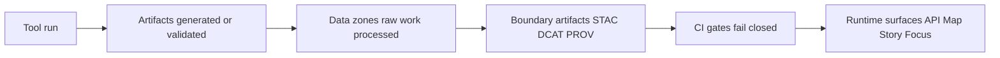

# Tools

> Utility scripts, validators, and DevOps helpers for building, validating, and governing Kansas Frontier Matrix (KFM) artifacts.

**Status:** Draft  
**Owners:** TBD (add CODEOWNERS entries per tool subdirectory)

   

## Navigation
- [What belongs in tools](#what-belongs-in-tools)
- [Directory conventions](#directory-conventions)
- [Tool lifecycle and data zones](#tool-lifecycle-and-data-zones)
- [CLI contract](#cli-contract)
- [Determinism and provenance](#determinism-and-provenance)
- [Governance and safety](#governance-and-safety)
- [Tool registry](#tool-registry)
- [Add a new tool](#add-a-new-tool)

---

## What belongs in tools

`tools/` is for **operator-focused utilities**: scripts and CLIs that help maintainers and CI **validate, transform, inspect, and enforce governance**.

Examples of good fits:
- **Validators** (schema/profile validation; dataset QA; “fail closed” checks)
- **Link checkers** (catalog cross-link integrity; evidence reference resolvability)
- **Hashing / determinism helpers** (stable IDs, spec hashing, canonicalization helpers)
- **One-off domain feed adapters** that *prepare* data for promotion (but do not bypass promotion gates)
- **DevOps helpers** used by maintainers (lint runners, local environment checks, release packing helpers)

Not a good fit:
- **Production runtime code** (belongs under runtime subsystems like API/UI/pipelines)
- **Long-lived datasets** (belong in the data lifecycle zones, not in `tools/`)
- **Secrets / credentials** (never commit; use runtime/CI secret management)
- **Unreviewed publish pathways** that skip catalogs, provenance, validation, or policy checks

[Back to top](#navigation)

---

## Directory conventions

Each tool should be **self-contained** under `tools/<tool_slug>/` and should be runnable from the repo root.

Recommended skeleton:

```text
tools/
  README.md
  <tool_slug>/
    README.md
    LICENSE.txt                 # optional (if different from repo license)
    CHANGELOG.md                # optional (if tool is versioned independently)
    pyproject.toml | requirements.txt | package.json
    src/ | <tool_entrypoint>.py | <tool_entrypoint>.ts
    tests/
    fixtures/
    schemas/                    # pinned schemas used by the tool (if any)
```

Guidelines:
- **Pin schema versions** you validate against (copy/pin into `schemas/` or reference a pinned version).
- Keep tools **fast enough for CI** or provide a “quick mode” for gating.
- If a tool generates artifacts meant for publication, it must integrate with the **promotion contract** (see [Tool lifecycle and data zones](#tool-lifecycle-and-data-zones)).

[Back to top](#navigation)

---

## Tool lifecycle and data zones

Tools are allowed to *generate* or *validate* artifacts, but **promotion into runtime surfaces must remain gated**.



Practical rules:
- **Intermediate outputs** should land in `data/work/...` (or an explicit quarantine/work area).
- **Publishable outputs** should land in `data/processed/...` and must have:
  - required metadata records (STAC/DCAT/PROV),
  - link integrity checks,
  - policy decisions recorded,
  - audit/run receipt emitted (if your pipeline system supports it).

If you are unsure whether your work is “tool” or “pipeline”:
- Prefer: tool = **utility + validation + developer ergonomics**  
- Prefer: pipeline = **canonical ETL jobs and domain transformations**

[Back to top](#navigation)

---

## CLI contract

Every tool that is intended to be used by others (or CI) should implement:

- `--help` (usage, examples, exit codes)
- `--version` (tool version + git commit if available)
- Stable exit codes:
  - `0` success
  - `1` validation failed / expected failure condition
  - `2` misuse / bad args
  - `>=3` unexpected runtime errors
- Optional but recommended:
  - `--config <path>` for repeatable runs
  - `--input <path|uri>` and `--output <path>` (or similar)
  - `--dry-run` (no writes)
  - `--json` (machine-readable logs for CI)

Tools must be:
- **Non-interactive by default** (CI-safe)
- **Deterministic when given the same inputs/config**
- Explicit about **network access** (if a tool fetches remote data, it should do so intentionally and log provenance)

[Back to top](#navigation)

---

## Determinism and provenance

If a tool produces artifacts that might be promoted, it must support:
- **Stable identity** (stable IDs and hashes)
- **Repeatability** (same inputs/config → same outputs)
- **Traceability** (log inputs, outputs, digests, and tool version)

A minimal “run record” printed to stdout (or written alongside outputs) should include:
- tool name + version
- timestamp (UTC)
- input URI(s) + digest(s)
- output path(s) + digest(s)
- config digest (or embedded config)
- policy label (if applicable)

Example (illustrative):

```bash
tool_name="example_tool"
tool_version="0.1.0"
run_utc="$(date -u +%Y-%m-%dT%H:%M:%SZ)"
echo "tool=${tool_name} version=${tool_version} run=${run_utc}"
```

[Back to top](#navigation)

---

## Governance and safety

### Default-deny posture
If a tool touches restricted data or can emit publishable artifacts, it should:
- require an explicit `--policy-label` (or equivalent),
- default to **deny** unless a policy decision allows release,
- support obligations like **generalization/redaction**.

### Sensitive location handling
For datasets involving sensitive locations (examples: archaeology, culturally restricted sites, vulnerable infrastructure, sensitive species):
- produce a **restricted precise** version and a **public generalized** version (only if allowed),
- document the generalization method,
- add tests to confirm no precise coordinates leak,
- ensure governance review occurs before publication,
- ensure the UI communicates generalization and reason.

> **WARNING**
> If sensitivity or permissions are unclear: fail closed. Do not publish.

[Back to top](#navigation)

---

## Tool registry

This table is a **living registry**. Add an entry whenever a tool becomes relied-on by others or CI.

| Tool | Category | Primary job | CI gate | Status | Owner |
|---|---|---|---|---|---|
| `hash/spec_hash_cli` | Determinism | Stable spec hashing for drift detection | Required (if present) | Planned | TBD |
| `validators/stac_validator` | Validation | Validate STAC artifacts against profile | Required (if present) | Planned | TBD |
| `validators/dcat_validator` | Validation | Validate DCAT artifacts against profile | Required (if present) | Planned | TBD |
| `validators/prov_validator` | Validation | Validate PROV bundles against profile | Required (if present) | Planned | TBD |
| `linkcheck/catalog_linkcheck` | Integrity | Verify cross-links resolve | Required (if present) | Planned | TBD |
| `wzdx/` | Domain adapter | Validate/normalize WZDx feed to analytics + tiles outputs | Optional | Example pattern | TBD |

> NOTE: If some tools already exist in this repo, replace “Planned/Example” with “Active” and link to their subdirectory READMEs.

[Back to top](#navigation)

---

## Add a new tool

### Minimum requirements checklist
- [ ] `tools/<tool_slug>/README.md` with: purpose, inputs, outputs, examples
- [ ] Deterministic behavior documented (sorting, hashing, pinned schemas)
- [ ] Tests with fixtures (include at least one “known good” and one “known bad”)
- [ ] CI-safe mode (non-interactive; predictable exit codes)
- [ ] Provenance output (run record, input/output digests)
- [ ] Policy-aware behavior if relevant (default-deny; obligations)
- [ ] Tool added to the [Tool registry](#tool-registry)

### Suggested README template for a tool
<details>
<summary>Click to expand</summary>

```markdown
# <tool_slug>

One-line purpose.

## Usage
```bash
# example
```

## Inputs
- …

## Outputs
- …

## Determinism rules
- …

## Policy / governance notes
- …

## Tests
```bash
# example
```
```

</details>

[Back to top](#navigation)
