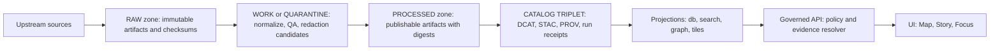
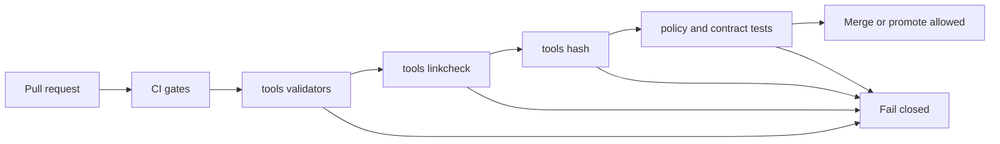

<!-- [KFM_META_BLOCK_V2]
doc_id: kfm://doc/f9897f92-8f95-4e15-a53f-c4aee0cb0fed
title: tools/ — Utility scripts, validators, and DevOps helpers
type: standard
version: v1
status: draft
owners: KFM Platform (TODO)
created: 2026-02-26
updated: 2026-03-01
policy_label: public
related:
  - ../contracts/
  - ../configs/
  - ../policy/
  - ../scripts/
  - ../tests/
  - docs/MASTER_GUIDE_v13.md
  - docs/standards/KFM_DCAT_PROFILE.md
  - docs/standards/KFM_STAC_PROFILE.md
  - docs/standards/KFM_PROV_PROFILE.md
tags: [kfm, tools, ci, validators, promotion-contract, evidence-first, trust-membrane, spec-hash, registry]
notes:
  - tools/ contains maintainers’ tooling used by CI and operators to enforce the Promotion Contract (fail-closed gates).
  - Keep tools deterministic, policy-safe, and fixture-driven. Update the tool registry when adding/renaming/retiring tools.
  - This doc describes a target posture. Mark repo-specific facts as TODO until verified in-repo.
  - Gate labels are versioned. This README documents Promotion Contract v1 plus an optional “ops gate set” crosswalk.
[/KFM_META_BLOCK_V2] -->

<a id="top"></a>

# `tools/` — Utility scripts, validators, and DevOps helpers

**Purpose:** Keep KFM *buildable, reversible, and evidence-backed* by running **fail-closed** checks in CI and locally (catalog validation, link checking, spec-hash drift detection, and other trust-membrane guardrails).


> [!IMPORTANT]
> `tools/` is part of KFM’s **trust membrane**. If a tool can be bypassed, is non-deterministic, or leaks restricted details in logs, it is a governance risk.

---

## Quick navigation

- [What lives here](#what-lives-here)
- [Where it fits](#where-it-fits)
- [Repository alignment](#repository-alignment)
- [Non-negotiable invariants](#non-negotiable-invariants)
- [Truth path context](#truth-path-context)
- [Directory layout](#directory-layout)
- [How tools fit the promotion flow](#how-tools-fit-the-promotion-flow)
- [Promotion Contract gate mapping](#promotion-contract-gate-mapping)
- [Quick start](#quick-start)
- [Tool registry and inventory](#tool-registry-and-inventory)
- [Conventions](#conventions)
- [Adding a new tool](#adding-a-new-tool)
- [Verification checklist](#verification-checklist)
- [Troubleshooting](#troubleshooting)
- [Appendix: recommended CLI contract](#appendix-recommended-cli-contract)

---

## What lives here

This folder is reserved for **utility scripts, validators, and DevOps tooling** that:

- run in CI as **merge gates** or **promotion gates**, and/or
- are used by maintainers/operators during ingest/publish/release workflows.

### ✅ Acceptable contents

| Category | Examples | Typical outcome |
|---|---|---|
| Catalog validators | DCAT/STAC/PROV schema/profile validation | CI blocks invalid metadata |
| Cross-link checkers | Ensure DCAT ↔ STAC ↔ PROV ↔ receipts ↔ artifacts resolve | CI blocks broken evidence paths |
| Spec-hash & drift checks | Detect contract drift / canonicalization regressions | CI blocks “silent” version drift |
| Policy-safe lint checks | Disallow direct-store access, forbid secrets-in-repo patterns | CI blocks trust-membrane bypass |
| Release helpers (optional) | Build SBOMs, assemble release manifests, verify signatures | Reproducible release outputs |

### ❌ Not allowed in `tools/`

- One-off experiments or notebooks → put them in an experiments area (e.g., `mcp/`) or a PR sandbox.
- Production runtime code → belongs in `src/` / services, behind contracts/interfaces.
- Data pipelines → belong in pipeline modules/runners; tools can validate pipeline outputs.
- Raw/processed datasets → belong in `data/` truth-path zones.
- Secrets, tokens, credentials, kubeconfigs, or `.env` with real values → never commit.

> [!NOTE]
> Tools **prefer read-only validation**. If a tool *must write outputs*, it must:
> 1) write into the correct truth-path zone (usually `data/work/…`),  
> 2) emit a receipt and checksums, and  
> 3) never mutate canonical artifacts in place.

[Back to top](#top)

---

## Where it fits

`tools/` sits alongside **contracts**, **policy**, and **tests** as the enforcement layer that turns governance intent into CI-enforced behavior:

- **contracts/** define what “valid” means (schemas, profiles, IO contracts).
- **policy/** defines what is allowed (default-deny, obligations, redaction rules).
- **tools/** implements verification (validators, linkcheck, drift checks, policy-safe lint).
- **tests/** ensures the above are deterministic (fixtures + regressions).

> [!TIP]
> If a requirement is important enough to say “MUST” in docs, it should be implemented as:
> **contract + fixtures + tool + CI gate** (or it’s not enforceable).

[Back to top](#top)

---

## Repository alignment

> [!IMPORTANT]
> **Do not claim repo-specific implementation details unless verified.** This README may describe the target posture, but statements like “this script exists at X” must be marked TODO until confirmed.

### Confirmed design intent (reference docs)

- `tools/` is the home for **validators, link checkers, and CLI utilities** used by CI and operators.

### TODO to verify in-repo

- Actual subfolders (`validators/`, `linkcheck/`, `hash/`, etc.) and tool entrypoints actually used by CI.
- The precise CI wiring and which checks are *merge-blocking* vs *promotion-blocking*.
- Whether the repo already uses a tool registry (and its format/version).

[Back to top](#top)

---

## Non-negotiable invariants

Tools exist to *enforce* these invariants (not merely document them):

1. **Fail closed**  
   If a tool cannot prove a requirement, it must exit non-zero and block the gate.

2. **Truth path discipline**  
   Tools must never “fix” canonical artifacts in place. Canonical artifacts are versioned and immutable by digest.

3. **Trust membrane preserved**  
   Tools must not introduce or normalize bypass patterns (e.g., direct DB/object-store reads from UI code).

4. **Evidence-first / cite-or-abstain support**  
   Tools must help ensure:
   - EvidenceRefs resolve to EvidenceBundles (or the system abstains/denies),
   - catalogs and receipts are present and cross-linked.

5. **Canonical vs rebuildable**  
   Tools may rebuild projections, but projections are never treated as canonical truth. Tools validate canonical sources.

6. **Deterministic identity and hashing**  
   Spec hashing must be canonicalized and stable (e.g., JSON canonicalization). Any drift is a blocking failure unless explicitly versioned.

7. **Policy-safe output**  
   Tools must not leak restricted details (including “restricted existence”) via logs, timing hints, or error messages.

[Back to top](#top)

---

## Truth path context

KFM’s lifecycle is a concrete **truth path** with enforced gates—not a metaphor. Tools should align to the zones and only “promote” when evidence exists.



> [!WARNING]
> Tools should not “paper over” missing artifacts. If a catalog, receipt, or required checksum is missing, the correct output is a **blocking failure** (deny-by-default posture).

[Back to top](#top)

---

## Directory layout

> [!IMPORTANT]
> The layout below is a recommended baseline. If your repo differs, update this README and keep the **Tool registry** accurate.

<details>
<summary><strong>Recommended baseline layout (expand)</strong></summary>

```text
tools/                                                         # Tooling entrypoint (validators + checks + CI helpers)
├── README.md                                                  # This file (how to run + add new tools)
│
├── bin/                                                       # OPTIONAL: unified entrypoints/wrappers for CI + devs
│   ├── kfm-tools.{sh,ps1,js,ts,py}                            # "One CLI": dispatch by tool_id from registry
│   ├── kfm-tools.env.example                                  # Example env vars (NO real secrets)
│   └── README.md                                              # CLI contract + examples + exit codes
│
├── ci/                                                        # CI glue NOT specific to a single tool
│   ├── README.md                                              # How CI calls tools; required status checks
│   ├── changed_files.{sh,py,ts,js}                            # Compute "what changed" → scoped tool runs
│   ├── annotate_findings.{sh,py,ts,js}                        # Emit GitHub annotations from --json outputs
│   ├── upload_artifacts.{sh,py,ts,js}                         # Upload tool reports to CI artifacts
│   ├── gate_runner.{sh,py,ts,js}                              # Run merge/promotion gate sets (registry-driven)
│   └── fixtures/                                              # CI-glue fixtures (tiny, deterministic)
│
├── registry/                                                  # Machine-readable registry + schemas + fixtures (small)
│   ├── tools.v1.json                                          # Canonical tool registry (owners, commands, gates, IO)
│   ├── tools.v1.lock.json                                     # OPTIONAL: resolved commands + digests/pins (determinism)
│   ├── schemas/                                               # Schemas for registry + common tool I/O
│   │   ├── tools_registry.v1.schema.json                      # Schema for tools.v1.json
│   │   ├── tool_result.v1.schema.json                         # Standard machine output envelope (--json)
│   │   ├── finding.v1.schema.json                             # Standard finding record (code, severity, location, msg)
│   │   ├── exit_codes.v1.schema.json                          # Allowed exit codes + meanings
│   │   └── README.md                                          # How schemas evolve + versioning rules
│   └── fixtures/                                              # Valid/invalid registry examples (CI schema validation)
│
├── validators/                                                # Metadata + schema validators (fail-closed; read-only)
├── linkcheck/                                                 # Cross-link integrity checks (no broken refs)
├── hash/                                                      # Spec-hash helpers + drift checks (determinism guardrails)
├── lint/                                                      # Static guardrails (trust membrane + hygiene)
│
├── policycheck/                                               # OPTIONAL: wrappers for policy-as-code gates (OPA/Conftest)
├── packaging/                                                 # OPTIONAL: deterministic artifact packaging + validation
├── oci/                                                       # OPTIONAL: OCI distribution helpers (ORAS/Cosign plumbing)
├── supply_chain/                                              # OPTIONAL: SBOMs + attestations (release hardening)
├── watchers/                                                  # OPTIONAL: watcher tooling support (validate + dry-run)
├── graph/                                                     # OPTIONAL: graph mapping + invariants checks
├── eval/                                                      # OPTIONAL: eval harness runners (e.g., Focus Mode golden evals)
├── domains/                                                   # OPTIONAL: domain-specific tooling modules (isolated)
│
├── _shared/                                                   # Shared helper libs (small; minimal side effects)
└── fixtures/                                                  # Shared fixtures (synthetic/sanitized; tiny; documented)
```
</details>

[Back to top](#top)

---

## How tools fit the promotion flow



[Back to top](#top)

---

## Promotion Contract gate mapping

KFM uses **Promotion Contract gates** to turn governance intent into enforceable behavior. Tools should declare which gates they enforce in the tool registry.

> [!IMPORTANT]
> **Gate labels are versioned.** This README documents:
> - **Promotion Contract v1 (minimum gates)**, and  
> - an optional **ops gate set** some teams use to call out QA and release-manifest checks explicitly.
>
> Pick one taxonomy for CI and keep it consistent in `tools/registry/tools.v1.json`.

### Promotion Contract v1 (minimum gates)

| Gate | What must be true (minimum) | Typical tool categories |
|---|---|---|
| **A — Identity & versioning** | Stable dataset IDs; deterministic `spec_hash`; stable content digests | `hash/`, schema checks |
| **B — Licensing & rights metadata** | License/rights present; terms snapshot captured; unknown ⇒ quarantine | `validators/`, `policycheck/` |
| **C — Sensitivity & redaction plan** | `policy_label` assigned; obligations recorded and honored | `policycheck/`, `lint/` |
| **D — Catalog triplet validation** | DCAT/STAC/PROV validate and cross-link; EvidenceRefs resolve | `validators/`, `linkcheck/` |
| **E — Run receipt & checksums** | run_receipt exists; inputs/outputs enumerated with checksums; environment recorded | `validators/`, `linkcheck/`, `hash/` |
| **F — Policy tests & contract tests** | OPA tests pass; evidence resolver contract passes; API/schema contracts validate | `policycheck/`, `lint/`, `eval/` (optional) |
| **G — Optional (recommended production posture)** | SBOM/provenance; perf smoke; accessibility smoke; release hardening | `supply_chain/`, `release/`, `eval/` |

### Optional ops gate set (common extension)

Some CI setups call out the following as named gates to make dashboards easier:

| Ops gate | Intent | Maps to Promotion Contract v1 |
|---|---|---|
| **E′ — QA & thresholds** | Dataset-specific QA reports exist and thresholds are met (else quarantine) | Usually a WORK/QUAR precondition; may also be enforced alongside v1 Gate E |
| **G′ — Release manifest** | Promotion recorded as a manifest referencing digests | Typically part of v1 Gate G |

> [!NOTE]
> If your repo uses the ops gate set, record it explicitly in the registry (e.g., `gate_taxonomy: "v1+ops"`), so a tool can’t silently “enforce Gate E” while meaning different things.

[Back to top](#top)

---

## Quick start

> [!NOTE]
> Commands here are examples. Wire the repo’s real entry points (Makefile/Taskfile/npm scripts) and update this section accordingly.

### Run the core gates locally (example)

```bash
# From repo root (replace with your repo's actual bootstrap)
make bootstrap

# Catalog triplet validation (Gate D)
make tools-validate

# Cross-link checks (Gate D)
make tools-linkcheck

# Spec-hash drift checks (Gate A)
make tools-hash-check

# Policy + lint guardrails (Gate C + F + trust membrane)
make tools-policy
make tools-lint
```

### Minimal “direct invocation” pattern (example)

```bash
# Validators
./tools/validators/validate_dcat.sh
./tools/validators/validate_stac.sh
./tools/validators/validate_prov.sh

# Linkcheck
./tools/linkcheck/catalog_triplet_linkcheck.sh

# Hash/drift
./tools/hash/check_spec_hash_drift.sh
```

[Back to top](#top)

---

## Tool registry and inventory

KFM prefers a **machine-readable registry** so CI can run tools consistently and owners can be routed via CODEOWNERS.

### `tools/registry/tools.v1.json` (recommended fields)

At minimum:
- tool id + path
- owner
- gate type (merge vs promotion)
- **gate taxonomy** (`v1` or `v1+ops`)
- promotion gates enforced
- inputs/outputs (read-only vs writes)
- required fixtures/tests
- timeout expectations
- policy-safe logging flag

Example shape (illustrative):

```json
{
  "version": "v1",
  "gate_taxonomy": "v1",
  "tools": [
    {
      "tool_id": "kfm.tools.validate_dcat",
      "path": "tools/validators/validate_dcat.sh",
      "owner": "KFM Platform",
      "gate_type": "merge",
      "enforces_promotion_gates": ["B", "D"],
      "reads": ["data/catalog/**"],
      "writes": [],
      "requires_fixtures": true,
      "timeout_seconds": 120,
      "policy_safe_logs": true
    }
  ]
}
```

### Tool inventory (human-readable)

Keep this table up-to-date (it should match the registry):

| Tool | Type | What it checks | Gate type | Enforces | Owner |
|---|---|---|---|---|---|
| `tools/validators/validate_dcat.*` | validator | DCAT conforms to KFM profile; rights/license fields present | merge/promotion | B, D | TODO |
| `tools/validators/validate_stac.*` | validator | STAC Items/Collections/Assets conform to KFM profile | merge/promotion | D | TODO |
| `tools/validators/validate_prov.*` | validator | PROV bundle shape + required lineage links present | merge/promotion | D | TODO |
| `tools/validators/validate_receipts.*` | validator | run_receipt + checksums schema validity | promotion | E | TODO |
| `tools/linkcheck/catalog_triplet_linkcheck.*` | linkcheck | DCAT ↔ STAC ↔ PROV cross-links resolve deterministically | merge/promotion | D | TODO |
| `tools/linkcheck/receipt_artifact_linkcheck.*` | linkcheck | Receipts ↔ checksums ↔ artifact paths resolve | promotion | E | TODO |
| `tools/hash/check_spec_hash_drift.*` | drift check | Deterministic spec-hash stability; blocks unintended drift | merge | A | TODO |
| `tools/policycheck/conftest_gate.*` | policy | OPA/Conftest fixtures pass; default-deny posture | merge/promotion | C, F | TODO |
| `tools/lint/check_no_direct_store_access.*` | lint | Trust membrane guardrail: forbid forbidden deps/egress patterns | merge | (Trust membrane) | TODO |

[Back to top](#top)

---

## Conventions

### Deterministic and auditable

- **Deterministic**: same inputs ⇒ same pass/fail decision.
- **Fixture-driven**: every rule has fixtures (valid + invalid).
- **Offline-first**: avoid network calls. If unavoidable, pin versions and record what was accessed.
- **Canonical hashing**: use canonical JSON serialization for `spec_hash` and drift checks; golden vectors required.

### Safe by default

- Treat files as untrusted input (strict parsing, safe path handling).
- Never print secrets or restricted data.
- Prefer **policy-safe error outputs**:
  - do not distinguish “not found” vs “forbidden” in ways that leak restricted existence
  - keep error messages actionable for maintainers but safe for CI logs

### Read-only posture (preferred)

- Validators/linkcheck/hash tools should not mutate artifacts.
- If a tool must write outputs:
  - write into the correct truth-path zone (usually `data/work/…`)
  - emit `checksums.json` and a run receipt
  - never overwrite canonical artifacts in place

### Standard findings and machine output

All gate tools should support a machine-readable mode so CI can annotate PRs reliably.

**Recommended contract:**
- progress logs → stderr
- machine output (`--json`) → stdout
- findings conform to `tools/registry/schemas/finding.v1.schema.json`
- exit codes follow the standard meanings in this README

[Back to top](#top)

---

## Adding a new tool

Every new tool must ship with:

- [ ] A clear location: `tools/<area>/<tool_name>.(sh|py|js|ts|go)`
- [ ] A help/usage entry point (`--help` or header comment)
- [ ] Deterministic behavior (same inputs ⇒ same decision)
- [ ] Fixtures: **known-good** + **known-bad**
- [ ] Tests (unit tests minimum; integration tests if it is a gate)
- [ ] Entry in `tools/registry/tools.v1.json` including **gate taxonomy** and **which Promotion Contract gates it enforces**
- [ ] Entry in the [Tool inventory](#tool-registry-and-inventory)
- [ ] CI wiring (if the tool is a gate)
- [ ] Policy-safe logging (no restricted details; no secrets)

> [!TIP]
> If the tool enforces a Promotion Contract gate, treat it like a contract change: update fixtures, schema validators, and documentation together.

[Back to top](#top)

---

## Verification checklist

Use this checklist to turn “target posture” into **confirmed repo facts** (attach outputs to the next README revision):

- [ ] Capture repo commit hash and root directory tree: `git rev-parse HEAD` and `tree -L 3`.
- [ ] Confirm which work packages already exist: search for `spec_hash`, OPA policies, validators, evidence resolver route, and dataset registry schema.
- [ ] Extract CI gate list from `.github/workflows` and document which checks are blocking merges.
- [ ] Choose a single MVP dataset and verify it can be promoted through all gates with receipts and catalogs.
- [ ] Validate that UI cannot bypass the PEP (static analysis + network policies) and that EvidenceRefs resolve end-to-end in Map Explorer and Story publishing.
- [ ] For Focus Mode: run the evaluation harness and store golden query outputs and diffs as artifacts.

[Back to top](#top)

---

## Troubleshooting

### “Validator passes locally but fails in CI”
- Confirm CI and local are using the same tool version/runtime.
- Confirm fixtures are checked in and paths match CI working directory.
- Confirm the tool is deterministic (no timestamps or environment-dependent ordering).

### “Linkcheck failures”
Common causes:
- DCAT distribution points to missing STAC Item
- STAC asset href changed but catalogs not updated
- PROV references missing run receipt or entity id

Fix the *metadata* and receipts—do not weaken linkcheck rules “to get CI green”.

### “Spec-hash drift failures”
- If drift is expected (intentional contract change): bump the relevant contract/version and update golden vectors.
- If drift is not expected: verify canonicalization rules and field normalization.

### “Tool logs might leak restricted details”
- Treat as a P0 governance bug.
- Redact/aggregate outputs, and enforce policy-safe error shaping.

[Back to top](#top)

---

## Appendix: recommended CLI contract

Tools should follow a consistent CLI contract so CI can interpret results reliably.

### Flags (recommended)
- `--help` prints usage and exits `0`
- `--json` prints machine-readable output (for CI annotations)
- `--input <path>` optional explicit input root
- `--strict` fails on warnings (default for CI)

### Exit codes (recommended)
- `0` = pass
- `1` = validation failed (expected gate failure)
- `2` = tool error (misconfiguration, missing dependency, unexpected exception)

### Output contract (recommended)
- Progress logs → stderr
- Machine output → stdout (when `--json`)
- Never print secrets or restricted details

---

<a href="#top">Back to top</a>
