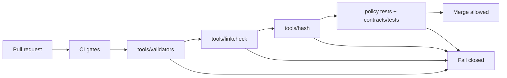

<!-- [KFM_META_BLOCK_V2]
doc_id: kfm://doc/f9897f92-8f95-4e15-a53f-c4aee0cb0fed
title: tools/ — Utility scripts, validators, and DevOps helpers
type: standard
version: v1
status: draft
owners: KFM Platform (TODO)
created: 2026-02-26
updated: 2026-02-28
policy_label: public
related:
  - ../contracts/
  - ../configs/
  - ../policy/
  - ../scripts/
  - ../tests/
  - docs/MASTER_GUIDE_v13.md
  - docs/standards/KFM_DCAT_PROFILE.md
  - docs/standards/KFM_STAC_PROFILE.md
  - docs/standards/KFM_PROV_PROFILE.md
tags: [kfm, tools, ci, validators, promotion-contract, evidence-first, trust-membrane, spec-hash]
notes:
  - tools/ contains maintainers’ tooling used by CI and operators to enforce the Promotion Contract (fail-closed gates).
  - Keep tools deterministic, policy-safe, and fixture-driven. Update the tool registry when adding/renaming/retiring tools.
  - This doc describes a target posture. Mark repo-specific facts as TODO until verified in-repo.
[/KFM_META_BLOCK_V2] -->

<a id="top"></a>

# `tools/` — Utility scripts, validators, and DevOps helpers

**Purpose:** Keep KFM *buildable, reversible, and evidence-backed* by running **fail-closed** checks in CI and locally (catalog validation, link checking, spec-hash drift detection, and other guardrails).


> [!IMPORTANT]
> `tools/` is part of KFM’s **trust membrane**. If a tool can be bypassed, is non-deterministic, or leaks restricted details in logs, it is a governance risk.

---

## Quick navigation

- [What lives here](#what-lives-here)
- [Non-negotiable invariants](#non-negotiable-invariants)
- [Directory layout](#directory-layout)
- [How tools fit the promotion flow](#how-tools-fit-the-promotion-flow)
- [Quick start](#quick-start)
- [Tool registry and inventory](#tool-registry-and-inventory)
- [Conventions](#conventions)
- [Adding a new tool](#adding-a-new-tool)
- [Troubleshooting](#troubleshooting)
- [Appendix: recommended CLI contract](#appendix-recommended-cli-contract)

---

## What lives here

This folder is reserved for **utility scripts, validators, and DevOps tooling** that:

- run in CI as **merge gates** or **promotion gates**, and/or
- are used by maintainers/operators during ingest/publish/release workflows.

### ✅ Acceptable contents

| Category | Examples | Typical outcome |
|---|---|---|
| Catalog validators | DCAT/STAC/PROV schema/profile validation | CI blocks invalid metadata |
| Cross-link checkers | Ensure DCAT ↔ STAC ↔ PROV ↔ receipts ↔ artifacts resolve | CI blocks broken evidence paths |
| Spec-hash & drift checks | Detect contract drift / canonicalization regressions | CI blocks “silent” version drift |
| Policy-safe lint checks | Disallow direct-store access, forbid secrets-in-repo patterns | CI blocks trust-membrane bypass |
| Release helpers (optional) | Build SBOMs, assemble release manifests, verify signatures | Reproducible release outputs |

### ❌ Not allowed in `tools/`

- One-off experiments or notebooks → put them in a dedicated experiments area (e.g., `mcp/`) or a PR sandbox.
- Production runtime code → belongs in `src/` / services, behind contracts/interfaces.
- Data pipelines → belong in pipeline modules/runners; tools can validate pipeline outputs.
- Raw/processed datasets → belong in `data/` truth-path zones.
- Secrets, tokens, credentials, kubeconfigs, or `.env` with real values → never commit.

> [!NOTE]
> Tools **prefer read-only validation**. If a tool *must write outputs*, it must:
> 1) write into the correct truth-path zone (usually `data/work/…`),  
> 2) emit a receipt and checksums, and  
> 3) never mutate canonical artifacts in place.

[Back to top](#top)

---

## Non-negotiable invariants

Tools exist to *enforce* these invariants (not merely document them):

1. **Fail closed**  
   If a tool cannot prove a requirement, it must exit non-zero and block the gate.

2. **Truth path discipline**  
   Tools must never “fix” canonical artifacts in place. Canonical artifacts are versioned and immutable by digest.

3. **Trust membrane preserved**  
   Tools must not introduce or normalize bypass patterns (e.g., direct DB/object-store reads from UI code).

4. **Evidence-first / cite-or-abstain support**  
   Tools must help ensure that:
   - EvidenceRefs resolve to EvidenceBundles (or the system abstains/denies),
   - catalogs and receipts are present and cross-linked.

5. **Canonical vs rebuildable**  
   Tools may rebuild projections, but projections are never treated as canonical truth. Tools must validate canonical sources.

6. **Deterministic identity and hashing**  
   Spec hashing must be canonicalized and stable. Any drift is a blocking failure unless explicitly versioned.

7. **Policy-safe output**  
   Tools must not leak restricted details (including “restricted existence”) via logs, timing hints, or error messages.

[Back to top](#top)

---

## Directory layout

> [!IMPORTANT]
> This layout is a recommended baseline. If your repo differs, update this README and keep the **Tool registry** accurate.

```text
tools/                                                # Tooling entrypoint (validators + checks + CI helpers)
├── README.md                                         # This file
│
├── registry/                                         # Machine-readable registry + schemas + fixtures (small)
│   ├── tools.v1.json                                 # Canonical tool registry: owners, commands, gates, inputs, outputs
│   ├── schemas/                                      # Optional but recommended (or link to contracts/)
│   │   └── tools_registry.v1.schema.json
│   └── fixtures/                                     # Valid/invalid registry examples for CI schema validation
│       ├── valid/
│       └── invalid/
│
├── validators/                                       # Metadata + schema validators (fail-closed; read-only)
│   ├── README.md
│   ├── validate_dcat.*                               # DCAT records against KFM profile + required fields
│   ├── validate_stac.*                               # STAC Collections/Items/Assets + KFM constraints
│   ├── validate_prov.*                               # PROV lineage + required links/agents/activities
│   ├── validate_receipts.*                           # run_receipt + promotion_manifest schemas (if applicable)
│   └── fixtures/                                     # Tiny valid/invalid examples (synthetic/sanitized)
│
├── linkcheck/                                        # Cross-link integrity checks (no broken refs)
│   ├── README.md
│   ├── catalog_triplet_linkcheck.*                   # DCAT ↔ STAC ↔ PROV required cross-links
│   ├── evidence_ref_linkcheck.*                      # EvidenceRef resolvability expectations
│   └── fixtures/
│
├── hash/                                             # Spec-hash helpers + drift checks (determinism guardrails)
│   ├── README.md
│   ├── compute_spec_hash.*                           # Deterministic hash computation (canonical JSON rules)
│   ├── check_spec_hash_drift.*                       # Recompute + compare; fail on drift
│   └── fixtures/                                     # Golden vectors (inputs → expected digests)
│
├── lint/                                             # Static guardrails (trust membrane + hygiene)
│   ├── README.md
│   ├── check_no_secrets.*                            # Secret scanning helpers (if not handled elsewhere)
│   ├── check_no_direct_store_access.*                # Block direct DB/object-store/index clients in forbidden layers
│   └── check_policy_safe_errors.*                    # Optional: enforce safe error envelope conventions
│
├── release/                                          # Optional: release tooling (must be deterministic)
│   ├── README.md
│   ├── build_sbom.*                                  # SBOM build (if used)
│   ├── build_release_manifest.*                      # Assemble release metadata and digests
│   └── verify_release_artifacts.*                    # Verify digests/signatures/attestations (if used)
│
├── _shared/                                          # Shared helper libs (small; minimal side effects)
│   ├── README.md
│   ├── fs.*                                          # Safe file IO helpers
│   ├── json.*                                        # Canonical JSON + strict parsing helpers
│   ├── log.*                                         # Structured logging helpers (policy-safe)
│   └── exit_codes.*                                  # Shared exit code constants
│
└── fixtures/                                         # Shared fixtures (synthetic/sanitized; tiny; documented)
    ├── public/
    │   └── FIXTURE_NOTES.md
    └── restricted_sanitized/
        └── FIXTURE_NOTES.md
```

[Back to top](#top)

---

## How tools fit the promotion flow



> [!WARNING]
> Tools should not “paper over” missing artifacts. If a catalog or receipt is missing, the correct output is a **blocking failure** (deny-by-default posture).

[Back to top](#top)

---

## Quick start

> [!NOTE]
> Commands here are examples. Wire the repo’s real entry points (Makefile/Taskfile/npm scripts) and update this section accordingly.

### Run the core gates locally (example)

```bash
# From repo root (replace with your repo's actual bootstrap)
make bootstrap

# Validate catalogs/provenance/receipts
make tools-validate

# Cross-link check (DCAT ↔ STAC ↔ PROV ↔ receipts ↔ artifacts)
make tools-linkcheck

# Spec-hash drift checks
make tools-hash-check

# Optional: lint guardrails (trust membrane / secrets)
make tools-lint
```

### Minimal “direct invocation” pattern (example)

```bash
# Validators
./tools/validators/validate_dcat.sh
./tools/validators/validate_stac.sh
./tools/validators/validate_prov.sh

# Linkcheck
./tools/linkcheck/catalog_triplet_linkcheck.sh

# Hash/drift
./tools/hash/check_spec_hash_drift.sh
```

[Back to top](#top)

---

## Tool registry and inventory

KFM prefers a **machine-readable registry** so CI can run tools consistently and owners can be routed via CODEOWNERS.

### `tools/registry/tools.v1.json` (recommended fields)

At minimum:
- tool id + path
- owner
- gate type (merge gate vs promotion gate)
- inputs/outputs (read-only vs writes)
- required fixtures/tests
- timeout expectations
- policy-safe logging flag

Example shape (illustrative):

```json
{
  "version": "v1",
  "tools": [
    {
      "tool_id": "kfm.tools.validate_dcat",
      "path": "tools/validators/validate_dcat.sh",
      "owner": "KFM Platform",
      "gate": "merge",
      "reads": ["data/catalog/**"],
      "writes": [],
      "requires_fixtures": true,
      "timeout_seconds": 120,
      "policy_safe_logs": true
    }
  ]
}
```

### Tool inventory (human-readable)

Keep this table up-to-date (it should match the registry):

| Tool | Type | What it checks | Gate | Owner |
|---|---|---|---|---|
| `tools/validators/validate_dcat.*` | validator | DCAT conforms to KFM profile; required rights/license fields present | merge/promotion | TODO |
| `tools/validators/validate_stac.*` | validator | STAC Items/Collections/Assets conform to KFM profile | merge/promotion | TODO |
| `tools/validators/validate_prov.*` | validator | PROV bundle shape + required lineage links present | merge/promotion | TODO |
| `tools/linkcheck/catalog_triplet_linkcheck.*` | linkcheck | DCAT ↔ STAC ↔ PROV cross-links resolve deterministically | merge/promotion | TODO |
| `tools/hash/check_spec_hash_drift.*` | drift check | Deterministic spec-hash stability; blocks unintended drift | merge | TODO |
| `tools/lint/check_no_direct_store_access.*` | lint | Trust membrane guardrail: forbid forbidden deps/egress patterns | merge | TODO |

[Back to top](#top)

---

## Conventions

### Deterministic and auditable

- **Deterministic**: same inputs ⇒ same pass/fail decision.
- **Fixture-driven**: every rule has fixtures (valid + invalid).
- **Offline-first**: avoid network calls. If unavoidable, pin versions and record what was accessed.

### Safe by default

- Treat files as untrusted input (strict parsing, safe path handling).
- Never print secrets or restricted data.
- Prefer **policy-safe error outputs**:
  - do not distinguish “not found” vs “forbidden” in ways that leak restricted existence
  - keep error messages actionable for maintainers but safe for CI logs

### Read-only posture (preferred)

- Validators/linkcheck/hash tools should not mutate artifacts.
- If a tool must write outputs:
  - write into the correct truth-path zone (usually `data/work/…`)
  - emit `checksums.json` and a run receipt
  - never overwrite canonical artifacts in place

[Back to top](#top)

---

## Adding a new tool

Every new tool must ship with:

- [ ] A clear location: `tools/<area>/<tool_name>.(sh|py|js|ts|go)`
- [ ] A help/usage entry point (`--help` or header comment)
- [ ] Deterministic behavior (same inputs ⇒ same decision)
- [ ] Fixtures: **known-good** + **known-bad**
- [ ] Tests (unit tests minimum; integration tests if it is a gate)
- [ ] Entry in `tools/registry/tools.v1.json`
- [ ] Entry in the [Tool inventory](#tool-registry-and-inventory)
- [ ] CI wiring (if the tool is a gate)
- [ ] Policy-safe logging (no restricted details; no secrets)

> [!TIP]
> If the tool enforces a Promotion Contract gate, treat it like a contract change: update fixtures, schema validators, and documentation together.

[Back to top](#top)

---

## Troubleshooting

### “Validator passes locally but fails in CI”
- Confirm CI and local are using the same tool version/runtime.
- Confirm fixtures are checked in and paths match CI working directory.
- Confirm the tool is deterministic (no timestamps or environment-dependent ordering).

### “Linkcheck failures”
Common causes:
- DCAT distribution points to missing STAC Item
- STAC asset href changed but catalogs not updated
- PROV references missing run receipt or entity id

Fix the *metadata* and receipts—do not weaken linkcheck rules “to get CI green”.

### “Spec-hash drift failures”
- If drift is expected (intentional contract change): bump the relevant contract/version and update golden vectors.
- If drift is not expected: verify canonicalization rules and field normalization.

### “Tool logs might leak restricted details”
- Treat as a P0 governance bug.
- Redact/aggregate outputs, and enforce policy-safe error shaping.

[Back to top](#top)

---

## Appendix: recommended CLI contract

Tools should follow a consistent CLI contract so CI can interpret results reliably.

### Flags (recommended)
- `--help` prints usage and exits `0`
- `--json` prints machine-readable output (for CI annotations)
- `--input <path>` optional explicit input root
- `--strict` fails on warnings (default for CI)

### Exit codes (recommended)
- `0` = pass
- `1` = validation failed (expected gate failure)
- `2` = tool error (misconfiguration, missing dependency, unexpected exception)

### Output contract (recommended)
- Progress logs → stderr
- Machine output → stdout (when `--json`)
- Never print secrets or restricted details

---

<a href="#top">Back to top</a>
