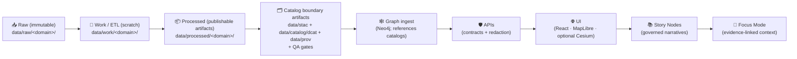
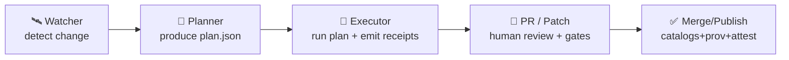

<!--
📌 tools/ is the repo’s *governed toolchain surface* for building + validating KFM artifacts.
🗓️ Last updated: 2026-01-26
🔁 Review cycle: 90 days (or anytime pipeline order / catalogs / policy changes)
🧭 Alignment: Master Guide v13 (contract-first + evidence-first + one canonical home per subsystem)
🧪 Scientific posture: Verification + Validation + Uncertainty Quantification (V&V&UQ) for anything “model-y”
🧾 Provenance posture: STAC + DCAT + PROV are the canonical publish boundary
🔐 Security posture: deny-by-default network, hostile-input assumptions, and Prompt Gate for AI/tooling
-->

<div align="center">

# 🛠️ `tools/` — Kansas Frontier Matrix (KFM) Toolchain

**Deterministic • Provenance-aware • CI-friendly**  
**Build it once • verify it forever • ship with a paper trail** 🧾✅

<!-- Core runtime badges -->


<!-- Governance / assurance badges -->


<!-- Geo / UI delivery badges -->


<!-- Storage / distribution badges -->


<!-- Infra badges -->


</div>

> **TL;DR:** `tools/` is the **governed command surface** that builds, validates, packages, and publishes KFM artifacts **without bypassing governance**.  
> It is intentionally **not** “business logic” and it is intentionally **not** “a scripts junk drawer.”  
> If it touches `data/processed/` (or produces any publish-looking output), it must also produce catalogs + provenance 🧾🧬.

> [!IMPORTANT]
> **MCP** = **Methods, Controls & Processes** *(a.k.a. “Master Coder Protocol” — lab notebook + receipts)* 🧪🧾  
> Tools must support MCP by producing **re-run-able outputs**, **linkable provenance**, and **reviewable diffs** — without becoming domain/business logic.

---

<details>
<summary><b>🧭 Table of contents</b></summary>

- [🧠 Quick links](#quick-links)
- [🧭 Repo invariants](#repo-invariants)
- [🧱 Non-negotiable pipeline order](#non-negotiable-pipeline-order)
- [🎯 What belongs in tools](#what-belongs-in-tools)
- [🧭 Boundaries: tools vs scripts vs src vs mcp](#boundaries-tools-vs-scripts-vs-src-vs-mcp)
- [🗂️ Tool registry & manifests](#tool-registry--manifests)
- [🧾 Contracts & schemas](#contracts--schemas)
- [🧾 Run manifests & JSON canonicalization](#run-manifests--json-canonicalization)
- [🎲 Determinism & reproducibility levels](#determinism--reproducibility-levels)
- [🧪 Artifact QA matrix](#artifact-qa-matrix)
- [✅ Validation rings (QA gates)](#validation-rings-qa-gates)
- [🤖 Agent toolchain: Watcher–Planner–Executor](#agent-toolchain-watcherplannerexecutor)
- [📦 Data staging + catalog locations](#data-staging--catalog-locations)
- [🧩 Dual-format geo packaging: GeoParquet + PMTiles](#dual-format-geo-packaging-geoparquet--pmtiles)
- [📦 OCI artifact registry distribution](#oci-artifact-registry-distribution)
- [📦 Offline packs & field ops](#offline-packs--field-ops)
- [🧵 Story Nodes, Pulse Threads, Concept Nodes](#story-nodes-pulse-threads-concept-nodes)
- [🗺️ Geo & mapping utilities](#geo--mapping-utilities)
- [🛰️ Remote sensing utilities](#remote-sensing-utilities)
- [🧊 Imaging & compression utilities](#imaging--compression-utilities)
- [🧱 3D / WebGL / scene utilities](#3d--webgl--scene-utilities)
- [🩺 Graph health checks](#graph-health-checks)
- [🧠 Graph & DB utilities](#graph--db-utilities)
- [📊 Statistical evidence utilities](#statistical-evidence-utilities)
- [🧪 Modeling/ML/simulation utilities](#modelingmlsimulation-utilities)
- [🔐 Security posture](#security-posture)
- [📡 Telemetry & observability](#telemetry--observability)
- [⚡ Performance & scaling notes](#performance--scaling-notes)
- [🌍 Federation & cross-matrix interoperability](#federation--cross-matrix-interoperability)
- [🧩 Contributing a new tool](#contributing-a-new-tool)
- [📚 Project reference library](#project-reference-library)
- [🧾 Metadata](#metadata)
- [🕰️ Version history](#version-history)

</details>

---

<a id="quick-links"></a>
## 🧠 Quick links

- 📘 **Master Guide v13** (repo contract) → `docs/MASTER_GUIDE_v13.md` *(or source doc mirror)*[^kfm_v13]
- 📏 **Schemas & contracts (source of truth)** → `schemas/`
- 🧱 **Repo governance gates** → `docs/governance/REVIEW_GATES.md`
- 🧪 **MCP receipts / lab notebook** → `mcp/README.md`[^mcp_receipts]
- 🧪 **Canonical pipelines** → `src/pipelines/`
- 🕸️ **Graph build & ontology bindings** → `src/graph/`
- 🛡️ **API boundary** → `src/server/` *(UI does not query graph directly)*[^kfm_v13]
- 🌐 **UI** (React · MapLibre · optional Cesium) → `web/`[^ui_arch]
- 🗂️ **Data lifecycle** → `data/README.md` *(staging rules + catalogs)*[^data_layout]
- 🛡️ **Policy pack** (OPA/Conftest) → `tools/validation/policy/*.rego`[^policy_pack]
- 🔏 **Releases** (bundles, SBOMs, attestations) → `releases/`
- 🧾 **Citation metadata** → `CITATION.cff`
- ✅ **Tests** → `tests/README.md`

---

<a id="repo-invariants"></a>
## 🧭 Repo invariants

> [!IMPORTANT]
> These are **guardrails**, not preferences. If a tool would violate these, redesign the tool.

### ✅ One canonical home per subsystem 🧱
No mystery duplicates.

- pipelines → `src/pipelines/`
- graph → `src/graph/`
- API boundary → `src/server/`
- UI → `web/`
- schemas → `schemas/`
- governed narratives → `docs/reports/story_nodes/` (or your chosen canonical home)

### ✅ Contract-first 📏
Schemas and API contracts are first-class artifacts:
- implementations must conform
- changes require versioning + compatibility checks
- tools validate against contracts **by default** (not “optional if you remember”)

### ✅ Evidence-first + provenance-first 🧾🧬
No “published-looking output” without boundary artifacts:
- **STAC + DCAT + PROV** required **before**:
  - graph ingest
  - API exposure
  - UI consumption / Story Node linking[^stac_dcat_prov]
- **Raw data is immutable**; “work” is ephemeral; “processed” is governed evidence.[^immutability]

### ✅ Deterministic by default 🎲🚫
Given the same inputs + config + seed, tools must produce the same outputs (**ordering included**).

### ✅ Focus Mode is advisory-only, citation-required 🧠🧾
- Focus Mode must cite evidence; **no uncited assertions**.[^focus_mode]
- If citations can’t be produced, Focus Mode refuses or clearly returns “insufficient evidence.”
- Focus Mode never takes autonomous actions (it proposes; humans approve).[^focus_mode]

### ✅ Human-centered + sovereignty-aware 🌾🧑‍🤝‍🧑
Tools shape decision artifacts:
- respect consent, agency, and auditability
- treat sensitivity/classification as **data**, enforced by gates[^sensitivity]
- prefer least privilege, least surprise

---

<a id="non-negotiable-pipeline-order"></a>
## 🧱 Non-negotiable pipeline order

> [!IMPORTANT]
> This ordering is not “architecture style.” It’s a **governance boundary**.[^kfm_v13]

**Raw → Work/ETL → Processed → Catalogs (STAC/DCAT/PROV + QA) → Graph → APIs → UI → Story Nodes → Focus Mode**



**Practical implication:** `tools/` must never provide “shortcuts” that skip catalogs + provenance.

---

<a id="what-belongs-in-tools"></a>
## 🎯 What belongs in tools

`tools/` is for **reusable, CI-friendly tooling** that builds/validates artifacts in the governed pipeline.

✅ Good fits:
- Catalog builders + validators (STAC/DCAT/PROV; required fields; link checks)
- Deterministic ID/hashing utilities (stable IDs, checksums, manifests)
- Format integrity tooling (COG validation, GeoParquet schema checks, geometry validity)
- Policy enforcement tooling (OPA/Conftest; “no publish without provenance,” “no downgrade”) [^policy_pack]
- Graph/DB loaders that **ingest from catalogs** (no ad-hoc inserts)
- Release packaging (SBOM, signatures, attestations)
- CI entrypoints (non-interactive, stable exit codes)
- Scientific integrity harnesses (V&V + UQ smoke checks, regression tests)[^mcp_receipts]
- Agent wrappers that operate via reviewable artifacts (Watcher/Planner/Executor that opens PRs and emits receipts)[^wpe]
- Document/PDF portfolio extraction + manifests for indexing/search (governed library tooling)[^pdf_portfolios]
- Story Node / storyboard validators (citation ↔ manifest consistency checks)[^story_nodes]
- Offline pack builders (signed manifest; scoped catalogs; policy labels)[^offline_packs]

🚫 Not a fit:
- Long-lived services (APIs, daemons) → runtime/app folders
- Core domain/business logic → `src/` (importable, testable)
- One-off scripts that bypass provenance and approvals → keep in sandbox until promoted
- Anything that can’t run non-interactively (or can’t be made CI-safe)

---

<a id="boundaries-tools-vs-scripts-vs-src-vs-mcp"></a>
## 🧭 Boundaries: tools vs scripts vs src vs mcp

### `src/` = canonical behavior (the engine) 🏗️
ETL jobs, graph build, API logic, reusable libraries.

### `tools/` = governed toolchain (the verified command surface) 🛠️
Thin entrypoints that call `src/`, run validators, emit provenance, and produce release-quality artifacts.

### `scripts/` = convenience orchestration (the buttons/levers) 🧰
Local ops + developer helpers + environment glue. Preferred pattern: **scripts call tools**, tools call src.

### `mcp/` = receipts & scientific record (the lab notebook) 🧪🧾
Run receipts, experiment logs, model cards, governance checklists.[^mcp_receipts]

> [!TIP]
> If you’re implementing core behavior inside `tools/`, that’s a smell.  
> Put the logic in `src/` and keep `tools/` as predictable CLI + validator layer.

---

<a id="tool-registry--manifests"></a>
## 🗂️ Tool registry & manifests

To keep `tools/` governable at scale, treat tools like **declared assets**, not “whatever is in a folder.”

### ✅ Recommended: one manifest per tool
Store under `tools/manifests/<tool>.yaml` (or `.json`) so CI can:
- list the governed tool surface (what exists)
- validate defaults (dry-run, network posture, output locations)
- generate docs (help text, examples) automatically

Example (minimum viable):

```yaml
name: "catalog_qa"
entrypoint: "tools/validation/catalog_qa/run_catalog_qa.py"
owner: "@kfm-engineering"
inputs:
  - "data/stac/**"
  - "data/catalog/dcat/**"
  - "data/prov/**"
outputs:
  - "reports/catalog_qa/**"
modes:
  dry_run: true
  apply: false
network:
  default: "deny"
determinism:
  stable_sorting: true
  seeded: false
gates:
  - "schema_valid"
  - "required_fields"
  - "href_integrity"
  - "license_required"
  - "prov_required_for_publish"
```

> [!NOTE]
> A manifest is not a replacement for docs — it’s the **machine-checkable** view of governance.

---

<a id="contracts--schemas"></a>
## 🧾 Contracts & schemas

> [!IMPORTANT]
> **Schemas live at repo root:** `schemas/` is the canonical source of truth.  
> Tools must validate against contracts by default.

### ✅ Contract artifact types
- JSON Schema (STAC/DCAT/PROV, Story Nodes, telemetry, offline pack manifests)
- API boundary contracts (OpenAPI, GraphQL SDL)
- Tool manifests (the governed command surface)
- Dataset metadata contracts (schema, units, CRS, license, sensitivity tags)

### ✅ Story Nodes are governed “machine-ingestible” narratives
A valid Story Node must:
- include provenance/citations for claims
- reference graph entities via stable IDs
- distinguish fact vs interpretation/inference[^story_nodes]

---

<a id="run-manifests--json-canonicalization"></a>
## 🧾 Run manifests & JSON canonicalization

Run manifests solve a boring-but-critical problem: **stable identity for “a run.”**

### ✅ Required for publish-like outputs
If a tool produces evidence (or promotes to `processed/`), it should emit:
- `run_context.json` *(human-readable receipt)*
- `run_manifest.json` *(machine-precise inventory + hashes)*[^run_manifest]

### ✅ Canonicalization rule
Canonicalize JSON before hashing (e.g., RFC 8785/JCS style):
- stable key ordering
- stable number serialization
- whitespace ignored
- stable arrays where order should not matter[^run_manifest]

> [!TIP]
> This does not replace PROV — it makes PROV more usable by giving each run a stable, content-derived identity.

---

<a id="determinism--reproducibility-levels"></a>
## 🎲 Determinism & reproducibility levels

Not everything needs hermetic builds — but everything needs auditability.

| Level | Name | Promise | Typical use |
|---:|---|---|---|
| R0 | Deterministic | Same inputs+config+seed ⇒ same outputs | most tools |
| R1 | Provenance-complete | R0 + complete PROV + catalog pointers | publishable evidence |
| R1.5 | Idempotent-run | R1 + canonical `run_manifest.json` hash | ingestion/promotion tooling |
| R2 | Rebuildable | R1 + pinned deps + env captured | critical releases |
| R3 | Hermetic | R2 + no network + fully captured env | highest assurance |

> [!TIP]
> If you don’t know which level you need, default to **R1** for anything that touches `processed/`.

---

<a id="artifact-qa-matrix"></a>
## 🧪 Artifact QA matrix

Use this matrix to decide which validators must run **before promotion** ✅

| Artifact type | Minimum checks | Extra checks (recommended) |
|---|---|---|
| 📄 JSON/JSON-LD (STAC/DCAT/PROV) | schema + required fields + link resolution | URI normalization + SPDX license lint |
| 🧾 Run manifests | schema + canonicalization + hash recompute | inventory ↔ filesystem cross-check |
| 🧭 Vector (GeoParquet/GeoJSON/FlatGeobuf) | schema + CRS + geometry validity | topology rules + simplification policy |
| 🧱 PMTiles | header validity + metadata present + bounds/zoom sanity | layer budgets + attribution propagation |
| 🛰️ Raster (COG/GeoTIFF/NetCDF) | COG layout + CRS + bounds + nodata | overview completeness + tiling alignment |
| 🗄️ Tabular (Parquet/CSV) | schema + types + missingness report | drift checks + range checks |
| 📦 Offline packs | manifest schema + checksums + policy tags | signature verify + “no orphan assets” scan |
| 📚 Story Nodes | schema + citations present + evidence refs resolvable | citation ↔ manifest consistency checks |
| 🧠 ML artifacts | metrics schema + dataset refs + seeds | calibration + fairness slices + uncertainty |
| 🧮 Simulation outputs | config+seed captured + deterministic rerun | V&V smoke tests + UQ summary |
| 📦 OCI artifacts | digest pinned + signature verified | referrer integrity + SBOM present |

---

<a id="validation-rings-qa-gates"></a>
## ✅ Validation rings (QA gates)

Think in rings (each ring blocks promotion if it fails):

### Ring 0: Structure 🧱
- JSON parses
- schema validation (STAC/DCAT/PROV + extensions)
- required files exist

### Ring 1: Integrity 🔗
- checksums/manifest inventory
- deterministic IDs present
- run manifest hash recompute + match
- atomic publish (no half-state)

### Ring 2: Semantics 🧠
- CRS correctness + axis order
- geometry validity (and any allowed repair policy)
- raster sanity (nodata, resolution, alignment)
- time/bounds sanity (Kansas bounds + plausible ranges)

### Ring 3: Statistical & scientific sanity 🧪📊
- drift checks
- residual diagnostics where applicable
- uncertainty summaries (where applicable)
- “smell tests” for simulation invariants

### Ring 4: Governance & safety 🔐
- license required before publish
- classification propagation (no downgrade)
- sensitive field redaction rules (including location generalization)[^sensitivity]
- policy tests (OPA/Conftest)
- secrets scans + dependency hygiene

### Ring 5: AI integrity 🧠🧾
- Focus Mode: no uncited assertions; refuse if no evidence
- Prompt Gate: prompt-injection defense + tool execution constraints[^prompt_gate]

---

<a id="agent-toolchain-watcherplannerexecutor"></a>
## 🤖 Agent toolchain: Watcher–Planner–Executor

KFM supports agent-assisted workflows — only when they behave like governed tools:
**deterministic, reviewable, provenance-emitting, PR-based**.[^wpe]



### 🛰️ Watcher (detect change → propose)
- scans a defined surface (drop folder, feeds, updated catalogs)
- emits an immutable event artifact:
  - `event.json` (what changed)
  - `inputs.json` (candidate inputs)
- default: **no network** unless `--allow-network`

### 🧭 Planner (propose plan → deterministic + diffable)
- turns events into a deterministic plan:
  - exact tool invocations
  - expected inputs/outputs
  - policy gates to run
  - rollback behavior
- can propose schema evolution safely (e.g., generate migration SQL in PR)[^schema_drift]

### 🧾 Executor (apply plan → PR-based + attested)
- executes in controlled environment
- produces:
  - artifacts + updated STAC/DCAT/PROV
  - structured reports
  - MCP run receipt
  - SBOM + signature/attestation for publish-like artifacts (SLSA-ish)[^slsa_attest]
- opens PR (or produces a patch) rather than mutating protected branches

> [!IMPORTANT]
> Automation is not a bypass — it is a more disciplined contributor.

---

<a id="data-staging--catalog-locations"></a>
## 📦 Data staging + catalog locations

KFM data work is staged and traceable, with **one canonical home per dataset**.[^data_layout]

```text
data/
├── sources/                     # retrieval manifests + checksums + licenses (recommended)
├── raw/
│   └── <domain>/                # immutable as-received data
├── work/
│   └── <domain>/                # intermediates / scratch (rebuildable)
├── processed/
│   └── <domain>/                # publishable evidence artifacts
├── stac/
│   ├── collections/
│   └── items/
├── catalog/
│   └── dcat/                    # DCAT JSON-LD datasets/distributions
└── prov/                        # PROV bundles (JSON-LD recommended)
```

> [!IMPORTANT]
> `raw/` is never edited; `work/` is ephemeral; `processed/` is governed evidence.[^immutability]

---

<a id="dual-format-geo-packaging-geoparquet--pmtiles"></a>
## 🧩 Dual-format geo packaging: GeoParquet + PMTiles

KFM supports dual-purpose geospatial outputs:
- **GeoParquet** → analytics & bulk query
- **PMTiles** → fast web delivery & offline packs (single-file archive)

Toolchain implications:
- deterministic build of both outputs from the same processed dataset
- catalogs link both distributions (STAC assets + DCAT distributions)
- provenance records tile-build parameters (zoom range, simplification, tiler version)[^pmtiles_dual_pack]

> [!TIP]
> Treat GeoParquet + PMTiles as a *pair*: analysis runs on GeoParquet; UI serves PMTiles; both point back to one evidence root.

---

<a id="oci-artifact-registry-distribution"></a>
## 📦 OCI artifact registry distribution

For large artifacts (PMTiles, GeoParquet, COGs, model bundles), KFM can leverage **OCI registries** as storage/distribution:
- push arbitrary artifacts with **ORAS**
- sign/verify with **Cosign** (Sigstore patterns)
- attach SBOMs/attestations as OCI referrers
- reference artifacts by immutable **digest** inside STAC/DCAT/PROV[^oci_registry]

> [!IMPORTANT]
> OCI is a distribution channel — not a governance bypass.  
> Catalogs + PROV remain the canonical boundary, and policy gates still apply.

---

<a id="offline-packs--field-ops"></a>
## 📦 Offline packs & field ops

KFM supports offline-first usage (field researchers, educators, rural connectivity). Offline packs are still publish-like artifacts.[^offline_packs]

### ✅ Offline pack should include
- pre-rendered tiles (PMTiles/MBTiles) for a defined AOI
- slimmed catalogs (STAC/DCAT/PROV) scoped to the pack
- signed manifest (checksums + versions + policy tags)
- credits bundle (attribution + licensing)
- optional: on-device limited Focus Mode only if policy allows

### ✅ Governance requirement
Offline packs must pass QA rings and carry policy labels (classification, sensitivity).

---

<a id="story-nodes-pulse-threads-concept-nodes"></a>
## 🧵 Story Nodes, Pulse Threads, Concept Nodes

These are governed content artifacts that connect datasets to narratives and AI context.

### 📚 Story Nodes (governed narratives)
Story Nodes are markdown + structured metadata:
- citations required
- link to datasets via catalog IDs
- link entities via stable graph IDs
- distinguish fact vs interpretation/inference[^story_nodes]

**Tooling** in `tools/content/` should:
- validate Story Node schema + citation integrity
- generate/validate `storyboard.json` (for UI playback mode) if used
- emit provenance of story construction (what sources were used)

### 🧵 Pulse Threads (recurring evidence-linked updates)
- lightweight “what’s new + why it matters”
- cadence + scope + evidence refs in metadata
- “no unsourced assertions” lint

### 🧠 Concept Nodes (concept-as-entity anchors)
- shared concept IDs + aliases + policy tags
- bind datasets + story nodes to stable anchors
- safe for Focus Mode to cite as governed context (with provenance pointers)

---

<a id="geo--mapping-utilities"></a>
## 🗺️ Geo & mapping utilities

### CRS & units are non-negotiable 📐
- refuse unknown CRS by default
- log CRS for inputs and outputs
- record reprojections in provenance

KFM standard is **WGS84 (EPSG:4326)** for web consistency.[^crs_wgs84]

> [!TIP]
> Prefer wrappers around mature tools (GDAL/PROJ), with stable args + captured versions.  
> Example reprojection patterns should be documented (e.g., `ogr2ogr -t_srs EPSG:4326 ...`).[^gdal_ogr2ogr]

### Tile serving strategies (both valid) 🧱
- PostGIS tile endpoints (e.g., `ST_AsMVT`) for dynamic serving
- Prepackaged tiles (PMTiles/MBTiles) for static hosting + offline packs

---

<a id="remote-sensing-utilities"></a>
## 🛰️ Remote sensing utilities

Remote sensing tooling should prefer **derived products + provenance** over raw archive dumps:
- record AOI + time window
- record compositing + masking logic
- export as COGs (and/or cloud-optimized NetCDF where relevant)
- emit STAC Items per logical unit

---

<a id="imaging--compression-utilities"></a>
## 🧊 Imaging & compression utilities

Images are evidence too — compression choices can change meaning 🧾
- detect bit depth / alpha / nodata semantics
- warn on lossy conversions for scientific rasters
- emit a small report with chosen params + rationale

---

<a id="3d--webgl--scene-utilities"></a>
## 🧱 3D / WebGL / scene utilities

When we ship 3D, we ship **performance budgets + provenance** 🧊⚡
- validate glTF / 3D Tiles manifests
- generate/verify LOD pyramids
- embed attribution + license + provenance pointers
- check GPU budgets (triangles, textures) for target devices

---

<a id="graph-health-checks"></a>
## 🩺 Graph health checks

Recommended recurring integrity practice:
- orphan scan (nodes/edges)
- constraint checks
- drift summary
- publish health report + suggested fixes (PR plan), not silent mutations

---

<a id="graph--db-utilities"></a>
## 🧠 Graph & DB utilities

### Neo4j ingest 🕸️
Graph ingest must be downstream of catalogs:
- reference STAC/DCAT/PROV (don’t duplicate bulky data)
- enforce invariants: “every dataset links to provenance,” “no orphan entities”

### PostGIS helpers 🗄️
- staging tables + transactional swaps (load → validate → swap)
- stable query shapes + stable sort orders (determinism)
- treat query plans as artifacts for critical pipelines

---

<a id="statistical-evidence-utilities"></a>
## 📊 Statistical evidence utilities

Statistics is evidence engineering, not “extra math” 📈🧾
- effect sizes + uncertainty (CIs/credible intervals), not just p-values
- drift checks and residual diagnostics
- declared priors (Bayesian tools) + sensitivity summaries
- log multiple comparisons and guard against p-hacking

---

<a id="modelingmlsimulation-utilities"></a>
## 🧪 Modeling/ML/simulation utilities

Modeling tools must behave like scientific instruments 🧪🔬:
- capture params + seeds
- record dataset IDs (catalog pointers)
- emit evaluation artifacts (metrics + plots where relevant)
- write MCP receipts when results influence decisions
- include V&V + UQ summaries for simulation outputs

---

<a id="security-posture"></a>
## 🔐 Security posture

Treat `tools/` as part of the threat model:
- inputs are hostile (archives, rasters, PDFs, GeoJSON, model files)
- allowlist file types; enforce size + decompression limits (zip bombs)
- sanitize paths; refuse traversal
- SSRF defenses for network fetchers
- never print secrets; never require secrets in CLI args

### 🧠 Prompt Gate (AI + tool safety)
For AI-assisted workflows:
- policy rules are centrally defined and versioned
- outputs are scanned for required citations (“no uncited assertions”)
- tool execution is sandboxed / least privilege
- unsafe requests are blocked by allow/deny lists[^prompt_gate]

### 🔒 Privacy & inference control (defense-in-depth)
When datasets include sensitive fields or exact locations:
- enforce redaction + generalization policies
- apply privacy-aware release techniques where applicable:
  - k-anonymity / l-diversity / t-closeness
  - perturbation methods
  - query auditing / inference control[^privacy_inference]

> [!IMPORTANT]
> Security references in the library are for defensive posture only.  
> Tools must never provide offense automation.

---

<a id="telemetry--observability"></a>
## 📡 Telemetry & observability

Telemetry is a **contracted surface** (schema-first):
- event schemas live under `schemas/telemetry/`
- tools validate telemetry payloads in CI
- logs should be JSONL + a minimal human-readable summary

Recommended: track system sustainability signals (energy consumption / carbon footprint) for long-running workflows.[^energy_telemetry]

---

<a id="performance--scaling-notes"></a>
## ⚡ Performance & scaling notes

When tools grow:
- chunk work for parallelism (tiles/partitions)
- introduce explicit materialization boundaries
- keep caches provenance-aware
- profile first, then optimize

> Speed is good — but correctness and provenance come first.

---

<a id="federation--cross-matrix-interoperability"></a>
## 🌍 Federation & cross-matrix interoperability

KFM is federation-ready:
- export/import at the **catalog boundary** (STAC/DCAT/PROV)
- shared contracts enable cross-region audits and discovery
- OCI registries enable artifact reuse across regions (digest pinned; signed)[^oci_registry]

Ideas that fit naturally in `tools/`:
- `tools/catalogs/export_bundle.py` → export catalogs + checksums
- `tools/catalogs/import_bundle.py` → validate + ingest external catalogs (deny-by-default)
- `tools/contracts/package_schemas.py` → publish versioned schema pack

> [!NOTE]
> Federation strengthens governance: shared contracts make audits and cross-region evidence verifiable.

---

<a id="contributing-a-new-tool"></a>
## 🧩 Contributing a new tool

### ✅ Definition of done
A tool is “real” when it has:
- CLI: `--help`, `--version`, and **≥ 2 examples**
- deterministic defaults (stable ordering; seeded randomness when applicable)
- structured logs + stable exit codes
- writes outputs to correct stage (raw/work/processed)
- emits/updates catalogs + provenance for publish-like outputs
- emits run manifest for publish/promote steps
- CI target (smoke test minimum)
- clear home in folder map

### 🪜 Promotion ladder (scripts → governed tools)
1) prototype in `sandbox/` or notebook  
2) move core logic into `src/`  
3) add thin `tools/` CLI wrapper  
4) add validators + provenance emission  
5) add run manifest + canonical hashing  
6) add CI target + docs + examples  
7) promote to governed surface ✅

---

## 📁 Expected folder layout (target)

```text
🛠️ tools/
├── 📘 README.md
├── 🧰 _lib/                      # shared helpers (logging, env validation, guardrails)
├── 🧾 manifests/                 # tool manifests (one per tool)
├── 🛰️ agents/                    # Watcher–Planner–Executor entrypoints (PR-based automation)
├── 🧲 ingest/                    # controlled ingest entrypoints (thin wrappers)
│   ├── docs/                     # doc/PDF ingestion → text + metadata + graph links (gated)
│   └── feeds/                    # scheduled fetchers (deny-by-default network)
├── 🏷️ catalogs/                  # STAC/DCAT emitters + catalog build helpers
├── ✅ validation/                # fast QA gates (schema/link/prov/policy)
│   ├── ⚡ catalog_qa/             # PR-friendly catalog QA gate
│   ├── 🛡️ policy/                # OPA/Conftest policy pack
│   ├── 🧭 geo/                   # CRS/geom/raster validators
│   ├── 📊 stats/                 # drift/effect-size reports
│   ├── 🔐 security/              # hostile-input checks (zip bombs, traversal, SSRF)
│   └── 📡 telemetry/             # validate event schemas + payloads
├── 🆔 id/                        # deterministic IDs, hashing, manifest tooling
├── 🧬 prov/                      # provenance helpers (PROV JSON-LD emitters)
├── 🧾 audit/                     # run manifests, canonical JSON hashing, AI ledger tooling
├── 📦 artifacts/                 # OCI/registry helpers (oras/cosign wrappers)
├── 📚 library/                   # extract PDF portfolios + build doc manifests/indexes
├── 🧵 content/                   # Story Nodes, storyboard.json, Pulse Threads, Concept Nodes
├── 🕸️ graph/                     # graph ingest helpers (must consume catalog roots)
│   └── 🩺 health/                # graph health checks
├── 🗄️ db/                        # PostGIS helpers, migrations, query packs
├── 🗺️ geo/                       # GDAL wrappers, tiling, reprojection, COG/PMTiles utilities
├── 🛰️ rs/                        # remote sensing helpers
├── 🧊 3d/                        # 3D Tiles / glTF tooling
├── 🌐 web/                       # map build helpers (styles, offline packs, export tools)
├── 🤖 ml/                        # train/eval orchestration (must emit datasets + metrics refs)
├── 🧮 simulation/                # scenario runners (must record configs + seeds)
├── 🔏 attest/                    # SBOM + signing helpers
├── ⚡ perf/                      # profiling harnesses + performance budgets
└── 🧪 ci/                        # deterministic entrypoints used by CI
```

---

<a id="project-reference-library"></a>
## 📚 Project reference library

These project files inform the toolchain design (determinism, provenance, governance, security, scaling, and UX constraints).  
Keep this list updated when the library changes.

### 🧭 Core KFM contracts & architecture
- **Master Guide v13 (contract-first + evidence-first)** → `docs/MASTER_GUIDE_v13.md` (or mirror: `MARKDOWN_GUIDE_v13.md.gdoc`)[^kfm_v13]
- **Platform overview & roadmap** → `Kansas Frontier Matrix (KFM) – Comprehensive Platform Overview and Roadmap.pdf`[^roadmap]
- **Technical documentation** → `Kansas Frontier Matrix (KFM) – Comprehensive Technical Documentation.pdf`[^tech_doc]
- **Architecture & design** → `Kansas Frontier Matrix (KFM) – Comprehensive Architecture, Features, and Design.pdf`[^arch_design]
- **Expanded onboarding** → `📚 Kansas Frontier Matrix (KFM) – Expanded Technical & Design Guide.pdf`[^expanded_guide]

### 🤖 AI, governance, and safety
- **AI system overview** → `Kansas Frontier Matrix (KFM) – AI System Overview 🧭🤖.pdf`[^focus_mode]
- **MCP / Scientific method receipts** → `Scientific Method _ Research _ Master Coder Protocol Documentation.pdf`[^mcp_receipts]
- **Data mining privacy / inference control** → `Data Mining Concepts & applictions.pdf`[^privacy_inference]

### 🌐 UI + storytelling
- **UI technical architecture guide** → `Kansas Frontier Matrix (KFM) – Comprehensive UI System Overview (Technical Architecture Guide).pdf`[^ui_arch]

### 🗺️ Geospatial & mapping references
- **Mapping hub design** → `Kansas-Frontier-Matrix_ Open-Source Geospatial Historical Mapping Hub Design.pdf`[^mapping_hub]
- **Geospatial analysis cookbook (Python)** → `KFM- python-geospatial-analysis-cookbook-...-with-python.pdf`[^gdal_ogr2ogr]

### 🧾 Standards + writing conventions
- **Advanced GitHub Markdown patterns** → `Comprehensive Markdown Guide_ Syntax, Extensions, and Best Practices.docx`[^markdown_guide]

### 📦 Reference portfolios (PDF Portfolios) 🗃️
Some “bookshelves” are packaged as **PDF Portfolios** and should be extracted into normal folders for indexing/search.[^pdf_portfolios]

- `AI Concepts & more.pdf` *(PDF Portfolio)*
- `Data Managment-Theories-Architures-Data Science-Baysian Methods-Some Programming Ideas.pdf` *(PDF Portfolio)*
- `Maps-GoogleMaps-VirtualWorlds-Archaeological-Computer Graphics-Geospatial-webgl.pdf` *(PDF Portfolio)*
- `Various programming langurages & resources 1.pdf` *(PDF Portfolio)*
- `Mapping-Modeling-Python-Git-HTTP-CSS-Docker-GraphQL-Data Compression-Linux-Security.pdf` *(PDF Portfolio)*
- `Geographic Information-Security-Git-R coding-SciPy-MATLAB-ArcGIS-Apache Spark-Type Script-Web Applications.pdf` *(PDF Portfolio)*

> [!TIP]
> Add a governed extractor like `tools/library/extract_pdf_portfolio.py` that emits:
> - extracted PDFs
> - `manifest.json` (filename, sha256, source portfolio, extracted_at)
> - optional local search index for docs (dev-only)

---

<a id="metadata"></a>
## 🧾 Metadata

```yaml
title: "tools/ — Kansas Frontier Matrix Toolchain"
path: "tools/README.md"
version: "v0.7.0"
last_updated: "2026-01-26"
review_cycle: "90 days"
governance: "FAIR + CARE aligned; sovereignty-aware"
pipeline_order: "Raw → Work/ETL → Processed → STAC/DCAT/PROV catalogs → Neo4j graph → APIs → UI → Story Nodes → Focus Mode"
```

---

<a id="version-history"></a>
## 🕰️ Version history

| Version | Date | Summary | Author |
|---:|---|---|---|
| v0.7.0 | 2026-01-26 | **Upgrade pass (alignment + safety + tool governance):** clarified tool registry/manifest expectations, strengthened Prompt Gate + “no uncited assertions” posture, expanded offline pack + OCI artifact distribution guidance, folded Story Node storyboard validation into governed tooling, added privacy/inference-control guidance (k-anonymity/l-diversity/t-closeness + query auditing), and updated reference library to include all PDF portfolios. | KFM Engineering |
| v0.6.0 | 2026-01-20 | Integrated run manifests + JSON canonicalization (idempotent runs), OCI artifact registry distribution (ORAS + Cosign + digest pinning), Pulse Threads + Concept Nodes as governed content artifacts, weekly graph health checks, and GeoParquet + PMTiles dual-format packaging. | KFM Engineering |
| v0.5.0 | 2026-01-19 | Aligned with v13 staging (`data/raw|work|processed`), added Watcher–Planner–Executor guidance, strengthened provenance-first + citation-required Focus Mode rules, expanded offline pack expectations; refreshed reference library. | KFM Engineering |
| v0.4.0 | 2026-01-13 | Added determinism levels, artifact QA matrix, stats evidence tooling, 3D/WebGL guidance, remote sensing + compression notes, federation framing; clearer promotion ladder. | KFM Engineering |
| v0.3.0 | 2026-01-11 | Aligned to Master Guide v13 invariants: contract-first + evidence-first; clarified canonical paths (`schemas/`, `src/*`, `web/`, `releases/`). | KFM Engineering |
| v0.2.0 | 2026-01-09 | Clarified boundaries (tools vs src/scripts/mcp), added tool contract + QA rings + security posture + folder map. | KFM Engineering |
| v0.1.0 | 2026-01-08 | Initial toolbox README draft. | KFM Engineering |

---

## 📎 Evidence notes (footnotes)

[^kfm_v13]: Master Guide v13: contract-first + evidence-first; API contracts first; UI layers must tie back to provenance and CARE constraints; Story Nodes/Focus Mode have strict citation and interpretation rules.  
[^data_layout]: Data lifecycle layout: raw/work/processed + catalogs/prov as publish boundary.  
[^immutability]: Raw input data is immutable/read-only; transformations are deterministic/config-driven for reproducibility.  
[^stac_dcat_prov]: STAC/DCAT/PROV alignment and “catalog boundary artifacts before downstream stages.”  
[^policy_pack]: Policy-as-code posture (OPA/Conftest) and governance enforcement surface (license/classification/no-downgrade; deny-by-default).  
[^wpe]: Watcher–Planner–Executor pattern: PR-based automation, receipts, and attested outputs.  
[^focus_mode]: Focus Mode: evidence-backed, citation-enforced, advisory-only; includes AI provenance/ledger and “no uncited assertions.”  
[^prompt_gate]: Prompt Gate: prompt-injection defense, tool execution constraints, allow/deny lists, sandboxing.  
[^sensitivity]: Sensitivity controls: location generalization, policy tags, permission-based access; sovereignty-aware governance.  
[^run_manifest]: Run manifests + canonical JSON hashing to support idempotency and robust provenance linking.  
[^pmtiles_dual_pack]: Dual packaging: GeoParquet for analytics + PMTiles for web/offline; catalogs link both distributions.  
[^oci_registry]: OCI registry distribution: ORAS push/pull + Cosign signing + digest pinning; DCAT distributions reference immutable digests.  
[^offline_packs]: Offline packs: governed artifacts with signed manifests, scoped catalogs, and policy labels.  
[^story_nodes]: Story Nodes: machine-ingestible storytelling (markdown + citations + stable graph IDs) and optional storyboard playback metadata.  
[^ui_arch]: UI architecture: Focus Mode and provenance-first UX; citations as clickable footnotes; story playback + automated testing guidance.  
[^schema_drift]: Planner-driven schema drift handling: propose migrations/scripts in PR; controlled evolution.  
[^slsa_attest]: SLSA-ish attestations for build/release artifacts; signed provenance.  
[^energy_telemetry]: Telemetry includes sustainability/energy signals for long-running workflows.  
[^privacy_inference]: Privacy & inference control methods (k-anonymity, l-diversity, t-closeness, perturbation, query auditing).  
[^crs_wgs84]: WGS84 (EPSG:4326) as web-friendly standard; reprojection tracked in provenance.  
[^gdal_ogr2ogr]: GDAL/ogr2ogr reprojection patterns and geospatial tooling references.  
[^mapping_hub]: Mapping hub design patterns (catalogs, exports, interoperability, and doc knowledge base).  
[^tech_doc]: Technical documentation (security posture, scalability, validation, governance tooling).  
[^arch_design]: Architecture/design reference (system layering, UI-map patterns, optional 3D).  
[^expanded_guide]: Expanded onboarding guide (provenance-first, “map behind the map,” Focus Mode advisory-only and evidence-backed).  
[^roadmap]: Platform roadmap (artifact registries, Cosign/ORAS, federation, schema drift planning).