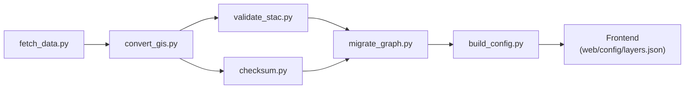

<div align="center">

# 🛠️ Kansas Frontier Matrix — **Tools**  
`/tools/`

**Utility Scripts · Data Pipelines · Validation & Deployment Helpers**

[](../.github/workflows/site.yml)
[](../.github/workflows/tests.yml)
[](../.github/workflows/codeql.yml)
[](../.github/workflows/trivy.yml)
[](https://pre-commit.com/)
[](../docs/)

</div>

---

## 🎯 Mission

The `/tools/` directory provides **automation utilities** that orchestrate data ingestion, validation, transformation, provenance tracking, and deployment across **Kansas Frontier Matrix (KFM)**.  
These are **developer-grade helpers**, not runtime dependencies, designed for **MCP-DL v6.3** reproducibility.

> *Each script is a documented instrument of reproducibility — leaving a transparent audit trail.*

---

## 🧱 Directory Structure

```text
tools/
├── fetch_data.py         # Fetch raw datasets from manifests
├── convert_gis.py        # Convert shapefiles/rasters → GeoJSON / COG GeoTIFF
├── validate_stac.py      # STAC 1.0 validation via JSON Schema
├── checksum.py           # Generate/verify SHA-256 sidecars for provenance
├── migrate_graph.py      # Load ETL outputs into Neo4j via Cypher batches
├── build_config.py       # Generate web/config/*.json from STAC metadata
├── notebooks/            # Jupyter prototyping space
└── utils/                # Common helpers: logging, env, constants
```

---

## ⚙️ Core Utilities

| Tool               | Functionality                                                                    | Standards / Tech |
| :----------------- | :-------------------------------------------------------------------------------- | :--------------- |
| **fetch_data.py**  | Reads `data/sources/*.json` → downloads archives/APIs, logs provenance & checksums | HTTP, PROV-O |
| **convert_gis.py** | Reprojects & converts GIS formats to open standards (GeoJSON/COG)                 | GDAL, EPSG:4326 |
| **validate_stac.py** | Validates metadata and schema alignment for STAC 1.0 Items                      | pystac, JSONSchema |
| **checksum.py**    | Generates and verifies SHA-256 integrity hashes for raw & processed datasets      | hashlib |
| **migrate_graph.py** | Imports processed layers into Neo4j graph with provenance and deduplication     | neo4j-driver |
| **build_config.py** | Auto-generates web configuration files from STAC metadata for frontend alignment | Python + JSON |

---

## 🚀 Makefile Integration

All major tools are callable through the root `Makefile`.

```bash
make fetch           # Fetch remote datasets
make convert         # Transform GIS data to open formats
make stac-validate   # Validate STAC Items and Collections
make checksums       # Generate & verify dataset checksums
make graph-migrate   # Load entities into Neo4j knowledge graph
make site-config     # Regenerate web/config/*.json
```

**Direct CLI Example:**

```bash
python tools/fetch_data.py --source data/sources/noaa_precip.json
python tools/convert_gis.py input.shp output.geojson --crs EPSG:4326
python tools/validate_stac.py data/stac/items/*
```

---

## 🧩 Data Flow Integration



Each tool logs its inputs, outputs, and hashes, forming a **verifiable provenance chain**.

---

## 🧪 Testing & CI Validation

- **Unit tests:** `tests/tools/` via `pytest`  
- **Pre-commit hooks:** YAML/JSON lint + static typing (`ruff`, `black`, `mypy`)  
- **CI workflows:** run full pipeline on PR (`tests.yml`)  
- **Artifacts:** validation reports + checksum logs stored in build artifacts  

Each tool supports:
```bash
--dry-run   # simulate without writing changes
--verbose   # expanded logging
--output    # specify output directory
```

---

## 🧮 Example End-to-End Pipeline

```bash
# 1. Download and hash source data
make fetch checksums

# 2. Convert to GeoJSON/COG, validate metadata
make convert stac-validate

# 3. Load to knowledge graph & rebuild configs
make graph-migrate site-config
```

Each stage emits a **timestamped, checksum-verified log** for deterministic reproducibility.

---

## 🧠 Development Best Practices

Every tool **must**:

1. Include a docstring + CLI help (`-h` / `--help`)  
2. Log actions with timestamps  
3. Use structured output (JSON logs when possible)  
4. Avoid global state; all inputs/outputs explicit  
5. Produce identical outputs for identical inputs (idempotent)  
6. Maintain **license headers** & provenance metadata  
7. Write **logs → `logs/{tool}.log`** for auditability  

> Prototypes live in `/tools/notebooks/` until validated and documented.

---

## 🧾 Provenance & Integrity

| Field        | Description                                      |
| :------------| :----------------------------------------------- |
| **Inputs**   | Source manifests, raw data, STAC metadata        |
| **Outputs**  | Processed datasets, provenance logs, web configs |
| **Dependencies** | Python 3.11+, GDAL, rasterio, pystac, neo4j-driver |
| **Integrity** | Verified via STAC validation & SHA-256 checks   |
| **Traceability** | Operation logs stored as artifacts in CI     |

---

## 🧠 MCP Compliance Checklist

| MCP Principle       | Implementation                                     |
| :------------------ | :------------------------------------------------ |
| Documentation-first | Docstrings, usage examples, and README references |
| Reproducibility     | Deterministic logic, checksum validation          |
| Provenance          | Input/output lineage tracking (PROV-O + hashes)   |
| Open Standards      | STAC 1.0, GeoJSON, EPSG:4326                      |
| Auditability        | CI logs, schema validation, archived artifacts    |
| Accessibility       | CLI UX + verbose logging                          |

---

## 🔗 Related Documentation

- **Data Ingestion** — `data/README.md`  
- **STAC Catalog** — `data/stac/README.md`  
- **Web Config** — `web/config/README.md`  
- **Architecture Overview** — `docs/architecture/system-architecture-overview.md`

---

## 🧾 Versioning & Metadata

| Field | Value |
| :---- | :---- |
| **Version** | `v1.6.0` |
| **Codename** | *Automation & Provenance Upgrade* |
| **Last Updated** | 2025-10-17 |
| **Maintainers** | @kfm-data · @kfm-engineering |
| **License** | MIT |
| **Alignment** | STAC 1.0 · PROV-O · FAIR Principles · MCP-DL v6.3 |
| **Maturity** | Stable / Production |

---

## 📜 License

Released under **MIT License**.  
© 2025 Kansas Frontier Matrix — developed under **MCP-DL v6.3** for deterministic, auditable, and reproducible data engineering.

> *“Tools are not throwaways — they are instruments of reproducibility.”*
