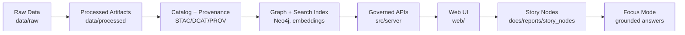

# 🧰 Tools


-6E40C9)

Developer utilities & operational scripts for the **Kansas Frontier Matrix (KFM)** monorepo—built to keep **code + data + docs** reproducible, traceable, and governance-compliant.  
The monorepo philosophy is intentional: *every artifact evolves in lockstep* so lineage is auditable from Git history **and** structured provenance logs.[^kfm-v13][^kfm-blueprint]

> [!IMPORTANT]
> **Tools do not “skip the line.”** If a tool creates/changes data, it must respect KFM’s canonical pipeline order and publish boundary artifacts (metadata catalogs + provenance) before anything gets loaded into the graph or served by APIs.[^kfm-v13]

---

## 🧭 Table of Contents

- [⚡ Quickstart](#-quickstart)
- [🧩 Why this folder exists](#-why-this-folder-exists)
- [🧭 Where `tools/` fits in KFM](#-where-tools-fits-in-kfm)
- [📦 What belongs in `tools/`](#-what-belongs-in-tools)
- [🧱 Tool contract (non-negotiables)](#-tool-contract-non-negotiables)
- [🗂️ Suggested folder layout](#️-suggested-folder-layout)
- [🧠 Tool playbooks](#-tool-playbooks)
  - [🗺️ Data & GIS](#️-data--gis)
  - [🧾 Catalog & Metadata](#-catalog--metadata)
  - [🧬 Provenance](#-provenance)
  - [🧠 AI / Focus Mode](#-ai--focus-mode)
  - [🧠 Graph & Indexing](#-graph--indexing)
  - [🛠️ Dev / Ops](#️-dev--ops)
- [➕ Adding a new tool](#-adding-a-new-tool)
- [🩺 Troubleshooting](#-troubleshooting)
- [📚 Sources used to ground this README](#-sources-used-to-ground-this-readme)

---

## ⚡ Quickstart

### 1) Bring up the KFM stack (preferred) 🐳

```bash
# From repo root (choose one):
docker compose up --build
# or
docker-compose up --build
```

### 2) Run tools inside the API container ✅

> [!TIP]
> If a tool needs PostGIS/Neo4j/GDAL/PROJ/etc., run it inside the container to match production-like dependencies and mounted volumes.[^kfm-blueprint]

```bash
# Design target examples:
docker compose exec api python -m tools.kfm --help
docker compose exec api python -m tools.kfm doctor
```

### 3) Run a pipeline (and validate it) 🔁

```bash
# Design target examples:
docker compose exec api python -m src.pipelines.run --pipeline pipelines/example/pipeline.yml
docker compose exec api python -m tools.kfm catalog validate
docker compose exec api python -m tools.kfm prov lint
```

> [!NOTE]
> Treat commands labeled **design target** as the intended UX/shape—even if the exact entrypoints evolve.

---

## 🧩 Why this folder exists

KFM needs repeatable utilities to keep a **single-repo system** consistent:

- 🔁 **Repeatable ETL helpers** that support plugin pipelines (ingest → transform → load), without bypassing them.[^kfm-v13]
- 🧬 **Provenance-first workflows** so every dataset and major derived artifact has lineage.[^kfm-v13]
- ✅ **Fail-closed governance** so missing metadata/license/provenance/schema causes a hard stop (local or CI).[^kfm-v13]

---

## 🧭 Where `tools/` fits in KFM

KFM’s canonical pipeline ordering (don’t skip steps):[^kfm-v13]



**Tools exist to make this ordering easy to follow**:
- scaffold pipeline/plugin templates 🧩
- validate artifacts before publish ✅
- lint provenance + metadata 🧬
- run “doctor” checks on the environment 🩺
- rebuild indexes (graph/search/embeddings) **only after** publish boundary artifacts 🧠

---

## 📦 What belongs in `tools/`

`tools/` is for **cross-cutting utilities** that don’t belong to runtime code or pipeline plugins.

**Typically belongs here ✅**
- Validators (schema/metadata/license/provenance/CRS/geometry)
- Scaffolding generators (new pipeline plugin + config + templates)
- Converters (format conversion, reprojection, tiling, simplification)
- Auditors (governance checks, “what changed?” diffs, checksum verification)
- Rebuilders (graph/search/embedding indices)
- “Doctor” scripts (environment sanity checks)

**Typically belongs elsewhere 🧭**
- ETL logic → `src/pipelines/` (plugins and orchestrator)[^kfm-v13]
- Graph loading code → `src/graph/`[^kfm-v13]
- API/runtime → `src/server/`[^kfm-v13]
- UI → `web/`[^kfm-v13]
- Story nodes & narrative outputs → `docs/reports/story_nodes/`[^kfm-v13]
- Schemas → `schemas/`[^kfm-v13]

---

## 🧱 Tool contract (non-negotiables)

### 1) Provenance-first 🧬
If a tool produces a derived artifact, it **must also** produce/update provenance (and link inputs → outputs), before that artifact is considered publishable.[^kfm-v13]

### 2) Fail closed 🚫
If required metadata/license/provenance/schema integrity is missing → **stop** and print *exactly what to fix* (and where).

> [!WARNING]
> CI should treat missing provenance/catalog artifacts as a hard failure.[^kfm-v13]

### 3) Deterministic + idempotent by default 🔁
Tools should be:
- **config-driven** (inputs/params recorded)
- **repeatable** (same inputs → same outputs)
- **idempotent** (safe to re-run)
- **logged** (stable IDs/hashes + clear run manifests)[^kfm-v13]

### 4) Sovereignty + classification propagation 🛡️
- No output can be **less restricted** than its inputs.
- Redaction/generalization rules must be enforced end-to-end.[^kfm-v13]

### 5) API boundary rule (don’t punch holes) 🧱
UI and external consumers must access governed data **via APIs**, not direct graph queries.[^kfm-v13]  
Tools that touch Neo4j should be treated as privileged operations (local dev + CI only).

### 6) Metadata + licensing are first-class 🧾
Geo artifacts require reliable metadata: identification, quality, spatial reference (CRS/projection), distribution/use policy, citation, temporal info, and contact/ownership.[^making-maps]  
When in doubt, assume works are copyrighted until you confirm otherwise.[^making-maps]

### 7) Evidence-first outputs 📌
If a tool produces human-readable reports (QA summaries, audits, story fragments), they must be **evidence-first**: every claim ties back to catalog/prov IDs (or citations).[^kfm-v13]

---

## 🗂️ Suggested folder layout

> [!NOTE]
> This is a recommended structure. Create folders as you implement tools.

```text
🧰 tools/
├─ 📘 README.md
├─ 🐍 kfm/                        # (recommended) Python package for a unified CLI
│  ├─ __init__.py
│  ├─ __main__.py                 # `python -m tools.kfm ...`
│  ├─ cli.py                      # Typer/Click entrypoint (recommended)
│  └─ commands/
│     ├─ doctor.py                # env + connectivity checks
│     ├─ data.py                  # GIS/data helpers (CRS, geometry QA, conversions)
│     ├─ catalog.py               # STAC/DCAT validators + generators
│     ├─ prov.py                  # provenance generators/linters (W3C PROV)
│     ├─ graph.py                 # Neo4j load/index helpers (post-publish only)
│     └─ ai.py                    # Focus Mode smoke tests / embedding jobs
├─ 🧪 fixtures/                   # tiny + public test inputs
├─ 🧾 templates/                  # scaffold templates (pipeline/plugin/metadata/prov)
└─ 🧪 tests/                      # unit tests for tools
```

---

## 🧠 Tool playbooks

### 🗺️ Data & GIS

**Typical jobs**
- Convert ↔ validate ↔ simplify (vector/raster)
- Reproject / normalize CRS
- Validate geometry + bounds + topology
- Validate temporal fields (time-series sanity)

**Core quality gates**
- ✅ Geometry validity (PostGIS `ST_IsValid*`) and human-readable error output.[^postgis-cookbook]
- ✅ CRS sanity (explicit EPSG; avoid “unknown CRS”)
- ✅ Coordinate range checks (no NaNs; lat/lon in plausible ranges if EPSG:4326)
- ✅ Temporal QA: catch missing/duplicate/outdated/implausible/ambiguous timestamps and time-zone mistakes.[^time-vis]

<details>
<summary><b>✅ Suggested commands (design targets)</b></summary>

```bash
# Vector geometry QA (design target)
python -m tools.kfm data validate-geoms --dsn "$POSTGIS_DSN" --table "data_processed.parcels"

# Reproject GeoJSON (design target)
python -m tools.kfm data reproject \
  --in data/raw/example/a.geojson \
  --out data/processed/example/a.geojson \
  --to-epsg 4326

# Temporal QA (design target)
python -m tools.kfm data validate-time \
  --in data/processed/example/events.parquet \
  --time-col observed_at \
  --timezone America/Chicago
```

</details>

> [!TIP]
> Prefer “small, composable” tools: one command = one contract, one output, one provenance update.

---

### 🧾 Catalog & Metadata

KFM treats catalogs + metadata as **publish boundary artifacts** (not optional).[^kfm-v13]

**Typical jobs**
- Ensure every `data/processed/**` artifact has:
  - a catalog entry (STAC/DCAT)
  - a provenance record (PROV)
  - a license + citation + CRS + temporal coverage

**Minimum metadata expectations**
- Identification (title/description)
- Quality notes (limits, known issues)
- Spatial reference (CRS/projection)
- Distribution/use policy + licensing
- Citation + temporal coverage + contact info[^making-maps]

<details>
<summary><b>✅ Suggested commands (design targets)</b></summary>

```bash
# Validate catalogs (design target)
python -m tools.kfm catalog validate --root data

# Generate catalog stubs for new processed outputs (design target)
python -m tools.kfm catalog scaffold --from data/processed/example --out data/catalog
```

</details>

---

### 🧬 Provenance

**What “good provenance” looks like**
A provenance file should capture:

- **Entities:** input raw files (source pointer + checksums) + output artifacts
- **Activity:** pipeline/tool name, timestamp, parameters/config hash
- **Agents:** who/what ran it (person + software version)[^kfm-v13]

> [!WARNING]
> If something doesn’t have provenance, it’s a governance red flag in KFM.[^kfm-v13]

<details>
<summary><b>🧾 Minimal PROV record (illustrative shape)</b></summary>

```json
{
  "prov_version": "1.0",
  "activity": {
    "id": "prov:activity:2026-01-30T18:02:11Z:reproject_geojson",
    "tool": "tools.kfm.data.reproject",
    "params": {"to_epsg": 4326},
    "started_at": "2026-01-30T18:02:11Z",
    "ended_at": "2026-01-30T18:02:14Z"
  },
  "entities": {
    "input": [{"path": "data/raw/example/a.geojson", "sha256": "…"}],
    "output": [{"path": "data/processed/example/a.geojson", "sha256": "…"}]
  },
  "agents": {
    "user": {"id": "git:author", "name": "…"},
    "software": {"id": "tools.kfm", "version": "0.1.0"}
  }
}
```

</details>

---

### 🧠 AI / Focus Mode

Focus Mode assumes:
- local model execution (often via **Ollama**)
- governance constraints (citations, provenance, restricted outputs)
- auditability (PROV traces for AI interactions)[^kfm-blueprint]

**Where tools help**
- Smoke tests for AI endpoints
- Local model setup checks (Ollama reachable)
- Rebuild embeddings/semantic indexes (if used)

**Ollama note**
Ollama runs a local server and exposes a REST API (and often an OpenAI-compatible API) typically at `http://localhost:11434`.[^ollama]

<details>
<summary><b>🧪 Suggested “AI Doctor” checks (design targets)</b></summary>

```bash
# 1) Is Ollama up?
curl -s http://localhost:11434/api/tags | head

# 2) Can the API container reach Ollama?
docker compose exec api python -c "
import os, requests
base = os.getenv('AI_BACKEND_URL','http://host.docker.internal:11434')
print(requests.get(base + '/api/tags', timeout=5).status_code)
"
```

</details>

---

### 🧠 Graph & Indexing

**Purpose**
- Load published artifacts into Neo4j
- Build graph indexes / search indices / embedding indices

**Hard rule**
Graph/index rebuild tools **must assume**:
- inputs are already in `data/processed/`
- catalogs are published (STAC/DCAT)
- provenance exists (PROV)[^kfm-v13]

<details>
<summary><b>✅ Suggested commands (design targets)</b></summary>

```bash
# Load published artifacts into graph (design target)
python -m tools.kfm graph load --from data/processed --require-prov --require-catalog

# Rebuild graph indexes (design target)
python -m tools.kfm graph reindex
```

</details>

---

### 🛠️ Dev / Ops

**Typical jobs**
- Environment checks (ports, service health, credentials)
- DB connectivity tests
- Seed test data / fixtures
- “Doctor” workflow: one command that tells you what’s broken and how to fix it

<details>
<summary><b>🩺 Example checks (design targets)</b></summary>

```bash
python -m tools.kfm doctor \
  --check postgis \
  --check neo4j \
  --check gdal \
  --check catalogs \
  --check prov
```

</details>

---

## ➕ Adding a new tool

### ✅ Checklist
- [ ] Name is action-oriented (`validate_catalog`, `prov_lint`, `reproject_geojson`)
- [ ] Tool has a clear **input contract** and **output contract**
- [ ] Writes outputs only to intended locations (`data/work`, `data/processed`, and publish artifacts)
- [ ] Produces/updates provenance for derived artifacts[^kfm-v13]
- [ ] Fails closed on missing metadata/license/provenance/schema issues[^kfm-v13]
- [ ] Includes a tiny public fixture + unit test
- [ ] Documented in this README (playbook + example)

### 🧩 Prefer supporting pipelines, not bypassing them
If you’re doing ingestion work, consider whether it belongs as a **pipeline plugin**, with tools acting as scaffolding + validation around it.[^kfm-v13]

---

## 🩺 Troubleshooting

<details>
<summary><b>🐳 Docker/Compose issues</b></summary>

- **Port conflicts** (5432/7474/8000/3000): change mappings or stop local services.
- **Volume permissions**: if the API can’t write to `data/`, fix host permissions or container user mapping.
- **Service readiness**: if API starts before DB/graph are ready, check logs and restart stack.[^kfm-blueprint]

</details>

<details>
<summary><b>🗺️ GIS issues</b></summary>

- **Invalid geometry**: run a validity scan and fix upstream (often in QGIS); PostGIS validity functions can return detailed error info.[^postgis-cookbook]
- **CRS confusion**: always declare CRS explicitly and reproject intentionally.
- **Time zone bugs**: validate time fields; watch for wrong time zones or ambiguous timestamps.[^time-vis]

</details>

---

## 📚 Sources used to ground this README

- **KFM Master Spec (v13)** — canonical pipeline order, required publish artifacts (STAC/DCAT/PROV), governance invariants, and repo path conventions.[^kfm-v13]  
- **KFM Technical Blueprint** — Docker Compose execution patterns, operational assumptions, and Focus Mode governance concepts.[^kfm-blueprint]  
- **Metadata + licensing foundations (GIS)** — essential metadata fields + copyright/citation cautions.[^making-maps]  
- **Time-oriented data QA** — common temporal data quality failures (missing/duplicate/outdated/ambiguous timestamps, time zone errors).[^time-vis]  
- **Ollama local LLM** — local server + REST/OpenAI-compatible API expectations.[^ollama]  
- **PostGIS geometry validity** — practical use of `ST_IsValid*` checks for quality gates.[^postgis-cookbook]  
- **Data Spaces (FAIR)** — emphasizes machine-readable metadata, access controls, interoperability, and reusability via licenses + provenance.[^data-spaces]

---

[^kfm-v13]: **MARKDOWN_GUIDE_v13.md.gdoc** — project spec for KFM pipeline ordering, governance invariants, and canonical repo structure.
[^kfm-blueprint]: **Kansas Frontier Matrix (KFM) – Comprehensive Technical Blueprint.pdf** — architecture/ops reference for KFM.
[^making-maps]: **making-maps-a-visual-guide-to-map-design-for-gis.pdf** — metadata & copyright/usage guidance for GIS artifacts.
[^time-vis]: **Visualization of Time-Oriented Data.pdf** — taxonomy + methods for diagnosing time-oriented data quality issues.
[^ollama]: **Comprehensive Guide to Ollama and Its Supported Open-Source LLMs.pdf** — local server + API usage notes.
[^postgis-cookbook]: **KFM- python-geospatial-analysis-cookbook…pdf** — PostGIS validity checks and practical geospatial workflows.
[^data-spaces]: **Data Spaces.pdf** — FAIR-style expectations: machine-readable metadata, access controls, interoperability, reusability via licenses + provenance.