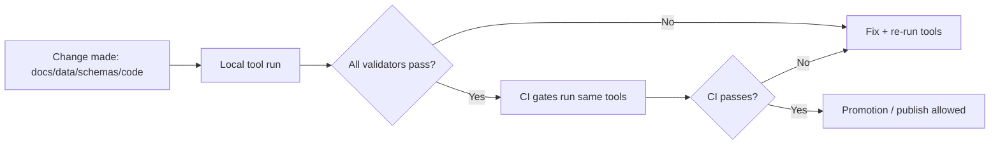

# 🧰 KFM Tools


KFM’s `/tools` directory contains **utility scripts, validators, and DevOps helpers** that enforce KFM’s governance guarantees (evidence-first, cite-or-abstain, deterministic pipelines, schema-validated artifacts, and policy-as-code gates).

> [!IMPORTANT]
> **Tools are enforcement mechanisms, not “nice-to-have” scripts.**  
> If a governed artifact can reach “published” state, it must be able to pass the relevant tool gate(s) in CI.

---

## 🔎 What this folder is for

### ✅ In scope (belongs in `/tools`)
- **Validators** used locally and/or in CI:
  - Docs (lint, link-check, template validation)
  - Story Nodes (v3 validation, citation resolution checks)
  - Data artifacts (STAC/DCAT/PROV validation + checksum verification)
  - Policy packs (OPA/Rego tests and Conftest harnesses)
  - Supply chain proofs (SBOM generation + provenance attestation verification)
- **Build and repo hygiene tooling**
  - Formatting/lint wrappers, consistency checks, file hygiene
  - “Fail-closed” CI gate wrappers and report emitters
- **Ops/DevOps helpers**
  - Scripts to standardize reproducible builds, container scanning, artifact signing/verification
- **Fixtures for deterministic testing**
  - Tiny, synthetic fixtures for validators to keep CI fast and reproducible

### ❌ Out of scope (does *not* belong in `/tools`)
- Runtime product code:
  - API runtime code belongs in `src/server/`
  - ETL pipeline implementation belongs in `src/pipelines/`
  - Graph build/ingest code belongs in `src/graph/`
  - UI code belongs in `web/`
- “One-off” personal scripts that aren’t deterministic, tested, and documented
- Secrets, credentials, production tokens, or any private key material

---

## 🗺️ Where `/tools` fits in the KFM architecture

KFM is contract-first and evidence-first. Tools exist to **prove** that contracts are met.



---

## 🧱 Tooling principles (non-negotiable)

### Deterministic and replayable
Tools must produce stable results for the same inputs (or explicitly record differences in machine-readable output).

### Fail-closed
A missing required signal is a **hard failure**, not a warning:
- missing citations where required
- missing required metadata
- missing policy decision
- missing checksum evidence

### Machine-readable output
Every validator should be able to emit:
- human-readable logs
- a structured report (JSON recommended) suitable for CI artifact upload and audit trails

### No trust-membrane bypass
Tools may test or interrogate the system, but they must not introduce “shortcuts” that bypass the governed API/policy boundary (e.g., encouraging direct UI-to-DB access).

---

## 📁 Directory layout expectations

This README documents the *expected* organization pattern for tools. Subfolders may vary by implementation, but the roles below should remain stable.

```text
tools/
├── README.md                     # This file (entrypoint + conventions)
├── bin/                          # Optional: thin CLI wrappers for common tasks
├── docs/                         # Docs validation (lint/link-check/template)
├── story/                        # Story Node validators + citation resolution checks
├── data/                         # STAC/DCAT/PROV validators + checksum verifiers
├── policy/                       # OPA/Rego policies + conftest harness + unit tests
├── supply-chain/                 # SBOM + provenance attestation helpers
├── fixtures/                     # Small deterministic fixtures used by tools/tests
└── lib/                          # Shared helper code for tools (avoid copy/paste)
```

> [!NOTE]
> If your repo uses different folder names, keep a **single mapping table** in this README so newcomers can find the right place fast.

---

## ⚡ Quickstart (what to run before you open a PR)

The “minimal hardening” gate set expects validation across **docs, stories, data, policy, supply chain**.

### Recommended local run order
1. **Docs gate**: lint + link-check + template validation
2. **Story Node gate**: v3 validator + citation reference resolution checks
3. **Data gate**: STAC/DCAT/PROV validation + checksums/digests
4. **Policy gate**: `opa test` (and/or `conftest test`) for policy bundles
5. **Supply chain gate**: SBOM generation + provenance attestation checks (for release artifacts)

> [!TIP]
> If your repo defines a single umbrella command (e.g., `make verify`, `just verify`, or a `tools/bin/kfm verify` wrapper), use that as the default workflow and keep the individual steps as “debug drills” only.

---

## ✅ CI gate mapping (what tools should cover)

This is the **baseline** “CI hardening checklist” coverage that tooling must support.

| Gate | What it protects | What it should do | Typical failure modes |
|---|---|---|---|
| Docs | Governed documentation integrity | Markdown lint, link-check, validate required templates/front matter | broken links, missing required headings/front matter |
| Stories | Narrative governance | Validate Story Node v3 schema + ensure citations resolve | missing/invalid citations, invalid template sections |
| Data | Catalog correctness | Validate STAC/DCAT/PROV outputs + verify checksums/digests | schema errors, missing metadata, digest mismatch |
| Policy | Policy-as-code correctness | Run `opa test` and/or `conftest test` and fail on denies | policy regression, missing deny-by-default |
| Supply chain | Artifact integrity | Produce SBOM (SPDX) + verify SLSA/in-toto provenance attestations | unsigned artifacts, provenance mismatch |

> [!IMPORTANT]
> If a gate is required in CI, it must be runnable locally from `/tools` (same code paths; no “CI-only magic”).

---

## 🧾 Standard tool interface contract

To keep tooling consistent (and CI wiring simple), new tools should follow these conventions:

### CLI conventions
- `--help` prints usage and exits `0`
- `--json <path>` writes a machine report (and still prints human logs)
- `--strict` converts warnings into failures (recommended default for CI)
- `--paths-from <file>` allows CI to pass a changed-files list

### Exit codes (recommended)
- `0`: success
- `2`: validation failure (artifact is invalid)
- `3`: tool execution error (crash, missing dependency, unexpected exception)
- `4`: policy denial / governance failure (explicit deny outcome)

### Output conventions
- Human logs to stdout/stderr
- JSON reports include:
  - `tool_id`, `tool_version`
  - `inputs` (paths, hashes if applicable)
  - `checks` array (id, status, message, evidence pointers)
  - `summary` (pass/fail counts)
  - `timestamp`

---

## 🧪 Tests and fixtures

Tools that are used as CI gates must be tested.

### Minimum expectations
- Unit tests for parsing/validation logic
- Golden fixtures (small, deterministic)
- Regression tests for previously-seen failures (especially policy and provenance)

### Fixture rules
- Keep fixtures tiny and synthetic where possible
- Avoid licensing issues: fixtures should be owned/created for the repo
- Never include restricted/sensitive real-world records in fixtures

---

## 🔐 Security, governance, and sensitive data handling

Tools are part of the governance boundary. Treat them like production code.

### Don’t leak sensitive details
- Validation output should not print raw restricted coordinates or private identifiers.
- When reporting issues, prefer:
  - redacted values
  - bounding-box generalization
  - hashed identifiers (where appropriate)

### No silent downgrades
- If a tool can’t validate something due to missing dependency or unreadable file, that is a **failure**, not a skip.
- If a validator supports optional checks, they must be explicitly opt-in/opt-out (no surprises).

### Dependency hygiene
- Pin toolchain versions where possible (to avoid CI drift).
- Prefer offline-capable validation (especially for air-gapped environments).

---

## 🧩 When to put code in `/tools` vs `src/`

Use this rule of thumb:

- **`src/pipelines/`**: ETL jobs that produce data outputs (work/processed) and/or generate catalogs  
- **`src/server/`**: runtime API behavior and policy-enforced access  
- **`src/graph/`**: graph build, ingest, constraints, migrations  
- **`web/`**: UI only  
- **`tools/`**: validators, CI gates, repo hygiene scripts, supply-chain proof tooling

> [!NOTE]
> If code is required at runtime, it does *not* belong in `/tools`. Tools should be safe to run in CI without mutating production state.

---

## 🛠️ Adding a new tool (checklist)

- [ ] Pick the correct home (`tools/docs`, `tools/story`, `tools/data`, `tools/policy`, `tools/supply-chain`, or `tools/lib`)
- [ ] Provide a minimal README in the tool folder with:
  - purpose
  - inputs/outputs
  - usage examples
  - exit codes
- [ ] Add tests and fixtures (or extend existing fixtures)
- [ ] Ensure deterministic output (stable ordering, stable timestamps in reports where required)
- [ ] Ensure CI integration can call it headlessly (no interactive prompts)
- [ ] Add the tool to the **Tool Index** below

---

## 🧭 Tool Index

This is the human-friendly index for `/tools`. Keep it updated as tools are added.

| Area | Folder | Purpose | Typical artifacts checked |
|---|---|---|---|
| Docs | `tools/docs/` | Lint, link-check, template validation | `docs/**` |
| Stories | `tools/story/` | Story Node validation + citation resolution | `docs/reports/story_nodes/**` |
| Data | `tools/data/` | STAC/DCAT/PROV validation + checksums | `data/stac/**`, `data/catalog/dcat/**`, `data/prov/**` |
| Policy | `tools/policy/` | OPA/Rego policies + unit tests | policy bundles + CI inputs |
| Supply chain | `tools/supply-chain/` | SBOM + provenance attestations | `releases/**` |

---

## 🧯 Troubleshooting

### “It passes locally but fails in CI”
- Confirm you’re running tools in **strict** mode (CI should be strict).
- Confirm tool dependencies are version-pinned locally (avoid “latest” drift).
- Compare changed-files scope: CI may be validating *more* than your local run.

### “Validator output is too noisy”
- Noise reduces trust. Fix the root cause:
  - improve error formatting
  - collapse repeated errors
  - emit a clean summary + point to structured JSON report

### “Policy test failures are confusing”
- Ensure every deny has:
  - a rule id
  - a short human message
  - a stable reference to the policy module
  - (when possible) a link to the governance rule explaining the rationale

---

## 📚 References inside this repo

These are the most common “governed” references tools should validate against:

- `docs/MASTER_GUIDE_v13.md` (canonical repo + pipeline structure)
- `docs/templates/` (governed document templates)
- `docs/standards/` (STAC/DCAT/PROV profiles)
- `schemas/` (JSON Schemas used in validation)
- `docs/governance/` (review gates, ethics, sovereignty)

---

## ✅ Definition of Done for changes under `/tools`

A PR that changes tooling is “done” when:
- the tool is documented (this README + local README as needed)
- tests are updated or added
- CI can run the tool headlessly
- outputs are deterministic and machine-readable
- governance/security risks are considered (especially around sensitive data and provenance)

