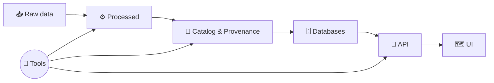

# 🧰 Tools (Dev + Ops Utilities)


This folder contains **developer + operator tools** used to run, validate, and maintain the **Kansas Frontier Matrix (KFM)** platform in a **reproducible, provenance-first** way.

> 🧠 Guiding idea: tools should **help** the platform—not bypass it.  
> Prefer **pipeline + catalog + API** workflows over direct DB edits whenever possible.

---

## 🧭 Table of contents

- [🧩 What belongs in `tools/`?](#-what-belongs-in-tools)
- [🚀 Quickstart](#-quickstart)
- [📁 Tool index](#-tool-index)
- [🏃 Running tools safely](#-running-tools-safely)
- [🔌 Common API calls (useful for tools)](#-common-api-calls-useful-for-tools)
- [🧪 MCP standards for tool authors](#-mcp-standards-for-tool-authors)
- [🛠️ Troubleshooting](#️-troubleshooting)
- [➕ Adding a new tool](#-adding-a-new-tool)

---

## 🧩 What belongs in `tools/`

`tools/` is for **repeatable** utilities that support:

- 🧱 **Environment & stack management** (dev workflows, helper CLIs)
- 🧬 **Data operations** (ingest triggers, batch exports, format conversions)
- ✅ **Validation / QA** (schema checks, catalog integrity checks, spatial sanity tests)
- 📦 **Packaging** (dataset bundles, release helpers, artifact stamping)
- 🔎 **Diagnostics** (health checks, dependency verification, port checks)

What *doesn’t* belong here:

- ❌ One-off experiments that aren’t repeatable  
- ❌ Manual “hot fixes” that bypass governance / provenance  
- ❌ Secret keys or sensitive datasets

---

## 🚀 Quickstart

### 1) Bring up the dev stack
From repo root (see main README for the canonical commands):

```bash
docker compose up -d
# or (older)
docker-compose up -d
```

### 2) Confirm the API is reachable
- Swagger UI: `http://localhost:8000/docs` 🔎

### 3) Run tools
Tools may run:
- **On your host** (shell/node/python scripts), or
- **Inside containers** via `docker compose exec` for consistent deps + mounted volumes.

---

## 📁 Tool index

> Add new tools here as they are introduced. Keep this list current ✅

### 🧰 Current tools

- **`tools/kfm/`** — KFM helper CLI / operational utilities  
  👉 See: [`tools/kfm/README.md`](./kfm/README.md)

---

## 🏃 Running tools safely

### ✅ Preferred: run “in context” of the stack
Running inside the API container is often best because the environment already has:
- database connectivity (PostGIS / graph DB, etc.)
- mounted `data/` volumes
- any geospatial deps (GDAL/proj/etc.) installed in the image

Examples:

```bash
# open a shell inside the API container
docker compose exec api bash

# run a one-off pipeline script (example path)
docker compose exec api python pipelines/my_pipeline.py
```

### 🧯 Safety checklist
Before you run anything that changes data:

- [ ] Are you in the **correct environment** (dev vs prod)?
- [ ] Do you have a **dry-run** mode available?
- [ ] Are outputs versioned / logged?
- [ ] Are you preserving the **canonical pipeline order**?

---

## 🔁 Canonical pipeline order

Tools should reinforce the platform’s “source → proof → product” model:



---

## 🔌 Common API calls (useful for tools)

These examples are handy when writing scripts that interact with KFM via the **backend API**.

> 🧩 Tip: If you’re unsure which endpoints exist in your current build, use Swagger: `http://localhost:8000/docs`

### 🗂️ Dataset metadata
```bash
curl -s "http://localhost:8000/api/v1/datasets/ks_hydrology_1880" | jq
```

### 🔎 Catalog search
```bash
curl -s "http://localhost:8000/api/v1/catalog/search?q=railroad" | jq
```

### 🧾 Stream dataset data (GeoJSON example)
```bash
curl -s "http://localhost:8000/api/v1/datasets/ks_hydrology_1880/data?format=geojson&bbox=-102,36,-94,40" \
  | jq '.features[0]'
```

### 🏗️ Trigger an ingest pipeline
```bash
curl -s -X POST "http://localhost:8000/api/v1/ingest/runPipeline" \
  -H "Content-Type: application/json" \
  -d '{
    "pipeline_id": "example_pipeline",
    "args": {"force": false}
  }' | jq
```

### 🧠 Focus Mode (AI-assisted query)
```bash
curl -s -X POST "http://localhost:8000/api/v1/ai/query" \
  -H "Content-Type: application/json" \
  -d '{
    "question": "List major trails in Kansas and their purposes."
  }' | jq
```

### 🕸️ GraphQL (if enabled)
```bash
curl -s -X POST "http://localhost:8000/graphql" \
  -H "Content-Type: application/json" \
  -d '{
    "query": "query { storyNodes { id title yearRange } }"
  }' | jq
```

---

## 🧪 MCP standards for tool authors

KFM is built around **reproducibility + rigor**. Tools should follow “MCP” expectations:

### ✅ Tool quality bar
- **Reproducible:** same input → same output (or explain nondeterminism)
- **Auditable:** logs include timestamps, versions, and key parameters
- **Traceable:** outputs link back to sources (dataset IDs, file paths, commit SHA, etc.)
- **Governed:** don’t bypass catalog/provenance rules

### 🔒 Minimum features (strongly recommended)
- `--help` with examples
- `--dry-run` (or “plan” mode) for destructive actions
- deterministic output naming (include dataset IDs + timestamps)
- `--json` output option for machine-readable results
- exit codes (0 success, non-zero failure)

---

## 🛠️ Troubleshooting

### 🧱 Containers won’t start / DB connection issues
```bash
docker compose logs api --tail=200
```

Common causes:
- **dependency timing:** DB not ready yet (restart stack)
- **port conflicts:** local Postgres on `5432`, Neo4j on `7474`, web/app on `3000/8000`
- **volume permissions:** container can’t write to mounted `data/`

### 🔁 Code changes not reflected
```bash
docker compose up -d --build
```

---

## ➕ Adding a new tool

Create a self-contained folder per tool:

```text
tools/
  my-tool/
    README.md
    bin/
      my-tool
    src/
    tests/
```

### 📌 Expectations
- Include **purpose**, **inputs/outputs**, and **examples** in the tool’s README
- Prefer container-executed workflows (`docker compose exec api ...`) when tools need DB/GDAL/etc.
- Update this index: [📁 Tool index](#-tool-index)

---

### ✅ Suggested conventions

| Item | Recommendation |
|------|----------------|
| Naming | short, verb-ish (`reindex`, `export`, `validate`) |
| Logging | always log inputs + output locations |
| Safety | add `--dry-run` + “danger zone” callouts |
| Docs | include a “What it changes” section |
| CI | add at least a smoke test if feasible |

---

> 🧭 If you’re unsure where something should live:  
> - “one time experiment” → `docs/` or `notebooks/` (if present)  
> - “repeatable utility” → `tools/` ✅  
> - “core platform feature” → backend/frontend modules