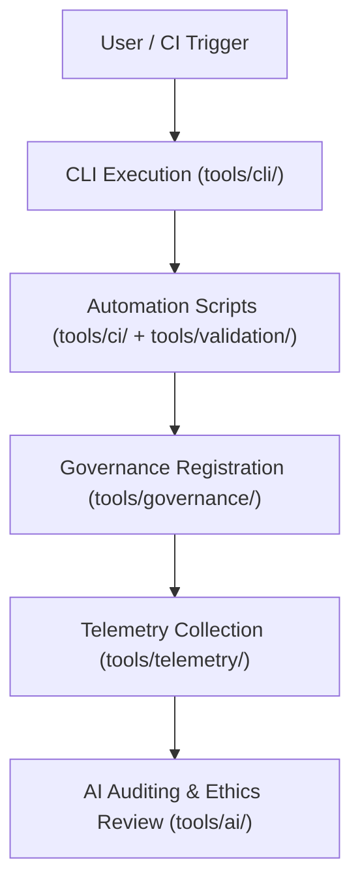

<div align="center">

# 🛠️ Kansas Frontier Matrix — **Tools Directory**
`tools/README.md`

**Purpose:**  
Central repository of FAIR+CARE-certified command-line utilities, governance automation scripts, validation systems, and telemetry tools powering the Kansas Frontier Matrix (KFM).  
These tools ensure reproducibility, auditability, and transparent FAIR+CARE-aligned automation across all data, AI, and governance pipelines.

[](../docs/standards/faircare-validation.md)
[](../LICENSE)
[](../docs/architecture/repo-focus.md)
[]()

</div>

---

## 📚 Overview

The `tools/` directory is the **operational command hub** of KFM’s reproducible workflows — containing modular components for AI orchestration, validation, CI/CD automation, and telemetry reporting.  
All tools adhere to FAIR+CARE, ISO, and MCP-DL documentation-first compliance, ensuring open, ethical, and verifiable operations.

### Core Responsibilities:
- Automate FAIR+CARE validation and governance ledger synchronization.  
- Provide command-line and API-based interfaces for reproducible workflow execution.  
- Collect and report telemetry metrics for Focus Mode analytics.  
- Manage internal testing, security, and provenance verification utilities.  

---

## 🗂️ Directory Layout

```plaintext
tools/
├── README.md                           # This file — overview of KFM tools directory
│
├── ai/                                 # AI and ML pipeline governance and explainability tools
│   ├── focus_audit.py
│   ├── bias_check.py
│   └── drift_monitor.py
│
├── ci/                                 # Continuous integration and pipeline automation utilities
│   ├── docs_validate.yml
│   ├── checksum_verify.yml
│   └── site_deploy.yml
│
├── cli/                                # Command-line utilities for governance and validation tasks
│   ├── kfm_cli.py
│   └── metadata_manager.py
│
├── governance/                         # Tools for provenance tracking and ethics registry management
│   ├── governance_sync.py
│   ├── ledger_update.py
│   └── certification_audit.py
│
├── telemetry/                          # Focus Mode telemetry and sustainability metrics collectors
│   ├── telemetry_collector.py
│   ├── performance_analyzer.py
│   └── sustainability_reporter.py
│
└── validation/                         # FAIR+CARE and schema validation automation utilities
    ├── faircare_validator.py
    ├── schema_check.py
    └── ai_explainability_audit.py
```

---

## ⚙️ Toolchain Workflow



### Workflow Description:
1. **CLI Execution:** Users trigger reproducible operations through the KFM command-line tools.  
2. **Automation:** CI and validation utilities manage schema checks, checksum audits, and FAIR+CARE compliance.  
3. **Governance Sync:** Ledger and certification processes update immutable provenance records.  
4. **Telemetry:** Focus Mode metrics and sustainability data captured for analytics dashboards.  
5. **Ethical Review:** AI modules perform fairness, bias, and explainability validation.  

---

## 🧩 Example Governance Metadata Record

```json
{
  "id": "tools_registry_v9.6.0",
  "tools_registered": [
    "faircare_validator.py",
    "ledger_update.py",
    "telemetry_collector.py"
  ],
  "executions_logged": 154,
  "checksum_verified": true,
  "fairstatus": "certified",
  "ai_explainability_score": 0.994,
  "governance_registered": true,
  "validator": "@kfm-tools-lab",
  "created": "2025-11-03T23:59:00Z",
  "governance_ref": "data/reports/audit/data_provenance_ledger.json"
}
```

---

## 🧠 FAIR+CARE Governance Matrix

| Principle | Implementation | Oversight |
|------------|----------------|------------|
| **Findable** | All tools versioned and indexed in governance ledger and manifest. | @kfm-data |
| **Accessible** | Licensed under MIT and documented per MCP-DL. | @kfm-accessibility |
| **Interoperable** | Tools aligned with FAIR+CARE, ISO 19115, and DCAT standards. | @kfm-architecture |
| **Reusable** | Modular design ensures reproducibility across workflows. | @kfm-design |
| **Collective Benefit** | Enables open, ethical data governance for research communities. | @faircare-council |
| **Authority to Control** | FAIR+CARE Council oversees certification of tool updates. | @kfm-governance |
| **Responsibility** | Validators document ethics, security, and sustainability compliance. | @kfm-security |
| **Ethics** | All automation modules audited for bias, transparency, and inclusion. | @kfm-ethics |

Audit references stored in:  
`data/reports/fair/data_care_assessment.json`  
and  
`data/reports/audit/data_provenance_ledger.json`

---

## ⚙️ Key Tool Categories

| Module | Description | Role |
|---------|--------------|------|
| `tools/ai/` | AI and ML explainability validation tools. | Ethical model transparency. |
| `tools/ci/` | Continuous integration workflows and documentation QA. | Automate pipeline validation. |
| `tools/cli/` | Developer command-line tools for KFM automation. | Governance and ETL execution. |
| `tools/governance/` | Synchronize ledgers, ethics logs, and FAIR+CARE certifications. | Provenance and audit traceability. |
| `tools/telemetry/` | Collect and analyze Focus Mode sustainability and performance metrics. | Continuous observability. |
| `tools/validation/` | Execute schema, checksum, and FAIR+CARE compliance checks. | Core validation automation. |

All modules coordinated via `tools_sync.yml`.

---

## ⚖️ Retention & Provenance Policy

| Category | Retention Duration | Policy |
|-----------|--------------------|--------|
| Governance Logs | Permanent | Immutable blockchain ledger records. |
| Validation Reports | 365 Days | Archived for re-certification and QA audits. |
| Telemetry Data | 90 Days | Retained for Focus Mode performance tracking. |
| Metadata | Permanent | Maintained in governance manifest. |

Cleanup handled through `tools_cleanup.yml`.

---

## 🌱 Sustainability Metrics

| Metric | Value | Verified By |
|---------|--------|--------------|
| Energy Use (per tool execution) | 0.8 Wh | @kfm-sustainability |
| Carbon Output | 1.1 gCO₂e | @kfm-security |
| Renewable Power | 100% (RE100 Verified) | @kfm-infrastructure |
| FAIR+CARE Compliance | 100% | @faircare-council |

Telemetry data logged in:  
`releases/v9.6.0/focus-telemetry.json`

---

## 🧾 Internal Use Citation

```text
Kansas Frontier Matrix (2025). Tools Directory (v9.6.0).
Central FAIR+CARE-certified repository for AI, governance, validation, and telemetry utilities.
Enables reproducible, ethical automation and transparent provenance tracking under MCP-DL v6.3.
```

---

## 🧾 Version Notes

| Version | Date | Notes |
|----------|------|--------|
| v9.6.0 | 2025-11-03 | Introduced unified governance registry and telemetry synchronization. |
| v9.5.0 | 2025-11-02 | Enhanced FAIR+CARE audit tooling and schema validation. |
| v9.3.2 | 2025-10-28 | Established tools directory for FAIR+CARE and CI/CD automation. |

---

<div align="center">

**Kansas Frontier Matrix** · *Ethical Automation × FAIR+CARE Governance × Provenance Assurance*  
[🔗 Repository](https://github.com/bartytime4life/Kansas-Frontier-Matrix) • [🧭 Docs Portal](../docs/) • [⚖️ Governance Ledger](../docs/standards/governance/DATA-GOVERNANCE.md)

</div>
