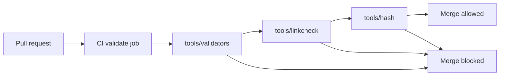

<!-- [KFM_META_BLOCK_V2]
doc_id: kfm://doc/f9897f92-8f95-4e15-a53f-c4aee0cb0fed
title: tools/ — Utility scripts, validators, and DevOps helpers
type: standard
version: v1
status: draft
owners: KFM Platform (TODO)
created: 2026-02-26
updated: 2026-02-26
policy_label: public
related:
  - docs/MASTER_GUIDE_v13.md
  - docs/standards/KFM_DCAT_PROFILE.md
  - docs/standards/KFM_STAC_PROFILE.md
  - docs/standards/KFM_PROV_PROFILE.md
  - policy/rego/
tags: [kfm, tools, ci, validators]
notes:
  - This directory holds utility scripts used by CI and maintainers to enforce the Promotion Contract (fail-closed gates).
  - Update the “Tool inventory” table when adding, renaming, or retiring tools.
  - policy_label assumes public; confirm with governance if tooling contains restricted logic or fixtures.
[/KFM_META_BLOCK_V2] -->

<a id="top"></a>

# `tools/` — Utility scripts, validators, and DevOps helpers

**Purpose:** keep KFM *buildable, reversible, and evidence-backed* by running **fail-closed** checks in CI and locally (catalog validation, link checking, spec-hash drift detection, and other guardrails).

 <!-- TODO: set to review/published -->

 <!-- TODO: point to real workflow badge -->


## Quick navigation

- [What lives here](#what-lives-here)
- [Directory layout](#directory-layout)
- [Quick start](#quick-start)
- [Tool inventory](#tool-inventory)
- [Conventions](#conventions)
- [Adding a new tool](#adding-a-new-tool)
- [Troubleshooting](#troubleshooting)
- [Appendix: recommended CLI contract](#appendix-recommended-cli-contract)

---

## What lives here

This folder is reserved for **utility scripts, validators, and DevOps tooling** that:
- run in CI as promotion gates, or
- are used by maintainers during ingest/publish/release workflows.

### ✅ Acceptable contents

| Category | Examples | Typical outcome |
|---|---|---|
| Catalog validators | DCAT/STAC/PROV schema validation | CI blocks invalid metadata |
| Cross-link checkers | Ensure DCAT ↔ STAC ↔ PROV references resolve | CI blocks broken evidence paths |
| Spec-hash & drift checks | Detect incompatible contract/schema changes | CI blocks “silent” contract drift |
| Release helpers | Build manifests/SBOM, package versioned artifacts | Reproducible release outputs |
| Developer utilities | Lint helpers, formatting, fixture generation | Faster local iteration (no policy bypass) |

### ❌ Not allowed in `tools/`

- One-off notebooks or experiments → put them in `mcp/` (Methods & Computational Experiments).
- Domain pipelines → belong in `src/pipelines/`.
- Production runtime code → belongs in `src/` (behind interfaces/contracts), not in `tools/`.
- Raw or processed datasets → belong in `data/` (RAW/WORK/PROCESSED), not in `tools/`.

---

## Directory layout

```text
tools/
  README.md                  # this file
  validators/                # metadata + schema validators (fail-closed)
    validate_dcat.js
    validate_stac.js
    validate_prov.js
  linkcheck/                 # cross-link integrity checks
    catalog_linkcheck.js
  hash/                      # spec-hash helpers + drift checks
    check_spec_hash.js
    # (optional) spec_hash_cli
  # ... add new tooling in a clearly named subfolder
```

### How `tools/` fits in the KFM promotion flow



> **Note:** Validators should be *read-only* over versioned artifacts. If a tool writes files, its outputs should land in the correct lifecycle zone (`data/work/…`, `data/processed/…`, or `releases/…`) and be explicitly reviewed.

---

## Quick start

### Local prerequisites

- Node.js (required for Node-based tools invoked via `node …`)
- Repo dependencies installed (typically via `npm ci`)

### Run the core gates locally

```bash
# from repo root
npm ci

# catalog validators
node tools/validators/validate_dcat.js
node tools/validators/validate_stac.js
node tools/validators/validate_prov.js

# cross-link validation (citations + catalog references)
node tools/linkcheck/catalog_linkcheck.js

# contract drift detection
node tools/hash/check_spec_hash.js
```

If your CI also runs policy tests, run them locally too:

```bash
opa test policy/rego -v
```

---

## Tool inventory

Keep this table up-to-date. CI should invoke tools from this inventory (directly or through `npm` scripts).

| Tool | Type | What it checks | CI stage |
|---|---|---|---|
| `tools/validators/validate_dcat.js` | validator | DCAT JSON-LD conforms to KFM DCAT profile; required fields present | “Validate catalogs” |
| `tools/validators/validate_stac.js` | validator | STAC Collections/Items/Assets conform to KFM STAC profile | “Validate catalogs” |
| `tools/validators/validate_prov.js` | validator | PROV bundles conform to KFM PROV profile; minimal lineage fields present | “Validate catalogs” |
| `tools/linkcheck/catalog_linkcheck.js` | linkcheck | Required cross-links among DCAT ↔ STAC ↔ PROV resolve | “Linkcheck citations” |
| `tools/hash/check_spec_hash.js` | drift check | Contract/spec hash stability; blocks unintended schema drift | “Spec hash drift check” |

<details>
<summary><strong>What “fail-closed” means for tools</strong></summary>

A tool should exit non-zero when:
- it cannot prove a required condition (e.g., missing license, missing provenance link), or
- an invariant is violated (e.g., a public artifact references a restricted policy label).

“Warnings” should be explicit and reviewed; avoid silently passing on partial validation.

</details>

---

## Conventions

### Deterministic and auditable

- **Deterministic:** same inputs → same outputs (or same pass/fail decision).
- **Offline-first:** avoid network calls during validation. If network access is unavoidable, it must be pinned, logged, and testable with fixtures.
- **Auditable errors:** emit actionable failures (what failed, where, how to reproduce locally).

### Safe by default

- Treat all files as untrusted input (no `eval`, safe JSON parsing, strict path handling).
- Never emit restricted data into stdout logs when running in public CI contexts.
- Prefer *checking* over *mutating*. If mutation is required (e.g., codegen), keep it in a dedicated command and PR the output.

---

## Adding a new tool

**Every new tool must ship with:**

- [ ] A clear location: `tools/<area>/<tool_name>.(js|ts|py|sh)`
- [ ] A short help text (`--help` or header comment) describing purpose + inputs + outputs
- [ ] Tests (unit tests at minimum; integration tests if the tool enforces a gate)
- [ ] A fixture set (small, versioned examples) so CI can verify behavior deterministically
- [ ] An entry in [Tool inventory](#tool-inventory)
- [ ] CI wiring (if the tool is a gate): update the workflow to run it on relevant diffs

**Naming guidance**
- `validate_*` for schema/profile validation
- `check_*` for invariant checks and drift detection
- `build_*` for artifact builders (must write into lifecycle zones)

---

## Troubleshooting

### Catalog validation failures

- Run the failing validator locally (see [Quick start](#quick-start)).
- Confirm that the artifact matches the corresponding profile (DCAT/STAC/PROV).
- If the failure is *about a missing cross-link*, check `tools/linkcheck/catalog_linkcheck.js` output too.

### Linkcheck failures

Common causes:
- A DCAT Distribution points to a missing STAC Item.
- A STAC Item references an asset that moved without updating metadata.
- A PROV activity references a non-existent run id / entity id.

Fix by updating the *metadata* (not the tool) unless the tool is wrong and you can prove it with fixtures.

### Spec-hash drift failures

- If you intentionally changed a contract/schema, follow the repo’s contract versioning rules and update golden hashes/tests.
- If you did **not** intend to change a contract: look for formatting/ordering differences and ensure canonicalization rules are applied before hashing.

---

## Appendix: recommended CLI contract

<a id="appendix-recommended-cli-contract"></a>

These conventions are **recommended** to keep tooling consistent:

- `--help` prints usage + exits 0
- `--json` prints machine-readable output (for CI annotations)
- Exit codes:
  - `0` = pass
  - `1` = validation failed
  - `2` = tool error (misconfiguration, missing dependency, etc.)
- No hidden defaults that reduce safety (prefer explicit inputs or repository scanning with strict rules)

---

<a href="#top">Back to top</a>
