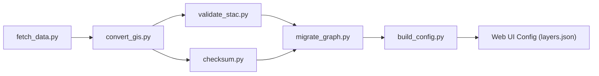

<div align="center">

# 🛠️ Kansas Frontier Matrix — **Tools**  
`/tools/`

**Automation Utilities · Data Pipelines · Validation & Deployment Helpers**

[](../.github/workflows/site.yml)
[](../.github/workflows/tests.yml)
[](../.github/workflows/codeql.yml)
[](../.github/workflows/trivy.yml)
[](https://pre-commit.com/)
[](../docs/)

</div>

---

## 🎯 Purpose

The `/tools/` directory contains **automation scripts and CLI utilities** that orchestrate ingestion, validation, transformation, and deployment for **Kansas Frontier Matrix (KFM)**.  
These tools operationalize **MCP-DL v6.3** reproducibility principles — ensuring that every step from data acquisition to publication is **documented**, **deterministic**, and **traceable**.

> *“Every transformation leaves a trail — reproducibility is built, not assumed.”*

---

## 🧱 Directory Layout

```text
tools/
├── fetch_data.py         # Fetch raw datasets from source manifests
├── convert_gis.py        # Convert GIS formats → GeoJSON / Cloud-Optimized GeoTIFF
├── validate_stac.py      # Validate STAC Items & Collections against schemas
├── checksum.py           # Generate & verify SHA-256 provenance sidecars
├── migrate_graph.py      # Load ETL outputs into Neo4j knowledge graph
├── build_config.py       # Generate web/config files from STAC metadata
├── notebooks/            # Experimental Jupyter notebooks
└── utils/                # Shared logging/config modules
```

---

## ⚙️ Core Utilities

| Script              | Function Description                                                      | Standards / Libraries |
| :------------------ | :------------------------------------------------------------------------ | :-------------------- |
| **fetch_data.py**   | Reads `data/sources/*.json` → fetches datasets; logs provenance, checksums | requests · PROV-O |
| **convert_gis.py**  | Reprojects shapefiles & rasters to EPSG:4326, outputs GeoJSON / COGs      | GDAL · Rasterio |
| **validate_stac.py**| Validates STAC metadata for completeness & schema alignment               | pystac · JSONSchema |
| **checksum.py**     | Generates/verifies SHA-256 hashes for all files (integrity verification)  | hashlib |
| **migrate_graph.py**| Loads processed layers into Neo4j via batch Cypher transactions           | neo4j-driver |
| **build_config.py** | Builds web config files (`layers.json`, `app.config.json`) from STAC data | Python · JSON |

---

## 🚀 Usage

**From the Makefile**

```bash
make fetch           # Retrieve source data
make convert         # Convert GIS layers to open formats
make stac-validate   # Validate STAC Items and Collections
make checksums       # Compute and verify SHA-256 integrity hashes
make graph-migrate   # Load data into Neo4j
make site-config     # Rebuild frontend configs from STAC metadata
```

**Direct CLI**

```bash
python tools/fetch_data.py --source data/sources/noaa_precip.json
python tools/convert_gis.py input.shp output.geojson
python tools/validate_stac.py data/stac/items/*
python tools/checksum.py --verify data/processed/
```

---

## 🧩 Pipeline Flow



**End-to-End Example:**

```bash
make fetch checksums convert stac-validate graph-migrate site-config
```

---

## 🧪 Testing & CI

- **Unit Tests:** Located in `tests/tools/` (run via `pytest`)  
- **Pre-Commit Hooks:** Linting, schema validation, formatting (ruff, black)  
- **CI Integration:** All tools executed in `tests.yml` workflow with mock data  
- **Artifacts:** Validation & checksum logs archived in build outputs  

**CLI Options:**  
`--dry-run` · `--verbose` · `--output <dir>` for all major tools.

---

## 🧠 Development Guidelines

Every tool must:

1. Include docstring + `--help` usage.  
2. Log actions with timestamp and context.  
3. Write to structured logs in `logs/{tool}.log`.  
4. Avoid global state; support module import.  
5. Be deterministic — same inputs → same outputs.  
6. Record provenance: input → output → checksum.

Prototypes live in `tools/notebooks/` before full production integration.

---

## 🧾 Provenance & Integrity

| Field       | Description                                                  |
| :-----------| :----------------------------------------------------------- |
| **Inputs**  | Dataset manifests, raw data, STAC metadata                   |
| **Outputs** | Processed layers, validation logs, Neo4j imports, configs    |
| **Deps**    | Python 3.11+, GDAL, Rasterio, pystac, neo4j-driver           |
| **Integrity**| Checked via STAC validation & SHA-256 sidecars              |
| **Traceability** | Each run logs provenance and hash summary in CI artifacts |

---

## 🧠 MCP Compliance Checklist

| Principle           | Implementation                                      |
| :------------------ | :------------------------------------------------- |
| Documentation-first | Docstrings, usage examples, and README inclusion   |
| Reproducibility     | Deterministic outputs validated via checksums      |
| Provenance          | Input/output linkage tracked via PROV-O metadata   |
| Open Standards      | STAC 1.0 · GeoJSON · EPSG:4326                     |
| Auditability        | CI validation, archived logs, checksum artifacts   |
| Accessibility       | CLI help, verbose logs, structured configs         |

---

## 🔗 Related Documentation

- **Data Pipelines** — `data/README.md`  
- **STAC Catalog** — `data/stac/README.md`  
- **Web Config** — `web/config/README.md`  
- **Architecture Overview** — `docs/architecture/system-architecture-overview.md`

---

## 🧾 Versioning & Metadata

| Field | Value |
| :---- | :---- |
| **Version** | `v1.6.0` |
| **Codename** | *Automation & Provenance Upgrade* |
| **Last Updated** | 2025-10-17 |
| **Maintainers** | @kfm-data · @kfm-engineering |
| **License** | MIT |
| **Alignment** | STAC 1.0 · PROV-O · FAIR Principles · MCP-DL v6.3 |
| **Maturity** | Stable / Production |

---

## 📜 License

Released under the **MIT License**.  
© 2025 Kansas Frontier Matrix — developed under **MCP-DL v6.3** for deterministic, auditable, and reproducible automation.

> *“Tools are instruments of reproducibility — every helper leaves a provenance trail.”*
