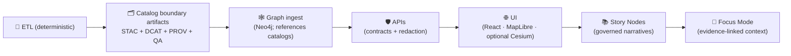

<!--
📌 tools/ is the repo’s *governed toolchain surface* for building + validating KFM artifacts.
🗓️ Last updated: 2026-01-11
🔁 Review cycle: 90 days (or anytime pipeline order / catalogs / policy changes)
🧭 Alignment: Master Guide v13 (contract-first + evidence-first + one canonical home per subsystem)
-->

<div align="center">

# 🛠️ `tools/` — Kansas Frontier Matrix (KFM) Toolchain

**Deterministic • Provenance-aware • CI-friendly**  
**Build it once • verify it forever • ship with a paper trail** 🧾✅


</div>

> **TL;DR:** `tools/` holds the **command surface** for building, validating, and packaging KFM artifacts **without bypassing governance**.  
> Tools are **CI-safe** by design: deterministic defaults, clear contracts, fast QA gates, and provenance emission.

> [!IMPORTANT]
> **MCP** = **Methods, Controls & Processes** *(a.k.a. “Master Coder Protocol” — lab notebook + receipts)* 🧪🧾  
> `tools/` must support MCP workflows by producing **re-run-able** outputs and **linkable** provenance—without turning into “business logic.”

---

<details>
<summary><b>🧭 Table of contents</b></summary>

- [🧠 Quick links](#quick-links)
- [🧭 Repo invariants](#repo-invariants)
- [🧱 The non-negotiable ordering](#non-negotiable-ordering)
- [🎯 What belongs in tools](#what-belongs-in-tools)
- [🧭 Boundaries: tools vs scripts vs src vs mcp](#boundaries)
- [🧾 Contracts & schemas](#contracts-and-schemas)
- [📦 Data staging + catalog locations](#data-staging)
- [🧱 Tool contract](#tool-contract)
- [📁 Expected folder layout](#expected-layout)
- [🔁 Common workflows](#common-workflows)
- [✅ Validation & QA gates](#validation-gates)
- [🔏 Provenance, SBOM, attestations, releases](#provenance-sbom-attestations)
- [🗺️ Geo & mapping utilities](#geo-mapping)
- [🛰️ Remote sensing utilities](#remote-sensing)
- [🧠 Graph & DB utilities](#graph-db)
- [🌐 Web/UI build utilities](#web-ui)
- [🧪 Modeling/ML/simulation utilities](#modeling-ml-simulation)
- [🔐 Security posture](#security-posture)
- [⚡ Performance & scaling notes](#performance-scaling)
- [🌍 Federation & cross-matrix interoperability](#federation)
- [🧩 Contributing a new tool](#contributing)
- [📚 Project reference library](#reference-library)
- [🧾 Metadata](#metadata)
- [🕰️ Version history](#version-history)

</details>

---

<a id="quick-links"></a>
## 🧠 Quick links

- 📘 Canonical repo guide (v13) → `docs/MASTER_GUIDE_v13.md`
- 📖 Glossary (shared language) → `docs/glossary.md`
- 📏 Schemas & contracts (source of truth) → `schemas/`
- 🧪 Research workflow + run receipts → `mcp/README.md`
- 🧪 Canonical pipelines (ETL code) → `src/pipelines/`
- 🕸️ Graph build & ontology bindings → `src/graph/`
- 🛡️ API boundary (contracts + redaction) → `src/server/`
- 🌐 UI (React · MapLibre · optional Cesium) → `web/`
- 🗂️ Data lifecycle + catalogs → `data/README.md`
- 🧷 Governance gates → `docs/governance/REVIEW_GATES.md`
- 🔏 Releases (bundles, SBOMs, attestations) → `releases/`
- 🧾 Citation metadata (software + snapshots) → `CITATION.cff`
- ✅ Tests → `tests/README.md`

---

<a id="repo-invariants"></a>
## 🧭 Repo invariants

> [!IMPORTANT]
> These are **guardrails**, not preferences. If a tool would violate these, redesign the tool.

### ✅ One canonical home per subsystem 🧱
No mystery duplicates. If logic belongs in:
- pipelines → `src/pipelines/`
- graph → `src/graph/`
- API boundary → `src/server/`
- UI → `web/`
- schemas → `schemas/`
- governed narratives → `docs/reports/story_nodes/`

### ✅ Contract-first 📏
Schemas and API contracts are **first-class artifacts**:
- implementations must conform
- changes require versioning and compatibility checks
- tools should validate against contracts by default

### ✅ Evidence-first 🧾
No “published-looking” output without boundary artifacts:
- **STAC + DCAT + PROV** are required before:
  - graph ingest
  - API exposure
  - UI or Story Node usage

### ✅ Deterministic by default 🎲🚫
Given the same inputs + config + seed, tools must produce the same outputs (ordering included).

---

<a id="non-negotiable-ordering"></a>
## 🧱 The non-negotiable ordering

> [!IMPORTANT]
> This ordering is not “architecture style.” It’s a **governance boundary**.

**ETL → Catalogs (STAC/DCAT/PROV) → Graph → APIs → UI → Story Nodes → Focus Mode**



**Practical implication:** `tools/` must never create **published-looking outputs** that skip **catalog + provenance**.

---

<a id="what-belongs-in-tools"></a>
## 🎯 What belongs in tools

`tools/` is for **reusable, CI-friendly tooling** that builds/validates artifacts in the governed pipeline.

✅ Good fits:
- **Catalog QA gates** (STAC/DCAT/PROV schema + link + required-field checks)
- **Deterministic ID/hashing utilities** (stable IDs, checksums, manifests)
- **Format and integrity tooling** (COG validation, GeoParquet schema checks, geometry validity)
- **Policy enforcement tooling** (licensing gates, sensitivity/classification checks, “no downgrade” rules)
- **Graph/DB loaders** that **ingest from catalogs** (not ad-hoc inserts)
- **Release packaging** (SBOM generation, signatures, attestations)
- **CI entrypoints** (non-interactive, stable exit codes)

🚫 Not a good fit:
- Long-lived services (APIs, daemons) → runtime/app folders
- Core domain/business logic → `src/` (importable, testable modules)
- One-off “forever scripts” that bypass provenance and approvals → keep in sandbox until promoted
- Anything that can’t run non-interactively (or can’t be made CI-safe)

---

<a id="boundaries"></a>
## 🧭 Boundaries: tools vs scripts vs src vs mcp

### `src/` = canonical behavior (the engine) 🏗️
- ETL jobs (`src/pipelines/`), graph build (`src/graph/`), API logic (`src/server/`), reusable libs.

### `tools/` = governed toolchain (the verified command surface) 🛠️
- Thin entrypoints that call canonical modules, run validators, emit provenance, and produce release-quality artifacts.

### `scripts/` = convenience orchestration (the buttons/levers) 🧰
- Local ops, developer helpers, environment glue.
- Preferred pattern: **scripts call tools**, tools call src.

### `mcp/` = receipts & scientific record (the lab notebook) 🧪🧾
- Run receipts, experiment logs, model cards, governance checklists.

> [!TIP]
> If you’re implementing core behavior inside `tools/`, that’s a smell.  
> Put the logic in `src/` and keep `tools/` as a predictable CLI + validator layer.

---

<a id="contracts-and-schemas"></a>
## 🧾 Contracts & schemas

> [!IMPORTANT]
> **Schemas live at repo root:** `schemas/` is the canonical source of truth.  
> Tools must validate against these contracts by default.

### ✅ What counts as a “contract artifact”
- JSON Schema (STAC/DCAT/PROV, Story Nodes, UI configs, telemetry)
- API boundary contracts (OpenAPI, GraphQL SDL, typed request/response)
- Any machine-validated interface that downstream depends on

### ✅ Where tools should look
- `schemas/` → JSON schemas (STAC/DCAT/PROV/storynodes/ui/telemetry)
- `docs/standards/` → KFM profiles and governance rules (STAC/DCAT/PROV profiles, markdown protocol, repo structure standard)

### 🚫 Avoid schema drift
If you need a new field:
1) update the contract in `schemas/` / profiles in `docs/standards/`  
2) update tools/validators  
3) update producers (pipelines) and consumers (graph/API/UI)  
4) only then promote/publish

---

<a id="data-staging"></a>
## 📦 Data staging + catalog locations

KFM data work is staged and traceable:

1) 📥 `data/raw/<domain>/...` — raw inputs (as-received)  
2) 🧱 `data/work/<domain>/...` — intermediates (scratch / temp / staging)  
3) ✅ `data/processed/<domain>/...` — publishable evidence artifacts  

Optional but recommended:
- 🧾 `data/sources/` — source manifests (URLs, licenses, checksums, retrieval notes)

Catalog + lineage outputs are first-class boundary artifacts:

- 🗂️ `data/stac/collections/` — STAC Collections  
- 🗂️ `data/stac/items/` — STAC Items  
- 🏷️ `data/catalog/dcat/` — DCAT datasets/distributions (JSON-LD)  
- 🧬 `data/prov/` — provenance bundles (PROV JSON-LD recommended)  

> [!IMPORTANT]
> **Atomic publish** is the standard: stage → validate → then promote.  
> If validation fails, nothing “half-publishes.”

---

<a id="tool-contract"></a>
## 🧱 Tool contract

Every tool must behave predictably under automation.

### ✅ Required CLI features
- `--help` (purpose, inputs/outputs, side effects, env vars, examples ≥ 2)
- `--version` (git SHA or semver)
- **safe-by-default mode**
  - either `--dry-run` default, or explicit “no writes unless --apply”
- `--apply` (only when the tool mutates state)
- `--env {dev|staging|prod}` when environment matters
- `--run-id <id>` (or read `KFM_RUN_ID`) for provenance correlation
- `--contracts <path>` optional override (defaults to `schemas/`)
- Structured logging (human-readable + optional JSONL via `--log-json`)

### ✅ Exit codes (recommended standard)
- `0` success
- `2` CLI usage error
- `3` validation/QA failure (schema invalid, missing required fields, link check fails)
- `>=10` runtime failure (I/O, network, DB, unhandled exceptions)

### 🔐 Network posture
- Default to **no network** unless explicitly required
- If a tool fetches remote inputs:
  - require `--allow-network`
  - block private IP ranges by default (SSRF defense)
  - log source URLs + checksums of downloaded artifacts

### 🤖 AI-assisted behavior (allowed, but gated)
If a tool uses AI to suggest metadata / mappings:
- default mode must be **suggest-only** (no mutation)
- require `--apply` to write anything
- log model/version/config where permissible
- treat outputs as **draft** until validated + reviewed

---

<a id="expected-layout"></a>
## 📁 Expected folder layout

> If your repo differs, treat this as the target structure and document deltas in this README.

```text
🛠️ tools/
├── 📘 README.md
├── 🧰 _lib/                      # shared helpers (logging, env validation, guardrails)
├── 🧾 manifests/                 # optional tool.yaml manifests (one per tool)
├── 🧲 ingest/                    # controlled ingest entrypoints (thin wrappers)
├── 🏷️ catalogs/                  # STAC/DCAT emitters + catalog build helpers
├── ✅ validation/                # fast QA gates (schema/link/prov/policy)
│   ├── ⚡ catalog_qa/             # catalog QA gate (PR-friendly)
│   ├── 🛡️ policy/                # license/classification/no-downgrade rules (OPA/Conftest optional)
│   ├── 🧭 geo/                   # CRS/geom/raster validators
│   └── 🔐 security/              # hostile-input checks (zip bombs, traversal, SSRF guards)
├── 🆔 id/                        # deterministic IDs, hashing, manifest tooling
├── 🧬 prov/                      # provenance helpers (PROV JSON-LD emitters)
├── 🕸️ graph/                     # graph ingest helpers (must consume catalog roots)
├── 🗄️ db/                        # PostGIS helpers, migrations, query packs
├── 🗺️ geo/                       # GDAL wrappers, tiling, reprojection, COG utilities
├── 🌐 web/                       # Map build helpers (styles, tiles packaging, assets)
├── 🤖 ml/                        # train/eval orchestration (must emit datasets + metrics refs)
├── 🧮 simulation/                # scenario runners (must record configs + seeds)
├── 🔏 attest/                    # SBOM + signing helpers (cosign/sigstore patterns)
└── 🧪 ci/                        # deterministic entrypoints used by CI
```

> [!NOTE]
> Canonical schemas are in `schemas/` (repo root). Tools should **reference**, not duplicate, contracts.

---

<a id="common-workflows"></a>
## 🔁 Common workflows

### 🧭 “What do I run?” (at a glance)
| I want to… | Run… | Output… |
|---|---|---|
| ✅ Quick PR gate | `tools/validation/catalog_qa/...` | report + exit code |
| 🗂️ Build catalogs | `tools/catalogs/...` | STAC/DCAT |
| 🧬 Emit provenance | `tools/prov/...` | PROV bundle |
| 🚚 Promote/publish | `tools/catalogs/promote...` | atomic move + updated catalogs |
| 🕸️ Load graph/DB | `tools/graph/...` / `tools/db/...` | ingest report |
| 🌐 Build UI assets | `tools/web/...` | tiles/styles/manifests |
| 🔏 Release bundle | `tools/attest/...` | SBOM + attestation in `releases/` |

---

### A) Build a dataset (stage → validate → catalog → promote) ✅

1) Ingest → `data/raw/...`  
2) Transform → `data/work/...`  
3) Validate (schema/CRS/geometry/license/bounds)  
4) Emit STAC/DCAT/PROV  
5) Promote to `data/processed/...`  
6) (Optional) Ingest into graph/DB from catalogs  
7) Write MCP run receipt if it affects decisions or production  

Illustrative shape:
```bash
# ingest (examples)
python tools/ingest/ingest.py --help

# validate (fast fail)
python tools/validation/catalog_qa/run_catalog_qa.py --help

# emit catalogs + provenance
python tools/catalogs/build_catalogs.py --help
python tools/prov/emit_prov.py --help

# promote (atomic publish)
python tools/catalogs/promote.py --help
```

> [!TIP]
> If it changes `data/processed/`, it should also change **STAC/DCAT/PROV** and have a run receipt.

---

### B) PR gate: “Catalog QA quick check” ⚡

Designed to be fast enough to run on every PR:
- schema validity (STAC/DCAT/PROV + extensions)
- required fields (license, bbox, time, assets)
- link resolution (hrefs exist; assets reachable in repo layout)

```bash
python tools/validation/catalog_qa/run_catalog_qa.py --root data/stac
```

---

### C) Evidence artifacts (analysis / AI / simulation outputs) 🧾🤖

KFM treats analysis outputs as first-class datasets:
- store under `data/processed/<domain>/...`
- create STAC/DCAT entries
- emit PROV capturing inputs + parameters + seeds + uncertainty/metrics
- do not expose directly in UI; go through API boundary

```bash
python tools/ml/train.py --help
python tools/simulation/run_scenario.py --help
python tools/catalogs/build_catalogs.py --help
python tools/prov/emit_prov.py --help
python tools/validation/catalog_qa/run_catalog_qa.py --root data/stac
```

---

### D) Policy enforcement (OPA / Conftest) 🛡️

Use policy tests for hard rules:
- license must exist
- classification must not downgrade
- prohibited fields/paths
- “no publish without provenance”

```bash
conftest test -p tools/validation/policy data/stac data/catalog/dcat data/prov --all-namespaces
```

---

### E) Graph/DB ingest from catalogs (no ad-hoc writes) 🕸️

Graph and DB loaders should:
- accept **catalog roots** as inputs (STAC/DCAT/PROV)
- refuse to load items missing provenance or license (unless explicitly allowed)
- emit an ingest report (counts, warnings, failures)

```bash
python tools/graph/ingest_from_stac.py --help
python tools/db/load_from_catalog.py --help
```

---

### F) Build web-friendly map artifacts 🗺️

For UI consumption, tools should prefer:
- rasters → **COGs** with overviews
- vectors → GeoParquet (analytics) + tiles (web)
- styles → linted MapLibre style JSON
- 3D → Cesium 3D Tiles (when needed) with attribution + provenance

```bash
python tools/geo/build_cog.py --help
python tools/geo/build_tiles.py --help
python tools/web/lint_style.py --help
```

---

<a id="validation-gates"></a>
## ✅ Validation & QA gates

Think in rings (each ring blocks promotion if it fails):

### Ring 0: Structure
- JSON parses
- schema validation (STAC/DCAT/PROV + extensions)
- required files exist

### Ring 1: Integrity
- checksums/manifest inventory
- deterministic IDs present where required
- atomic publish (no half-state)

### Ring 2: Semantics
- CRS correctness + axis order
- geometry validity (and any allowed repair policy)
- raster sanity (nodata, resolution, alignment)
- time/bounds sanity (e.g., Kansas bounds, plausible ranges)

### Ring 3: Governance & safety
- license required before publish
- classification propagation (no downgrade)
- sensitive fields redaction rules
- policy tests (OPA/Conftest) where used
- secrets scans + dependency hygiene checks

> [!NOTE]
> CI should cover unit + integration tests, and (when feasible) E2E UI journeys for critical paths.

---

<a id="provenance-sbom-attestations"></a>
## 🔏 Provenance, SBOM, attestations, releases

### Provenance (required for publish)
At minimum, each publish action should have:
- run_id
- code version (git SHA)
- config hash
- inputs used (IDs + checksums where feasible)
- outputs generated (paths + checksums)
- pointers to STAC/DCAT records

Minimal PROV JSON-LD example shape:
```json
{
  "@context": ["https://www.w3.org/ns/prov.jsonld"],
  "type": "prov:Activity",
  "prov:startedAtTime": "2026-01-09T00:00:00Z",
  "prov:endedAtTime": "2026-01-09T00:05:00Z",
  "prov:used": ["<input_id_or_href>"],
  "prov:generated": ["<output_id_or_href>"],
  "kfm:run_id": "RUN-2026-01-09-example",
  "kfm:checksums": { "<output_id_or_href>": "sha256:..." },
  "kfm:code": { "git_sha": "<abcdef1>" },
  "kfm:tool": { "name": "tools/catalogs/promote.py", "version": "<git_sha_or_semver>" }
}
```

### SBOM + signing (recommended for releases)
For release bundles or promoted artifacts:
- generate SBOMs (tool deps and/or artifact deps)
- sign images/artifacts where feasible
- attach attestations (build provenance, policy checks, QA outcomes)

### 📦 Release bundles live in `releases/`
Recommended structure:
```text
releases/
└── 2026-01-11_v0.3.0/
    ├── sbom.spdx.json
    ├── attestations/
    ├── manifests/
    └── notes.md
```

> [!TIP]
> Keep logs lightweight in-repo; store heavy logs as CI artifacts or in an artifact store.

---

<a id="geo-mapping"></a>
## 🗺️ Geo & mapping utilities

### CRS & units are non-negotiable 📐
Tools that touch geometry must:
- refuse unknown CRS by default
- log CRS for inputs and outputs
- document any reprojection and record it in provenance

### Web-serving friendliness 🌐
When emitting UI-facing assets:
- prefer COG with overviews for rasters
- avoid huge GeoJSON blobs (tile/simplify)
- ensure attribution + license + legends travel with the output

### Cartographic honesty checks (recommended) 🧭
- legend entries match data classes
- color ramps don’t imply false precision
- scale-dependent styling is tested (common zooms)

---

<a id="remote-sensing"></a>
## 🛰️ Remote sensing utilities

Remote sensing tooling should prefer **derived products + provenance** over raw archive dumps:
- record AOI (bbox/geometry) + time window
- record compositing + masking logic
- record resolution/CRS
- export as COGs (and/or cloud-optimized NetCDF where relevant)
- emit STAC Items per logical unit (scene, tile, station-day, etc.)

> [!TIP]
> Don’t let EO pipelines become “mystery rasters.” If you can’t trace how it was made, it’s not shippable.

---

<a id="graph-db"></a>
## 🧠 Graph & DB utilities

### Neo4j / graph 🕸️
Graph ingest should be downstream of catalogs:
- store references back to STAC/DCAT/PROV (don’t duplicate bulky data)
- enforce invariants:
  - “every dataset node links to provenance”
  - “no orphan entities”
  - “stable pagination order for query surfaces”

### PostGIS 🗄️
- prefer database-side spatial ops when safe (joins, buffers, within, intersects)
- use staging tables + transactional swaps (load → validate → swap)

---

<a id="web-ui"></a>
## 🌐 Web/UI build utilities

Tools in `tools/web/` should help produce:
- tile packages (and validate pyramid completeness)
- style JSON linting (MapLibre)
- small deterministic thumbnails for previews
- asset manifests with attribution and license propagation
- optional 3D Tiles packaging (Cesium) for 3D experiences

---

<a id="modeling-ml-simulation"></a>
## 🧪 Modeling/ML/simulation utilities

Modeling tools must behave like scientific instruments 🧪🔬:
- capture parameters + seeds
- emit evaluation artifacts (metrics + plots where relevant)
- record dataset IDs used (STAC/DCAT pointers)
- write run receipts for significant results (MCP alignment)

> [!CAUTION]
> If a tool uses AI-assisted generation, label it and record the model/version/config where permissible.

---

<a id="security-posture"></a>
## 🔐 Security posture

Treat `tools/` as part of the threat model:
- inputs are hostile (archives, rasters, PDFs, GeoJSON, model files)
- validate types with allowlists
- enforce size limits + decompression limits
- defend against SSRF for network fetchers
- sanitize paths and refuse traversal
- never print secrets; never require secrets in CLI args

Recommended CI hooks:
- secrets scan (repo-wide)
- dependency vulnerability scan
- container scan for tool images (when used)

---

<a id="performance-scaling"></a>
## ⚡ Performance & scaling notes

When tools grow:
- chunk work (tiles/partitions/morsels) for parallelism
- introduce “pipeline breakers” at materialization boundaries
- keep caches explicit and provenance-aware
- prefer near-data execution for large scans (where architecture supports it)

> The rule: speed is good — **but correctness and provenance come first**.

---

<a id="federation"></a>
## 🌍 Federation & cross-matrix interoperability

KFM is designed to be “federation-ready” 🌾➡️🌎:
- schemas and APIs should be standardizable across regions
- export/import should operate at the catalog boundary (STAC/DCAT/PROV)
- avoid Kansas-specific assumptions in reusable tool logic (keep those in domain configs)

Ideas that fit naturally in `tools/`:
- `tools/catalogs/export_bundle.py` → export STAC/DCAT/PROV + checksums
- `tools/catalogs/import_bundle.py` → validate + ingest external catalogs (deny-by-default)
- `tools/contracts/package_schemas.py` → publish a versioned schema pack for sister projects

> [!NOTE]
> Federation strengthens governance: shared contracts make audits and cross-region evidence easier to verify.

---

<a id="contributing"></a>
## 🧩 Contributing a new tool

### ✅ Definition of done
A tool is “real” when it has:
- entrypoint (`.py`, `.js`, `.sh`, etc.) with `--help` and 2 examples
- deterministic defaults (stable ordering; seeded randomness if applicable)
- structured logs + stable exit codes
- writes outputs to the correct data stage (raw/work/processed)
- emits/updates catalogs + provenance when producing publishable artifacts
- a CI target (smoke test at minimum)
- a clear home in the folder map above

### Suggested `tool.yaml` manifest (recommended)
```yaml
name: "catalog_qa"
entrypoint: "tools/validation/catalog_qa/run_catalog_qa.py"
owner: "@team-or-handle"
inputs:
  - "data/stac/**"
outputs:
  - "reports/catalog_qa/**"
modes:
  - dry_run: true
  - apply: false
network:
  default: "deny"
determinism:
  stable_sorting: true
  seeded: false
gates:
  - "stac_schema"
  - "link_check"
  - "license_required"
```

---

<a id="reference-library"></a>
## 📚 Project reference library

These files inform how tools are designed (determinism, validation, governance, scaling, and UX constraints).  
Keep this list updated when the library changes.

### 📘 Canonical KFM guides (repo structure, contracts, governance)
- `MARKDOWN_GUIDE_v13.md.gdoc` *(Master Guide v13 draft)*
- `Kansas Frontier Matrix (KFM) – Comprehensive Technical Documentation.docx`
- `🌟 Kansas Frontier Matrix – Latest Ideas & Future Proposals.docx`
- `Comprehensive Markdown Guide_ Syntax, Extensions, and Best Practices.docx` *(docs style patterns)*

### 🧪 Modeling, simulation, verification & uncertainty
- `Scientific Modeling and Simulation_ A Comprehensive NASA-Grade Guide.pdf`
- `Understanding Statistics & Experimental Design.pdf`
- `think-bayes-bayesian-statistics-in-python.pdf`
- `graphical-data-analysis-with-r.pdf`
- `Generalized Topology Optimization for Structural Design.pdf`

### 🧠 ML & learning theory
- `Understanding Machine Learning_ From Theory to Algorithms.pdf`
- `Deep Learning for Coders with fastai and PyTorch - Deep.Learning.for.Coders.with.fastai.and.PyTorchpdf`

### 🗺️ Geospatial, cartography, remote sensing
- `python-geospatial-analysis-cookbook.pdf`
- `PostgreSQL Notes for Professionals - PostgreSQLNotesForProfessionals.pdf`
- `making-maps-a-visual-guide-to-map-design-for-gis.pdf`
- `Mobile Mapping_ Space, Cartography and the Digital - 9789048535217.pdf`
- `Cloud-Based Remote Sensing with Google Earth Engine-Fundamentals and Applications.pdf`
- `compressed-image-file-formats-jpeg-png-gif-xbm-bmp.pdf`

### 🕸️ Graph + interoperability + scale
- `Spectral Geometry of Graphs.pdf`
- `Data Spaces.pdf`
- `Scalable Data Management for Future Hardware.pdf`

### 🌐 UI / Web / 3D
- `responsive-web-design-with-html5-and-css3.pdf`
- `webgl-programming-guide-interactive-3d-graphics-programming-with-webgl.pdf`

### 🔐 Security, governance, society
- `ethical-hacking-and-countermeasures-secure-network-infrastructures.pdf` *(defensive posture only)*
- `Gray Hat Python - Python Programming for Hackers and Reverse Engineers (2009).pdf` *(defensive awareness only)*
- `concurrent-real-time-and-distributed-programming-in-java-threads-rtsj-and-rmi.pdf`
- `Introduction to Digital Humanism.pdf`
- `Principles of Biological Autonomy - book_9780262381833.pdf`
- `On the path to AI Law’s prophecies and the conceptual foundations of the machine learning age.pdf`

### 📚 Programming reference shelves (breadth)
- `A programming Books.pdf`
- `B-C programming Books.pdf`
- `D-E programming Books.pdf`
- `F-H programming Books.pdf`
- `I-L programming Books.pdf`
- `M-N programming Books.pdf`
- `O-R programming Books.pdf`
- `S-T programming Books.pdf`
- `U-X programming Books.pdf`

---

<a id="metadata"></a>
## 🧾 Metadata

```yaml
title: "tools/ — Kansas Frontier Matrix Toolchain"
path: "tools/README.md"
version: "v0.3.0"
last_updated: "2026-01-11"
review_cycle: "90 days"
governance: "FAIR + CARE aligned; sovereignty-aware"
pipeline_order: "ETL → STAC/DCAT/PROV catalogs → Neo4j graph → APIs → UI → Story Nodes → Focus Mode"
```

---

<a id="version-history"></a>
## 🕰️ Version history

| Version | Date | Summary | Author |
|---:|---|---|---|
| v0.3.0 | 2026-01-11 | Aligned `tools/` README with Master Guide v13: contract-first + evidence-first; clarified canonical paths (`schemas/`, `src/*`, `web/`, `releases/`); added contracts section + federation readiness notes. | KFM Engineering |
| v0.2.0 | 2026-01-09 | Aligned `tools/` with repo-wide boundaries (src/scripts/mcp), added tool contract + data staging rules + QA rings + security posture + richer folder map. | KFM Engineering |
| v0.1.0 | 2026-01-08 | Initial toolbox README draft. | KFM Engineering |
