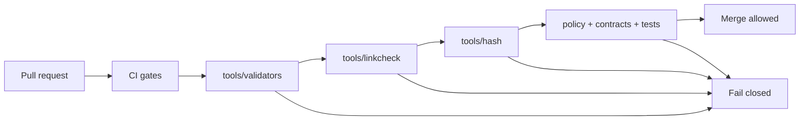

<!-- [KFM_META_BLOCK_V2]
doc_id: kfm://doc/f9897f92-8f95-4e15-a53f-c4aee0cb0fed
title: tools/ — Utility scripts, validators, and DevOps helpers
type: standard
version: v1
status: draft
owners: KFM Platform (TODO)
created: 2026-02-26
updated: 2026-02-28
policy_label: public
related:
  - ../contracts/
  - ../configs/
  - ../policy/
  - ../scripts/
  - ../tests/
  - docs/MASTER_GUIDE_v13.md
  - docs/standards/KFM_DCAT_PROFILE.md
  - docs/standards/KFM_STAC_PROFILE.md
  - docs/standards/KFM_PROV_PROFILE.md
tags: [kfm, tools, ci, validators, promotion-contract, evidence-first, trust-membrane, spec-hash]
notes:
  - tools/ contains maintainers’ tooling used by CI and operators to enforce the Promotion Contract (fail-closed gates).
  - Keep tools deterministic, policy-safe, and fixture-driven. Update the tool registry when adding/renaming/retiring tools.
  - This doc describes a target posture. Mark repo-specific facts as TODO until verified in-repo.
[/KFM_META_BLOCK_V2] -->

<a id="top"></a>

# `tools/` — Utility scripts, validators, and DevOps helpers

**Purpose:** Keep KFM *buildable, reversible, and evidence-backed* by running **fail-closed** checks in CI and locally (catalog validation, link checking, spec-hash drift detection, and other guardrails).


> [!IMPORTANT]
> `tools/` is part of KFM’s **trust membrane**. If a tool can be bypassed, is non-deterministic, or leaks restricted details in logs, it is a governance risk.

---

## Quick navigation

- [What lives here](#what-lives-here)
- [Repository alignment](#repository-alignment)
- [Non-negotiable invariants](#non-negotiable-invariants)
- [Directory layout](#directory-layout)
- [How tools fit the promotion flow](#how-tools-fit-the-promotion-flow)
- [Promotion Contract gate mapping](#promotion-contract-gate-mapping)
- [Quick start](#quick-start)
- [Tool registry and inventory](#tool-registry-and-inventory)
- [Conventions](#conventions)
- [Adding a new tool](#adding-a-new-tool)
- [Verification checklist](#verification-checklist)
- [Troubleshooting](#troubleshooting)
- [Appendix: recommended CLI contract](#appendix-recommended-cli-contract)

---

## What lives here

This folder is reserved for **utility scripts, validators, and DevOps tooling** that:

- run in CI as **merge gates** or **promotion gates**, and/or
- are used by maintainers/operators during ingest/publish/release workflows.

### ✅ Acceptable contents

| Category | Examples | Typical outcome |
|---|---|---|
| Catalog validators | DCAT/STAC/PROV schema/profile validation | CI blocks invalid metadata |
| Cross-link checkers | Ensure DCAT ↔ STAC ↔ PROV ↔ receipts ↔ artifacts resolve | CI blocks broken evidence paths |
| Spec-hash & drift checks | Detect contract drift / canonicalization regressions | CI blocks “silent” version drift |
| Policy-safe lint checks | Disallow direct-store access, forbid secrets-in-repo patterns | CI blocks trust-membrane bypass |
| Release helpers (optional) | Build SBOMs, assemble release manifests, verify signatures | Reproducible release outputs |

### ❌ Not allowed in `tools/`

- One-off experiments or notebooks → put them in a dedicated experiments area (e.g., `mcp/`) or a PR sandbox.
- Production runtime code → belongs in `src/` / services, behind contracts/interfaces.
- Data pipelines → belong in pipeline modules/runners; tools can validate pipeline outputs.
- Raw/processed datasets → belong in `data/` truth-path zones.
- Secrets, tokens, credentials, kubeconfigs, or `.env` with real values → never commit.

> [!NOTE]
> Tools **prefer read-only validation**. If a tool *must write outputs*, it must:
> 1) write into the correct truth-path zone (usually `data/work/…`),  
> 2) emit a receipt and checksums, and  
> 3) never mutate canonical artifacts in place.

[Back to top](#top)

---

## Repository alignment

> [!IMPORTANT]
> **Do not claim repo-specific implementation details unless verified.** This README is allowed to describe the target posture, but any statement like “this script exists at X” must be marked TODO until confirmed.

### Confirmed (repo root)

- `tools/` exists as a top-level directory intended for **validators, link checkers, and CLI utilities**. *(Deeper tool paths still require in-repo verification.)*  

### TODO to verify in-repo

- Actual subfolders (`validators/`, `linkcheck/`, `hash/`, etc.) and the tool entrypoints actually used by CI.
- The precise CI wiring and which checks are *merge-blocking* vs *promotion-blocking*.

[Back to top](#top)

---

## Non-negotiable invariants

Tools exist to *enforce* these invariants (not merely document them):

1. **Fail closed**  
   If a tool cannot prove a requirement, it must exit non-zero and block the gate.

2. **Truth path discipline**  
   Tools must never “fix” canonical artifacts in place. Canonical artifacts are versioned and immutable by digest.

3. **Trust membrane preserved**  
   Tools must not introduce or normalize bypass patterns (e.g., direct DB/object-store reads from UI code).

4. **Evidence-first / cite-or-abstain support**  
   Tools must help ensure that:
   - EvidenceRefs resolve to EvidenceBundles (or the system abstains/denies),
   - catalogs and receipts are present and cross-linked.

5. **Canonical vs rebuildable**  
   Tools may rebuild projections, but projections are never treated as canonical truth. Tools must validate canonical sources.

6. **Deterministic identity and hashing**  
   Spec hashing must be canonicalized and stable. Any drift is a blocking failure unless explicitly versioned.

7. **Policy-safe output**  
   Tools must not leak restricted details (including “restricted existence”) via logs, timing hints, or error messages.

[Back to top](#top)

---

## Directory layout

> [!IMPORTANT]
> This layout is a recommended baseline. If your repo differs, update this README and keep the **Tool registry** accurate.

```text
```text id="tools-mega-tidy"
tools/                                                         # Tooling entrypoint (validators + checks + CI helpers)
├── README.md                                                  # This file (how to run + add new tools)
│
├── bin/                                                       # OPTIONAL: unified entrypoints/wrappers for CI + devs
│   ├── kfm-tools.{sh,ps1,js,ts,py}                            # "One CLI": dispatch by tool_id from registry
│   ├── kfm-tools.env.example                                  # Example env vars (NO real secrets)
│   └── README.md                                              # CLI contract + examples + exit codes
│
├── ci/                                                        # CI glue NOT specific to a single tool
│   ├── README.md                                              # How CI calls tools; required status checks
│   ├── changed_files.{sh,py,ts,js}                            # Compute "what changed" → scoped tool runs
│   ├── annotate_findings.{sh,py,ts,js}                        # Emit GitHub annotations from --json outputs
│   ├── upload_artifacts.{sh,py,ts,js}                         # Upload tool reports to CI artifacts
│   ├── gate_runner.{sh,py,ts,js}                              # Run merge/promotion gate sets (registry-driven)
│   └── fixtures/                                              # CI-glue fixtures (tiny, deterministic)
│       ├── valid/                                             # Valid fixtures
│       │   └── changed_files.sample.json                      # Sample "changed files" payload
│       └── invalid/                                           # Invalid fixtures (must fail)
│           └── changed_files.bad_paths.json                   # Bad paths payload (tests path validation)
│
├── registry/                                                  # Machine-readable registry + schemas + fixtures (small)
│   ├── tools.v1.json                                          # Canonical tool registry (owners, commands, gates, IO)
│   ├── tools.v1.lock.json                                     # OPTIONAL: resolved commands + digests/pins (determinism)
│   ├── owners.v1.yml                                          # OPTIONAL: owner aliases → CODEOWNERS mapping inputs
│   ├── schemas/                                               # Schemas for registry + common tool I/O
│   │   ├── tools_registry.v1.schema.json                      # Schema for tools.v1.json
│   │   ├── tool_result.v1.schema.json                         # Standard machine output envelope (--json)
│   │   ├── finding.v1.schema.json                             # Standard finding (code, severity, location, message)
│   │   ├── exit_codes.v1.schema.json                          # Allowed exit codes + meanings
│   │   ├── io_manifest.v1.schema.json                          # OPTIONAL: reads/writes contract (paths + zones)
│   │   ├── policy_safe_log.v1.schema.json                      # OPTIONAL: redaction/verbosity policy for logs
│   │   └── README.md                                          # How schemas evolve + versioning rules
│   ├── scripts/                                               # Registry maintenance utilities
│   │   ├── validate_registry.{sh,py,ts,js}                    # Schema-validate tools.v1.json
│   │   ├── render_inventory.{sh,py,ts,js}                     # Generate README inventory table from registry (no drift)
│   │   ├── diff_registry.{sh,py,ts,js}                        # Compare registry changes across branches
│   │   └── check_registry_drift.{sh,py,ts,js}                 # Block merge if table != registry (fail-closed)
│   └── fixtures/                                              # Valid/invalid registry examples (CI schema validation)
│       ├── valid/                                             # Valid registry fixtures
│       │   ├── tools.v1.minimal.json                          # Minimal valid registry fixture
│       │   ├── tools.v1.full.json                             # Full valid registry fixture
│       │   └── README.md                                      # How fixtures are used in CI
│       └── invalid/                                           # Invalid registry fixtures (must fail)
│           ├── tools.v1.missing_owner.json                    # Invalid: missing owner
│           ├── tools.v1.bad_gate.json                         # Invalid: unknown gate
│           ├── tools.v1.bad_paths.json                        # Invalid: illegal IO paths
│           ├── tools.v1.bad_exit_codes.json                   # Invalid: exit code not allowed by schema
│           └── README.md                                      # Fixture notes
│
├── validators/                                                # Metadata + schema validators (fail-closed; read-only)
│   ├── README.md                                              # What validators check + expected inputs/outputs
│   ├── validate_dcat.{sh,py,ts,js}                            # Validate DCAT against KFM profile (+ required fields)
│   ├── validate_stac.{sh,py,ts,js}                            # Validate STAC Collections/Items/Assets (+ KFM constraints)
│   ├── validate_prov.{sh,py,ts,js}                            # Validate PROV bundles (+ required links/agents/activities)
│   ├── validate_receipts.{sh,py,ts,js}                        # Validate run_receipt + run_manifest/promotion_manifest schemas
│   ├── validate_pipeline_yaml.{sh,py,ts,js}                   # OPTIONAL: validate pipeline.yaml contract (if present)
│   ├── validate_watchers_registry.{sh,py,ts,js}               # OPTIONAL: validate watchers registry schema/signature
│   ├── validate_catalog_bundle.{sh,py,ts,js}                  # One-shot: validate DCAT+STAC+PROV+receipts as a set
│   ├── validate_contract_versions.{sh,py,ts,js}               # Ensure artifacts declare supported schema/profile versions
│   ├── profiles/                                              # OPTIONAL: local profile copies/extensions (read-only)
│   │   ├── dcat/                                              # DCAT profile rules (repo-specific)
│   │   ├── stac/                                              # STAC extension constraints (repo-specific)
│   │   └── prov/                                              # PROV profile rules (repo-specific)
│   └── fixtures/                                              # Tiny valid/invalid examples (synthetic/sanitized)
│       ├── dcat/                                              # DCAT fixtures
│       │   ├── valid/                                         # Valid DCAT fixtures
│       │   │   ├── minimal_dcat.jsonld                         # Minimal valid DCAT
│       │   │   ├── full_dcat.jsonld                            # Full valid DCAT
│       │   │   └── FIXTURE_NOTES.md                            # Fixture provenance + constraints
│       │   └── invalid/                                       # Invalid DCAT fixtures (must fail)
│       │       ├── missing_license.jsonld                      # Missing license
│       │       ├── missing_publisher.jsonld                    # Missing publisher
│       │       ├── bad_distribution_href.jsonld                # Bad distribution href
│       │       └── FIXTURE_NOTES.md                            # Fixture notes
│       ├── stac/                                              # STAC fixtures
│       │   ├── valid/                                         # Valid STAC fixtures
│       │   │   ├── collection.json                             # Valid collection
│       │   │   ├── item.json                                   # Valid item
│       │   │   ├── item-assets.json                            # Valid item assets
│       │   │   └── FIXTURE_NOTES.md                            # Fixture notes
│       │   └── invalid/                                       # Invalid STAC fixtures (must fail)
│       │       ├── missing_datetime.json                       # Missing datetime
│       │       ├── invalid_bbox.json                           # Invalid bbox
│       │       ├── missing_license.json                        # Missing license
│       │       └── FIXTURE_NOTES.md                            # Fixture notes
│       ├── prov/                                              # PROV fixtures
│       │   ├── valid/                                         # Valid PROV fixtures
│       │   │   ├── prov.jsonld                                 # Valid PROV bundle
│       │   │   └── FIXTURE_NOTES.md                            # Fixture notes
│       │   └── invalid/                                       # Invalid PROV fixtures (must fail)
│       │       ├── missing_activity.jsonld                     # Missing activity
│       │       ├── missing_agent.jsonld                        # Missing agent
│       │       ├── orphan_entity.jsonld                        # Orphan entity (no generating activity)
│       │       └── FIXTURE_NOTES.md                            # Fixture notes
│       ├── receipts/                                          # Receipt/manifests fixtures
│       │   ├── valid/                                         # Valid receipts/manifests
│       │   │   ├── run_receipt.json                            # Valid run receipt
│       │   │   ├── run_manifest.json                           # Valid run manifest
│       │   │   ├── promotion_manifest.json                     # Valid promotion manifest
│       │   │   └── FIXTURE_NOTES.md                            # Fixture notes
│       │   └── invalid/                                       # Invalid receipts/manifests (must fail)
│       │       ├── missing_checksums.json                      # Missing checksums
│       │       ├── missing_policy_fields.json                  # Missing policy fields
│       │       ├── nondeterministic_fields.json                # Contains nondeterministic fields
│       │       └── FIXTURE_NOTES.md                            # Fixture notes
│       ├── pipeline/                                          # Pipeline config fixtures (optional)
│       │   ├── valid/                                         # Valid pipeline fixtures
│       │   │   ├── pipeline.yaml                               # Valid pipeline config
│       │   │   └── FIXTURE_NOTES.md                            # Fixture notes
│       │   └── invalid/                                       # Invalid pipeline fixtures (must fail)
│       │       ├── missing_inputs.yaml                         # Missing inputs
│       │       ├── bad_schedule.yaml                           # Bad schedule
│       │       └── FIXTURE_NOTES.md                            # Fixture notes
│       └── watchers/                                          # Watcher registry fixtures (optional)
│           ├── valid/                                         # Valid watcher fixtures
│           │   ├── registry.yml                                # Valid registry
│           │   └── FIXTURE_NOTES.md                            # Fixture notes
│           └── invalid/                                       # Invalid watcher fixtures (must fail)
│               ├── missing_signature.yml                       # Missing signature
│               ├── bad_owner.yml                               # Bad/unknown owner
│               └── FIXTURE_NOTES.md                            # Fixture notes
│
├── linkcheck/                                                 # Cross-link integrity checks (no broken refs)
│   ├── README.md                                              # Cross-link rules + what is considered "required"
│   ├── catalog_triplet_linkcheck.{sh,py,ts,js}                # DCAT ↔ STAC ↔ PROV required cross-links
│   ├── evidence_ref_linkcheck.{sh,py,ts,js}                   # EvidenceRef resolvability (format + target exists)
│   ├── receipt_artifact_linkcheck.{sh,py,ts,js}               # Receipts ↔ checksums ↔ artifact paths resolve
│   ├── citation_linkcheck.{sh,py,ts,js}                       # OPTIONAL: story/docs citations resolve via EvidenceRefs
│   ├── docs_linkcheck.{sh,py,ts,js}                           # OPTIONAL: markdown link checker (repo-internal)
│   ├── no_restricted_existence_leaks.{sh,py,ts,js}            # Ensure errors don't distinguish forbidden vs missing
│   └── fixtures/                                              # Linkcheck fixtures (tiny, deterministic)
│       ├── valid/                                             # Valid linkcheck fixtures
│       │   ├── triplet_ok/                                    # Minimal valid triplet bundle
│       │   │   ├── dcat.jsonld                                 # DCAT fixture
│       │   │   ├── stac/collection.json                        # STAC collection fixture
│       │   │   ├── stac/items/item-001.json                    # STAC item fixture
│       │   │   ├── prov/prov.jsonld                            # PROV fixture
│       │   │   └── receipts/run_receipt.json                   # Receipt fixture
│       │   ├── evidence_refs_ok.json                           # EvidenceRef list (all resolvable)
│       │   └── docs_ok/                                       # Markdown docs with valid links
│       │       ├── README.md                                   # Valid links
│       │       └── linked.md                                   # Valid links
│       └── invalid/                                           # Invalid fixtures (must fail)
│           ├── triplet_broken_link/                            # Broken triplet (missing target)
│           │   ├── dcat.jsonld                                 # Points to missing STAC item
│           │   └── stac/collection.json                        # Collection only
│           ├── evidence_ref_bad_scheme.json                    # Invalid EvidenceRef scheme
│           ├── receipt_missing_artifact.json                   # Receipt references missing artifact
│           └── docs_broken_link/                               # Markdown docs with broken link
│               ├── README.md                                   # Contains missing relative link
│               └── linked.md                                   # References missing file
│
├── hash/                                                      # Spec-hash helpers + drift checks (determinism guardrails)
│   ├── README.md                                              # Hashing tools overview + determinism rules
│   ├── compute_spec_hash.{sh,py,ts,js}                        # Deterministic spec hash computation
│   ├── canonicalize_json.{sh,py,ts,js}                        # Canonical JSON serializer (stable ordering/whitespace)
│   ├── check_spec_hash_drift.{sh,py,ts,js}                    # Recompute + compare; fail on drift
│   ├── check_hash_inputs.{sh,py,ts,js}                        # Fail if spec includes nondeterministic fields
│   ├── compute_artifact_checksums.{sh,py,ts,js}               # OPTIONAL: create checksums.json for artifacts
│   ├── verify_artifact_checksums.{sh,py,ts,js}                # OPTIONAL: verify checksums.json matches artifacts
│   └── fixtures/                                              # Hash fixtures (vectors/inputs/expected)
│       ├── vectors.v1.json                                    # Canonical test vector list
│       ├── inputs/                                            # Hash inputs
│       │   ├── dataset_spec_minimal.json                       # Minimal spec
│       │   ├── dataset_spec_with_ordering_noise.json           # Ordering noise spec (should hash same)
│       │   ├── dataset_spec_invalid_nondeterminism.json        # Invalid nondeterministic fields spec
│       │   └── receipts_with_nondeterminism.json               # Receipts containing nondeterminism (must fail)
│       └── expected/                                          # Expected outputs
│           ├── vectors.v1.expected.json                        # Expected sha256 outputs
│           ├── checksums.expected.json                         # Expected checksums outputs
│           └── FIXTURE_NOTES.md                                # Fixture notes (provenance + constraints)
│
├── lint/                                                      # Static guardrails (trust membrane + hygiene)
│   ├── README.md                                              # Lint guardrails overview + false-positive policy
│   ├── check_no_secrets.{sh,py,ts,js}                         # Secret scanning helpers (if not handled elsewhere)
│   ├── check_no_direct_store_access.{sh,py,ts,js}             # Forbid forbidden deps/egress patterns in forbidden layers
│   ├── check_policy_safe_errors.{sh,py,ts,js}                 # Enforce safe error envelope conventions
│   ├── check_license_headers.{sh,py,ts,js}                    # OPTIONAL: enforce license header posture
│   ├── check_large_files.{sh,py,ts,js}                        # OPTIONAL: block huge binaries in repo
│   └── fixtures/                                              # Lint fixtures (valid/invalid)
│       ├── valid/                                             # Valid codebases/errors
│       │   ├── ok_codebase/                                   # Clean example
│       │   └── ok_errors/                                     # Clean error envelopes
│       └── invalid/                                           # Invalid examples (must fail)
│           ├── contains_secret/                                # Example secret leakage
│           ├── direct_s3_access_in_ui/                         # Forbidden direct store access
│           ├── error_leaks_restricted_existence/               # Error reveals forbidden vs missing
│           └── missing_license_headers/                        # Missing license headers
│
├── policycheck/                                               # OPTIONAL: wrappers for policy-as-code gates
│   ├── README.md                                              # How CI runs OPA/Conftest + pinned versions
│   ├── opa_test.{sh,py,ts,js}                                 # Run `opa test ...` consistently
│   ├── conftest_gate.{sh,py,ts,js}                            # Run Conftest on schemas/receipts/watchers (deny-by-default)
│   ├── bundle_policy.{sh,py,ts,js}                            # OPTIONAL: build/publish policy bundles
│   └── fixtures/                                              # Policycheck fixtures
│       ├── allow/                                             # Allow cases
│       ├── deny/                                              # Deny cases
│       └── obligations/                                       # Obligation cases
│
├── packaging/                                                 # OPTIONAL: deterministic artifact packaging + validation
│   ├── README.md                                              # Formats supported + determinism rules
│   ├── validate_geoparquet.{sh,py,ts,js}                      # Validate GeoParquet
│   ├── validate_pmtiles.{sh,py,ts,js}                         # Validate PMTiles
│   ├── validate_cog.{sh,py,ts,js}                             # Validate Cloud Optimized GeoTIFF
│   ├── validate_zarr.{sh,py,ts,js}                            # Validate Zarr
│   └── fixtures/                                              # Packaging fixtures
│       ├── valid/                                             # Valid artifacts
│       │   ├── geoparquet/                                     # Valid GeoParquet samples
│       │   ├── pmtiles/                                        # Valid PMTiles samples
│       │   ├── cog/                                            # Valid COG samples
│       │   └── zarr/                                           # Valid Zarr samples
│       └── invalid/                                           # Invalid artifacts (must fail)
│           ├── geoparquet/                                     # Invalid GeoParquet samples
│           ├── pmtiles/                                        # Invalid PMTiles samples
│           ├── cog/                                            # Invalid COG samples
│           └── zarr/                                           # Invalid Zarr samples
│
├── oci/                                                       # OPTIONAL: OCI distribution helpers (ORAS/Cosign plumbing)
│   ├── README.md                                              # Push/pull by digest; referrers; “no tags as identity”
│   ├── publish_artifact.{sh,py,ts,js}                         # Publish blob/artifact by digest
│   ├── attach_referrers.{sh,py,ts,js}                         # Attach receipt/prov/sbom as referrers
│   ├── list_referrers.{sh,py,ts,js}                           # List referrers (verify evidence “travels”)
│   ├── verify_referrers.{sh,py,ts,js}                         # Verify signatures/attestations
│   └── fixtures/                                              # OCI fixtures
│       ├── valid/                                             # Valid OCI examples
│       │   ├── minimal_oci_artifact/                           # Minimal artifact layout
│       │   └── minimal_referrers/                              # Minimal referrers layout
│       └── invalid/                                           # Invalid OCI examples (must fail)
│           ├── unsigned_referrer/                              # Missing signature/attestation
│           └── wrong_digest/                                   # Digest mismatch
│
├── supply_chain/                                              # OPTIONAL: SBOMs + attestations (release hardening)
│   ├── README.md                                              # SBOM + attestation conventions
│   ├── build_sbom.{sh,py,ts,js}                               # Build SBOM
│   ├── sign_attest.{sh,py,ts,js}                              # Sign/attest wrapper (NEVER stores keys in repo)
│   ├── verify_attest.{sh,py,ts,js}                            # Verify attestations
│   └── fixtures/                                              # Supply-chain fixtures
│       ├── valid/                                             # Valid SBOM/attestation examples
│       └── invalid/                                           # Invalid SBOM/attestation examples
│
├── watchers/                                                  # OPTIONAL: watcher tooling support (tools validate + dry-run)
│   ├── README.md                                              # How watchers registry is validated + dry-run usage
│   ├── validate_watchers_registry.{sh,py,ts,js}               # Duplicate entrypoint (discoverability)
│   ├── run_watcher_dry_run.{sh,py,ts,js}                      # Execute watcher without side effects (optional)
│   └── fixtures/                                              # Watcher fixtures
│       ├── valid/                                             # Valid watcher fixtures
│       └── invalid/                                           # Invalid watcher fixtures
│
├── graph/                                                     # OPTIONAL: graph mapping + invariants checks
│   ├── README.md                                              # Graph tooling overview
│   ├── validate_graph_mappings.{sh,py,ts,js}                  # Validate graph mappings YAML shape
│   ├── run_graph_invariants.{sh,py,ts,js}                     # Run invariants (Cypher) against test graph
│   ├── schemas/                                               # Graph tool schemas
│   │   └── graph_mapping.v1.schema.json                       # Graph mapping schema
│   ├── mappings/                                              # Example mappings (source lives elsewhere)
│   │   └── _examples/                                         # Examples only
│   │       └── example_domain.yml                              # Example mapping
│   ├── invariants/                                            # Invariant queries/tests
│   │  ├── invariants.cypher                                   # Example invariants
│   │  └── README.md                                           # Invariants notes
│   └── fixtures/                                              # Graph tool fixtures
│       ├── valid/                                             # Valid fixtures
│       └── invalid/                                           # Invalid fixtures
│
├── eval/                                                      # OPTIONAL: “trust membrane” evaluation harness runners
│   ├── README.md                                              # Eval tooling overview
│   ├── focus_eval.{sh,py,ts,js}                               # Run Focus Mode golden evals (optional)
│   ├── evidence_resolver_contract.{sh,py,ts,js}               # Evidence resolver contract checks (optional)
│   └── fixtures/                                              # Eval fixtures
│       ├── golden_queries/                                    # Golden queries
│       └── expected_outputs/                                  # Expected outputs
│
├── domains/                                                   # OPTIONAL: domain-specific tooling modules (kept isolated)
│   ├── README.md                                              # How to add domain tools; naming + ownership
│   ├── wzdx/                                                  # Example domain tool module
│   │   ├── normalize.{sh,py,ts,js}                            # Normalize WZDx feeds
│   │   ├── validate_wzdx.{sh,py,ts,js}                        # Validate WZDx shape/constraints
│   │   └── fixtures/                                          # WZDx fixtures
│   │       ├── valid/                                         # Valid WZDx fixtures
│   │       │   └── wzdx_sample.json                            # Sample valid payload
│   │       └── invalid/                                       # Invalid WZDx fixtures (must fail)
│   │           └── missing_required_field.json                 # Missing required field
│   ├── gtfs/                                                  # Optional placeholder (transit)
│   └── soils/                                                 # Optional placeholder (soil datasets)
│
├── release/                                                   # OPTIONAL: release tooling (must be deterministic)
│   ├── README.md                                              # How releases are assembled + verified
│   ├── build_sbom.{sh,py,ts,js}                               # SBOM build (if used)
│   ├── build_release_manifest.{sh,py,ts,js}                   # Assemble release metadata + digests
│   ├── verify_release_artifacts.{sh,py,ts,js}                 # Verify digests/signatures/attestations (if used)
│   ├── sign_release.{sh,py,ts,js}                             # Signing wrapper (NEVER stores keys in repo)
│   └── fixtures/                                              # Release fixtures
│       ├── valid/                                             # Valid release fixtures
│       │   ├── release_manifest.json                           # Valid manifest
│       │   └── SBOM.spdx.json                                  # Valid SBOM
│       └── invalid/                                           # Invalid fixtures (must fail)
│           ├── missing_digest.json                              # Missing digest
│           └── tampered_manifest.json                           # Tampered manifest
│
├── _shared/                                                   # Shared helper libs (small; minimal side effects)
│   ├── README.md                                              # Shared helpers contract (keep pure where possible)
│   ├── fs.{py,ts,js}                                          # Safe file IO helpers (path traversal defense)
│   ├── json.{py,ts,js}                                        # Canonical JSON + strict parsing helpers
│   ├── log.{py,ts,js}                                         # Structured logging helpers (policy-safe)
│   ├── errors.{py,ts,js}                                      # Error/finding helpers (codes, severities)
│   ├── exit_codes.{py,ts,js}                                  # Exit code constants + mapping
│   ├── time.{py,ts,js}                                        # Time helpers (avoid nondeterminism in hashes)
│   ├── cli.{py,ts,js}                                         # OPTIONAL: shared CLI parsing + --json plumbing
│   └── redact.{py,ts,js}                                      # OPTIONAL: redaction helpers for logs/errors
│
└── fixtures/                                                  # Shared fixtures (synthetic/sanitized; tiny; documented)
    ├── public/                                                # Public-safe fixtures
    │   ├── FIXTURE_NOTES.md                                   # License + sensitivity + intended use
    │   ├── minimal_catalog_bundle/                            # Tiny end-to-end bundle for validators/linkcheck
    │   │   ├── dcat.jsonld                                     # Minimal DCAT
    │   │   ├── stac/collection.json                            # Minimal STAC collection
    │   │   ├── stac/items/item-001.json                        # Minimal STAC item
    │   │   ├── prov/prov.jsonld                                # Minimal PROV bundle
    │   │   └── receipts/run_receipt.json                       # Minimal run receipt
    │   ├── minimal_policy_bundle/                             # Optional: conftest fixtures
    │   │   ├── input.json                                      # Policy input
    │   │   └── expected.json                                   # Expected decision
    │   ├── minimal_oci_referrers/                             # Optional: stub manifests used by OCI tools
    │   │   ├── artifact.json                                   # Artifact descriptor
    │   │   ├── receipt.referrer.json                           # Receipt referrer descriptor
    │   │   └── prov.referrer.json                              # PROV referrer descriptor
    │   └── minimal_openapi/                                   # Optional: contract tool fixtures
    │       └── openapi.v1.yaml                                 # Minimal OpenAPI fixture
    └── restricted_sanitized/                                  # Sanitized fixtures (no precise coords/identifiers)
        ├── FIXTURE_NOTES.md                                   # Sanitization notes + constraints
        ├── generalized_geometry_bundle/                       # Coarse geometry bundle for “no leakage” tests
        │   ├── dcat.jsonld                                     # DCAT with generalized extents
        │   └── stac/items/item-001.json                        # STAC item with generalized geometry
        ├── policy_safe_error_cases/                           # Error envelope examples (policy-safe)
        │   ├── forbidden.json                                  # Forbidden envelope example
        │   └── not_found.json                                  # Not-found envelope (indistinguishable/safe variant)
        └── restricted_receipts_sanitized/                     # Sanitized receipt examples
            ├── run_receipt.redacted.json                       # Redacted run receipt
            └── README.md                                       # Notes on redaction and intended use
```


[Back to top](#top)

---

## How tools fit the promotion flow



> [!WARNING]
> Tools should not “paper over” missing artifacts. If a catalog or receipt is missing, the correct output is a **blocking failure** (deny-by-default posture).

[Back to top](#top)

---

## Promotion Contract gate mapping

Tools are not “nice-to-have QA.” They are how the **Promotion Contract** becomes enforceable behavior in CI and during operator-driven promotion.

### Gates → tool categories (starter mapping)

| Promotion Contract gate | What must be true | Typical tool category | Typical artifacts validated |
|---|---|---|---|
| **Gate A — Identity & versioning** | Stable `dataset_id`/`dataset_version_id`; deterministic `spec_hash`; content digests | `hash/` + registry/schema checks | dataset spec, registry entry, digests |
| **Gate B — Licensing & rights metadata** | License/rights fields present + upstream terms snapshot | validators + policy tests | DCAT, registry entry, license snapshot |
| **Gate C — Sensitivity & redaction plan** | `policy_label` present; obligations defined + honored | policy tests + lint | OPA fixtures, redaction rules |
| **Gate D — Catalog triplet validation** | DCAT/STAC/PROV validate + cross-link; EvidenceRefs resolve | `validators/` + `linkcheck/` | DCAT/STAC/PROV + EvidenceRefs |
| **Gate E — QA & thresholds** | Dataset QA checks exist + pass thresholds | validators + QA runners | QA reports, thresholds in spec |
| **Gate F — Run receipt & audit record** | Run receipt exists; captures inputs/tooling/hashes/policy decisions | receipt validators + policy tests | run_receipt, checksums, attestations |
| **Gate G — Release manifest (recommended)** | Promotion recorded as a manifest referencing digests | `release/` + verification | promotion manifest, release notes |

> [!NOTE]
> Keep the mapping **explicit** in the tool registry (which gates each tool enforces). CI should be able to answer: “Which tool proves Gate D?” without tribal knowledge.

[Back to top](#top)

---

## Quick start

> [!NOTE]
> Commands here are examples. Wire the repo’s real entry points (Makefile/Taskfile/npm scripts) and update this section accordingly.

### Run the core gates locally (example)

```bash
# From repo root (replace with your repo's actual bootstrap)
make bootstrap

# Validate catalogs/provenance/receipts (Gate D + F)
make tools-validate

# Cross-link check (Gate D)
make tools-linkcheck

# Spec-hash drift checks (Gate A)
make tools-hash-check

# Policy + lint guardrails (Gate C + general hygiene)
make tools-lint
```

### Minimal “direct invocation” pattern (example)

```bash
# Validators
./tools/validators/validate_dcat.sh
./tools/validators/validate_stac.sh
./tools/validators/validate_prov.sh

# Linkcheck
./tools/linkcheck/catalog_triplet_linkcheck.sh

# Hash/drift
./tools/hash/check_spec_hash_drift.sh
```

[Back to top](#top)

---

## Tool registry and inventory

KFM prefers a **machine-readable registry** so CI can run tools consistently and owners can be routed via CODEOWNERS.

### `tools/registry/tools.v1.json` (recommended fields)

At minimum:
- tool id + path
- owner
- gate type (merge vs promotion)
- **promotion gates enforced** (A–G)
- inputs/outputs (read-only vs writes)
- required fixtures/tests
- timeout expectations
- policy-safe logging flag

Example shape (illustrative):

```json
{
  "version": "v1",
  "tools": [
    {
      "tool_id": "kfm.tools.validate_dcat",
      "path": "tools/validators/validate_dcat.sh",
      "owner": "KFM Platform",
      "gate": "merge",
      "enforces_promotion_gates": ["B", "D"],
      "reads": ["data/catalog/**"],
      "writes": [],
      "requires_fixtures": true,
      "timeout_seconds": 120,
      "policy_safe_logs": true
    }
  ]
}
```

### Tool inventory (human-readable)

Keep this table up-to-date (it should match the registry):

| Tool | Type | What it checks | Gate type | Promotion gates | Owner |
|---|---|---|---|---|---|
| `tools/validators/validate_dcat.*` | validator | DCAT conforms to KFM profile; rights/license fields present | merge/promotion | B, D | TODO |
| `tools/validators/validate_stac.*` | validator | STAC Items/Collections/Assets conform to KFM profile | merge/promotion | D | TODO |
| `tools/validators/validate_prov.*` | validator | PROV bundle shape + required lineage links present | merge/promotion | D | TODO |
| `tools/validators/validate_receipts.*` | validator | run_receipt + checksums + promotion_manifest schema validity | promotion | F, G | TODO |
| `tools/linkcheck/catalog_triplet_linkcheck.*` | linkcheck | DCAT ↔ STAC ↔ PROV cross-links resolve deterministically | merge/promotion | D | TODO |
| `tools/hash/check_spec_hash_drift.*` | drift check | Deterministic spec-hash stability; blocks unintended drift | merge | A | TODO |
| `tools/lint/check_no_direct_store_access.*` | lint | Trust membrane guardrail: forbid forbidden deps/egress patterns | merge | (Trust membrane) | TODO |

[Back to top](#top)

---

## Conventions

### Deterministic and auditable

- **Deterministic**: same inputs ⇒ same pass/fail decision.
- **Fixture-driven**: every rule has fixtures (valid + invalid).
- **Offline-first**: avoid network calls. If unavoidable, pin versions and record what was accessed.

### Safe by default

- Treat files as untrusted input (strict parsing, safe path handling).
- Never print secrets or restricted data.
- Prefer **policy-safe error outputs**:
  - do not distinguish “not found” vs “forbidden” in ways that leak restricted existence
  - keep error messages actionable for maintainers but safe for CI logs

### Read-only posture (preferred)

- Validators/linkcheck/hash tools should not mutate artifacts.
- If a tool must write outputs:
  - write into the correct truth-path zone (usually `data/work/…`)
  - emit `checksums.json` and a run receipt
  - never overwrite canonical artifacts in place

[Back to top](#top)

---

## Adding a new tool

Every new tool must ship with:

- [ ] A clear location: `tools/<area>/<tool_name>.(sh|py|js|ts|go)`
- [ ] A help/usage entry point (`--help` or header comment)
- [ ] Deterministic behavior (same inputs ⇒ same decision)
- [ ] Fixtures: **known-good** + **known-bad**
- [ ] Tests (unit tests minimum; integration tests if it is a gate)
- [ ] Entry in `tools/registry/tools.v1.json` including **which Promotion Contract gates it enforces**
- [ ] Entry in the [Tool inventory](#tool-registry-and-inventory)
- [ ] CI wiring (if the tool is a gate)
- [ ] Policy-safe logging (no restricted details; no secrets)

> [!TIP]
> If the tool enforces a Promotion Contract gate, treat it like a contract change: update fixtures, schema validators, and documentation together.

[Back to top](#top)

---

## Verification checklist

Use this checklist to turn “target posture” into **confirmed repo facts** (attach outputs to the next README revision):

- [ ] Capture repo commit hash and root directory tree: `git rev-parse HEAD` and `tree -L 3`.
- [ ] Confirm which work packages already exist: search for `spec_hash`, OPA policies, validators, evidence resolver route, and dataset registry schema.
- [ ] Extract CI gate list from `.github/workflows` and document which checks are blocking merges.
- [ ] Choose a single MVP dataset and verify it can be promoted through all gates with receipts and catalogs.
- [ ] Validate that UI cannot bypass the PEP (static analysis + network policies) and that EvidenceRefs resolve end-to-end in Map Explorer and Story publishing.
- [ ] For Focus Mode: run the evaluation harness and store golden query outputs and diffs as artifacts.

[Back to top](#top)

---

## Troubleshooting

### “Validator passes locally but fails in CI”
- Confirm CI and local are using the same tool version/runtime.
- Confirm fixtures are checked in and paths match CI working directory.
- Confirm the tool is deterministic (no timestamps or environment-dependent ordering).

### “Linkcheck failures”
Common causes:
- DCAT distribution points to missing STAC Item
- STAC asset href changed but catalogs not updated
- PROV references missing run receipt or entity id

Fix the *metadata* and receipts—do not weaken linkcheck rules “to get CI green”.

### “Spec-hash drift failures”
- If drift is expected (intentional contract change): bump the relevant contract/version and update golden vectors.
- If drift is not expected: verify canonicalization rules and field normalization.

### “Tool logs might leak restricted details”
- Treat as a P0 governance bug.
- Redact/aggregate outputs, and enforce policy-safe error shaping.

[Back to top](#top)

---

## Appendix: recommended CLI contract

Tools should follow a consistent CLI contract so CI can interpret results reliably.

### Flags (recommended)
- `--help` prints usage and exits `0`
- `--json` prints machine-readable output (for CI annotations)
- `--input <path>` optional explicit input root
- `--strict` fails on warnings (default for CI)

### Exit codes (recommended)
- `0` = pass
- `1` = validation failed (expected gate failure)
- `2` = tool error (misconfiguration, missing dependency, unexpected exception)

### Output contract (recommended)
- Progress logs → stderr
- Machine output → stdout (when `--json`)
- Never print secrets or restricted details

---

<a href="#top">Back to top</a>
