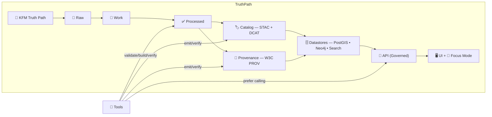
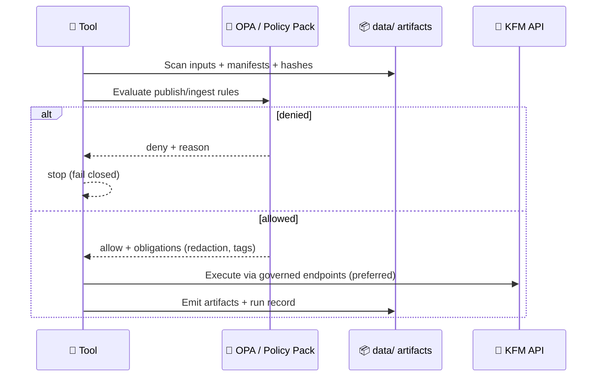

<div align="center">

<!-- 🧿 Optional: add the animated seal to the repo and update this path -->


# 🧰 KFM Tools — Dev + Ops Utilities

**Repeatable utilities for running, validating, and operating Kansas Frontier Matrix (KFM)**  
<sub><em>Tools are the “sharp knives” of the platform — powerful, audited, and governed.</em></sub>

<br/>


-1f6feb?style=for-the-badge)

<a href="#-quickstart">🚀 Quickstart</a> •
<a href="#-tool-philosophy-what-tools-must-and-must-not-do">🧭 Philosophy</a> •
<a href="#-tool-index">🧰 Tool Index</a> •
<a href="#-mcp-minimum-compliance-profile-for-tools">✅ MCP Standards</a> •
<a href="#-adding-a-new-tool">➕ Add a Tool</a>

</div>

---

> [!WARNING]
> 🚧 **Under construction:** this tooling layer is evolving quickly.  
> Expect utilities to move, consolidate into `tools/kfm`, and gain stricter policy/provenance gates over time.

> [!IMPORTANT]
> **Tools must not bypass KFM.**  
> Prefer **pipeline → catalog/provenance → DB → API** workflows over direct DB edits.  
> If a tool must touch DB internals (rare), it must do so with explicit guardrails + an audit trail.

---

## 🧭 What belongs in `tools/`

`tools/` is for **repeatable**, reviewable utilities that support the platform without eroding trust:

### ✅ Belongs here
- 🔎 **Validation/QA:** schema checks, artifact completeness, geometry sanity, link integrity
- 🗂️ **Catalog ops:** build/verify **STAC + DCAT**, cross-links, inventories
- 🧬 **Provenance ops:** build/verify **W3C PROV** bundles, manifests, checksums
- 🧱 **Data ops helpers:** exports, conversions, safe backfills (prefer pipeline-driven)
- 🐳 **Stack diagnostics:** health checks, dependency verification, port checks
- 🔐 **Policy utilities:** policy eval, fixture testing, “preflight” decisions
- 📦 **Packaging:** dataset bundles, release stamping, artifact signing (when enabled)

### 🚫 Does *not* belong here
- One-off experiments with no repeatable interface (put in `docs/` or a dedicated `notebooks/` area)
- Manual hot-fixes that bypass governance/provenance
- Secrets, keys, private URLs, or restricted raw data

---

## 🧭 Tool philosophy: what tools **must** (and must not) do

KFM is a governance system as much as it is a data system.

### ✅ Tools should:
- 🧾 **Preserve provenance** (stamp runs, inputs, outputs, hashes)
- 🔒 **Fail closed** (if metadata/policy/provenance is missing → stop)
- 🧱 **Prefer API boundaries** (the API is the “trust membrane”)
- ♻️ **Be re-runnable** (idempotent or explicitly versioned)
- 📦 **Produce artifacts** (manifests, logs, reports) that can be reviewed in PRs

### ⛔ Tools must not:
- “Quietly succeed” on partial or ungoverned outputs
- Make irreversible changes without a plan/dry-run mode
- Create new published assets without STAC/DCAT/PROV alignment

---

## 🧬 Tools inside the KFM “Truth Path”



**Design intent:** Tools are accelerators — not shortcuts.  
If a tool “skips steps,” it’s usually a governance bug.

---

## 🚀 Quickstart

### ✅ Recommended: run tools “in stack context” 🐳
From repo root:

```bash
docker compose up -d
```

Then run tools either:

**A) from your host (simple scripts):**
```bash
python tools/<tool>/run.py --help
```

**B) inside the API container (best for consistent GIS deps + DB connectivity):**
```bash
docker compose exec api bash
# inside container:
python -m tools.kfm --help
```

> [!TIP]
> If a tool needs PostGIS, Neo4j, GDAL/PROJ, or OPA decisions, prefer **container execution** so everyone runs the same dependencies.

---

## 📁 Tool index

> Keep this list current ✅ (tools are only “real” when discoverable)

### 🧩 Primary entrypoint
- **`tools/kfm/`** — KFM helper CLI (ops + validation glue)  
  👉 See: [`tools/kfm/README.md`](./kfm/README.md)

### 🧱 Common tool categories (recommended structure)
```text
tools/
├─ kfm/                    🧰 main CLI “front door” (subcommands)
├─ validate/               ✅ schema + artifact completeness
├─ catalog/                🗂️ build/verify STAC + DCAT
├─ prov/                   🧬 build/verify PROV + manifests
├─ policy/                 🔐 policy evaluation + fixtures (OPA/Conftest helpers)
├─ ops/                    🐳 stack checks, backups, migrations (guarded)
└─ export/                 📦 safe exports (API-first)
```

> [!NOTE]
> Not all folders may exist yet — this is the **target mental model** for how tooling stays organized over time.

---

## 🧯 Safety levels for tools (read this before running anything)

| Level | Name | Allowed behavior | Required features |
|---|---|---|---|
| 🟢 | Inspect | read-only checks, reports, diffs | `--help`, `--json` output |
| 🟡 | Plan | show intended changes, no writes | `--dry-run`/`--plan`, exit codes |
| 🔴 | Apply | writes/mutations (files/DB/services) | confirmations, audit record, provenance stamp |

> [!IMPORTANT]
> Any 🔴 tool must create a **run record** (see below) and should default to 🟡 Plan mode.

---

## 🧾 Tool run records (provenance for operations)

Every tool that **creates or mutates** artifacts should emit a run record capturing:

- 📌 tool name + version
- 🧾 inputs (dataset IDs, file paths, hashes)
- ⚙️ parameters/flags
- 🧠 environment (git commit SHA, container image digest if known)
- 🕰️ timestamps + duration
- ✅ outputs (paths, checksums) and a success/failure summary

**Recommended location:**
```text
data/provenance/tool-runs/<tool>/<timestamp>__<gitsha>.json
```

> [!TIP]
> Think of these as “receipts.” If we can’t reconstruct what happened, the operation didn’t happen (in KFM terms).

---

## 🔌 API-first operations (preferred pattern)

Tools should favor the governed API for actions like:
- dataset discovery
- metadata retrieval
- safe exports
- pipeline triggers (when enabled)
- policy decisions + redactions

### Handy endpoints (examples — trust Swagger as source of truth)
```bash
# Catalog search (keyword + bbox)
curl -s "http://localhost:8000/api/v1/catalog/search?q=railroad&bbox=-102,36,-94,41" | jq

# Dataset metadata summary
curl -s "http://localhost:8000/api/v1/datasets/ks_hydrology_1880" | jq

# Focus Mode (if enabled)
curl -s -X POST "http://localhost:8000/api/v1/ai/query" \
  -H "content-type: application/json" \
  -d '{"question":"What sources support the rail expansion timeline?"}' | jq
```

> [!NOTE]
> If you’re unsure what exists on your branch, use Swagger: `http://localhost:8000/docs`.

---

## 🔐 Policy-first tooling

If policy can’t decide, tools must **deny** (fail closed).  
Tools that publish datasets or trigger ingestion should preflight:

- ✅ license present
- ✅ sensitivity classification present
- ✅ source manifest present
- ✅ STAC/DCAT/PROV artifacts complete (or will be produced in this run)

### Suggested preflight flow


---

## ✅ MCP: Minimum Compliance Profile for tools

“MCP” is the baseline quality bar for anything we consider a **real** KFM tool.

### ✅ Required
- `--help` with examples
- deterministic output locations (or clearly documented)
- meaningful exit codes (0 success, non-zero failure)
- structured logging (timestamps; optional JSON logs)
- safe defaults (inspect/plan first)

### 🌟 Strongly recommended
- `--dry-run` / `--plan` mode
- `--json` output for automation
- `--output <dir>` (to keep artifacts in one place)
- provenance run record emission (see above)
- policy preflight / “explain deny” output

### 🔒 For destructive operations
- “danger zone” callout in README
- explicit confirmation flags (e.g., `--yes-i-mean-it`)
- backups or rollback notes

---

## 🛠️ Troubleshooting

### 🧱 API / DB connectivity
```bash
docker compose logs api --tail=200
```

Common culprits:
- port conflicts (PostGIS 5432, API 8000, Neo4j 7474/7687, OPA 8181)
- services not ready (restart stack)
- volume permissions on `data/`

### 🔁 Changes not reflected
```bash
docker compose up -d --build
```

### 🧾 “Missing license / sensitivity / PROV”
✅ This is expected. It means governance is working.  
Fix the dataset’s boundary artifacts and rerun the tool.

---

## ➕ Adding a new tool

### ✅ Standard scaffold
```text
tools/
└─ <tool-name>/
   ├─ README.md                  📚 purpose + usage + what it changes
   ├─ src/                       🧠 implementation
   ├─ tests/                     🧪 smoke tests + fixtures
   ├─ fixtures/                  🧊 sample inputs/outputs (optional)
   └─ bin/                       🏃 entrypoint (optional)
```

### 📌 Tool README must answer
- 🎯 What does it do?
- 🧾 What inputs does it consume?
- ✅ What artifacts does it produce?
- 🔐 What policies/gates apply?
- 🧯 What can go wrong + how to recover?

### ✅ Add it to the index
Update: **Tool index** → [📁 Tool index](#-tool-index)

---

<div align="center">

### 🧭 Tooling mantra
**Make it repeatable. Make it auditable. Make it governed.**  
If it can’t be traced, validated, and reproduced… it’s not a tool — it’s a risk. 🧾🛡️

</div>
