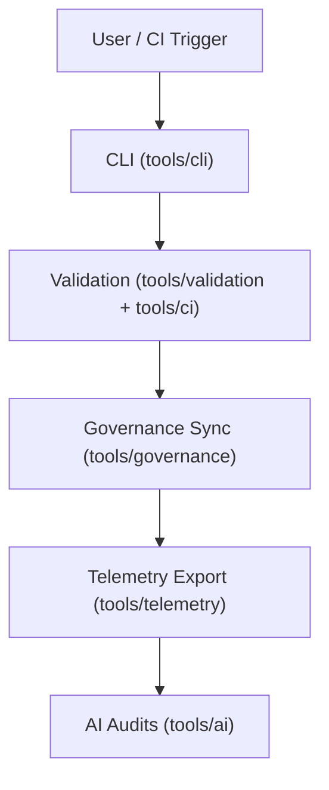

<div align="center">

# 🛠️ **Kansas Frontier Matrix — Tools Directory**  
`tools/README.md`

**Purpose:**  
Serve as the FAIR+CARE-certified hub for command-line utilities, CI/CD automations, validation scripts, governance synchronization, and telemetry tooling that power the Kansas Frontier Matrix (KFM).  
All tools are versioned, checksum-verified, and governed for transparent, reproducible, and ethical automation.

[](../docs/architecture/repo-focus.md)
[](../LICENSE)
[](../docs/standards/faircare-validation.md)
[]()

</div>

---

## 📘 Overview

`tools/` is KFM’s **operational command center**—hosting modular utilities for AI orchestration, schema & checksum validation, governance-ledger updates, sustainability telemetry, and documentation QA.  
Every tool adheres to **MCP-DL v6.3**, **FAIR+CARE ethics**, and **ISO 19115** alignment for audit-ready reproducibility.

---

## 🗂️ Directory Layout

```plaintext
tools/
├── README.md
│
├── ai/                      # AI & explainability audits
│   ├── focus_audit.py
│   ├── bias_check.py
│   └── drift_monitor.py
│
├── ci/                      # CI/CD automations
│   ├── docs_validate.yml
│   ├── checksum_verify.yml
│   └── site_deploy.yml
│
├── cli/                     # Command-line interfaces
│   ├── kfm_cli.py
│   └── metadata_manager.py
│
├── governance/              # Provenance & ethics tooling
│   ├── governance_sync.py
│   ├── ledger_update.py
│   └── certification_audit.py
│
├── telemetry/               # Metrics & sustainability
│   ├── telemetry_collector.py
│   ├── performance_analyzer.py
│   └── sustainability_reporter.py
│
└── validation/              # FAIR+CARE + schema validation
    ├── faircare_validator.py
    ├── schema_check.py
    └── ai_explainability_audit.py
```

---

## 🧩 Toolchain Workflow



1. **CLI:** Operators invoke repeatable tasks (ingest, validate, publish).  
2. **Validation:** Schemas, checksums, and docs are verified in CI.  
3. **Governance:** Outputs are registered to the ledger with provenance.  
4. **Telemetry:** Build, energy, and compliance metrics exported to `focus-telemetry.json`.  
5. **AI Audits:** Bias, drift, and explainability validated against FAIR+CARE criteria.

---

## 🧾 Example Governance Metadata

```json
{
  "id": "tools_registry_v10.0.0",
  "tools_registered": [
    "faircare_validator.py",
    "ledger_update.py",
    "telemetry_collector.py"
  ],
  "executions_logged": 187,
  "checksum_verified": true,
  "fairstatus": "certified",
  "ai_explainability_score": 0.994,
  "governance_registered": true,
  "validator": "@kfm-tools-lab",
  "created": "2025-11-10T18:59:00Z",
  "governance_ref": "data/reports/audit/data_provenance_ledger.json"
}
```

---

## 🧠 FAIR+CARE Governance Matrix

| Principle | Implementation | Oversight |
|---|---|---|
| **Findable** | Tools indexed in manifest and governance ledger. | @kfm-data |
| **Accessible** | MIT-licensed with MCP-DL docs and CLI `--help`. | @kfm-accessibility |
| **Interoperable** | ISO + FAIR+CARE aligned metadata and outputs. | @kfm-architecture |
| **Reusable** | Modular, scriptable, pinned dependencies & SBOM. | @kfm-design |
| **Collective Benefit** | Enables transparent, ethical automation for research. | @faircare-council |
| **Authority to Control** | Council certifies tooling releases and audits. | @kfm-governance |
| **Responsibility** | Security scans, SBOMs, and provenance logs maintained. | @kfm-security |
| **Ethics** | AI utilities audited for bias, inclusion, and transparency. | @kfm-ethics |

**Audit references:**  
`data/reports/fair/data_care_assessment.json` · `data/reports/audit/data_provenance_ledger.json`

---

## ⚙️ Key Tool Categories

| Module | Description | Role |
|---|---|---|
| `tools/ai/` | Explainability + bias/drift checks | Ethical AI assurance |
| `tools/ci/` | Docs, checksum, deploy workflows | CI/CD automation |
| `tools/cli/` | Operator entry points | Governance & ETL control |
| `tools/governance/` | Ledger & certification sync | Provenance traceability |
| `tools/telemetry/` | Performance & energy metrics | Observability |
| `tools/validation/` | FAIR+CARE & schema checks | Compliance gate |

Synchronized via `tools_sync.yml`.

---

## ⚖️ Retention & Provenance Policy

| Artifact | Retention | Policy |
|---|---:|---|
| Governance Logs | Permanent | Blockchain-backed records |
| Validation Reports | 365 Days | Archived for re-certification |
| Telemetry Data | 90 Days | Focus Mode analysis window |
| Tool Metadata | Permanent | Manifest + SBOM tracked |

Cleanup with `tools_cleanup.yml`.

---

## 🌱 Sustainability Metrics

| Metric | Value | Verified By |
|---|---:|---|
| Energy / Execution | 0.8 Wh | @kfm-sustainability |
| Carbon Output | 1.1 gCO₂e | @kfm-security |
| Renewable Power | 100% (RE100) | @kfm-infrastructure |
| FAIR+CARE Compliance | 100% | @faircare-council |

**Telemetry:** `../releases/v10.0.0/focus-telemetry.json`

---

## 🧾 Citation

```text
Kansas Frontier Matrix (2025). Tools Directory (v10.0.0).
FAIR+CARE-certified suite of automation, validation, and governance tools enabling reproducible and ethical operations across KFM under MCP-DL v6.3 and ISO 19115.
```

---

## 🕰️ Version History

| Version | Date | Notes |
|---|---|---|
| v10.0.0 | 2025-11-10 | Upgraded to v10; telemetry schema v2; SBOM/manifest refs bumped; governance & CI flows hardened. |
| v9.7.0 | 2025-11-05 | Telemetry schema v1; aligned SBOM & manifest references. |
| v9.6.0 | 2025-11-03 | Unified governance registry and CI synchronization. |
| v9.5.0 | 2025-11-02 | Expanded FAIR+CARE automation and schema validation. |
| v9.3.2 | 2025-10-28 | Established tools directory for CI/CD and governance automation. |

---

<div align="center">

**Kansas Frontier Matrix** · *Ethical Automation × FAIR+CARE Governance × Provenance Assurance*  
[🔗 Repository](../) • [🧭 Docs Portal](../docs/) • [⚖️ Governance Charter](../docs/standards/governance/ROOT-GOVERNANCE.md)

</div>
