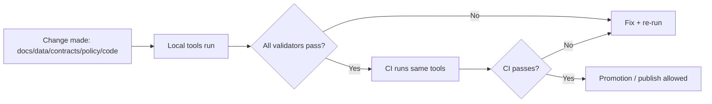

<!--
GOVERNED ARTIFACT NOTICE
This README describes KFM enforcement tooling. Tools are part of the governance boundary.
If you change meaning (not just phrasing), route through governance review (CODEOWNERS + CI gates).
-->

# 🧰 KFM Tools (`tools/`)


KFM’s `tools/` directory contains **validators, enforcement harnesses, and reproducibility helpers** that uphold KFM’s governance guarantees:

- evidence-first and “cite-or-abstain”
- deterministic specs and receipts (`spec_hash`, run manifests)
- schema-validated catalogs (DCAT/STAC/PROV) and cross-links
- policy-as-code gates (default deny)
- supply-chain hooks (optional: SBOM/attestations verification)
- reproducible, local-first verification (no CI-only magic)

> [!IMPORTANT]
> Tools are enforcement mechanisms, not “nice-to-have scripts.”  
> If a governed artifact can reach “published/servable” state, it must be able to pass the relevant tool gate(s) in CI.

---

## Governance header

| Field | Value |
|---|---|
| Document | `tools/README.md` |
| Status | **Governed** |
| Applies to | validators and CI gates for docs/stories/data/catalogs/receipts/policy/supply chain |
| Version | `v2.0.0-draft` |
| Effective date | 2026-02-15 |
| Owners | `.github/CODEOWNERS` *(required; if missing, treat as governance gap)* |
| Review triggers | any change affecting pass/fail semantics, default-deny posture, receipt validation, catalog validation, sensitivity handling |

> [!WARNING]
> **Fail-closed rule:** missing required signals (citations, receipts, catalogs, checksums, policy inputs) must be treated as failures, not warnings.

---

## 🔎 What this folder is for

### ✅ In scope (belongs in `tools/`)
- **Validators** used locally and/or in CI:
  - Docs: lint, link-check, template validation
  - Story Nodes: v3 validation, citation resolvability checks
  - Data: catalog validation (DCAT/STAC/PROV), checksum/digest verification
  - Receipts: run_record/run_manifest schema validation + `spec_hash` semantics checks
  - Policy: OPA/Rego tests + conftest harnesses (default deny)
  - Evidence: resolver contract tests (ref schemes resolve or deny safely)
  - Optional supply chain: SBOM generation + attestation/signature verification
- **Build/repo hygiene wrappers**
  - format/lint wrappers, file hygiene, “fail-closed” gate runners
- **Ops/DevOps helpers (verification-only)**
  - reproducible build checks, container scan wrappers, signature verification helpers
- **Deterministic fixtures**
  - tiny synthetic fixtures used by validators/tests to keep CI fast and stable

### ❌ Out of scope
- runtime product code:
  - API runtime code belongs in `src/server/`
  - pipeline implementation belongs in `pipelines/` or `src/pipelines/`
  - graph code belongs in `src/graph/`
  - UI code belongs in `web/`
- one-off personal scripts that aren’t deterministic, tested, and documented
- secrets/credentials/private keys

---

## 🗺️ Where `tools/` fits in the KFM architecture

KFM is contract-first and evidence-first. Tools exist to **prove** contracts are met.



---

## 🧱 Tooling principles (non-negotiable)

### Deterministic and replayable
Tools must produce stable results for the same inputs (or explicitly record differences in structured reports).

### Fail-closed
Missing required signals are hard failures:
- missing citations where required
- missing receipts or invalid schemas
- missing checksums/digests
- missing catalogs or broken cross-links
- missing policy inputs

### Machine-readable output
Every validator should emit:
- human-readable logs, and
- a structured report (JSON recommended) for CI artifact upload and audit trails

### No trust-membrane bypass
Tools may interrogate the system but must not introduce shortcuts that bypass governed API/policy boundaries (no UI→DB encouragement, no direct DB reads to “make it work”).

---

## 📁 Directory layout expectations

Subfolders may vary by implementation, but roles should remain stable.

```text
tools/
├── README.md                       # this file
├── bin/                            # optional: thin CLI wrappers (kfm verify, kfm lint, etc.)
├── docs/                           # docs validation (lint/link-check/template)
├── story/                          # Story Node validators + citation resolution checks
├── data/                           # DCAT/STAC/PROV validators + checksum/digest verifiers
├── receipts/                       # run_record/run_manifest validators + spec_hash checks
├── policy/                         # OPA/Rego tests + conftest packs + fixtures
├── evidence/                       # evidence resolver contract tests (ref → view)
├── supply-chain/                   # optional: SBOM + attestations verification helpers
├── fixtures/                       # small deterministic fixtures (synthetic; no sensitive data)
└── lib/                            # shared helper code (avoid copy/paste)
```

> [!NOTE]
> If your repo uses different names, maintain a mapping table in this README.

---

## ⚡ Quickstart (what to run before opening a PR)

Preferred: one umbrella command that matches CI.

### Recommended default
- `make verify` *(or equivalent wrapper)*

### Debug drills (when you need isolation)
1) docs gate  
2) story gate  
3) data/catalog gate  
4) receipts gate  
5) policy gate  
6) evidence resolver gate  
7) supply chain gate (optional; release-only)

> [!TIP]
> Keep the umbrella command as the default workflow and individual steps as debugging tools.

---

## ✅ CI gate mapping (coverage expectations)

If a gate is required in CI, it must be runnable locally from `tools/` using the same code paths.

| Gate | What it protects | What it must do | Typical failure modes |
|---|---|---|---|
| Docs | governed documentation integrity | lint, link-check, template validation | broken links, missing required headings/front matter |
| Stories | narrative governance | validate Story Node v3 + citation resolvability | missing/invalid citations, invalid template sections |
| Data/Catalogs | catalog correctness | validate DCAT/STAC/PROV + cross-links | schema errors, missing metadata, broken links |
| Receipts | promotion correctness | validate run_manifest/run_record + checksums + spec_hash semantics | missing receipt fields, digest mismatch, non-canonical spec hash |
| Policy | governance safety | `opa test` and/or `conftest test`, default deny preserved | regressions, allow-by-default drift |
| Evidence | reviewability | verify `ref` schemes resolve or deny safely | unresolvable refs, leaky denials |
| Supply chain | artifact integrity | SBOM + attestation verification (when enabled) | unsigned artifacts, provenance mismatch |

---

## 🧾 Standard tool interface contract

### CLI conventions
- `--help` prints usage and exits `0`
- `--json <path>` writes a machine report (and still prints human logs)
- `--strict` converts warnings into failures (recommended default for CI)
- `--paths-from <file>` accepts a changed-files list for scoped CI

### Exit codes (recommended)
- `0`: success
- `2`: validation failure (artifact invalid)
- `3`: tool execution error (missing dep/crash)
- `4`: policy denial / governance failure (explicit deny outcome)

### JSON report conventions (recommended)
- `tool_id`, `tool_version`
- `inputs` (paths, hashes where applicable)
- `checks[]` (id, status, message, evidence pointers)
- `summary` (pass/fail counts)
- `timestamp` *(optionally fixed/omitted in strict deterministic mode)*

---

## 🧪 Tests and fixtures

Tools used as CI gates must be tested.

### Minimum expectations
- unit tests for parsing/validation logic
- golden fixtures (small, deterministic)
- regression tests for previously-seen failures (especially policy and provenance)

### Fixture rules
- keep fixtures tiny and synthetic where possible
- avoid licensing issues (fixtures must be owned/created for the repo)
- never include restricted/sensitive real-world records in fixtures

---

## 🔐 Security, governance, and sensitive data handling

### Don’t leak sensitive details
- validation output should not print precise restricted coordinates or private identifiers
- prefer redacted values, generalized bboxes, or hashed identifiers

### No silent downgrades
- missing dependency/unreadable file is a failure, not a skip
- optional checks must be explicit (no surprise behavior changes)

### Dependency hygiene
- pin toolchain versions where possible (avoid “latest” drift)
- prefer offline-capable validation (important for air-gapped environments)

---

## 🧩 When to put code in `tools/` vs `src/`

Rule of thumb:
- `src/pipelines/` (or `pipelines/`): ETL jobs that produce outputs and catalogs
- `src/server/`: runtime API behavior and policy-enforced access
- `src/graph/`: graph build/ingest/constraints
- `web/`: UI
- `tools/`: validators, CI gates, repo hygiene, verification-only helpers

> [!NOTE]
> If code is required at runtime, it does not belong in `tools/`.

---

## 🛠️ Adding a new tool (checklist)

- [ ] pick the correct home (`tools/docs`, `tools/story`, `tools/data`, `tools/receipts`, `tools/policy`, `tools/evidence`, `tools/supply-chain`, or `tools/lib`)
- [ ] add a minimal README in the tool folder (purpose, inputs/outputs, usage, exit codes)
- [ ] add tests and fixtures (or extend existing fixtures)
- [ ] ensure deterministic output (stable ordering; avoid nondeterministic timestamps in strict mode)
- [ ] ensure CI can call it headlessly (no prompts)
- [ ] add the tool to the Tool Index below

---

## 🧭 Tool Index

| Area | Folder | Purpose | Typical artifacts checked |
|---|---|---|---|
| Docs | `tools/docs/` | lint, link-check, template validation | `docs/**` |
| Stories | `tools/story/` | Story Node validation + citation resolvability | `docs/**/story_nodes/**` |
| Data/Catalogs | `tools/data/` | DCAT/STAC/PROV validation + checksums | `data/catalog/**`, `data/processed/**` |
| Receipts | `tools/receipts/` | run_manifest/run_record validation + spec_hash checks | `data/work/**/runs/**` |
| Policy | `tools/policy/` | OPA/Rego + conftest regression | `policy/**` |
| Evidence | `tools/evidence/` | resolver contract tests (ref → view) | API contract fixtures |
| Supply chain | `tools/supply-chain/` | SBOM + attestations verification (optional) | `releases/**`, OCI bundles |

---

## 🧯 Troubleshooting

### “Passes locally but fails in CI”
- ensure you ran tools in strict mode (CI should be strict)
- ensure tool versions are pinned locally
- compare scope: CI may validate more files than your local run

### “Validator output is too noisy”
- reduce noise by improving formatting
- collapse repeated errors
- keep a clean summary and point to the JSON report

### “Policy test failures are confusing”
- every deny should have:
  - a rule id
  - a short message
  - a stable module reference
  - a link to the governance rationale (docs/governance) when applicable

---

## 📚 References inside this repo

Common governed references tools should validate against:
- `.github/README.md` (required CI gates + governance SSoT)
- `docs/standards/` and `docs/templates/`
- `docs/governance/`
- `contracts/` or `schemas/` (receipt/catalog minimums)
- `policy/` (default deny)
- `data/catalog/` and `data/work/` receipts

---

## ✅ Definition of Done for changes under `tools/`

A PR that changes tooling is “done” when:
- the tool is documented (this README + local README as needed)
- tests are updated or added
- CI can run the tool headlessly
- outputs are deterministic and machine-readable
- governance/security risks are considered (especially around sensitive data, provenance, and fail-closed behavior)
