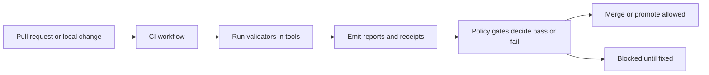

<!-- [KFM_META_BLOCK_V2]
doc_id: kfm://doc/8d2fb4f2-0f5f-4b7f-bb8d-acde0d0be6f7
title: tools — Validators, link checkers, and CLI utilities
type: standard
version: v1
status: draft
owners: TBD
created: 2026-03-03
updated: 2026-03-03
policy_label: public
related:
  - tools/validators/
tags: [kfm, tools, validation, governance]
notes:
  - Status tags are used on all non-trivial statements: Confirmed, Proposed, Unknown.
  - Keep tools deterministic, testable, and safe-by-default; prefer machine-readable outputs for CI.
[/KFM_META_BLOCK_V2] -->

<div align="center">

# 🧰 `tools/` — validators, link checkers, and CLI utilities

**Purpose:** Evidence-first tooling that enforces KFM’s “promotion contract” by validating catalogs, links, and integrity signals before anything is publishable.

<!-- Badges (placeholders — replace TODOs with real workflow names/paths) -->


</div>

<div align="center">

[Purpose](#purpose) ·
[Where this fits](#where-this-fits) ·
[Directory contract](#directory-contract) ·
[Directory layout](#directory-layout) ·
[How tools are used](#how-tools-are-used) ·
[How to run](#how-to-run) ·
[Adding a tool](#adding-a-tool) ·
[Safety and sensitivity](#safety-and-sensitivity) ·
[Unknowns and verification](#unknowns-and-verification)

</div>

---

## Status tags used in this README

<details>
<summary>Click to expand</summary>

- **Confirmed:** Documented in KFM repo briefs/inventories and treated as an intended contract for this repository.
- **Proposed:** Recommended pattern or planned structure; may not exist yet in the live repo.
- **Unknown:** Not verified from the referenced docs; includes the minimum steps to verify and promote to Confirmed.

</details>

---

## Purpose

- **Confirmed:** `tools/` exists to host **validators, link checkers, and CLI utilities** used across development and CI workflows.:contentReference[oaicite:2]{index=2}
- **Confirmed:** `tools/` is part of the quality gates that keep KFM **fail-closed** (invalid metadata/links should block promotion/publishing).:contentReference[oaicite:3]{index=3}:contentReference[oaicite:4]{index=4}

[Back to top](#)

---

## Where this fits

- **Confirmed:** KFM’s promotion contract includes a gate requiring **DCAT/STAC/PROV validation and link checking**; tools are the mechanism to implement those checks in CI and local workflows.:contentReference[oaicite:5]{index=5}
- **Confirmed:** The documented tool inventory explicitly calls out **STAC validation, spec hashing, and link checking** as key tool types under `tools/`.:contentReference[oaicite:6]{index=6}

[Back to top](#)

---

## Directory contract

### What belongs here

- **Proposed:** Small, deterministic command-line programs and libraries that:
  - validate *schemas/contracts* (DCAT/STAC/PROV, registry schemas, API contracts),
  - validate *references* (EvidenceRefs, internal link integrity, catalog cross-links),
  - compute *integrity signals* (checksums, spec hashes),
  - emit *machine-readable reports* for CI (JSON, JSONL).
- **Proposed:** Tools that can run in CI without external services (or with explicit, audited opt-in flags).

### What must not go here

- **Proposed:** Long-running servers, UI code, or pipeline “business logic” (those belong in app/service packages, not in `tools/`).
- **Proposed:** Secrets, API keys, or private data dumps (tools should support least privilege and safe defaults).
- **Proposed:** Ad-hoc notebooks or one-off scripts that can’t be reproduced (prefer a versioned tool + fixture + test).

### Tool behavior contract

- **Confirmed:** Validators must support a **fail-closed** posture: broken catalogs/links should cause a non-zero exit and block promotion/publish steps.:contentReference[oaicite:7]{index=7}:contentReference[oaicite:8]{index=8}
- **Proposed:** Every tool SHOULD:
  - provide `--help`,
  - provide `--version` (or print version on startup),
  - use non-zero exit codes on failure,
  - optionally emit JSON reports (`--report <path>`),
  - avoid nondeterminism (stable ordering, pinned dependencies).
- **Proposed:** If a tool performs network I/O, it MUST:
  - be explicit (`--network` / `--fetch`),
  - log endpoints accessed (without secrets),
  - remain reproducible (pin versions; record validators where applicable).

[Back to top](#)

---

## Directory layout

- **Confirmed:** The repo documentation references **Node.js validators** under `tools/validators/` (e.g., `validate_dcat.js`, `validate_stac.js`).:contentReference[oaicite:9]{index=9}:contentReference[oaicite:10]{index=10}
- **Confirmed:** The repo documentation references `tools/validators/dcat_validator/README.md` as a validator contract describing required fields and exit codes (illustrating fail-closed behavior).:contentReference[oaicite:11]{index=11}

```text
tools/
├── validators/                                 [Confirmed]
│   ├── validate_dcat.js                        [Confirmed]
│   ├── validate_stac.js                        [Confirmed]
│   └── dcat_validator/
│       └── README.md                           [Confirmed]
│
├── integrity/                                  [Proposed]
│   ├── manifest.py                             [Proposed]
│   ├── sign.py                                 [Proposed]
│   ├── attest.py                               [Proposed]
│   ├── verify.py                               [Proposed]
│   └── policy/                                 [Proposed]
│
└── README.md                                   [Confirmed by this file]
```

- **Proposed:** The `integrity/` layout above is a recommended pattern (checksum inventory, signing, attestation, verification wrappers) aligned to the supply-chain/governed-artifacts approach described in KFM internal “New Ideas” guidance.:contentReference[oaicite:12]{index=12}

[Back to top](#)

---

## How tools are used

- **Confirmed:** Tools are expected to support automated gating (e.g., catalog validation + link checking) so promotion to “published” is blocked unless gates pass.:contentReference[oaicite:13]{index=13}


```mermaid
flowchart LR
  PR[Pull request or local change] --> CI[CI workflow]
  CI --> V1[Run validators in tools]
  V1 --> RPT[Emit reports and receipts]
  RPT --> GATE[Policy gates decide pass or fail]
  GATE --> MERGE[Merge or promote allowed]
  GATE --> BLOCK[Blocked until fixed]
```

- **Proposed:** Tools SHOULD write outputs that can be attached to CI artifacts (reports, manifests, receipts) and referenced later during steward review.

[Back to top](#)

---

## How to run

- **Unknown:** The exact CLI signatures for the validators in your current checkout (arguments, glob patterns, output formats).
  - **Minimum verification steps:** run `node tools/validators/validate_dcat.js --help` (and likewise for STAC), or inspect the validator READMEs/scripts.

```bash
# PSEUDOCODE — adjust flags/paths to match each tool’s --help output.

# Validate a DCAT JSON-LD file
node tools/validators/validate_dcat.js path/to/dcat.dataset.jsonld

# Validate a STAC Item / Collection / Catalog JSON
node tools/validators/validate_stac.js path/to/stac/item.json

# Run link checks across a catalog directory
node tools/validators/linkcheck.js path/to/catalog/root
```

- **Proposed:** For CI, prefer commands that:
  - read inputs from a known workspace path,
  - write a JSON report into `./artifacts/` (or the CI workspace),
  - return non-zero exit on failure.

[Back to top](#)

---

## Adding a tool

### Minimum Definition of Done

- **Proposed:** Add a directory or script with:
  - a README describing inputs/outputs and exit codes,
  - at least one test fixture under `tests/` (or a local fixture folder),
  - a CI invocation wired into the blocking checks.
- **Proposed:** Ensure the tool is deterministic:
  - stable sorting,
  - pinned versions (lockfiles/container digest),
  - no time-based IDs unless explicitly injected.

### Template (recommended)

```text
tools/<tool-name>/
├── README.md
├── src/                       (optional)
├── tests/                     (small fixtures; or reference fixtures under /tests)
└── package.json / pyproject   (if needed)
```

- **Proposed:** If the tool participates in the promotion contract, it SHOULD emit a machine-readable summary (e.g., `report.json`) that policy checks can consume.

[Back to top](#)

---

## Safety and sensitivity

- **Confirmed:** KFM explicitly treats **sensitive location leakage** as a high-impact risk and expects mitigations like restricted precise datasets + generalized public derivatives, with redaction tests and default-deny controls.:contentReference[oaicite:14]{index=14}
- **Proposed:** Tools that touch geometry or location-like fields MUST support:
  - redaction/generalization modes,
  - “safe projection” outputs (only allowed fields),
  - test fixtures that prove leakage checks work.

[Back to top](#)

---

## Unknowns and verification

- **Unknown:** The authoritative “live” directory tree for `tools/` in your checkout.
  - **Minimum verification steps:**
    1. `git rev-parse HEAD`
    2. `tree -L 3 tools`
    3. `ls -la tools/validators`
- **Unknown:** Which checks are blocking merges in CI.
  - **Minimum verification steps:** inspect `.github/workflows/*` and locate jobs that call `tools/` scripts.

<details>
<summary>Why we track Unknowns here</summary>

- **Confirmed:** KFM documentation explicitly warns against claiming modules exist until verified in the live repo, and recommends capturing the repo tree/commit hash as a minimum check.:contentReference[oaicite:15]{index=15}:contentReference[oaicite:16]{index=16}

</details>

[Back to top](#)
