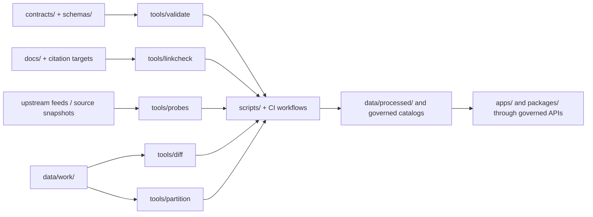

<!-- [KFM_META_BLOCK_V2]
doc_id: kfm://doc/1c3e1b20-f662-4d91-8c88-3e0cf31f2a1a
title: KFM tools directory README
type: standard
version: v1
status: draft
owners: TODO
created: 2026-03-07
updated: 2026-03-07
policy_label: public
related: [../README.md, ../contracts/, ../schemas/, ../policy/, ../scripts/, ../tests/]
tags: [kfm, tools, validation, automation, reproducibility]
notes: [Directory README for internal utilities and validators.]
[/KFM_META_BLOCK_V2] -->

# tools
Governed repository utilities for validation, reproducibility, and promotion support.

**Status:** experimental  
**Owners:** TODO  
**Badges:**      
**Quick links:** [Scope](#scope) · [Repo fit](#repo-fit) · [Accepted inputs](#accepted-inputs) · [Exclusions](#exclusions) · [Directory tree](#directory-tree) · [Quickstart](#quickstart) · [Tool contract](#tool-contract) · [Architecture](#architecture) · [Definition of done](#definition-of-done) · [FAQ](#faq)

## Scope
`tools/` is for small, reusable repository utilities that help contributors and automation validate, inspect, hash, diff, probe, or prepare governed artifacts.

Use this directory when the code is:

- **Operationally useful across more than one workflow**
- **Small enough to remain a utility rather than a package**
- **Primarily about validation, hygiene, repeatability, or support work**
- **Safe to run in local development and CI**

A good `tools/` command should make the repo easier to trust, easier to verify, or easier to operate.

[Back to top](#tools)

## Repo fit

**Path:** `tools/`

**Upstream inputs**
- [`../contracts/`](../contracts/) for API and schema contracts
- [`../schemas/`](../schemas/) for machine-readable schemas and vocabularies
- [`../policy/`](../policy/) for policy rules and fixtures
- [`../data/`](../data/) for governed artifacts and promotion boundaries
- [`../docs/`](../docs/) for citation, link, and documentation targets
- [`../configs/`](../configs/) for environment- or workflow-level configuration, when present

**Downstream consumers**
- [`../scripts/`](../scripts/) orchestration and release flows
- GitHub Actions and other CI jobs under [`.github/`](../.github/)
- [`../tests/`](../tests/) for tool-specific and workflow-level validation
- [`../apps/`](../apps/) and [`../packages/`](../packages/) indirectly, through validated artifacts and governed interfaces

**Rule of thumb:**  
`tools/` helps *validate or prepare* work.  
`packages/` contains *reusable domain logic*.  
`apps/` contains *user-facing or service-facing runtime code*.  
`scripts/` contains *workflow orchestration*.

[Back to top](#tools)

## Accepted inputs
This directory may accept:

- JSON, YAML, CSV, TSV, GeoJSON, and newline-delimited JSON
- STAC, DCAT, PROV, OpenAPI, and JSON Schema documents
- dataset specs, manifests, receipts, digests, and promotion metadata
- documentation link targets and citation manifests
- raw probe payloads and deterministic snapshot inputs
- local filesystem paths and explicit command-line arguments

Each maintained tool should document:

1. required inputs,
2. optional inputs,
3. output location and format,
4. exit code behavior,
5. side effects, if any.

## Exclusions
The following do **not** belong in `tools/`:

- Core domain/business logic that should live in [`../packages/`](../packages/)
- Long-lived API or UI runtime code that should live in [`../apps/`](../apps/)
- Policy definitions that belong in [`../policy/`](../policy/)
- Source-of-truth schemas or contracts that belong in [`../schemas/`](../schemas/) or [`../contracts/`](../contracts/)
- Release orchestration and deploy flows that belong in [`../scripts/`](../scripts/) or CI workflows
- Notebook-only experiments with no clear maintenance story
- Unreviewed one-off migration code that mutates canonical data directly

If a utility grows state, a service boundary, or domain-specific reuse pressure, move it out of `tools/`.

[Back to top](#tools)

## Directory tree

**Current verified footprint**

```text
tools/
└── README.md
```

**Suggested growth pattern**  
_Create families only when there is a real maintenance need; do not pre-create empty folders just to satisfy the pattern._

```text
tools/
├── README.md
├── validate/      # schema, metadata, receipt, and contract validators
├── hash/          # deterministic spec/digest helpers
├── linkcheck/     # citation and documentation link verification
├── probes/        # upstream feed and source probes
├── partition/     # deterministic snapshot / partition writers
└── diff/          # stable comparisons for review and promotion
```

## Quickstart

Inspect what is currently present:

```bash
find tools -maxdepth 3 -type f | sort
```

Find every repo reference to `tools/` from workflow and docs surfaces:

```bash
grep -R "tools/" -n .github scripts docs 2>/dev/null || true
```

Template invocation pattern for a maintained tool:

```bash
# Example only — replace with an actual command that exists in this repo
python tools/<family>/<tool>.py --help
```

[Back to top](#tools)

## Usage

### Placement rules

| Situation | Put it in `tools/`? | Put it where instead? |
|---|---:|---|
| Reusable validator run by humans and CI | Yes | `tools/validate/` |
| Deterministic hasher or diff helper | Yes | `tools/hash/` or `tools/diff/` |
| One-off release orchestration | No | `scripts/` |
| Shared domain transformation logic | No | `packages/` |
| User-facing CLI or service | No | `apps/` |
| Policy rules and fixtures | No | `policy/` |
| Canonical schema definitions | No | `schemas/` or `contracts/` |

### Tool contract

| Concern | Expectation |
|---|---|
| Invocation | Every maintained tool must support `--help` or equivalent usage output. |
| Inputs | Inputs must be explicit and local-first; avoid hidden ambient dependencies. |
| Outputs | Prefer machine-readable outputs for automation (`json`, `jsonl`, `txt`, `csv`) plus concise human-readable summaries. |
| Exit codes | `0` for success, non-zero for any validation failure or operational error. |
| Logging | Human-readable diagnostics to `stderr`; structured data to files or `stdout`, not mixed together. |
| Determinism | Same inputs + same configuration should produce the same logical result. |
| Side effects | Any mutation, network call, or write path must be documented. |
| Safety | No secrets in flags, fixtures, committed outputs, or sample config. |

### Naming conventions

- Prefer **verb_noun** or **noun_action** command names.
- Prefer **one responsibility per command**.
- Keep tool names boring and searchable.
- Favor file formats that diff cleanly in pull requests.
- When a tool writes output, make the path explicit with `--out`, `--output`, or a similarly clear flag.

### When to add a new tool

1. There is a recurring repo or CI need.
2. The job is smaller than a package or service.
3. The command can be documented and tested.
4. The output helps a reviewer make a governed decision.
5. The tool does not bypass policy or promotion boundaries.

[Back to top](#tools)

## Architecture


```mermaid
flowchart LR
    A[contracts/ + schemas/] --> B[tools/validate]
    C[docs/ + citation targets] --> D[tools/linkcheck]
    E[upstream feeds / source snapshots] --> F[tools/probes]
    G[data/work/] --> H[tools/diff]
    G --> I[tools/partition]
    B --> J[scripts/ + CI workflows]
    D --> J
    F --> J
    H --> J
    I --> J
    J --> K[data/processed/ and governed catalogs]
    K --> L[apps/ and packages/ through governed APIs]
```

The directory exists to support the governed path into publishable artifacts, not to create a side channel around it.

## Tool families

| Family | Use for | Typical inputs | Typical outputs | Status |
|---|---|---|---|---|
| `validate/` | Schema, metadata, receipt, and contract checks | JSON/YAML, STAC/DCAT/PROV, OpenAPI, specs | Pass/fail status, error reports, normalized diagnostics | Add when needed |
| `hash/` | Stable spec hashing and digest verification | Canonical JSON, manifests, output paths | Hash strings, verification summaries | Add when needed |
| `linkcheck/` | Documentation and citation verification | Markdown, HTML, registries, citation files | Broken-link reports, unresolved-reference reports | Add when needed |
| `probes/` | Upstream feed and source reachability checks | URLs, provider configs, snapshot hints | Probe payloads, freshness metrics, availability summaries | Add when needed |
| `partition/` | Deterministic snapshot or partition writers | Raw probe payloads, source snapshots | Partitioned work artifacts | Add when needed |
| `diff/` | Stable comparisons for review and promotion | Prior and current artifacts | Human-readable and machine-readable diffs | Add when needed |

## Definition of done

A tool is ready to keep when all of the following are true:

- [ ] The tool has a clear single purpose.
- [ ] The tool is documented in this directory or its family README.
- [ ] `--help` explains usage, inputs, outputs, and side effects.
- [ ] The tool returns reliable exit codes.
- [ ] The tool has tests or at least deterministic fixtures for expected behavior.
- [ ] The tool does not require hidden local state to run correctly.
- [ ] The tool does not bypass policy or write directly to protected publication surfaces.
- [ ] Output formats are reviewable and automation-friendly.
- [ ] Any network dependency is explicit, bounded, and documented.
- [ ] The tool can fail closed when required inputs are missing or invalid.

[Back to top](#tools)

## FAQ

### Why not put everything under `scripts/`?
Because `scripts/` should orchestrate workflows, while `tools/` should hold reusable commands that workflows and humans can call. If the same validation or hashing logic is useful in more than one place, prefer a tool.

### Can a tool write directly to published artifacts?
Not by default. A tool may prepare or verify artifacts, but publication should still flow through governed promotion steps.

### Can a tool talk directly to production databases or storage?
Avoid that by default. If a tool must access operational resources, make the access explicit, documented, read-only where possible, and subject to the same review expectations as any other privileged code.

### When should a tool become a package?
When its logic becomes reusable domain behavior rather than repository support behavior, or when it needs richer APIs, composition, or cross-runtime reuse.

### Should every family get its own README?
Yes, once that family contains more than one maintained command or any non-obvious conventions.

[Back to top](#tools)

## Appendix

<details>
<summary>Python tool skeleton</summary>

```python
#!/usr/bin/env python3
from __future__ import annotations

import argparse
import json
from pathlib import Path


def parse_args() -> argparse.Namespace:
    parser = argparse.ArgumentParser(
        description="Describe exactly what this tool validates or prepares."
    )
    parser.add_argument("--input", required=True, help="Input file path")
    parser.add_argument("--out", required=False, help="Optional output file path")
    return parser.parse_args()


def main() -> int:
    args = parse_args()
    input_path = Path(args.input)

    if not input_path.exists():
        raise SystemExit(f"Input not found: {input_path}")

    payload = {"ok": True, "input": str(input_path)}

    if args.out:
        Path(args.out).write_text(json.dumps(payload, indent=2) + "\n", encoding="utf-8")
    else:
        print(json.dumps(payload))

    return 0


if __name__ == "__main__":
    raise SystemExit(main())
```

</details>

<details>
<summary>Shell tool skeleton</summary>

```bash
#!/usr/bin/env bash
set -euo pipefail

INPUT="${1:-}"
if [[ -z "${INPUT}" ]]; then
  echo "usage: $0 <input>" >&2
  exit 2
fi

if [[ ! -e "${INPUT}" ]]; then
  echo "input not found: ${INPUT}" >&2
  exit 3
fi

echo "ok"
```

</details>

<details>
<summary>Review prompts for pull requests that add a tool</summary>

- What exact governed decision does this tool help a reviewer or automation lane make?
- Why is this a reusable tool instead of a one-off script or a package module?
- What are the inputs, outputs, exit codes, and failure modes?
- Is the output deterministic enough for CI and PR review?
- Does the tool avoid policy bypass, hidden state, and secret leakage?
- Is there at least one fixture or test proving expected behavior?

</details>

[Back to top](#tools)