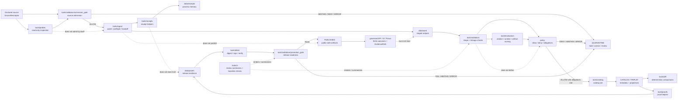

<!-- [KFM_META_BLOCK_V2]
doc_id: kfm://doc/TODO-NEEDS-UUID
title: tools
type: standard
version: v2
status: draft
owners: @bartytime4life
created: NEEDS-VERIFICATION
updated: 2026-04-27
policy_label: public
related: [../README.md, ../.github/CODEOWNERS, ../contracts/README.md, ../schemas/README.md, ../policy/README.md, ../tests/README.md, ../data/receipts/README.md, ../data/proofs/README.md, ./attest/README.md, ./catalog/README.md, ./ci/README.md, ./diff/README.md, ./evaluators/README.md, ./evaluators/fixtures/README.md, ./ingest/README.md, ./ingest/genealogy/README.md, ./probes/README.md, ./proofs/README.md, ./receipts/README.md, ./registry/README.md, ./tests/README.md, ./validators/README.md, ./validators/connector_gate/README.md, ./validators/ecology_composite_claim/README.md, ./validators/ecology_index/README.md, ./validators/flora_dwca_validator/README.md, ./validators/promotion_gate/README.md]
tags: [kfm, tools, ingest, validators, governance, receipts, evidence, proofs, attest, catalog, ci, diff, evaluators, probes, registry, tests, readme]
notes: [doc_id and created date need repository-history verification. Current public main evidence shows tools/README.md is present but stale relative to the expanded public tools tree. Public main now exposes attest/, catalog/, ci/, diff/, evaluators/, ingest/, probes/, proofs/, receipts/, registry/, tests/, validators/, and README.md. Older wording that treated most helper families as LINEAGE or PROPOSED has been replaced with CONFIRMED public-directory status while preserving NEEDS VERIFICATION for executable maturity, workflow enforcement, exact CLI contracts, branch protection, and runtime behavior. Local mounted repo state was not available in this authoring pass; maintainers should re-run the verification checklist in the active checkout before merge.]
[/KFM_META_BLOCK_V2] -->

<a id="top"></a>

# tools

Governed helper surface for KFM ingest-edge utilities, fail-closed validators, reviewer-facing CI helpers, evidence-adjacent receipts, proof helpers, attestation support, registry helpers, evaluators, probes, and deterministic comparison tools.


> [!IMPORTANT]
> **Status:** experimental  
> **Owners:** `@bartytime4life` through current broad `CODEOWNERS` coverage. Narrower lane-specific ownership still needs branch and settings verification.  
> **Path:** `tools/README.md`  
> **Current public snapshot:** `tools/` is now an expanded helper family, not a small three-lane surface. Public `main` currently shows `attest/`, `catalog/`, `ci/`, `diff/`, `evaluators/`, `ingest/`, `probes/`, `proofs/`, `receipts/`, `registry/`, `tests/`, `validators/`, and this README.  
> **Quick jumps:** [Scope](#scope) · [Repo fit](#repo-fit) · [Accepted inputs](#accepted-inputs) · [Exclusions](#exclusions) · [Current evidence snapshot](#current-evidence-snapshot) · [Directory tree](#directory-tree) · [Quickstart](#quickstart) · [Usage](#usage) · [Diagram](#diagram) · [Reference tables](#reference-tables) · [Definition of done](#definition-of-done) · [FAQ](#faq) · [Appendix](#appendix)

> [!WARNING]
> `tools/` is not a scripts junk drawer.  
> Helpers in this tree must stay reviewable, deterministic where practical, and subordinate to KFM’s evidence, policy, catalog, proof, release, review, correction, and rollback surfaces.

---

## Scope

`tools/` holds reusable repository helpers that make governed work easier to inspect.

In the current public tree, its confirmed child lanes are:

| Lane | Public tree status | Role |
|---|---:|---|
| [`tools/attest/`](./attest/README.md) | **CONFIRMED directory / README / schema file** | Proof-pack, digest, signature, verification, and attestation-adjacent helper lane. It supports trust-object checks without becoming release authority or secret custody. |
| [`tools/catalog/`](./catalog/README.md) | **CONFIRMED README** | Catalog QA, cross-link, closure, and reviewer-facing metadata helper surface. |
| [`tools/ci/`](./ci/README.md) | **CONFIRMED README / executable helper files** | CI-facing renderers, baseline checks, Markdown/readme checks, syntax checks, fixture validators, and reviewer-readable summaries over already-governed artifacts. |
| [`tools/diff/`](./diff/README.md) | **CONFIRMED README** | Deterministic comparison helpers for review-bearing manifests, receipts, envelopes, bundles, or geometry summaries. |
| [`tools/evaluators/`](./evaluators/README.md) | **CONFIRMED README / schema files / fixture lane** | Explainable evaluation helpers for model, runtime, citation, artifact, and report behavior. Evaluators score or explain; they do not decide policy or publication. |
| [`tools/evaluators/fixtures/`](./evaluators/fixtures/README.md) | **CONFIRMED README / fixture schema** | Deterministic, public-safe evaluator fixture inputs. |
| [`tools/ingest/`](./ingest/README.md) | **CONFIRMED README / `.gitkeep` / genealogy sublane** | Source-edge helpers, watcher/preflight patterns, checkpoint-aware ingest, and receipt-first handoff support. |
| [`tools/ingest/genealogy/`](./ingest/genealogy/README.md) | **CONFIRMED README / PROPOSED implementation** | Sensitive genealogy-family-history ingest planning lane, with DNA and living-person controls kept restrictive by default. |
| [`tools/probes/`](./probes/README.md) | **CONFIRMED README** | Bounded read-only inspection, freshness, status, and evidence-helper surface. |
| [`tools/proofs/`](./proofs/README.md) | **CONFIRMED README / ecology helpers / tests subtrees** | Proof-adjacent helper lane for resolving, checking, building, and summarizing proof-bearing KFM artifacts without becoming the proof store. |
| [`tools/receipts/`](./receipts/README.md) | **CONFIRMED README / ecology manifest helpers / tests subtree** | Receipt tooling for validating, reading, summarizing, and assembling receipt-shaped process memory. |
| [`tools/registry/`](./registry/README.md) | **CONFIRMED README / ecology map-layer registry helpers / tests subtree** | Registry inspection, source-admission checks, evidence-control-plane maintenance, and layer registry support. |
| [`tools/tests/`](./tests/README.md) | **CONFIRMED README / schemas subtree** | Test-support tooling lane for deterministic, public-safe checks over fixtures, reports, and review artifacts. |
| [`tools/validators/`](./validators/README.md) | **CONFIRMED README / validator sublanes** | Fail-closed validation helpers for declared structures, linkage, envelopes, fixtures, source admission, ecological joins, flora archives, promotion readiness, and crosswalk checks. |

This directory’s job is to support the KFM trust path:

`RAW -> WORK / QUARANTINE -> PROCESSED -> CATALOG / TRIPLET -> PUBLISHED`

It should help produce or check receipts, validation reports, ingest handoffs, evidence-adjacent summaries, proof-pack support artifacts, registry reports, evaluator reports, and candidate artifacts. It must not silently decide public truth, mutate canonical records, own policy, own canonical schemas, or skip review.

[Back to top](#top)

---

## Repo fit

| Direction | Surface | Fit |
|---|---|---|
| Upstream identity | [`../README.md`](../README.md) | Defines KFM as evidence-first, map-first, time-aware, governed, and centered on inspectable claims. |
| Ownership | [`../.github/CODEOWNERS`](../.github/CODEOWNERS) | Current public owner coverage for `/tools/` flows through `@bartytime4life`; narrower team ownership remains future / needs verification. |
| Contract meaning | [`../contracts/README.md`](../contracts/README.md) | Human-readable object meaning, lifecycle expectations, and compatibility language. Tools may consume contracts; they must not redefine them. |
| Machine shape | [`../schemas/README.md`](../schemas/README.md) | Machine-checkable shape and schema registry direction. Tools may validate schemas; they do not own schema authority. |
| Policy | [`../policy/README.md`](../policy/README.md) | Allow / deny / abstain / obligation logic. Tools can call policy or mirror policy-shaped inputs; they do not settle policy law. |
| Tests | [`../tests/README.md`](../tests/README.md) | Executable verification and fixture evidence. Tool helpers should be covered by repo-native tests when they carry trust burden. |
| Process memory | [`../data/receipts/README.md`](../data/receipts/README.md) | Stores receipt-shaped process memory. Tool outputs may feed receipts only through governed contracts. |
| Release evidence | [`../data/proofs/README.md`](../data/proofs/README.md) | Stores proof-bearing release evidence. Tool helpers may build, check, or summarize proof candidates but do not own proof custody. |
| Orchestration | [`../.github/workflows/`](../.github/workflows/), [`../.github/actions/`](../.github/actions/), [`../scripts/`](../scripts/), [`../pipelines/`](../pipelines/) | Orchestration may call tools. Tools should keep reusable logic inspectable outside YAML glue and outside ad hoc shell-only paths. |
| Runtime / UI | [`../apps/`](../apps/), [`../packages/`](../packages/), [`../ui/`](../ui/), [`../web/`](../web/) | Runtime and public UI consume governed outputs. `tools/` must not become a normal public runtime path. |

> [!NOTE]
> Public tree evidence confirms the expanded helper-family layout. It does **not** prove merge-blocking CI enforcement, branch protection, live runtime wiring, exact command-line behavior, package-manager maturity, or production deployment behavior. Those remain **NEEDS VERIFICATION** in the active checkout and platform settings.

[Back to top](#top)

---

## Accepted inputs

Use `tools/` for small, reviewable helpers that support governed KFM work, including:

- source-edge ingest helpers that read from declared source descriptors and emit bounded receipts or staging outputs
- deterministic preflight checks before data enters a stronger lifecycle stage
- validators that check schema shape, required references, finite outcomes, catalog closure, connector admission, ecological joins, promotion readiness, or release-candidate completeness
- local helper CLIs used by CI, pipelines, scripts, reviewers, or maintainers
- reviewer-facing renderers that summarize already-produced machine artifacts
- diff helpers that compare manifests, receipts, bundles, review records, envelopes, or validation reports
- attestation helpers that sign, verify, hash, or summarize already-emitted trust objects
- evaluator helpers that score citation, runtime, artifact, model, or report behavior without becoming policy
- probe helpers that observe or inspect without writing truth or publishing
- registry helpers that inspect, summarize, or validate registry-shaped control-plane artifacts
- valid and invalid fixture-oriented checks when fixtures are non-sensitive and repo-approved
- generated summaries that remain visibly derived from upstream machine artifacts

Healthy tools should make claims like:

- “this source handoff emitted a `run_receipt`”
- “this candidate failed validation with reason codes”
- “this object has missing evidence references”
- “this shape is valid against the declared schema”
- “this promotion candidate failed gate C”
- “this evaluator abstained because required support was missing”
- “this attestation verification result is valid for this subject digest”
- “this registry entry is incomplete and must remain in review”
- “this public artifact candidate needs review before release”

They should not make claims like:

- “this is true”
- “this is now public”
- “this policy allows publication”
- “this schema home is settled by helper placement”
- “this model answer is authoritative”
- “this raw source is safe to expose”
- “this receipt is a proof pack”
- “this map layer is evidence”

[Back to top](#top)

---

## Exclusions

Do **not** put these in `tools/`:

| Excluded item | Why it does not belong here | Better home |
|---|---|---|
| Raw source data | Tooling must not become a hidden RAW store. | `data/raw/` or source-controlled fixture homes, after verification. |
| WORK / QUARANTINE payloads | These are lifecycle state objects, not helper code. | `data/work/` or `data/quarantine/`, after verification. |
| Canonical records | Tools support movement and checks; they do not own truth. | Domain data stores or canonical package homes, after verification. |
| Policy law | Tools may call policy checks, but policy decides. | `policy/`. |
| Machine schemas as canonical authority | Validators may consume schemas or include local report schemas, but canonical machine shape belongs elsewhere unless an ADR says otherwise. | `schemas/` or the repo-approved schema home. |
| Human-readable contracts | Tool READMEs can link to contracts; they should not replace them. | `contracts/`. |
| Proof custody | Tools may generate or summarize proof candidates, but proof custody is separate. | `data/proofs/` or release evidence homes. |
| Receipt storage | Tools may emit receipt-shaped outputs; storage belongs elsewhere. | `data/receipts/`, `data/run_receipts/`, or approved receipt homes. |
| Public release artifacts | Publication is a governed state transition, not a tool-side copy. | `data/published/`, `data/releases/`, or release homes after gates pass. |
| Secrets and tokens | Secrets must never drift into helper code, fixtures, docs, or logs. | Secret manager, CI secret settings, or approved ops surfaces. |
| Living-person, DNA, rare-location, archaeological, or critical-infrastructure details | Sensitive exact records need policy, review, and redaction controls before any helper touches them. | Restricted lifecycle homes and steward review. |
| One-off notebooks or ad hoc shell scraps | KFM helper behavior should be repeatable and reviewable. | `scripts/` or local scratch space, if approved. |
| Direct model runtime or vector-index bypass | AI remains interpretive and evidence-subordinate. | Governed API after EvidenceBundle and policy checks. |
| Public API routes or UI state | Tools may support generation/checking; they do not serve normal clients. | `apps/`, `packages/`, `ui/`, or `web/` after governed release paths. |

[Back to top](#top)

---

## Current evidence snapshot

| Evidence item | Status | Handling in this README |
|---|---:|---|
| `tools/README.md` target | **CONFIRMED present but stale** | This file is written as a replacement-grade update to align with the expanded public tree. |
| Public `tools/` root | **CONFIRMED expanded** | Tree now includes `attest/`, `catalog/`, `ci/`, `diff/`, `evaluators/`, `ingest/`, `probes/`, `proofs/`, `receipts/`, `registry/`, `tests/`, `validators/`, and `README.md`. |
| `tools/attest/` | **CONFIRMED directory / README / `receipt.schema.json`** | Treated as real public lane; executable maturity still bounded. |
| `tools/catalog/` | **CONFIRMED README** | Treated as real public lane; executable inventory remains limited from visible tree. |
| `tools/ci/` | **CONFIRMED README / many helper files** | Treated as active helper inventory; exact semantics and CI wiring still need local verification. |
| `tools/diff/` | **CONFIRMED README** | Treated as real public lane; executable inventory not visible in top-level listing. |
| `tools/evaluators/` | **CONFIRMED README / schema files / fixture lane** | Treated as real public lane with local schemas; evaluator runtime maturity still needs verification. |
| `tools/evaluators/fixtures/` | **CONFIRMED README / `fixture.schema.json`** | Fixture lane is confirmed; deeper proposed fixture families remain proposed until files appear. |
| `tools/ingest/` | **CONFIRMED README / `.gitkeep` / genealogy sublane** | Source-edge lane remains confirmed. |
| `tools/ingest/genealogy/` | **CONFIRMED README / PROPOSED implementation** | README is confirmed; implementation claims remain bounded because it explicitly stages proposed paths. |
| `tools/probes/` | **CONFIRMED README** | Treated as real public read-only inspection lane. |
| `tools/proofs/` | **CONFIRMED README / ecology proof helpers / subtrees** | Treated as proof-adjacent helper lane; proof custody remains outside tools. |
| `tools/receipts/` | **CONFIRMED README / ecology manifest helpers / tests subtree** | Treated as receipt-helper lane; receipt storage remains outside tools. |
| `tools/registry/` | **CONFIRMED README / registry helper files / tests subtree** | Treated as registry-helper lane; registry authority remains outside tools. |
| `tools/tests/` | **CONFIRMED README / schemas subtree** | Treated as test-support helper lane. |
| `tools/validators/` | **CONFIRMED README / validator sublanes** | Current validator children include `connector_gate/`, `ecology_composite_claim/`, `ecology_index/`, `flora_dwca_validator/`, `promotion_gate/`, and nested `validators/crosswalk/`. |
| `/tools/` owner | **CONFIRMED broad fallback** | Public `CODEOWNERS` routes `/tools/` to `@bartytime4life`; narrower lane ownership remains proposed / needs verification. |
| `tools/docs/` | **CODEOWNERS mentions / public root not visible** | Treat as **LINEAGE / PROPOSED / NEEDS VERIFICATION**, not current public tree fact. |
| Active workflow callers | **UNKNOWN** | No merge-blocking or runtime behavior is claimed here. |
| Local mounted repo state | **UNKNOWN / unavailable in this authoring pass** | Maintainers must re-run the quickstart checks in the actual checkout before merge. |

[Back to top](#top)

---

## Directory tree

### Current public tree shape

The tree below reflects the public GitHub directory pages scanned for this update. It is intentionally bounded; run the verification commands in the active checkout for a complete recursive inventory.

```text
tools/
├── README.md
├── attest/
│   ├── README.md
│   └── receipt.schema.json
├── catalog/
│   └── README.md
├── ci/
│   ├── README.md
│   ├── build_governed_artifacts.py
│   ├── check_crosswalk_runtime.sh
│   ├── check_crosswalk_static.sh
│   ├── check_governed_api_path_policy.py
│   ├── check_markdown_authority_thresholds.py
│   ├── check_python_syntax.sh
│   ├── check_readme_paths.sh
│   ├── generate_markdown_debt_backlog.py
│   ├── install_boundary_test_deps.sh
│   ├── markdown_authority_thresholds.json
│   ├── python_syntax_targets.txt
│   ├── readme_required_paths.txt
│   ├── render_bundle_diff_policy_summary.py
│   ├── render_diff_summary.py
│   ├── render_json_io.py
│   ├── render_promotion_bundle_summary.py
│   ├── render_promotion_review_handoff.py
│   ├── render_promotion_summary.py
│   ├── report_placeholder_markers.py
│   ├── run_repo_baseline_local.sh
│   ├── test_check_crosswalk_runtime.sh
│   ├── test_check_crosswalk_static.sh
│   ├── test_check_python_syntax.sh
│   ├── test_check_readme_paths.sh
│   ├── test_verify_baseline.sh
│   ├── validate_policy_runtime_fixtures.py
│   ├── validate_renderer_fixtures.py
│   └── verify_baseline.sh
├── diff/
│   └── README.md
├── evaluators/
│   ├── README.md
│   ├── config.schema.json
│   ├── report.schema.json
│   └── fixtures/
│       ├── README.md
│       └── fixture.schema.json
├── ingest/
│   ├── README.md
│   ├── .gitkeep
│   └── genealogy/
│       └── README.md
├── probes/
│   └── README.md
├── proofs/
│   ├── README.md
│   ├── ecology/
│   │   └── ...                         # subtree present; inventory locally before editing
│   ├── tests/
│   │   └── ...                         # subtree present; inventory locally before editing
│   ├── ecology_proof_pack.py
│   └── ecology_proof_pack_builder.py
├── receipts/
│   ├── README.md
│   ├── tests/
│   │   └── ...                         # subtree present; inventory locally before editing
│   ├── ecology_manifest.py
│   └── ecology_manifest_builder.py
├── registry/
│   ├── README.md
│   ├── README.ecology_map_layers.md
│   ├── tests/
│   │   └── ...                         # subtree present; inventory locally before editing
│   ├── ecology_map_layer_registry.py
│   └── ecology_map_layer_registry_cli.py
├── tests/
│   ├── README.md
│   └── schemas/
│       └── ...                         # subtree present; inventory locally before editing
└── validators/
    ├── README.md
    ├── .gitkeep
    ├── connector_gate/
    │   └── README.md
    ├── ecology_composite_claim/
    │   └── README.md
    ├── ecology_index/
    │   ├── README.md
    │   ├── DEPENDENCIES.md
    │   ├── __main__.py
    │   ├── validator.py
    │   ├── docs/
    │   │   └── ...                     # subtree present; inventory locally before editing
    │   ├── fixtures/
    │   │   └── ...                     # subtree present; inventory locally before editing
    │   └── tests/
    │       └── ...                     # subtree present; inventory locally before editing
    ├── flora_dwca_validator/
    │   └── README.md
    ├── promotion_gate/
    │   ├── README.md
    │   ├── ecology_index.md
    │   ├── ecology_manifest.py
    │   ├── ecology_manifest_cli.py
    │   ├── policy.rego
    │   ├── ecology_manifest/
    │   │   └── ...                     # subtree present; inventory locally before editing
    │   └── tests/
    │       └── ...                     # subtree present; inventory locally before editing
    └── validators/
        └── crosswalk/
            ├── README.md
            └── validate_crosswalk_sql.sql
```

### Confirmed-but-not-fully-expanded subtrees

Some child directory pages confirm that deeper subtrees exist, but this README does not enumerate every nested file from web-rendered directory pages. Inventory them in the mounted checkout before editing:

```bash
find tools/proofs -maxdepth 5 -type f | sort
find tools/receipts -maxdepth 5 -type f | sort
find tools/registry -maxdepth 5 -type f | sort
find tools/tests -maxdepth 5 -type f | sort
find tools/validators/ecology_index -maxdepth 5 -type f | sort
find tools/validators/promotion_gate -maxdepth 5 -type f | sort
```

### Lineage / candidate helper families

Most formerly candidate helper families are now public directories. The remaining notable lineage/candidate lane is:

<details>
<summary>Potential or unresolved helper-family shape</summary>

```text
tools/
└── docs/          # CODEOWNERS mentions this path, but it was not visible in the scanned public tools root.
```

</details>

[Back to top](#top)

---

## Quickstart

Run these checks in the working checkout before changing this directory.

### 1. Confirm branch and tree state

```bash
git status --short
git branch --show-current || true
git rev-parse --show-toplevel 2>/dev/null || pwd
find tools -maxdepth 4 -type f | sort
```

### 2. Recheck owners and current child lanes

```bash
sed -n '1,220p' .github/CODEOWNERS
sed -n '1,220p' tools/README.md
find tools -maxdepth 2 -name README.md -type f | sort | xargs -r -n1 sed -n '1,80p'
```

### 3. Inspect high-burden helper families before editing

```bash
find tools/ci -maxdepth 2 -type f | sort
find tools/validators -maxdepth 4 -type f | sort
find tools/evaluators -maxdepth 4 -type f | sort
find tools/proofs tools/receipts tools/registry -maxdepth 4 -type f | sort
```

### 4. Look for risky accidental payloads

```bash
find tools -type f \
  \( -name "*.csv" -o -name "*.geojson" -o -name "*.jsonl" -o -name "*.sqlite" -o -name "*.db" -o -name "*.parquet" -o -name "*.zip" \) \
  | sort
```

> [!CAUTION]
> The command above only finds suspicious file types. It does not prove a file is safe. Any fixture, JSON example, schema, report, or sample under `tools/` still needs rights, sensitivity, provenance, and policy review.

### 5. Run repo-native checks

Use repo-native test and lint commands from the mounted checkout. These examples are intentionally conservative.

```bash
# Inspect first.
sed -n '1,220p' tools/ci/README.md
sed -n '1,220p' tools/validators/README.md
sed -n '1,220p' tools/validators/promotion_gate/README.md

# Run only after confirming scripts are intended to be executable in the active branch.
bash tools/ci/check_readme_paths.sh
bash tools/ci/check_python_syntax.sh
bash tools/ci/verify_baseline.sh

# Run project tests through the repo-native runner.
python -m pytest tests -q
```

[Back to top](#top)

---

## Usage

### Choosing the right lane

| Need | Use | Do not use |
|---|---|---|
| Source preflight, watcher checkpoint, source-edge handoff | `tools/ingest/` | `tools/validators/` as a source reader |
| Sensitive family-history ingest planning | `tools/ingest/genealogy/` | Any public raw person/DNA output |
| Bounded endpoint or source freshness inspection | `tools/probes/` | Ingest, policy, or publication shortcuts |
| Connector admission readiness | `tools/validators/connector_gate/` | Connector runtime implementation or live source harvesting |
| Check declared shapes, refs, finite outcomes, linkage, or release-candidate constraints | `tools/validators/` | Policy law, schema authorship, or hidden publication |
| Promotion readiness | `tools/validators/promotion_gate/` | File moves, ad hoc copy scripts, or direct public release |
| Flora Darwin Core Archive pre-bundle checks | `tools/validators/flora_dwca_validator/` | EvidenceBundle emission, release promotion, or source authority |
| Ecological join-index checks | `tools/validators/ecology_index/` | Domain truth, map display proof, or catalog closure |
| Ecological composite runtime-claim checks | `tools/validators/ecology_composite_claim/` | Free-form AI answers or renderer-only proof |
| Attestation support, signing, verification, digest checks | `tools/attest/` | Secret custody, proof storage, or release authority |
| Proof artifact helper building or summarization | `tools/proofs/` | Canonical proof storage or promotion decision |
| Receipt-shaped process-memory support | `tools/receipts/` | Proof, policy, or catalog authority |
| Catalog QA and cross-link checks | `tools/catalog/` | Source of metadata truth or public release |
| Registry inspection and layer/source-control-plane support | `tools/registry/` | Source authority, policy authority, or canonical registry storage |
| Reviewer-readable CI summaries and baseline checks | `tools/ci/` | Workflow YAML as implementation, policy law, or hidden publish logic |
| Deterministic artifact comparisons | `tools/diff/` | Attestation, policy decisions, or promotion |
| Model/runtime/citation/artifact scoring | `tools/evaluators/` | Policy authority or proof authority |
| Evaluator fixture inputs | `tools/evaluators/fixtures/` | Production data, proof objects, or sensitive examples |
| Test-support helper logic | `tools/tests/` | Main repo tests, policy, or release authority |
| Human-readable object meaning | `contracts/` | `tools/` |
| Machine-readable shape | `schemas/` or approved schema home | `tools/` as silent schema authority |
| Allow/deny/obligation logic | `policy/` | `tools/` |
| Proof-bearing release evidence | `data/proofs/` or approved proof home | `tools/` |
| Process memory storage | `data/receipts/` or approved receipt home | ad hoc files under `tools/` |
| Workflow orchestration | `.github/workflows/`, `.github/actions/`, `scripts/`, or `pipelines/` | burying orchestration inside helper modules |

### Healthy handoff pattern

1. A source descriptor defines what can be read and under what posture.
2. `tools/probes/` may inspect freshness or status without admitting the source.
3. `tools/validators/connector_gate/` checks source / connector admission readiness.
4. `tools/ingest/` performs a bounded, receipt-first preflight or handoff.
5. `tools/validators/` checks declared shape, references, finite outcomes, linkage, and fail-closed constraints.
6. `policy/` decides allow, deny, abstain, or obligations where policy applies.
7. `tools/receipts/`, `tools/proofs/`, `tools/attest/`, `tools/catalog/`, `tools/diff/`, `tools/evaluators/`, and `tools/ci/` may support review and release evidence without owning release authority.
8. Receipts, catalog records, proofs, and release artifacts remain separate.
9. Public clients consume only governed, released surfaces.

[Back to top](#top)

---

## Diagram


```mermaid
flowchart LR
  source["Declared source<br/>SourceDescriptor"]
  probes["tools/probes<br/>read-only inspection"]
  connector["tools/validators/connector_gate<br/>source admission"]
  ingest["tools/ingest<br/>watch / preflight / handoff"]
  receipts_tools["tools/receipts<br/>receipt helpers"]
  receipts["data/receipts<br/>process memory"]
  work["data/work<br/>staged outputs"]
  validators["tools/validators<br/>shape + linkage checks"]
  evaluators["tools/evaluators<br/>citation / runtime / artifact scoring"]
  policy["policy<br/>allow / deny / obligations"]
  quarantine["QUARANTINE<br/>hold / correct / review"]
  catalog_tools["tools/catalog<br/>catalog QA"]
  catalog["CATALOG / TRIPLET<br/>metadata + projections"]
  diff["tools/diff<br/>deterministic comparisons"]
  proofs_tools["tools/proofs<br/>proof helpers"]
  proofs["data/proofs<br/>release evidence"]
  attest["tools/attest<br/>digest / sign / verify"]
  promotion["tools/validators/promotion_gate<br/>release readiness"]
  published["PUBLISHED<br/>public-safe artifacts"]
  ci["tools/ci<br/>review summaries + baseline checks"]
  api["governed API / UI / Focus<br/>finite outcomes + EvidenceRefs"]

  source --> probes
  source --> connector
  probes --> connector
  connector -->|ALLOW| ingest
  connector -->|ABSTAIN / DENY / ERROR| quarantine
  ingest --> receipts_tools
  receipts_tools --> receipts
  ingest --> work
  work --> validators
  validators --> evaluators
  validators --> policy
  evaluators --> policy
  policy -->|DENY / ABSTAIN / ERROR| quarantine
  policy -->|ALLOW with obligations met| catalog_tools
  catalog_tools --> catalog
  catalog --> diff
  catalog --> proofs_tools
  proofs_tools --> proofs
  proofs --> attest
  attest --> promotion
  promotion -->|PASS| published
  promotion -->|FAIL / ABSTAIN / ERROR| quarantine
  published --> api
  ci -. "renders / summarizes" .-> validators
  ci -. "renders / summarizes" .-> promotion

  validators -. "does not define" .-> policy
  ingest -. "does not publish" .-> published
  probes -. "does not admit by itself" .-> ingest
  receipts_tools -. "does not store truth" .-> proofs
  api -. "must not read" .-> work
```

[Back to top](#top)

---

## Reference tables

### Lane registry

| Path | Current public status | Primary job | Must not become |
|---|---:|---|---|
| `tools/README.md` | **DRAFT replacement** | Orient the helper surface and protect lane boundaries. | A stale claim that the tree has only ingest and validators. |
| `tools/attest/` | **CONFIRMED directory / README / schema file** | Digest, signature, attestation, verification, and trust-object helper support. | Secret custody, proof store, promotion gate, or release authority. |
| `tools/catalog/` | **CONFIRMED README** | Catalog QA, cross-link, closure-summary, and metadata review helpers. | Catalog truth source or public publication lane. |
| `tools/ci/` | **CONFIRMED README / helper inventory** | Reviewer-readable CI summaries, baseline checks, lint-style support, and compact gate output. | Policy authority, schema authority, workflow enforcement proof, or hidden release path. |
| `tools/diff/` | **CONFIRMED README** | Deterministic comparison helpers for trust-bearing artifacts. | Attestation, policy decision, or promotion authority. |
| `tools/evaluators/` | **CONFIRMED README / schemas / fixtures** | Explainable evaluation helpers for model, runtime, citation, and artifact behavior. | Policy authority, proof authority, or model answer authority. |
| `tools/evaluators/fixtures/` | **CONFIRMED README / fixture schema** | Deterministic evaluator inputs. | Production data, proof storage, or sensitive examples. |
| `tools/ingest/` | **CONFIRMED** | Source-edge, watcher, checkpoint, and preflight helper lane. | Canonical store, public release lane, or policy authority. |
| `tools/ingest/genealogy/` | **CONFIRMED README / PROPOSED implementation** | Sensitive genealogy-family-history ingest planning. | Public raw person, DNA, or living-person disclosure lane. |
| `tools/probes/` | **CONFIRMED README** | Read-only freshness, status, and inspection helpers. | Ingest admission, source authority, or publication. |
| `tools/proofs/` | **CONFIRMED README / helper files** | Proof-adjacent resolving, checking, building, and summarizing support. | Canonical proof custody or promotion law. |
| `tools/receipts/` | **CONFIRMED README / helper files** | Receipt-shaped process-memory helpers. | Proof object, catalog record, or publication artifact. |
| `tools/registry/` | **CONFIRMED README / helper files** | Registry inspection, source-admission support, evidence-control-plane maintenance. | Source authority, registry storage, or policy authority. |
| `tools/tests/` | **CONFIRMED README / schemas subtree** | Test-support helper surface for fixtures, reports, and review artifacts. | Main test suite authority, policy law, or release authority. |
| `tools/validators/` | **CONFIRMED README / sublanes** | Fail-closed validation helper lane. | Schema home, policy source, proof store, or workflow substitute. |
| `tools/validators/connector_gate/` | **CONFIRMED README** | Connector/source-admission readiness validation. | Connector runtime, source registry, or promotion. |
| `tools/validators/ecology_composite_claim/` | **CONFIRMED README** | Ecological composite claim validation. | Evidence source, AI authority, or renderer proof. |
| `tools/validators/ecology_index/` | **CONFIRMED README / module files / fixtures / tests** | Eco-index row validation before cross-domain ecological joins. | Domain truth or publication authority. |
| `tools/validators/flora_dwca_validator/` | **CONFIRMED README** | Flora DwC-A pre-bundle validation. | EvidenceBundle assembly, source authority, or promotion. |
| `tools/validators/promotion_gate/` | **CONFIRMED README / helper files / policy file / tests subtree** | Promotion readiness validation for release candidates. | Publication itself or policy source of truth. |
| `tools/validators/validators/crosswalk/` | **CONFIRMED README / SQL file** | Crosswalk SQL validation helper surface. | Domain model authority or canonical crosswalk store. |

### Tool output posture

| Output family | Allowed from `tools/`? | Rule |
|---|---:|---|
| `RunReceipt` / ingest receipt candidate | Yes, when lane-approved | Process memory, not proof or publication. |
| `ValidationReport` | Yes | Must include subject, version, status, reason codes, and failure classes where relevant. |
| `DecisionEnvelope`-like result | Yes, when validator-owned | Must remain finite and machine-readable. |
| `EvaluationReport` | Yes | Must score or explain bounded behavior without becoming policy, proof, or publication. |
| `DiffSummary` | Yes | Must compare declared inputs; no policy decision by implication. |
| `SignResult` / `VerifyResult` | Yes | Must bind to declared subject and digest; no secret custody or release authority. |
| `RegistryReport` | Yes | Must describe registry completeness or drift; source authority remains elsewhere. |
| `ProofSummary` / proof-pack candidate | Sometimes | Helper output only; proof custody belongs in proof-bearing homes. |
| `CatalogCheckReport` | Yes | QA and closure support only; catalog truth belongs elsewhere. |
| `EvidenceBundle` | Usually no | Tools may validate or reference it; evidence custody belongs elsewhere. |
| `ReleaseManifest` | Usually no | Tools may validate or summarize it; release authority belongs elsewhere. |
| Public tiles, APIs, or UI data | No | Public outputs must pass governed release paths. |
| Secrets, credentials, source tokens | No | Never store in this tree. |

### Truth labels used here

| Label | Meaning |
|---|---|
| **CONFIRMED** | Supported by current public repo evidence or attached KFM doctrine used for this README. |
| **INFERRED** | Strongly suggested by adjacent docs or architecture, but not direct implementation proof. |
| **PROPOSED** | Recommended target shape or lane rule consistent with KFM doctrine. |
| **UNKNOWN** | Not verified strongly enough from available repo or corpus evidence. |
| **NEEDS VERIFICATION** | Must be checked on the exact working branch, platform settings, workflow behavior, or runtime before relying on it. |
| **LINEAGE** | Useful prior documentation or design history that is not current tree proof. |

[Back to top](#top)

---

## Definition of done

A change under `tools/` is ready for review when all applicable checks are true:

- [ ] The helper belongs in `tools/` rather than `contracts/`, `schemas/`, `policy/`, `data/`, `tests/`, `scripts/`, `pipelines/`, `.github/`, `apps/`, or `packages/`.
- [ ] The README or file header states whether the helper is **CONFIRMED**, **PROPOSED**, or **NEEDS VERIFICATION**.
- [ ] The helper’s lane is correctly chosen: ingest, probe, validator, CI renderer, diff, evaluator, registry, receipt, proof, attest, catalog, or test-support.
- [ ] No raw, work, quarantine, secret, sensitive-person, DNA, rare-location, archaeological-location, critical-infrastructure, or unpublished governed payload is introduced.
- [ ] Fixtures are synthetic or explicitly public-safe and minimal.
- [ ] Outputs are deterministic where practical and include stable identifiers, subject references, versions, reason codes, and timestamps where relevant.
- [ ] Validators fail closed and expose negative fixtures where the repo has a fixture pattern.
- [ ] Tool outputs do not claim proof, catalog closure, promotion, or publication unless an upstream contract explicitly authorizes that output family.
- [ ] Attestation helpers do not store secrets or become trust-root custody.
- [ ] Evaluators do not convert scores into policy decisions.
- [ ] Receipts, proofs, catalog records, release manifests, review records, and public artifacts remain separate.
- [ ] Child README links and relative links are verified from this file location.
- [ ] Ownership is checked against `.github/CODEOWNERS`.
- [ ] The exact executable command, if any, is verified in the active checkout.
- [ ] CI or workflow enforcement is not claimed unless platform settings and workflow runs prove it.
- [ ] Rollback is simple: revert the PR and remove any generated non-release artifacts from the branch.

[Back to top](#top)

---

## FAQ

### Is `tools/` a source of truth?

No. `tools/` is a helper surface. KFM truth comes from admissible evidence, source role, policy posture, review state, release state, and correction lineage. Tools can make that chain easier to inspect, but they do not replace it.

### Can an ingest helper publish data?

No. Ingest helpers may read declared sources, preflight them, emit receipt-shaped process memory, or prepare staged outputs. Publication is a governed state transition after validation, policy, review, catalog/proof closure, attestation where required, and release handling.

### Can a validator decide policy?

No. A validator can report shape, linkage, completeness, deterministic identity, and finite outcome checks. Policy owns allow, deny, obligations, and admissibility rules.

### Can `tools/attest/` make a release public?

No. Attestation helpers can support digest, signature, verification, and trust-object binding. They do not own proof custody, policy approval, promotion, or publication.

### Can `tools/evaluators/` decide that an AI answer is true?

No. Evaluators can score or explain model/runtime/citation/artifact behavior. EvidenceBundle resolution, policy, review state, and release state outrank evaluator scores and generated language.

### Why does this README now list many more helper families?

The public `tools/` tree expanded. Earlier text treated `attest/`, `catalog/`, `ci/`, `diff/`, and `probes/` as candidate lanes. Current public evidence shows those lanes, plus `evaluators/`, `proofs/`, `receipts/`, `registry/`, and `tests/`, as checked-in public directories.

### Does public file presence prove CI enforcement or runtime maturity?

No. Public directory presence proves the public tree shape, not active workflow enforcement, branch protections, exact command behavior, runtime wiring, or release maturity.

### Why still mark some things NEEDS VERIFICATION?

Because current public tree evidence and README text are not the same as a mounted checkout, runnable tests, workflow logs, platform settings, branch rules, or runtime traces. KFM should not upgrade docs or plausible paths into implementation fact without proof.

[Back to top](#top)

---

## Appendix

<details>
<summary>Minimal branch verification checklist</summary>

```bash
git status --short
git branch --show-current || true
git rev-parse --show-toplevel 2>/dev/null || pwd

find tools -maxdepth 4 -type f | sort
find .github -maxdepth 3 -type f | sort
find contracts schemas policy data tests scripts pipelines apps packages -maxdepth 3 -type f 2>/dev/null | sort | sed -n '1,260p'

sed -n '1,220p' .github/CODEOWNERS
sed -n '1,220p' README.md
sed -n '1,220p' tools/README.md

find tools -maxdepth 2 -name README.md -type f | sort
find tools/validators -maxdepth 4 -type f | sort
find tools/ci -maxdepth 2 -type f | sort
find tools/evaluators -maxdepth 4 -type f | sort
find tools/proofs tools/receipts tools/registry tools/tests -maxdepth 4 -type f | sort
```

</details>

<details>
<summary>Public-tree drift checks for this README</summary>

```bash
# Compare this README's lane registry to actual public checkout state.
python - <<'PY'
from pathlib import Path

expected = {
    "attest", "catalog", "ci", "diff", "evaluators", "ingest",
    "probes", "proofs", "receipts", "registry", "tests", "validators"
}

root = Path("tools")
actual = {p.name for p in root.iterdir() if p.is_dir()} if root.exists() else set()

missing = sorted(expected - actual)
extra = sorted(actual - expected)

print("missing_expected_lanes=", missing)
print("extra_lanes=", extra)
PY
```

</details>

<details>
<summary>Lane addition checklist</summary>

Before adding a new `tools/<lane>/` family, verify:

- [ ] The lane cannot live more appropriately under `contracts/`, `schemas/`, `policy/`, `data/`, `tests/`, `scripts/`, `pipelines/`, `.github/`, `apps/`, or `packages/`.
- [ ] The lane has a README before or with executable helper files.
- [ ] The README states what the lane must not become.
- [ ] Owner routing is visible in `.github/CODEOWNERS`.
- [ ] Valid and invalid fixtures exist when behavior is trust-bearing.
- [ ] Output contracts use finite outcomes where relevant.
- [ ] Sensitive data, secrets, raw source payloads, and unpublished evidence are excluded.
- [ ] Any workflow caller is thin and delegates logic to reviewable helper files.
- [ ] Rollback is documented.

</details>

<details>
<summary>Known unresolved tree item</summary>

`CODEOWNERS` mentions `/tools/docs/`, but the scanned public `tools/` root did not show `tools/docs/`. Treat `tools/docs/` as **LINEAGE / PROPOSED / NEEDS VERIFICATION** until a mounted checkout or public tree confirms the directory.

</details>