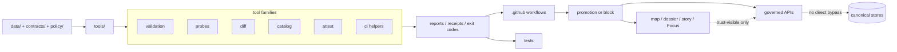

<!-- [KFM_META_BLOCK_V2]
doc_id: kfm://doc/<uuid-NEEDS-VERIFICATION>
title: tools
type: standard
version: v1
status: draft
owners: <see ../.github/CODEOWNERS — NEEDS VERIFICATION>
created: <YYYY-MM-DD-NEEDS-VERIFICATION>
updated: 2026-03-18
policy_label: <NEEDS-VERIFICATION>
related: [../README.md, ../.github/README.md, ../.github/CODEOWNERS, ../contracts/, ../docs/, ../policy/, ../data/, ../infra/, ../tests/]
tags: [kfm, tools, validation, reproducibility, ci]
notes: [Current session exposed PDF evidence only; direct repo-tree verification remains NEEDS VERIFICATION.]
[/KFM_META_BLOCK_V2] -->

# tools

Verification, validation, diff, probe, and support tooling surface for Kansas Frontier Matrix.

> **Status:** experimental  
> **Owners:** NEEDS VERIFICATION — see [../.github/CODEOWNERS](../.github/CODEOWNERS)  
> **Repo fit:** intended path `tools/README.md` · upstream [../README.md](../README.md) · governance [../.github/README.md](../.github/README.md)  
> **Evidence posture:** corpus-grounded · direct live repo contents beyond mounted PDFs remain **NEEDS VERIFICATION**  
>       
> **Quick jumps:** [Scope](#scope) · [Repo fit](#repo-fit) · [Accepted inputs](#accepted-inputs) · [Exclusions](#exclusions) · [Current evidence snapshot](#current-evidence-snapshot) · [Directory tree](#directory-tree) · [Quickstart](#quickstart) · [Usage](#usage) · [Tool behavior contract](#tool-behavior-contract) · [Diagram](#diagram) · [Tables](#tables) · [Task list](#task-list--definition-of-done) · [FAQ](#faq) · [Appendix](#appendix)

> [!IMPORTANT]
> `tools/` is not a miscellaneous scripts bin. In KFM it is the reviewable support surface for validation, reproducibility, promotion readiness, correction readiness, and trust-preserving automation.

## Scope

`tools/` holds small, explicit utilities that strengthen governed behavior without quietly becoming canonical policy, long-running product runtime, or hidden business logic.

What belongs here:

- validators for catalogs, contracts, fixtures, manifests, receipts, and release-readiness checks
- deterministic diff, probe, checksum, and attestation helpers
- thin CI-facing utilities that fail clearly and emit reviewable outputs
- operator helpers that inspect, verify, replay, or summarize state without bypassing governed interfaces

What this README does:

- defines the directory contract for `tools/`
- separates current evidence from target shape
- keeps naming and boundary rules stable as the tooling surface grows

## Status markers used in this README

| Marker | Meaning here |
| --- | --- |
| **CONFIRMED** | Supported by the attached March 2026 KFM corpus in this session |
| **INFERRED** | Strongly suggested by multiple attached sources, but not directly verified from a mounted repo tree |
| **PROPOSED** | Doctrine-consistent target shape or placement pattern, not verified as active-branch reality |
| **UNKNOWN** | Not verified strongly enough to present as current repo fact |
| **NEEDS VERIFICATION** | Placeholder value, path, ownership, or implementation detail that should be checked against a live checkout before commit |

[Back to top](#tools)

## Repo fit

**Path:** `tools/README.md`  
**Role in repo:** directory README for verification, validation, probe, diff, and support-tooling surfaces.

> [!NOTE]
> Links below are repo-relative targets that fit the surrounding KFM documentation model. Their live existence beyond the mounted PDFs remains **NEEDS VERIFICATION** in this session.

| Direction | Surface | Why it matters |
| --- | --- | --- |
| Upstream | [../README.md](../README.md) | Root framing for the repository as a governed system |
| Governance | [../.github/README.md](../.github/README.md) | Maintainer workflow guidance and repo-level operating pointers |
| Governance | [../.github/CODEOWNERS](../.github/CODEOWNERS) | Intended owner map for `tools/` and other governed surfaces |
| Downstream | [../.github/workflows/](../.github/workflows/) | CI and promotion gates may invoke tools, but should not hide their outputs |
| Adjacent | [../contracts/](../contracts/) | Tools validate or consume contracts; they do not replace them |
| Adjacent | [../policy/](../policy/) | Policy bodies live there; tooling may evaluate or lint them |
| Adjacent | [../docs/](../docs/) | Human-facing doctrine, runbooks, standards, and ADRs |
| Adjacent | [../data/](../data/) | Catalog, manifest, and dataset checks often start here |
| Adjacent | [../tests/](../tests/) | Fixtures and assertions should exercise tool behavior |
| Adjacent | [../infra/](../infra/) | Infra may call tools, but infra definitions do not belong here |

## Accepted inputs

The following belong in or under `tools/`:

- validator code, configs, and tiny helper assets for catalog, schema, provenance, checksum, or promotion checks
- deterministic comparison utilities for snapshots, manifests, geometry diffs, or release artifacts
- probe helpers that emit bounded reports rather than silent state mutation
- attestation, spec-hash, and receipt utilities used by CI or promotion paths
- lightweight reviewer or operator helpers that summarize build, PR, or release evidence

### Minimum expectations for anything added here

- deterministic behavior on the same inputs
- explicit exit semantics
- no hidden write path into canonical truth
- fixtures or examples for non-trivial behavior
- machine-readable output where CI or audits need stable parsing
- documentation close to the tool when the contract is not obvious from the name

## Exclusions

| Does **not** belong here | Put it in | Why |
| --- | --- | --- |
| Long-running public runtime code | a deployable app or package lane | `tools/` supports governed behavior; it is not the product runtime |
| Canonical policy bundles or rule ownership | [../policy/](../policy/) | Tooling may evaluate policy, but policy source-of-truth stays separate |
| Authoritative contracts and schemas | [../contracts/](../contracts/) | Tools consume contracts; they should not hide them |
| Large datasets, private fixtures, or sensitive coordinates | governed data stores / secured lanes | Public repo tooling must stay safe to clone and review |
| One-off local experiments without durable value | local scratch space or a dedicated scripts lane | `tools/` is for repeatable, reviewable utilities |
| Hidden promotion shortcuts | nowhere | KFM promotion is governed, inspectable, and fail-closed |

## Current evidence snapshot

This section keeps corpus reality, intended target shape, and missing verification separate.

| Evidence item | Status | How this README uses it |
| --- | --- | --- |
| `tools/` exists as a documented tooling lane for validators, link checkers, and CLI-like utilities | **CONFIRMED** | Grounds the directory README itself |
| `tools/validation/catalog_qa/` appears as a documented drop-in quick gate, with companion script/config/CI placement guidance | **CONFIRMED in corpus / NEEDS VERIFICATION in repo** | Used as the most concrete example subtree |
| Both `tools/validation/` and `tools/validate/` appear across attached operational notes | **CONFIRMED naming drift in corpus** | Surfaced as a normalization warning, not as live-tree fact |
| Families such as `probes/`, `diff/`, `partition/`, `catalog/`, `attest/`, and `ci/` appear in examples and package/tooling notes | **PROPOSED** | Used as target-shape guidance only |
| Exact owner names, actual live contents, workflow files, schema registry, deployment manifests, and runtime traces | **UNKNOWN** | Kept explicitly unverified and out of repo-fact claims |

## Directory tree

### Documented minimum from the attached corpus

```text
tools/
└── validation/
    └── catalog_qa/   # documented in corpus; live repo presence NEEDS VERIFICATION
```

### Other documented or implied family placements — verify against the live checkout before relying on them

```text
tools/
├── validation/
│   └── catalog_qa/
│       ├── README.md
│       ├── run_catalog_qa.py
│       └── config.yml
├── validate/          # naming drift observed in corpus; normalize if still present
├── probes/
├── diff/
├── partition/
├── catalog/
├── attest/
└── ci/
```

> [!WARNING]
> The corpus shows both `tools/validation/` and `tools/validate/`. Prefer **noun-based directory families** (`validation/`, `probes/`, `diff/`, `catalog/`, `attest/`, `ci/`) and reserve verbs for executable filenames.

[Back to top](#tools)

## Quickstart

Start with verification, not assumption.

1. Inspect what actually exists in your checkout.

```bash
find tools -maxdepth 4 \( -type f -o -type d \) | sort
```

2. Check repo-adjacent governance surfaces.

```bash
sed -n '1,160p' .github/README.md
sed -n '1,160p' .github/CODEOWNERS
```

3. Check for family naming drift before adding a new tool.

```bash
rg -n "tools/(validation|validate|probes|diff|catalog|attest|ci|partition)" -S .
```

### First concrete gate to verify locally

```bash
python3 tools/validation/catalog_qa/run_catalog_qa.py \
  --root data/ \
  --glob "**/collection.json" \
  --fail-on-warn
```

> [!NOTE]
> The command above is a **documented quick-gate example** from the attached corpus. Its exact file presence in the active checkout remains **NEEDS VERIFICATION** until you inspect the repo tree directly.

## Usage

### Add a validator

Use `tools/` when the job is primarily **check / report / fail / summarize**.

1. Put the utility under the narrowest noun-based family that matches its purpose.
2. Keep the entrypoint thin and explicit.
3. Add at least one good fixture and one failing fixture where practical.
4. Emit structured output if CI, PR summaries, or audits will parse it.
5. Document exact input and output expectations.

### Add a probe or diff helper

A probe or diff helper belongs here when it:

- reads or snapshots state without becoming the system of record
- produces deterministic, reviewable output
- can fail closed when a blocking condition is detected
- does not silently promote, publish, or mutate authoritative truth

### Wire a tool into CI

Start conservatively:

1. prove local determinism
2. prove non-zero exit on blocking failures
3. run in PR-only or dry-run mode first
4. document the gate in both the tool README and the workflow
5. make the gate visible to reviewers, not just to automation

## Tool behavior contract

| Concern | Required posture |
| --- | --- |
| Determinism | Same inputs should yield the same output and exit code |
| Failure semantics | Trust-significant failure returns non-zero |
| Output shape | Prefer JSON/JSONL or other stable machine-readable output when CI consumes it |
| Side effects | Default to read-only inspection unless write behavior is explicit and documented |
| Secrets | No ambient credential scraping or secret material committed into fixtures |
| Provenance | Reports should carry enough IDs, digests, or paths to join back to manifests and receipts |
| Safety | Sensitive or rights-unclear content must not leak through fixtures or logs |
| Reuse | Utilities should be reviewable and callable from both humans and CI |

> [!IMPORTANT]
> “Fail-closed” here does **not** mean every warning becomes fatal. It means the documented blocking conditions actually block, consistently and inspectably.

## Diagram


```mermaid
flowchart LR
    A[data/ + contracts/ + policy/] --> B[tools/]

    subgraph TF[tool families]
      V[validation]
      P[probes]
      D[diff]
      C[catalog]
      AT[attest]
      CI[ci helpers]
    end

    B --> TF
    TF --> R[reports / receipts / exit codes]
    R --> G[.github workflows]
    R --> T[tests]

    G --> M[promotion or block]
    M --> API[governed APIs]
    M --> UI[map / dossier / story / Focus]

    API -. no direct bypass .-> DATA[(canonical stores)]
    UI -. trust-visible only .-> API
```

## Tables

### Tool family matrix

| Family | Primary job | Typical inputs | Typical outputs | Typical caller |
| --- | --- | --- | --- | --- |
| `validation/` | schema, catalog, provenance, or gate checks | STAC/DCAT/PROV, manifests, fixtures, schemas | pass/fail report, structured errors | CI, local review |
| `probes/` | bounded source or snapshot checks | endpoints, feeds, fixture configs | probe report, freshness/status summary | scheduled checks, PR validation |
| `diff/` | deterministic comparison | snapshots, catalogs, manifests, geometry baselines | stable diff summary, images, stats | reviewers, CI |
| `catalog/` | catalog rebuild or integrity helpers | processed artifacts, catalogs, metadata | reindex/rebuild output, catalog reports | promotion, ops |
| `attest/` | provenance and attestation helpers | receipts, artifacts, digests | signed predicates, verification results | release lanes |
| `ci/` | PR/build evidence summaries | diff stats, receipts, artifacts | reviewer-facing summary output | CI workflows |

### Naming rules

| Prefer | Avoid | Why |
| --- | --- | --- |
| `tools/validation/` | parallel long-term `tools/validate/` trees | stable noun-based families are easier to scan |
| `run_catalog_qa.py` | `check.py` | executable names should reveal the guarded contract |
| `tools/validation/sql/` | validation logic buried inside unrelated release scripts | checks should stay findable |
| `tools/diff/stable_diff.py` | diff logic hidden in pipelines | reviewers should be able to locate comparison logic directly |
| `tools/attest/` | ad hoc signing helpers in random folders | provenance belongs in a discoverable support surface |

### What this README treats as fact vs target shape

| Topic | Current posture |
| --- | --- |
| `tools/` as a conceptual tooling lane in KFM doctrine | **CONFIRMED** |
| `tools/validation/catalog_qa/` as a documented example subtree | **CONFIRMED in corpus / NEEDS VERIFICATION in repo** |
| Exact owner names | **UNKNOWN / NEEDS VERIFICATION** |
| `tools/probes/`, `tools/diff/`, `tools/catalog/`, `tools/attest/`, `tools/ci/`, `tools/partition/` | **PROPOSED** |
| Parallel `tools/validate/` subtree as live-tree reality | **NEEDS VERIFICATION** |
| Active workflow inventory, manifests, and live telemetry joins | **UNKNOWN** |

## Task list / Definition of done

- [ ] The tool has one narrow, documented purpose.
- [ ] Exit codes are explicit and tested.
- [ ] Deterministic behavior was checked more than once.
- [ ] At least one representative success path and one failure path are covered.
- [ ] No secret, restricted, or rights-unclear material was committed as a fixture.
- [ ] Machine-readable output exists where CI or audits need it.
- [ ] The calling workflow is documented if the tool is CI-facing.
- [ ] The tool does not bypass policy, review, release evidence, or the trust membrane.
- [ ] Naming matches the noun-family rule for directory placement.
- [ ] This README and any local tool README were updated together.

## FAQ

### Why not put everything in `scripts/`?

Because KFM treats `tools/` as repeatable, reviewable support machinery that guards governed behavior. A throwaway helper can live elsewhere; a reusable validator or gate runner should have a stable home.

### Why distinguish CONFIRMED from PROPOSED inside a README?

Because this directory sits close to validation and promotion. Overclaiming here would weaken the same trust posture the tools are supposed to protect.

### Why prefer `validation/` over `validate/`?

Because the attached corpus already shows naming drift. Standardizing on directory nouns keeps the tree readable and makes executable filenames carry the verb.

## Appendix

<details>
<summary>Document-backed example paths mentioned in the attached corpus</summary>

```text
tools/validation/catalog_qa/
tools/validation/catalog_qa/run_catalog_qa.py
tools/validation/catalog_qa/config.yml
tools/probes/gtfsrt_probe.py
tools/validate/gtfsrt_schema.py
tools/partition/write_snapshot.py
tools/diff/stable_diff.py
tools/spec_hash.py
```

Use this list as a review aid, not as proof that every path exists on the active branch.

</details>

<details>
<summary>Verification-first local checks</summary>

```bash
# What is actually present?
find tools -maxdepth 4 \( -type f -o -type d \) | sort

# Where does tooling wire into CI, docs, and policy?
rg -n "tools/" .github/workflows .github README.md docs contracts policy tests -S

# Is there still validation/validate drift?
rg -n "tools/(validation|validate)/" -S .

# Which exact owners and checks are active?
sed -n '1,200p' .github/CODEOWNERS
find .github/workflows -maxdepth 2 -type f | sort
```

</details>

<details>
<summary>What this README intentionally does not claim</summary>

This README does **not** claim that the current mounted repo already contains:

- a verified `tools/` tree with the example paths above
- a confirmed schema registry or fixture inventory
- a confirmed workflow inventory or merge-blocking check list
- a confirmed deployment descriptor set
- a confirmed EvidenceBundle or RuntimeResponseEnvelope implementation on disk

Those remain direct verification tasks for a live checkout.

</details>

[Back to top](#tools)
