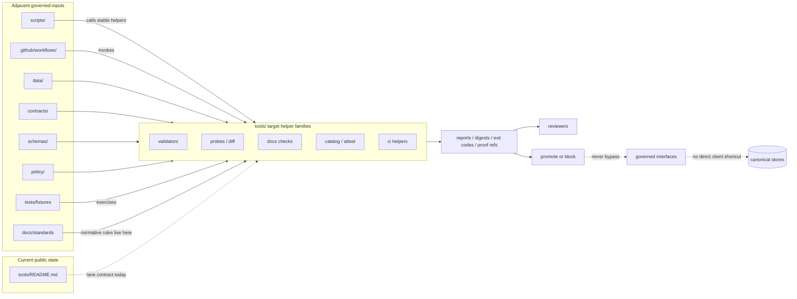

<!-- [KFM_META_BLOCK_V2]
doc_id: kfm://doc/<uuid-NEEDS-VERIFICATION>
title: tools
type: standard
version: v1
status: review
owners: @bartytime4life
created: <YYYY-MM-DD-NEEDS-VERIFICATION>
updated: 2026-03-22
policy_label: <NEEDS-VERIFICATION>
related: [../README.md, ../.github/README.md, ../.github/CODEOWNERS, ../contracts/, ../schemas/, ../policy/, ../data/, ../infra/, ../scripts/, ../tests/, ../.github/workflows/README.md]
tags: [kfm, tools, validation, reproducibility, ci]
notes: [Current public main inspection confirms /tools/ exists, currently shows README.md only, and /tools/ is owned by @bartytime4life in ../.github/CODEOWNERS; created date, policy label, and deeper executable tool inventory remain NEEDS VERIFICATION.]
[/KFM_META_BLOCK_V2] -->

# tools

Verification, validation, diff, probe, and support tooling surface for Kansas Frontier Matrix.

> **Status:** experimental  
> **Owners:** `@bartytime4life`  
> **Repo fit:** repo-root lane `tools/` · target file `tools/README.md` · upstream [../README.md](../README.md) · governance [../.github/README.md](../.github/README.md) · adjacent [../scripts/](../scripts/) · downstream [../.github/workflows/README.md](../.github/workflows/README.md)  
> **Evidence posture:** doctrine-grounded · repo-grounded for current public `main` · deeper local checkout and platform settings remain bounded  
> **Current public snapshot:** `tools/` currently renders as `README.md` only on public `main`; the family subdirectories below are target shape, not current subtree fact  
>       
> **Quick jumps:** [Scope](#scope) · [Repo fit](#repo-fit) · [Accepted inputs](#accepted-inputs) · [Exclusions](#exclusions) · [Current evidence snapshot](#current-evidence-snapshot) · [Directory tree](#directory-tree) · [Quickstart](#quickstart) · [Usage](#usage) · [Tool behavior contract](#tool-behavior-contract) · [Diagram](#diagram) · [Tables](#tables) · [Task list](#task-list--definition-of-done) · [FAQ](#faq) · [Appendix](#appendix)

> [!IMPORTANT]
> `tools/` is not a miscellaneous scripts bin. In KFM it is the reusable, reviewable helper surface that strengthens governed execution without quietly becoming product runtime, policy source-of-truth, or hidden business logic.

> [!NOTE]
> March 2026 doctrine and documentary repo inventories describe `tools/` as the lane for **validators, link checkers, and CLI utilities**. Current public `main` inspection confirms that the lane exists, but today the subtree is still **README-first** in public view. This README therefore separates **present state** from **target shape** on purpose.

## Scope

`tools/` is the KFM lane for small, explicit utilities whose main job is to **inspect, validate, compare, summarize, lint, probe, or emit support evidence**.

That means validators, link checkers, diff/probe helpers, metadata cross-checkers, spec-hash helpers, attestation helpers, and CI-facing CLIs that help the governed truth path stay auditable.

Today, the public tree shows this lane as documentary-first rather than as a populated helper family. That does not weaken the directory’s role. It simply means the README must do two jobs at once:

1. describe the **current public state** honestly
2. define the **governed target shape** for the first executable helpers

What belongs here:

- reusable validators for contracts, catalogs, manifests, receipts, proof packs, and promotion-readiness checks
- deterministic diff, checksum, spec-hash, and integrity helpers
- bounded probes that inspect systems and emit reviewable reports
- reviewer/operator helpers that summarize build, PR, release, or catalog evidence in stable formats
- CI-facing CLIs that fail clearly, emit stable output, and stay runnable outside workflow YAML

What this README does:

- defines the operating contract for `tools/`
- separates `tools/` from adjacent lanes such as `scripts/`, `tests/`, `contracts/`, `schemas/`, and `policy/`
- distinguishes current public-tree fact from proposed family regularization
- preserves KFM’s truth posture by marking what is confirmed, inferred, proposed, unknown, or still needs verification

### Evidence markers used in this README

| Marker | Meaning here |
| --- | --- |
| **CONFIRMED** | Supported by March 2026 KFM doctrine, current public repo files, or repo-grounded audit material |
| **INFERRED** | Strongly suggested by doctrine and adjacent repo docs, but not proven as current subtree reality |
| **PROPOSED** | Target shape, placement rule, or future helper guidance consistent with doctrine |
| **UNKNOWN** | Not established strongly enough from visible repo or documentary evidence |
| **NEEDS VERIFICATION** | Placeholder value or platform detail that should be checked before merge |

[Back to top](#tools)

## Repo fit

**Path:** `tools/README.md`  
**Role in repo:** directory README for validators, probes, diff helpers, catalog/evidence support tooling, and other reviewable helper CLIs.

| Direction | Surface | Why it matters |
| --- | --- | --- |
| Upstream | [../README.md](../README.md) | Root repository framing and system identity |
| Governance | [../.github/README.md](../.github/README.md) | Repository gatehouse and maintainer workflow guidance |
| Governance | [../.github/CODEOWNERS](../.github/CODEOWNERS) | Current owner map for `tools/` and adjacent governed surfaces |
| Adjacent | [../scripts/](../scripts/) | Orchestration and lifecycle-transition entrypoints may call tools, but reusable helpers should not be buried there |
| Adjacent | [../contracts/](../contracts/) | Tools validate or consume contracts; they do not replace them |
| Adjacent | [../schemas/](../schemas/) | Current repo also exposes a schema surface; `tools/` must not silently decide schema authority |
| Adjacent | [../policy/](../policy/) | Policy bundles live there; tools may lint, evaluate, or summarize them |
| Adjacent | [../tests/](../tests/) | Fixtures and assertions should exercise tool behavior explicitly |
| Adjacent | [../data/](../data/) | Catalogs, manifests, datasets, and example slices are common tool inputs |
| Adjacent | [../infra/](../infra/) | Infra may call tools, but deployment definitions do not belong here |
| Downstream | [../.github/workflows/README.md](../.github/workflows/README.md) | CI invokes tools, but workflow YAML should not become the only place tool behavior is documented |

## Accepted inputs

The following belong in or under `tools/`:

- validator code, configs, and tiny helper assets for schema, catalog, provenance, checksum, or release checks
- deterministic comparison utilities for manifests, snapshots, geometry diffs, or release artifacts
- probe helpers that emit bounded reports rather than silent mutation
- docs-lint or link-check helpers when their job is executable checking rather than normative standards ownership
- attestation, proof-pack, or spec-hash helpers used by CI, release review, or promotion control

### Boundary map

| Surface | Belongs there when… | Does **not** belong there when… |
| --- | --- | --- |
| `tools/` | the artifact is a reusable helper whose main job is check / report / fail / summarize | it is a long-running service, a public runtime, or a lifecycle orchestrator |
| `scripts/` | the artifact coordinates staged work, transitions, or operator workflows and may call into `tools/` | it is really a reusable validator, diff helper, or review CLI |
| `contracts/` | the artifact defines schema, OpenAPI, registry, or vocabulary shape | it is executable validation logic or a CLI entrypoint |
| `schemas/` | the artifact is the repo’s currently exposed schema surface | it is helper code that quietly chooses schema authority instead of following an explicit repo rule |
| `policy/` | the artifact is the policy source-of-truth: bundles, fixtures, or decision rules | it is generic wrapper code around policy evaluation |
| `docs/` | the artifact is the normative documentation rule, schema, template, or style standard | it is executable helper code that enforces those rules |
| `tests/` | the artifact asserts behavior, carries fixtures, or proves negative paths | it is the primary operational CLI or reviewer-facing helper |
| `packages/` | the logic is shared library code imported across the repo | it only exists as a thin command-line wrapper or support executable |

## Exclusions

| Does **not** belong here | Put it in | Why |
| --- | --- | --- |
| Long-running public runtime code | an app or package lane | `tools/` supports governed execution; it is not the product runtime |
| Canonical policy bundles or rule ownership | [../policy/](../policy/) | Tooling may evaluate policy, but policy source-of-truth stays separate |
| Authoritative contracts and schemas | [../contracts/](../contracts/) or [../schemas/](../schemas/) per repo authority rule | Tools consume contract surfaces; they should not hide or replace them |
| Schema-authority arbitration between `contracts/` and `schemas/` | ADR + contract governance lanes | `tools/` may validate a declared source-of-truth, but must not silently define one |
| Normative documentation rules, front-matter schemas, or style policy | [../docs/](../docs/) or governance lanes | Tooling may validate them, but the standards themselves are not owned here |
| One-off operator experiments without durable value | local scratch space or a dedicated script | `tools/` is for repeatable, reviewable utilities |
| Sensitive fixture payloads or unrestricted coordinate dumps | secured data lanes | Public tooling must remain safe to clone, run, and review |
| Hidden promotion shortcuts | nowhere | KFM promotion is governed, inspectable, and fail-closed |
| Inline workflow shell blobs that become the only implementation | stable tool entrypoints plus documented workflows | Reviewers should be able to locate logic outside workflow YAML |

## Current evidence snapshot

| Evidence item | Status | How this README uses it |
| --- | --- | --- |
| Public `main` lists `.github`, `apps`, `configs`, `contracts`, `data`, `docs`, `examples`, `infra`, `migrations`, `packages`, `policy`, `schemas`, `scripts`, `tests`, and `tools` at repo root | **CONFIRMED** | Grounds relative links, repo fit, and adjacent-lane language |
| Public `tools/` currently lists `README.md` only | **CONFIRMED** | Prevents overclaiming executable helper inventory |
| `.github/CODEOWNERS` assigns `/tools/` to `@bartytime4life` | **CONFIRMED** | Grounds the owners line and merge-review expectation |
| `.github/workflows/README.md` says `.github/workflows/` currently contains `README.md` only and that no checked-in workflow YAML files were visible during that revision | **CONFIRMED** | Grounds downstream CI wording and keeps merge-gate claims bounded |
| Documentary repo inventory describes `tools/` as **validators, link checkers, and CLI utilities** | **CONFIRMED** | Grounds the directory’s intended role |
| Repo-grounded audit material treats `tools/README.md` and `scripts/README.md` as documentary surfaces and does not present active helper inventory or workflow gates as settled executable reality | **CONFIRMED** | Keeps present-state claims conservative |
| KFM doctrine keeps governed truth path, trust membrane, authoritative-versus-derived separation, cite-or-abstain, and machine-checkable artifacts as load-bearing | **CONFIRMED** | Grounds the tool behavior contract and fail-closed posture |

## Directory tree

### Current public `main` snapshot

```text
tools/
└── README.md
```

### Confirmed repo-root neighborhood

```text
repo/
├── .github/
├── contracts/
├── data/
├── docs/
├── infra/
├── policy/
├── schemas/
├── scripts/
├── tests/
└── tools/
```

> [!WARNING]
> The family layout below is a **regularization target**, not a statement about what the current public subtree already contains.

### PROPOSED stable family shape to prefer when executable helper inventory lands

```text
tools/
├── validators/  # schema, catalog, provenance, docs, and policy-adjacent checks
├── probes/      # bounded inspection and freshness/status helpers
├── diff/        # deterministic comparison and review helpers
├── docs/        # executable doc-quality checks, not normative standards ownership
├── catalog/     # catalog closure and metadata-assembly support helpers
├── attest/      # proof-pack and attestation support helpers
└── ci/          # reviewer-facing summaries and merge-gate support utilities
```

### Design-note example paths (PROPOSED, not current public-tree proof)

```text
tools/validators/spec_hash.py
tools/validators/http_validators.sh
tools/docs/validate_front_matter.py
tools/docs/validate_mermaid.mjs
tools/docs/audit_tables_and_fences.mjs
tools/docs/validate_badges_footer.mjs
tools/probes/gtfsrt_probe.py
tools/diff/stable_diff.py
```

[Back to top](#tools)

## Quickstart

The commands below are inventory-first. Run them before adding or moving anything under `tools/`.

1. Confirm what actually exists in your checkout.

```bash
tree -a -L 2 tools 2>/dev/null || find tools -maxdepth 2 \( -type f -o -type d \) 2>/dev/null | sort
```

2. Recheck owner and workflow neighbors.

```bash
sed -n '1,160p' .github/CODEOWNERS 2>/dev/null
sed -n '1,200p' .github/workflows/README.md 2>/dev/null
```

3. Check nearby contract and schema surfaces before introducing a validator.

```bash
find contracts schemas -maxdepth 2 \( -type f -o -type d \) 2>/dev/null | sort
```

4. Search for existing callers before inventing a new helper name or family.

```bash
rg -n "tools/" README.md .github docs scripts tests policy contracts schemas -S 2>/dev/null
```

5. Inspect candidate executable entrypoints instead of assuming they already exist.

```bash
find tools -maxdepth 4 -type f \( -name "*.py" -o -name "*.sh" -o -name "*.mjs" -o -name "*.ts" \) 2>/dev/null | sort
```

> [!NOTE]
> If the local tree still matches the public `README.md`-only snapshot, treat this README as a lane contract and landing plan for the first executable helper rather than as evidence that the family tree is already populated.

## Usage

### Add a reusable validator or checker

1. Choose the narrowest family that matches the helper’s real job.
2. Keep the entrypoint thin and explicit about inputs, outputs, and exit semantics.
3. Prefer read-only inspection by default.
4. Emit machine-readable output if CI, review surfaces, or audits will parse it.
5. Add at least one representative pass path and one failing path for non-trivial behavior.
6. Document blocking vs non-blocking conditions in the nearest README.

### Add the first executable helper into a README-first lane

When `tools/` still contains documentation only, land the first helper with its caller and proof burden in the same change.

1. identify the caller surface first: local operator flow, CI lane, release review, or policy check
2. create the helper under the narrowest family name that matches its job
3. add fixtures or negative-path tests in [../tests/](../tests/) at the same time
4. document the caller path in both this README and the nearest adjacent README
5. keep the change small enough that reviewers can verify purpose, inputs, outputs, and failure mode in one pass

### Add a probe, diff, or catalog helper

A helper belongs in `tools/` when it:

- reads or compares state without becoming the system of record
- produces deterministic, reviewable output
- can fail closed when a blocking condition is detected
- does not silently promote, publish, or mutate authoritative truth
- is useful both to humans and to CI

### Wire tools into scripts or CI

Keep orchestration and helper logic distinct:

1. let [../scripts/](../scripts/) own staged movement, scheduling, or operator choreography
2. let `tools/` own reusable inspection, validation, comparison, or support evidence
3. keep workflow YAML small by calling stable tool entrypoints instead of embedding large shell blobs
4. make the same helper runnable locally and in CI
5. document the caller and the helper together when either one becomes merge-blocking

## Tool behavior contract

| Concern | Required posture |
| --- | --- |
| Determinism | Same inputs should yield the same output shape and exit code |
| Failure semantics | Documented blocking conditions return non-zero and stay visible |
| Output shape | Prefer JSON/JSONL or another stable machine-readable format when CI consumes output |
| Side effects | Default to read-only inspection unless write behavior is explicit, narrow, and documented |
| Provenance joinability | Reports should carry enough IDs, digests, refs, or paths to join back to manifests and receipts |
| Safety | No secret scraping, unrestricted sensitive fixtures, or logs that leak policy-restricted material |
| Boundary discipline | No direct bypass of policy, review, release evidence, or the trust membrane |
| Reviewability | Helpers should be callable by humans, CI, and scripts without changing semantics |
| Local/CI parity | A merge-blocking helper should be runnable locally with the same core behavior as in CI |

Illustrative output shape for a blocking validator:

```json
{
  "tool": "spec_hash",
  "status": "fail",
  "blocking": true,
  "artifact": "data/processed/example-dataset/metadata.json",
  "checks": [
    {
      "id": "spec-hash-format",
      "result": "pass"
    },
    {
      "id": "receipt-linkage",
      "result": "fail",
      "message": "run_receipt missing matching digest reference"
    }
  ]
}
```

> [!IMPORTANT]
> “Fail-closed” here does **not** mean every warning is fatal. It means the documented blocking conditions actually block, consistently and inspectably, and produce reviewable output when they do.

## Diagram


```mermaid
flowchart LR
    subgraph Current[Current public state]
      T0[tools/README.md]
    end

    subgraph Inputs[Adjacent governed inputs]
      D[data/]
      C[contracts/]
      S[schemas/]
      P[policy/]
      TS[tests/fixtures]
      DS[docs/standards]
      SC[scripts/]
      WF[.github/workflows/]
    end

    subgraph Target[tools/ target helper families]
      V[validators]
      PR[probes / diff]
      DO[docs checks]
      CA[catalog / attest]
      CI[ci helpers]
    end

    SC -->|calls stable helpers| Target
    WF -->|invokes| Target
    D --> Target
    C --> Target
    S --> Target
    P --> Target
    TS -->|exercises| Target
    DS -->|normative rules live here| Target

    Target --> R[reports / digests / exit codes / proof refs]
    R --> RV[reviewers]
    R --> G[promote or block]

    T0 -. lane contract today .-> Target
    G -. never bypass .-> API[governed interfaces]
    API -. no direct client shortcut .-> STORE[(canonical stores)]
```

## Tables

### Tool family matrix

> [!NOTE]
> Current public `main` shows `README.md` only. Every family below is therefore a **proposed normalization target** until a live checkout proves otherwise.

| Family | Primary job | Typical inputs | Expected outputs | Typical caller | Status in this README |
| --- | --- | --- | --- | --- | --- |
| `validators/` | schema, catalog, provenance, determinism, docs, or policy-adjacent checks | schemas, manifests, catalogs, receipts, fixtures, markdown | pass/fail report, structured errors | CI, local review, scripts | **Strongest doctrinal fit** |
| `probes/` | bounded source, freshness, or status inspection | endpoints, feeds, configs, snapshots | probe report, freshness/status summary | scheduled checks, PR validation | **PROPOSED family** |
| `diff/` | deterministic comparison for review or correction | manifests, snapshots, geometry baselines, catalogs | stable diff report, counts, optional artifacts | reviewers, CI | **PROPOSED family** |
| `docs/` | executable checks for front matter, mermaid, tables, fences, badges, or links | markdown, schemas, lint configs | audit JSON, summaries, link logs | docs CI, maintainers | **PROPOSED family** |
| `catalog/` | catalog closure or metadata-assembly support | processed artifacts, IDs, metadata, cross-link targets | closure report, catalog updates, link summaries | release prep, local verification | **PROPOSED family** |
| `attest/` | attestation and release-evidence support | digests, manifests, proof objects | attestations, verification results, support bundles | release lanes, CI | **PROPOSED family** |
| `ci/` | reviewer-facing summaries and merge-gate support | reports, receipts, artifacts, test output | PR summaries, annotations, compact gate output | CI workflows | **PROPOSED family** |

### Naming and placement rules

| Prefer | Avoid | Why |
| --- | --- | --- |
| `tools/validators/` | long-lived parallel `tools/validate/` trees | stable noun families are easier to scan and govern |
| `tools/docs/validate_front_matter.py` | doc-validation logic hidden only in workflow YAML | reviewers should be able to find executable checks directly |
| `run_probe_<thing>.py` or `<thing>_probe.py` | `check.py` | entrypoints should reveal their guarded contract |
| `tools/diff/stable_diff.py` | comparison logic buried in CI shell | review logic should stay directly inspectable |
| `tools/attest/` | scattered signing helpers in random folders | release evidence should be discoverable |
| `scripts/` for orchestration | transition logic buried in `tools/` | reusable helpers and lifecycle choreography are different concerns |
| explicit authority selection | helper code silently picking `contracts/` vs `schemas/` | repo-wide schema law should be declared, not inferred from whichever file a script happened to read first |

## Task list / Definition of done

- [ ] The helper has one narrow, documented purpose.
- [ ] Directory placement matches the helper’s real job.
- [ ] Exit codes are explicit and tested.
- [ ] At least one representative success path and one failure path exist.
- [ ] Machine-readable output exists where CI, review, or audits need stable parsing.
- [ ] No secret, restricted, or rights-unclear material was committed as a fixture.
- [ ] The helper does not bypass policy, review, release evidence, or the trust membrane.
- [ ] If a script or workflow calls the helper, that caller is documented near the helper.
- [ ] Naming follows the plural-noun family rule for directories and descriptive-entrypoint rule for executables.
- [ ] If `tools/` still contains only documentation, the first helper lands with tests, fixtures, and caller documentation in the same PR.
- [ ] This README and any local helper README were updated together.
- [ ] Owners, caller paths, and merge-gate links were rechecked against current repo evidence before merge.

## FAQ

### Why does this README discuss family structure when public `main` shows `README.md` only?

Because the file has to do two honest jobs at once: describe the lane that exists today and give maintainers a governed landing shape for the first executable helpers. KFM loses trust when it blurs present state and target shape together.

### Why not put everything in `scripts/`?

Because KFM treats scripts as transition or orchestration machinery, while `tools/` is the reusable helper surface those scripts can call. If a helper’s main job is validate / compare / summarize / fail, it should not be buried inside lifecycle choreography.

### When should something move out of `tools/` and into `packages/`?

When the logic is no longer primarily a CLI/helper surface and becomes shared library code imported across multiple parts of the repo. `tools/` can wrap package logic, but it should not become the repo’s hidden library layer.

### Where should documentation rules live?

The **normative** rule, schema, or style policy should live in `docs/` or governance lanes. A helper that validates those rules may live under `tools/`, but it must not become the source-of-truth for the rule it checks.

### Why keep `CONFIRMED`, `PROPOSED`, and `UNKNOWN` markers inside a README?

Because this directory sits close to validation, CI, promotion readiness, and review evidence. Overclaiming here would weaken the same trust posture the tools are supposed to protect.

### Why call out `contracts/` and `schemas/` separately?

Because the public repo currently exposes both surfaces. Until the repo declares one authoritative contract/schema home, `tools/` should validate declared inputs and avoid quietly turning a convenience choice into project law.

## Appendix

<details>
<summary>Current public-main facts this README is built to respect</summary>

```text
1. tools/ exists on public main.
2. tools/ currently shows README.md only.
3. /tools/ is owned by @bartytime4life in .github/CODEOWNERS.
4. .github/workflows/ currently exposes README.md only in public view.
5. The broader doctrinal role of tools/ is validators + link checkers + CLI utilities.
```

</details>

<details>
<summary>Design-note example paths mentioned in documentary materials</summary>

```text
tools/validators/spec_hash.py
tools/validators/http_validators.sh
tools/docs/validate_front_matter.py
tools/docs/validate_mermaid.mjs
tools/docs/audit_tables_and_fences.mjs
tools/docs/validate_badges_footer.mjs
tools/probes/gtfsrt_probe.py
tools/diff/stable_diff.py
```

Use this list as a review aid, not as proof that every path exists on the active branch.

</details>

<details>
<summary>Verification-first local checks</summary>

```bash
# What is actually present?
tree -a -L 2 tools 2>/dev/null || find tools -maxdepth 2 \( -type f -o -type d \) 2>/dev/null | sort

# Which nearby governed surfaces exist?
find .github -maxdepth 2 \( -type f -o -type d \) 2>/dev/null | sort
find tests -maxdepth 3 \( -type f -o -type d \) 2>/dev/null | sort

# Where does tooling wire into CI, scripts, docs, policy, contracts, and schemas?
rg -n "tools/" .github docs scripts policy tests contracts schemas -S 2>/dev/null

# Is there still validators / validate drift?
rg -n "tools/(validators|validate)/" . -S 2>/dev/null

# Which owners and merge-gate docs are active?
sed -n '1,220p' .github/CODEOWNERS 2>/dev/null
sed -n '1,220p' .github/workflows/README.md 2>/dev/null
```

</details>

<details>
<summary>What this README intentionally does not claim</summary>

This README does **not** claim that the current repo already contains:

- a populated executable helper family under `tools/`
- a verified live subtree matching the proposed family regularization
- active checked-in workflow YAML files in `.github/workflows/`
- a resolved single schema authority between `contracts/` and `schemas/`
- a confirmed proof-pack or attestation implementation under `tools/`
- a confirmed EvidenceBundle resolver or RuntimeResponseEnvelope emitter in the public tree

Those remain direct verification tasks for a live checkout and platform settings review.

</details>

[Back to top](#tools)
