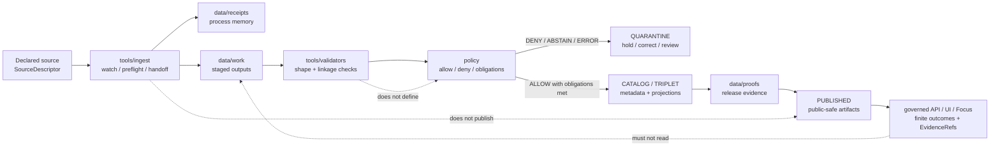

<!-- [KFM_META_BLOCK_V2]
doc_id: kfm://doc/TODO-NEEDS-UUID
title: tools
type: standard
version: v1
status: draft
owners: @bartytime4life
created: NEEDS-VERIFICATION
updated: 2026-04-22
policy_label: public
related: [../README.md, ../.github/CODEOWNERS, ./ingest/README.md, ./ingest/genealogy/README.md, ./validators/README.md]
tags: [kfm, tools, ingest, validators, governance, receipts, evidence, readme]
notes: [doc_id and created date need repository-history verification. Current public main evidence shows tools/README.md as effectively empty while tools/ includes ingest/ and validators/ as visible child lanes. Older project documentation mentions additional helper families; those are treated here as LINEAGE or PROPOSED until present in the live tree.]
[/KFM_META_BLOCK_V2] -->

<a id="top"></a>

# tools

Governed helper surface for KFM ingest-edge utilities and fail-closed validation helpers that support evidence movement without becoming truth, policy, runtime, or publication.


> [!IMPORTANT]
> **Status:** experimental  
> **Owners:** `@bartytime4life`  
> **Path:** `tools/README.md`  
> **Current public snapshot:** `tools/` is confirmed as a small helper surface with `ingest/`, `validators/`, and this README. Broader helper families mentioned in earlier docs are **LINEAGE / PROPOSED** unless the working branch proves them present.  
> **Quick jumps:** [Scope](#scope) · [Repo fit](#repo-fit) · [Accepted inputs](#accepted-inputs) · [Exclusions](#exclusions) · [Current evidence snapshot](#current-evidence-snapshot) · [Directory tree](#directory-tree) · [Quickstart](#quickstart) · [Usage](#usage) · [Diagram](#diagram) · [Reference tables](#reference-tables) · [Definition of done](#definition-of-done) · [FAQ](#faq) · [Appendix](#appendix)

> [!WARNING]
> `tools/` is not a scripts junk drawer.  
> Helpers in this tree must stay reviewable, deterministic where practical, and subordinate to KFM’s evidence, policy, catalog, proof, release, and rollback surfaces.

---

## Scope

`tools/` holds reusable repository helpers that make governed work easier to inspect.

In the current public tree, its confirmed child lanes are:

| Lane | Status | Role |
|---|---:|---|
| [`tools/ingest/`](./ingest/README.md) | **CONFIRMED** | Source-edge helpers, watcher/preflight patterns, checkpoint-aware ingest, and receipt-first handoff support. |
| [`tools/ingest/genealogy/`](./ingest/genealogy/README.md) | **CONFIRMED README** / **PROPOSED implementation** | Sensitive genealogy-family-history ingest lane, with DNA and living-person controls kept restrictive by default. |
| [`tools/validators/`](./validators/README.md) | **CONFIRMED README** / **NEEDS VERIFICATION** for full tree parity | Fail-closed validation helpers for declared structures, linkage, envelopes, fixtures, and promotion-adjacent checks. |

This directory’s job is to support the KFM trust path:

`RAW -> WORK / QUARANTINE -> PROCESSED -> CATALOG / TRIPLET -> PUBLISHED`

It should help produce or check receipts, validation reports, ingest handoffs, and candidate artifacts. It must not silently decide public truth, mutate canonical records, or skip review.

[Back to top](#top)

---

## Repo fit

| Direction | Surface | Fit |
|---|---|---|
| Upstream identity | [`../README.md`](../README.md) | Defines KFM as evidence-first, map-first, time-aware, governed, and centered on inspectable claims. |
| Ownership | [`../.github/CODEOWNERS`](../.github/CODEOWNERS) | Current owner coverage for `/tools/` flows through `@bartytime4life`. |
| Current child lane | [`./ingest/README.md`](./ingest/README.md) | Source-edge and preflight helper lane. |
| Current child lane | [`./ingest/genealogy/README.md`](./ingest/genealogy/README.md) | Sensitive family-history ingest planning lane. |
| Current child lane | [`./validators/README.md`](./validators/README.md) | Validation and gate-helper lane. |
| Adjacent authority surfaces | `contracts/`, `schemas/`, `policy/`, `tests/` | **NEEDS VERIFICATION before linking from this file.** These surfaces define meaning, machine shape, admissibility, and proof burden; `tools/` should call or support them, not replace them. |
| Adjacent lifecycle surfaces | `data/receipts/`, `data/proofs/`, `data/catalog/`, `data/published/` | **NEEDS VERIFICATION before direct linking from this file.** Tool outputs may feed these surfaces only through governed contracts. |
| Adjacent orchestration surfaces | `.github/workflows/`, `.github/actions/`, `scripts/`, `pipelines/` | **NEEDS VERIFICATION before direct linking from this file.** Orchestration may call tools; tools should keep reusable logic inspectable outside YAML glue. |

> [!NOTE]
> If a future branch adds helper families such as `tools/attest/`, `tools/catalog/`, `tools/ci/`, `tools/diff/`, `tools/docs/`, or `tools/probes/`, update this README and the directory tree in the same PR. Do not imply those lanes exist on the active branch until tree evidence confirms them.

[Back to top](#top)

---

## Accepted inputs

Use `tools/` for small, reviewable helpers that support governed KFM work, including:

- source-edge ingest helpers that read from declared source descriptors and emit bounded receipts or staging outputs
- deterministic preflight checks before data enters a stronger lifecycle stage
- validators that check schema shape, required references, finite outcomes, catalog closure, or release-candidate completeness
- local helper CLIs used by CI, pipelines, scripts, or reviewers
- README-first helper lanes that document a future tool boundary before code lands
- valid and invalid fixture-oriented checks when fixtures are non-sensitive and repo-approved
- generated summaries that remain visibly derived from upstream machine artifacts

Healthy tools should make claims like:

- “this source handoff emitted a `run_receipt`”
- “this candidate failed validation with reason codes”
- “this object has missing evidence references”
- “this shape is valid against the declared schema”
- “this public artifact candidate needs review before release”

They should not make claims like:

- “this is true”
- “this is now public”
- “this policy allows publication”
- “this model answer is authoritative”
- “this raw source is safe to expose”

[Back to top](#top)

---

## Exclusions

Do **not** put these in `tools/`:

| Excluded item | Why it does not belong here | Better home |
|---|---|---|
| Raw source data | Tooling must not become a hidden RAW store. | `data/raw/` or source-controlled fixture homes, after verification. |
| WORK / QUARANTINE payloads | These are lifecycle state objects, not helper code. | `data/work/` or `data/quarantine/`, after verification. |
| Canonical records | Tools support movement and checks; they do not own truth. | Domain data stores or canonical package homes, after verification. |
| Policy law | Tools may call policy checks, but policy decides. | `policy/`. |
| Machine schemas | Validators may consume schemas; they do not define canonical shape. | `schemas/` or the repo-approved schema home. |
| Human-readable contracts | Tool READMEs can link to contracts; they should not replace them. | `contracts/`. |
| Proof objects | Tools may generate candidates, but proof custody is separate. | `data/proofs/` or release evidence homes. |
| Public release artifacts | Publication is a governed state transition, not a tool-side copy. | `data/published/` or release homes after gates pass. |
| Secrets and tokens | Secrets must never drift into helper code, fixtures, docs, or logs. | Secret manager or CI secret settings. |
| Living-person, DNA, rare-location, archaeological, or critical-infrastructure details | Sensitive exact records need policy, review, and redaction controls before any helper touches them. | Restricted lifecycle homes and steward review. |
| One-off notebooks or ad hoc shell scraps | KFM helper behavior should be repeatable and reviewable. | `scripts/` or local scratch space, if approved. |

[Back to top](#top)

---

## Current evidence snapshot

| Evidence item | Status | Handling in this README |
|---|---:|---|
| `tools/README.md` target | **CONFIRMED empty / needs creation** | This file is written as a replacement-grade directory README. |
| `tools/ingest/README.md` | **CONFIRMED** | Linked as an existing child lane. |
| `tools/ingest/genealogy/README.md` | **CONFIRMED README** | Linked, but implementation claims remain bounded. |
| `tools/validators/README.md` | **CONFIRMED README** | Linked, with parity caveat because direct tree listing and raw/blob evidence should be rechecked in the working checkout. |
| `/tools/` owner | **CONFIRMED** | Owner shown as `@bartytime4life`. |
| Additional tool families from prior docs | **LINEAGE / PROPOSED** | Preserved in the appendix, not treated as current tree fact. |
| Active workflow callers | **UNKNOWN** | No merge-blocking or runtime behavior is claimed here. |
| Local mounted repo state | **UNKNOWN in this authoring pass** | Maintainers must re-run the quickstart checks in the actual checkout before merge. |

[Back to top](#top)

---

## Directory tree

### Current public tree shape

```text
tools/
├── README.md
├── ingest/
│   ├── README.md
│   └── genealogy/
│       └── README.md
└── validators/
    ├── README.md              # verify branch parity before merge
    └── .gitkeep               # visible directory-listing marker
```

### Lineage / candidate helper families

The following names appear in older or adjacent KFM documentation as useful helper families. Treat them as **not current tree fact** unless the working branch contains them.

<details>
<summary>Potential future helper-family shape</summary>

```text
tools/
├── attest/        # PROPOSED / LINEAGE: signing, digest, attestation, verification helpers
├── catalog/       # PROPOSED / LINEAGE: catalog QA and cross-link helper surface
├── ci/            # PROPOSED / LINEAGE: reviewer-facing renderers and check summaries
├── diff/          # PROPOSED / LINEAGE: deterministic comparison helpers
├── docs/          # PROPOSED / LINEAGE: documentation structure and meta-block checks
├── probes/        # PROPOSED / LINEAGE: bounded read-only inspection helpers
└── validators/    # CONFIRMED README; verify exact executable inventory
```

</details>

[Back to top](#top)

---

## Quickstart

Run these checks in the working checkout before changing this directory.

### 1. Confirm branch and tree state

```bash
git status --short
git branch --show-current || true
find tools -maxdepth 4 -type f | sort
```

### 2. Recheck owners and current child lanes

```bash
sed -n '1,180p' .github/CODEOWNERS
sed -n '1,260p' tools/ingest/README.md
sed -n '1,260p' tools/validators/README.md
```

### 3. Look for risky accidental payloads

```bash
find tools -type f \
  \( -name "*.csv" -o -name "*.geojson" -o -name "*.json" -o -name "*.sqlite" -o -name "*.db" -o -name "*.parquet" \) \
  | sort
```

> [!CAUTION]
> The command above only finds suspicious file types. It does not prove a file is safe. Any fixture or example under `tools/` still needs rights, sensitivity, and policy review.

### 4. Run repo-native checks after helpers exist

```bash
# Examples only. Replace with repo-native commands after branch inspection.
python -m pytest tests -q
python tools/validators/<validator>.py --help
```

[Back to top](#top)

---

## Usage

### Choosing the right lane

| Need | Use | Do not use |
|---|---|---|
| Source preflight, watcher checkpoint, source-edge handoff | `tools/ingest/` | `tools/validators/` as a source reader |
| Sensitive family-history ingest planning | `tools/ingest/genealogy/` | Any public raw person/DNA output |
| Check declared shapes, refs, finite outcomes, or release-candidate constraints | `tools/validators/` | Policy law, schema authorship, or hidden publication |
| Human-readable meaning | `contracts/` | `tools/` |
| Machine-readable shape | `schemas/` or approved schema home | `tools/` |
| Allow/deny/obligation logic | `policy/` | `tools/` |
| Proof-bearing release evidence | `data/proofs/` or approved proof home | `tools/` |
| Process memory | `data/receipts/` or approved receipt home | ad hoc files under `tools/` |
| Workflow orchestration | `.github/workflows/`, `.github/actions/`, or `scripts/` | burying orchestration inside helper modules |

### Healthy handoff pattern

1. A source descriptor defines what can be read and under what posture.
2. `tools/ingest/` performs a bounded, receipt-first preflight or handoff.
3. `tools/validators/` checks declared shape, references, and fail-closed constraints.
4. `policy/` decides allow, deny, abstain, or obligations where policy applies.
5. Receipts, catalog records, proofs, and release artifacts remain separate.
6. Public clients consume only governed, released surfaces.

[Back to top](#top)

---

## Diagram


```mermaid
flowchart LR
  source["Declared source<br/>SourceDescriptor"]
  ingest["tools/ingest<br/>watch / preflight / handoff"]
  receipts["data/receipts<br/>process memory"]
  work["data/work<br/>staged outputs"]
  validators["tools/validators<br/>shape + linkage checks"]
  policy["policy<br/>allow / deny / obligations"]
  quarantine["QUARANTINE<br/>hold / correct / review"]
  catalog["CATALOG / TRIPLET<br/>metadata + projections"]
  proofs["data/proofs<br/>release evidence"]
  published["PUBLISHED<br/>public-safe artifacts"]
  api["governed API / UI / Focus<br/>finite outcomes + EvidenceRefs"]

  source --> ingest
  ingest --> receipts
  ingest --> work
  work --> validators
  validators --> policy
  policy -->|DENY / ABSTAIN / ERROR| quarantine
  policy -->|ALLOW with obligations met| catalog
  catalog --> proofs
  proofs --> published
  published --> api

  validators -. "does not define" .-> policy
  ingest -. "does not publish" .-> published
  api -. "must not read" .-> work
```

[Back to top](#top)

---

## Reference tables

### Lane registry

| Path | Current status | Primary job | Must not become |
|---|---:|---|---|
| `tools/README.md` | **DRAFT replacement** | Orient the helper surface and protect lane boundaries. | A claim that unverified helper families exist. |
| `tools/ingest/` | **CONFIRMED** | Source-edge, watcher, checkpoint, and preflight helper lane. | Canonical store, public release lane, or policy authority. |
| `tools/ingest/genealogy/` | **CONFIRMED README** / **PROPOSED implementation** | Sensitive genealogy-family-history ingest planning. | Public raw person, DNA, or living-person disclosure lane. |
| `tools/validators/` | **CONFIRMED README** / **NEEDS VERIFICATION** | Fail-closed validation helper lane. | Schema home, policy source, proof store, or workflow substitute. |

### Tool output posture

| Output family | Allowed from `tools/`? | Rule |
|---|---:|---|
| `RunReceipt` / ingest receipt candidate | Yes, when lane-approved | Process memory, not proof or publication. |
| `ValidationReport` | Yes | Must include subject, version, status, and reason codes. |
| `DecisionEnvelope`-like result | Yes, when validator-owned | Must remain finite and machine-readable. |
| `EvidenceBundle` | Usually no | Tools may validate or reference it; evidence custody belongs elsewhere. |
| `ReleaseManifest` | Usually no | Tools may validate or summarize it; release authority belongs elsewhere. |
| Public tiles, APIs, or UI data | No | Public outputs must pass governed release paths. |
| Secrets, credentials, source tokens | No | Never store in this tree. |

### Truth labels used here

| Label | Meaning |
|---|---|
| **CONFIRMED** | Supported by current public repo evidence or attached KFM doctrine used for this README. |
| **INFERRED** | Strongly suggested by adjacent docs or architecture, but not direct implementation proof. |
| **PROPOSED** | Recommended target shape or lane rule consistent with KFM doctrine. |
| **UNKNOWN** | Not verified strongly enough from available repo or corpus evidence. |
| **NEEDS VERIFICATION** | Must be checked on the exact working branch or platform before relying on it. |
| **LINEAGE** | Useful prior documentation or design history that is not current tree proof. |

[Back to top](#top)

---

## Definition of done

A change under `tools/` is ready for review when all applicable checks are true:

- [ ] The helper belongs in `tools/` rather than `contracts/`, `schemas/`, `policy/`, `data/`, `tests/`, `scripts/`, `pipelines/`, or `.github/`.
- [ ] The README or file header states whether the helper is **CONFIRMED**, **PROPOSED**, or **NEEDS VERIFICATION**.
- [ ] No raw, work, quarantine, secret, sensitive-person, DNA, rare-location, archaeological-location, or critical-infrastructure payload is introduced.
- [ ] Outputs are deterministic where practical and include stable identifiers, subject references, versions, reason codes, and timestamps where relevant.
- [ ] Validators fail closed and expose negative fixtures where the repo has a fixture pattern.
- [ ] Tool outputs do not claim proof, catalog closure, promotion, or publication unless an upstream contract explicitly authorizes that output family.
- [ ] Receipts, proofs, catalog records, release manifests, and public artifacts remain separate.
- [ ] Child README links and relative links are verified from this file location.
- [ ] Ownership is checked against `.github/CODEOWNERS`.
- [ ] Rollback is simple: revert the PR and remove any generated non-release artifacts from the branch.

[Back to top](#top)

---

## FAQ

### Is `tools/` a source of truth?

No. `tools/` is a helper surface. KFM truth comes from admissible evidence, source role, policy posture, review state, release state, and correction lineage. Tools can make that chain easier to inspect, but they do not replace it.

### Can an ingest helper publish data?

No. Ingest helpers may read declared sources, preflight them, emit receipt-shaped process memory, or prepare staged outputs. Publication is a governed state transition after validation, policy, review, catalog/proof closure, and release handling.

### Can a validator decide policy?

No. A validator can report shape, linkage, completeness, deterministic identity, and finite outcome checks. Policy owns allow, deny, obligations, and admissibility rules.

### Why does this README avoid links to some obvious repo surfaces?

Because direct links should not be guessed. Add links to `contracts/`, `schemas/`, `policy/`, `data/`, `tests/`, `.github/workflows/`, and other surfaces after verifying the exact path and README presence on the working branch.

### Why mention older helper families if they are not current tree fact?

They are part of KFM documentation lineage and may be good future lanes. This README preserves them as backlog context without upgrading them into current implementation claims.

[Back to top](#top)

---

## Appendix

<details>
<summary>Lineage backlog for future `tools/` expansion</summary>

Older KFM docs describe a richer helper lattice. Before creating any of these, verify whether the active branch already has a preferred path, tests, schemas, and owner coverage.

| Candidate lane | Likely role | First safe version |
|---|---|---|
| `tools/attest/` | Digest, signature, attestation, and proof-pack inspection helpers. | README + one verify-only helper; no secret custody. |
| `tools/catalog/` | Catalog QA, cross-link, and closure-summary helpers. | README + non-mutating catalog cross-check. |
| `tools/ci/` | Reviewer-facing renderers and CI summary helpers. | README + render-only helper consuming already-produced artifacts. |
| `tools/diff/` | Stable comparison helpers for manifests, receipts, envelopes, or geometry summaries. | README + deterministic JSON diff fixture. |
| `tools/docs/` | Documentation meta-block, link, and structure checks. | README + `check_doc_structure`-style validator. |
| `tools/probes/` | Bounded read-only freshness/status probes. | README + one receipt-emitting probe that cannot publish. |

</details>

<details>
<summary>Minimal branch verification checklist</summary>

```bash
git status --short
git branch --show-current || true
find tools -maxdepth 4 -type f | sort
find .github -maxdepth 3 -type f | sort
sed -n '1,180p' .github/CODEOWNERS
sed -n '1,220p' README.md
sed -n '1,220p' tools/ingest/README.md
sed -n '1,220p' tools/validators/README.md
```

</details>
