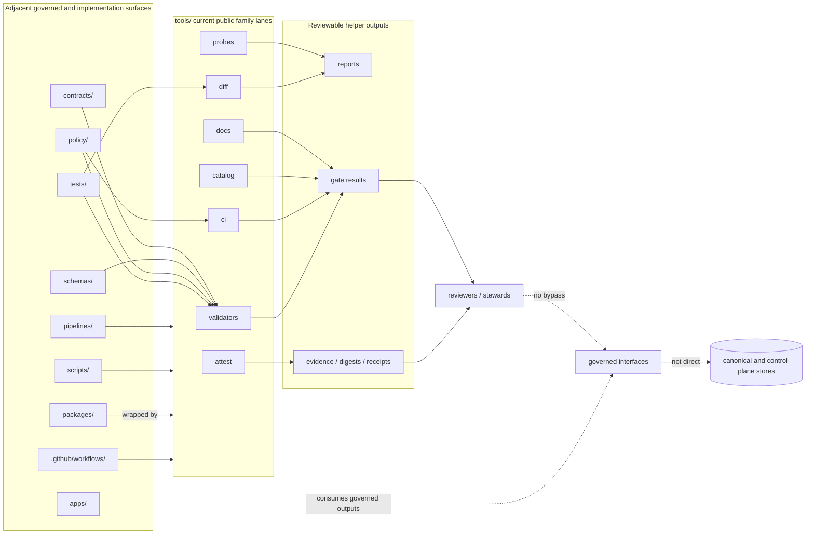

<!-- [KFM_META_BLOCK_V2]
doc_id: kfm://doc/<uuid-NEEDS-VERIFICATION>
title: tools
type: standard
version: v1
status: review
owners: @bartytime4life
created: <YYYY-MM-DD-NEEDS-VERIFICATION>
updated: 2026-04-12
policy_label: <NEEDS-VERIFICATION>
related: [../README.md, ../.github/README.md, ../.github/CODEOWNERS, ../.github/workflows/README.md, ../apps/, ../packages/, ../pipelines/, ../scripts/README.md, ../contracts/README.md, ../schemas/README.md, ../policy/README.md, ../tests/README.md, ./attest/README.md, ./catalog/README.md, ./ci/README.md, ./diff/README.md, ./docs/README.md, ./probes/README.md, ./validators/README.md]
tags: [kfm, tools, validation, reproducibility, ci]
notes: [Public main currently shows seven child lanes under /tools/ and a wider root neighborhood that includes apps, packages, and pipelines; visible child lanes remain README-first in public view. doc_id, created date, and policy_label remain NEEDS VERIFICATION.]
[/KFM_META_BLOCK_V2] -->

# tools

Governed helper surface for validation, probes, diffs, attestation, catalog QA, documentation checks, and CI summaries in Kansas Frontier Matrix.

> **Status:** experimental  
> **Owners:** `@bartytime4life`  
> **Repo fit:** repo-root lane `tools/` · target file `tools/README.md` · upstream [../README.md](../README.md) · governance [../.github/README.md](../.github/README.md) · child lanes [./validators/README.md](./validators/README.md), [./probes/README.md](./probes/README.md), [./diff/README.md](./diff/README.md), [./docs/README.md](./docs/README.md), [./catalog/README.md](./catalog/README.md), [./attest/README.md](./attest/README.md), [./ci/README.md](./ci/README.md) · downstream [../.github/workflows/README.md](../.github/workflows/README.md)  
> **Evidence posture:** doctrine-grounded · current public-`main` repo-grounded for visible tree state · deeper executable inventory, branch protections, rulesets, and local checkout parity remain bounded  
> **Current public snapshot:** `tools/` currently exposes `attest/`, `catalog/`, `ci/`, `diff/`, `docs/`, `probes/`, `validators/`, and `README.md`; the surrounding root neighborhood also visibly includes `apps/`, `packages/`, and `pipelines/`; each visible child lane under `tools/` is presently **README-first** in public view  
>       
> **Quick jumps:** [Scope](#scope) · [Repo fit](#repo-fit) · [Accepted inputs](#accepted-inputs) · [Exclusions](#exclusions) · [Current public evidence snapshot](#current-public-evidence-snapshot) · [Current family map](#current-family-map) · [Directory tree](#directory-tree) · [Quickstart](#quickstart) · [Usage](#usage) · [Tool behavior contract](#tool-behavior-contract) · [Diagram](#diagram) · [Tables](#tables) · [Task list](#task-list--definition-of-done) · [FAQ](#faq) · [Appendix](#appendix)

> [!IMPORTANT]
> `tools/` is not a miscellaneous scripts bin. In KFM it is the reusable, reviewable helper surface that strengthens governed execution without quietly becoming product runtime, policy source-of-truth, contract authority, or hidden business logic.

> [!NOTE]
> The parent `tools/` lane now exists as a visible seven-family surface on public `main`, but the visible subtree is still documentation-first. This README therefore does two jobs at once: it documents the **current family layout** and it defines the **behavioral contract** for the first executable helpers that land under those lanes.

## Scope

`tools/` is the KFM lane for small, explicit utilities whose main job is to **inspect, validate, compare, summarize, lint, probe, assemble proof, or emit support evidence**.

That includes validators, link and structure checkers, diff helpers, metadata cross-checkers, catalog QA helpers, proof-pack and attestation helpers, probes, and CI-facing CLIs that help the governed truth path stay auditable.

In the April 2026 KFM manuals, this helper layer matters because doctrine is no longer supposed to remain prose-only. KFM increasingly expects its governing rules to become machine-checkable objects and reviewable artifacts: source descriptors, receipts, validation reports, manifests, evidence bundles, runtime envelopes, review records, and correction artifacts. `tools/` is where many of the narrow, reusable utilities for inspecting and enforcing those objects logically belong.

What belongs here:

- reusable validators for contracts, catalogs, manifests, receipts, proof packs, and promotion-readiness checks
- deterministic diff, checksum, spec-hash, and integrity helpers
- bounded probes that inspect systems and emit reviewable reports
- catalog QA and cross-link helpers that strengthen outward STAC/DCAT/PROV closure
- attestation and proof-pack helpers used by release review or promotion control
- CI-facing CLIs that fail clearly, emit stable output, and stay runnable outside workflow YAML
- executable doc-quality checks when the job is enforcement, not normative standards ownership

What this README does:

- defines the operating contract for `tools/`
- distinguishes the parent lane from its current child families
- separates `tools/` from adjacent lanes such as `apps/`, `packages/`, `pipelines/`, `scripts/`, `tests/`, `contracts/`, `schemas/`, and `policy/`
- preserves KFM’s truth posture by marking what is **CONFIRMED**, **INFERRED**, **PROPOSED**, **UNKNOWN**, or **NEEDS VERIFICATION**

### Common proof-bearing objects this lane most often touches

| Object family | Most likely helper lanes | Why it shows up here |
| --- | --- | --- |
| `SourceDescriptor` | `validators/`, `catalog/`, `probes/` | intake contracts, fetch assumptions, and source metadata cross-checks |
| `IngestReceipt` / `ValidationReport` | `validators/`, `ci/`, `attest/` | stable machine-readable proof that a run occurred and what checks fired |
| `ReleaseManifest` / `ReleaseProofPack` | `attest/`, `ci/`, `diff/` | promotion review needs inspectable release bundles, digests, and rollback posture |
| `EvidenceBundle` / `RuntimeResponseEnvelope` | `validators/`, `catalog/`, `docs/` | outward claims, Evidence Drawer payloads, and answer surfaces need supportable object shapes |
| `ReviewRecord` / `CorrectionNotice` | `diff/`, `attest/`, `ci/` | rollback, supersession, and reviewer-visible state changes need explicit artifacts |

> [!NOTE]
> The table above names **doctrine-backed contract touchpoints**, not proof that every current child lane already ships concrete implementations on public `main`.

### Evidence markers used in this README

| Marker | Meaning here |
| --- | --- |
| **CONFIRMED** | Supported by current public repo inspection, attached KFM doctrine, or both |
| **INFERRED** | Strongly suggested by doctrine and adjacent docs, but not proven as current executable reality |
| **PROPOSED** | Target shape, placement rule, or future helper guidance consistent with doctrine |
| **UNKNOWN** | Not established strongly enough from visible repo or attached doctrine |
| **NEEDS VERIFICATION** | Placeholder or platform detail that should be checked before merge |

[Back to top](#tools)

## Repo fit

**Path:** `tools/README.md`  
**Role in repo:** parent directory README for reviewable helper lanes that support validation, proof, comparison, probing, catalog QA, documentation enforcement, and CI-facing summaries.

| Direction | Surface | Why it matters |
| --- | --- | --- |
| Upstream | [../README.md](../README.md) | Root repository framing and system identity |
| Governance | [../.github/README.md](../.github/README.md) | Repository gatehouse and maintainer workflow guidance |
| Governance | [../.github/CODEOWNERS](../.github/CODEOWNERS) | Current owner map for `tools/` and adjacent governed surfaces |
| Governance | [../.github/workflows/README.md](../.github/workflows/README.md) | Current checked-in workflow lane is still README-first in public view |
| Adjacent | [../apps/](../apps/) | Product runtime and surface code should not drift into `tools/` |
| Adjacent | [../packages/](../packages/) | Shared library code can be wrapped by tools, but should not be hidden inside them |
| Adjacent | [../pipelines/](../pipelines/) | Lane-specific ingest, publish, or watcher flows belong there when they are more than reusable helpers |
| Adjacent | [../scripts/README.md](../scripts/README.md) | Orchestration and lifecycle entrypoints may call tools, but reusable helper logic should not be buried there |
| Adjacent | [../contracts/README.md](../contracts/README.md) | Tools validate or consume contract surfaces; they do not replace them |
| Adjacent | [../schemas/README.md](../schemas/README.md) | Current repo also exposes a separate schema surface; `tools/` must not silently decide schema authority |
| Adjacent | [../policy/README.md](../policy/README.md) | Policy bundles live there; tools may lint, test, or summarize them |
| Adjacent | [../tests/README.md](../tests/README.md) | Fixtures and assertions should exercise tool behavior explicitly |
| Child lane | [./validators/README.md](./validators/README.md) | Deterministic fail-closed validation helpers |
| Child lane | [./probes/README.md](./probes/README.md) | Read-only bounded status and freshness helpers |
| Child lane | [./diff/README.md](./diff/README.md) | Deterministic comparison helpers |
| Child lane | [./docs/README.md](./docs/README.md) | Executable doc-quality checks and documentation support helpers |
| Child lane | [./catalog/README.md](./catalog/README.md) | Catalog QA, cross-link, and reviewer-facing metadata helpers |
| Child lane | [./attest/README.md](./attest/README.md) | Proof-pack, digest, and attestation support helpers |
| Child lane | [./ci/README.md](./ci/README.md) | CI-facing annotations, summaries, and merge-gate helper surface |

## Accepted inputs

The following belong in or under `tools/`:

- validator code, configs, and small helper assets for schema, catalog, provenance, checksum, or release checks
- deterministic comparison utilities for manifests, snapshots, geometry diffs, or release artifacts
- read-only probes that emit structured reports
- docs-lint or link-check helpers when their job is executable checking rather than standards ownership
- attestation, proof-pack, or spec-hash helpers used by CI, release review, or promotion control
- thin wrappers that make helper logic locally runnable and workflow-runnable with the same semantics

### Boundary map

| Surface | Belongs there when… | Does **not** belong there when… |
| --- | --- | --- |
| `tools/validators/` | the job is check / fail / report against a declared contract or rule | it is really orchestration, long-running runtime logic, or policy source-of-truth |
| `tools/probes/` | the job is bounded inspection, freshness, status, or read-only health output | it mutates canonical state or hides operational side effects |
| `tools/diff/` | the job is deterministic comparison for review, correction, or reproducibility | it is unstructured ad hoc analysis |
| `tools/docs/` | the job is executable documentation validation or structure checking | it owns the normative documentation rule itself |
| `tools/catalog/` | the job is metadata closure, cross-link checking, or reviewer-facing catalog QA | it replaces catalog authority or release logic |
| `tools/attest/` | the job is digest, receipt, attestation, or proof-pack support | it quietly becomes the release manager or publication authority |
| `tools/ci/` | the job is reusable CI-facing output shaping, summary, or annotation | it becomes the only place where merge logic exists |
| `packages/` | the logic is shared library code imported broadly across the repo | it is primarily a narrow CLI/helper entrypoint |
| `pipelines/` | the artifact is lane-specific ingest, transform, publish, or watcher logic | it is a cross-cutting validator, probe, diff, or attestation helper reusable across lanes |
| `scripts/` | the artifact coordinates staged work, transitions, or operator workflows and may call into `tools/` | it is really a reusable validator, diff helper, or proof emitter |
| `contracts/` | the artifact defines schema, OpenAPI, registry, or vocabulary shape | it is executable validation logic or a CLI entrypoint |
| `policy/` | the artifact is the policy source-of-truth: bundles, fixtures, or decision rules | it is generic wrapper code around policy evaluation |

## Exclusions

| Does **not** belong here | Put it in | Why |
| --- | --- | --- |
| Long-running public runtime code | [../apps/](../apps/) or a package lane | `tools/` supports governed execution; it is not the product runtime |
| Shared library code imported broadly across the repo | [../packages/](../packages/) | hidden library behavior inside helper entrypoints makes review and reuse harder |
| Lane-specific ingest, publish, or watcher flows | [../pipelines/](../pipelines/) or [../scripts/README.md](../scripts/README.md) depending on repo convention | `tools/` is for reusable helpers, not full operational flows |
| Canonical policy bundles or rule ownership | [../policy/README.md](../policy/README.md) | Tooling may evaluate policy, but policy source-of-truth stays separate |
| Authoritative contracts and schemas | [../contracts/README.md](../contracts/README.md) or [../schemas/README.md](../schemas/README.md) per repo authority rule | Tools consume contract surfaces; they should not hide or replace them |
| Schema-authority arbitration between `contracts/` and `schemas/` | ADR or contract-governance lanes | `tools/` may validate a declared source-of-truth, but must not silently define one |
| Normative documentation rules, templates, or style policy | documentation/governance lanes | Tooling may validate them, but the standards themselves are not owned here |
| One-off operator experiments without durable value | local scratch space or a dedicated script | `tools/` is for repeatable, reviewable utilities |
| Sensitive fixture payloads or unrestricted coordinate dumps | secured data lanes | Public tooling must stay safe to clone, run, and review |
| Hidden promotion shortcuts | nowhere | KFM promotion is governed, inspectable, and fail-closed |
| Inline workflow shell blobs as the only implementation | stable tool entrypoints plus documented workflows | Reviewers should be able to locate logic outside workflow YAML |

## Current public evidence snapshot

| Evidence item | Status | How this README uses it |
| --- | --- | --- |
| Public `main` repo root visibly includes `.github/`, `apps/`, `configs/`, `contracts/`, `data/`, `docs/`, `examples/`, `infra/`, `migrations/`, `packages/`, `pipelines/`, `policy/`, `schemas/`, `scripts/`, `tests/`, and `tools/` | **CONFIRMED** | Grounds repo-fit, routing, and relative-link structure |
| Public `tools/` visibly contains `attest/`, `catalog/`, `ci/`, `diff/`, `docs/`, `probes/`, `validators/`, and `README.md` | **CONFIRMED** | Grounds the current family map and lane count |
| Each visible child lane under `tools/` currently exposes `README.md` only in public view | **CONFIRMED** | Keeps executable inventory claims conservative |
| `.github/CODEOWNERS` assigns `/tools/` to `@bartytime4life` | **CONFIRMED** | Grounds the owners line and review expectation |
| `.github/workflows/README.md` states `.github/workflows/` is currently README-only on public `main` and should not be conflated with Actions UI history | **CONFIRMED** | Keeps checked-in workflow claims bounded |
| Public Actions history is visible and references historical workflow filenames, but current checked-in workflow YAML inventory is not proven from the public tree alone | **CONFIRMED historical signal / bounded current-state use** | Allows historical signal without overstating present tree contents |
| Attached KFM doctrine still prioritizes contract lattice, policy registries, evidence bundles, runtime envelopes, promotion discipline, and a hydrology-first proof slice before broad surface expansion | **CONFIRMED doctrine** | Grounds lane purpose, fail-closed expectations, and definition of done |

## Current family map

> [!NOTE]
> The family layout is now **present in the public tree**, but each visible family is still **README-first**. Treat the table below as a current lane registry, not as proof that each lane already contains executable helpers.

| Lane | Current public contents | Current stated job | Readiness posture |
| --- | --- | --- | --- |
| `attest/` | `README.md` | proof-pack, digest, and attestation support | documentation-first |
| `catalog/` | `README.md` | catalog QA, cross-link, and reviewer-facing metadata helpers | documentation-first |
| `ci/` | `README.md` | CI-facing summaries, annotations, and merge-gate helper surface | documentation-first |
| `diff/` | `README.md` | deterministic comparison helpers | documentation-first |
| `docs/` | `README.md` | executable doc-quality and structure checks | documentation-first |
| `probes/` | `README.md` | bounded freshness, status, and read-only inspection helpers | documentation-first |
| `validators/` | `README.md` | deterministic fail-closed validators | documentation-first |

## Directory tree

### Current public `main` snapshot

```text
tools/
├── attest/
│   └── README.md
├── catalog/
│   └── README.md
├── ci/
│   └── README.md
├── diff/
│   └── README.md
├── docs/
│   └── README.md
├── probes/
│   └── README.md
├── validators/
│   └── README.md
└── README.md
```

### Selected repo-root neighborhood

```text
repo/
├── .github/
├── apps/
├── configs/
├── contracts/
├── data/
├── docs/
├── examples/
├── infra/
├── migrations/
├── packages/
├── pipelines/
├── policy/
├── schemas/
├── scripts/
├── tests/
└── tools/
```

### Preferred landing shape inside a documentation-first family lane

```text
tools/<lane>/
├── README.md
├── <helper>.<py|sh|mjs|ts>
├── fixtures/          # when negative-path or parser coverage needs it
├── tests/             # when the helper is non-trivial
└── examples/          # optional, for reviewer-readable invocation patterns
```

> [!WARNING]
> The third tree is a **placement pattern**, not a statement that every current family already has executables, fixtures, or tests on public `main`.

[Back to top](#tools)

## Quickstart

Start with inventory, not assumption.

1. Confirm what actually exists in your checkout.

```bash
tree -a -L 2 tools 2>/dev/null || find tools -maxdepth 2 \( -type f -o -type d \) 2>/dev/null | sort
```

2. Recheck owners and the nearest governance neighbors.

```bash
sed -n '1,220p' .github/CODEOWNERS 2>/dev/null
sed -n '1,220p' .github/workflows/README.md 2>/dev/null
sed -n '1,220p' .github/README.md 2>/dev/null
```

3. Inspect the current child-lane READMEs before adding a helper.

```bash
find tools -maxdepth 2 -name README.md -print | sort | xargs -I{} sh -c 'echo "### {}"; sed -n "1,120p" "{}"; echo'
```

4. Search for existing callers before inventing a new helper name.

```bash
rg -n "tools/(attest|catalog|ci|diff|docs|probes|validators)" README.md .github docs scripts tests policy contracts schemas packages pipelines -S 2>/dev/null
```

5. Inspect actual executable entrypoints instead of assuming they already exist.

```bash
find tools -maxdepth 4 -type f \( -name "*.py" -o -name "*.sh" -o -name "*.mjs" -o -name "*.ts" \) 2>/dev/null | sort
```

> [!NOTE]
> If the local tree still matches the current public documentation-first snapshot, land the first executable helper in a family lane together with its caller path, fixtures or examples, and update both this parent README and the child-lane README in the same PR.

## Usage

### Choose the narrowest lane first

When adding a helper, start from the actual job:

1. **validate** something against a declared contract → `validators/`
2. **probe** bounded state or freshness → `probes/`
3. **compare** deterministic before/after or release-to-release state → `diff/`
4. **check docs** structure, badges, front matter, tables, links, or Mermaid → `docs/`
5. **close or audit catalog metadata** → `catalog/`
6. **emit or verify digests / attestations / proof objects** → `attest/`
7. **shape CI-facing summaries or annotations** → `ci/`

### Land the first executable helper in a README-first lane safely

1. identify the caller surface first: local review flow, CI lane, release review, or steward workflow
2. place the helper under the narrowest child lane that matches its real job
3. add at least one representative pass path and one failing or blocking path when the helper is non-trivial
4. document invocation in the child-lane README and keep this parent README synchronized
5. keep the change small enough that reviewers can verify purpose, inputs, outputs, and fail-closed behavior in one pass

### Wire helpers into scripts, pipelines, packages, or CI without hiding them

Keep orchestration and helper logic distinct:

1. let [../scripts/README.md](../scripts/README.md) own staged movement, scheduling, or operator choreography
2. let [../pipelines/](../pipelines/) own lane-specific ingest, publish, or watcher flows when the logic is more than a reusable helper
3. let [../packages/](../packages/) own shared library code imported broadly across the repo
4. let `tools/` own reusable inspection, validation, comparison, proof, or support evidence
5. keep workflow YAML thin by calling stable tool entrypoints instead of embedding large shell blobs
6. make the same helper runnable locally and in CI
7. document the caller and the helper together when either one becomes merge-blocking

## Tool behavior contract

| Concern | Required posture |
| --- | --- |
| Determinism | Same inputs should yield the same output shape and exit code |
| Failure semantics | Documented blocking conditions return non-zero and stay visible |
| Output shape | Prefer JSON/JSONL or another stable machine-readable format when CI or review consumes output |
| Side effects | Default to read-only inspection unless write behavior is explicit, narrow, and documented |
| Provenance joinability | Reports should carry enough IDs, digests, refs, or paths to join back to manifests, receipts, and release objects |
| Safety | No secret scraping, unrestricted sensitive fixtures, or logs that leak policy-restricted material |
| Boundary discipline | No direct bypass of policy, review, release evidence, or the trust membrane |
| Reviewability | Helpers should be callable by humans, CI, and scripts without changing semantics |
| Local/CI parity | A merge-blocking helper should be runnable locally with the same core behavior as in CI |

Illustrative output shape for a blocking validator:

```json
{
  "tool": "runtime_response_envelope_validate",
  "status": "fail",
  "blocking": true,
  "subject": "examples/runtime/runtime_response_envelope.invalid.json",
  "checks": [
    {
      "id": "schema-version-present",
      "result": "pass"
    },
    {
      "id": "finite-outcome",
      "result": "fail",
      "message": "result must be one of ANSWER, ABSTAIN, DENY, ERROR"
    }
  ],
  "audit_ref": "audit:tools:validators:runtime-envelope:example-01"
}
```

> [!IMPORTANT]
> “Fail-closed” does **not** mean every warning is fatal. It means documented blocking conditions actually block, consistently and inspectably, and produce reviewable output when they do.

## Diagram


```mermaid
flowchart LR
    subgraph Adjacent[Adjacent governed and implementation surfaces]
      C[contracts/]
      S[schemas/]
      P[policy/]
      T[tests/]
      PL[pipelines/]
      PK[packages/]
      AP[apps/]
      SC[scripts/]
      WF[.github/workflows/]
    end

    subgraph Tools[tools/ current public family lanes]
      V[validators]
      PR[probes]
      D[diff]
      DO[docs]
      CA[catalog]
      AT[attest]
      CI[ci]
    end

    subgraph Outputs[Reviewable helper outputs]
      R[reports]
      G[gate results]
      E[evidence / digests / receipts]
    end

    C --> V
    S --> V
    P --> V
    P --> CI
    T --> V
    T --> D
    PL --> Tools
    SC --> Tools
    PK -. wrapped by .-> Tools
    WF --> Tools

    PR --> R
    D --> R
    DO --> G
    CA --> G
    AT --> E
    CI --> G
    V --> G

    G --> RV[reviewers / stewards]
    E --> RV

    RV -. no bypass .-> API[governed interfaces]
    API -. not direct .-> STORE[(canonical and control-plane stores)]
    AP -. consumes governed outputs .-> API
```

## Tables

### Lane selection matrix

| Need | Best lane | Typical input | Typical output |
| --- | --- | --- | --- |
| Validate contract or payload | `validators/` | schema + subject file | pass/fail report, structured errors |
| Inspect source freshness or status | `probes/` | endpoint, feed, config, snapshot | probe report, freshness summary |
| Compare before/after state | `diff/` | manifests, snapshots, geometry baselines, rendered outputs | stable diff report, counts, artifacts |
| Enforce doc quality | `docs/` | Markdown, lint config, front matter schemas | audit JSON, summaries, link logs |
| Check catalog closure or metadata cross-links | `catalog/` | STAC/DCAT/PROV, manifests, release refs | closure report, cross-link findings |
| Emit or verify proof objects | `attest/` | digests, manifests, receipts, bundles | attestations, verification results |
| Summarize CI state for reviewers | `ci/` | reports, receipts, test output | PR summaries, annotations, compact gate output |

### Root-lane routing cues

| If the code is primarily… | Best home | Why |
| --- | --- | --- |
| a narrow reusable validator, probe, diff helper, attester, or CI summary CLI | `tools/` | reviewable helper surface with stable entrypoints |
| shared library logic imported broadly across the repo | `packages/` | keeps helper wrappers thin and reusable code explicit |
| dataset- or lane-specific ingest / transform / publish / watcher flow | `pipelines/` | operational flow should stay close to the lane it serves |
| product runtime, API, UI, or user-facing surface code | `apps/` | runtime boundaries stay clear and auditable |
| staged operator choreography or transition script | `scripts/` | orchestration should not be mistaken for helper authority |
| source-of-truth contract or schema definition | `contracts/` or `schemas/` | tooling consumes those surfaces but does not own them |
| source-of-truth policy bundle or decision grammar | `policy/` | fail-closed enforcement must remain inspectable at the policy surface |

### Naming and placement rules

| Prefer | Avoid | Why |
| --- | --- | --- |
| `tools/validators/<subject>_validate.py` | `tools/validate.py` | narrow entrypoints are easier to review and govern |
| `tools/probes/<source>_probe.py` | `tools/check.py` | names should reveal the guarded contract |
| `tools/diff/stable_<subject>_diff.py` | comparison logic hidden only in workflow YAML | review logic should stay directly inspectable |
| `tools/attest/<artifact>_attest.py` | scattered signing helpers across random folders | release evidence should be discoverable |
| `tools/ci/<surface>_summary.py` | CI behavior encoded only in workflow shell | reviewers should be able to inspect output logic directly |
| update parent and child READMEs together | child lane drift from parent lane | family lanes should remain legible as a system |

## Task list / Definition of done

- [ ] The helper has one narrow, documented purpose.
- [ ] Directory placement matches the helper’s real job.
- [ ] Exit codes are explicit and tested or example-proved.
- [ ] At least one representative success path and one failure path exist for non-trivial helpers.
- [ ] Machine-readable output exists where CI, review, or audits need stable parsing.
- [ ] No secret, restricted, or rights-unclear material was committed as a fixture.
- [ ] The helper does not bypass policy, review, release evidence, or the trust membrane.
- [ ] If a script, pipeline, package wrapper, or workflow calls the helper, that caller is documented near the helper.
- [ ] Naming follows the child-lane convention and descriptive-entrypoint rule.
- [ ] If the child lane is currently README-first, the first executable helper lands with tests or examples and caller documentation in the same PR.
- [ ] This parent README and the relevant child-lane README were updated together.
- [ ] Owners, caller paths, and merge-gate links were rechecked against current repo evidence before merge.

## FAQ

### Why does this README still talk about target behavior if the child lanes already exist?

Because the child lanes now exist as public structure, but they are still documentation-first in the visible tree. KFM loses trust when it blurs **present tree state** and **executed helper inventory** together.

### Why not put everything in `scripts/`?

Because KFM treats scripts as transition or orchestration machinery, while `tools/` is the reusable helper surface those scripts, pipelines, and workflows can call. If a helper’s main job is validate, compare, summarize, attest, or fail clearly, it should not be buried inside lifecycle choreography.

### Why call out both `contracts/` and `schemas/`?

Because the public repo currently exposes both surfaces. Until the repo declares a single authoritative schema home, `tools/` should validate declared inputs and avoid quietly turning convenience into project law.

### Why call out `packages/` and `pipelines/` here now?

Because current public `main` visibly includes both lanes. That changes placement pressure: shared library code should not hide inside helper entrypoints, and lane-specific flows should not quietly turn the `tools/` lane into a second operational runtime.

### Why mention workflows if `.github/workflows/` is README-first right now?

Because merge-blocking intent and CI-facing helper behavior still matter to this lane. The current checked-in workflow directory is bounded in public view, but helper design still needs to assume local and CI parity from day one.

### When should logic move out of `tools/` and into `packages/`?

When the logic is no longer primarily a helper or CLI surface and becomes shared library code imported broadly across the repo. `tools/` can wrap package logic, but it should not become the hidden library layer.

## Appendix

<details>
<summary>Current public-main facts this README is built to respect</summary>

```text
1. Public `main` root visibly includes .github/, apps/, configs/, contracts/, data/, docs/, examples/, infra/, migrations/, packages/, pipelines/, policy/, schemas/, scripts/, tests/, and tools/.
2. /tools/ exists on public main.
3. /tools/ currently contains seven visible child lanes plus README.md.
4. Each visible child lane currently exposes README.md only in public view.
5. /tools/ is owned by @bartytime4life in .github/CODEOWNERS.
6. .github/workflows/ currently exposes README.md only in the public tree.
7. Public Actions history is visible, but that history is not the same thing as current checked-in workflow inventory.
```

</details>

<details>
<summary>Current child-lane index</summary>

```text
tools/attest/README.md
tools/catalog/README.md
tools/ci/README.md
tools/diff/README.md
tools/docs/README.md
tools/probes/README.md
tools/validators/README.md
```

</details>

<details>
<summary>Verification-first local checks</summary>

```bash
# What is actually present?
tree -a -L 2 tools 2>/dev/null || find tools -maxdepth 2 \( -type f -o -type d \) 2>/dev/null | sort

# Which child lanes are still README-first?
find tools -mindepth 2 -maxdepth 2 -type f | sort

# Which nearby governed and implementation surfaces exist?
find .github -maxdepth 2 \( -type f -o -type d \) 2>/dev/null | sort
find packages -maxdepth 3 \( -type f -o -type d \) 2>/dev/null | sort
find pipelines -maxdepth 3 \( -type f -o -type d \) 2>/dev/null | sort
find tests -maxdepth 3 \( -type f -o -type d \) 2>/dev/null | sort

# Where does tooling wire into scripts, docs, policy, contracts, schemas, packages, and pipelines?
rg -n "tools/(attest|catalog|ci|diff|docs|probes|validators)" .github docs scripts policy tests contracts schemas packages pipelines -S 2>/dev/null

# What actual executable entrypoints exist right now?
find tools -maxdepth 4 -type f \( -name "*.py" -o -name "*.sh" -o -name "*.mjs" -o -name "*.ts" \) 2>/dev/null | sort

# Which owners and merge-gate docs are active?
sed -n '1,220p' .github/CODEOWNERS 2>/dev/null
sed -n '1,220p' .github/workflows/README.md 2>/dev/null
sed -n '1,220p' .github/README.md 2>/dev/null
```

</details>

<details>
<summary>What this README intentionally does not claim</summary>

This README does **not** claim that the current repo already contains:

- a populated executable helper inventory under every child lane
- a verified current workflow YAML set in `.github/workflows/`
- a resolved single schema authority between `contracts/` and `schemas/`
- a verified live `EvidenceBundle` resolver or `RuntimeResponseEnvelope` emitter in the public tree
- current branch-protection settings, required-check configuration, or environment protections
- active proof-pack, attestation, or CI helper implementations beyond what is directly visible in the public tree
- exact mounted pipeline callers or shared-library integrations beyond what a direct checkout inspection can verify

Those remain direct verification tasks for a mounted checkout and settings review.

</details>

[Back to top](#tools)
