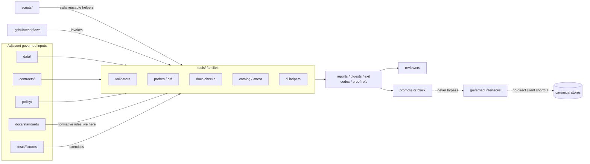

<!-- [KFM_META_BLOCK_V2]
doc_id: kfm://doc/<uuid-NEEDS-VERIFICATION>
title: tools
type: standard
version: v1
status: draft
owners: <see ../.github/CODEOWNERS — NEEDS VERIFICATION>
created: <YYYY-MM-DD-NEEDS-VERIFICATION>
updated: 2026-03-19
policy_label: <NEEDS-VERIFICATION>
related: [../README.md, ../.github/README.md, ../.github/CODEOWNERS, ../contracts/, ../policy/, ../data/, ../infra/, ../scripts/, ../tests/]
tags: [kfm, tools, validation, reproducibility, ci]
notes: [Directory role is source-grounded from March 2026 KFM documentation, but current-session workspace evidence was PDF-only; live repo tree, CODEOWNERS, workflows, and exact tool paths remain NEEDS VERIFICATION.]
[/KFM_META_BLOCK_V2] -->

# tools

Verification, validation, diff, probe, and support tooling surface for Kansas Frontier Matrix.

> **Status:** experimental  
> **Owners:** NEEDS VERIFICATION — see [../.github/CODEOWNERS](../.github/CODEOWNERS)  
> **Repo fit:** documented repo-root lane `tools/` · intended file `tools/README.md` · upstream [../README.md](../README.md) · governance [../.github/README.md](../.github/README.md) · adjacent [../scripts/](../scripts/) · downstream [../.github/workflows/](../.github/workflows/)  
> **Evidence posture:** source-bounded · documentary repo inventory available · live mounted repo-tree verification remains **NEEDS VERIFICATION**  
>       
> **Quick jumps:** [Scope](#scope) · [Repo fit](#repo-fit) · [Accepted inputs](#accepted-inputs) · [Exclusions](#exclusions) · [Current evidence snapshot](#current-evidence-snapshot) · [Directory tree](#directory-tree) · [Quickstart](#quickstart) · [Usage](#usage) · [Tool behavior contract](#tool-behavior-contract) · [Diagram](#diagram) · [Tables](#tables) · [Task list](#task-list--definition-of-done) · [FAQ](#faq) · [Appendix](#appendix)

> [!IMPORTANT]
> `tools/` is not a miscellaneous scripts bin. In KFM it is the reusable, reviewable helper surface that strengthens governed execution without quietly becoming product runtime, policy source-of-truth, or hidden business logic.

> [!NOTE]
> In the March 2026 documentary repo inventory available in this session, `tools/` is described as the lane for **validators, link checkers, and CLI utilities**. This README preserves that role, expands it cautiously, and keeps all live-tree claims reviewable.

## Scope

`tools/` is the KFM lane for small, explicit utilities whose main job is to **inspect, validate, compare, summarize, lint, probe, or emit support evidence**. In practice, that means validators, link checkers, diff/probe helpers, metadata cross-checkers, spec-hash helpers, attestation helpers, and CI-facing CLIs that help the governed truth path stay auditable.

This README follows the March 2026 KFM doctrine and documentary repo inventories that describe `tools/` as a validator / link-check / CLI surface. Because the directly accessible workspace in this session exposed PDFs rather than a mounted live checkout, file-level and path-level statements remain intentionally qualified.

What belongs here:

- reusable validators for contracts, catalogs, manifests, receipts, proof packs, and promotion-readiness checks
- deterministic diff, checksum, spec-hash, and integrity helpers
- bounded probes that inspect systems and emit reviewable reports
- reviewer/operator helpers that summarize build, PR, release, or catalog evidence in stable formats
- CI-facing CLIs that fail clearly, emit stable output, and stay runnable outside workflow YAML

What this README does:

- defines the operating contract for `tools/`
- separates `tools/` from adjacent lanes such as `scripts/`, `tests/`, `contracts/`, and `policy/`
- keeps documentary repo evidence separate from target-shape guidance
- preserves KFM’s truth posture by marking what is confirmed, inferred, proposed, or still unverified

### Evidence markers used in this README

| Marker | Meaning here |
| --- | --- |
| **CONFIRMED** | Supported by attached March 2026 KFM documentation or direct current-session evidence |
| **INFERRED** | Strongly suggested by project documentation, but not re-verified from a mounted live repo tree |
| **PROPOSED** | Doctrine-consistent target shape or placement guidance, not verified as live-tree reality |
| **UNKNOWN** | Not verified strongly enough to present as settled current reality |
| **NEEDS VERIFICATION** | Placeholder value, owner, path, or implementation detail that should be checked in a live checkout before merge |

[Back to top](#tools)

## Repo fit

**Path:** `tools/README.md`  
**Role in repo:** directory README for validators, probes, diff helpers, catalog/evidence support tooling, and other reviewable helper CLIs.

> [!NOTE]
> The links below follow the documented KFM repo layout and surrounding doctrinal references. Their **current mounted presence** beyond the PDF corpus remains **NEEDS VERIFICATION** in this session.

| Direction | Surface | Why it matters |
| --- | --- | --- |
| Upstream | [../README.md](../README.md) | Root repository framing and system identity |
| Governance | [../.github/README.md](../.github/README.md) | Maintainer workflow guidance and repo-level operating notes |
| Governance | [../.github/CODEOWNERS](../.github/CODEOWNERS) | Intended owner map for `tools/` and adjacent governed surfaces |
| Adjacent | [../scripts/](../scripts/) | Orchestration and lifecycle-transition scripts may call tools, but reusable helpers should not be buried there |
| Adjacent | [../contracts/](../contracts/) | Tools validate or consume contracts; they do not replace them |
| Adjacent | [../policy/](../policy/) | Policy bundles live there; tools may lint, evaluate, or summarize them |
| Adjacent | [../tests/](../tests/) | Fixtures and assertions should exercise tool behavior explicitly |
| Adjacent | [../data/](../data/) | Catalogs, manifests, datasets, and example slices are common tool inputs |
| Adjacent | [../infra/](../infra/) | Infra may call tools, but deployment definitions do not belong here |
| Downstream | [../.github/workflows/](../.github/workflows/) | CI invokes tools, but workflow YAML should not become the only place tool behavior is documented |

## Accepted inputs

The following belong in or under `tools/`:

- validator code, configs, and tiny helper assets for schema, catalog, provenance, checksum, or release checks
- deterministic comparison utilities for manifests, snapshots, geometry diffs, or release artifacts
- probe helpers that emit bounded reports rather than silent mutation
- docs-lint or link-check helpers when their job is executable checking rather than normative standards ownership
- attestation, proof-pack, or spec-hash helpers used by CI, release review, or promotion control

### Boundary map

| Surface | Belongs there when… | Does **not** belong there when… |
| --- | --- | --- |
| `tools/` | the artifact is a reusable helper whose main job is check / report / fail / summarize | it is a long-running service, a public runtime, or a lifecycle orchestrator |
| `scripts/` | the artifact coordinates staged work, transitions, or operator workflows and may call into `tools/` | it is really a reusable validator, diff helper, or review CLI |
| `contracts/` | the artifact defines schema, OpenAPI, registry, or vocabulary shape | it is executable validation logic or a CLI entrypoint |
| `policy/` | the artifact is the policy source-of-truth: bundles, fixtures, or decision rules | it is generic wrapper code around policy evaluation |
| `docs/` | the artifact is the normative documentation rule, schema, template, or style standard | it is executable helper code that enforces those rules |
| `tests/` | the artifact asserts behavior, carries fixtures, or proves negative paths | it is the primary operational CLI or reviewer-facing helper |
| `packages/` | the logic is shared library code imported across the repo | it only exists as a thin command-line wrapper or support executable |

## Exclusions

| Does **not** belong here | Put it in | Why |
| --- | --- | --- |
| Long-running public runtime code | a deployable app or package lane | `tools/` supports governed execution; it is not the product runtime |
| Canonical policy bundles or rule ownership | [../policy/](../policy/) | Tooling may evaluate policy, but policy source-of-truth stays separate |
| Authoritative contracts and schemas | [../contracts/](../contracts/) | Tools consume contracts; they should not hide or replace them |
| Normative documentation rules, front-matter schemas, or style policy | [../docs/](../docs/) or adjacent governance lanes | Tooling may validate them, but the standards themselves are not owned here |
| One-off operator experiments without durable value | local scratch space or a dedicated script | `tools/` is for repeatable, reviewable utilities |
| Sensitive fixture payloads or unrestricted coordinate dumps | secured data lanes | Public tooling must remain safe to clone, run, and review |
| Hidden promotion shortcuts | nowhere | KFM promotion is governed, inspectable, and fail-closed |
| Inline workflow shell blobs that become the only implementation | tool entrypoints plus documented workflows | Reviewers should be able to locate logic outside workflow YAML |

## Current evidence snapshot

| Evidence item | Status | How this README uses it |
| --- | --- | --- |
| Documentary repo inventory material describes `tools/` as **validators, link checkers, CLI utilities** and places it beside `docs/`, `tests/`, `configs/`, `scripts/`, `migrations/`, and `examples/` | **CONFIRMED in project documentation / NEEDS VERIFICATION in live tree** | Grounds the directory role and adjacency model |
| The KFM truth path and trust membrane remain load-bearing: source edge -> RAW -> WORK/QUARANTINE -> PROCESSED -> CATALOG/TRIPLET -> PUBLISHED, with governed interfaces between clients and stores | **CONFIRMED** | Keeps helper tools subordinate to policy, evidence resolution, and release gating |
| Promotion is expected to fail closed on missing metadata, broken links, invalid catalogs, policy failures, and missing receipts/manifests | **CONFIRMED** | Grounds validator, link-check, and structured-report expectations |
| March 2026 KFM design manuals treat docs, ADRs, and runbooks as production surfaces and warn against hiding authoritative logic in scripts or deployment wiring | **CONFIRMED** | Keeps `tools/` reviewable and prevents drift into hidden business law |
| The current accessible workspace in this session exposed PDFs only under `/mnt/data`; no mounted repo tree, workflow YAML, manifests, or runtime logs were directly visible | **CONFIRMED current-session constraint** | Keeps owner/path/workflow claims qualified and reviewable |

## Directory tree

### Documentary repo-adjacent excerpt

```text
repo/
├── docs/
├── tools/        # validators, link checkers, CLI utilities
├── tests/
├── configs/
├── scripts/
├── migrations/
└── examples/
```

### PROPOSED stable family shape to prefer if the subtree is regularized

```text
tools/
├── validators/  # schema, catalog, provenance, docs, and policy-adjacent checks
├── probes/      # bounded inspection and freshness/status helpers
├── diff/        # deterministic comparison and review helpers
├── docs/        # executable doc-quality checks, not normative standards ownership
├── catalog/     # catalog closure and metadata-assembly support helpers
├── attest/      # proof-pack and attestation support helpers
└── ci/          # reviewer-facing summaries and merge-gate support utilities
```

> [!WARNING]
> The documentary corpus shows naming drift between `tools/validators/`, `tools/validate/`, and generic `validation` terminology. Prefer **plural noun directory families** (`validators/`, `probes/`, `diff/`, `docs/`, `catalog/`, `attest/`, `ci/`) and reserve verbs for entrypoint filenames.

### Design-note example paths (PROPOSED, not live-tree proof)

```text
tools/validators/spec_hash.py
tools/validators/http_validators.sh
tools/docs/validate_front_matter.py
tools/docs/validate_mermaid.mjs
tools/docs/audit_tables_and_fences.mjs
tools/docs/validate_badges_footer.mjs
tools/probes/gtfsrt_probe.py
tools/validate/gtfsrt_schema.py
tools/diff/stable_diff.py
tools/partition/write_snapshot.py
```

> [!NOTE]
> The example paths above are **document-backed design-note examples**, not proof that every path exists on the current branch. Treat them as naming and role cues until the live subtree is inspected.

[Back to top](#tools)

## Quickstart

The commands below are verification-first. Run them before adding or moving anything under `tools/`.

1. Inspect what actually exists in your checkout.

```bash
find tools -maxdepth 4 \( -type f -o -type d \) 2>/dev/null | sort
```

2. Check governance and adjacent lanes nearby, if present.

```bash
[ -f .github/README.md ] && sed -n '1,160p' .github/README.md
[ -f .github/CODEOWNERS ] && sed -n '1,220p' .github/CODEOWNERS
find .github/workflows -maxdepth 2 -type f 2>/dev/null | sort
```

3. Check naming drift and existing callers before adding a new family.

```bash
rg -n "tools/" .github docs scripts tests policy contracts -S 2>/dev/null
rg -n "tools/(validators|validate|probes|diff|docs|catalog|attest|ci)" . -S 2>/dev/null
```

4. Inspect candidate helper entrypoints instead of assuming they exist.

```bash
find tools -maxdepth 3 -type f \( -name "*.py" -o -name "*.sh" -o -name "*.mjs" \) 2>/dev/null | sort
```

> [!NOTE]
> The goal of quickstart here is **inventory first, movement second**. In this session, mounted repo reality was not directly visible, so every structural change should begin with local confirmation.

## Usage

### Add a reusable validator or checker

1. Choose the narrowest family that matches the helper’s real job.
2. Keep the entrypoint thin and explicit about inputs, outputs, and exit semantics.
3. Prefer read-only inspection by default.
4. Emit machine-readable output if CI, review surfaces, or audits will parse it.
5. Add at least one representative pass path and one failing path for non-trivial behavior.
6. Document blocking vs non-blocking conditions in the nearest README.

### Add a probe, diff, or catalog helper

A helper belongs in `tools/` when it:

- reads or compares state without becoming the system of record
- produces deterministic, reviewable output
- can fail closed when a blocking condition is detected
- does not silently promote, publish, or mutate authoritative truth
- is useful both to humans and to CI

### Wire tools into scripts or CI

Keep orchestration and helper logic distinct:

1. let `scripts/` own staged movement, scheduling, or operator choreography
2. let `tools/` own reusable inspection, validation, comparison, or support evidence
3. keep workflow YAML small by calling stable tool entrypoints instead of embedding large shell blobs
4. make the same helper runnable locally and in CI
5. document the caller and the helper together when either one becomes merge-blocking

## Tool behavior contract

| Concern | Required posture |
| --- | --- |
| Determinism | Same inputs should yield the same output shape and exit code |
| Failure semantics | Documented blocking conditions return non-zero and stay visible |
| Output shape | Prefer JSON/JSONL or another stable machine-readable format when CI consumes output |
| Side effects | Default to read-only inspection unless write behavior is explicit, narrow, and documented |
| Provenance joinability | Reports should carry enough IDs, digests, refs, or paths to join back to manifests and receipts |
| Safety | No secret scraping, unrestricted sensitive fixtures, or logs that leak policy-restricted material |
| Boundary discipline | No direct bypass of policy, review, release evidence, or the trust membrane |
| Reviewability | Helpers should be callable by humans, CI, and scripts without changing semantics |
| Local/CI parity | A merge-blocking helper should be runnable locally with the same core behavior as in CI |

Illustrative output shape for a blocking validator:

```json
{
  "tool": "spec_hash",
  "status": "fail",
  "blocking": true,
  "artifact": "data/processed/example-dataset/metadata.json",
  "checks": [
    {
      "id": "spec-hash-format",
      "result": "pass"
    },
    {
      "id": "receipt-linkage",
      "result": "fail",
      "message": "run_receipt missing matching digest reference"
    }
  ]
}
```

> [!IMPORTANT]
> “Fail-closed” here does **not** mean every warning is fatal. It means the documented blocking conditions actually block, consistently and inspectably, and produce reviewable output when they do.

## Diagram


```mermaid
flowchart LR
    subgraph Inputs[Adjacent governed inputs]
      D[data/]
      C[contracts/]
      P[policy/]
      T[tests/fixtures]
      DS[docs/standards]
    end

    S[scripts/] -->|calls reusable helpers| TF
    W[.github/workflows] -->|invokes| TF
    D --> TF
    C --> TF
    P --> TF
    DS -->|normative rules live here| TF
    T -->|exercises| TF

    subgraph TF[tools/ families]
      V[validators]
      PR[probes / diff]
      DO[docs checks]
      CA[catalog / attest]
      CI[ci helpers]
    end

    TF --> R[reports / digests / exit codes / proof refs]
    R --> RV[reviewers]
    R --> G[promote or block]

    G -. never bypass .-> API[governed interfaces]
    API -. no direct client shortcut .-> STORE[(canonical stores)]
```

## Tables

### Tool family matrix

| Family | Primary job | Typical inputs | Expected outputs | Typical caller | Status in this README |
| --- | --- | --- | --- | --- | --- |
| `validators/` | schema, catalog, provenance, determinism, docs, or policy-adjacent checks | schemas, manifests, catalogs, receipts, fixtures, markdown | pass/fail report, structured errors | CI, local review, scripts | **Strongest documentary fit** |
| `probes/` | bounded source, freshness, or status inspection | endpoints, feeds, configs, snapshots | probe report, freshness/status summary | scheduled checks, PR validation | **PROPOSED family** |
| `diff/` | deterministic comparison for review or correction | manifests, snapshots, geometry baselines, catalogs | stable diff report, counts, optional artifacts | reviewers, CI | **PROPOSED family** |
| `docs/` | executable checks for front matter, mermaid, tables, fences, badges, or links | markdown, schemas, lint configs | audit JSON, summaries, link logs | docs CI, maintainers | **PROPOSED family** |
| `catalog/` | catalog closure or metadata-assembly support | processed artifacts, IDs, metadata, cross-link targets | closure report, catalog updates, link summaries | release prep, local verification | **PROPOSED family** |
| `attest/` | attestation and release-evidence support | digests, manifests, proof objects | attestations, verification results, support bundles | release lanes, CI | **PROPOSED family** |
| `ci/` | reviewer-facing summaries and merge-gate support | reports, receipts, artifacts, test output | PR summaries, annotations, compact gate output | CI workflows | **PROPOSED family** |

### Naming and placement rules

| Prefer | Avoid | Why |
| --- | --- | --- |
| `tools/validators/` | long-lived parallel `tools/validate/` trees | stable noun families are easier to scan and govern |
| `tools/docs/validate_front_matter.py` | doc-validation logic hidden only in workflow YAML | reviewers should be able to find executable checks directly |
| `run_probe_<thing>.py` or `<thing>_probe.py` | `check.py` | entrypoints should reveal their guarded contract |
| `tools/diff/stable_diff.py` | comparison logic buried in CI shell | review logic should stay directly inspectable |
| `tools/attest/` | scattered signing helpers in random folders | release evidence should be discoverable |
| `scripts/` for orchestration | transition logic buried in `tools/` | reusable helpers and lifecycle choreography are different concerns |

## Task list / Definition of done

- [ ] The tool has one narrow, documented purpose.
- [ ] Directory placement matches the helper’s real job.
- [ ] Exit codes are explicit and tested.
- [ ] At least one representative success path and one failure path exist.
- [ ] Machine-readable output exists where CI, review, or audits need stable parsing.
- [ ] No secret, restricted, or rights-unclear material was committed as a fixture.
- [ ] The tool does not bypass policy, review, release evidence, or the trust membrane.
- [ ] If a script or workflow calls the tool, that caller is documented near the helper.
- [ ] Naming follows the plural-noun family rule for directories and descriptive entrypoint rule for executables.
- [ ] This README and any local tool README were updated together.
- [ ] Owners, merge gates, and caller paths were verified against the live checkout before merge.

## FAQ

### Why not put everything in `scripts/`?

Because KFM treats scripts as transition or orchestration machinery, while `tools/` is the reusable helper surface those scripts can call. If a helper’s main job is validate / compare / summarize / fail, it should not be buried inside lifecycle choreography.

### When should something move out of `tools/` and into `packages/`?

When the logic is no longer primarily a CLI/helper surface and becomes shared library code imported across multiple parts of the repo. `tools/` can wrap package logic, but it should not become the repo’s hidden library layer.

### Where should documentation rules live?

The **normative** rule, schema, or style policy should live in `docs/` or governance lanes. A helper that validates those rules may live under `tools/`, but it must not become the source-of-truth for the rule it checks.

### Why keep `CONFIRMED`, `PROPOSED`, and `UNKNOWN` markers inside a README?

Because this directory sits close to validation, CI, promotion readiness, and review evidence. Overclaiming here would weaken the same trust posture the tools are supposed to protect.

### Why prefer `validators/` over `validate/`?

Because the documentary corpus already shows naming drift. Standardizing on noun-based directory families keeps the tree readable and leaves verbs to entrypoint names.

## Appendix

<details>
<summary>Design-note example paths mentioned in accessible project materials</summary>

```text
tools/validators/spec_hash.py
tools/validators/http_validators.sh
tools/docs/validate_front_matter.py
tools/docs/validate_mermaid.mjs
tools/docs/audit_tables_and_fences.mjs
tools/docs/validate_badges_footer.mjs
tools/probes/gtfsrt_probe.py
tools/validate/gtfsrt_schema.py
tools/diff/stable_diff.py
tools/partition/write_snapshot.py
```

Use this list as a review aid, not as proof that every path exists on the active branch.

</details>

<details>
<summary>Verification-first local checks</summary>

```bash
# What is actually present?
find tools -maxdepth 4 \( -type f -o -type d \) 2>/dev/null | sort

# Which nearby governed surfaces exist?
find .github -maxdepth 2 -type f 2>/dev/null | sort
find tests -maxdepth 3 \( -type f -o -type d \) 2>/dev/null | sort

# Where does tooling wire into CI, scripts, docs, and policy?
rg -n "tools/" .github docs scripts policy tests contracts -S 2>/dev/null

# Is there still validators/validate drift?
rg -n "tools/(validators|validate)/" . -S 2>/dev/null

# Which owners and merge gates are active?
[ -f .github/CODEOWNERS ] && sed -n '1,220p' .github/CODEOWNERS
find .github/workflows -maxdepth 2 -type f 2>/dev/null | sort
```

</details>

<details>
<summary>What this README intentionally does not claim</summary>

This README does **not** claim that the current mounted repo already contains:

- a verified live `tools/` subtree matching the family shape above
- a confirmed owner map for `tools/`
- a confirmed workflow inventory or merge-blocking gate list
- a confirmed schema/fixture inventory for tooling
- a confirmed docs-tooling lane on disk
- a confirmed proof-pack or attestation implementation
- a confirmed EvidenceBundle resolver or RuntimeResponseEnvelope implementation on disk

Those remain direct verification tasks for a live checkout.

</details>

[Back to top](#tools)
