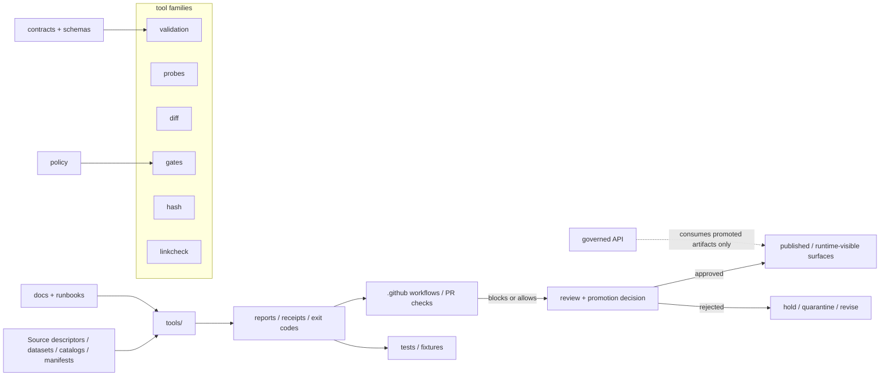

# tools

Verification, validation, diff, probe, and support tooling surface for Kansas Frontier Matrix.

> **Status:** experimental  
> **Owners:** NEEDS VERIFICATION — check [`../.github/CODEOWNERS`](../.github/CODEOWNERS)  
>       
> **Quick jumps:** [Scope](#scope) · [Repo fit](#repo-fit) · [Accepted inputs](#accepted-inputs) · [Exclusions](#exclusions) · [Current verified snapshot](#current-verified-snapshot) · [Directory tree](#directory-tree) · [Quickstart](#quickstart) · [Usage](#usage) · [Tool behavior contract](#tool-behavior-contract) · [Diagram](#diagram) · [Tables](#tables) · [Task list](#task-list--definition-of-done) · [FAQ](#faq) · [Appendix](#appendix)

> [!IMPORTANT]
> `tools/` is not a miscellaneous scripts bin. In KFM it should be the deterministic, reviewable support surface for validation, promotion readiness, reproducibility, and trust-preserving automation.

This directory is intentionally kept in the repository even when thin. That reserved surface still matters: it keeps future validators, probes, diff helpers, and gate runners reviewable in-repo instead of ad hoc.

## Scope

`tools/` is the home for small, reviewable CLIs and helpers that test or strengthen governed behavior without quietly becoming pipelines, services, or runtime policy sources of truth.

What belongs here:

- validation helpers for catalogs, schemas, fixtures, and dataset gates
- probe and diff utilities that produce deterministic, reviewable outputs
- hash, manifest, and receipt helpers that make promotion readiness machine-checkable
- thin wrappers used by CI, tests, and operator workflows

What this README is for:

- explaining the directory contract
- distinguishing current repo fact from proposed growth
- keeping naming and boundary rules stable as tooling appears

[Back to top](#tools)

## Status markers used in this README

| Marker | Meaning here |
| --- | --- |
| **CONFIRMED** | Visible on the current repo branch or directly anchored in stable KFM doctrine |
| **PROPOSED** | Repo-native structure or behavior that fits KFM doctrine but is not yet proven as current branch reality |
| **UNKNOWN** | Not verified strongly enough to present as current implementation fact |
| **NEEDS VERIFICATION** | Placeholder owner, path, command, or repo detail that should be checked before commit |

## Repo fit

**Path:** `tools/README.md`  
**Role in repo:** directory README for verification, validation, diff, probe, and support tooling.

| Direction | Surface | Why it matters |
| --- | --- | --- |
| Upstream | [`../README.md`](../README.md) | Root repo contract; places `tools/` in the verification / validation / reproducibility lane |
| Upstream | [`../.github/README.md`](../.github/README.md) | Current directory-README style benchmark and CI/governance surface |
| Upstream | [`../contracts/README.md`](../contracts/README.md) | Contract families that many tools should validate or lint |
| Upstream | [`../docs/README.md`](../docs/README.md) | Human-facing doctrine, runbooks, and standards that tooling should reinforce, not replace |
| Adjacent | [`../tests/`](../tests/) | Tests consume tool outputs and fixtures; tools should stay easy to invoke from test lanes |
| Adjacent | [`../policy/`](../policy/) | Policy bodies live there; tools may run or lint policy, but do not become the canonical policy source |
| Adjacent | [`../infra/README.md`](../infra/README.md) | Local/runtime operations may call tools, but infra is the control-plane home |
| Downstream | `./validation/`, `./probes/`, `./diff/`, `./gates/`, `./hash/`, `./linkcheck/` | Expected tool families once the directory grows beyond README-only state |

> [!NOTE]
> `tools/` should deploy or check governed behavior, not redefine core doctrine. Contracts stay in `contracts/`, policy stays in `policy/`, long-form guidance stays in `docs/`, and service/business logic stays in apps or packages.

## Accepted inputs

Content that belongs in or under `tools/` for KFM includes:

- catalog artifacts and cross-links: STAC, DCAT, PROV, manifests, receipts, release indexes
- schema or profile inputs used by validators: JSON Schema, profile pins, controlled vocabularies
- small, publish-safe fixtures for valid and invalid cases
- probe outputs, diff baselines, and deterministic test data
- CLI wrappers or scripts that CI and operators can call without hidden side effects

### Minimum expectations for anything added here

- deterministic outputs for the same inputs
- non-zero exit on trust-significant failure
- explicit input/output contract
- at least one small fixture or example
- no secret material committed as test input
- clear boundary between “check”, “report”, and “promote”

## Exclusions

The following do **not** belong in `tools/`:

| Does **not** belong here | Goes instead | Why |
| --- | --- | --- |
| Long-running services, daemons, or web UI code | `apps/` or `packages/` | `tools/` is for support utilities, not runtime product surfaces |
| Pipeline business logic and domain transforms | domain packages / pipeline homes | Tools may validate outputs, but should not become the pipeline source of truth |
| Canonical policy bundles or rule bodies | `../policy/` | Tooling can lint or execute policy, but policy ownership stays separate |
| Authoritative schemas and contract definitions | `../contracts/`, `../schemas/` | Tooling consumes these surfaces; it should not hide them |
| Large data dumps, restricted coordinates, or private fixtures | governed data or secured stores | Public repo tooling must stay safe to clone and inspect |
| One-off local scripts with no fixtures or documented exit behavior | `scripts/` or a local scratch space | `tools/` should be reusable, reviewable, and CI-compatible |

## Current verified snapshot

On the current repo-visible `main` branch, `tools/` is present but thin.

```text
tools/
└── README.md
```

The existing file is only a placeholder line saying the directory is intentionally kept even when empty. This rewrite keeps that intent, but turns it into a usable directory contract.

What is confirmed now:

- `tools/` is a top-level repo surface
- the root repo contract groups `tools/` with verification, validation, reproducibility, and support tooling
- supporting docs imply future tool families around validation, probing, diffing, gate evaluation, and hashing

What is **not** yet claimed as current repo fact:

- exact subdirectories under `tools/`
- exact CLI names or language/runtime choices
- which tool checks are currently merge-blocking
- whether all older `tools/validation` references still exist on the active branch

[Back to top](#tools)

## Directory tree

### Current repo-visible shape

```text
tools/
└── README.md
```

### Proposed target layout

```text
tools/
├── README.md
├── validation/                 # noun: validation subtree
│   ├── catalog_qa/             # STAC / DCAT / PROV / cross-link checks
│   ├── sql/                    # SQL-based validation helpers
│   ├── bash/                   # shell gates with documented exit semantics
│   ├── expectations/           # fixture-backed expectation suites
│   └── run_ge.py               # illustrative runner name; verify actual entrypoints
├── probes/                     # feed/source probes that emit deterministic snapshots or reports
├── diff/                       # stable diff helpers for snapshots, manifests, or catalog changes
├── gates/                      # fail-closed promotion / release-readiness runners
├── hash/                       # spec-hash and digest helpers
├── linkcheck/                  # catalog/reference integrity checks
└── _shared/                    # optional shared helpers if duplication becomes real
```

> [!WARNING]
> The source corpus uses mixed naming such as `tools/validation/...` and `tools/validate/...`. Normalize before growth hardens:
> - use **directory nouns** like `validation/`, `probes/`, `diff/`, `gates/`, `hash/`, `linkcheck/`
> - reserve **executable verbs** for file names such as `validate_stac.py` or `write_snapshot.py`
> - avoid parallel `validation/` and `validate/` trees on the same branch

## Quickstart

Because the current branch is thin, the safest quickstart is **verification-first inspection**, then the smallest possible addition.

```bash
# 1) Capture branch state
git rev-parse HEAD

# 2) Inspect the current tools surface
find tools -maxdepth 3 -type f | sort

# 3) Find repo references to tool paths and names
rg -n "tools/(validation|validate|probes|diff|gates|hash|linkcheck)" -S .

# 4) Inspect adjacent control surfaces before adding a new tool
sed -n '1,160p' .github/README.md
sed -n '1,160p' contracts/README.md
sed -n '1,160p' docs/README.md
sed -n '1,160p' infra/README.md
```

### First safe expansion pattern

```bash
# Example: add one small validator with fixtures and tests
mkdir -p tools/validation/catalog_qa
mkdir -p tests/tools/validation/catalog_qa/fixtures/{valid,invalid}
touch tools/validation/catalog_qa/README.md
```

### Before wiring a tool into CI

1. Prove it is deterministic on the same inputs.
2. Prove it exits non-zero on the failure it claims to guard.
3. Add at least one publish-safe valid fixture and one failure fixture.
4. Document the exact input paths, outputs, and failure modes here.
5. Start in PR-only, dry-run, or shadow mode unless the gate is already ratified.

## Usage

### Add a validator

Use `tools/` when the logic is primarily **check / report / fail / diff**, not long-lived business logic.

Recommended sequence:

1. Place the helper under the noun-based subtree that matches its purpose.
2. Keep the CLI thin and explicit.
3. Write one valid and one invalid fixture.
4. Emit a machine-readable report when the result matters to CI or promotion.
5. Update this README, adjacent tests, and any workflow that calls the tool.

### Add a probe

A probe belongs here when it:

- checks source reachability or schema/shape cheaply
- emits a bounded snapshot or report
- does not silently promote data or mutate authoritative truth
- can run repeatedly without hidden side effects

### Add a gate runner

A gate runner may live here when it assembles checks for promotion readiness, but it must remain reviewable and fail-closed. It should evaluate evidence, manifests, rights/sensitivity metadata, and validation results; it should not become an invisible shortcut around review, policy, or release evidence.

## Tool behavior contract

Every tool under `tools/` should satisfy the same basic contract.

| Concern | Required posture |
| --- | --- |
| Determinism | Same inputs, same outputs, same exit code |
| Failure | Trust-significant failure returns non-zero; warnings do not silently pass as success |
| Output format | Prefer JSON/JSONL alongside human-readable summaries when CI or audits need stable parsing |
| Side effects | Default to read-only checks; any write behavior must be explicit and documented |
| Network behavior | Be explicit about live network calls; prefer fixtures or dry-run modes for routine CI |
| Least privilege | No secret scraping, broad tokens, or direct store bypass |
| Traceability | Reports should carry enough identifiers/hashes to join back to manifests, receipts, or CI runs |
| Fixture safety | No restricted coordinates, secret URLs, or sensitive payloads in repo fixtures |

> [!IMPORTANT]
> “Fail-closed” in `tools/` does **not** mean every warning is fatal. It means the tool’s documented blocking conditions must reliably block, and the distinction between warning and error must be stable enough for CI and reviewers to trust.

## Diagram


```mermaid
flowchart LR
    A[Source descriptors / datasets / catalogs / manifests] --> B[tools/]

    subgraph FAM[tool families]
      V[validation]
      P[probes]
      D[diff]
      G[gates]
      H[hash]
      L[linkcheck]
    end

    B --> R[reports / receipts / exit codes]
    R --> CI[.github workflows / PR checks]
    R --> T[tests / fixtures]
    CI -->|blocks or allows| M[review + promotion decision]
    M -->|approved| PUB[published / runtime-visible surfaces]
    M -->|rejected| Q[hold / quarantine / revise]

    CONTRACTS[contracts + schemas] --> V
    POLICY[policy] --> G
    DOCS[docs + runbooks] --> B
    API[governed API] -. consumes promoted artifacts only .-> PUB
```

## Tables

### Tool family matrix

| Tool family | Typical inputs | Typical outputs | Must fail on | Typical caller |
| --- | --- | --- | --- | --- |
| `validation/` | catalogs, schemas, fixtures, manifests | pass/fail report, structured errors | broken schema, broken cross-link, failed threshold | CI, local review |
| `probes/` | live or staged source endpoints, bounded fixture configs | probe snapshot, freshness/status report | unreachable required source, bad payload shape, unsafe terms | scheduled checks, PR validation |
| `diff/` | previous/current snapshots, manifests, catalogs | deterministic diff summary | unstable diff algorithm, missing baseline when baseline is required | CI, reviewer sanity checks |
| `gates/` | validation results, policy decisions, manifests, review inputs | promote/block decision artifact | missing evidence, failed policy, missing rights/sensitivity classification | CI, release prep |
| `hash/` | specs, configs, manifests, artifacts | stable digests / spec hashes | ambiguous serialization, missing required inputs | CI, build scripts |
| `linkcheck/` | STAC/DCAT/PROV, EvidenceRefs, local doc links | broken-link report | unresolved evidence link, bad catalog reference | CI, docs/catalog QA |

### Promotion Contract mapping

| Promotion concern | Tool family most likely involved | Why it lives near `tools/` |
| --- | --- | --- |
| identity / version digests | `hash/` | stable spec hashes and artifact digests are tool-friendly and machine-checkable |
| catalog triplet validation | `validation/` + `linkcheck/` | broken STAC/DCAT/PROV or cross-links should block promotion |
| policy / rights / sensitivity gate | `gates/` | tools can evaluate candidate promotion inputs without becoming the canonical policy source |
| dataset QA thresholds | `validation/` + `diff/` | validators and diff helpers make threshold failures reviewable |
| run receipts / manifests | `hash/` + `gates/` | tools can bind candidate artifacts to deterministic identifiers and proof-ready reports |
| promotion evidence for CI | `gates/` | gate runners are the natural place to turn many checks into one accountable pass/fail result |

### Naming rules

| Use this | Not that | Reason |
| --- | --- | --- |
| `tools/validation/` | parallel `tools/validate/` subtree | one stable noun keeps the tree legible |
| `validate_stac.py` / `validate_prov.js` | unclear generic names like `check.py` | executable names should describe the contract they guard |
| `write_snapshot.py` in `probes/` | a probe buried under `validation/` | probes and validators have different side-effect and scheduling expectations |
| `stable_diff.py` in `diff/` | diff logic hidden in a release script | reviewers should be able to find change-comparison logic directly |
| `promote.py` or `policy_gate.sh` in `gates/` | promotion hidden inside unrelated helpers | gate runners deserve a clear home and documented contract |

## Safety and sensitivity

KFM’s tooling surface has to respect the same public-safety posture as the rest of the repo.

- Keep fixtures synthetic, generalized, or explicitly public-safe.
- Never commit secrets, tokens, signed URLs, or private endpoint details.
- Do not log restricted coordinates or raw sensitive attributes unless the tool is explicitly internal and the repo path is private.
- Make redaction, generalization, or omission explicit in the output contract when a tool handles sensitive inputs.
- Prefer metadata-only checks when rights or coordinate sensitivity are still unresolved.

## Unknowns and verification

The following remain intentionally explicit:

| Item | Current state |
| --- | --- |
| Owners for `tools/` | **NEEDS VERIFICATION** via `../.github/CODEOWNERS` |
| Exact tool subtrees on the active branch | **UNKNOWN** beyond `README.md` |
| Exact CLI names, flags, and runtimes | **UNKNOWN** |
| Which tool checks are required / merge-blocking | **UNKNOWN** until workflow inventory is verified |
| Whether older `tools/validation` paths are current or historical | **UNKNOWN** |
| Whether `tools/` should share helpers via `_shared/` or keep each tool standalone | **PROPOSED** design choice, not current fact |

## Task list / Definition of done

Use this checklist before treating any addition under `tools/` as ready:

- [ ] The tool has a narrow, documented purpose.
- [ ] Exit codes are explicit and tested.
- [ ] Deterministic behavior was checked on the same input twice.
- [ ] At least one valid and one failure fixture exist.
- [ ] No secret or sensitive data was added to the repo.
- [ ] Structured output exists if CI or audits need stable parsing.
- [ ] The README was updated with exact paths and commands once verified.
- [ ] The tool does not quietly bypass policy, review, or release evidence.
- [ ] Any workflow wiring starts in PR-only, dry-run, or shadow mode unless already ratified.
- [ ] Adjacent tests and docs were updated in the same change stream.

## FAQ

### Why not put these helpers in `scripts/`?

Because KFM uses `tools/` for reusable, reviewable support utilities that participate in validation, reproducibility, or promotion readiness. A one-off local script can live elsewhere; a governed gate or validator should have a stable home.

### Why keep `tools/` separate from `tests/`?

Tests prove behavior. Tools provide the reusable executables and helpers that tests, CI, and operators call. The same validator might be invoked from local review, CI, and release-prep workflows.

### Why normalize on `validation/` if some source material says `validate/`?

Because the observed source material already shows naming drift. Standardizing on a directory noun and keeping verbs for executable filenames reduces that drift before it hardens.

### Can a tool write artifacts?

Yes, but the write contract must be explicit. Reports, snapshots, receipts, or diff outputs are reasonable. Silent truth-path mutation or hidden publication shortcuts are not.

## Appendix

<details>
<summary>Verification-first commands and observed path tensions</summary>

### Helpful grep targets

```bash
rg -n "tools/(validation|validate|probes|diff|gates|hash|linkcheck)" -S .
rg -n "catalog_qa|run_ge|write_snapshot|stable_diff|promote" -S .
```

### Path tensions already worth resolving

- `tools/validation/...` appears in several KFM support materials and in GitHub Actions history.
- `tools/validate/...` also appears in supporting examples.
- `tools/probes/...`, `tools/diff/...`, and `tools/gates/...` are present in proposal-grade materials but are not treated here as current repo fact.
- Current `main` should win over older or proposal-only docs whenever the tree disagrees.

### Maintenance rule

Keep this README truthful in one specific way: update exact file paths and commands only when the active branch proves them. Until then, keep the target layout and behavior contract useful, but mark concrete path reality as `PROPOSED`, `UNKNOWN`, or `NEEDS VERIFICATION`.

</details>
