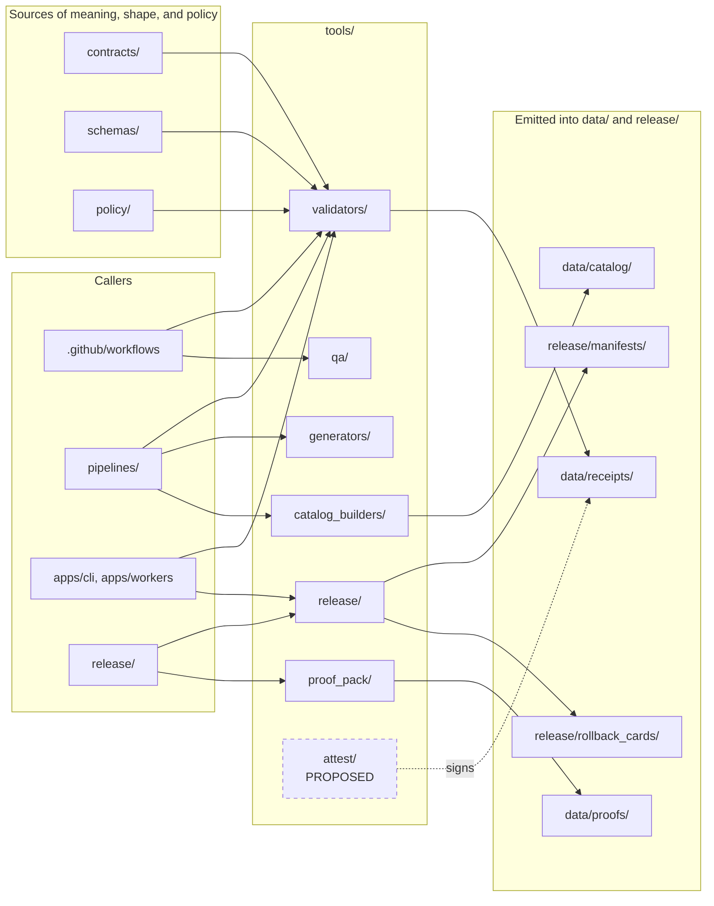
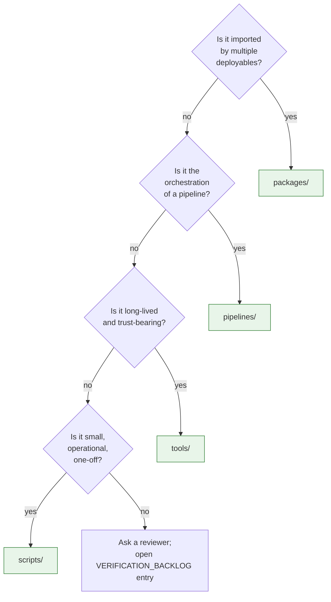

# tools

> Repo-wide validators, generators, builders, and trust-tooling for the Kansas Frontier Matrix monorepo.
> Where long-lived, trust-bearing logic lives once it has graduated from `scripts/`.

[](../docs/doctrine/directory-rules.md)
[](../docs/registers/VERIFICATION_BACKLOG.md)
[](../docs/doctrine/directory-rules.md)
[](../docs/adr/ADR-0001-schema-home.md)
[](#validation)
[](#last-reviewed)

| Field | Value |
|---|---|
| **Root** | `tools/` |
| **Authority level** | Canonical |
| **Status (of this root's repo presence)** | PROPOSED — NEEDS VERIFICATION against mounted-repo evidence |
| **Status (of these placement rules)** | CONFIRMED — derive from Directory Rules §4, §5, §7.5 |
| **Owner** | Tooling / QA owner *(placeholder — TODO confirm CODEOWNERS)* |
| **Reviewers required** | Tooling owner + at least one subsystem owner (per Directory Rules §15) |
| **Schema-home convention** | `schemas/contracts/v1/...` per ADR-0001 |
| **Lifecycle invariant** | RAW → WORK / QUARANTINE → PROCESSED → CATALOG / TRIPLET → PUBLISHED |

> [!IMPORTANT]
> Directory Rules §0 marks **every specific path quoted from Directory Rules as PROPOSED until verified against mounted-repo evidence.** This README inherits that label. Treat the tree in [§ Directory tree](#directory-tree-proposed) as the canonical *shape*, not as a claim that those files currently exist on disk.

---

### Quick jump

- [Purpose](#purpose) · [Authority level](#authority-level) · [Status](#status)
- [What belongs here](#what-belongs-here) · [What does NOT belong here](#what-does-not-belong-here)
- [Directory tree (PROPOSED)](#directory-tree-proposed) · [Map of responsibility](#map-of-responsibility)
- [Inputs](#inputs) · [Outputs](#outputs) · [Validation](#validation)
- [Subfolders and what each owns](#subfolders-and-what-each-owns)
- [`tools/` vs `scripts/` vs `packages/` vs `pipelines/`](#tools-vs-scripts-vs-packages-vs-pipelines)
- [Validator exit-code contract](#validator-exit-code-contract)
- [Negative-state rule](#negative-state-rule)
- [Review burden](#review-burden) · [Related folders](#related-folders) · [ADRs](#adrs)
- [FAQ](#faq) · [Appendix](#appendix) · [Last reviewed](#last-reviewed)

---

## Purpose

`tools/` owns the **repo-wide validators, generators, builders, and trust-tooling** the rest of the monorepo invokes from CI, from pipelines, and from operator workflows. It is the home for long-lived, trust-bearing logic that gates promotion, proves admissibility, builds catalog and release artifacts, and produces the receipts those decisions are checked against. (CONFIRMED — Directory Rules §4 placement protocol; §7.5 sub-tree.)

`tools/` does **not** decide policy meaning, contract meaning, schema shape, or release authority. Those live in `policy/`, `contracts/`, `schemas/`, and `release/` respectively. `tools/` is the executable surface that enforces what those roots declare.

> [!NOTE]
> The four-way split — `contracts/` defines meaning, `schemas/` defines shape, `policy/` decides admissibility, `tests/` proves enforceability — is preserved in `tools/` by treating each validator as the executable form of a contract+schema+policy triple, not as the place where any of those three live.

## Authority level

**Canonical.** `tools/` is one of the responsibility roots required by Directory Rules §3 (Deeper Rule, item 2: *"Contains deployable systems or shared implementation packages"*) and is listed as Canonical in Directory Rules §5. Per Directory Rules §2.4, removing, renaming, or splitting this root requires an ADR.

## Status

| Aspect | Label | Notes |
|---|---|---|
| Placement doctrine for `tools/` | **CONFIRMED** | Directory Rules §4 Step 1, §5, §7.5 |
| Specific sub-paths in this README | **PROPOSED** | Until verified against mounted repo evidence (Directory Rules §0) |
| Validator exit-code contract | **PROPOSED** (idea ML-U-105 "EXPANDED") | Not claimed as implemented |
| Promotion-gate validators home | **PROPOSED-to-create** | Build manual: `tools/validators/promotion_gate/` |
| Attestation tooling home | **PROPOSED-to-create** | Build manual: `tools/attest/` |
| CI render-summary tool | **PROPOSED** | `tools/ci/render_ui_validation_summary.py` |
| Current repo presence of any file under `tools/` | **UNKNOWN** | Repo not mounted in this session |

## What belongs here

`tools/` accepts files whose **primary responsibility** is repo-wide, executable, trust-bearing tooling. Per Directory Rules §4 Step 1, that means:

- **Validators** — `tools/validators/...` — programs that check whether an object (descriptor, manifest, fixture, receipt, payload) satisfies its contract+schema+policy triple. Connector-gate, promotion-gate, evidence-bundle, source-descriptor, and domain-scoped validators all live here. *(CONFIRMED structure — Directory Rules §7.5)*
- **Generators** — `tools/generators/...` — deterministic emitters: ID generators, source-descriptor scaffolders, fixture builders, schema-driven code or contract scaffolding. *(CONFIRMED structure — §7.5)*
- **Catalog builders** — `tools/catalog_builders/...` — programs that compose `data/catalog/` records from validated `data/processed/` outputs. *(CONFIRMED structure — §7.5)*
- **Proof-pack tooling** — `tools/proof_pack/...` — composes the bundle of evidence, receipts, manifests, and signatures that a release or promotion decision depends on. *(CONFIRMED structure — §7.5)*
- **Release tooling** — `tools/release/...` — release dry-runs, manifest validators, rollback-card builders, correction-notice helpers. *(CONFIRMED structure — §7.5)*
- **QA tooling** — `tools/qa/...` — coverage analyzers, link checkers, drift scans, CI reviewer-summary renderers. *(CONFIRMED structure — §7.5)*
- **Attestation helpers** *(PROPOSED-to-create)* — `tools/attest/...` — signing, attestation packaging, and verification helpers. *(PROPOSED — Unified Build Manual decision area "Attestation: Place signing helpers under `tools/attest/`")*
- **Cross-cutting domain validators** — `tools/validators/<topic>/...` (not `tools/validators/domains/<picked-one>/...`) per Directory Rules §12 cross-cutting placement.

> [!TIP]
> A validator legitimately scoped to a single domain belongs under `tools/validators/domains/<domain>/`. A validator that spans domains (e.g., a habitat × fauna × hydrology check) lives under `tools/validators/<topic>/` without a domain segment.

### Directory tree (PROPOSED)

The shape below is **CONFIRMED doctrine** from Directory Rules §7.5. Specific file presence is **PROPOSED until verified against mounted-repo evidence**.

```text
tools/
├── README.md                              # this file
├── validators/
│   ├── connector_gate/                    # CONFIRMED structure
│   ├── promotion_gate/                    # CONFIRMED structure; PROPOSED-to-create per Unified Build Manual
│   ├── evidence_bundle/                   # CONFIRMED structure
│   ├── source_descriptor/                 # CONFIRMED structure
│   ├── ui/                                # PROPOSED — UI fixture/payload validators (Whole-UI report)
│   ├── focus/                             # PROPOSED — Focus response + citation report validators
│   ├── layers/                            # PROPOSED — Layer descriptor / manifest linkage validators
│   ├── story/                             # PROPOSED — Story manifest / drawer continuity validators
│   ├── geo_manifest/                      # PROPOSED — PMTiles / COG manifest digest validators
│   └── domains/                           # CONFIRMED structure
│       ├── hydrology/   soil/   fauna/   flora/   habitat/
│       ├── geology/     atmosphere/   roads-rail-trade/
│       ├── settlements-infrastructure/   archaeology/
│       └── hazards/     agriculture/    people-dna-land/
├── generators/                            # CONFIRMED structure
├── catalog_builders/                      # CONFIRMED structure
├── proof_pack/                            # CONFIRMED structure
├── release/                               # CONFIRMED structure
├── qa/                                    # CONFIRMED structure
├── attest/                                # PROPOSED-to-create (Unified Build Manual)
└── ci/                                    # PROPOSED — CI helpers (e.g., render_ui_validation_summary.py)
```

[Back to top](#tools)

### Map of responsibility


```mermaid
flowchart LR
    subgraph contracts_schemas_policy["Sources of meaning, shape, and policy"]
        C[contracts/]
        S[schemas/]
        P[policy/]
    end

    subgraph tools_root["tools/"]
        TV[validators/]
        TG[generators/]
        TC[catalog_builders/]
        TPP[proof_pack/]
        TR[release/]
        TQ[qa/]
        TA[attest/<br/>PROPOSED]
    end

    subgraph callers["Callers"]
        CI[".github/workflows"]
        PIPE[pipelines/]
        APP[apps/cli, apps/workers]
        REL[release/]
    end

    subgraph proofs["Emitted into data/ and release/"]
        DR[data/receipts/]
        DP[data/proofs/]
        DC[data/catalog/]
        RM[release/manifests/]
        RB[release/rollback_cards/]
    end

    C --> TV
    S --> TV
    P --> TV

    CI --> TV
    CI --> TQ
    PIPE --> TV
    PIPE --> TG
    PIPE --> TC
    APP --> TV
    APP --> TR
    REL --> TR
    REL --> TPP

    TV --> DR
    TC --> DC
    TPP --> DP
    TR --> RM
    TR --> RB
    TA -. signs .-> DR

    classDef proposed stroke-dasharray: 5 5;
    class TA proposed;
```

> [!NOTE]
> The dashed node `tools/attest/` is **PROPOSED-to-create** per the Unified Implementation Architecture Build Manual; it is not claimed as present in the current repo.

[Back to top](#tools)

## What does NOT belong here

The "do not put X here" list is as important as the "do put Y here" list (Directory Rules §15).

| Don't put in `tools/` | Belongs in | Why |
|---|---|---|
| A library imported by multiple deployables | `packages/` | `tools/` is invocation-shaped; reusable libraries are not. (CONFIRMED — Directory Rules §7.2: *"If it runs once as a workflow step, it belongs in `tools/` or `pipelines/`."*) |
| A small operational helper, one-off, dev convenience | `scripts/` | `scripts/{dev,maintenance,one_off}/` is the holding pen. (CONFIRMED — §7.5) |
| Executable pipeline orchestration logic | `pipelines/` | `pipelines/` is *how* a flow runs; `tools/` is the callable steps and validators it composes. (CONFIRMED — §7.4) |
| Declarative pipeline configuration | `pipeline_specs/` | `pipeline_specs/` is *what* should run. (CONFIRMED — §7.4) |
| Source-specific fetch/admission code | `connectors/<source>/` | Connectors output to `data/raw/` or `data/quarantine/`. (CONFIRMED — §7.3) |
| The schemas, contracts, or policy bundles the validators check | `schemas/`, `contracts/`, `policy/` | `tools/` is the executable surface, not the source of meaning. (CONFIRMED — §6) |
| Test files | `tests/` | A validator under `tools/` is called *by* tests; it is not a test. (CONFIRMED — Directory Rules §13 anti-pattern: *"A validator lives only in a test file, not in `tools/validators/` → Extract validator to `tools/`; tests call into it."*) |
| Fixtures (golden, valid, invalid) | `fixtures/` or `tests/fixtures/` | Per Directory Rules §13.4 anti-pattern: fixture sprawl is drift. |
| Generated build outputs, distributables | `artifacts/build/` | `artifacts/` is build/docs/qa/temporary only. (CONFIRMED — §8.2) |
| Receipts, proofs, evidence bundles, release manifests | `data/receipts/`, `data/proofs/`, `release/` | Trust content does not live in `tools/` or `artifacts/`. (CONFIRMED — §8.2) |
| Real secrets, credentials, signing keys | not in repo | `configs/` holds non-secret templates only. (CONFIRMED — §5) |
| A folder named for a single domain at root level | `tools/validators/domains/<domain>/` | Domains are lanes, not roots. (CONFIRMED — §3, §12) |

> [!WARNING]
> **Most common drift into `tools/`:** validators authored inline in test files. Directory Rules §13 names this anti-pattern explicitly ("Test-only validator"). Tests must *call* validators that live in `tools/`. They must not *be* the validator.

[Back to top](#tools)

## Inputs

`tools/` programs consume:

- **Object instances under inspection** — source descriptors, ingest receipts, evidence bundles, layer manifests, geo-manifests, run receipts, promotion decisions, release manifests, fixture payloads, drawer payloads. *(CONFIRMED families — Master MapLibre and Whole-UI reports; specific schema homes under `schemas/contracts/v1/...` per ADR-0001.)*
- **Authoritative definitions** — `contracts/` (meaning), `schemas/contracts/v1/...` (shape), `policy/` (admissibility). Validators MUST read from these; they MUST NOT inline divergent copies.
- **Fixtures** — golden, valid, and invalid samples from `fixtures/` or `tests/fixtures/`.
- **Lifecycle objects emitted by pipelines** — material under `data/raw/`, `data/work/`, `data/quarantine/`, `data/processed/`, `data/catalog/`. Validators read these to decide promotion eligibility; they do not write them.
- **Configuration** — non-secret templates and defaults from `configs/`.

## Outputs

`tools/` programs emit:

- **Validation results** — pass / fail with structured reasons; per the negative-state rule, ABSTAIN, DENY, and ERROR outcomes are first-class.
- **Receipts** — written into `data/receipts/`. Validators are watchers, not publishers (Directory Rules §13 anti-pattern *"Watcher publishes"*): they emit receipts and candidate decisions only. They do not mutate canonical truth.
- **Proof bundles** — written into `data/proofs/` by `tools/proof_pack/`.
- **Catalog records** — proposed catalog entries written into `data/catalog/` by `tools/catalog_builders/`; final catalog publication is a governed transition handled by `pipelines/catalog/` and `release/`.
- **Release artifacts** — release manifests under `release/manifests/`, rollback cards under `release/rollback_cards/`, correction notices under `release/correction_notices/`. *(CONFIRMED homes — Directory Rules §19 glossary.)*
- **CI reviewer summaries** — rendered into `artifacts/qa/` or attached to PRs; per the Whole-UI report, `tools/ci/render_ui_validation_summary.py` is the proposed name for the UI variant.
- **Attestation bundles** *(PROPOSED)* — signature, certificate, transparency proof, offline verification bundle, written into `data/receipts/` or `data/proofs/` per the relevant family.

[Back to top](#tools)

## Validation

`tools/` is itself validated. The CI lanes that exercise it are listed in the Unified Build Manual §25 ("CI/CD and delivery") and reproduced here.

| CI lane | What it proves | Status |
|---|---|---|
| Path and drift scan | `tools/` files obey Directory Rules and ADR discipline | PROPOSED |
| Schema and fixture suite | Validators read canonical schemas, not inlined copies; positive and negative fixtures all behave as expected | PROPOSED |
| Validator suite | Each validator has unit tests and fixture tests under `tests/` that call into `tools/validators/...` | PROPOSED |
| Policy suite | Validators enforce deny-by-default and report finite reason codes | PROPOSED |
| Promotion dry-run | `tools/release/` and `tools/proof_pack/` produce auditable gate outputs without publication | PROPOSED |
| Signing / integrity | If `tools/attest/` is present, RunReceipt, `spec_hash`, digest, and Merkle patterns are verified | PROPOSED / NEEDS VERIFICATION |
| Catalog closure | `tools/catalog_builders/` emits PROV / STAC / DCAT-style closure that validates against schema | PROPOSED |

> [!IMPORTANT]
> CI for `tools/` MUST be **no-network by default**. Live connector tests, external endpoint checks, package-version checks, and runtime smoke tests are separate, opt-in, source-activated jobs until rights, rate limits, secrets, and terms are verified. *(CONFIRMED doctrine — Unified Build Manual §25.)*

### Validator exit-code contract

A validator's exit code is part of its public contract; CI workflows and pipelines rely on it. The doctrine carried forward by idea **ML-U-105** ("Validator exit code contract" — EXPANDED) treats this as a required, stable shape. The table below is a **PROPOSED** normalization that callers can rely on; the actual exit-code mapping is a per-validator decision until an ADR fixes it.

| Exit | Finite outcome | Meaning | Caller behavior |
|---:|---|---|---|
| `0` | **ANSWER** | Object satisfies contract + schema + policy | Promote / continue |
| `2` | **ABSTAIN** | Required evidence missing, unresolved EvidenceRef, stale source | Hold at prior state; emit receipt; do not publish |
| `3` | **DENY** | Policy decision: rights, sensitivity, role collapse, or release-gate violation | Hold; record `PolicyDecision`; do not retry without remediation |
| `4` | **ERROR** | Schema mismatch, contract drift, malformed input | Fail closed; quarantine the input; open verification backlog entry |
| `64+` | reserved | Tool-internal failures (config error, missing dependency) | CI re-run only after fix; never silently promote |

> [!CAUTION]
> Exit `0` MUST mean *the validator ran and the object passed*. Exit `0` MUST NOT mean *the validator skipped* or *no fixtures were found*. A no-op pass is the canonical shape of policy theatre.

### Negative-state rule

Every validator under `tools/` **must** exercise its negative states, not only its positive ones. *(CONFIRMED doctrine — Unified Build Manual §17: "Validators must test DENY, ABSTAIN, ERROR, quarantine, stale, restricted, and review-needed paths, not only successful publication.")*

For each validator family, the minimum negative fixtures are:

- **Stale source** — source headers indicate stale state; validator returns ABSTAIN or DENY (per policy) and emits the stale badge.
- **Sensitive geometry** — exact restricted geometry attempts public publication; validator returns DENY before tile build or public release.
- **Missing evidence** — referenced EvidenceRef does not resolve to an EvidenceBundle; validator returns ABSTAIN.
- **Schema mismatch / contract drift** — payload fails JSON-Schema check or violates contract; validator returns ERROR and quarantines the input.
- **Role collapse / role-downcast** — a derivative source attempts to claim authoritative role; validator returns DENY.
- **Review insufficient** — release candidate lacks `ReviewRecord` where required; validator returns ABSTAIN.

[Back to top](#tools)

## Subfolders and what each owns

| Subfolder | Responsibility | Status of structure | Typical callers |
|---|---|---|---|
| `validators/connector_gate/` | Admissibility checks for connector output before it lands in `data/raw/` | CONFIRMED structure (§7.5) | `connectors/`, `pipelines/ingest/`, CI |
| `validators/promotion_gate/` | Gate checks for `RAW → WORK → PROCESSED → CATALOG → PUBLISHED` transitions | CONFIRMED structure (§7.5); PROPOSED-to-create | `pipelines/validate/`, `release/`, CI |
| `validators/evidence_bundle/` | Resolution and integrity of `EvidenceRef` → `EvidenceBundle` | CONFIRMED structure (§7.5) | `apps/governed-api/`, `pipelines/catalog/`, CI |
| `validators/source_descriptor/` | Source identity, rights, sensitivity, cadence, authority role | CONFIRMED structure (§7.5) | `connectors/`, `pipelines/ingest/`, `data/registry/` |
| `validators/domains/<domain>/` | Domain-scoped invariants (e.g., hydrology topology, fauna sensitivity tiers) | CONFIRMED structure (§7.5) | Domain pipelines, CI |
| `validators/ui/`, `focus/`, `layers/`, `story/`, `geo_manifest/` | UI/AI payload and manifest validators | PROPOSED — Whole-UI report Appendix B | `apps/explorer-web/` CI, `pipelines/publish/` |
| `generators/` | Deterministic emitters: IDs, scaffolds, source-descriptor templates | CONFIRMED structure (§7.5) | Authoring workflows, `pipelines/ingest/` |
| `catalog_builders/` | Compose `data/catalog/` records from validated `data/processed/` | CONFIRMED structure (§7.5) | `pipelines/catalog/`, CI |
| `proof_pack/` | Assemble proof bundles for promotion and release | CONFIRMED structure (§7.5) | `release/`, CI |
| `release/` | Release dry-runs, manifest validators, rollback-card builders | CONFIRMED structure (§7.5) | `apps/cli/`, `release/`, CI |
| `qa/` | Coverage analyzers, link checkers, drift scans | CONFIRMED structure (§7.5) | CI |
| `attest/` | Signing helpers, attestation packaging, offline verification bundles | PROPOSED-to-create (Unified Build Manual) | `release/`, CI |
| `ci/` | CI-only helpers (e.g., `render_ui_validation_summary.py`) | PROPOSED | `.github/workflows/...` |

[Back to top](#tools)

## `tools/` vs `scripts/` vs `packages/` vs `pipelines/`

These four roots are easy to confuse. The split is consequential.


```mermaid
flowchart TD
    Q1{Is it imported<br/>by multiple<br/>deployables?}
    Q2{Is it the<br/>orchestration<br/>of a pipeline?}
    Q3{Is it long-lived<br/>and trust-bearing?}
    Q4{Is it small,<br/>operational,<br/>one-off?}

    Q1 -- yes --> P[packages/]
    Q1 -- no --> Q2
    Q2 -- yes --> PIPE[pipelines/]
    Q2 -- no --> Q3
    Q3 -- yes --> T[tools/]
    Q3 -- no --> Q4
    Q4 -- yes --> S[scripts/]
    Q4 -- no --> ASK[Ask a reviewer;<br/>open VERIFICATION_BACKLOG entry]

    classDef root fill:#E8F5E9,stroke:#2E7D32;
    class P,PIPE,T,S root;
```

| Root | What it owns | Reusable as a library? | Trust-bearing? | Lives forever? |
|---|---|---|---|---|
| `packages/` | Shared libraries imported by deployables | **Yes** | Depends | Yes |
| `pipelines/` | Executable pipeline orchestration | No | Yes (it composes trust-bearing steps) | Yes |
| **`tools/`** | **Repo-wide validators, generators, builders, checkers** | **No** (they are invoked, not imported) | **Yes** | **Yes** |
| `scripts/` | Small operational helpers, one-offs, dev conveniences | No | No (if it became trust-bearing, it must graduate) | No (especially `scripts/one_off/`) |

> [!IMPORTANT]
> **Graduation rule (CONFIRMED — Directory Rules §7.5):** *"Long-lived, trust-bearing scripts MUST graduate to `tools/`, `pipelines/`, or `packages/`. `scripts/one_off/` is a holding pen, not a permanent home."*
>
> When a script becomes load-bearing for CI, promotion, release, or evidence — move it. A graduation PR should: (1) move with `git mv`; (2) add unit tests and fixture tests under `tests/`; (3) declare the exit-code contract; (4) add positive and negative fixtures; (5) add itself to the relevant CI lane; (6) update this README's subfolder table if needed.

[Back to top](#tools)

## Review burden

Per Directory Rules §15, every change to a canonical root's contents requires reviewers proportionate to the change.

| Change | Reviewers |
|---|---|
| New validator family at the `tools/<family>/` level | Tooling owner **+** at least one subsystem owner **+** ADR if it crosses an authority boundary (§2.4) |
| New validator inside an existing family | Tooling owner **+** the family's owning subsystem |
| Change to validator exit-code contract | Tooling owner **+** Docs steward **+** ADR (changes a public contract) |
| Change to a generator that emits identity (IDs, `spec_hash`) | Tooling owner **+** schema owner **+** ADR if identity semantics change |
| Move from `scripts/` to `tools/` (graduation) | Tooling owner **+** script's original author **+** CI lane owner |
| Documentation-only edits to this README | Docs steward |

> [!NOTE]
> If `CODEOWNERS` declares specific owners for `tools/` or its subpaths, that file governs. The roles above are the doctrinal baseline; per-path `CODEOWNERS` entries refine but do not contradict it.

## Related folders

- [`../docs/doctrine/directory-rules.md`](../docs/doctrine/directory-rules.md) — Directory Rules; §4 placement protocol, §7.5 `tools/` tree, §13 anti-patterns, §15 README contract *(PROPOSED canonical path)*
- [`../contracts/`](../contracts/) — Object-family meaning the validators check against
- [`../schemas/`](../schemas/) — Machine-checkable shapes (`schemas/contracts/v1/...`, per ADR-0001)
- [`../policy/`](../policy/) — Admissibility and release policy the validators enforce
- [`../tests/`](../tests/) — Tests that call into `tools/validators/...` (not where validators live)
- [`../fixtures/`](../fixtures/) — Golden, valid, invalid samples consumed by validators
- [`../scripts/`](../scripts/) — Small operational helpers; graduation target into `tools/`
- [`../pipelines/`](../pipelines/) — Executable pipeline logic that composes `tools/` steps
- [`../packages/`](../packages/) — Shared libraries; if a tool is imported by multiple deployables, move it here
- [`../release/`](../release/) — Release decisions, manifests, rollback cards, correction notices
- [`../data/receipts/`](../data/receipts/) — Where validator-emitted receipts land
- [`../data/proofs/`](../data/proofs/) — Where `tools/proof_pack/` writes evidence bundles
- [`../.github/workflows/`](../.github/workflows/) — CI lanes that invoke `tools/` *(PROPOSED — `ui-governed.yml`, `contracts-ui-ai.yml`)*

> [!NOTE]
> All paths above are PROPOSED; they encode Directory Rules doctrine and have not been verified against mounted-repo evidence in this session.

## ADRs

- **ADR-0001 — Schema home** *(referenced in Directory Rules §0 and §7.4)*: machine-schema default home is `schemas/contracts/v1/...`. Validators MUST read from there, not from divergent copies in `contracts/` or `jsonschema/`.
- **ADR — Validator exit-code contract** *(PROPOSED — not yet authored; needed to freeze the table in [§ Validator exit-code contract](#validator-exit-code-contract))*.
- **ADR — Attestation home** *(PROPOSED — needed before `tools/attest/` is created; the Unified Build Manual flags it as `PROPOSED-to-create`)*.
- **ADR — Triplets vs triplet** *(referenced in Directory Rules §18 as an OPEN question)*: relevant to `tools/catalog_builders/` output naming.

> [!NOTE]
> The list above is doctrinal scope. Whether each ADR exists in the live repo is **NEEDS VERIFICATION**.

[Back to top](#tools)

## FAQ

<details>
<summary><strong>"This logic is used by both a pipeline and a CI workflow. Does it go in `tools/`, `packages/`, or `pipelines/`?"</strong></summary>

If it is **invoked** by both — i.e., they shell out to it or call a CLI — it is a `tools/` candidate.
If it is **imported** as a library by code in both — it is a `packages/` candidate.
If it is the **orchestration** that runs the steps in order — it is a `pipelines/` candidate.

When in doubt, prefer `tools/` for trust-bearing logic and add a thin wrapper in `pipelines/` that invokes it.

</details>

<details>
<summary><strong>"My validator is one Python function. Does it really belong in `tools/`?"</strong></summary>

Yes, if it is trust-bearing. Per Directory Rules §13's "Test-only validator" anti-pattern, the size of the validator is not what matters; its role does. If it gates a transition, decides admissibility, or produces a receipt that other systems trust, it lives under `tools/validators/` and the tests call into it.

</details>

<details>
<summary><strong>"Can `tools/` write to `data/published/` or `data/catalog/`?"</strong></summary>

`tools/catalog_builders/` may *propose* records into `data/catalog/`, but final publication is a **governed state transition**, not a file move. It runs through `pipelines/catalog/` and `release/`. Validators and proof-pack tools write **only** to `data/receipts/` and `data/proofs/` (and `release/manifests/` / `release/rollback_cards/` via `tools/release/`). They never write to `data/published/`. This is the watcher-as-non-publisher invariant (Directory Rules §13 anti-pattern, §19 glossary).

</details>

<details>
<summary><strong>"My script under `scripts/one_off/` keeps getting called by CI. What do I do?"</strong></summary>

Graduate it. `scripts/one_off/` is a holding pen, not a permanent home (Directory Rules §7.5). The graduation PR shape is described above under [Review burden](#review-burden).

</details>

<details>
<summary><strong>"There's a validator inside a test file. Why is that bad?"</strong></summary>

Two reasons. First, it can only be called from that test — so other tests, CI lanes, and pipelines reimplement it, and the implementations drift. Second, it is no longer auditable as a tool; reviewers cannot tell from path alone what governs it. Extract it to `tools/validators/<family>/`; the test calls into it. *(CONFIRMED — Directory Rules §13.)*

</details>

<details>
<summary><strong>"Does `tools/` ever talk to the network?"</strong></summary>

By default, **no**. CI lanes that invoke `tools/` are no-network by default (Unified Build Manual §25). Tools that legitimately need network — license-server checks, transparency-log lookups, online attestation verification — must declare it, be opt-in, and run in a separate CI lane with rate-limit, secret, and terms verification.

</details>

[Back to top](#tools)

## Appendix

<details>
<summary><strong>Glossary (placement-relevant subset)</strong></summary>

| Term | Short definition relevant to `tools/` |
|---|---|
| **Validator** | Executable that checks an object against contract + schema + policy and returns a finite outcome with reasons. |
| **Generator** | Deterministic emitter of new artifacts (IDs, scaffolds, fixture skeletons). |
| **Catalog builder** | Composes proposed `data/catalog/` records from validated `data/processed/` outputs. |
| **Proof pack** | The bundle of evidence, receipts, manifests, and signatures a release or promotion depends on. |
| **Attestation bundle** | Certificate, signature, and transparency proof supporting offline verification. *(PROPOSED home: `tools/attest/`.)* |
| **EvidenceBundle / EvidenceRef** | Resolved support package; lives in `data/proofs/`. Resolution helper lives in `packages/evidence-resolver/`, not in `tools/`. |
| **Finite outcome** | ANSWER, ABSTAIN, DENY, ERROR. Validator exit codes map to these. |
| **Watcher-as-non-publisher** | Workers and validators emit receipts and candidate decisions only — they never publish or mutate canonical truth. |

</details>

<details>
<summary><strong>Anti-pattern quick reference for `tools/`</strong></summary>

| Anti-pattern | Symptom | Fix |
|---|---|---|
| Test-only validator | Validator code lives inside a test file | Extract to `tools/validators/<family>/`; tests call into it |
| Inline schema copy | Validator inlines a schema instead of reading from `schemas/contracts/v1/...` | Read canonical schemas; never inline |
| Test passes when validator is skipped | Exit `0` on missing fixtures | Treat missing fixtures as ERROR, not pass |
| Tool publishes | A tool writes to `data/published/` or mutates `data/catalog/` directly | Tools emit receipts and candidates; pipelines + release publish |
| Convenience layer in `tools/` | A folder named `tools/misc/`, `tools/shared/`, `tools/util/` | Each file moves to its responsibility-scoped subfolder; convenience folder removed |
| Long-lived script in `scripts/one_off/` | CI keeps invoking a "one-off" | Graduate to `tools/` |
| Domain folder at `tools/` root | `tools/hydrology/` instead of `tools/validators/domains/hydrology/` | Move under the proper family + domains segment |

</details>

<details>
<summary><strong>External standards `tools/` typically validates against</strong></summary>

The standards below are referenced doctrinally by KFM and are the surfaces `tools/` validators frequently encode checks against. Authoritative external definitions live with their issuing bodies; KFM-specific interpretations live in `docs/standards/`.

- JSON Schema (`schemas/contracts/v1/...` `.schema.json` files)
- STAC, DCAT, PROV (catalog and provenance closure — `tools/catalog_builders/`)
- RFC 8785 (JSON Canonicalization Scheme) — for `spec_hash` of receipts (Pass 10, C1-02)
- SPDX rights identifiers — license allowlist enforcement
- W3C PROV — lineage and provenance modeling
- OGC tile and feature service specs — `tools/validators/geo_manifest/` *(PROPOSED)*

</details>

[Back to top](#tools)

## Last reviewed

| Field | Value |
|---|---|
| Last reviewed | **TODO** — set on first PR landing this README |
| Review cadence | At least every 6 months (Directory Rules §15) |
| Owner of next review | Tooling / QA owner |

---

### Related docs

- [`../docs/doctrine/directory-rules.md`](../docs/doctrine/directory-rules.md) *(PROPOSED canonical path)*
- [`../docs/adr/ADR-0001-schema-home.md`](../docs/adr/ADR-0001-schema-home.md) *(referenced)*
- [`../docs/registers/DRIFT_REGISTER.md`](../docs/registers/DRIFT_REGISTER.md) *(PROPOSED)*
- [`../docs/registers/VERIFICATION_BACKLOG.md`](../docs/registers/VERIFICATION_BACKLOG.md) *(PROPOSED)*
- [`../scripts/README.md`](../scripts/README.md) — counterpart README; describes graduation path *into* `tools/`
- [`../tests/README.md`](../tests/README.md) — describes how tests call `tools/validators/...`

**Last updated:** TODO — set on first PR landing this README · **Version:** v1 (draft) · [Back to top](#tools)
