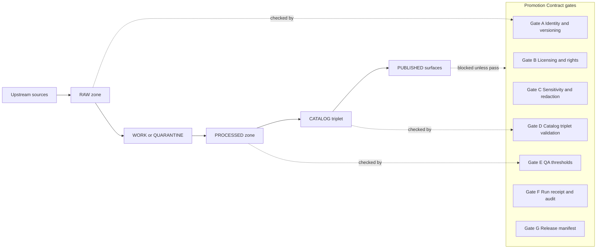

<!-- [KFM_META_BLOCK_V2]
doc_id: kfm://doc/8d2fb4f2-0f5f-4b7f-bb8d-acde0d0be6f7
title: tools — Validators, link checkers, and CLI utilities
type: standard
version: v2
status: draft
owners: TBD
created: 2026-03-03
updated: 2026-03-03
policy_label: public
related:
  - tools/validators/
tags: [kfm, tools, validation, governance]
notes:
  - Status tags are used on all non-trivial statements: CONFIRMED, PROPOSED, UNKNOWN.
  - Tools are deterministic, testable, and safe-by-default; prefer machine-readable outputs for CI.
[/KFM_META_BLOCK_V2] -->

<div align="center">

# 🧰 `tools/` — validators, link checkers, and CLI utilities

**Purpose:** Evidence-first tooling that enforces KFM’s **Promotion Contract** by validating catalogs, links, and integrity signals before anything is **publishable**.

<!-- Badges (placeholders — replace TODOs with real workflow names/paths) -->


</div>

> **Status:** draft  
> **Owners:** TBD  
> **Policy label:** public  
> **Primary posture:** **fail-closed**, **default-deny**, **deterministic outputs**  
> **Repo invariant reminder:** UI/clients do not talk to storage directly; policy is enforced at the PEP/API boundary.

<div align="center">

[Scope](#scope) ·
[Where it fits](#where-it-fits) ·
[Inputs](#inputs) ·
[Exclusions](#exclusions) ·
[Directory tree](#directory-tree) ·
[Quickstart](#quickstart) ·
[Tool behavior contract](#tool-behavior-contract) ·
[Tool registry](#tool-registry) ·
[Promotion Contract mapping](#promotion-contract-mapping) ·
[Adding a tool](#adding-a-tool) ·
[Safety and sensitivity](#safety-and-sensitivity) ·
[Unknowns and verification](#unknowns-and-verification) ·
[FAQ](#faq)

</div>

---

## Status tags used in this README

<details>
<summary>Click to expand</summary>

- **CONFIRMED:** Backed by KFM design/inventory documents; treated as intended contract.
- **PROPOSED:** Recommended pattern or target structure; may not exist yet.
- **UNKNOWN:** Not verified in your current checkout; includes the smallest steps to verify.

</details>

---

## Scope

- **CONFIRMED:** `tools/` is the home for **validators, link checkers, and CLI utilities** used in CI and local workflows.
- **CONFIRMED:** These tools exist to turn governance intent into **enforceable, automatable gates** (invalid metadata/links must block promotion).
- **CONFIRMED:** KFM governance is anchored on a **truth path** (RAW → WORK/QUARANTINE → PROCESSED → CATALOG/TRIPLET → PUBLISHED) with blocking gates at promotion boundaries.

[Back to top](#)

---

## Where it fits

- **CONFIRMED:** KFM uses a **trust membrane**: clients never access storage directly; all access is policy-evaluated at the PEP/API boundary.
- **CONFIRMED:** The **Promotion Contract** defines “minimum gates” that must pass before any dataset version is served in PUBLISHED surfaces; `tools/` is the executable layer that performs (and reports) those checks.
- **PROPOSED:** Treat `tools/` as the repo’s **governance runtime**: anything that can be expressed as a deterministic check should live here (and be wired into required CI checks).


```mermaid
flowchart LR
  Upstream[Upstream sources] --> RAW[RAW zone]
  RAW --> WORK[WORK or QUARANTINE]
  WORK --> PROCESSED[PROCESSED zone]
  PROCESSED --> CATALOG[CATALOG triplet]
  CATALOG --> PUBLISHED[PUBLISHED surfaces]

  subgraph Gates[Promotion Contract gates]
    A[Gate A Identity and versioning]
    B[Gate B Licensing and rights]
    C[Gate C Sensitivity and redaction]
    D[Gate D Catalog triplet validation]
    E[Gate E QA thresholds]
    F[Gate F Run receipt and audit]
    G[Gate G Release manifest]
  end

  RAW -. checked by .-> A
  PROCESSED -. checked by .-> E
  CATALOG -. checked by .-> D
  PUBLISHED -. blocked unless pass .-> Gates
```

[Back to top](#)

---

## Inputs

### Acceptable inputs

- **CONFIRMED:** Catalog artifacts and lineage bundles (DCAT, STAC, PROV) and the cross-links between them.
- **CONFIRMED:** Receipts/manifests that bind **inputs + transforms + outputs** via deterministic hashes.
- **PROPOSED:** Schema contracts and controlled vocabularies used by validators (JSON Schema, SHACL, OpenAPI, STAC/DCAT profiles).
- **PROPOSED:** Test fixtures for validators/linkcheckers (small, synthetic, and safe to publish).

### Outputs

- **CONFIRMED:** Machine-readable validation outputs suitable for CI gating (non-zero exit on failure).
- **PROPOSED:** JSON/JSONL reports (for artifact upload + downstream policy evaluation), plus optional human-readable summaries.

[Back to top](#)

---

## Exclusions

- **PROPOSED:** Long-running servers and UI code (belongs in `apps/` or service packages).
- **PROPOSED:** Pipeline “business logic” (belongs in `pipelines/` or domain packages; tools may *validate* pipeline outputs but should not *be* pipelines).
- **PROPOSED:** Secrets, API keys, or private data dumps (tools must run with least privilege).
- **PROPOSED:** One-off scripts without tests/fixtures or deterministic outputs.

[Back to top](#)

---

## Directory tree

- **UNKNOWN:** The authoritative `tools/` tree in *your current checkout*.
  - **Minimum verification steps (run and paste into PR/notes):**
    1. `git rev-parse HEAD`
    2. `tree -L 3 tools`
    3. `rg -n "validate_(dcat|stac|prov)|linkcheck|spec_hash|receipt" tools -S`

### Target layout (recommended)

- **PROPOSED:** This layout matches the Promotion Contract needs (validators + linkcheck + hashing/receipts) and keeps each tool small and reviewable.

```text
tools/
├── README.md                         # this file
├── validators/                       # DCAT/STAC/PROV schema validation
│   ├── dcat_validator/               # profile rules, fixtures, docs
│   ├── stac_validator/
│   ├── prov_validator/
│   └── validate_*.{js,ts,py}         # thin CLIs wrapping library logic
├── linkcheck/                        # referential integrity checks across catalogs/evidence
│   └── catalog_linkcheck/
├── hash/                             # spec_hash + digest helpers
│   └── spec_hash_cli.{ts,py}
├── supply-chain/                     # receipts/attest/verify helpers
│   ├── make_receipt.{py,ts}
│   ├── verify_receipt.{py,ts}
│   └── attest.{sh,py}
└── setup.sh                          # optional: install pinned toolchain (CI + dev)
```

[Back to top](#)

---

## Quickstart

- **UNKNOWN:** Exact CLI names/flags in your current checkout.
  - **Minimum verification steps:** run each tool with `--help` (or read its `README.md`) and update this section with exact invocations.

### Typical local runs (pattern)

```bash
# 1) Discover tools
ls -la tools
ls -la tools/validators || true
ls -la tools/linkcheck  || true

# 2) Run a validator in help mode (adjust to actual filenames)
node tools/validators/validate_dcat.js --help || true
node tools/validators/validate_stac.js --help || true

# 3) Validate catalogs (paths are examples)
node tools/validators/validate_dcat.js catalog/dcat/dataset.jsonld
node tools/validators/validate_stac.js catalog/stac/items/item.json
node tools/validators/validate_prov.js catalog/prov/run.prov.jsonld

# 4) Link-check the catalog triplet
node tools/linkcheck/catalog_linkcheck.js catalog/

# 5) Emit a JSON report for CI (recommended contract)
node tools/validators/validate_dcat.js catalog/dcat/dataset.jsonld --report artifacts/dcat.report.json
```

> **PROPOSED:** Prefer deterministic, “read-only” checks. If a tool can mutate files (format, fix, rewrite), put it behind an explicit `--write` flag and keep CI in non-mutating mode.

[Back to top](#)

---

## Tool behavior contract

### CLI contract (required for all tools)

- **PROPOSED:** Every tool **MUST**:
  - support `--help`,
  - return **exit code 0** on success and **non-zero** on failure,
  - avoid nondeterminism (stable sorting; pinned deps; no time-based IDs unless injected),
  - log in a CI-friendly way (single-line summaries + optional verbose mode),
  - support `--report <path>` (JSON/JSONL) when the tool is used as a hard gate.

- **PROPOSED:** Every tool **SHOULD**:
  - support `--version`,
  - support `--input <path>` and/or accept positional inputs,
  - support `--format json|text`,
  - run offline by default (see Network policy below).

### Report format (recommended)

- **PROPOSED:** Reports SHOULD be small, stable, and machine-checkable. Example schema:

```json
{
  "tool": "kfm.validate_dcat",
  "tool_version": "0.1.0",
  "ok": false,
  "checked": [
    {"path": "catalog/dcat/dataset.jsonld", "kind": "dcat.dataset"}
  ],
  "errors": [
    {"code": "missing_required_field", "path": "$.license", "message": "license is required"}
  ],
  "warnings": [],
  "timing_ms": 1234
}
```

### Network policy

- **PROPOSED:** Tools MUST be safe-by-default:
  - **no network I/O** unless `--network`/`--fetch` is explicitly passed,
  - if network is enabled, tools MUST log the endpoints accessed (without secrets),
  - tools MUST remain reproducible (pin versions; record validators such as ETag/Last-Modified when relevant).

[Back to top](#)

---

## Tool registry

> This table is intentionally conservative: it distinguishes between “referenced in design docs” and “verified in your checkout”.

| Status | Path (relative) | Tool | Primary job | CI blocking? | Network default |
|---|---|---|---|---:|---|
| **CONFIRMED** (referenced) | `validators/` | Catalog validators | Validate DCAT/STAC/PROV profiles | ✅ | off |
| **CONFIRMED** (referenced) | `linkcheck/` | Catalog link checker | Verify cross-links so EvidenceRefs resolve without guessing | ✅ | off |
| **CONFIRMED** (referenced) | `hash/` | `spec_hash` helper(s) | Deterministic spec hashing for identity/versioning | ✅ | off |
| **PROPOSED** | `supply-chain/` | Receipt/attest/verify helpers | Produce run receipts + verify digests/signatures | ✅ | off |
| **UNKNOWN** | `validators/validate_dcat.js` | DCAT CLI | Validate a DCAT dataset/distribution record | ✅ | off |
| **UNKNOWN** | `validators/validate_stac.js` | STAC CLI | Validate STAC Item/Collection/Catalog | ✅ | off |
| **UNKNOWN** | `validators/dcat_validator/README.md` | Validator contract doc | Define required fields + exit code behavior | ✅ | n/a |

**Why “UNKNOWN” rows exist:** KFM guidance explicitly warns against claiming a file exists until verified in the live repo tree; this README keeps the *contract* and lists minimal verification steps.

[Back to top](#)

---

## Promotion Contract mapping

- **CONFIRMED:** Promotion to PUBLISHED is blocked unless minimum gates (A–G) are met; these are intentionally framed for automation and steward review.
- **PROPOSED:** This matrix is the default “who covers what” mapping for `tools/`.

| Gate | What must be present | Tool types that cover it | Typical artifacts produced |
|---|---|---|---|
| A | dataset_id + version, deterministic spec_hash, content digests | `hash/`, digest checkers | `spec_hash.txt`, `digests.json` |
| B | license/rights fields + upstream terms snapshot | validators + policy checks | `rights_snapshot.*`, `license.report.json` |
| C | policy_label + redaction obligations where needed | policy tests + redaction verifiers | `redaction_receipt.json`, policy report |
| D | DCAT/STAC/PROV all validate and cross-link | `validators/` + `linkcheck/` | validator reports, link map |
| E | dataset QA checks + thresholds met | domain QA tools | `qa_report.json`, threshold receipts |
| F | run receipt capturing inputs/tools/hashes/policy decisions | receipt generators + schema validators | `run_receipt.json`, `prov.jsonld` |
| G | release manifest references artifacts + digests | release tooling | `release_manifest.json`, SBOM refs |

[Back to top](#)

---

## Adding a tool

### Definition of Done (minimum)

- **PROPOSED:** A new tool is not “real” until it is:
  - documented (README with inputs/outputs + exit codes),
  - tested (fixtures + unit tests; property tests if appropriate),
  - wired into CI as a required check if it enforces Promotion Contract gates,
  - deterministic (stable ordering; pinned deps; reproducible reports).

### Template (recommended)

```text
tools/<tool-name>/
├── README.md
├── src/                      (optional)
├── tests/                    (fixtures + unit tests)
└── package.json / pyproject  (if needed)
```

### Minimal CI integration sketch (pseudocode)

```yaml
name: tools-gates
on:
  pull_request:
    paths:
      - "catalog/**"
      - "tools/**"
      - "policy/**"
jobs:
  validate:
    runs-on: ubuntu-latest
    steps:
      - uses: actions/checkout@v4

      - name: Run catalog validators
        run: |
          node tools/validators/validate_dcat.js catalog/dcat/dataset.jsonld --report artifacts/dcat.report.json
          node tools/validators/validate_stac.js catalog/stac/items/item.json --report artifacts/stac.report.json
          node tools/linkcheck/catalog_linkcheck.js catalog/ --report artifacts/linkcheck.report.json

      - name: Policy gate (fail-closed)
        run: |
          conftest test artifacts/*.json -p policy/opa

      - name: Upload reports
        if: always()
        uses: actions/upload-artifact@v4
        with:
          name: tools-reports
          path: artifacts/
```

[Back to top](#)

---

## Safety and sensitivity

- **CONFIRMED:** Sensitive location leakage is treated as a high-impact risk; mitigations include restricted precise datasets + generalized public derivatives, redaction tests, and default-deny controls.
- **PROPOSED:** Any tool that reads geometry or location-like fields MUST support:
  - redaction/generalization modes (or verification that upstream redaction is applied),
  - “safe projection” outputs (drop disallowed fields),
  - fixtures proving leakage checks (centroid jittering, clustering, attribute masking, temporal coarsening).

### Safe-by-default checks (recommended)

- **PROPOSED:** Add a `tools/validators/safety/` tool that verifies:
  - policy_label consistency,
  - required redaction receipts exist when policy_label != public,
  - “no precise coordinates” rules for public layers (if applicable),
  - no PII-like columns in public-facing schemas.

[Back to top](#)

---

## Unknowns and verification

- **UNKNOWN:** Which `tools/` checks are required to merge in your CI.
  - **Minimum verification steps:**
    1. `ls .github/workflows`
    2. `rg -n "tools/" .github/workflows -S`
    3. Identify required status checks in branch protection settings (if enabled).

- **UNKNOWN:** The exact validator flags and report shapes.
  - **Minimum verification steps:** run each tool with `--help`, then capture one “pass” and one “fail” report as fixtures under `tools/**/tests/fixtures/`.

### Verification checklist (copy/paste)

- [ ] Captured repo commit hash (`git rev-parse HEAD`)
- [ ] Captured `tools/` tree (`tree -L 3 tools`)
- [ ] Verified which validators/link checks exist and their CLI flags
- [ ] Confirmed CI required checks that block merge
- [ ] Added/updated fixtures for one failing and one passing catalog case
- [ ] Confirmed tools are deterministic (same inputs → same report bytes)

[Back to top](#)

---

## FAQ

### Why do tools “fail closed”?

- **CONFIRMED:** KFM treats promotion/publishing as a governed act; failing validation must block promotion so PUBLISHED surfaces never serve unverifiable or unlicensed artifacts.

### Why so many JSON reports?

- **PROPOSED:** Reports are the bridge between tooling and policy: CI can upload them, OPA can evaluate them, and stewards can review them without rerunning local commands.

### Can tools auto-fix catalogs?

- **PROPOSED:** Yes, but keep “fix” functionality behind `--write`, and keep CI in read-only validation mode so merges are explainable and deterministic.

[Back to top](#)

---

## Source pointers

> These are the documents this README is aligned to (see “NOTES & CITATIONS” in the PR/body where this file is pasted).

- **[SRC-ToolingPipeline]** Architecture + tooling inventory; truth path, trust membrane, Promotion Contract gates.
- **[SRC-Prime]** Repo inventory snapshot mentioning Node-based validators under `tools/validators/`.
- **[SRC-Snapshots]** Work packages/acceptance criteria for spec hashing + catalog validators + link checker.
- **[SRC-NewIdeas-Receipts]** Receipt/spec_hash/policy-gate patterns (CI fail-closed, Conftest/OPA).
- **[SRC-NewIdeas-Policy]** Example Rego patterns (default deny; spec_hash required; redaction obligations).
