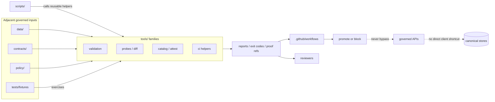

<!-- [KFM_META_BLOCK_V2]
doc_id: kfm://doc/<uuid-NEEDS-VERIFICATION>
title: tools
type: standard
version: v1
status: draft
owners: <see ../.github/CODEOWNERS — NEEDS VERIFICATION>
created: <YYYY-MM-DD-NEEDS-VERIFICATION>
updated: 2026-03-19
policy_label: <NEEDS-VERIFICATION>
related: [../README.md, ../.github/README.md, ../.github/CODEOWNERS, ../contracts/, ../policy/, ../data/, ../infra/, ../scripts/, ../tests/]
tags: [kfm, tools, validation, reproducibility, ci]
notes: [Direct current-session evidence was PDF-only under /mnt/data; live repo tree, CODEOWNERS, workflows, and exact tool paths remain NEEDS VERIFICATION.]
[/KFM_META_BLOCK_V2] -->

# tools

Verification, validation, diff, probe, and support tooling surface for Kansas Frontier Matrix.

> **Status:** experimental  
> **Owners:** NEEDS VERIFICATION — see [../.github/CODEOWNERS](../.github/CODEOWNERS)  
> **Repo fit:** intended path `tools/README.md` · upstream [../README.md](../README.md) · governance [../.github/README.md](../.github/README.md) · adjacent [../scripts/](../scripts/) · downstream [../.github/workflows/](../.github/workflows/)  
> **Evidence posture:** corpus-grounded · direct mounted repo-tree verification remains **NEEDS VERIFICATION**  
>       
> **Quick jumps:** [Scope](#scope) · [Repo fit](#repo-fit) · [Accepted inputs](#accepted-inputs) · [Exclusions](#exclusions) · [Current evidence snapshot](#current-evidence-snapshot) · [Directory tree](#directory-tree) · [Quickstart](#quickstart) · [Usage](#usage) · [Tool behavior contract](#tool-behavior-contract) · [Diagram](#diagram) · [Tables](#tables) · [Task list](#task-list--definition-of-done) · [FAQ](#faq) · [Appendix](#appendix)

> [!IMPORTANT]
> `tools/` is not a miscellaneous scripts bin. In KFM it is the reusable, reviewable helper surface that strengthens governed execution without quietly becoming product runtime, policy source-of-truth, or hidden business logic.

## Scope

`tools/` is the KFM lane for small, explicit utilities whose primary job is to **inspect, compare, validate, summarize, lint, probe, or emit support evidence**. In practice, that means validators, link checkers, diff/probe helpers, catalog and attestation helpers, and CI-facing CLIs that help the governed truth path remain auditable.

This README treats the refined March 2026 tooling layer as the directory’s likely doctrinal baseline, then narrows that doctrine into a repo-ready README contract. Because the accessible workspace in this session exposed PDFs only, file-level statements stay intentionally qualified.

What belongs here:

- reusable validators for contracts, catalogs, manifests, receipts, and promotion-readiness checks
- deterministic diff, checksum, spec-hash, and integrity helpers
- bounded probe utilities that inspect systems and emit reviewable reports
- catalog, provenance, attestation, or release-evidence support helpers
- CI-facing CLIs that fail clearly and produce stable output

What this README does:

- defines the operating contract for `tools/`
- distinguishes `tools/` from adjacent lanes such as `scripts/`, `tests/`, `contracts/`, and `policy/`
- keeps current evidence separate from target-shape guidance

### Evidence markers used in this README

| Marker | Meaning here |
| --- | --- |
| **CONFIRMED** | Supported by the attached March 2026 KFM corpus or direct current-session evidence |
| **INFERRED** | Strongly suggested by attached materials, but not directly re-verified from a mounted repo tree |
| **PROPOSED** | Doctrine-consistent target shape or placement guidance, not verified as live-tree reality |
| **UNKNOWN** | Not verified strongly enough to present as settled current reality |
| **NEEDS VERIFICATION** | Placeholder value, owner, path, or implementation detail that should be checked in a live checkout before commit |

[Back to top](#tools)

## Repo fit

**Path:** `tools/README.md`  
**Role in repo:** directory README for validation, diff, probe, catalog-support, attestation-support, and CI-facing helper tooling.

> [!NOTE]
> The links below follow the documented KFM repo layout and surrounding doctrinal references. Their **current mounted presence** beyond the PDF corpus remains **NEEDS VERIFICATION** in this session.

| Direction | Surface | Why it matters |
| --- | --- | --- |
| Upstream | [../README.md](../README.md) | Root repository framing and system identity |
| Governance | [../.github/README.md](../.github/README.md) | Maintainer workflow guidance and repo-level operating notes |
| Governance | [../.github/CODEOWNERS](../.github/CODEOWNERS) | Intended owner map for `tools/` and adjacent governed surfaces |
| Adjacent | [../scripts/](../scripts/) | Orchestration and lifecycle-transition scripts may call tools, but reusable helpers should not be buried there |
| Adjacent | [../contracts/](../contracts/) | Tools validate or consume contracts; they do not replace them |
| Adjacent | [../policy/](../policy/) | Policy bundles live there; tools may lint, evaluate, or summarize them |
| Adjacent | [../tests/](../tests/) | Fixtures and assertions should exercise tool behavior explicitly |
| Adjacent | [../data/](../data/) | Catalogs, manifests, datasets, and example slices are common tool inputs |
| Adjacent | [../docs/](../docs/) | Doctrine, ADRs, runbooks, diagrams, and review guidance belong there |
| Adjacent | [../infra/](../infra/) | Infra may call tools, but deployment definitions do not belong here |
| Downstream | [../.github/workflows/](../.github/workflows/) | CI invokes tools, but workflow YAML should not become the only place tool behavior is documented |

## Accepted inputs

The following belong in or under `tools/`:

- validator code, configs, and tiny helper assets for schema, catalog, provenance, checksum, or release checks
- deterministic comparison utilities for manifests, snapshots, geometry diffs, or release artifacts
- probe helpers that emit bounded reports rather than silent mutation
- attestation, proof-pack, or spec-hash helpers used by CI, release review, or promotion control
- reviewer or operator helpers that summarize build, PR, release, or catalog evidence in stable formats

### Boundary map

| Surface | Belongs there when… | Does **not** belong there when… |
| --- | --- | --- |
| `tools/` | the artifact is a reusable helper whose main job is check / report / fail / summarize | it is a long-running service, a public runtime, or a lifecycle orchestrator |
| `scripts/` | the artifact coordinates staged work, transitions, or operator workflows and may call into `tools/` | it is really a reusable validator, diff helper, or review CLI |
| `contracts/` | the artifact defines schema, OpenAPI, registry, or vocabulary shape | it is executable validation logic or CLI entrypoint |
| `policy/` | the artifact is the policy source-of-truth: bundles, fixtures, or decision rules | it is generic wrapper code around policy evaluation |
| `tests/` | the artifact asserts behavior, carries fixtures, or proves negative paths | it is the primary operational CLI or reviewer-facing helper |
| `packages/` | the logic is shared library code imported across the repo | it only exists as a thin command-line wrapper or support executable |

## Exclusions

| Does **not** belong here | Put it in | Why |
| --- | --- | --- |
| Long-running public runtime code | a deployable app or package lane | `tools/` supports governed execution; it is not the product runtime |
| Canonical policy bundles or rule ownership | [../policy/](../policy/) | Tooling may evaluate policy, but policy source-of-truth stays separate |
| Authoritative contracts and schemas | [../contracts/](../contracts/) | Tools consume contracts; they should not hide or replace them |
| One-off operator experiments without durable value | local scratch space or a dedicated script | `tools/` is for repeatable, reviewable utilities |
| Sensitive fixture payloads or unrestricted coordinate dumps | secured data lanes | Public tooling must remain safe to clone, run, and review |
| Hidden promotion shortcuts | nowhere | KFM promotion is governed, inspectable, and fail-closed |
| Inline workflow shell blobs that become the only implementation | tool entrypoints plus documented workflows | Reviewers should be able to locate logic outside workflow YAML |

## Current evidence snapshot

| Evidence item | Status | How this README uses it |
| --- | --- | --- |
| The refined March 19 tooling reference treats tooling as **governed machinery over release-bearing evidence** and retains a tool-family inventory, contract/proof-object lattice, and hydrology-first thin-slice plan | **CONFIRMED** | Used as the doctrinal baseline for this README |
| The refined March 19 scripts reference treats scripts as **truth-path transition machinery** and gives a family model stronger than any single orchestrator choice | **CONFIRMED** | Used to separate `tools/` from `scripts/` |
| The refined March 19 testing reference keeps verification attached to lifecycle transitions, proof objects, runtime trust, rollback, and correction | **CONFIRMED** | Grounds the fail-closed and proof-bearing expectations for tools |
| The refined March 19 and March 16 contract/schema references prioritize first-wave schemas, valid/invalid fixtures, starter registries, EvidenceBundle, and RuntimeResponseEnvelope | **CONFIRMED in corpus / PROPOSED in implementation** | Used to shape tool outputs and expected adjacency with contracts/tests |
| Documentary repo inventory material describes `tools/` as **validators, link checkers, CLI utilities** and places it beside `docs/`, `tests/`, `contracts/`, `policy/`, `data/`, `infra/`, `configs/`, `scripts/`, `migrations/`, and `examples/` | **INFERRED from documentary repo inventory / NEEDS VERIFICATION** | Used for repo-fit guidance only, not as current live-tree fact |
| The current accessible workspace in this session exposed PDFs only under `/mnt/data`; no mounted repo tree, schema registry, workflows, manifests, dashboards, or runtime logs were directly visible | **CONFIRMED current-session constraint** | Keeps path-level, owner-level, and implementation-shaped claims qualified |

## Directory tree

### Documented example subtree from the attached corpus

```text
tools/
└── validation/
    └── catalog_qa/   # documented example; live presence NEEDS VERIFICATION
        ├── README.md
        ├── run_catalog_qa.py
        └── config.yml
```

### Stable family shape to prefer when adding new tooling

```text
tools/
├── validation/   # schema, catalog, provenance, determinism, policy-adjacent checks
├── probes/       # bounded inspection and freshness/status helpers
├── diff/         # stable comparison, snapshot, and change-review helpers
├── catalog/      # catalog closure, cross-link, and metadata assembly aides
├── attest/       # release-evidence and attestation support helpers
└── ci/           # reviewer-facing summaries and merge-gate support utilities
```

> [!WARNING]
> The corpus shows naming drift between `tools/validation/` and `tools/validate/`. Prefer **noun-based directory families** (`validation/`, `probes/`, `diff/`, `catalog/`, `attest/`, `ci/`) and reserve verbs for entrypoint filenames.

> [!NOTE]
> If the job is primarily orchestration, state movement, scheduling, or lifecycle coordination, place it in `scripts/` and call into `tools/` for the reusable helper logic.

[Back to top](#tools)

## Quickstart

The commands below are verification-first. Run them before adding or moving anything under `tools/`.

1. Inspect what actually exists in your checkout.

```bash
find tools -maxdepth 4 \( -type f -o -type d \) | sort
```

2. Check governance and ownership surfaces nearby.

```bash
sed -n '1,160p' .github/README.md
sed -n '1,200p' .github/CODEOWNERS
```

3. Check naming drift and existing callers before adding a new family.

```bash
rg -n "tools/(validation|validate|probes|diff|catalog|attest|ci)" -S .
rg -n "tools/" .github/workflows docs scripts tests -S .
```

4. Run the documented quick gate if the example subtree is present.

```bash
python3 tools/validation/catalog_qa/run_catalog_qa.py \
  --root data/ \
  --glob "**/collection.json" \
  --fail-on-warn
```

> [!NOTE]
> The `catalog_qa` command above is a **documented example subtree** from the attached corpus, not a claim that the active checkout already contains that exact path.

## Usage

### Add a reusable validator

1. Choose the narrowest noun-based family that matches the helper’s real job.
2. Keep the entrypoint thin and explicit about inputs, outputs, and exit semantics.
3. Prefer read-only inspection by default.
4. Emit machine-readable output if CI, review surfaces, or audits will parse it.
5. Add at least one good fixture and one failing fixture for non-trivial behavior.
6. Document blocking vs non-blocking conditions in the nearest README.

### Add a probe, diff, or catalog helper

A helper belongs in `tools/` when it:

- reads or compares state without becoming the system of record
- produces deterministic, reviewable output
- can fail closed when a blocking condition is detected
- does not silently promote, publish, or mutate authoritative truth
- is useful both to humans and to CI

### Call tools from scripts or CI

Keep orchestration and helper logic distinct:

1. let `scripts/` own staged movement, scheduling, or operator choreography
2. let `tools/` own reusable inspection, validation, comparison, or support evidence
3. keep workflow YAML small by calling stable tool entrypoints instead of embedding giant shells
4. make the same helper runnable locally and in CI
5. document the caller and the helper together when either one becomes merge-blocking

## Tool behavior contract

| Concern | Required posture |
| --- | --- |
| Determinism | Same inputs should yield the same output shape and exit code |
| Failure semantics | Documented blocking conditions return non-zero and stay visible |
| Output shape | Prefer JSON/JSONL or another stable machine-readable format when CI consumes output |
| Side effects | Default to read-only inspection unless write behavior is explicit, narrow, and documented |
| Provenance joinability | Reports should carry enough IDs, digests, refs, or paths to join back to manifests and receipts |
| Safety | No secret scraping, unrestricted sensitive fixtures, or logs that leak policy-restricted material |
| Boundary discipline | No direct bypass of policy, review, release evidence, or the trust membrane |
| Reviewability | Helpers should be callable by humans, CI, and scripts without changing semantics |

Illustrative output shape for a blocking validator:

```json
{
  "tool": "catalog_qa",
  "status": "fail",
  "blocking": true,
  "artifact": "data/stac/hydrology/collection.json",
  "checks": [
    {"id": "stac-schema", "result": "pass"},
    {
      "id": "cross-link",
      "result": "fail",
      "message": "missing prov bundle reference"
    }
  ]
}
```

> [!IMPORTANT]
> “Fail-closed” here does **not** mean every warning is fatal. It means the documented blocking conditions actually block, consistently and inspectably, and produce reviewable output when they do.

## Diagram


```mermaid
flowchart LR
    subgraph Inputs[Adjacent governed inputs]
      D[data/]
      C[contracts/]
      P[policy/]
      T[tests/fixtures]
    end

    S[scripts/] -->|calls reusable helpers| TF
    D --> TF
    C --> TF
    P --> TF
    T -->|exercises| TF

    subgraph TF[tools/ families]
      V[validation]
      PR[probes / diff]
      CA[catalog / attest]
      CI[ci helpers]
    end

    TF --> R[reports / exit codes / proof refs]
    R --> W[.github/workflows]
    R --> RV[reviewers]

    W --> G[promote or block]
    G -. never bypass .-> API[governed APIs]
    API -. no direct client shortcut .-> STORE[(canonical stores)]
```

## Tables

### Tool family matrix

| Family | Primary job | Typical inputs | Expected outputs | Typical caller | Status in this README |
| --- | --- | --- | --- | --- | --- |
| `validation/` | schema, catalog, provenance, determinism, or policy-adjacent checks | schemas, manifests, catalogs, receipts, fixtures | pass/fail report, structured errors | CI, local review, scripts | **Documented example + strongest fit** |
| `probes/` | bounded source, freshness, or status inspection | endpoints, feeds, configs, snapshots | probe report, freshness/status summary | scheduled checks, PR validation | **PROPOSED family shape** |
| `diff/` | deterministic comparison for review or correction | manifests, snapshots, geometry baselines, catalogs | stable diff report, counts, optional artifacts | reviewers, CI | **PROPOSED family shape** |
| `catalog/` | catalog closure or metadata-assembly support | processed artifacts, IDs, metadata, cross-link targets | closure report, catalog updates, link summaries | release prep, local verification | **PROPOSED family shape** |
| `attest/` | attestation and release-evidence support | digests, SBOM refs, manifests, proof objects | attestations, verification results, support bundles | release lanes, CI | **PROPOSED family shape** |
| `ci/` | reviewer-facing summaries and merge-gate support | reports, receipts, artifacts, test output | PR summaries, annotations, compact gate output | CI workflows | **PROPOSED family shape** |

### Naming and placement rules

| Prefer | Avoid | Why |
| --- | --- | --- |
| `tools/validation/` | long-lived parallel `tools/validate/` trees | stable noun families are easier to scan and govern |
| `run_catalog_qa.py` | `check.py` | entrypoints should reveal their guarded contract |
| `tools/diff/stable_diff.py` | diff logic hidden inside workflow YAML | reviewers should be able to find comparison logic directly |
| `tools/attest/` | scattered signing helpers in random folders | release evidence should be discoverable |
| `tools/ci/summary_<thing>.py` | giant inline shell in GitHub Actions | workflow YAML should call helpers, not become the helper |
| `scripts/` for orchestration | transition logic buried in `tools/` | reusable helper logic and lifecycle choreography are different concerns |

## Task list / Definition of done

- [ ] The tool has one narrow, documented purpose.
- [ ] Directory placement matches the helper’s real job.
- [ ] Exit codes are explicit and tested.
- [ ] At least one representative success path and one failure path exist.
- [ ] Machine-readable output exists where CI, review, or audits need stable parsing.
- [ ] No secret, restricted, or rights-unclear material was committed as a fixture.
- [ ] The tool does not bypass policy, review, release evidence, or the trust membrane.
- [ ] If a script or workflow calls the tool, that caller is documented near the helper.
- [ ] Naming follows the noun-family rule for directories and descriptive entrypoint rule for executables.
- [ ] This README and any local tool README were updated together.
- [ ] Path-level claims, owners, and workflow references were verified against the live checkout before merge.

## FAQ

### Why not put everything in `scripts/`?

Because KFM treats scripts as transition or orchestration machinery, while `tools/` is the reusable helper surface those scripts can call. If a helper’s main job is validate / compare / summarize / fail, it should not be buried inside lifecycle choreography.

### When should something move out of `tools/` and into `packages/`?

When the logic is no longer primarily a CLI/helper surface and becomes shared library code imported across multiple parts of the repo. `tools/` can wrap package logic, but it should not become the repo’s hidden library layer.

### Why keep `CONFIRMED`, `PROPOSED`, and `UNKNOWN` markers inside a README?

Because this directory sits close to validation, CI, promotion readiness, and review evidence. Overclaiming here would weaken the same trust posture the tools are supposed to protect.

### Why prefer `validation/` over `validate/`?

Because the attached corpus already shows naming drift. Standardizing on noun-based directory families keeps the tree readable and lets executable filenames carry the verb.

## Appendix

<details>
<summary>Document-backed example paths mentioned in the attached corpus</summary>

```text
tools/validation/catalog_qa/
tools/validation/catalog_qa/run_catalog_qa.py
tools/validation/catalog_qa/config.yml
tools/probes/gtfsrt_probe.py
tools/validate/gtfsrt_schema.py
tools/diff/stable_diff.py
tools/spec_hash.py
tools/partition/write_snapshot.py
```

Use this list as a review aid, not as proof that every path exists on the active branch.

</details>

<details>
<summary>Verification-first local checks</summary>

```bash
# What is actually present?
find tools -maxdepth 4 \( -type f -o -type d \) | sort

# Which nearby governed surfaces exist?
find .github -maxdepth 2 -type f | sort
find tests -maxdepth 3 \( -type f -o -type d \) | sort

# Where does tooling wire into CI, scripts, docs, and policy?
rg -n "tools/" .github/workflows docs scripts policy tests -S

# Is there still validation/validate drift?
rg -n "tools/(validation|validate)/" -S .

# Which owners and merge gates are active?
sed -n '1,200p' .github/CODEOWNERS
find .github/workflows -maxdepth 2 -type f | sort
```

</details>

<details>
<summary>What this README intentionally does not claim</summary>

This README does **not** claim that the current mounted repo already contains:

- a verified live `tools/` subtree matching the family shape above
- a confirmed owner map for `tools/`
- a confirmed workflow inventory or merge-blocking gate list
- a confirmed schema/fixture inventory for tooling
- a confirmed deployment, rollback, or attestation implementation
- a confirmed EvidenceBundle resolver or RuntimeResponseEnvelope implementation on disk

Those remain direct verification tasks for a live checkout.

</details>

[Back to top](#tools)