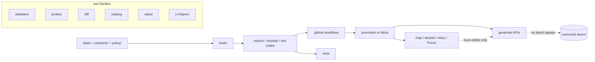

<!-- [KFM_META_BLOCK_V2]
doc_id: kfm://doc/<uuid-NEEDS-VERIFICATION>
title: tools
type: standard
version: v1
status: draft
owners: <see ../.github/CODEOWNERS — NEEDS VERIFICATION>
created: <YYYY-MM-DD-NEEDS-VERIFICATION>
updated: 2026-03-16
policy_label: <NEEDS-VERIFICATION>
related: [../README.md, ../.github/README.md, ../.github/CODEOWNERS, ../contracts/, ../docs/, ../policy/, ../data/, ../infra/, ../tests/]
tags: [kfm, tools, validation, reproducibility, ci]
notes: [Current session exposed PDF evidence only; live repo-tree contents beyond attached inventories remain NEEDS VERIFICATION.]
[/KFM_META_BLOCK_V2] -->

# tools

Verification, validation, diff, probe, and support tooling surface for Kansas Frontier Matrix.

> **Status:** experimental  
> **Owners:** NEEDS VERIFICATION — see [../.github/CODEOWNERS](../.github/CODEOWNERS)  
> **Repo fit:** `tools/README.md` · upstream [../README.md](../README.md) · governance [../.github/README.md](../.github/README.md)  
>       
> **Quick jumps:** [Scope](#scope) · [Repo fit](#repo-fit) · [Accepted inputs](#accepted-inputs) · [Exclusions](#exclusions) · [Current evidence snapshot](#current-evidence-snapshot) · [Directory tree](#directory-tree) · [Quickstart](#quickstart) · [Usage](#usage) · [Tool behavior contract](#tool-behavior-contract) · [Diagram](#diagram) · [Tables](#tables) · [Task list](#task-list--definition-of-done) · [FAQ](#faq) · [Appendix](#appendix)

> [!IMPORTANT]
> `tools/` is not a miscellaneous scripts bin. In KFM it is the reviewable support surface for validation, reproducibility, promotion readiness, and trust-preserving automation.

## Scope

`tools/` holds small, explicit utilities that strengthen governed behavior without quietly becoming canonical policy, long-running services, or hidden business logic.

What belongs here:

- validators for catalogs, contracts, fixtures, receipts, and release-readiness checks
- deterministic diff, probe, checksum, and attestation helpers
- thin CI-facing utilities that fail clearly and produce reviewable outputs
- operator helpers that inspect, verify, or summarize state without bypassing governed interfaces

What this README does:

- defines the directory contract
- separates current evidence from target shape
- keeps naming and boundary rules stable as the tool surface grows

## Status markers used in this README

| Marker | Meaning here |
| --- | --- |
| **CONFIRMED** | Supported by attached KFM repository inventories or March 2026 doctrine in this session |
| **INFERRED** | Strongly suggested by the corpus structure, but not directly verified from a mounted repo tree |
| **PROPOSED** | Fits KFM doctrine and support materials, but not verified as active-branch reality |
| **UNKNOWN** | Not verified strongly enough to present as current repo fact |
| **NEEDS VERIFICATION** | Placeholder value or path that should be checked against the live checkout before commit |

[Back to top](#tools)

## Repo fit

**Path:** `tools/README.md`  
**Role in repo:** directory README for verification, validation, probe, diff, and tooling support surfaces.

| Direction | Surface | Why it matters |
| --- | --- | --- |
| Upstream | [../README.md](../README.md) | Root framing for the repository as a governed system |
| Upstream | [../.github/README.md](../.github/README.md) | Maintainer workflow guidance and repo-level operating pointers |
| Governance | [../.github/CODEOWNERS](../.github/CODEOWNERS) | Owner map for `tools/` and other governed surfaces |
| Adjacent | [../contracts/](../contracts/) | Tools should validate or consume contracts, not replace them |
| Adjacent | [../policy/](../policy/) | Policy bodies live there; tooling may execute or lint them |
| Adjacent | [../docs/](../docs/) | Human-facing doctrine, runbooks, and standards |
| Adjacent | [../data/](../data/) | Catalog, manifest, and dataset checks often start here |
| Adjacent | [../tests/](../tests/) | Tests should exercise tool behavior and fixture-backed gates |
| Adjacent | [../infra/](../infra/) | Runtime and deployment control planes may call tools, but do not belong here |

> [!NOTE]
> This README is intentionally evidence-bounded. The current session did **not** include a mounted repo checkout, so it distinguishes between what attached inventories confirm and what realization notes merely suggest.

## Accepted inputs

The following belong in or under `tools/`:

- validator code, configs, and tiny helper assets for catalog, schema, provenance, checksum, or promotion checks
- deterministic comparison utilities for snapshots, manifests, geometry diffs, or release artifacts
- probe helpers that emit bounded reports, not silent state mutation
- attestation, spec-hash, and receipt utilities used by CI or promotion paths
- lightweight helper scripts that summarize PR or build evidence for reviewers

### Minimum expectations for anything added here

- deterministic behavior on the same inputs
- explicit exit semantics
- no hidden write path into canonical truth
- fixtures or examples for non-trivial behavior
- machine-readable output where CI or audits need stable parsing
- documentation close to the tool when the contract is not obvious from the name

## Exclusions

| Does **not** belong here | Goes instead | Why |
| --- | --- | --- |
| Long-running services, workers, or public runtime code | `../apps/` or `../packages/` | `tools/` supports governed behavior; it is not the product runtime |
| Canonical policy bundles or rule ownership | `../policy/` | Tooling may evaluate policy, but policy source-of-truth stays separate |
| Authoritative contracts and schemas | `../contracts/` | Tools consume contracts; they should not hide them |
| Large datasets, private fixtures, or sensitive coordinates | governed data stores / secured lanes | Public repo tooling must stay safe to clone and review |
| One-off local experiments without durable value | `../scripts/` or local scratch space | `tools/` is for repeatable, reviewable utilities |
| Hidden promotion shortcuts | nowhere | KFM promotion is governed, inspectable, and fail-closed |

## Current evidence snapshot

This section keeps repo reality and target shape separate.

| Evidence item | Status | What it supports |
| --- | --- | --- |
| Top-level `tools/` surface exists and is described as utilities/validators | **CONFIRMED** | `tools/` is a real repo lane, not just a speculative placeholder |
| `tools/validation/catalog_qa/` is listed as **Catalog QA (STAC/DCAT Quick Gate)** | **CONFIRMED** | At least one validation subtree is explicitly present in attached repo-support material |
| `.github/CODEOWNERS` covers `tools/` | **CONFIRMED** | Ownership exists, but exact owners were not recovered in this session |
| Additional families such as SQL/bash validation, probes, diff, attestation, catalog, and CI helpers appear in support materials | **PROPOSED** | Good candidates for the directory contract, but not yet safe to present as active-branch fact |
| Parallel naming such as `tools/validation/` and `tools/validate/` appears across support materials | **NEEDS VERIFICATION** | Naming drift should be resolved before the tree hardens |
| Exact live contents of `tools/` on the active checkout | **UNKNOWN** | The current session did not mount the repo tree |

## Directory tree

### Confirmed from attached repo inventories

```text
tools/
└── validation/
    └── catalog_qa/
```

### Observed in support materials — verify against the active checkout before relying on them

```text
tools/
├── validation/
│   ├── catalog_qa/
│   │   ├── README.md
│   │   ├── run_catalog_qa.py
│   │   └── config.yml
│   ├── sql/
│   └── bash/
├── probes/
├── validate/          # naming drift observed; normalize if still present
├── diff/
├── partition/
├── catalog/
├── attest/
└── ci/
```

> [!WARNING]
> Support materials show both `tools/validation/` and `tools/validate/`. Prefer **noun-based directory families** (`validation/`, `probes/`, `diff/`, `catalog/`, `attest/`, `ci/`) and reserve verbs for executable filenames.

[Back to top](#tools)

## Quickstart

Start with verification, not assumption.

```bash
# 1) Inspect what actually exists in your checkout
find tools -maxdepth 3 -type f | sort

# 2) Check repo-adjacent governance surfaces
sed -n '1,160p' .github/README.md
sed -n '1,160p' .github/CODEOWNERS
```

### First corpus-confirmed gate to verify locally

```bash
python3 tools/validation/catalog_qa/run_catalog_qa.py \
  --root data/ \
  --glob "**/collection.json" \
  --fail-on-warn
```

> [!NOTE]
> The command above is confirmed by attached support materials, but its presence in the active checkout is still **NEEDS VERIFICATION** until you inspect the repo tree directly.

### Check naming drift before adding a new tool

```bash
rg -n "tools/(validation|validate|probes|diff|catalog|attest|ci|partition)" -S .
```

## Usage

### Add a validator

Use `tools/` when the job is primarily **check / report / fail / summarize**.

1. Put the utility under the narrowest noun-based family that matches its purpose.
2. Keep the entrypoint thin and explicit.
3. Add at least one good fixture and one failing fixture where practical.
4. Emit structured output if CI, PR summaries, or audits will parse it.
5. Document exact input and output expectations.

### Add a probe or diff helper

A probe or diff helper belongs here when it:

- reads or snapshots state without becoming the system of record
- produces deterministic, reviewable output
- can fail closed when a blocking condition is detected
- does not silently promote, publish, or mutate authoritative truth

### Wire a tool into CI

Start conservatively:

1. prove local determinism
2. prove non-zero exit on blocking failures
3. run in PR-only or dry-run mode first
4. document the gate in both the tool README and the workflow
5. make the gate visible to reviewers, not just to automation

## Tool behavior contract

| Concern | Required posture |
| --- | --- |
| Determinism | Same inputs should yield the same output and exit code |
| Failure semantics | Trust-significant failure returns non-zero |
| Output shape | Prefer JSON/JSONL or other stable machine-readable output when CI consumes it |
| Side effects | Default to read-only inspection unless write behavior is explicit and documented |
| Secrets | No ambient credential scraping or secret material committed into fixtures |
| Provenance | Reports should carry enough IDs, digests, or paths to join back to manifests/receipts |
| Safety | Sensitive or rights-unclear content must not leak through fixtures or logs |
| Reuse | Utilities should be reviewable and callable from both humans and CI |

> [!IMPORTANT]
> “Fail-closed” here does **not** mean every warning becomes fatal. It means the documented blocking conditions actually block, consistently and inspectably.

## Diagram


```mermaid
flowchart LR
    A[data/ + contracts/ + policy/] --> B[tools/]

    subgraph TF[tool families]
      V[validation]
      P[probes]
      D[diff]
      C[catalog]
      A2[attest]
      CI[ci helpers]
    end

    B --> R[reports / receipts / exit codes]
    R --> G[.github workflows]
    R --> T[tests]
    G --> M[promotion or block]
    M --> API[governed APIs]
    M --> UI[map / dossier / story / Focus]

    API -. no direct bypass .-> DATA[(canonical stores)]
    UI -. trust-visible only .-> API
```

## Tables

### Tool family matrix

| Family | Primary job | Typical inputs | Typical outputs | Typical caller |
| --- | --- | --- | --- | --- |
| `validation/` | schema, catalog, provenance, or gate checks | STAC/DCAT/PROV, manifests, fixtures, schemas | pass/fail report, structured errors | CI, local review |
| `probes/` | bounded source or snapshot checks | endpoints, feeds, fixture configs | probe report, freshness/status summary | scheduled checks, PR validation |
| `diff/` | deterministic comparison | snapshots, catalogs, manifests, geometry baselines | stable diff summary, images, stats | reviewers, CI |
| `catalog/` | catalog rebuild or integrity helpers | processed artifacts, catalogs, metadata | reindex/rebuild output, catalog reports | promotion, ops |
| `attest/` | provenance and attestation helpers | receipts, artifacts, digests | signed predicates, verification results | release lanes |
| `ci/` | PR/build evidence summaries | diff stats, receipts, artifacts | reviewer-facing summary output | CI workflows |

### Naming rules

| Prefer | Avoid | Why |
| --- | --- | --- |
| `tools/validation/` | parallel long-term `tools/validate/` trees | stable noun-based families are easier to scan |
| `run_catalog_qa.py` | `check.py` | executable names should reveal the guarded contract |
| `tools/validation/sql/` | SQL hidden inside unrelated release scripts | validation logic should be findable |
| `tools/diff/stable_diff.py` | diff logic buried in pipelines | reviewers should be able to locate comparison logic directly |
| `tools/attest/` | ad hoc signing helpers in random folders | provenance belongs in a discoverable support surface |

### What this README treats as current fact vs target shape

| Topic | Current posture |
| --- | --- |
| Top-level `tools/` lane | **CONFIRMED** |
| `tools/validation/catalog_qa/` | **CONFIRMED** |
| Exact owner names | **UNKNOWN / NEEDS VERIFICATION** |
| SQL/bash validation helpers | **PROPOSED** |
| `tools/probes/`, `tools/diff/`, `tools/catalog/`, `tools/attest/`, `tools/ci/` | **PROPOSED** |
| Parallel `tools/validate/` subtree | **NEEDS VERIFICATION** |

## Task list / Definition of done

- [ ] The tool has one narrow, documented purpose.
- [ ] Exit codes are explicit and tested.
- [ ] Deterministic behavior was checked more than once.
- [ ] At least one representative success path and one failure path are covered.
- [ ] No secret, restricted, or rights-unclear material was committed as a fixture.
- [ ] Machine-readable output exists where CI or audits need it.
- [ ] The calling workflow is documented if the tool is CI-facing.
- [ ] The tool does not bypass policy, review, or release evidence.
- [ ] Naming matches the noun-family rule for directory placement.
- [ ] This README and any local tool README were updated together.

## FAQ

### Why not put everything in `scripts/`?

Because KFM uses `tools/` for repeatable, reviewable support utilities that guard governed behavior. A one-off helper can live elsewhere; a reusable validator or gate runner should have a stable home.

### Why distinguish CONFIRMED from PROPOSED inside a README?

Because this directory sits close to validation and promotion. Overclaiming here would weaken the same trust posture the tools are supposed to protect.

### Why prefer `validation/` over `validate/`?

Because the attached support corpus already shows naming drift. Standardizing on directory nouns keeps the tree readable and makes executable filenames carry the verb.

## Appendix

<details>
<summary>Observed or mentioned tool paths in the attached support corpus</summary>

```text
tools/validation/catalog_qa/
tools/validation/catalog_qa/run_catalog_qa.py
tools/validation/catalog_qa/config.yml
tools/validation/sql/surficial_repair.sql
tools/validation/bash/ogr_gates.sh
tools/probes/gtfsrt_probe.py
tools/validate/gtfsrt_schema.py
tools/diff/stable_diff.py
tools/partition/write_snapshot.py
tools/catalog/reindex.sh
tools/attest/generate.sh
tools/ci/pr_summary.py
```

Use this list as a review aid, not as proof that every path exists on the active branch.

</details>

<details>
<summary>Verification-first local checks</summary>

```bash
# What is actually present?
find tools -maxdepth 4 \( -type f -o -type d \) | sort

# Where does tooling wire into CI?
rg -n "tools/" .github/workflows .github README.md docs contracts policy tests -S

# Is there still validation/validate drift?
rg -n "tools/(validation|validate)/" -S .
```

</details>

[Back to top](#tools)
