<!--
📌 tools/ is the repo’s *governed toolchain surface* for building + validating KFM artifacts.
🗓️ Last updated: 2026-01-09
🔁 Review cycle: 90 days (or anytime pipeline order / catalogs / policy changes)
-->

<div align="center">

# 🛠️ `tools/` — Kansas Frontier Matrix (KFM) Toolchain

**Deterministic • Provenance-aware • CI-friendly**  
**Build it once • verify it forever • ship with a paper trail** 🧾✅


</div>

> **TL;DR:** `tools/` holds the **command surface** for building, validating, and packaging KFM artifacts **without bypassing governance**.  
> Tools are **CI-safe** by design: deterministic defaults, clear contracts, fast QA gates, and provenance emission.

> [!IMPORTANT]
> In this repo, **MCP = Master Coder Protocol** (lab notebook + receipts).  
> `tools/` must support MCP workflows by producing **re-run-able** outputs and **linkable** provenance—without turning into “business logic.”

---

<details>
<summary><b>🧭 Table of contents</b></summary>

- [🧠 Quick links](#-quick-links)
- [🧱 The non-negotiable ordering](#-the-non-negotiable-ordering)
- [🎯 What belongs in tools](#-what-belongs-in-tools)
- [🧭 Boundaries: tools vs scripts vs src vs mcp](#-boundaries-tools-vs-scripts-vs-src-vs-mcp)
- [📦 Data staging + catalog locations](#-data-staging--catalog-locations)
- [🧱 Tool contract](#-tool-contract)
- [📁 Expected folder layout](#-expected-folder-layout)
- [🔁 Common workflows](#-common-workflows)
- [✅ Validation & QA gates](#-validation--qa-gates)
- [🔏 Provenance, SBOM, and attestations](#-provenance-sbom-and-attestations)
- [🗺️ Geo & mapping utilities](#️-geo--mapping-utilities)
- [🛰️ Remote sensing utilities](#️-remote-sensing-utilities)
- [🧠 Graph & DB utilities](#-graph--db-utilities)
- [🌐 Web/UI build utilities](#-webui-build-utilities)
- [🧪 Modeling/ML/simulation utilities](#-modelingmlsimulation-utilities)
- [🔐 Security posture](#-security-posture)
- [⚡ Performance & scaling notes](#-performance--scaling-notes)
- [🧩 Contributing a new tool](#-contributing-a-new-tool)
- [📚 Project reference library](#-project-reference-library)
- [🧾 Metadata](#-metadata)
- [🕰️ Version history](#️-version-history)

</details>

---

## 🧠 Quick links

- 🧪 Research workflow + run receipts → `mcp/README.md`
- 🧪 Pipelines (canonical ETL code) → `src/pipelines/`
- 🗂️ Catalog outputs + governance → `data/README.md`
- 🧰 Convenience wrappers / local ops → `scripts/README.md`
- ✅ Tests + contract gates → `tests/README.md`
- 🧬 Pipeline portal / runbooks → `pipelines/README.md` + `docs/pipelines/`

---

## 🧱 The non-negotiable ordering

> [!IMPORTANT]
> This ordering is not “architecture style.” It’s a **governance boundary**.

**ETL → Catalogs (STAC/DCAT/PROV) → Graph/DB → APIs → UI → Story Nodes → Focus Mode**

```mermaid
flowchart LR
  A["🧪 ETL (deterministic)"] --> B["🗂️ Catalogs<br/>STAC/DCAT/PROV + QA"]
  B --> C["🕸️ Graph/DB ingest<br/>(controlled paths)"]
  C --> D["🛡️ APIs"]
  D --> E["🌐 UI"]
  E --> F["📚 Story Nodes"]
  F --> G["🎯 Focus Mode"]
```



**Practical implication:** `tools/` must never create **published-looking outputs** that skip **catalog + provenance**.

---

## 🎯 What belongs in tools

`tools/` is for **reusable, CI-friendly tooling** that builds/validates artifacts in the governed pipeline.

✅ Good fits:
- **Catalog QA gates** (STAC/DCAT/PROV schema + link + required-field checks)
- **Deterministic ID/hashing utilities** (stable IDs, checksums, manifests)
- **Format and integrity tooling** (COG validation, GeoParquet schema checks, geometry validity)
- **Policy enforcement tooling** (licensing gates, sensitivity/classification checks, “no downgrade” rules)
- **Graph/DB loaders** that **ingest from catalogs** (not ad-hoc inserts)
- **Release packaging** (SBOM generation, signatures, attestations)
- **CI entrypoints** (non-interactive, stable exit codes)

🚫 Not a good fit:
- Long-lived services (APIs, daemons) → app/runtime folders
- Core domain/business logic → `src/` (importable, testable modules)
- One-off “forever scripts” that bypass provenance and approvals → keep in a sandbox until promoted
- Anything that can’t run non-interactively (or can’t be made CI-safe)

---

## 🧭 Boundaries: tools vs scripts vs src vs mcp

### `src/` = canonical behavior (the engine) 🏗️
- Pipelines, graph ingestion logic, server/API logic, reusable libraries.

### `tools/` = governed toolchain (the verified command surface) 🛠️
- Entry points that call canonical modules, run validators, emit provenance, and produce release-quality artifacts.

### `scripts/` = convenience orchestration (the buttons/levers) 🧰
- Thin wrappers for local ops, dev helpers, or environment glue.
- Preferred pattern: **scripts call tools**, tools call src.

### `mcp/` = research receipts & decisions (the lab notebook) 🧪🧾
- Experiment reports + run receipts that prove how results were produced.

> [!TIP]
> If you’re implementing core behavior inside `tools/`, that’s a smell.
> Put the logic in `src/` and keep `tools/` as a predictable CLI + validator layer.

---

## 📦 Data staging + catalog locations

KFM data work is staged and traceable:

1) 📥 `data/raw/<domain>/...` — raw inputs (as-received)
2) 🧱 `data/work/<domain>/...` — intermediates (scratch / temp / staging)
3) ✅ `data/processed/<domain>/...` — publishable evidence artifacts

Catalog + lineage outputs are first-class artifacts:

- 🗂️ `data/stac/` — STAC collections/items
- 🏷️ `data/catalog/dcat/` — DCAT datasets/distributions
- 🧬 `data/prov/` — provenance bundles (PROV JSON-LD recommended)

> [!IMPORTANT]
> **Atomic publish** is the standard: stage → validate → then promote.
> If validation fails, nothing “half-publishes.”

---

## 🧱 Tool contract

Every tool must behave predictably under automation.

### ✅ Required CLI features
- `--help` (purpose, inputs/outputs, side effects, env vars, examples ≥ 2)
- `--version` (git SHA or semver)
- **safe-by-default mode**
  - either `--dry-run` default, or explicit “no writes unless --apply”
- `--apply` (only when the tool mutates state)
- `--env {dev|staging|prod}` when environment matters
- `--run-id <id>` (or read `KFM_RUN_ID`) for provenance correlation
- Structured logging (human-readable + optional JSONL via `--log-json`)

### ✅ Exit codes (recommended standard)
- `0` success
- `2` CLI usage error
- `3` validation/QA failure (schema invalid, missing required fields, link check fails)
- `>=10` runtime failure (I/O, network, DB, unhandled exceptions)

### 🔐 Network posture
- Default to **no network** unless explicitly required
- If a tool fetches remote inputs:
  - require `--allow-network`
  - block private IP ranges by default (SSRF defense)
  - log source URLs + checksums of downloaded artifacts

---

## 📁 Expected folder layout

> If your repo differs, treat this as the target structure and document deltas in this README.

```text
tools/
├── README.md
├── _lib/                      # shared helpers (logging, env validation, guardrails)
├── ingest/                    # controlled ingest entrypoints (thin wrappers)
├── catalogs/                  # STAC/DCAT emitters + catalog build helpers
├── validation/                # fast QA gates (schema/link/prov/policy)
│   ├── catalog_qa/            # catalog QA gate (PR-friendly)
│   ├── schemas/               # JSON Schemas (STAC/DCAT/PROV + local contracts)
│   ├── rego/                  # OPA/Conftest policies (optional)
│   └── geo/                   # CRS/geom/raster validators
├── id/                        # deterministic IDs, hashing, manifest tooling
├── prov/                      # provenance helpers (PROV JSON-LD emitters)
├── graph/                     # graph ingest helpers (must consume catalog roots)
├── db/                        # PostGIS helpers, migrations, query packs
├── geo/                       # GDAL/WhiteboxTools wrappers, tiling, reprojection
├── web/                       # Map build helpers (styles, tiles packaging, assets)
├── ml/                        # train/eval orchestration (must emit datasets + metrics refs)
├── simulation/                # scenario runners (must record configs + seeds)
├── security/                  # secrets scan, dependency scan, hostile-input checks
├── attest/                    # SBOM + signing helpers (cosign/sigstore patterns)
└── ci/                        # deterministic entrypoints used by CI
```

---

## 🔁 Common workflows

### A) Build a dataset (stage → validate → catalog → promote) ✅
Typical lifecycle:

1) Ingest → `data/raw/...`  
2) Transform → `data/work/...`  
3) Validate (schema/CRS/geometry/license/bounds)  
4) Emit STAC/DCAT/PROV  
5) Promote to `data/processed/...`  
6) (Optional) Ingest into graph/DB from catalogs  
7) Write MCP run receipt if it affects decisions or production

Illustrative shape:
```bash
# ingest (examples)
python tools/ingest/ingest.py --help

# validate (fast fail)
python tools/validation/catalog_qa/run_catalog_qa.py --help

# emit catalogs + provenance
python tools/catalogs/build_catalogs.py --help
python tools/prov/emit_prov.py --help

# promote (atomic publish)
python tools/catalogs/promote.py --help
```

> [!TIP]
> If it changes `data/processed/`, it should also change **STAC/DCAT/PROV** and have a run receipt.

---

### B) PR gate: “Catalog QA quick check” ⚡
Designed to be fast enough to run on every PR:
- schema validity (STAC/DCAT/PROV + extensions)
- required fields (license, bbox, time, assets)
- link resolution (hrefs exist; assets reachable in repo layout)

```bash
python tools/validation/catalog_qa/run_catalog_qa.py --root data/stac
```

---

### C) Policy enforcement (OPA / Conftest) 🛡️
Use policy tests for hard rules:
- license must exist
- classification must not downgrade
- prohibited fields/paths
- “no publish without provenance”

```bash
conftest test -p tools/validation/rego data/stac data/catalog/dcat data/prov --all-namespaces
```

---

### D) Graph/DB ingest from catalogs (no ad-hoc writes) 🕸️
Graph and DB loaders should:
- accept **catalog roots** as inputs (STAC/DCAT/PROV)
- refuse to load items missing provenance or license (unless explicitly allowed)
- emit an ingest report (counts, warnings, failures)

```bash
python tools/graph/ingest_from_stac.py --help
python tools/db/load_from_catalog.py --help
```

---

### E) Build web-friendly map artifacts 🗺️
For UI consumption, tools should prefer:
- rasters → **COGs** with overviews
- vectors → GeoParquet (for analytics) + tiles (for web)
- styles → linted MapLibre style JSON
- overlays → packaged with attribution + legends + accessibility notes

```bash
python tools/geo/build_cog.py --help
python tools/geo/build_tiles.py --help
python tools/web/lint_style.py --help
```

---

## ✅ Validation & QA gates

Think in rings (each ring blocks promotion if it fails):

### Ring 0: Structure
- JSON parses
- schema validation (STAC/DCAT/PROV + extensions)
- required files exist

### Ring 1: Integrity
- checksums/manifest inventory
- deterministic IDs present where required
- atomic publish (no half-state)

### Ring 2: Semantics
- CRS correctness + axis order
- geometry validity (and any allowed repair policy)
- raster sanity (nodata, resolution, alignment)
- time/bounds sanity (e.g., Kansas bounds, plausible ranges)

### Ring 3: Governance & safety
- license required before publish
- classification propagation (no downgrade)
- sensitive fields redaction rules
- policy tests (OPA/Conftest) where used
- secrets scans + dependency hygiene checks

---

## 🔏 Provenance, SBOM, and attestations

### Provenance (required for publish)
At minimum, each publish action should have:
- run_id
- code version (git SHA)
- config hash
- inputs used (IDs + checksums where feasible)
- outputs generated (paths + checksums)
- pointers to STAC/DCAT records

Minimal PROV JSON-LD example shape:
```json
{
  "@context": ["https://www.w3.org/ns/prov.jsonld"],
  "type": "prov:Activity",
  "prov:startedAtTime": "2026-01-09T00:00:00Z",
  "prov:endedAtTime": "2026-01-09T00:05:00Z",
  "prov:used": ["<input_id_or_href>"],
  "prov:generated": ["<output_id_or_href>"],
  "kfm:run_id": "RUN-2026-01-09-example",
  "kfm:checksums": { "<output_id_or_href>": "sha256:..." },
  "kfm:code": { "git_sha": "<abcdef1>" },
  "kfm:tool": { "name": "tools/catalogs/promote.py", "version": "<git_sha_or_semver>" }
}
```

### SBOM + signing (recommended for releases)
For release bundles or promoted artifacts:
- generate SBOMs (tool deps and/or artifact deps)
- sign images/artifacts where feasible
- attach attestations (build provenance, policy checks, QA outcomes)

> [!NOTE]
> Keep logs lightweight in-repo; store heavy logs as CI artifacts or in an artifact store.

---

## 🗺️ Geo & mapping utilities

### CRS & units are non-negotiable
Tools that touch geometry must:
- refuse unknown CRS by default
- log CRS for inputs and outputs
- document any reprojection and record it in provenance

### Web-serving friendliness
When emitting UI-facing assets:
- prefer COG with overviews for rasters
- avoid huge GeoJSON blobs (tile/simplify)
- ensure attribution + license + legends travel with the output

### Cartographic honesty checks (recommended)
- legend entries match data classes
- color ramps don’t imply false precision
- scale-dependent styling is tested (common zooms)

---

## 🛰️ Remote sensing utilities

Remote sensing tooling should prefer **derived products + provenance** over raw archive dumps:
- record AOI (bbox/geometry) + time window
- record compositing + masking logic
- record resolution/CRS
- export as COGs (and/or cloud-optimized NetCDF where relevant)
- emit STAC Items per logical unit (scene, tile, station-day, etc.)

> [!TIP]
> Don’t let EO pipelines become “mystery rasters.” If you can’t trace how it was made, it’s not shippable.

---

## 🧠 Graph & DB utilities

**PostGIS**
- prefer database-side spatial ops when safe (joins, buffers, within, intersects)
- use staging tables + transactional swaps (load → validate → swap)

**Neo4j / graph**
- graph ingest should be downstream of catalogs
- graph QA should test invariants:
  - “every dataset node links to provenance”
  - “no orphan entities”
  - “stable pagination order for query surfaces”

---

## 🌐 Web/UI build utilities

Tools in `tools/web/` should help produce:
- tile packages (and validate pyramid completeness)
- style JSON linting (MapLibre)
- small deterministic thumbnails for previews
- asset manifests with attribution and license propagation

---

## 🧪 Modeling/ML/simulation utilities

Modeling tools must behave like scientific instruments:
- capture parameters + seeds
- emit evaluation artifacts (metrics + plots where relevant)
- record dataset IDs used (STAC/DCAT pointers)
- write run receipts for significant results (MCP alignment)

> [!CAUTION]
> If a tool uses AI-assisted generation, label it and record the model/version/config where permissible.

---

## 🔐 Security posture

Treat `tools/` as part of the threat model:
- inputs are hostile (archives, rasters, PDFs, GeoJSON, model files)
- validate types with allowlists
- enforce size limits + decompression limits
- defend against SSRF for network fetchers
- sanitize paths and refuse traversal
- never print secrets; never require secrets in CLI args

Recommended CI hooks:
- secrets scan (repo-wide)
- dependency vulnerability scan
- container scan for tool images (when used)

---

## ⚡ Performance & scaling notes

When tools grow:
- chunk work (tiles/partitions/morsels) for parallelism
- introduce “pipeline breakers” at materialization boundaries
- keep caches explicit and provenance-aware
- prefer near-data execution for large scans (where architecture supports it)

> The rule: speed is good — **but correctness and provenance come first**.

---

## 🧩 Contributing a new tool

### ✅ Definition of done
A tool is “real” when it has:
- entrypoint (`.py`, `.js`, `.sh`, etc.) with `--help` and 2 examples
- deterministic defaults (stable ordering; seeded randomness if applicable)
- structured logs + stable exit codes
- writes outputs to the correct data stage (raw/work/processed)
- emits/updates catalogs + provenance when producing publishable artifacts
- a CI target (smoke test at minimum)
- a clear home in the folder map above

### Suggested `tool.yaml` manifest (recommended)
```yaml
name: "catalog_qa"
entrypoint: "tools/validation/catalog_qa/run_catalog_qa.py"
owner: "@team-or-handle"
inputs:
  - "data/stac/**"
outputs:
  - "reports/catalog_qa/**"
modes:
  - dry_run: true
  - apply: false
network:
  default: "deny"
determinism:
  stable_sorting: true
  seeded: false
gates:
  - "stac_schema"
  - "link_check"
  - "license_required"
```

---

## 📚 Project reference library

These files inform how tools are designed (determinism, validation, governance, scaling, and UX constraints).  
Keep this list updated when the library changes.

### 🧪 Modeling, simulation, verification & uncertainty
- `Scientific Modeling and Simulation_ A Comprehensive NASA-Grade Guide.pdf`
- `Understanding Statistics & Experimental Design.pdf`
- `think-bayes-bayesian-statistics-in-python.pdf`
- `graphical-data-analysis-with-r.pdf`
- `Generalized Topology Optimization for Structural Design.pdf`

### 🧠 ML & learning theory
- `Understanding Machine Learning_ From Theory to Algorithms.pdf`
- `Deep Learning for Coders with fastai and PyTorch - Deep.Learning.for.Coders.with.fastai.and.PyTorchpdf`

### 🗺️ Geospatial, cartography, remote sensing
- `python-geospatial-analysis-cookbook.pdf`
- `PostgreSQL Notes for Professionals - PostgreSQLNotesForProfessionals.pdf`
- `making-maps-a-visual-guide-to-map-design-for-gis.pdf`
- `Mobile Mapping_ Space, Cartography and the Digital - 9789048535217.pdf`
- `Cloud-Based Remote Sensing with Google Earth Engine-Fundamentals and Applications.pdf`
- `compressed-image-file-formats-jpeg-png-gif-xbm-bmp.pdf`

### 🕸️ Graph + interoperability + scale
- `Spectral Geometry of Graphs.pdf`
- `Data Spaces.pdf`
- `Scalable Data Management for Future Hardware.pdf`

### 🌐 UI / Web / 3D
- `responsive-web-design-with-html5-and-css3.pdf`
- `webgl-programming-guide-interactive-3d-graphics-programming-with-webgl.pdf`

### 🔐 Security, governance, society
- `ethical-hacking-and-countermeasures-secure-network-infrastructures.pdf` *(defensive posture only)*
- `Gray Hat Python - Python Programming for Hackers and Reverse Engineers (2009).pdf` *(defensive awareness only)*
- `concurrent-real-time-and-distributed-programming-in-java-threads-rtsj-and-rmi.pdf`
- `Introduction to Digital Humanism.pdf`
- `Principles of Biological Autonomy - book_9780262381833.pdf`
- `On the path to AI Law’s prophecies and the conceptual foundations of the machine learning age.pdf`

### 📚 Programming reference shelves (breadth)
- `A programming Books.pdf`
- `B-C programming Books.pdf`
- `D-E programming Books.pdf`
- `F-H programming Books.pdf`
- `I-L programming Books.pdf`
- `M-N programming Books.pdf`
- `O-R programming Books.pdf`
- `S-T programming Books.pdf`
- `U-X programming Books.pdf`

### 📄 KFM project design doc
- `Kansas Frontier Matrix (KFM) – Comprehensive Technical Documentation.docx`

---

## 🧾 Metadata

```yaml
title: "tools/ — Kansas Frontier Matrix Toolchain"
path: "tools/README.md"
version: "v0.2.0"
last_updated: "2026-01-09"
review_cycle: "90 days"
governance: "FAIR + CARE aligned; sovereignty-aware"
pipeline_order: "ETL → STAC/DCAT/PROV → Graph/DB → APIs → UI → Story Nodes → Focus Mode"
```

---

## 🕰️ Version history

| Version | Date | Summary | Author |
|---:|---|---|---|
| v0.2.0 | 2026-01-09 | Aligned `tools/` with repo-wide boundaries (src/scripts/mcp), added tool contract + data staging rules + QA rings + security posture + richer folder map. | KFM Engineering |
| v0.1.0 | 2026-01-08 | Initial toolbox README draft. | KFM Engineering |
