<!--
📌 tools/ is the repo’s *governed toolchain surface* for building + validating KFM artifacts.
🗓️ Last updated: 2026-01-19
🔁 Review cycle: 90 days (or anytime pipeline order / catalogs / policy changes)
🧭 Alignment: Master Guide v13 (contract-first + evidence-first + one canonical home per subsystem)
🧪 Scientific posture: Verification + Validation + Uncertainty Quantification (V&V&UQ) for anything “model-y”
-->

> According to a document set updated through **2026-01-19**, `tools/` is the **governed command surface** for building + validating KFM artifacts — and it must preserve the v13 pipeline order, provenance-first publishing, and citation-required Focus Mode. 🧾✅[^kfm_v13]

<div align="center">

# 🛠️ `tools/` — Kansas Frontier Matrix (KFM) Toolchain

**Deterministic • Provenance-aware • CI-friendly**  
**Build it once • verify it forever • ship with a paper trail** 🧾✅


</div>

> **TL;DR:** `tools/` is the **governed toolchain** that builds, validates, and packages KFM artifacts **without bypassing governance**.  
> Tools are **CI-safe** by design: deterministic defaults, clear contracts, fast QA gates, provenance emission, and policy checks.

> [!IMPORTANT]
> **MCP** = **Methods, Controls & Processes** *(a.k.a. “Master Coder Protocol” — lab notebook + receipts)* 🧪🧾  
> `tools/` must support MCP workflows by producing **re-run-able** outputs and **linkable** provenance — without becoming “business logic.”[^mcp_receipts]

---

<details>
<summary><b>🧭 Table of contents</b></summary>

- [🧠 Quick links](#quick-links)
- [🧭 Repo invariants](#repo-invariants)
- [🧱 The non-negotiable ordering](#non-negotiable-ordering)
- [🎯 What belongs in tools](#what-belongs-in-tools)
- [🧭 Boundaries: tools vs scripts vs src vs mcp](#boundaries)
- [🤖 Agent toolchain: Watcher–Planner–Executor](#agent-toolchain)
- [🧾 Contracts & schemas](#contracts-and-schemas)
- [📦 Data staging + catalog locations](#data-staging)
- [🧱 Tool contract](#tool-contract)
- [🎲 Determinism & reproducibility levels](#determinism)
- [🧪 Artifact QA matrix](#qa-matrix)
- [📡 Telemetry & observability](#telemetry)
- [📁 Expected folder layout](#expected-layout)
- [🔁 Common workflows](#common-workflows)
- [✅ Validation & QA gates](#validation-gates)
- [🔏 Provenance, SBOM, attestations, releases](#provenance-sbom-attestations)
- [📦 Offline packs & field ops](#offline-packs)
- [🗺️ Geo & mapping utilities](#geo-mapping)
- [🛰️ Remote sensing utilities](#remote-sensing)
- [🧊 Imaging & compression utilities](#imaging-compression)
- [🧱 3D / WebGL / scene utilities](#3d-visualization)
- [🧠 Graph & DB utilities](#graph-db)
- [📊 Statistical evidence utilities](#stats-evidence)
- [🧪 Modeling/ML/simulation utilities](#modeling-ml-simulation)
- [🔐 Security posture](#security-posture)
- [⚡ Performance & scaling notes](#performance-scaling)
- [🌍 Federation & cross-matrix interoperability](#federation)
- [🧩 Contributing a new tool](#contributing)
- [📚 Project reference library](#reference-library)
- [🧾 Metadata](#metadata)
- [🕰️ Version history](#version-history)

</details>

---

<a id="quick-links"></a>
## 🧠 Quick links

- 📘 Canonical repo guide (v13) → `docs/MASTER_GUIDE_v13.md`
- 🧾 KFM STAC/DCAT/PROV profiles (v11) → `docs/standards/KFM_STAC_PROFILE.md`, `docs/standards/KFM_DCAT_PROFILE.md`, `docs/standards/KFM_PROV_PROFILE.md`[^stac_dcat_prov]
- 📖 Glossary (shared language) → `docs/glossary.md`
- 📏 Schemas & contracts (source of truth) → `schemas/`
- 🧪 Research workflow + run receipts → `mcp/README.md`
- 🧪 Canonical pipelines (ETL code) → `src/pipelines/`
- 🕸️ Graph build & ontology bindings → `src/graph/`
- 🛡️ API boundary (contracts + redaction) → `src/server/` (UI does **not** query graph directly)[^kfm_v13]
- 🌐 UI (React · MapLibre · optional Cesium) → `web/`
- 🗂️ Data lifecycle + catalogs → `data/README.md` (and the staging layout below)[^data_layout]
- 🧷 Governance gates → `docs/governance/REVIEW_GATES.md`
- 🛡️ Policy pack (OPA / Conftest) → `tools/validation/policy/*.rego`[^policy_pack]
- 🔏 Releases (bundles, SBOMs, attestations) → `releases/`
- 🧾 Citation metadata (software + snapshots) → `CITATION.cff`
- ✅ Tests → `tests/README.md`

---

<a id="repo-invariants"></a>
## 🧭 Repo invariants

> [!IMPORTANT]
> These are **guardrails**, not preferences. If a tool would violate these, redesign the tool.

### ✅ One canonical home per subsystem 🧱
No mystery duplicates. If logic belongs in:
- pipelines → `src/pipelines/`
- graph → `src/graph/`
- API boundary → `src/server/`
- UI → `web/`
- schemas → `schemas/`
- governed narratives → `docs/reports/story_nodes/`

### ✅ Contract-first 📏
Schemas and API contracts are **first-class artifacts**:
- implementations must conform
- changes require versioning and compatibility checks
- tools should validate against contracts by default

### ✅ Evidence-first + provenance-first 🧾🧬
No “published-looking” output without boundary artifacts:
- **STAC + DCAT + PROV** are required before:
  - graph ingest
  - API exposure
  - UI or Story Node usage[^stac_dcat_prov]
- **Raw data is immutable**; “work” is ephemeral; “processed” is governed evidence.[^immutability]

### ✅ Deterministic by default 🎲🚫
Given the same inputs + config + seed, tools must produce the same outputs (ordering included).[^kfm_v13]

### ✅ The ordering is a governance boundary 🧱🔒
Pipeline order is **absolute** (tools must not provide shortcuts).[^kfm_v13]

### ✅ Focus Mode is citation-required (and advisory) 🧠🧾
Focus Mode must cite sources and can refuse if citations can’t be produced.[^focus_mode]

### ✅ Human-centered + sovereignty-aware 🌾🧑‍🤝‍🧑
Tools are not just “code runners” — they shape **decision artifacts**:
- respect consent, agency, and auditability
- treat policy & classification as **data**, enforced by gates
- default to *least surprise* and *least privilege*

---

<a id="non-negotiable-ordering"></a>
## 🧱 The non-negotiable ordering

> [!IMPORTANT]
> This ordering is not “architecture style.” It’s a **governance boundary**.[^kfm_v13]

**Raw → Work/ETL → Processed → Catalogs (STAC/DCAT/PROV + QA) → Graph → APIs → UI → Story Nodes → Focus Mode**

```mermaid
flowchart LR
  A["📥 Raw (immutable)<br/>data/raw/<domain>/"] --> B["🧪 Work / ETL (scratch)<br/>data/work/<domain>/"]
  B --> C["📦 Processed (publishable artifacts)<br/>data/processed/<domain>/"]
  C --> D["🗂️ Catalog boundary artifacts<br/>data/stac + data/catalog/dcat + data/prov<br/>+ QA gates"]
  D --> E["🕸️ Graph ingest<br/>(Neo4j; references catalogs)"]
  E --> F["🛡️ APIs<br/>(contracts + redaction)"]
  F --> G["🌐 UI<br/>(React · MapLibre · optional Cesium)"]
  G --> H["📚 Story Nodes<br/>(governed narratives)"]
  H --> I["🎯 Focus Mode<br/>(evidence-linked context)"]
```



**Practical implication:** `tools/` must never create **published-looking outputs** that skip **catalog + provenance**.

---

<a id="what-belongs-in-tools"></a>
## 🎯 What belongs in tools

`tools/` is for **reusable, CI-friendly tooling** that builds/validates artifacts in the governed pipeline.

✅ Good fits:
- **Catalog QA gates** (STAC/DCAT/PROV schema + link + required-field checks)
- **Deterministic ID/hashing utilities** (stable IDs, checksums, manifests)
- **Format and integrity tooling** (COG validation, GeoParquet schema checks, geometry validity)
- **Policy enforcement tooling** (OPA/Conftest policy pack; no-downgrade rules; “no publish without provenance”)[^policy_pack]
- **Graph/DB loaders** that **ingest from catalogs** (not ad-hoc inserts)
- **Release packaging** (SBOM generation, signatures, attestations)
- **CI entrypoints** (non-interactive, stable exit codes)
- **Scientific integrity harnesses** (V&V, UQ smoke checks, regression tests)
- **Agent wrappers** that only operate via reviewable artifacts (Watcher/Planner/Executor that opens PRs, emits receipts, and never “hot-patches” main)[^wpe]

🚫 Not a good fit:
- Long-lived services (APIs, daemons) → runtime/app folders
- Core domain/business logic → `src/` (importable, testable modules)
- One-off “forever scripts” that bypass provenance and approvals → keep in sandbox until promoted
- Anything that can’t run non-interactively (or can’t be made CI-safe)

---

<a id="boundaries"></a>
## 🧭 Boundaries: tools vs scripts vs src vs mcp

### `src/` = canonical behavior (the engine) 🏗️
- ETL jobs (`src/pipelines/`), graph build (`src/graph/`), API logic (`src/server/`), reusable libs.

### `tools/` = governed toolchain (the verified command surface) 🛠️
- Thin entrypoints that call canonical modules, run validators, emit provenance, and produce release-quality artifacts.

### `scripts/` = convenience orchestration (the buttons/levers) 🧰
- Local ops, developer helpers, environment glue.
- Preferred pattern: **scripts call tools**, tools call src.

### `mcp/` = receipts & scientific record (the lab notebook) 🧪🧾
- Run receipts, experiment logs, model cards, governance checklists.[^mcp_receipts]

> [!TIP]
> If you’re implementing core behavior inside `tools/`, that’s a smell.  
> Put the logic in `src/` and keep `tools/` as a predictable CLI + validator layer.

---

<a id="agent-toolchain"></a>
## 🤖 Agent toolchain: Watcher–Planner–Executor

KFM supports **agent-assisted workflows** — but only when they behave like **governed tools** (deterministic, reviewable, provenance-emitting). The recommended structure is **Watcher–Planner–Executor**.[^wpe]

### 🛰️ Watcher (detect change → propose)
- Scans a defined surface (e.g., new files in a drop folder, updated feeds, new imagery, changed catalog entries).
- Emits an **immutable event** / proposal artifact:
  - `event.json` (what changed, where, why it matters)
  - proposed `plan.json` inputs (but does **not** run destructive changes)
- Default: **no network** unless `--allow-network` is set.

### 🧭 Planner (propose plan → deterministic, diffable)
- Takes Watcher events and produces a **deterministic plan**:
  - exact tool invocations
  - expected inputs/outputs
  - policy gates to run
  - rollback / failure behavior
- Writes a plan artifact that is:
  - stable-sorted
  - hashed
  - human-readable & machine-readable

### 🧾 Executor (apply plan → PR-based + attested)
- Executes the plan in a controlled environment.
- Produces:
  - updated artifacts (data + catalogs + prov)
  - structured reports
  - MCP run receipt
- **Opens a pull request** (or produces a patch) rather than mutating protected branches.
- Attaches **SBOMs + SLSA-ish attestations** for the automated output (especially if generated/packaged by the agent).[^wpe]

> [!IMPORTANT]
> “Automation” in KFM is not a bypass — it’s a **more disciplined contributor**.  
> If a human would need to pass gates, an agent does too.

---

<a id="contracts-and-schemas"></a>
## 🧾 Contracts & schemas

> [!IMPORTANT]
> **Schemas live at repo root:** `schemas/` is the canonical source of truth.  
> Tools must validate against these contracts by default.

### ✅ What counts as a “contract artifact”
- JSON Schema (STAC/DCAT/PROV, Story Nodes, UI configs, telemetry)
- API boundary contracts (OpenAPI, GraphQL SDL, typed request/response)
- Tool manifests (optional) describing inputs/outputs, gates, and network posture
- **Data contract metadata** describing dataset schema, units, provenance hooks, and sensitivity

### ✅ KFM catalog profiles (v11) 📚
Profiles define KFM-required fields/behaviors for:
- STAC → `docs/standards/KFM_STAC_PROFILE.md`
- DCAT → `docs/standards/KFM_DCAT_PROFILE.md`
- PROV → `docs/standards/KFM_PROV_PROFILE.md`[^stac_dcat_prov]

### ✅ Where tools should look
- `schemas/` → JSON schemas (STAC/DCAT/PROV/storynodes/ui/telemetry)
- `docs/standards/` → KFM profiles and governance rules (STAC/DCAT/PROV profiles, repo structure standard)[^stac_dcat_prov]

### 🧾 Data contract metadata (dataset-level) 📦
For any dataset that will become evidence, require a dataset metadata file that includes:
- schema/fields + units
- coordinate reference system expectations (where applicable)
- license + attribution
- sensitivity/classification tags
- expected spatial/temporal bounds (where applicable)
- pointers to where STAC/DCAT/PROV will be emitted

---

<a id="data-staging"></a>
## 📦 Data staging + catalog locations

KFM data work is staged and traceable, with **one canonical home per dataset**.[^data_layout]

### ✅ Canonical staging pattern (v13)

```text
data/
├── sources/                     # retrieval manifests + checksums + licenses (recommended)
├── raw/
│   └── <domain>/                # immutable as-received data
├── work/
│   └── <domain>/                # intermediates / scratch (rebuildable)
├── processed/
│   └── <domain>/                # publishable evidence artifacts
├── stac/
│   ├── collections/
│   └── items/
├── catalog/
│   └── dcat/                    # DCAT JSON-LD datasets/distributions
└── prov/                        # PROV bundles (JSON-LD recommended)
```

> [!IMPORTANT]
> **Immutability & trust boundaries**:  
> `raw/` is never edited; `work/` is ephemeral; `processed/` is governed evidence.[^immutability]

### 📌 Source manifests (recommended for every ingest)
Place a source manifest alongside incoming data to make ingestion repeatable:
- URL/source identifier
- retrieval timestamp
- method (API export, manual upload, scan, etc.)
- checksums
- license/attribution notes (or links)

The technical docs explicitly call out a `data/sources/...` pattern with per-source metadata + checksums.[^sources_manifest]

### Streaming / near-real-time inputs ⏱️
For streaming datasets:
- treat each batch as **append-only**
- use windowing (daily/weekly/monthly)
- don’t rewrite history silently — publish a new version + provenance trail[^streaming]

---

<a id="tool-contract"></a>
## 🧱 Tool contract

Every tool must behave predictably under automation.

### ✅ Required CLI features
- `--help` (purpose, inputs/outputs, side effects, env vars, examples ≥ 2)
- `--version` (git SHA or semver)
- **safe-by-default mode**
  - either `--dry-run` default, or explicit “no writes unless --apply”
- `--apply` (only when the tool mutates state)
- `--env {dev|staging|prod}` when environment matters
- `--run-id <id>` (or read `KFM_RUN_ID`) for provenance correlation
- `--seed <int>` (or read `KFM_SEED`) for deterministic randomness
- `--contracts <path>` optional override (defaults to `schemas/`)
- `--log-json` (emit JSONL logs, one record per line)
- `--report <path>` (write a machine-readable summary artifact, even on failure)

### 🧾 RunContext (recommended)
For anything that produces evidence artifacts, tools should emit a `run_context.json` capturing:
- `run_id`, timestamps
- tool name + version + git SHA
- config hash
- inputs/outputs (paths + checksums)
- environment snapshot (minimal)

This is the glue between **PROV**, **catalogs**, and **MCP receipts**.

### ✅ Exit codes (recommended standard)
- `0` success
- `2` CLI usage error
- `3` validation/QA failure (schema invalid, missing required fields, link check fails)
- `4` policy failure (license missing, classification downgrade, prohibited field)
- `>=10` runtime failure (I/O, network, DB, unhandled exceptions)

### 🔐 Network posture
- Default to **no network** unless explicitly required
- If a tool fetches remote inputs:
  - require `--allow-network`
  - block private IP ranges by default (SSRF defense)
  - log source URLs + checksums of downloaded artifacts

### 🧾 Provenance emission (minimum viable)
If a tool produces or promotes evidence artifacts, it must emit a PROV bundle containing:
- run_id, timestamps, tool name/version
- code identity (git SHA) + config hash
- inputs used (IDs + checksums where feasible)
- outputs generated (paths + checksums)
- pointers back to STAC/DCAT records

### 🤖 AI-assisted behavior (allowed, but gated)
If a tool uses AI to suggest metadata / mappings:
- default mode must be **suggest-only** (no mutation)
- require `--apply` to write anything
- log model/version/config where permissible
- treat outputs as **draft** until validated + reviewed
- preserve user agency (human-in-the-loop by design)[^hilt]

---

<a id="determinism"></a>
## 🎲 Determinism & reproducibility levels

Not everything needs full hermetic builds — but everything needs **auditability**.

### 🧩 Repro levels (recommended)
| Level | Name | Promise | Typical use |
|---:|---|---|---|
| R0 | Deterministic | Same inputs+config+seed ⇒ same outputs | most tools |
| R1 | Provenance-complete | Deterministic + complete PROV + catalog pointers | publishable evidence |
| R2 | Rebuildable | R1 + pinned deps + machine spec captured | critical releases |
| R3 | Hermetic | R2 + no network + fully captured environment | highest assurance |

> [!TIP]
> If you don’t know which level you need, default to **R1** for anything that touches `processed/`.

---

<a id="qa-matrix"></a>
## 🧪 Artifact QA matrix

Use this matrix to decide which validators must run **before promotion** ✅

| Artifact type | Minimum checks | Extra checks (recommended) |
|---|---|---|
| 📄 JSON/JSON-LD (STAC/DCAT/PROV) | schema + required fields + link resolution | URI normalization + SPDX license lint |
| 🧭 Vector (GeoParquet / FlatGeobuf / GeoJSON) | schema + CRS + geometry validity | topology rules + simplification policy + attribution propagation |
| 🛰️ Raster (COG / GeoTIFF / NetCDF) | COG layout + CRS + bounds + nodata | overview completeness + histogram sanity + tiling alignment |
| 🗄️ Tabular (Parquet/CSV) | schema + types + missingness report | drift checks + range checks + sampling provenance |
| 📦 Offline packs | manifest schema + checksums + policy gates | signature verification + size budgets + “no orphan assets” scan |
| 🧾 Story Nodes (Markdown + config) | schema + links + citations present | spellcheck + accessibility lint + “no unsourced claims” checks |
| 🎨 Map styles (MapLibre JSON) | JSON lint + sources valid + sprite/glyph refs | contrast/legibility budgets + scale tests |
| 🧠 ML artifacts (metrics/models) | metrics schema + dataset refs + seeds | calibration checks + fairness slices + uncertainty |
| 🧮 Simulation outputs | config+seed captured + deterministic rerun | V&V smoke tests + UQ summary + sensitivity |
| 🧊 3D assets (3D Tiles / glTF) | manifest + attribution + bounding volume | LOD validation + GPU budget checks + compression checks |

---

<a id="telemetry"></a>
## 📡 Telemetry & observability

Telemetry is a **contracted surface** (schema-first) — used to measure UX safety signals, governance friction, and system health.

### ✅ Expectations
- event schemas live under `schemas/telemetry/`
- tools should validate telemetry payloads against schemas in CI
- logs should be JSONL (tool-friendly), with a minimal human-readable console summary

Example event contract patterns include events like `focus_mode_redaction_notice_shown` (capturing when policy-driven UI notices appear).[^telemetry]

> [!TIP]
> Treat telemetry as evidence about the system itself: version it, validate it, and keep it privacy-aware.

---

<a id="expected-layout"></a>
## 📁 Expected folder layout

> If your repo differs, treat this as the target structure and document deltas in `tools/README.md`.

```text
🛠️ tools/
├── 📘 README.md
├── 🧰 _lib/                      # shared helpers (logging, env validation, guardrails)
├── 🧾 manifests/                 # optional tool.yaml manifests (one per tool)
├── 🛰️ agents/                    # Watcher–Planner–Executor entrypoints (PR-based automation)
├── 🧲 ingest/                    # controlled ingest entrypoints (thin wrappers)
│   ├── docs/                     # document/PDF ingestion → text + metadata + graph links (gated)
│   └── feeds/                    # scheduled fetchers (deny-by-default network)
├── 🏷️ catalogs/                  # STAC/DCAT emitters + catalog build helpers
├── ✅ validation/                # fast QA gates (schema/link/prov/policy)
│   ├── ⚡ catalog_qa/             # catalog QA gate (PR-friendly)
│   ├── 🛡️ policy/                # OPA/Conftest policies (license/classification/no-downgrade)
│   ├── 🧭 geo/                   # CRS/geom/raster validators
│   ├── 📊 stats/                 # drift/residuals/effect-size reports
│   ├── 🔐 security/              # hostile-input checks (zip bombs, traversal, SSRF guards)
│   └── 📡 telemetry/             # validate event schemas + payloads
├── 🆔 id/                        # deterministic IDs, hashing, manifest tooling
├── 🧬 prov/                      # provenance helpers (PROV JSON-LD emitters)
├── 🧩 dsl/                       # optional: schema/profile/policy DSL compilers (contract-first)
├── 🕸️ graph/                     # graph ingest helpers (must consume catalog roots)
├── 🗄️ db/                        # PostGIS helpers, migrations, query packs
├── 🗺️ geo/                       # GDAL wrappers, tiling, reprojection, COG utilities
├── 🛰️ rs/                        # remote sensing helpers (GEE export, masking, compositing)
├── 🧊 3d/                        # 3D Tiles / glTF tooling, mesh + point cloud validation
├── 🌐 web/                       # map build helpers (styles, tiles packaging, offline packs)
├── 🤖 ml/                        # train/eval orchestration (must emit datasets + metrics refs)
├── 🧮 simulation/                # scenario runners (must record configs + seeds)
├── 🔏 attest/                    # SBOM + signing helpers (cosign/sigstore patterns)
├── ⚡ perf/                      # profiling harnesses + performance budgets
└── 🧪 ci/                        # deterministic entrypoints used by CI
```

> [!NOTE]
> Canonical schemas are in `schemas/` (repo root). Tools should **reference**, not duplicate, contracts.

---

<a id="common-workflows"></a>
## 🔁 Common workflows

### 🧭 “What do I run?” (at a glance)
| I want to… | Run… | Output… |
|---|---|---|
| ✅ Quick PR gate | `tools/validation/catalog_qa/...` | report + exit code |
| 🗂️ Build catalogs | `tools/catalogs/...` | STAC/DCAT |
| 🧬 Emit provenance | `tools/prov/...` | PROV bundle |
| 🚚 Promote/publish | `tools/catalogs/promote...` | atomic move + updated catalogs |
| 🕸️ Load graph/DB | `tools/graph/...` / `tools/db/...` | ingest report |
| 🌐 Build UI assets | `tools/web/...` | tiles/styles/manifests |
| 📦 Build offline pack | `tools/web/build_offline_pack.py` | signed pack + manifest |
| 🧊 Build 3D bundles | `tools/3d/package_3dtiles.py` | 3D tiles + manifest |
| 📊 Statistical QA | `tools/validation/stats/...` | drift/residuals/effect-size reports |
| 🔏 Release bundle | `tools/attest/...` | SBOM + attestation in `releases/` |
| 🤖 Run automation safely | `tools/agents/watcher.py → planner.py → executor.py` | PR + receipts |

---

### A) Build a dataset (stage → validate → catalog → promote) ✅

1) Ingest → `data/raw/<domain>/...`  
2) Transform → `data/work/<domain>/...`  
3) Validate (schema/CRS/geometry/license/bounds)  
4) Emit STAC/DCAT/PROV  
5) Promote to `data/processed/<domain>/...`  
6) (Optional) Ingest into graph/DB from catalogs  
7) Write MCP run receipt if it affects decisions or production  

Illustrative shape:
```bash
# ingest (examples)
python tools/ingest/ingest.py --help

# validate (fast fail)
python tools/validation/catalog_qa/run_catalog_qa.py --help

# emit catalogs + provenance
python tools/catalogs/build_catalogs.py --help
python tools/prov/emit_prov.py --help

# promote (atomic publish)
python tools/catalogs/promote.py --help
```

> [!TIP]
> If it changes `processed/`, it should also change **STAC/DCAT/PROV** and have a run receipt.

---

### B) PR gate: “Catalog QA quick check” ⚡

Designed to be fast enough to run on every PR:
- schema validity (STAC/DCAT/PROV + extensions)
- required fields (license, bbox, time, assets)
- link resolution (hrefs exist; assets reachable in repo layout)

```bash
python tools/validation/catalog_qa/run_catalog_qa.py --root data/stac
```

---

### C) Evidence artifacts (analysis / AI / simulation outputs) 🧾🤖

KFM treats analysis outputs as first-class datasets:
- store under `data/processed/<domain>/...`
- create STAC/DCAT entries
- emit PROV capturing inputs + parameters + seeds + uncertainty/metrics
- do not expose directly in UI; go through API boundary

```bash
python tools/ml/train.py --help
python tools/simulation/run_scenario.py --help
python tools/catalogs/build_catalogs.py --help
python tools/prov/emit_prov.py --help
python tools/validation/catalog_qa/run_catalog_qa.py --root data/stac
```

Simulation outputs should follow reproducible, deterministic patterns (config + seed + V&V + UQ summaries).[^kfm_sim]

---

### D) Policy enforcement (OPA / Conftest) 🛡️

Use policy tests for hard rules:
- license must exist
- classification must not downgrade
- prohibited fields/paths
- “no publish without provenance”
- “Focus Mode must cite evidence sources”[^focus_mode]

```bash
conftest test -p tools/validation/policy data/stac data/catalog/dcat data/prov --all-namespaces
```

---

### E) Graph/DB ingest from catalogs (no ad-hoc writes) 🕸️

Graph and DB loaders should:
- accept **catalog roots** as inputs (STAC/DCAT/PROV)
- refuse to load items missing provenance or license (unless explicitly allowed)
- emit an ingest report (counts, warnings, failures)

```bash
python tools/graph/ingest_from_stac.py --help
python tools/db/load_from_catalog.py --help
```

---

### F) Build web-friendly map artifacts 🗺️

For UI consumption, tools should prefer:
- rasters → **COGs** with overviews
- vectors → GeoParquet (analytics) + tiles (web)
- styles → linted MapLibre style JSON
- 3D → Cesium 3D Tiles (when needed) with attribution + provenance

```bash
python tools/geo/build_cog.py --help
python tools/geo/build_tiles.py --help
python tools/web/lint_style.py --help
python tools/3d/package_3dtiles.py --help
```

---

<a id="validation-gates"></a>
## ✅ Validation & QA gates

Think in rings (each ring blocks promotion if it fails):

### Ring 0: Structure 🧱
- JSON parses
- schema validation (STAC/DCAT/PROV + extensions)
- required files exist

### Ring 1: Integrity 🔗
- checksums/manifest inventory
- deterministic IDs present where required
- atomic publish (no half-state)

### Ring 2: Semantics 🧠
- CRS correctness + axis order
- geometry validity (and any allowed repair policy)
- raster sanity (nodata, resolution, alignment)
- time/bounds sanity (Kansas bounds, plausible ranges)

### Ring 3: Statistical & scientific sanity 🧪📊
- drift checks (schema + distributions)
- regression diagnostics (residuals, heteroscedasticity, multicollinearity flags)
- uncertainty summaries (where applicable)
- “smell tests” for simulation outputs (stability checks / invariants)[^kfm_sim]

### Ring 4: Governance & safety 🔐
- license required before publish
- classification propagation (no downgrade)
- sensitive fields redaction rules[^sensitivity]
- policy tests (OPA/Conftest) where used[^policy_pack]
- secrets scans + dependency hygiene checks

### Ring 5: AI integrity 🧠🧾
- Focus Mode outputs must carry citations; otherwise refuse or return an explicit “insufficient evidence” response.[^focus_mode]
- prompt-injection defenses and redaction validation (Prompt Gate)[^prompt_gate]

---

<a id="provenance-sbom-attestations"></a>
## 🔏 Provenance, SBOM, attestations, releases

### Provenance (required for publish)
At minimum, each publish action should have:
- run_id
- code version (git SHA)
- config hash
- inputs used (IDs + checksums where feasible)
- outputs generated (paths + checksums)
- pointers to STAC/DCAT records

Minimal PROV JSON-LD example shape:
```json
{
  "@context": ["https://www.w3.org/ns/prov.jsonld"],
  "type": "prov:Activity",
  "prov:startedAtTime": "2026-01-19T00:00:00Z",
  "prov:endedAtTime": "2026-01-19T00:05:00Z",
  "prov:used": ["<input_id_or_href>"],
  "prov:generated": ["<output_id_or_href>"],
  "kfm:run_id": "RUN-2026-01-19-example",
  "kfm:checksums": { "<output_id_or_href>": "sha256:..." },
  "kfm:code": { "git_sha": "<abcdef1>" },
  "kfm:tool": { "name": "tools/catalogs/promote.py", "version": "<git_sha_or_semver>" }
}
```

### SBOM + signing (recommended for releases)
For release bundles or promoted artifacts:
- generate SBOMs (tool deps and/or artifact deps)
- sign artifacts where feasible
- attach attestations (build provenance, policy checks, QA outcomes)

The v13 roadmap emphasizes supply-chain integrity (SBOM + SLSA-ish attestations) especially for automated/agent-produced changes.[^wpe]

### 📦 Release bundles live in `releases/`
Recommended structure:
```text
releases/
└── 2026-01-19_v0.5.0/
    ├── sbom.spdx.json
    ├── attestations/
    ├── manifests/
    └── notes.md
```

> [!TIP]
> Keep logs lightweight in-repo; store heavy logs as CI artifacts or in an artifact store.

---

<a id="offline-packs"></a>
## 📦 Offline packs & field ops

KFM’s UI roadmap includes **PWA support** and **offline data packs** so field researchers, educators, and rural communities can use KFM without connectivity.[^pwa_offline]

### ✅ What an offline pack should contain
- pre-rendered tiles (vector/raster) for a defined AOI
- slimmed catalogs (STAC/DCAT/PROV) scoped to the pack
- a signed manifest (checksums + versions + policy tags)
- “credits bundle” (attribution + licensing text for export/sharing)
- optional: a small on-device model for limited offline Focus Mode (if policy allows)[^offline_packs]

### 🧾 Governance requirement
Offline packs are still “publish-like” artifacts:
- must pass validation gates
- must include provenance + catalogs
- must carry policy labels (classification, sensitivity)

### 🧭 UX alignment
The UI is designed to surface provenance (“the map behind the map”), and even exports/shared views should carry credits.[^ui_provenance_exports]

---

<a id="geo-mapping"></a>
## 🗺️ Geo & mapping utilities

### CRS & units are non-negotiable 📐
Tools that touch geometry must:
- refuse unknown CRS by default
- log CRS for inputs and outputs
- document any reprojection and record it in provenance

KFM’s internal standard is **WGS84 (EPSG:4326)** for web consistency; incoming data is reprojected on ingest and tracked in provenance. Vector tiling tools (e.g., Tippecanoe) are explicitly called out for scalable web delivery.[^crs_wgs84]

### Web-serving friendliness 🌐
When emitting UI-facing assets:
- prefer COG with overviews for rasters
- avoid huge GeoJSON blobs (tile/simplify)
- ensure attribution + license + legends travel with the output

### Cartographic honesty checks (recommended) 🧭
- legend entries match data classes
- color ramps don’t imply false precision
- scale-dependent styling is tested (common zooms)
- mobile readability (labels, tap targets, contrast)

---

<a id="remote-sensing"></a>
## 🛰️ Remote sensing utilities

Remote sensing tooling should prefer **derived products + provenance** over raw archive dumps:
- record AOI (bbox/geometry) + time window
- record compositing + masking logic (cloud/shadow, water, snow, etc.)
- record resolution/CRS
- export as COGs (and/or cloud-optimized NetCDF where relevant)
- emit STAC Items per logical unit (scene, tile, station-day, etc.)

> [!TIP]
> Don’t let EO pipelines become “mystery rasters.” If you can’t trace how it was made, it’s not shippable.

---

<a id="imaging-compression"></a>
## 🧊 Imaging & compression utilities

Images are evidence too — and compression choices change meaning 🧾

Recommended tool behaviors:
- detect format + bit depth + alpha channels
- warn when a lossy conversion could change interpretation (e.g., subtle gradients)
- emit a small report: chosen format, compression parameters, and rationale

Practical format hints (rule-of-thumb):
- **JPEG** → photographs / continuous tone, lossy
- **PNG** → screenshots / line art / sharp edges, lossless, supports alpha
- **GIF** → limited palette, simple animations (avoid for scientific rasters)
- **BMP/XBM** → legacy / rarely suitable in modern pipelines

---

<a id="3d-visualization"></a>
## 🧱 3D / WebGL / scene utilities

When we ship 3D, we ship **performance budgets + provenance** 🧊⚡

Tools in `tools/3d/` should support:
- validating glTF / 3D Tiles manifests
- generating LOD pyramids (and verifying completeness)
- embedding attribution + license + provenance pointers in manifests
- sanity-checking GPU budgets (triangle count, texture size, draw calls) for target devices

KFM’s mapping/UI design explicitly considers MapLibre for 2D and Cesium for 3D (3D Tiles / CZML), with time-slider storytelling and optional 3D expansion.[^maplibre_cesium]

> [!NOTE]
> Archaeology and historical reconstruction workflows often require **explicit uncertainty labeling** in 3D (e.g., “measured” vs “inferred”). Treat uncertainty as metadata, not a footnote.

---

<a id="graph-db"></a>
## 🧠 Graph & DB utilities

### Neo4j / graph 🕸️
Graph ingest should be downstream of catalogs:
- store references back to STAC/DCAT/PROV (don’t duplicate bulky data)
- enforce invariants:
  - “every dataset node links to provenance”
  - “no orphan entities”
  - “stable pagination order for query surfaces”

### PostGIS / PostgreSQL 🗄️
- prefer database-side spatial ops when safe (joins, buffers, within, intersects)
- use staging tables + transactional swaps (load → validate → swap)
- avoid foot-guns in shared query packs:
  - prefer explicit column lists over `SELECT *`
  - validate query plans for large tables (indices, bounds, partitions)

---

<a id="stats-evidence"></a>
## 📊 Statistical evidence utilities

KFM treats statistics as **evidence engineering**, not “extra math” 📈🧾

Tools should help prevent common failure modes:
- silent p-hacking / multiple comparisons
- “significant but tiny” effects presented without context
- regression assumptions ignored (heteroscedasticity, multicollinearity, non-linearity)
- underpowered or non-replicable experimental setups

Recommended outputs:
- effect sizes + uncertainty (CI/credible intervals), not just p-values
- residual diagnostics (plots + stats)
- drift reports (training vs current distribution)
- declared priors (for Bayesian tools) + sensitivity summaries

> [!TIP]
> If a statistical result is used to justify a decision or an operational rule, it belongs in `mcp/` as a run receipt (with links to catalogs + provenance).[^mcp_receipts]

---

<a id="modeling-ml-simulation"></a>
## 🧪 Modeling/ML/simulation utilities

Modeling tools must behave like scientific instruments 🧪🔬:
- capture parameters + seeds
- emit evaluation artifacts (metrics + plots where relevant)
- record dataset IDs used (STAC/DCAT pointers)
- write run receipts for significant results (MCP alignment)
- support verification/validation hooks (golden tests, invariants, sanity checks)

Simulation-specific expectations (V&V & UQ mindset):
- verification: “did we solve the equations right?”
- validation: “are we solving the right equations for this phenomenon?”
- uncertainty: quantify sensitivity to inputs, parameters, and model form[^kfm_sim]

> [!CAUTION]
> If a tool uses AI-assisted generation, label it and record the model/version/config where permissible.

---

<a id="security-posture"></a>
## 🔐 Security posture

Treat `tools/` as part of the threat model:
- inputs are hostile (archives, rasters, PDFs, GeoJSON, model files)
- validate types with allowlists
- enforce size limits + decompression limits
- defend against SSRF for network fetchers
- sanitize paths and refuse traversal
- never print secrets; never require secrets in CLI args

### 🧠 Prompt security (“Prompt Gate”)
KFM explicitly calls out a **Prompt Gate** approach: guardrails against prompt injection, policy bypass, and unsafe tool execution — especially for AI-assisted workflows.[^prompt_gate]

Recommended CI hooks:
- secrets scan (repo-wide)
- dependency vulnerability scan
- container scan for tool images (when used)

> [!IMPORTANT]
> Security references in the library are for **defensive posture and awareness** only.  
> Tools must never provide “offense automation” — the goal is resilience, not exploitation.

---

<a id="performance-scaling"></a>
## ⚡ Performance & scaling notes

When tools grow:
- chunk work (tiles/partitions/morsels) for parallelism
- introduce “pipeline breakers” at materialization boundaries
- keep caches explicit and provenance-aware
- profile first, then optimize (measure before guessing)
- prefer near-data execution for large scans (where architecture supports it)

Database performance reminders:
- stable query shapes + stable sort orders are part of determinism
- indexing strategy must be documented (and reproducible)
- treat query plans as artifacts for critical pipelines (store summaries in reports)

> The rule: speed is good — **but correctness and provenance come first**.

---

<a id="federation"></a>
## 🌍 Federation & cross-matrix interoperability

KFM is designed to be “federation-ready” 🌾➡️🌎:
- schemas and APIs should be standardizable across regions
- export/import should operate at the catalog boundary (STAC/DCAT/PROV)
- avoid Kansas-specific assumptions in reusable tool logic (keep those in domain configs)[^ui_provenance_exports]

Ideas that fit naturally in `tools/`:
- `tools/catalogs/export_bundle.py` → export STAC/DCAT/PROV + checksums
- `tools/catalogs/import_bundle.py` → validate + ingest external catalogs (deny-by-default)
- `tools/contracts/package_schemas.py` → publish a versioned schema pack for sister projects

> [!NOTE]
> Federation strengthens governance: shared contracts make audits and cross-region evidence easier to verify.

---

<a id="contributing"></a>
## 🧩 Contributing a new tool

### ✅ Definition of done
A tool is “real” when it has:
- entrypoint (`.py`, `.js`, `.sh`, etc.) with `--help` and 2 examples
- deterministic defaults (stable ordering; seeded randomness if applicable)
- structured logs + stable exit codes
- writes outputs to the correct data stage (raw/work/processed)
- emits/updates catalogs + provenance when producing publishable artifacts
- a CI target (smoke test at minimum)
- a clear home in the folder map above

### Suggested `tool.yaml` manifest (recommended)
```yaml
name: "catalog_qa"
entrypoint: "tools/validation/catalog_qa/run_catalog_qa.py"
owner: "@team-or-handle"
inputs:
  - "data/stac/**"
outputs:
  - "reports/catalog_qa/**"
modes:
  - dry_run: true
  - apply: false
network:
  default: "deny"
determinism:
  stable_sorting: true
  seeded: false
gates:
  - "stac_schema"
  - "link_check"
  - "license_required"
  - "prov_required_for_publish"
```

### 🪜 Promotion ladder (how scripts become tools)
1) prototype in `sandbox/` or local notebook  
2) extract core logic into `src/`  
3) add a thin `tools/` CLI wrapper  
4) add validators + provenance emission  
5) add CI target + docs + examples  
6) promote to “governed surface” ✅

---

<a id="reference-library"></a>
## 📚 Project reference library

These files inform how tools are designed (determinism, validation, governance, scaling, and UX constraints).  
Keep this list updated when the library changes.

### 🧭 Canonical KFM system docs (architecture, AI, UI, intake)
-  [oai_citation:0‡Kansas Frontier Matrix (KFM) – AI System Overview 🧭🤖.pdf](file-service://file-Pv8eev6RWvCKrGCXyzY7zg) `Kansas Frontier Matrix (KFM) – Comprehensive Technical Documentation.pdf`
-  [oai_citation:1‡Kansas Frontier Matrix (KFM) – Comprehensive Technical Documentation.pdf](file-service://file-AkqwUuYPp5zePf7pv5SMxi) `Kansas Frontier Matrix (KFM) – Comprehensive Architecture, Features, and Design.pdf`
-  [oai_citation:2‡Kansas Frontier Matrix (KFM) – AI System Overview 🧭🤖.pdf](file-service://file-Pv8eev6RWvCKrGCXyzY7zg) `Kansas Frontier Matrix (KFM) – AI System Overview 🧭🤖.pdf`
-  [oai_citation:3‡Scientific Method _ Research _ Master Coder Protocol Documentation.pdf](file-service://file-HTpax4QbDgguDwxwwyiS32) `Kansas Frontier Matrix – Comprehensive UI System Overview.pdf`
-  [oai_citation:4‡📚 Kansas Frontier Matrix (KFM) Data Intake – Technical & Design Guide.pdf](file-service://file-EbUCdsJMbu5KwpoKMrLrgj) `📚 Kansas Frontier Matrix (KFM) Data Intake – Technical & Design Guide.pdf`
-  [oai_citation:5‡📚 Kansas Frontier Matrix (KFM) Data Intake – Technical & Design Guide.pdf](file-service://file-EbUCdsJMbu5KwpoKMrLrgj) `🌟 Kansas Frontier Matrix – Latest Ideas & Future Proposals.docx.pdf`
-  [oai_citation:6‡Innovative Concepts to Evolve the Kansas Frontier Matrix (KFM).pdf](file-service://file-G71zNoWKxsoSW44iwZaaCC) `Innovative Concepts to Evolve the Kansas Frontier Matrix (KFM).pdf`

### 🧾 Standards + writing conventions
- `MARKDOWN_GUIDE_v13.md.gdoc` (repo + data layout + governance invariants)[^kfm_v13]
- `Comprehensive Markdown Guide_ Syntax, Extensions, and Best Practices.docx` (style patterns)

### 🧪 Scientific method & MCP receipts
- `Scientific Method _ Research _ Master Coder Protocol Documentation.pdf` (hypotheses, methods, receipts, reproducibility)[^mcp_receipts]

### 🗺️ Geospatial + mapping hub design
- `Kansas-Frontier-Matrix_ Open-Source Geospatial Historical Mapping Hub Design.pdf` (MapLibre/Cesium, time slider, formats)[^maplibre_cesium]

### 📦 Reference portfolios (PDF Portfolios)
Some “bookshelves” are packaged as **PDF Portfolios** (Acrobat-style bundles). Tools should support extracting them to a normal folder for indexing/search.[^pdf_portfolios]

-  [oai_citation:7‡Data Managment-Theories-Architures-Data Science-Baysian Methods-Some Programming Ideas.pdf](file-service://file-RrXMFY7cP925exsQYermf2) `AI Concepts & more.pdf` *(PDF Portfolio)*
-  [oai_citation:8‡🌟 Kansas Frontier Matrix – Latest Ideas & Future Proposals.docx.pdf](file-service://file-SQ3f7ve8SGiusT6ThZEuCe) `Data Managment-Theories-Architures-Data Science-Baysian Methods-Some Programming Ideas.pdf` *(PDF Portfolio)*
-  [oai_citation:9‡Various programming langurages & resources 1.pdf](file-service://file-4wp3wSSZs7gk5qHWaJVudi) `Maps-GoogleMaps-VirtualWorlds-Archaeological-Computer Graphics-Geospatial-webgl.pdf` *(PDF Portfolio)*
-  [oai_citation:10‡Kansas Frontier Matrix (KFM) – Comprehensive Architecture, Features, and Design.pdf](file-service://file-4Umt1yHoGKicdmLWzFJ9sC) `Various programming langurages & resources 1.pdf` *(PDF Portfolio wrapper / bundle container)*

> [!TIP]
> Consider adding a governed extractor like `tools/library/extract_pdf_portfolio.py` that emits:
> - extracted PDFs
> - `manifest.json` (filename, sha256, source portfolio, extracted_at)
> - optional: a search index for docs (for local dev)

### 🧠 Roadmap / “future” ideas to keep in mind (toolchain implications)
- cultural protocol labels (e.g., TK labels) + sovereignty-aware metadata flags[^cultural_protocols]
- peer review / validation for story content to reduce “narrative drift”[^story_review]
- bulk document ingestion (OCR + NLP) linked into the graph (gated + provenance)[^bulk_doc_ingest]
- AR mode filtering + clutter avoidance; reuse same data endpoints with a different client[^ar_mode]

---

<a id="metadata"></a>
## 🧾 Metadata

```yaml
title: "tools/ — Kansas Frontier Matrix Toolchain"
path: "tools/README.md"
version: "v0.5.0"
last_updated: "2026-01-19"
review_cycle: "90 days"
governance: "FAIR + CARE aligned; sovereignty-aware"
pipeline_order: "Raw → Work/ETL → Processed → STAC/DCAT/PROV catalogs → Neo4j graph → APIs → UI → Story Nodes → Focus Mode"
```

---

<a id="version-history"></a>
## 🕰️ Version history

| Version | Date | Summary | Author |
|---:|---|---|---|
| v0.5.0 | 2026-01-19 | Updated `tools/` README to v13 staging (`data/raw|work|processed`), added Watcher–Planner–Executor agent toolchain guidance, strengthened provenance-first + citation-required Focus Mode rules, added telemetry/observability contract notes, and expanded offline pack/field ops expectations; refreshed reference library to include the current KFM system PDFs and portfolio bundles. | KFM Engineering |
| v0.4.0 | 2026-01-13 | Expanded `tools/` README using project reference library: added determinism levels, artifact QA matrix, stats evidence tooling, 3D/WebGL guidance, remote sensing + compression notes, federation framing (data spaces), and a clearer promotion ladder; updated reference library and canonical data staging. | KFM Engineering |
| v0.3.0 | 2026-01-11 | Aligned `tools/` README with Master Guide v13: contract-first + evidence-first; clarified canonical paths (`schemas/`, `src/*`, `web/`, `releases/`); added contracts section + federation readiness notes. | KFM Engineering |
| v0.2.0 | 2026-01-09 | Aligned `tools/` with repo-wide boundaries (src/scripts/mcp), added tool contract + data staging rules + QA rings + security posture + richer folder map. | KFM Engineering |
| v0.1.0 | 2026-01-08 | Initial toolbox README draft. | KFM Engineering |

---

## 📎 Evidence notes (footnotes)

[^kfm_v13]: v13 invariants: pipeline ordering is absolute, UI stays behind the API boundary, provenance-first publishing, deterministic outputs, and evidence-first narratives. [oai_citation:11‡MARKDOWN_GUIDE_v13.md.gdoc](file-service://file-UYVruFXfueR8veHMUKeugU)
[^data_layout]: v13 data lifecycle layout and canonical folder paths for raw/work/processed plus catalogs/prov outputs. [oai_citation:12‡MARKDOWN_GUIDE_v13.md.gdoc](file-service://file-UYVruFXfueR8veHMUKeugU)
[^stac_dcat_prov]: STAC/DCAT/PROV alignment is required, and KFM defines profiles for each under `docs/standards/*` (v11). [oai_citation:13‡MARKDOWN_GUIDE_v13.md.gdoc](file-service://file-UYVruFXfueR8veHMUKeugU)
[^focus_mode]: Focus Mode requires citations and can refuse when citations can’t be produced (citation-first rule). [oai_citation:14‡MARKDOWN_GUIDE_v13.md.gdoc](file-service://file-UYVruFXfueR8veHMUKeugU) [oai_citation:15‡Kansas Frontier Matrix (KFM) – Comprehensive Architecture, Features, and Design.pdf](file-service://file-4Umt1yHoGKicdmLWzFJ9sC)
[^immutability]: Raw/work/processed trust boundary: raw never edited; work ephemeral; processed governed evidence. [oai_citation:16‡📚 Kansas Frontier Matrix (KFM) Data Intake – Technical & Design Guide.pdf](file-service://file-EbUCdsJMbu5KwpoKMrLrgj)
[^streaming]: Streaming guidance: append-only windows; don’t rewrite history silently; add provenance trail; use ETags/manifest caching where applicable. [oai_citation:17‡📚 Kansas Frontier Matrix (KFM) Data Intake – Technical & Design Guide.pdf](file-service://file-EbUCdsJMbu5KwpoKMrLrgj) [oai_citation:18‡📚 Kansas Frontier Matrix (KFM) Data Intake – Technical & Design Guide.pdf](file-service://file-EbUCdsJMbu5KwpoKMrLrgj)
[^sources_manifest]: `data/sources` pattern with per-source metadata + checksums + retrieval context supports reproducible ingest. [oai_citation:19‡Kansas Frontier Matrix (KFM) – Comprehensive Technical Documentation.pdf](file-service://file-AkqwUuYPp5zePf7pv5SMxi)
[^policy_pack]: Policy Pack / Rule 3 (provenance-first publishing) + OPA/Conftest pattern and `tools/validation/policy/*.rego` location guidance. [oai_citation:20‡Kansas Frontier Matrix (KFM) – AI System Overview 🧭🤖.pdf](file-service://file-Pv8eev6RWvCKrGCXyzY7zg) [oai_citation:21‡Kansas Frontier Matrix (KFM) – Comprehensive Architecture, Features, and Design.pdf](file-service://file-4Umt1yHoGKicdmLWzFJ9sC)
[^wpe]: Watcher–Planner–Executor architecture and supply-chain integrity expectations (SBOM + attestations on automated PRs). [oai_citation:22‡Kansas Frontier Matrix (KFM) – Comprehensive Architecture, Features, and Design.pdf](file-service://file-4Umt1yHoGKicdmLWzFJ9sC) [oai_citation:23‡Kansas Frontier Matrix (KFM) – Comprehensive Architecture, Features, and Design.pdf](file-service://file-4Umt1yHoGKicdmLWzFJ9sC)
[^prompt_gate]: Prompt Gate policies are described as a safeguard against prompt injection / tool misuse / unsafe execution in AI workflows. [oai_citation:24‡Kansas Frontier Matrix (KFM) – Comprehensive Architecture, Features, and Design.pdf](file-service://file-4Umt1yHoGKicdmLWzFJ9sC)
[^ui_provenance_exports]: UI is decoupled via APIs, surfaces provenance, and exports/shared views are intended to carry credits. [oai_citation:25‡Kansas Frontier Matrix – Comprehensive UI System Overview.pdf](file-service://file-KcBQruYcoFVDEixzzRHTwt)
[^pwa_offline]: PWA approach and mobile/offline emphasis in the UI overview (offline-caching assets; installable app behavior). [oai_citation:26‡Kansas Frontier Matrix – Comprehensive UI System Overview.pdf](file-service://file-KcBQruYcoFVDEixzzRHTwt)
[^offline_packs]: Offline packs include pre-rendered tiles and local data store; Focus Mode may be limited offline unless an on-device model is packaged (policy permitting). [oai_citation:27‡Kansas Frontier Matrix (KFM) – AI System Overview 🧭🤖.pdf](file-service://file-Pv8eev6RWvCKrGCXyzY7zg)
[^crs_wgs84]: Geospatial tooling notes: vector tiles (Tippecanoe), and WGS84 (EPSG:4326) as internal standard with reprojection tracked in provenance. [oai_citation:28‡Kansas Frontier Matrix (KFM) – Comprehensive Technical Documentation.pdf](file-service://file-AkqwUuYPp5zePf7pv5SMxi)
[^maplibre_cesium]: MapLibre GL JS for 2D maps + optional Cesium for 3D (3D Tiles/CZML), with time-slider storytelling patterns described in the mapping hub design docs. [oai_citation:29‡Kansas-Frontier-Matrix_ Open-Source Geospatial Historical Mapping Hub Design.pdf](file-service://file-BJN3xmP44EHc9NRCccCn4H)
[^ar_mode]: AR guidance: AR mode should filter layers, avoid clutter, reuse existing data endpoints, and focus on efficient subsets around user location. [oai_citation:30‡Kansas Frontier Matrix – Comprehensive UI System Overview.pdf](file-service://file-KcBQruYcoFVDEixzzRHTwt)
[^bulk_doc_ingest]: Bulk document ingestion roadmap: OCR + entity extraction + linking documents into the knowledge graph for Focus Mode/search, with AI assisting metadata creation. [oai_citation:31‡Kansas Frontier Matrix (KFM) – Comprehensive Architecture, Features, and Design.pdf](file-service://file-4Umt1yHoGKicdmLWzFJ9sC)
[^telemetry]: Example telemetry contract patterns include named UI events (e.g., redaction notice shown) in v13 docs. [oai_citation:32‡MARKDOWN_GUIDE_v13.md.gdoc](file-service://file-UYVruFXfueR8veHMUKeugU)
[^mcp_receipts]: MCP guidance includes structured experiment planning/checklists and emphasizes reproducibility as a first-class workflow artifact. [oai_citation:33‡Scientific Method _ Research _ Master Coder Protocol Documentation.pdf](file-service://file-HTpax4QbDgguDwxwwyiS32)
[^hilt]: Human-in-the-loop expectation for AI-assisted metadata/story generation: AI suggests, humans approve/sign off for important data and narratives. [oai_citation:34‡Kansas Frontier Matrix (KFM) – AI System Overview 🧭🤖.pdf](file-service://file-Pv8eev6RWvCKrGCXyzY7zg)
[^cultural_protocols]: Cultural protocol labels (e.g., TK labels) and CARE-aligned governance are proposed as a sovereignty-aware metadata practice area. [oai_citation:35‡Innovative Concepts to Evolve the Kansas Frontier Matrix (KFM).pdf](file-service://file-G71zNoWKxsoSW44iwZaaCC)
[^sensitivity]: Sensitivity flags + redaction controls are part of governance patterns for controlled datasets and culturally sensitive materials. [oai_citation:36‡Innovative Concepts to Evolve the Kansas Frontier Matrix (KFM).pdf](file-service://file-G71zNoWKxsoSW44iwZaaCC)
[^story_review]: Story validation / peer review concepts to reduce narrative drift and improve trust signals are proposed in KFM’s innovation roadmap. [oai_citation:37‡Innovative Concepts to Evolve the Kansas Frontier Matrix (KFM).pdf](file-service://file-G71zNoWKxsoSW44iwZaaCC)
[^kfm_sim]: Simulation reproducibility pattern: deterministic runs with config+seed, plus verification/validation/uncertainty artifacts and reports (e.g., `kfm-sim-run`). [oai_citation:38‡📚 Kansas Frontier Matrix (KFM) Data Intake – Technical & Design Guide.pdf](file-service://file-EbUCdsJMbu5KwpoKMrLrgj)
[^pdf_portfolios]: Several library bundles are packaged as PDF Portfolios (requiring extraction for normal indexing/search). [oai_citation:39‡AI Concepts & more.pdf](file-service://file-K6BctJjeUwvyCahLf9qdwr) [oai_citation:40‡Various programming langurages & resources 1.pdf](file-service://file-4wp3wSSZs7gk5qHWaJVudi) [oai_citation:41‡Maps-GoogleMaps-VirtualWorlds-Archaeological-Computer Graphics-Geospatial-webgl.pdf](file-service://file-RshcX5sNY2wpiNjRfoP6z6)