<div align="center">

# 🛠️ **Kansas Frontier Matrix — Tools (v2.5.1 · Tier-Ω+∞ Platinum++ Certified)**  
`/tools/`

**Automation Utilities · Data Pipelines · Validation & Deployment Helpers**

[](../.github/workflows/site.yml)
[](../.github/workflows/tests.yml)
[](../.github/workflows/codeql.yml)
[](../.github/workflows/trivy.yml)
[](../docs/)

</div>

---

## 🎯 Purpose
`/tools/` provides **deterministic automation** for all KFM operational pipelines — from **data ingestion to provenance bundling**.  
Each utility is **observable**, **auditable**, and **aligned** with the FAIR/CARE and MCP-DL frameworks.

> *Every transformation leaves a trail — reproducibility is built, not assumed.*

---

## 🧭 Governance & Ethical Framework
These tools enforce FAIR/CARE compliance at the automation layer:

| Principle | Enforcement |
|:-----------|:-------------|
| **FAIR** | Metadata completeness (STAC 1.0 validation, checksums) |
| **CARE** | Explicit `data_ethics` field validation |
| **Transparency** | `.prov.json` generation for every tool run |
| **Equity** | Default license = CC-BY 4.0 unless otherwise specified |

All logs and provenance artifacts feed into the **Ethics Ledger** (`docs/standards/ethics/ledger/`).

---

## 🧱 Directory Layout
```text
tools/
├── fetch_data.py          # Pull raw datasets from manifests (HTTP/STAC/API)
├── convert_gis.py         # Reproject/convert → GeoJSON / COG (EPSG:4326)
├── validate_stac.py       # Validate Items/Collections (+ links/licenses/ethics)
├── checksum.py            # SHA-256 generate/verify + sidecars (*.sha256)
├── migrate_graph.py       # Batch Cypher loads → Neo4j (CIDOC/OWL-Time)
├── build_config.py        # Generate web/config (layers.json, app.config.json)
├── export_bundle.py       # Release bundle: .prov.json + SBOM + SLSA
├── utils/                 # logging, config, http, stac helpers
└── config/                # default *.toml / *.yaml config examples
```

---

## 🧩 Toolchain Lineage Diagram

```mermaid
flowchart TD
  A["fetch_data.py"] --> B["convert_gis.py"]
  B --> C["validate_stac.py"]
  C --> D["checksum.py"]
  D --> E["migrate_graph.py"]
  E --> F["build_config.py"]
  F --> G["export_bundle.py"]
  G --> H["Release Assets<br/>(.prov.json · sbom.cdx.json · slsa.intoto.jsonl)"]
```

▣ Data Flow → Validation → Graph → Config → Provenance Bundle

---

## ⚙️ Core Utilities

| Tool | Function | Dependencies |
|:--|:--|:--|
| `fetch_data.py` | Reads source manifests → downloads → provenance & checksums | requests · PROV-O |
| `convert_gis.py` | Converts GIS formats → GeoJSON/COG (EPSG:4326) | GDAL · Rasterio |
| `validate_stac.py` | STAC schema & metadata compliance | pystac · JSONSchema |
| `checksum.py` | Generate / verify SHA-256 sidecars | hashlib |
| `migrate_graph.py` | Load into Neo4j with CIDOC CRM alignment | neo4j-driver |
| `build_config.py` | Assemble web config from STAC | Python stdlib |
| `export_bundle.py` | Generate provenance + SBOM + SLSA bundle | Syft · Grype |

---

## 🧠 SBOM & SLSA Integration
Each major workflow executes:
- **SBOM (Syft)** → `sbom.cdx.json` attached to each release  
- **SLSA** → provenance attestation (`slsa.intoto.jsonl`)  
- **.prov.json** → linked to run metadata and Zenodo DOI

All assets signed and checksum-verified in CI.

---

## 🧾 Provenance Chain Diagram


---

## 🧾 Structured Logging Schema
```json
{"ts":"2025-11-18T19:22:05Z","tool":"fetch_data","level":"INFO","msg":"start","run_id":"kfmr_20251118_192205_4392"}
{"ts":"2025-11-18T19:22:10Z","tool":"fetch_data","level":"INFO","msg":"end","duration_ms":48321,"errors":0}
```

**Fields:** `ts`, `tool`, `level`, `msg`, `run_id`, plus custom keys (`files`, `bytes`, `duration_ms`, `errors`).

---

## 🧪 Error Codes & Exit Policy
| Exit | Meaning | Behavior |
|:--|:--|:--|
| 0 | Success | continue |
| 1 | Validation fail | halt pipeline |
| 2 | Runtime error | retry allowed |
| 3 | Config error | stop immediately |

---

## ⏱ Performance Budgets
| Tool | Metric | SLO | Alert |
|:--|:--|:--|:--|
| fetch_data.py | runtime per GB | ≤ 6 min/GB | >8m |
| convert_gis.py | throughput | ≥120 MB/min | <80 |
| validate_stac.py | items/sec | ≥60 | <30 |
| migrate_graph.py | txn/min | ≥600 | <300 |
| build_config.py | runtime (ms) | ≤1500 | >2500 |
| export_bundle.py | runtime (ms) | ≤3000 | >5000 |

---

## 📈 Governance Telemetry Snapshot
>   
> _CI/CD health, runtime stats, validation errors, and checksum verification rates (auto-refresh every 2h)._

---

## 🔒 Security & Compliance
- **No secrets on CLI**; OIDC short-lived tokens only.  
- **Pinned dependencies** in `requirements.lock`.  
- **`pip-audit` / `safety`** enforce zero critical CVEs.  
- **Gitleaks + Trivy + CodeQL** guard pre-merge.

---

## 🧾 Provenance JSON-LD
```json
{
  "@context":"https://kfm.ai/contexts/tools.jsonld",
  "@type":"SoftwareSuite",
  "name":"KFM Tools",
  "prov:generated":["COG","GeoJSON","STAC","checksums","Neo4j loads","config","sbom","slsa"],
  "prov:used":["data/sources/*","data/raw/*","data/processed/*"]
}
```

---

## ♿ Accessibility (CLI)
- Every tool supports `--help` output and color-safe logging.  
- Logs are plain-text + JSON for screen-reader readability.  
- Config paths and errors are printed with clear text (no color-only cues).

---

## 🧱 Infrastructure & Containers
- IaC modules in `tools/iac/` (Terraform) provision telemetry + bucket infra.  
- Docker builds scanned by Trivy; SBOMs embedded in image metadata.  
- CI mirrors `.prov.json` and SBOM to Zenodo & OSF for redundancy.

---

## 🧩 Legacy / Deprecated
| Tool | Status | Replaced By |
|:--|:--|:--|
| `fetch_gis.py` | Deprecated | `convert_gis.py` (merged) |
| `validate_manifest.py` | Deprecated | `validate_stac.py` |

---

## 🧾 Version History
| Version | Date | Author | Summary | Tier |
|:--|:--|:--|:--|:--|
| **v2.5.1** | 2025-11-18 | @kfm-architecture | Added SBOM/SLSA context, telemetry snapshot, ethics link, full version lineage | Ω+∞ Platinum++ |
| v2.5.0 | 2025-11-18 | @kfm-architecture | Introduced run-level provenance, SLOs, structured logging, concurrency & DQ gates | Ω+∞ Platinum++ |
| v2.4.0 | 2025-11-17 | @kfm-architecture | Initial Tier-Ω+∞ automation refactor with telemetry schema | Ω+∞ |
| v2.0.0 | 2025-10-01 | @kfm-data | Unified CLI suite, CI integration, FAIR/CARE linkage | Diamond |
| v1.0.0 | 2024-08-01 | Founding Team | Initial release of automation tools | Gold |

---

<div align="center">

**© 2025 Kansas Frontier Matrix — Tools Suite**  
_Automation for reproducibility · Provenance by design · Ethics through transparency._

[]()  
[]()  
[]()

</div>

<!-- MCP-FOOTER-BEGIN
MCP-VERSION: v6.4.3
MCP-TIER: Ω+∞ Platinum++
DOC-PATH: tools/README.md
MCP-CERTIFIED: true
OBSERVABILITY-ACTIVE: true
LOG-SCHEMA-DOCUMENTED: true
EXIT-CODES-STANDARDIZED: true
PER-TOOL-SLOS: true
RUN-PROVENANCE-JSONLD: true
CHECKSUM-SIDECAR-SPEC: true
CONCURRENCY-SAFETY-DOCS: true
DQ-GATES-INTEGRATED: true
CROSS-PLATFORM-SUPPORT: true
CONTAINERIZED-RUNS: true
PYTHON-SCA-ENFORCED: true
STAC-POLICY-SPECIFIED: true
GEOMETRY-REPAIR-POLICY: true
NEW-TOOL-TEMPLATE: true
MAKE-TARGETS-PARITY: true
TELEMETRY-FIELD-DEFS: true
GOVERNANCE-TELEMETRY-SNAPSHOT: true
SBOM-SLSA-INTEGRATION: true
FAIR-CARE-LINKAGE: true
ETHICS-LEDGER-CONNECTED: true
LEGACY-DEPRECATION-MAP: true
VERSION-HISTORY-DOCUMENTED: true
PERFORMANCE-BUDGET-P95: 2.5 s
GENERATED-BY: KFM-Automation/DocsBot
LAST-VALIDATED: {build.date}
MCP-FOOTER-END -->
