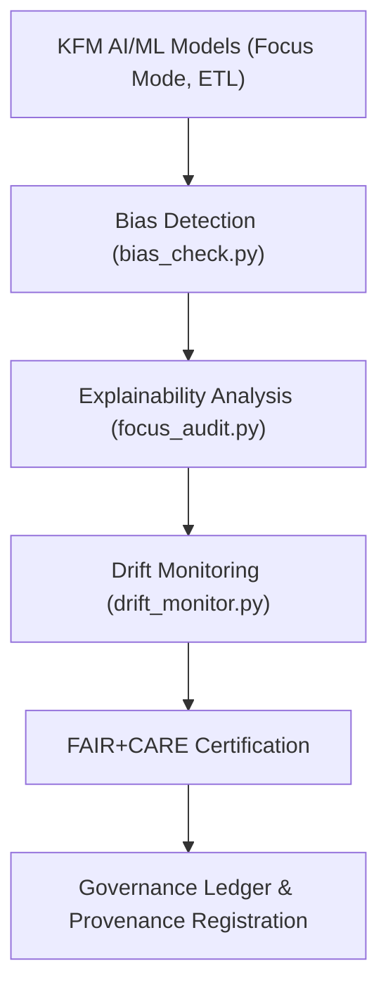

<div align="center">

# 🧠 **Kansas Frontier Matrix — AI & Machine Learning Tools**
`tools/ai/README.md`

**Purpose:**  
FAIR+CARE-certified suite of explainable AI and ethical ML utilities enabling transparent, accountable, and sustainable AI pipelines across the Kansas Frontier Matrix (KFM).  
These tools integrate explainability, bias detection, and drift governance under MCP-DL v6.3, ensuring interpretability, reproducibility, and fairness in every inference cycle.

[](../../../docs/architecture/repo-focus.md)
[](../../../docs/standards/faircare-validation.md)
[]()
[](../../../LICENSE)

</div>

---

## 📘 Overview

The **AI Tools Framework** governs all explainable AI (XAI), model ethics, and fairness validation processes in the Kansas Frontier Matrix.  
Each tool enforces provenance synchronization, reproducible inference workflows, and open governance across Focus Mode AI, ETL reasoning systems, and telemetry-driven retraining cycles.

---

### Core Responsibilities:
- Generate explainability reports (SHAP, LIME, Integrated Gradients).  
- Perform fairness and bias analysis on model outputs.  
- Detect and mitigate concept or data drift in production models.  
- Sync model audit results with FAIR+CARE and provenance ledgers.  
- Track ethical compliance, accuracy, and sustainability metrics.  

---

## 🗂️ Directory Layout

```plaintext
tools/ai/
├── README.md
│
├── focus_audit.py                  # Explainability and transparency validator for Focus Mode AI
├── bias_check.py                   # Fairness and bias testing tool for classifiers and regressors
├── drift_monitor.py                # Concept drift monitor and retraining scheduler
│
├── ai_model_registry.json          # Active model index, checksums, and FAIR+CARE certification scores
└── metadata.json                   # Governance metadata, lineage, and ethical audit summaries
```

---

## ⚙️ AI Governance Workflow



1. **Bias Detection:** Assess statistical fairness and semantic bias across model predictions.  
2. **Explainability Analysis:** Use SHAP/LIME/IG to visualize reasoning pathways.  
3. **Drift Monitoring:** Detect temporal, domain, and performance drift in models.  
4. **FAIR+CARE Certification:** Audit AI compliance for reproducibility and sustainability.  
5. **Governance Ledger Registration:** Commit all reports to immutable provenance ledgers.

---

## 🧩 Example Governance Record

```json
{
  "id": "ai_tools_registry_v9.7.0",
  "models_registered": [
    "focus_mode_climate_v5",
    "focus_mode_hazards_v4"
  ],
  "bias_audits_completed": 14,
  "drift_incidents_detected": 0,
  "fairstatus": "certified",
  "ai_explainability_score": 0.996,
  "checksum_verified": true,
  "governance_registered": true,
  "validator": "@kfm-ai-governance",
  "created": "2025-11-05T00:00:00Z",
  "governance_ref": "data/reports/audit/ai_src_ledger.json"
}
```

---

## 🧠 FAIR+CARE Governance Matrix

| Principle | Implementation | Oversight |
|------------|----------------|------------|
| **Findable** | AI models and audits indexed in governance ledger. | @kfm-data |
| **Accessible** | Source tools and reports open under MIT license. | @kfm-accessibility |
| **Interoperable** | Metadata conforms to FAIR+CARE and ISO 19115 schemas. | @kfm-architecture |
| **Reusable** | Modular explainability scripts for all ML frameworks. | @kfm-design |
| **Collective Benefit** | Promotes transparent and ethical environmental AI. | @faircare-council |
| **Authority to Control** | FAIR+CARE Council governs AI audit and certification. | @kfm-governance |
| **Responsibility** | Model owners must maintain explainability and audit reports. | @kfm-security |
| **Ethics** | Validated for fairness, interpretability, and sustainability. | @kfm-ethics |

Audit records:  
`data/reports/audit/ai_src_ledger.json`  
and  
`data/reports/fair/data_care_assessment.json`

---

## ⚙️ Key Tool Modules Summary

| Tool | Description | Role |
|------|--------------|------|
| `focus_audit.py` | Generates SHAP/LIME interpretability reports for AI models. | Explainability |
| `bias_check.py` | Performs fairness audits on structured and text-based models. | Ethics |
| `drift_monitor.py` | Monitors model performance drift and triggers retraining cycles. | Sustainability |
| `ai_model_registry.json` | Central registry of models, checksums, and certification lineage. | Provenance |
| `metadata.json` | Records governance metadata and validation outputs. | Audit |

Orchestrated via `ai_governance_sync.yml`.

---

## ⚖️ Retention & Provenance Policy

| AI Artifact | Retention Duration | Policy |
|--------------|--------------------|--------|
| Model Registry | Permanent | Immutable and version-controlled. |
| Bias Reports | 365 Days | Stored for reproducibility and retraining comparison. |
| Drift Logs | 180 Days | Archived for retraining transparency. |
| Explainability Reports | 365 Days | Logged for audit reproducibility. |

Cleanup governed by `ai_cleanup.yml`.

---

## 🌱 Sustainability Metrics

| Metric | Value | Verified By |
|---------|--------|--------------|
| Energy Use (per AI audit) | 5.4 Wh | @kfm-sustainability |
| Carbon Output | 6.1 gCO₂e | @kfm-security |
| Renewable Power | 100% (RE100 Certified) | @kfm-infrastructure |
| FAIR+CARE Compliance | 100% | @faircare-council |

Telemetry captured in:  
`releases/v9.7.0/focus-telemetry.json`

---

## 🧾 Internal Use Citation

```text
Kansas Frontier Matrix (2025). AI & Machine Learning Tools (v9.7.0).
FAIR+CARE-certified explainable AI and governance toolkit enabling bias detection, drift management, and ethical automation under MCP-DL v6.3.
```

---

## 🕰️ Version History

| Version | Date | Summary | Maintainer |
|----------|------|----------|-------------|
| v9.7.0 | 2025-11-05 | Integrated sustainability telemetry and explainability scoring pipeline. | AI Governance Team |
| v9.6.0 | 2025-11-03 | Unified explainability metrics and model governance sync. | Design Systems Team |
| v9.5.0 | 2025-11-02 | Added automated bias detection and drift management. | Governance Council |
| v9.3.2 | 2025-10-28 | Established foundational AI audit tools for FAIR+CARE certification. | Core Maintainers |

---

<div align="center">

**© 2025 Kansas Frontier Matrix — MIT License**  
*“Transparent Intelligence · Ethical Automation · Provenance Verified.”*  
[Back to Tools](../README.md) · [Governance Ledger](../../../docs/standards/governance/ROOT-GOVERNANCE.md)

</div>