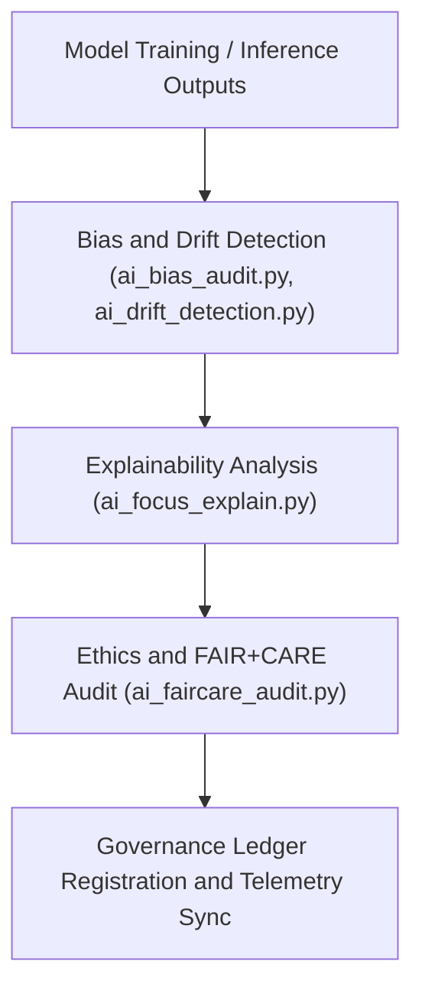

<div align="center">

# 🧠 Kansas Frontier Matrix — **AI Governance Tools**
`tools/ai/README.md`

**Purpose:**  
FAIR+CARE-governed suite of **AI auditing, bias detection, explainability, and ethics monitoring tools** for all machine learning and automation components within the Kansas Frontier Matrix (KFM).  
These utilities ensure all AI pipelines meet **ethical transparency, interpretability, and accountability** standards as defined by MCP-DL v6.3.

[](../../../docs/standards/faircare-validation.md)
[](../../../LICENSE)
[](../../../docs/architecture/repo-focus.md)

</div>

---

## 📚 Overview

The `tools/ai/` directory provides the **auditing, validation, and explainability frameworks** used by KFM’s AI components.  
It enables continuous oversight of models performing OCR, NLP, hazard prediction, climate analytics, and FAIR+CARE validation through transparent, explainable, and reproducible evaluations.

### Core Responsibilities
- Perform explainable AI (XAI) analysis using SHAP, LIME, and counterfactual modeling.  
- Detect bias and drift in AI model predictions and training data.  
- Generate FAIR+CARE ethics reports for AI behavior and transparency.  
- Synchronize results with the KFM governance ledger and AI ethics registry.  

---

## 🗂️ Directory Layout

```plaintext
tools/ai/
├── README.md                              # This file — documentation for AI Governance Tools
│
├── ai_bias_audit.py                       # Bias detection tool for AI datasets and models
├── ai_drift_detection.py                  # Detects data or model drift between validation cycles
├── ai_focus_explain.py                    # Focus Mode AI explainability and interpretability engine
├── ai_faircare_audit.py                   # AI ethics and FAIR+CARE compliance validator
├── ai_metrics_report.json                 # Performance, bias, and interpretability report
└── metadata.json                          # Governance and provenance metadata
```

---

## ⚙️ AI Governance Workflow



### Workflow Description
1. **Bias Detection:** Evaluate datasets and model outputs for representational fairness.  
2. **Drift Monitoring:** Identify data or concept drift across training and deployment cycles.  
3. **Explainability Audit:** Generate interpretability insights using AI explainability frameworks.  
4. **Ethics Validation:** Conduct FAIR+CARE ethics certification on all model outcomes.  
5. **Governance Sync:** Register AI audit results in blockchain-backed governance ledgers.  

---

## 🧩 Example AI Governance Record

```json
{
  "id": "ai_governance_tools_v9.5.0_2025Q4",
  "tools_executed": [
    "ai_bias_audit.py",
    "ai_drift_detection.py",
    "ai_focus_explain.py"
  ],
  "models_monitored": [
    "focus-climate-v4",
    "kfm-hazards-ai-v3"
  ],
  "bias_detected": false,
  "drift_score": 0.02,
  "ai_explainability_score": 0.987,
  "faircare_certified": true,
  "governance_registered": true,
  "telemetry_ref": "releases/v9.5.0/focus-telemetry.json",
  "governance_ref": "reports/audit/ai_tools_ledger.json",
  "created": "2025-11-02T23:59:00Z",
  "validator": "@kfm-ai-governance"
}
```

---

## 🧠 FAIR+CARE Governance Matrix

| Principle | Implementation |
|------------|----------------|
| **Findable** | AI audits indexed by model name, version, and governance record ID. |
| **Accessible** | Reports stored in open JSON format and registered in governance ledgers. |
| **Interoperable** | Conforms to AI governance frameworks (ISO/IEC 42001, EU AI Act draft). |
| **Reusable** | FAIR+CARE certification ensures reproducible AI ethics compliance. |
| **Collective Benefit** | Encourages transparency and trust in public data-driven AI systems. |
| **Authority to Control** | FAIR+CARE Council validates bias, drift, and ethics outcomes. |
| **Responsibility** | Validators record explainability and governance linkage for all audits. |
| **Ethics** | AI decision-making reviewed for fairness, inclusivity, and non-discrimination. |

Governance and audit results stored in:  
`reports/audit/ai_tools_ledger.json` • `reports/fair/ai_tools_summary.json`

---

## ⚙️ AI Tools & Validation Artifacts

| File | Description | Format |
|------|--------------|--------|
| `ai_bias_audit.py` | Detects representational bias in model datasets and predictions. | Python |
| `ai_drift_detection.py` | Evaluates model drift and performance degradation over time. | Python |
| `ai_focus_explain.py` | Provides model interpretability via SHAP/LIME for Focus Mode dashboards. | Python |
| `ai_faircare_audit.py` | Validates model ethics and FAIR+CARE compliance. | Python |
| `ai_metrics_report.json` | Aggregated metrics, fairness scores, and explainability evaluations. | JSON |
| `metadata.json` | Provenance and governance metadata linking audits to models. | JSON |

Automation governed by `ai_tools_sync.yml`.

---

## 🧾 Retention Policy

| Tool Type | Retention Duration | Policy |
|------------|--------------------|--------|
| AI Audit Reports | 365 days | Retained for governance traceability. |
| FAIR+CARE Reports | Permanent | Stored for AI ethics certification and transparency. |
| Drift Detection Logs | 90 days | Archived post governance review. |
| Metadata | Permanent | Preserved for lineage and reproducibility. |

Cleanup automated via `ai_tools_cleanup.yml`.

---

## 🧾 Internal Use Citation

```text
Kansas Frontier Matrix (2025). AI Governance Tools (v9.5.0).
FAIR+CARE-certified suite for AI bias auditing, drift detection, and explainability assurance.
Ensures transparent, ethical, and reproducible AI governance under MCP-DL v6.3 compliance.
```

---

## 🧾 Version Notes

| Version | Date | Notes |
|----------|------|--------|
| v9.5.0 | 2025-11-02 | Added FAIR+CARE AI ethics validator and drift detection audit automation. |
| v9.3.2 | 2025-10-28 | Improved explainability logging and provenance integration. |
| v9.3.0 | 2025-10-26 | Established AI Governance Tools workspace for ethics and accountability audits. |

---

<div align="center">

**Kansas Frontier Matrix** · *AI Transparency × FAIR+CARE Ethics × Provenance Integrity*  
[🔗 Repository](https://github.com/bartytime4life/Kansas-Frontier-Matrix) • [🧭 Docs Portal](../../../docs/) • [⚖️ Governance Ledger](../../../docs/standards/governance/)

</div>