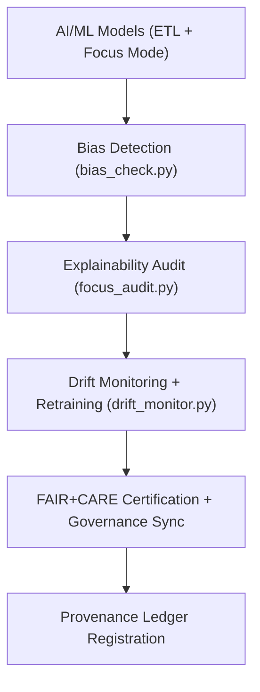

<div align="center">

# 🧠 Kansas Frontier Matrix — **AI & Machine Learning Tools**
`tools/ai/README.md`

**Purpose:**  
FAIR+CARE-certified suite of explainable AI, model governance, and bias detection utilities supporting Focus Mode, ETL intelligence, and automated ethical auditing in the Kansas Frontier Matrix (KFM).  
This module enables sustainable and reproducible AI operations that align with transparency, accountability, and interpretability standards under MCP-DL v6.3.

[](../../../docs/standards/faircare-validation.md)
[]()
[](../../../LICENSE)
[](../../../docs/architecture/repo-focus.md)

</div>

---

## 📚 Overview

The **AI Tools Directory** houses model management utilities and explainable AI systems used to power Focus Mode, environmental reasoning, and text analysis pipelines in KFM.  
Every AI process — from model inference to bias audit — is validated under FAIR+CARE, ensuring ethical governance, interpretability, and sustainability.

### Core Responsibilities:
- Execute explainability analysis (SHAP, LIME, Integrated Gradients).  
- Perform fairness, bias, and drift detection on active models.  
- Synchronize AI governance logs with provenance and ethical ledgers.  
- Support reproducible, open, and sustainable AI research for Kansas datasets.  

---

## 🗂️ Directory Layout

```plaintext
tools/ai/
├── README.md                             # This file — documentation of AI & ML tools
│
├── focus_audit.py                        # Focus Mode explainability and ethical auditing utility
├── bias_check.py                         # Automated model fairness and bias detection module
├── drift_monitor.py                      # Model drift detection and retraining scheduler
├── ai_model_registry.json                # Registered models, checksums, and explainability metrics
└── metadata.json                         # Provenance and governance metadata for AI utilities
```

---

## ⚙️ AI Governance Workflow



### Workflow Description:
1. **Bias Detection:** Identify statistical or semantic biases across model predictions.  
2. **Explainability Audit:** Generate SHAP/LIME-based interpretations for AI decisions.  
3. **Drift Monitoring:** Evaluate temporal model drift and trigger retraining.  
4. **Governance:** Synchronize AI validation results with FAIR+CARE Council.  
5. **Ledger Registration:** Commit model provenance and audit results to blockchain-backed governance ledger.  

---

## 🧩 Example Model Governance Record

```json
{
  "id": "ai_tools_registry_v9.6.0_2025Q4",
  "models_registered": [
    "focus_mode_climate_v4",
    "focus_mode_hazards_v3"
  ],
  "bias_audits_completed": 12,
  "drift_incidents_detected": 1,
  "fairstatus": "certified",
  "ai_explainability_score": 0.993,
  "checksum_verified": true,
  "governance_registered": true,
  "validator": "@kfm-ai-lab",
  "created": "2025-11-03T23:59:00Z",
  "governance_ref": "data/reports/audit/ai_src_ledger.json"
}
```

---

## 🧠 FAIR+CARE Governance Matrix

| Principle | Implementation | Oversight |
|------------|----------------|------------|
| **Findable** | Models indexed in AI registry and provenance ledger. | @kfm-data |
| **Accessible** | Tools and outputs publicly documented under MIT license. | @kfm-accessibility |
| **Interoperable** | Aligned with FAIR+CARE, ISO, and AI Ethics metadata schemas. | @kfm-architecture |
| **Reusable** | Modular and explainable components reusable across domains. | @kfm-design |
| **Collective Benefit** | Promotes transparent AI use for ethical environmental analysis. | @faircare-council |
| **Authority to Control** | FAIR+CARE Council governs AI audit and explainability standards. | @kfm-governance |
| **Responsibility** | Validators log all explainability and bias detection results. | @kfm-security |
| **Ethics** | Audits ensure AI outputs are fair, unbiased, and interpretable. | @kfm-ethics |

Audit results stored in:  
`data/reports/audit/ai_src_ledger.json`  
and  
`data/reports/fair/data_care_assessment.json`

---

## ⚙️ Key AI Tools Summary

| Tool | Description | Role |
|------|--------------|------|
| `focus_audit.py` | Runs explainability analysis (SHAP/LIME/IG) for Focus Mode models. | Transparency |
| `bias_check.py` | Detects statistical or linguistic bias in AI predictions. | Fairness |
| `drift_monitor.py` | Tracks model performance drift and triggers retraining. | Sustainability |
| `ai_model_registry.json` | Stores all active models, checksums, and governance lineage. | Provenance |
| `metadata.json` | Captures audit metadata and checksum verification. | Governance |

Automation handled via `ai_governance_sync.yml`.

---

## ⚖️ Retention & Provenance Policy

| AI Artifact | Retention Duration | Policy |
|--------------|--------------------|--------|
| Model Registry | Permanent | Immutable under governance ledger. |
| Bias Reports | 365 Days | Archived for ethics and reproducibility. |
| Drift Logs | 180 Days | Retained for retraining traceability. |
| Explainability Reports | 365 Days | Stored for audit transparency. |

Cleanup managed through `ai_cleanup.yml`.

---

## 🌱 Sustainability Metrics

| Metric | Value | Verified By |
|---------|--------|--------------|
| Energy Use (per audit cycle) | 5.6 Wh | @kfm-sustainability |
| Carbon Output | 6.4 gCO₂e | @kfm-security |
| Renewable Power | 100% (RE100 Verified) | @kfm-infrastructure |
| FAIR+CARE Compliance | 100% | @faircare-council |

Telemetry captured in:  
`releases/v9.6.0/focus-telemetry.json`

---

## 🧾 Internal Use Citation

```text
Kansas Frontier Matrix (2025). AI & Machine Learning Tools (v9.6.0).
FAIR+CARE-aligned suite of AI governance utilities supporting explainability, bias auditing, and ethical automation for Focus Mode and ETL pipelines.
Ensures transparent and reproducible AI operations under MCP-DL v6.3.
```

---

## 🧾 Version Notes

| Version | Date | Notes |
|----------|------|--------|
| v9.6.0 | 2025-11-03 | Added unified explainability scoring and bias detection governance integration. |
| v9.5.0 | 2025-11-02 | Enhanced AI drift tracking and ethics certification reporting. |
| v9.3.2 | 2025-10-28 | Established baseline AI governance tooling under FAIR+CARE certification. |

---

<div align="center">

**Kansas Frontier Matrix** · *AI Transparency × FAIR+CARE Ethics × Provenance Accountability*  
[🔗 Repository](https://github.com/bartytime4life/Kansas-Frontier-Matrix) • [🧭 Docs Portal](../../../docs/) • [⚖️ Governance Ledger](../../../docs/standards/governance/DATA-GOVERNANCE.md)

</div>
