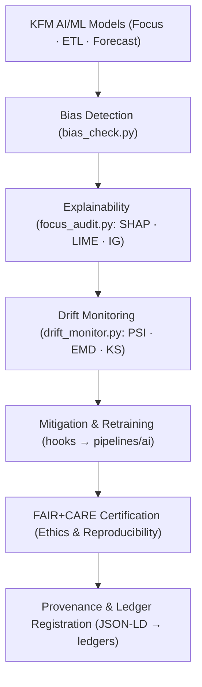

<div align="center">

# 🧠 **Kansas Frontier Matrix — AI & Machine Learning Tools**  
`tools/ai/README.md`

**Purpose:**  
FAIR+CARE-certified suite of explainable AI and ethical ML utilities enabling transparent, accountable, and sustainable AI pipelines across the Kansas Frontier Matrix (KFM).  
Integrates explainability, bias detection, and drift governance under **MCP-DL v6.3**, ensuring interpretability, reproducibility, and fairness in every training and inference cycle.

[](../../../docs/README.md)
[](../../../docs/standards/faircare.md)
[]()
[](../../../LICENSE)

</div>

---

## 📘 Overview

The **AI Tools Framework** governs explainable AI (XAI), fairness auditing, drift monitoring, and sustainability metrics for model governance within KFM.  
Each tool enforces provenance synchronization, deterministic pipelines, and **FAIR+CARE** ethics reporting across **Focus Mode AI**, **remote-sensing ETL models**, and **time-series forecasters**.

**v10.2.2 Enhancements**
- Expanded **SHAP/LIME/IG** support with standardized JSON export for model cards.  
- New **data & concept drift** detectors (population stability index, EMD) plus auto-retrain hooks.  
- Integrated **energy/CO₂e** metering per audit; aggregated in `focus-telemetry.json`.  
- JSON-LD contexts for all governance exports to link ledger entries and citations.

---

## 🗂️ Directory Layout

```plaintext
tools/ai/
├── README.md
│
├── focus_audit.py                  # Explainability & transparency validator for Focus Mode AI
├── bias_check.py                   # Fairness & bias analysis for classifiers/regressors
├── drift_monitor.py                # Concept/data drift monitoring & retraining scheduler
│
├── ai_model_registry.json          # Active model index, checksums, licenses, FAIR+CARE lineage
└── metadata.json                   # Governance metadata & explainability audit summaries (JSON-LD)
```

---

## ⚙️ AI Governance Workflow



1. **Bias Detection:** Statistical parity, disparate impact ratio, equalized odds, subgroup analysis.  
2. **Explainability:** Per-feature SHAP values, LIME local explanations, Integrated Gradients for deep nets; “Why this?” evidence.  
3. **Drift Monitoring:** Time-windowed PSI/KS, EMD for distribution shift; model/perf drift with alert thresholds.  
4. **Mitigation:** Auto-suggest reweighting, threshold tuning, or retrain job trigger.  
5. **Certification:** Generate FAIR+CARE audit bundle, energy/CO₂e report, and attach SPDX license notes.  
6. **Registration:** Append audit artifacts to immutable governance ledger with commit SHA and dataset IDs.

---

## 🧩 Example Governance Record

```json
{
  "@context": "https://schema.org/",
  "@type": "Dataset",
  "id": "ai_tools_registry_v10.2.2",
  "models_registered": ["focus_mode_climate_v7", "landcover_unet_v4"],
  "bias_audits_completed": 24,
  "drift_events_detected": 1,
  "drift_last_event": "2025-11-08T19:12:03Z",
  "fairstatus": "certified",
  "ai_explainability_score": 0.996,
  "checksum_verified": true,
  "governance_registered": true,
  "validator": "@kfm-ai-governance",
  "created": "2025-11-12T00:00:00Z",
  "governance_ref": "docs/reports/audit/ai_src_ledger.json"
}
```

---

## 🧠 FAIR+CARE Governance Matrix

| Principle | Implementation | Oversight |
|---|---|---|
| **Findable** | Model registry + audits indexed in ledgers; JSON-LD exports. | @kfm-data |
| **Accessible** | MIT-licensed tooling; human-readable reports & machine JSON. | @kfm-accessibility |
| **Interoperable** | DCAT 3.0/JSON-LD for audits; SPDX for licenses; STAC links to data. | @kfm-architecture |
| **Reusable** | Modular explainers (TF, PT, SK); pinned env; model cards. | @kfm-design |
| **Collective Benefit** | Transparent, sustainable environmental & historical AI. | @faircare-council |
| **Authority to Control** | Council gates audits & certification sign-off. | @kfm-governance |
| **Responsibility** | Owners maintain bias/explainability/drift logs. | @kfm-security |
| **Ethics** | CARE filters, consent cues, sensitive-use constraints. | @kfm-ethics |

**Audit references:**  
`docs/reports/audit/ai_src_ledger.json` · `reports/audit/ai_model_faircare.json`

---

## 🔧 Key Utilities

| Tool | Description | Role |
|---|---|---|
| `focus_audit.py` | Batch & on-demand SHAP/LIME/IG generation + evidence pack. | Explainability |
| `bias_check.py` | Fairness testing (PAR, DI, EO), subgroup & intersectional analysis. | Ethics |
| `drift_monitor.py` | PSI/KS/EMD drift scoring; triggers `pipelines/ai` retrain hooks. | Sustainability |
| `ai_model_registry.json` | Model names, versions, hashes, data lineage, licenses. | Provenance |
| `metadata.json` | Audit summaries with JSON-LD context & ledger pointers. | Governance |

Automation: **`ai_governance_sync.yml`** (collect → validate → export → ledger).

---

## 📊 Sustainability & Telemetry

| Metric | Target (per audit) | Captured In |
|---|---:|---|
| Energy (Wh) | ≤ 6.0 | `focus-telemetry.json` |
| CO₂e (g) | ≤ 7.0 | `focus-telemetry.json` |
| Runtime (s) | SLA-bounded by workflow | CI artifacts |
| Hardware class | Declared (CPU/GPU) | Audit bundle |

> Telemetry aggregates under `../../../releases/v10.2.0/focus-telemetry.json` with commit, model, and dataset IDs.

---

## ⚖️ Retention & Provenance Policy

| Artifact | Retention | Policy |
|---|---:|---|
| Model Registry | Permanent | Immutable in governance ledger |
| Bias Reports | 365 days | Renewable upon re-audit |
| Drift Logs | 180 days | Sliding window for retrain decisions |
| Explainability Packs | 365 days | Linked to model card & release |

Cleanup handled via **`ai_cleanup.yml`**.

---

## 🧾 Model Card Hook (Required)

All model updates must include a model card (see `docs/templates/model_card.md`) with:
- Task & context, datasets, licenses, and consent notes  
- Training params, metrics (incl. subgroup metrics)  
- Limitations/risks, environmental footprint (energy/CO₂e)  
- Links: registry entry, audit reports, STAC/DCAT datasets

---

## 🧪 Quick Start (Local)

```bash
# Create venv and install deps
python -m venv .venv && source .venv/bin/activate
pip install -r requirements.txt

# Run an explainability audit
python tools/ai/focus_audit.py --model focus_mode_climate_v7 --dataset data/processed/... --out reports/audit/focus_climate_v7_explain.json

# Bias check
python tools/ai/bias_check.py --pred preds.csv --labels labels.csv --groups groups.csv --out reports/audit/fairness_report.json

# Drift monitor (one-off)
python tools/ai/drift_monitor.py --window 90d --source data/processed/... --out reports/audit/drift_summary.json
```

---

## 🕰️ Version History

| Version | Date | Summary | Maintainer |
|---|---|---|---|
| v10.2.2 | 2025-11-12 | Aligned to v10.2: JSON-LD exports, expanded drift metrics, energy/CO₂e gating, standardized evidence packs. | AI Governance Team |
| v10.0.0 | 2025-11-10 | Telemetry schema v2; extended FAIR+CARE explainability fields; registry hardening. | AI Governance Team |
| v9.7.0 | 2025-11-05 | Added sustainability telemetry + improved explainability scoring. | AI Governance Team |
| v9.6.0 | 2025-11-03 | Unified explainability metrics and governance sync. | Design Systems Team |
| v9.5.0 | 2025-11-02 | Introduced bias detection + drift management for production models. | Governance Council |

---

<div align="center">

**Kansas Frontier Matrix** — *Transparent Intelligence × Ethical Automation × Provenance Verified*  
© 2025 Kansas Frontier Matrix — MIT License  

[Back to Tools Index](../README.md) · [Governance Charter](../../../docs/standards/governance/ROOT-GOVERNANCE.md)

</div>