<div align="center">

# 🧠 **Kansas Frontier Matrix — AI & Machine Learning Tools (v11)**  
`tools/ai/README.md`

**Purpose**  
Define the **FAIR+CARE-certified AI & ML governance toolkit** for the Kansas Frontier Matrix (KFM) — covering explainability, bias detection, drift monitoring, sustainability metrics, and provenance binding for all AI/ML workloads:

- Focus Mode v3  
- Story Node v3 generation  
- Climate & hydrology models  
- Remote-sensing models  
- Time-series forecasters  

All tools comply with:

- **MCP-DL v6.3** (documentation-first)  
- **KFM-MDP v11.2.2** (markdown + metadata protocol)  
- **FAIR+CARE** (ethics & sovereignty)  
- **KFM-OP v11.0** (ontology alignment)  
- **Diamond⁹ Ω / Crown∞Ω** reliability and governance standards  

[]() ·
[]() ·
[]() ·
[]()

</div>

---

## 📘 1. Overview

The **AI Tools Framework** under `tools/ai/` governs:

- **Explainable AI (XAI)** — SHAP, LIME, Integrated Gradients, attention maps, evidence bundles  
- **Fairness & bias audits** — statistical parity, equalized odds, subgroup metrics, intersectional analysis  
- **Drift monitoring** — distributional & conceptual drift (features and outputs)  
- **Sustainability telemetry** — energy and carbon metrics for AI workloads  
- **Governance & provenance** — JSON-LD exports, ledger integration, model registry, and OpenLineage events  

These tools are invoked by:

- CI/CD workflows (`.github/workflows/*`)  
- Autonomous pipelines (`src/pipelines/ai/**`)  
- Governance workflows (`tools/governance/**`)  
- Operators via CLI (`tools/cli/**`)  

No AI pipeline can be **certified for production** unless AI Tools audits pass and are recorded in the governance ledgers.

---

## 🗂️ 2. Directory Layout (Emoji Style A)

```text
tools/
└── 🧠 ai/
    ├── 📄 README.md                 # This file
    │
    ├── 🧪 focus_audit.py            # Explainability & transparency validator for Focus Mode / Story Nodes
    ├── ⚖️ bias_check.py             # Fairness & bias analysis (classification/regression)
    ├── 🌡️ drift_monitor.py          # Data & concept drift detection and alert hooks
    │
    ├── 📚 ai_model_registry.json    # Active model registry: versions, hashes, datasets, licenses, CARE labels
    └── 📑 metadata.json             # JSON-LD config: audit thresholds, CARE profiles, telemetry config
```

Each file must:

- Be deterministic and idempotent where possible  
- Be safe to run in CI, staging, and offline audit environments  
- Be configurable via `metadata.json` and data contracts  

---

## 🧬 3. AI Governance Workflow (v11)

```mermaid
flowchart TD
    A["KFM AI/ML Models\n(Focus · ETL · Forecast · Remote Sensing)"]
      --> B["⚖️ bias_check.py\nBias & Fairness Validation"]
    B --> C["🧪 focus_audit.py\nExplainability (SHAP · LIME · IG · Attention)"]
    C --> D["🌡️ drift_monitor.py\nData & Concept Drift Detection"]
    D --> E["Mitigation Hooks\n(retrain · reweight · thresholds)"]
    E --> F["FAIR+CARE Certification\nEthics · A11y · Sovereignty Gates"]
    F --> G["🏛 Governance + 📡 Telemetry\nJSON-LD → Ledgers · Telemetry · Model Registry"]
```



The workflow:

1. **Bias & fairness** — run `bias_check.py` on relevant models.  
2. **Explainability** — generate/validate XAI artifacts with `focus_audit.py`.  
3. **Drift monitoring** — run `drift_monitor.py` over sliding windows.  
4. **Mitigation** — flag or trigger retraining and risk mitigations.  
5. **Certification** — produce FAIR+CARE decisions.  
6. **Governance integration** — push results into ledgers and telemetry.

---

## ⚙️ 4. Stage Responsibilities

### 4.1 Bias Detection (`bias_check.py`)

- Computes fairness metrics such as:
  - Statistical Parity Difference  
  - Disparate Impact  
  - Equalized Odds & Equal Opportunity  
  - Subgroup-specific error rates  

- Supports:
  - Multiple protected attributes  
  - Intersectional analysis  
  - Domain-specific fairness thresholds  

Outputs:

- Per-model bias metrics and PASS/WARN/FAIL flags.  
- Structured JSON for each run, suitable for ingestion into governance and telemetry.

---

### 4.2 Explainability (`focus_audit.py`)

- Generates or verifies explainability artifacts for:

  - Focus Mode v3 models (e.g., narrative transformers)  
  - Remote-sensing models (e.g., segmentation/classification networks)  
  - Tabular time-series models (e.g., hydrology, climate predictors)  

- Supports:

  - SHAP (global and local importance)  
  - LIME (local explanations)  
  - Integrated Gradients for deep networks  
  - Attention maps and saliency overlays (if applicable)  

- Ensures:

  - Explanations match the **current** model weights and dataset versions.  
  - Explanations are stored in **versioned artifact paths**, referenced in `ai_model_registry.json`.  

---

### 4.3 Drift Monitoring (`drift_monitor.py`)

- Monitors:

  - **Data drift** — population stability index, KL/JS divergence, KS tests for key features.  
  - **Prediction drift** — distribution changes in predictions across time windows.  
  - **Concept drift** — systematic performance changes on evaluation sets.  

- Emits:

  - Drift scores per feature/model  
  - Flags for moderate vs severe drift  
  - Suggested actions: `monitor`, `recalibrate`, `retrain`, or `retire`  

Any **severe drift** must be:

- Logged in drift-ledger outputs  
- Escalated to governance; optionally block further usage until mitigated.

---

## 📚 5. AI Model Registry (`ai_model_registry.json`)

The model registry is the **authoritative listing** of AI/ML models governed by KFM.

Typical fields:

- `model_id` — stable model identifier  
- `version` — semantic version of the model  
- `architecture` — string (e.g., `transformer_encoder_v3`, `lstm_hydro_v8`)  
- `datasets` — list of dataset IDs used for training/eval (STAC/DCAT-linked)  
- `license` — model license (if applicable)  
- `care_label` — CARE classification (e.g., `public`, `restricted`, `not_for_decisions`)  
- `model_card_ref` — path/URI to model card  
- `last_bias_audit` — timestamp + ref to `bias_check` report  
- `last_explainability_audit` — timestamp + ref to `focus_audit` report  
- `last_drift_check` — timestamp + ref to `drift_monitor` report  
- `energy_training_wh` / `carbon_training_gco2e` — training sustainability metrics  
- `deployment_status` — `experimental`, `internal`, `production`, `retired`  

Updates:

- Must be performed via governed flows (CI/CLI, not manual editing).  
- Must be referenced in governance and telemetry bundles.

---

## 🧾 6. Example AI Governance Record (v11)

```json
{
  "@context": "https://schema.org/",
  "@type": "Dataset",
  "id": "ai_tools_registry_v11.0.0",
  "models_registered": [
    "focus_mode_v3_climate_v11",
    "hydrology_lstm_v8"
  ],
  "bias_audits_completed": 36,
  "drift_events_detected": 2,
  "last_drift_event": "2025-11-18T19:12:03Z",
  "fairstatus": "certified",
  "ai_explainability_score": 0.997,
  "checksum_verified": true,
  "governance_registered": true,
  "telemetry_logged": true,
  "energy_wh": 7.4,
  "carbon_gco2e": 8.2,
  "validator": "@kfm-ai-governance",
  "created": "2025-11-24T00:00:00Z",
  "governance_ref": "data/reports/audit/ai_hazards_ledger.json"
}
```

---

## 🧠 7. FAIR+CARE Governance Matrix (AI Tools)

| Principle               | Implementation                                                         | Oversight          |
|-------------------------|-------------------------------------------------------------------------|--------------------|
| **Findable**            | Model registry & audit logs with stable IDs & JSON-LD contexts         | `@kfm-data`        |
| **Accessible**          | Open reports + model cards under MIT; human- & machine-readable        | `@kfm-accessibility` |
| **Interoperable**       | JSON-LD, DCAT 3.0, STAC, SPDX, PROV-O compatible outputs               | `@kfm-architecture` |
| **Reusable**            | Versioned configs, pinned models, deterministic pipelines              | `@kfm-design`      |
| **Collective Benefit**  | Supports responsible, context-aware use of AI in environmental/cultural work | `@faircare-council` |
| **Authority to Control**| FAIR+CARE Council dictates which models can be used where/how          | `@kfm-governance`  |
| **Responsibility**      | Audit logs and sustainability metrics attach responsibility to owners   | `@kfm-security`    |
| **Ethics**              | Sensitive topics flagged; models blocked when fairness or drift fails  | `@kfm-ethics`      |

---

## 🌱 8. Sustainability & Telemetry Integration

For each AI job or audit, the AI tools must emit:

- `energy_wh` — estimated energy for training/eval/audit  
- `carbon_gco2e` — estimated carbon footprint  
- `runtime_ms` — runtime of the job  
- `ai_bias_score` — compact fairness/bias metric  
- `ai_explainability_score` — coverage/quality metric for XAI artifacts  
- `ai_drift_score` — aggregated drift indicator  

These metrics are forwarded to:

```text
../../../releases/v11.2.2/focus-telemetry.json
docs/reports/telemetry/ai/*.json
```

and help KFM:

- Track the cost of AI and compare alternatives.  
- Support climate-related sustainability reporting.  
- Provide explainable context to governance bodies and users.

---

## ⚖️ 9. Retention & Provenance Policy

| Artifact              | Retention | Notes                                      |
|-----------------------|-----------|--------------------------------------------|
| Bias Reports          | 365 days  | Used for re-certification & audits         |
| Drift Logs            | 180 days  | Rolling horizon for retraining decisions   |
| Explainability Bundles| 365 days  | Linked from model cards & stories          |
| Registry Snapshots    | Permanent | Immutable; used for long-term audits       |
| Governance Entries    | Permanent | Append-only in `data/reports/audit/**`     |

Cleanup is handled by AI-focused CI workflows:

- `ai_cleanup.yml` — rotates short-lived logs, preserves canonical artifacts.

---

## 🛡 10. Security & Privacy Constraints

AI Tools MUST:

- Avoid logging raw input data (especially PII or sensitive imagery) into governance/audit logs.  
- Log only:
  - Derived statistics  
  - IDs / hashed references to data  
  - Metadata safe for long-term archival.  

- Not attempt to override or weaken CARE/sovereignty policies.  
- Fail **closed** when encountering unexpected or ambiguous metadata.  

---

## 🧪 11. Example Local/CI Usage

```bash
# Setup environment
python -m venv .venv
source .venv/bin/activate
pip install -r requirements-tools-ai.txt

# Run fairness audit locally
python tools/ai/bias_check.py \
  --model-id focus_mode_v3_climate_v11 \
  --dataset-id climate_streams_v4 \
  --config configs/ai/focus_bias.yml \
  --out docs/reports/audit/focus_v3_bias_report.json

# Run explainability audit
python tools/ai/focus_audit.py \
  --model-id focus_mode_v3_climate_v11 \
  --dataset-id climate_streams_v4 \
  --out docs/reports/audit/focus_v3_explainability.json

# Run drift monitoring
python tools/ai/drift_monitor.py \
  --model-id hydrology_lstm_v8 \
  --window 90d \
  --out docs/reports/audit/hydro_lstm_drift_summary.json
```

In CI, these are orchestrated via:

- `ai_governance.yml`  
- `ai_validation.yml`  
- `ai_telemetry.yml`  

---

## 🕰 12. Version History

| Version | Date       | Summary                                                                                                                                 |
|--------:|-----------:|-----------------------------------------------------------------------------------------------------------------------------------------|
| v11.2.2 | 2025-11-27 | Upgraded to KFM-MDP v11.2.2; applied emoji directory layout; clarified bias/explainability/drift roles; tightened governance and telemetry links. |
| v11.0.0 | 2025-11-24 | Full KFM v11 upgrade; telemetry v4; AI governance integration with tools/ci and tools/governance; unbroken fences and enriched semantics. |
| v10.2.2 | 2025-11-12 | JSON-LD exports; extended drift metrics; energy/CO₂ logging; standardized explainability bundles.                                     |
| v10.0.0 | 2025-11-10 | Telemetry v2 schema; FAIR+CARE explainability fields; registry hardening.                                                               |
| v9.7.0  | 2025-11-05 | Added sustainability telemetry and improved explainability scoring.                                                                     |
| v9.6.0  | 2025-11-03 | Unified explainability metrics and governance sync.                                                                                     |
| v9.5.0  | 2025-11-02 | Introduced bias detection and drift management for production models.                                                                   |

---

<div align="center">

© 2025 Kansas Frontier Matrix — MIT License  
🧠 AI & ML Tools v11.2.2 · FAIR+CARE Certified · MCP-DL v6.3 · Diamond⁹ Ω / Crown∞Ω  

[⬅️ Back to Tools Index](../README.md) · [🧱 Tools Architecture](../ARCHITECTURE.md) · [🛡 Governance Charter](../../../docs/standards/governance/ROOT-GOVERNANCE.md)

</div>