<div align="center">

# 🧠 **Kansas Frontier Matrix — AI & Machine Learning Tools**
`tools/ai/README.md`

**Purpose:**  
FAIR+CARE-certified suite of explainable AI and ethical ML utilities enabling transparent, accountable, and sustainable AI pipelines across the Kansas Frontier Matrix (KFM).  
Integrates explainability, bias detection, and drift governance under **MCP-DL v6.3**, ensuring interpretability, reproducibility, and fairness in every inference cycle.

[](../../../docs/architecture/repo-focus.md)
[](../../../docs/standards/faircare-validation.md)
[]()
[](../../../LICENSE)

</div>

---

## 📘 Overview

The **AI Tools Framework** governs all explainable AI (XAI), fairness auditing, and sustainability metrics for model governance within KFM.  
Each tool enforces provenance synchronization, reproducible inference workflows, and FAIR+CARE-aligned ethics reporting across Focus Mode AI, ETL reasoning engines, and telemetry-based retraining cycles.

---

### Core Responsibilities
- Generate explainability reports (SHAP, LIME, Integrated Gradients).  
- Perform fairness and bias analysis across classification/regression models.  
- Detect, quantify, and mitigate concept or data drift.  
- Synchronize audits with **FAIR+CARE** and provenance ledgers.  
- Track compliance, accuracy, and sustainability for model transparency.

---

## 🗂️ Directory Layout

```plaintext
tools/ai/
├── README.md
│
├── focus_audit.py                  # Explainability and transparency validator for Focus Mode AI
├── bias_check.py                   # Fairness and bias analysis for classifiers and regressors
├── drift_monitor.py                # Concept drift monitoring and retraining scheduler
│
├── ai_model_registry.json          # Active model index, checksums, and FAIR+CARE certification lineage
└── metadata.json                   # Governance metadata and explainability audit summaries
```

---

## ⚙️ AI Governance Workflow

```mermaid
flowchart TD
    A["KFM AI/ML Models (Focus Mode · ETL Systems)"] --> B["Bias Detection (bias_check.py)"]
    B --> C["Explainability Analysis (focus_audit.py)"]
    C --> D["Drift Monitoring & Model Retraining (drift_monitor.py)"]
    D --> E["FAIR+CARE Certification (Ethics & Reproducibility)"]
    E --> F["Governance Ledger & Provenance Registration"]
```



1. **Bias Detection:** Evaluate fairness using statistical parity, disparate impact, and contextual bias metrics.  
2. **Explainability:** Visualize reasoning paths through SHAP/LIME/IG explainers.  
3. **Drift Monitoring:** Detect temporal or feature-space drift across retraining cycles.  
4. **FAIR+CARE Certification:** Validate ethical reproducibility and environmental compliance.  
5. **Governance Registration:** Log all audit events to the immutable provenance ledger.

---

## 🧩 Example Governance Record

```json
{
  "id": "ai_tools_registry_v10.0.0",
  "models_registered": [
    "focus_mode_climate_v6",
    "focus_mode_hazards_v5"
  ],
  "bias_audits_completed": 18,
  "drift_events_detected": 0,
  "fairstatus": "certified",
  "ai_explainability_score": 0.997,
  "checksum_verified": true,
  "governance_registered": true,
  "validator": "@kfm-ai-governance",
  "created": "2025-11-10T00:00:00Z",
  "governance_ref": "data/reports/audit/ai_src_ledger.json"
}
```

---

## 🧠 FAIR+CARE Governance Matrix

| Principle | Implementation | Oversight |
|---|---|---|
| **Findable** | AI models, lineage, and explainability audits indexed in governance ledger. | @kfm-data |
| **Accessible** | MIT-licensed open reports and governance metadata. | @kfm-accessibility |
| **Interoperable** | Metadata conforms to FAIR+CARE, ISO 19115, and DCAT 3.0 schemas. | @kfm-architecture |
| **Reusable** | Modular explainability components for TensorFlow, PyTorch, and Scikit. | @kfm-design |
| **Collective Benefit** | Promotes transparent, sustainable environmental AI. | @faircare-council |
| **Authority to Control** | Council approves AI audit processes and certification cycles. | @kfm-governance |
| **Responsibility** | Model owners maintain explainability + bias audit records. | @kfm-security |
| **Ethics** | AI behavior validated for fairness, interpretability, and sustainability. | @kfm-ethics |

Audit records stored in:  
`data/reports/audit/ai_src_ledger.json` · `data/reports/fair/data_care_assessment.json`

---

## ⚙️ Key Modules Summary

| Tool | Description | Role |
|------|--------------|------|
| `focus_audit.py` | Generates SHAP/LIME interpretability visualizations. | Explainability |
| `bias_check.py` | Tests for fairness and cultural bias in predictions. | Ethics |
| `drift_monitor.py` | Tracks model drift and triggers retraining workflows. | Sustainability |
| `ai_model_registry.json` | Central record of models, hashes, and certification lineage. | Provenance |
| `metadata.json` | Records validation lineage, explainability metrics, and governance refs. | Audit |

Automation: `ai_governance_sync.yml`

---

## ⚖️ Retention & Provenance Policy

| Artifact | Retention | Policy |
|---|---:|---|
| Model Registry | Permanent | Immutable under governance ledger. |
| Bias Reports | 365 Days | Archived for reproducibility. |
| Drift Logs | 180 Days | Retained for retraining audit. |
| Explainability Reports | 365 Days | Retained for FAIR+CARE validation. |

Cleanup handled via `ai_cleanup.yml`.

---

## 🌱 Sustainability Metrics

| Metric | Value | Verified By |
|---|---:|---|
| Energy Use (per AI audit) | 5.2 Wh | @kfm-sustainability |
| Carbon Output | 6.0 gCO₂e | @kfm-security |
| Renewable Power | 100% (RE100 Certified) | @kfm-infrastructure |
| FAIR+CARE Compliance | 100% | @faircare-council |

Telemetry data:  
`../../../releases/v10.0.0/focus-telemetry.json`

---

## 🧾 Citation

```text
Kansas Frontier Matrix (2025). AI & Machine Learning Tools (v10.0.0).
FAIR+CARE-certified AI toolkit enabling explainability, bias detection, and drift monitoring with full governance lineage under MCP-DL v6.3.
```

---

## 🕰️ Version History

| Version | Date | Summary | Maintainer |
|---|---|---|---|
| v10.0.0 | 2025-11-10 | Upgraded to v10; telemetry schema v2; extended FAIR+CARE explainability fields. | AI Governance Team |
| v9.7.0 | 2025-11-05 | Added sustainability telemetry + improved explainability scoring. | AI Governance Team |
| v9.6.0 | 2025-11-03 | Unified explainability metrics and governance synchronization. | Design Systems Team |
| v9.5.0 | 2025-11-02 | Added bias detection + drift management for production models. | Governance Council |

---

<div align="center">

**Kansas Frontier Matrix**  
*Transparent Intelligence × Ethical Automation × Provenance Verified*  
© 2025 Kansas Frontier Matrix — MIT License  

[Back to Tools Index](../README.md) · [Governance Ledger](../../../docs/standards/governance/ROOT-GOVERNANCE.md)

</div>
