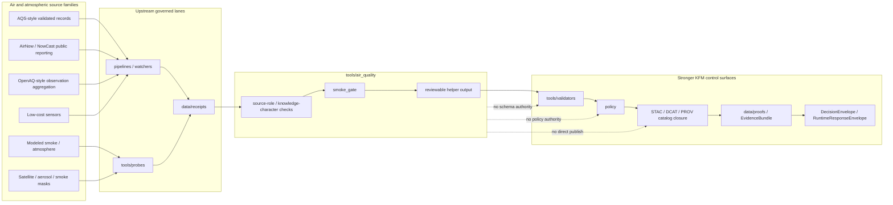

<!-- [KFM_META_BLOCK_V2]
doc_id: kfm://doc/NEEDS-VERIFICATION
title: Air Quality Tools
type: standard
version: v1
status: draft
owners: @bartytime4life
created: NEEDS-VERIFICATION
updated: 2026-04-18
policy_label: public
related: [tools/README.md, tools/air_quality/smoke_gate/README.md, tools/probes/README.md, tools/validators/README.md, data/receipts/README.md, data/proofs/README.md, pipelines/README.md]
tags: [kfm, tools, air-quality, atmosphere, smoke, source-role, evidence]
notes: [doc_id needs canonical UUID; created date needs repo-history verification; policy label assumes this README remains public-safe orientation documentation only]
[/KFM_META_BLOCK_V2] -->

# Air Quality Tools

Governed helper surface for air-quality and atmospheric-context checks that preserve source role, knowledge character, evidence refs, and fail-closed boundaries.

> **Status:** experimental  
> **Owners:** `@bartytime4life`  
> **Path:** `tools/air_quality/README.md`  
> **Repo fit:** child lane under [`tools/`](../README.md) · current child [`smoke_gate/`](./smoke_gate/README.md) · adjacent helpers [`probes`](../probes/README.md), [`validators`](../validators/README.md), [`catalog`](../catalog/README.md), [`attest`](../attest/README.md), [`ci`](../ci/README.md) · process memory [`data/receipts`](../../data/receipts/README.md) · stronger trust objects [`data/proofs`](../../data/proofs/README.md)  
> **Evidence posture:** CONFIRMED for current public-tree presence and child `smoke_gate/`; doctrine-grounded for air/source-role boundaries; executable inventory beyond visible README surfaces remains NEEDS VERIFICATION  
> **Badges:**       
> **Quick jumps:** [Scope](#scope) · [Repo fit](#repo-fit) · [Accepted inputs](#accepted-inputs) · [Exclusions](#exclusions) · [Current evidence snapshot](#current-evidence-snapshot) · [Directory tree](#directory-tree) · [Quickstart](#quickstart) · [Usage](#usage) · [Diagram](#diagram) · [Reference tables](#reference-tables) · [Definition of done](#definition-of-done) · [FAQ](#faq) · [Appendix](#appendix)

> [!IMPORTANT]
> `tools/air_quality/` is not an air-data ingestion runtime, a public AQI product, a regulatory interpretation surface, or a hidden source-of-truth lane. It is a narrow helper area for reviewable air-quality checks that support KFM’s governed truth path.

> [!NOTE]
> KFM air and atmospheric context is high-value but high-burden. AQS-style validated records, AirNow/NowCast-style public reporting, OpenAQ-style observation aggregation, low-cost sensors, modeled smoke, satellite aerosol products, and climate anomaly surfaces must not be flattened into one generic “air data” category.

---

## Scope

`tools/air_quality/` exists to hold small, inspectable helper documentation and, when later verified in-tree, helper utilities for air-quality and atmospheric-context review.

The current confirmed child lane is [`smoke_gate/`](./smoke_gate/README.md), which documents a deterministic multi-source smoke / PM2.5 agreement gate. This parent README gives maintainers the lane-level routing rules around that child and any future air-quality helpers.

### What belongs here

Use this lane for helpers whose main job is to:

- check air-quality or smoke payloads for **source-role completeness**
- preserve `knowledge_character` before downstream summarization
- inspect freshness, support, unit basis, and evidence references for normalized air signals
- validate or summarize lane-local gate outputs before they move to stronger validators, policy, or runtime envelopes
- keep air-quality helper outputs decomposable enough for EvidenceBundle / Evidence Drawer review

### What this README does

This README:

- orients the `tools/air_quality/` directory
- defines parent-lane boundaries around `smoke_gate/`
- separates air-quality helper work from ingestion, modeling, policy, schemas, apps, and publication
- records what is CONFIRMED versus PROPOSED or NEEDS VERIFICATION
- gives maintainers a safe review checklist before adding new helpers or examples

### Evidence labels used here

| Label | Meaning in this README |
|---|---|
| **CONFIRMED** | Supported by inspected public repo files, adjacent repo docs, or attached KFM doctrine |
| **INFERRED** | Strongly suggested by doctrine and neighboring docs, but not directly proven as active implementation |
| **PROPOSED** | Recommended target shape or landing rule consistent with KFM doctrine |
| **UNKNOWN** | Not established strongly enough from the visible repo and attached corpus |
| **NEEDS VERIFICATION** | Must be checked in a mounted checkout, branch history, workflow inventory, schema registry, or runtime trace before being treated as settled |

[Back to top](#air-quality-tools)

---

## Repo fit

| Direction | Surface | Relationship |
|---|---|---|
| Parent | [`../README.md`](../README.md) | `tools/` governs reusable helpers for validation, probes, diffs, attestation, catalog QA, documentation checks, and CI summaries |
| Current child | [`./smoke_gate/README.md`](./smoke_gate/README.md) | CONFIRMED child lane for deterministic smoke / PM2.5 agreement gating |
| Adjacent helper lane | [`../probes/README.md`](../probes/README.md) | Read-only source freshness, availability, and surface-shape inspection should live there when not air-specific |
| Adjacent helper lane | [`../validators/README.md`](../validators/README.md) | Fail-closed validation of declared shapes, finite outcomes, and linkage belongs there |
| Adjacent helper lane | [`../catalog/README.md`](../catalog/README.md) | STAC/DCAT/PROV closure and catalog QA belong there |
| Adjacent helper lane | [`../attest/README.md`](../attest/README.md) | Signing, proof-pack, digest, or attestation support belongs there |
| Process memory | [`../../data/receipts/README.md`](../../data/receipts/README.md) | Air-quality helper outputs may point to receipt-shaped process memory, but do not own it |
| Trust objects | [`../../data/proofs/README.md`](../../data/proofs/README.md) | Release-grade proofs remain separate from helper outputs and receipts |
| Execution lane | [`../../pipelines/README.md`](../../pipelines/README.md) | Lane-local fetch, transform, validate, watch, and emit work belongs in pipelines when it becomes operational |
| Authority | [`../../contracts/README.md`](../../contracts/README.md) and [`../../schemas/README.md`](../../schemas/README.md) | Shared shapes and schema authority stay outside this helper lane |
| Policy | [`../../policy/README.md`](../../policy/README.md) | Allow/deny/obligation logic belongs in policy; tools may support or summarize it |
| Verification | [`../../tests/README.md`](../../tests/README.md) | Non-trivial helpers should be backed by tests, fixtures, or documented examples |
| Ownership | [`../../.github/CODEOWNERS`](../../.github/CODEOWNERS) | Current public owner coverage resolves to `@bartytime4life` |

### Why this lane exists

Air-quality context is especially easy to over-compress. A map chip or AI summary can make provisional public reporting, validated regulatory data, low-cost sensor data, model output, and satellite-derived evidence look equally authoritative when they are not.

This helper lane exists to keep those distinctions visible before any output reaches a validator, catalog surface, EvidenceBundle, runtime envelope, Focus Mode explanation, Story Node, or published map layer.

[Back to top](#air-quality-tools)

---

## Accepted inputs

Place material here only when it stays helper-sized, reviewable, and source-role aware.

### Strong fits

| Input class | Example | Required posture |
|---|---|---|
| Normalized smoke-gate axis payload | model / satellite / ground boolean with context | Must preserve source role, time basis, support, and evidence refs |
| Air-quality gate result | finite status from `smoke_gate/` | Must remain decomposable, not a hidden risk score |
| Receipt reference | `receipt://airnow/...` or similar project-local ref | Must remain process memory, not release proof |
| Source-role checklist | field-presence or enum check for air payloads | Must not become schema authority |
| Freshness report | stale source, delayed source, unavailable station/network | Must prefer visible `UNSTABLE` / `ERROR` over smoothing |
| Reviewer example | small illustrative JSON result | Must avoid sensitive coordinates and must be marked illustrative if not fixture-backed |

### Minimum fields for air-quality helper subjects

Any payload this lane documents or checks should carry enough information to fail closed without guessing.

| Field | Required | Why |
|---|---:|---|
| `source_role` | Yes | Distinguishes validated, provisional, modeled, low-cost, aggregated, or derived context |
| `knowledge_character` | Yes | Prevents observation/model/anomaly/satellite layers from being flattened together |
| `observed_at` or `valid_at` | Yes | Air and smoke signals are time-sensitive |
| `support` | Yes | Point monitor, station network, grid cell, plume polygon, county rollup, and tile support mean different things |
| `unit_basis` | Yes for measurements | PM2.5 concentration, AQI category, NowCast, AOD, and anomaly units are not interchangeable |
| `source_ref` or `evidence_ref` | Yes | Downstream evidence resolution needs inspectable linkage |
| `qc_state` | Recommended | Lets helper outputs carry partial, corrected, provisional, or excluded states visibly |
| `revision_state` | Recommended for AQS-style reconciliation | Makes provisional-to-validated replacement auditable |
| `spec_hash` or payload digest | Recommended | Supports replay, drift checks, and deterministic review |

[Back to top](#air-quality-tools)

---

## Exclusions

Do **not** place these responsibilities in `tools/air_quality/`:

| Does not belong here | Put it in | Reason |
|---|---|---|
| Raw OpenAQ, AQS, AirNow, PurpleAir, HRRR-Smoke, CAMS, GOES, VIIRS, or HMS ingestion | [`../../pipelines/`](../../pipelines/) or a source-specific watcher/probe lane | This directory is a helper surface, not operational ingestion |
| Public AQI pages, alerting, subscriber notification, or emergency messaging | [`../../apps/`](../../apps/) plus governed policy/review surfaces | KFM air context is not an emergency alert system by default |
| Regulatory determinations or attainment decisions | Policy / steward review surfaces | Tools may preserve evidence and flags, not decide regulatory consequence |
| Canonical source descriptors, shared schemas, or envelope definitions | [`../../contracts/`](../../contracts/) and [`../../schemas/`](../../schemas/) | Helper docs consume declared authority; they do not create it silently |
| OPA/Rego allow/deny policy source of truth | [`../../policy/`](../../policy/) | Policy remains inspectable and centralized |
| Release-grade EvidenceBundles, signatures, or proof packs | [`../../data/proofs/`](../../data/proofs/) and [`../attest/`](../attest/README.md) | Proof surfaces must not collapse into helper outputs |
| Hidden confidence/probability scoring | Nowhere without governed statistical definition | KFM prefers finite outcomes and inspectable basis over pseudo-certainty |
| Sensitive or unrestricted coordinate fixtures | Secured data/fixture lane with review | Public helper examples must remain clone-safe and rights-safe |

> [!CAUTION]
> If a proposed helper needs network credentials, persistent state, scheduling, publication, or source-specific retry logic, it is probably no longer a `tools/air_quality/` helper. Move or split the work before it becomes hidden runtime.

[Back to top](#air-quality-tools)

---

## Current evidence snapshot

| Evidence item | Status | Use in this README |
|---|---:|---|
| `tools/air_quality/` exists on public `main` | **CONFIRMED** | Grounds this parent README path |
| `tools/air_quality/README.md` existed as an empty placeholder in the inspected public snapshot | **CONFIRMED** | This file replaces placeholder state with lane-level guidance |
| `tools/air_quality/smoke_gate/README.md` exists | **CONFIRMED** | Grounds the current child-lane index |
| `smoke_gate/` documents model / satellite / ground axes and finite statuses | **CONFIRMED** | Parent README aligns around source-role and gate-output discipline |
| `/tools/` is a governed helper surface, not a miscellaneous scripts bin | **CONFIRMED** | Controls placement and exclusion rules here |
| `/tools/` ownership is covered by visible CODEOWNERS fallback and `/tools/` rule | **CONFIRMED** | Supports owner line |
| Active executable files under `tools/air_quality/` beyond README surfaces | **UNKNOWN** | Requires mounted checkout or deeper branch inspection |
| Current workflow callers for air-quality helpers | **UNKNOWN** | Do not claim CI wiring without checking `.github/workflows/` |
| Canonical schemas for `source_role`, `knowledge_character`, or smoke-gate result | **NEEDS VERIFICATION** | This README names fields as contract pressure, not settled schema law |
| Whether future air-quality helpers should stay here or move into `probes/`, `validators/`, or `pipelines/` | **NEEDS VERIFICATION** | Decide by actual job and caller boundary |

[Back to top](#air-quality-tools)

---

## Directory tree

### Current public-tree shape inspected for this README

```text
tools/air_quality/
├── README.md
└── smoke_gate/
    └── README.md
```

### Conservative future shape if executable helpers land here

```text
tools/air_quality/
├── README.md
├── smoke_gate/
│   └── README.md
├── examples/                 # optional; small, public-safe illustrative payloads
├── fixtures/                 # optional; only if tests need stable positive/negative cases
└── tests/                    # optional; only when helper behavior is non-trivial
```

> [!WARNING]
> The second tree is PROPOSED. Do not commit it as implied current state unless those files actually exist in the checkout.

[Back to top](#air-quality-tools)

---

## Quickstart

Use inspection before assumption.

### 1. Confirm the current local tree

```bash
tree -a -L 3 tools/air_quality 2>/dev/null \
  || find tools/air_quality -maxdepth 3 \( -type f -o -type d \) 2>/dev/null | sort
```

### 2. Read parent and child lane docs

```bash
sed -n '1,260p' tools/README.md
sed -n '1,260p' tools/air_quality/smoke_gate/README.md
sed -n '1,220p' tools/probes/README.md
sed -n '1,220p' tools/validators/README.md
sed -n '1,220p' data/receipts/README.md
```

### 3. Search for current callers and schema pressure

```bash
rg -n "air_quality|smoke_gate|AirNow|AQS|OpenAQ|NowCast|PurpleAir|HRRR|CAMS|knowledge_character|source_role" \
  README.md .github docs tools pipelines data contracts schemas policy tests -S 2>/dev/null
```

### 4. Verify executable inventory before claiming behavior

```bash
find tools/air_quality -maxdepth 5 -type f \
  \( -name "*.py" -o -name "*.sh" -o -name "*.ts" -o -name "*.mjs" -o -name "*.json" -o -name "*.yaml" -o -name "*.yml" \) \
  | sort
```

### 5. Recheck ownership and workflow boundaries

```bash
sed -n '1,220p' .github/CODEOWNERS 2>/dev/null
sed -n '1,220p' .github/workflows/README.md 2>/dev/null
sed -n '1,220p' .github/README.md 2>/dev/null
```

[Back to top](#air-quality-tools)

---

## Usage

### 1. Preserve source role before summarization

Air-quality helpers should receive or emit payloads that make the source role explicit.

```json
{
  "source_role": "public-reporting",
  "knowledge_character": "provisional_nowcast",
  "support": "monitor_point",
  "unit_basis": "AQI category / NowCast basis",
  "observed_at": "2026-04-18T15:00:00Z",
  "source_ref": "receipt://airnow/example",
  "qc_state": "provisional"
}
```

The example above is illustrative. It is not a settled schema.

### 2. Keep provisional and validated states separate

AQS-style validated records and AirNow/NowCast-style current public reporting should be reconciled explicitly, not silently merged. If a helper compares them, it should emit a reviewable state such as:

| State | Meaning |
|---|---|
| `provisional` | Current public reporting or derived NowCast-like value without validated replacement |
| `validated` | Later validated record accepted under declared reconciliation rule |
| `annotated` | Value retained with qualifier/context notes |
| `pending_concurrence` | Exceptional-event or exclusion-like state not yet resolved |
| `excluded` | Value retained for provenance but excluded from specified rollup/view |
| `error` | Missing, malformed, non-resolvable, or policy-blocked state |

### 3. Use finite outcomes, not bluff confidence

For helper outputs that feed runtime or review, prefer bounded result grammar:

```text
PASS       = declared requirements met
WARN       = non-blocking issue visible to reviewer
UNSTABLE   = stale, conflicting, incomplete, or transition-state signal
FAIL       = declared blocking requirement not met
ERROR      = malformed input, non-resolvable evidence, or execution failure
```

Avoid a bare `confidence` field unless the repo has a governed statistical definition for that exact score.

### 4. Route stronger responsibilities outward

When the task grows beyond helper behavior, move it:

| The task became… | Better home |
|---|---|
| source availability / freshness probe | [`../probes/`](../probes/README.md) |
| declared contract validation | [`../validators/`](../validators/README.md) |
| catalog closure or STAC/DCAT/PROV linkage | [`../catalog/`](../catalog/README.md) |
| signature, digest, proof-pack support | [`../attest/`](../attest/README.md) |
| lane-local ingestion or watcher execution | [`../../pipelines/`](../../pipelines/README.md) |
| public UI or runtime service | [`../../apps/`](../../apps/) |
| policy allow/deny logic | [`../../policy/`](../../policy/README.md) |
| shared schema or envelope definition | [`../../contracts/`](../../contracts/README.md) / [`../../schemas/`](../../schemas/README.md) |

[Back to top](#air-quality-tools)

---

## Diagram



[Back to top](#air-quality-tools)

---

## Reference tables

### Source-role discipline for air-quality context

| Source family | Knowledge character | Good use | Main caution |
|---|---|---|---|
| AQS-style validated monitoring records | validated / regulatory-grade context | replacement or correction of provisional public reporting when reconciliation is declared | Do not treat qualifiers, exclusions, or revisions as cosmetic |
| AirNow / NowCast-style public reporting | provisional public-reporting context | current map context, near-real-time comparison, public communication cue | Do not relabel as validated regulatory truth |
| OpenAQ-style aggregated observations | observation aggregation / network metadata | cross-network discovery, station/parameter normalization, contextual coverage | Preserve provider, network, parameter, and unit metadata |
| Low-cost sensors | direct low-cost observation after correction/QC | spatial context and corroboration when corrected and labeled | Do not compare to regulatory monitors without correction and QC disclosure |
| HRRR-Smoke / CAMS / similar modeled fields | modeled or assimilated context | gap-filling, early indication, gridded smoke/air context | Never present as direct observation |
| GOES / VIIRS / HMS / AOD / smoke masks | direct observational or analyst-derived EO context | plume, aerosol, fire, or mask support | Preserve acquisition time, support footprint, and detection/QC caveats |
| Climate or anomaly surfaces | modeled / derived anomaly context | story, hazard, hydrology, or agriculture context when evidence-linked | Do not treat as current observation or forecast unless explicitly modeled and labeled |

### Helper boundaries

| This lane may… | This lane must not… |
|---|---|
| document air-specific helper boundaries | ingest raw source feeds as an operational runtime |
| preserve source role and knowledge character | decide regulatory or public-health consequence |
| emit reviewable helper results | publish public map claims directly |
| point to receipts and evidence refs | replace EvidenceBundle resolution |
| support validators and policy with structured facts | become schema, policy, or proof authority |
| keep examples small and public-safe | commit sensitive or rights-unclear fixtures |

### Current child lane registry

| Child path | Status | Role |
|---|---:|---|
| [`smoke_gate/`](./smoke_gate/README.md) | **CONFIRMED** | Deterministic multi-source agreement gate for smoke confirmation in KFM’s air-quality lane |

### Possible future helper topics

These are PROPOSED topics, not current directory claims.

| Topic | Why it might belong here | Routing warning |
|---|---|---|
| `source_role_lint` | Air signals especially need role and knowledge-character checks | Move to `tools/validators/` if it becomes a shared contract validator |
| `aqs_nowcast_reconcile` | Provisional-to-validated replacement needs auditable state | Move to `pipelines/` if it fetches or stores source data |
| `air_payload_freshness_summary` | Time-sensitive inputs need stale-state visibility | Move to `tools/probes/` if it is a generic endpoint/source freshness probe |
| `low_cost_sensor_qc_notes` | Low-cost sensor correction context needs explicit review notes | Move to contracts/schemas if it defines canonical QC fields |
| `atmospheric_model_context_check` | Modeled fields must remain visibly modeled | Move to pipelines if it schedules model acquisition |

[Back to top](#air-quality-tools)

---

## Definition of done

A change under `tools/air_quality/` is review-ready when:

- [ ] It names the exact helper purpose and keeps it narrow.
- [ ] It preserves `source_role`, `knowledge_character`, support, time basis, unit basis, and evidence refs.
- [ ] It does not ingest, publish, alert, or make regulatory decisions unless routed to the correct lane.
- [ ] It emits finite, inspectable status rather than vague confidence.
- [ ] It keeps modeled, observed, provisional, validated, corrected, and derived data visibly distinct.
- [ ] It links receipts as process memory and does not convert them into proofs.
- [ ] It documents any caller surface: local command, script, pipeline, CI, validator, or review flow.
- [ ] It includes at least one positive and one negative / blocking example if behavior is non-trivial.
- [ ] It avoids sensitive fixtures, unrestricted coordinate dumps, or rights-unclear payloads.
- [ ] It updates `tools/air_quality/README.md` and any affected child README together.
- [ ] It marks exact schema names, workflow wiring, CLI names, and runtime integrations as NEEDS VERIFICATION unless checked in the current branch.

[Back to top](#air-quality-tools)

---

## FAQ

### Why does air quality need its own helper lane?

Because atmospheric signals are useful but easy to misread. KFM needs helpers that keep source role, freshness, support, unit basis, and evidence linkage visible before air context reaches public-facing maps, Focus Mode, Story Nodes, or runtime envelopes.

### Why not put every air helper under `tools/probes/` or `tools/validators/`?

Put generic freshness checks under `probes/` and generic shape checks under `validators/`. Keep air-specific helper documentation here when it explains or composes air-quality lane concepts, especially around `smoke_gate/`.

### Is AirNow the same thing as AQS?

No. Treat current public reporting and validated regulatory records as different source roles. A helper may compare or reconcile them only when the input state, revision basis, and replacement rule are explicit.

### Can modeled smoke open a public claim by itself?

Not by default. Modeled fields can support context or corroboration, but KFM doctrine requires modeled, observational, public-reporting, and validated signals to remain visibly distinct. Any public-facing claim needs evidence resolution and policy-appropriate review.

### Should low-cost sensor values be used directly?

Not without correction, QC context, and source-role labeling. Low-cost sensors may be valuable for spatial context, but helper output must not imply regulatory equivalence unless a governed correction and comparison rule supports that use.

### What happens when a required evidence ref is missing?

Prefer `FAIL`, `ERROR`, or `UNSTABLE` over a confident-looking summary. KFM’s safer posture is cite-or-abstain, fail-closed, and visible negative states.

[Back to top](#air-quality-tools)

---

## Appendix

<details>
<summary>Illustrative air-quality helper result JSON</summary>

```json
{
  "tool_id": "air_quality.source_role_check",
  "status": "UNSTABLE",
  "subject": "receipt://airnow/example",
  "checked_at": "2026-04-18T15:30:00Z",
  "source_role": "public-reporting",
  "knowledge_character": "provisional_nowcast",
  "support": "monitor_point",
  "unit_basis": "AQI category / NowCast basis",
  "evidence_refs": [
    "receipt://airnow/example"
  ],
  "issues": [
    {
      "id": "validated-replacement-missing",
      "severity": "warn",
      "message": "No validated AQS-style replacement record was supplied for this tuple."
    }
  ],
  "routing": {
    "next": "tools/validators or policy review",
    "not_before": [
      "public regulatory claim",
      "release proof",
      "published risk index"
    ]
  }
}
```

This JSON is illustrative only. It is not a settled schema, fixture, or contract.

</details>

<details>
<summary>Open verification items before commit</summary>

- canonical `doc_id` UUID for this README
- actual repo-history creation date for `tools/air_quality/README.md`
- mounted-checkout confirmation of all non-README files under `tools/air_quality/`
- current active workflow callers, if any
- current canonical schema home for `source_role` and `knowledge_character`
- whether air-quality helper examples should live under this directory, `tests/fixtures/`, or a shared examples lane
- whether future AQS / AirNow reconciliation belongs in `tools/air_quality/`, `tools/validators/`, or a lane-specific pipeline
- current external API details for OpenAQ, AQS, AirNow, low-cost sensors, smoke model feeds, and satellite products before any executable fetcher is implemented

</details>

[Back to top](#air-quality-tools)
