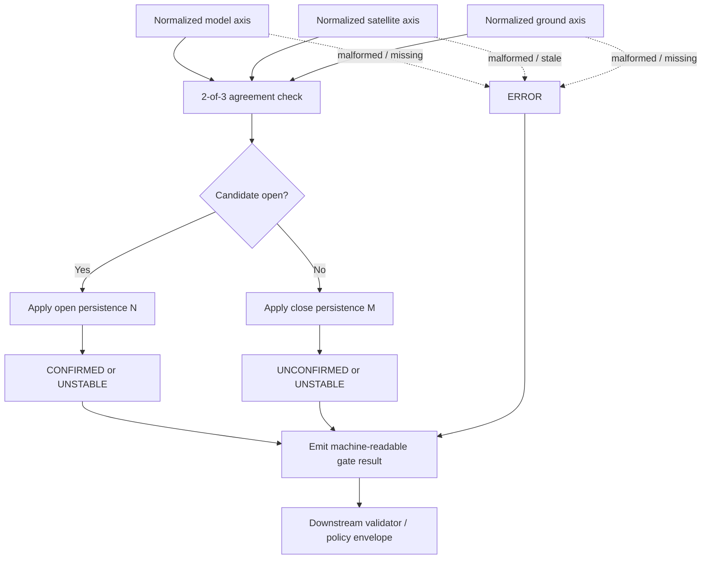

<!-- [KFM_META_BLOCK_V2]
doc_id: kfm://doc/<UUID-NEEDS-VERIFICATION>
title: Smoke / PM2.5 Agreement Gate
type: standard
version: v1
status: draft
owners: [@bartytime4life]
created: 2026-04-11
updated: 2026-04-11
policy_label: public-safe
related: [tools/probes/README.md, tools/validators/README.md, data/receipts/README.md]
tags: [kfm, air-quality, gating, smoke]
notes: [doc_id placeholder pending canonical KFM UUID verification, related paths inherited from the uploaded scaffold and need repo-tree verification, exact schema/CLI/workflow wiring not directly verified in the current session]
[/KFM_META_BLOCK_V2] -->

# Smoke / PM2.5 Agreement Gate

Deterministic multi-source agreement gate for smoke confirmation in KFM’s air-quality lane.

| Field | Value |
|---|---|
| **Status** | Draft |
| **Owners** | `@bartytime4life` |
| **Badges** |     |
| **Quick jumps** | [Scope](#scope) · [Repo fit](#repo-fit) · [Inputs](#inputs) · [Gate logic](#gate-logic) · [Diagram](#diagram) · [Definition of done](#definition-of-done) · [FAQ](#faq) · [Appendix](#appendix) |

> [!IMPORTANT]
> This README is grounded in the uploaded smoke-gate scaffold plus attached KFM doctrine. The current session did **not** expose a mounted repo tree, schema registry, workflow YAML, tests, or runtime logs. Preserve doctrine confidently, but treat exact neighboring files, CLI names, schema filenames, and wiring details as **NEEDS VERIFICATION** until rechecked in-repo.

> [!NOTE]
> KFM lane doctrine requires modeled, observational, and public-reporting signals to remain visibly distinct. This gate may summarize agreement into one finite outcome, but it must not erase source role, time basis, support, calibration context, or evidence linkage.

## Scope

This directory owns the **lane-local agreement rule** that turns separately normalized smoke / PM2.5 signals into a finite gate status.

### What this README covers

- the gate’s narrow purpose and routing boundary
- accepted normalized inputs and exclusions
- deterministic agreement, persistence, and cadence rules
- machine-readable output shape suitable for downstream policy/runtime envelopes
- minimum verification posture for examples, tests, and review

### What this README does not cover

- upstream ingestion or source onboarding
- forecast-science methodology for HRRR-Smoke, GEFS-Aerosols, GOES ABI, VIIRS, or AirNow
- public alert copy, escalation policy, or emergency notification behavior
- authoritative schema ownership for shared contracts
- whole-lane air-quality fusion or bias-correction logic

## Repo fit

| Item | Notes |
|---|---|
| **Path** | `tools/air_quality/smoke_gate/` |
| **Upstream** | [`tools/probes/`](../../probes/README.md) for model and satellite probe outputs; [`data/receipts/`](../../../data/receipts/README.md) for ground-observation receipts |
| **Downstream** | [`tools/validators/`](../../validators/README.md) for gate verification; policy/runtime handoff to `DecisionEnvelope` / `RuntimeResponseEnvelope` shapes |
| **Domain lane** | Atmosphere, air quality, smoke, and contextual earth-observation support |
| **Repo boundary** | Adjacent paths above are inherited from the uploaded scaffold and should be rechecked against the mounted repo before commit |

### Why this exists in KFM

KFM treats hazards and air-quality context as governed operating lanes with lane-specific publication burdens. In that posture, a smoke gate should stay **narrow, decomposable, and auditable** rather than becoming a vague composite score or a hidden public-truth surface.

## Inputs

### Accepted inputs

Place inputs here only after they have already been normalized into a lane-local signal contract.

| Axis | Typical source examples | Knowledge character | What must be preserved |
|---|---|---|---|
| **Model** | HRRR-Smoke, GEFS-Aerosols | **Modeled / assimilated** | issue time, valid time, forecast basis, support/grid, threshold basis |
| **Satellite** | GOES ABI AOD, VIIRS fire detections, optional smoke masks | **Direct observational / analyst-derived** | observation time, QC state, support footprint, detection method |
| **Ground** | AirNow PM2.5 / AQI receipts | **Public-reporting observational context** | observation time, unit/averaging basis, source receipt reference |

### Minimum normalized fields

Each axis payload should carry enough structure that the gate can fail closed without guessing.

| Field | Required | Why it matters |
|---|---:|---|
| `axis_name` | Yes | Keeps model / satellite / ground decomposition explicit |
| `axis_positive` | Yes | The gate consumes booleans, not raw source payloads |
| `knowledge_character` | Yes | Prevents modeled and observed signals from being flattened together |
| `observed_at` or `valid_at` | Yes | Smoke is time-sensitive; stale inputs must stay visible |
| `support` | Yes | Point, grid, plume polygon, or area support changes interpretation |
| `source_ref` | Yes | Downstream envelopes need inspectable evidence linkage |
| `qc_state` | Recommended | Enables visible partial or unstable states instead of silent smoothing |
| `unit_basis` | Recommended | Especially important for PM2.5 and AQI-adjacent ground signals |

### Exclusions

Do **not** place the following responsibilities here:

- policy decisions or public-release approvals
- alert publication, messaging, or subscriber notification
- source onboarding and ETL ownership
- cross-source fusion products meant to become authoritative environmental layers
- schema-definition ownership for shared contract families
- hidden “confidence” scores that read like probability without governed statistical meaning

## Directory tree

> [!NOTE]
> The tree below is the **working shape inherited from the uploaded scaffold**. Verify it against the mounted repository before commit.

```text
tools/air_quality/smoke_gate/
├── README.md
├── config/
│   └── thresholds.yaml
├── examples/
│   └── sample_decisions.json
└── tests/
    └── gate_cases.md
```

## Quickstart

Use this as an illustrative invocation shape only.

```bash
# Illustrative only — exact CLI name and flag surface NEED VERIFICATION
smoke-gate evaluate \
  --model ./examples/model.json \
  --satellite ./examples/satellite.json \
  --ground ./examples/ground.json
```

A credible first commit should include:

1. one happy-path example
2. one unstable example
3. one error-path example
4. one validator or fixture set proving deterministic replay

## Usage

### 1) Normalize axes before gating

The gate expects each axis to arrive as a **yes/no signal with context**, not as raw source payloads.

```text
MODEL_POSITIVE     = forecast PM2.5 >= threshold
SATELLITE_POSITIVE = AOD anomaly OR nearby fire/smoke evidence
GROUND_POSITIVE    = observed PM2.5 >= threshold
```

### 2) Apply the minimal agreement rule

```text
IF at least 2 of 3 axes are positive
  THEN candidate state = OPEN
ELSE
  candidate state = CLOSED
```

This is a **confirmation gate**, not a comprehensive smoke model and not a public risk index.

### 3) Apply persistence / hysteresis

To reduce flapping, the gate should not open or close on a single noisy tick.

| Parameter | Meaning | Typical working range |
|---|---|---|
| `N` | consecutive positive evaluations required to open | `2–3` |
| `M` | consecutive negative evaluations required to close | `3–5` |

```text
OPEN  => require N consecutive candidate-open evaluations
CLOSE => require M consecutive candidate-closed evaluations
```

### 4) Respect cadence and freshness

Different source families update on different cadences and carry different trust burdens.

| Source family | Typical cadence | Gate implication |
|---|---|---|
| HRRR-Smoke | hourly | short-range modeled context; useful, but still modeled |
| GEFS-Aerosols | 6–12 hr | advisory context only; too slow/coarse to open alone |
| GOES ABI | minutes | fast observational confirmation with QC caveats |
| AirNow | hourly | useful ground context; preserve public-reporting basis |

**Operational rule**

- A low-cadence or coarse modeled signal should **not** independently open the gate.
- Freshness must remain visible when an input is stale, delayed, or partially unavailable.
- Missing required context should push the gate toward **UNSTABLE** or **ERROR**, not a bluff.

### 5) Emit a finite outcome, not a bluff

KFM runtime doctrine favors visible negative states over persuasive smoothing.

| Status | Meaning | When to use |
|---|---|---|
| **CONFIRMED** | Gate is open under the current agreement + persistence rules | at least 2 axes positive and persistence satisfied |
| **UNCONFIRMED** | Not enough agreement to open | fewer than 2 positive axes with no blocking integrity issue |
| **UNSTABLE** | Signals conflict, are stale, or are inside a hysteresis window | transition periods, mixed freshness, partial disagreement |
| **ERROR** | Required input is missing, malformed, or non-resolvable | fail-closed input or contract failure |

> [!IMPORTANT]
> Avoid a bare `confidence` field unless it has a separately governed statistical definition. For the minimal gate, `agreement_fraction` or `positive_axis_count` is safer and more truthful than a pseudo-probability.

## Gate logic

### Agreement rule in compact form



### Minimal machine-readable result contract

This is a **working contract sketch**, not a verified schema path.

| Field | Required | Meaning |
|---|---:|---|
| `gate_id` | Yes | Stable identifier for this gate family |
| `status` | Yes | `CONFIRMED`, `UNCONFIRMED`, `UNSTABLE`, or `ERROR` |
| `axis_states` | Yes | Per-axis positive/negative/error state plus role metadata |
| `positive_axis_count` | Yes | Integer `0..3` |
| `agreement_fraction` | Recommended | `positive_axis_count / 3`, carried as an agreement indicator rather than probability |
| `persistence_state` | Yes | open/close counters used for hysteresis |
| `evaluated_at` | Yes | Timestamp for the gate decision |
| `evidence_refs` | Yes | References back to probes / receipts used |
| `freshness` | Recommended | Per-axis freshness or stale-state summary |

## Tables

### Source-role discipline

| Source role | Best use here | Main caution |
|---|---|---|
| **Modeled / assimilated** | forecast context and early indication | never present as direct observation |
| **Direct observational / analyst-derived** | smoke presence, plume evidence, aerosol context | preserve acquisition/QC limits |
| **Public-reporting observational context** | near-real-time public PM2.5 / AQI-adjacent support | do not silently relabel as regulatory truth |

### Interpretation boundaries

| This gate **is** | This gate **is not** |
|---|---|
| a deterministic agreement rule | a complete smoke science pipeline |
| a decomposable lane-local status object | a public alert publisher |
| a downstream input to governed policy/runtime envelopes | a substitute for EvidenceBundle resolution |
| a fail-closed confirmation mechanism | a hidden composite risk score |

## Definition of done

A practical first definition of done for this directory:

- [ ] accepted inputs declare source role, support, time basis, and evidence reference
- [ ] modeled, observational, and public-reporting signals remain visibly distinct
- [ ] gate emits only the four finite outcomes defined above
- [ ] malformed or missing required input fails closed
- [ ] examples cover `CONFIRMED`, `UNCONFIRMED`, `UNSTABLE`, and `ERROR`
- [ ] validator fixtures prove deterministic replay on identical inputs
- [ ] neighboring paths, CLI entrypoint, and shared contract filenames are rechecked in the mounted repo
- [ ] any schema or runtime envelope changes are updated in the same review stream as this README

## FAQ

### Why 2-of-3 instead of 3-of-3?

Because the gate should remain useful when one axis is temporarily degraded, delayed, or unavailable, while still requiring corroboration across independent signal families.

### Why add hysteresis?

Because smoke indicators can flicker at threshold edges. Hysteresis makes the gate operationally legible instead of noisy.

### Why not expose a single probability score?

Because this gate is an agreement mechanism, not a calibrated predictive model. Axis decomposition is more inspectable and more faithful to KFM’s trust posture.

### What happens if one axis is stale?

Do not silently ignore it. Carry freshness explicitly and prefer **UNSTABLE** or **ERROR** over a confident-looking answer.

### Where should thresholds live?

In the owning config or contract surface for this lane, not hard-coded into prose. The exact file and schema location remain **NEEDS VERIFICATION** in the current session.

## Appendix

<details>
<summary><strong>Illustrative gate result JSON</strong></summary>

```json
{
  "gate_id": "smoke_pm25_min_agreement",
  "status": "CONFIRMED",
  "positive_axis_count": 2,
  "agreement_fraction": 0.67,
  "axis_states": {
    "model": {
      "axis_positive": true,
      "knowledge_character": "modeled",
      "source_ref": "probe://hrrr-smoke/..."
    },
    "satellite": {
      "axis_positive": true,
      "knowledge_character": "observed",
      "source_ref": "probe://goes-aod/..."
    },
    "ground": {
      "axis_positive": false,
      "knowledge_character": "public-reporting",
      "source_ref": "receipt://airnow/..."
    }
  },
  "persistence_state": {
    "open_count": 3,
    "close_count": 0
  },
  "evaluated_at": "2026-04-11T00:00:00Z",
  "evidence_refs": [
    "receipt://airnow/...",
    "probe://hrrr-smoke/...",
    "probe://goes-aod/..."
  ]
}
```

</details>

<details>
<summary><strong>Open verification items before commit</strong></summary>

- canonical KFM document UUID for this README
- mounted repo confirmation for `tools/probes/`, `tools/validators/`, and `data/receipts/`
- actual schema location for any shared gate-result contract
- exact CLI entrypoint and argument surface
- whether the ground axis should accept AirNow only, or also AQS / other governed receipts
- exact reason/obligation registry if this gate is wrapped by a `DecisionEnvelope`

</details>

[Back to top](#smoke--pm25-agreement-gate)
