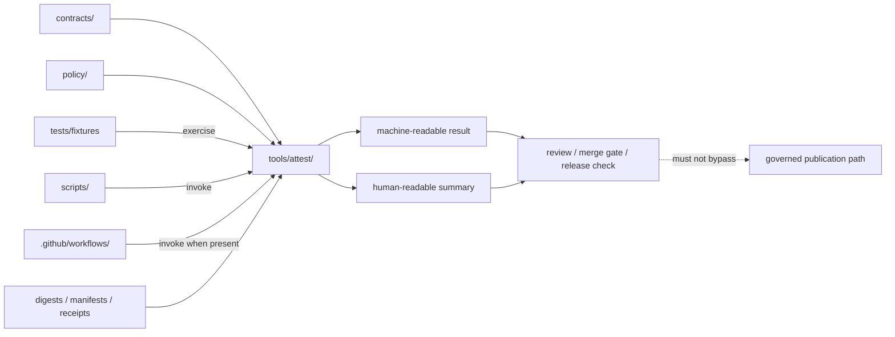

# attest

Proof-pack, digest, and attestation helper surface for governed KFM release evidence.

> [!IMPORTANT]
> **Status:** experimental  
> **Owners:** `@bartytime4life` *(inherited from `/tools/` CODEOWNERS coverage; narrower path-specific ownership is not separately evidenced on current public `main`)*  
> **Repo fit:** `tools/attest/README.md`  
> **Current public snapshot:** `tools/attest/` exists and currently contains `README.md` only.  
> **Role:** reusable helper lane for **verification, summarization, and support** around release evidence and attestation-related artifacts.  
> **Not this lane:** canonical policy storage, schema authority, secret custody, or hidden publish logic.
>
> 
> 
> 
> 
> 
>
> **Quick jumps:** [Scope](#scope) · [Repo fit](#repo-fit) · [Accepted inputs](#accepted-inputs) · [Exclusions](#exclusions) · [Current evidence snapshot](#current-evidence-snapshot) · [Directory tree](#directory-tree) · [Quickstart](#quickstart) · [Usage](#usage) · [Diagram](#diagram) · [Operating tables](#operating-tables) · [Task list](#task-list) · [FAQ](#faq) · [Appendix](#appendix)

---

## Scope

`tools/attest/` is the **narrow helper lane** for reusable commands that inspect, verify, summarize, or package **release-evidence support artifacts** without silently becoming the release system itself.

In KFM terms, this lane should stay downstream of doctrine and adjacent to — not above — the contract, policy, workflow, and runtime surfaces.

### What belongs here

Helpers in this directory should generally do one or more of the following:

- verify digests, manifests, proof objects, or attestation payloads
- summarize release evidence for reviewers or CI logs
- assemble small support bundles for review or release checks
- check that declared proof objects are present, shaped correctly, and internally consistent
- emit **machine-readable** pass/fail results that higher-level callers can use

### What this lane must protect

- **fail-closed behavior** over “best effort” ambiguity
- **read-only verification by default**
- **discoverability** of release-evidence support logic
- **clear caller boundaries** between tools, scripts, tests, and workflows
- **no secret ownership drift** into helper code
- **no silent publish path**

### Evidence posture used in this README

| Label | Meaning here |
|---|---|
| **CONFIRMED** | Visible in current public repo evidence or clearly stated by adjacent repo docs |
| **INFERRED** | Strongly implied by repo structure and KFM doctrine, but not directly implemented here yet |
| **PROPOSED** | Recommended starter pattern for this lane |
| **UNKNOWN** | Not proven from current public repo evidence |
| **NEEDS VERIFICATION** | Important enough to call out before merge or rollout |

[Back to top](#attest)

---

## Repo fit

`tools/attest/` should feel native inside the existing repo lattice, not like an isolated scripts bin.

| Direction | Surface | Relationship |
|---|---|---|
| Upstream | [`../README.md`](../README.md) | Parent tools-family contract and naming guidance |
| Upstream | [`../../README.md`](../../README.md) | Repo identity, doctrine posture, and top-level documentation rhythm |
| Adjacent | [`../../contracts/README.md`](../../contracts/README.md) | Contract backbone for manifests, envelopes, proof objects, and related schemas |
| Adjacent | [`../../policy/README.md`](../../policy/README.md) | Deny-by-default rule surface, reason/obligation logic, and policy execution boundary |
| Adjacent | [`../../tests/README.md`](../../tests/README.md) | Negative-path expectations, fixtures, and verification burdens |
| Adjacent | [`../../scripts/README.md`](../../scripts/README.md) | Orchestration and operator entrypoints; may call helpers here, but should not replace them |
| Downstream caller | [`../../.github/workflows/README.md`](../../.github/workflows/README.md) | CI/CD lane that may invoke helpers here once real workflow YAML exists |
| Governance | [`../../.github/CODEOWNERS`](../../.github/CODEOWNERS) | Ownership coverage for `/tools/` |
| Related family lanes | [`../validators/README.md`](../validators/README.md), [`../ci/README.md`](../ci/README.md), [`../diff/README.md`](../diff/README.md), [`../catalog/README.md`](../catalog/README.md) | Neighboring helper surfaces with adjacent concerns |

### Working interpretation

`tools/attest/` is a **helper surface**, not a sovereign authority surface.

- **Contracts** define the shape.
- **Policy** defines allowed outcomes and obligations.
- **Tests** prove pass/fail behavior.
- **Workflows** call helpers.
- **Scripts** orchestrate local or operator flows.
- **`tools/attest/`** should provide the reusable verification or summarization building blocks.

[Back to top](#attest)

---

## Accepted inputs

The parent `tools/` guidance and adjacent repo surfaces imply that this lane should accept **evidence-support inputs**, not arbitrary application data.

### Accepted here

| Input class | Examples | Status |
|---|---|---|
| Digests and checksum material | sha256 digests, spec-hash outputs, manifest-linked file hashes | **CONFIRMED / INFERRED** |
| Release proof metadata | release manifests, candidate proof-pack metadata, build receipts, correction refs | **INFERRED** |
| Contract-backed trust objects | EvidenceBundle-like refs, RuntimeResponseEnvelope-like refs, DecisionEnvelope-like refs | **INFERRED** |
| Review-safe fixtures | valid/invalid sample objects for local checks and tests | **INFERRED** |
| CI/local invocation parameters | input paths, output report paths, strict/fail flags, format selectors | **PROPOSED** |
| Optional provenance artifacts | SBOMs, attestation statements, provenance JSON, support bundles | **PROPOSED** |

### Preferred input posture

- explicit file paths over hidden discovery
- declared schema/profile versions over implicit assumptions
- release-scoped references over ad hoc loose files
- public-safe fixtures over production secrets

[Back to top](#attest)

---

## Exclusions

This directory should stay sharp. The following do **not** belong here as primary responsibility:

| Excluded from `tools/attest/` | Put it here instead |
|---|---|
| Canonical schema authority | `../../contracts/` |
| Policy bundles, reason codes, obligation registries | `../../policy/` |
| Long-lived review artifacts or release objects as storage | canonical release / data / evidence surfaces |
| Secret keys, signing identities, private trust roots | infra / secret manager / environment-specific secure storage |
| Workflow orchestration logic | `../../.github/workflows/` or `../../scripts/` |
| Runtime publish/promote logic | governed runtime / release lane |
| Ad hoc “misc signing helpers” scattered across repo | centralize in `tools/attest/` once real helpers exist |
| Hidden enforcement by UI or shell behavior alone | `../../policy/`, `../../tests/`, and caller lanes |

> [!CAUTION]
> A helper in `tools/attest/` may **support** release evidence. It must not quietly become the release authority, the policy engine, or the only place where provenance meaning survives.

[Back to top](#attest)

---

## Current evidence snapshot

### CONFIRMED now

- `tools/attest/` exists on the current public branch.
- The directory currently contains `README.md` only.
- The current file is a one-line scaffold.
- `tools/README.md` already reserves `attest/` as a family lane for attestation / release-evidence support.
- `/tools/` is covered by `@bartytime4life` in `CODEOWNERS`.
- The public `.github/workflows/` directory currently exposes `README.md` only, so checked-in workflow wiring is **not** evidenced here.

### INFERRED from adjacent repo guidance

- First helpers here should likely be **verifiers** or **summarizers** before any governance-heavy signing flow.
- Callers will most likely come from scripts, CI, tests, or release review surfaces.
- Output should be stable enough for merge gates and reviewer handoff.

### UNKNOWN / NEEDS VERIFICATION

- any checked-in executable helper files under `tools/attest/`
- any active workflow YAML invoking attestation helpers
- any mounted SBOM generation or signature verification pipeline
- any repo-ratified Cosign / in-toto / OCI artifact pattern
- any existing contract schema inventory specifically for attestation-related objects
- any live release proof-pack examples on current branch

[Back to top](#attest)

---

## Directory tree

### Current public tree

```text
tools/
├── README.md
├── attest/
│   └── README.md
├── catalog/
│   └── README.md
├── ci/
│   └── README.md
├── diff/
│   └── README.md
├── docs/
│   └── README.md
├── probes/
│   └── README.md
└── validators/
    └── README.md
```

### Illustrative landing shape for the first real helper set

> [!NOTE]
> The shape below is **PROPOSED**, not a claim about the mounted tree.

```text
tools/attest/
├── README.md
├── verify_*.py|sh|mjs         # narrow verification entrypoints
├── summarize_*.py|mjs         # reviewer-facing summaries
├── fixtures/                  # tiny public-safe examples only if needed
└── examples/                  # optional invocation examples
```

The key rule is not the filename pattern itself. The key rule is that the helper inventory stays:

- small
- explicit
- reviewable
- easy to invoke from CI or scripts
- impossible to confuse with canonical storage or secret custody

[Back to top](#attest)

---

## Quickstart

Start by verifying the current repo state before you add executable content.

### 1) Inspect the surrounding surfaces

```bash
sed -n '1,220p' tools/README.md
sed -n '1,220p' .github/CODEOWNERS
sed -n '1,220p' .github/workflows/README.md
sed -n '1,220p' contracts/README.md
sed -n '1,220p' policy/README.md
sed -n '1,220p' tests/README.md
sed -n '1,220p' scripts/README.md
```

### 2) Confirm the current helper inventory

```bash
find tools -maxdepth 2 -type f | sort
```

### 3) Search for existing evidence-related terminology

```bash
grep -RIn "attest\|proof pack\|proof-pack\|release manifest\|EvidenceBundle\|RuntimeResponseEnvelope\|SBOM\|cosign\|provenance" \
  tools contracts policy tests scripts .github docs 2>/dev/null
```

### 4) Verify whether workflow callers actually exist

```bash
find .github/workflows -maxdepth 2 -type f | sort
```

### 5) Add the smallest useful helper first

Good first helpers usually look like one of these:

1. **Verifier** — checks that required proof objects or digests are present and consistent
2. **Summarizer** — emits reviewer-friendly and CI-friendly structured results
3. **Bundle checker** — verifies that a release-evidence support bundle is complete enough to review

[Back to top](#attest)

---

## Usage

### Use this lane for narrow, testable helper responsibilities

A helper added here should answer a small question cleanly.

Examples:

- “Does this release manifest point to all required proof objects?”
- “Do declared digests match the referenced files?”
- “Is a required provenance artifact missing?”
- “Can we emit one structured summary for CI logs and reviewers?”

### Keep the call chain explicit

A recommended call pattern is:

```text
workflow / script / local operator command
            ↓
     tools/attest helper
            ↓
 machine-readable result + human-readable summary
            ↓
 review / gate / follow-up action
```

### Prefer verification before signing

In this repo state, the safer first move is usually:

- verify
- summarize
- gate
- only then consider richer signing or attestation flows

That order keeps the lane useful without overclaiming secret custody, key management, or supply-chain authority that the current public repo does not yet prove.

### Illustrative output shape

```json
{
  "tool": "verify_release_evidence",
  "status": "fail",
  "blocking": true,
  "subject": "release_manifest.json",
  "checks": [
    {
      "id": "digest-present",
      "result": "pass"
    },
    {
      "id": "proof-pack-linked",
      "result": "fail",
      "message": "no reviewable proof object linked from manifest"
    }
  ]
}
```

> [!NOTE]
> The JSON above is an **illustrative example**, not a confirmed mounted contract.

[Back to top](#attest)

---

## Diagram



### Interpretation

- `tools/attest/` sits in the **helper** layer.
- It may block or inform a gate.
- It must **not** become a hidden publish path.
- It should remain legible to both machines and reviewers.

[Back to top](#attest)

---

## Operating tables

### Helper classes for this lane

| Helper class | Primary job | Typical outputs | Status |
|---|---|---|---|
| Verification helper | Check integrity, presence, linkage, and consistency of proof-support objects | pass/fail JSON, exit code, concise report | **PROPOSED first-wave** |
| Summary helper | Turn raw verification state into reviewer-facing summaries | markdown/text/JSON summary | **PROPOSED first-wave** |
| Support-bundle checker | Confirm a review bundle is complete enough to inspect | completeness report | **PROPOSED** |
| Advanced signing wrapper | Call external signing / attestation tooling without owning trust roots | wrapped execution report | **NEEDS VERIFICATION / governance-heavy** |

### Design obligations

| Concern | Required posture |
|---|---|
| Determinism | Same inputs should yield the same verification result |
| Failure behavior | Block clearly; do not bluff |
| Output shape | Machine-readable first, human-readable second |
| Secret handling | No committed secrets; no hidden key ownership |
| Reviewability | Small CLI surface, narrow purpose, explicit inputs |
| Caller clarity | Document whether the helper is called by scripts, tests, or workflows |
| Boundary integrity | Never replace contracts, policy, tests, or governed publication logic |

### KFM object touchpoints

| Object family | Likely contact with `tools/attest/` |
|---|---|
| `ReleaseManifest` / `ReleaseProofPack` | Primary verification target |
| `DecisionEnvelope` | Policy-result linkage checks |
| `EvidenceBundle` | Support-path or completeness checks where relevant |
| `RuntimeResponseEnvelope` | Optional downstream linkage checks |
| `CorrectionNotice` | Continuity / supersession verification after release changes |

[Back to top](#attest)

---

## Task list

### Definition of done for the first executable helper

- [ ] The helper has **one narrow job**
- [ ] Caller surface is documented (`scripts/`, workflow, local operator, or tests)
- [ ] Inputs are explicit and reviewable
- [ ] Exit behavior is fail-closed for blocking checks
- [ ] Machine-readable output shape is stable enough to test
- [ ] At least one valid and one invalid example exists where appropriate
- [ ] Adjacent docs are updated if the helper adds a new repo expectation
- [ ] No secret material or environment-specific trust roots are committed
- [ ] The helper does **not** publish, promote, or mutate canonical truth directly
- [ ] Any advanced signing or provenance pattern is clearly labeled **PROPOSED** until ratified and evidenced

### Merge checks worth asking before landing code here

- [ ] Does this belong in `tools/attest/`, or is it actually a contract, policy, test, workflow, or script concern?
- [ ] Is the helper verifying or merely asserting?
- [ ] Could a reviewer understand what failed from the output alone?
- [ ] Does the helper keep KFM’s trust membrane intact?
- [ ] Does it stay useful even if supply-chain tooling changes later?

[Back to top](#attest)

---

## FAQ

### Why a dedicated `tools/attest/` instead of scattered helper scripts?

Because the parent tools guidance already gives this family a stable purpose. Centralizing this helper class makes release-evidence support easier to discover, test, and govern.

### Does this README claim active attestation automation already exists?

No. The current public tree evidences a scaffold directory and parent-family intent, not a checked-in executable helper inventory or workflow wiring.

### Should this directory own signing keys or trust roots?

No. That would collapse helper logic and sensitive operational authority into one place.

### What is the safest first helper to add?

Usually a **verification** or **summary** helper around manifests, digests, or proof-support completeness.

### Can this lane emit blocking CI results?

Yes — that is a good fit. But the caller lane should still be explicit, and the helper should remain a reusable building block rather than the whole workflow.

### Do proof objects live here?

Helpers live here. Durable proof objects should live in the appropriate governed release / evidence / data surfaces instead of accumulating as ad hoc tool-side storage.

[Back to top](#attest)

---

## Appendix

<details>
<summary><strong>Appendix A — Current-state reading rule</strong></summary>

Treat this README as:

1. a **directory contract**
2. a **boundary clarifier**
3. a **landing guide** for the first real helper

Do **not** treat it as proof that executable attestation tooling, CI wiring, signing identity management, or release-proof automation is already implemented.

</details>

<details>
<summary><strong>Appendix B — Optional advanced patterns (explicitly PROPOSED)</strong></summary>

These patterns may eventually become relevant here, but none should be implied as current repo fact without direct evidence:

- Cosign-based signing or verification wrappers
- in-toto / SLSA-style provenance verification
- OCI-attached geospatial artifact proof flows
- SBOM verification helpers
- reviewer-facing provenance bundle assembly for release lanes

Use them only when:

- the repo has chosen the pattern explicitly
- adjacent contracts/policy/tests exist
- the caller lane is documented
- secret handling and trust-root ownership are resolved elsewhere

</details>

<details>
<summary><strong>Appendix C — Recommended writing style for future helper docs</strong></summary>

When new helpers are added under this lane, prefer:

- one helper = one responsibility
- one short example invocation
- one expected pass path
- one expected fail path
- one machine-readable output example
- one caller note describing where it is used

</details>
