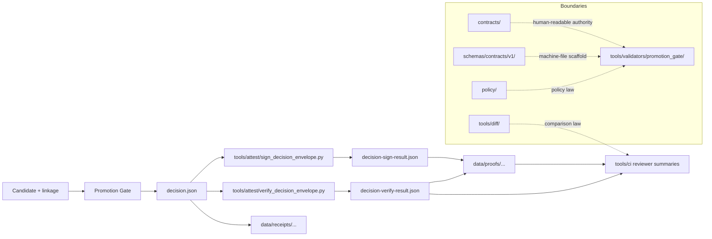

<!-- [KFM_META_BLOCK_V2]
doc_id: kfm://doc/TODO-NEEDS-VERIFICATION
title: tools/attest
type: standard
version: v1
status: draft
owners: @bartytime4life
created: TODO-NEEDS-VERIFICATION
updated: 2026-04-13
policy_label: public
related: [../README.md, ../../README.md, ../../.github/CODEOWNERS, ../../contracts/README.md, ../../schemas/README.md, ../../schemas/contracts/README.md, ../../schemas/contracts/v1/README.md, ../../schemas/tests/README.md, ../../schemas/promotion/decision-envelope.schema.json, ../../policy/README.md, ../../tests/README.md, ../../tests/contracts/README.md, ../../.github/actions/README.md, ../../.github/workflows/README.md, ../../scripts/README.md, ../validators/promotion_gate/README.md, ../ci/README.md, ../diff/README.md]
tags: [kfm, tools, attest, release-evidence, provenance, signatures, verification]
notes: [Merged from the existing doctrine-heavy lane contract and the newer Promotion Gate attestation thin slice. doc_id and created date still need direct repo-history verification. Exact executable inventory, workflow callers, trust-root handling, and active-branch parity remain NEEDS VERIFICATION.]
[/KFM_META_BLOCK_V2] -->

<a id="toolsattest"></a>

# tools/attest

Proof-pack, digest, signature, and attestation helper surface for governed KFM release evidence.


> [!IMPORTANT]
> **Status:** experimental  
> **Owners:** `@bartytime4life` *(current visible `/tools/` ownership flows from public `CODEOWNERS`; narrower lane-specific ownership still needs direct branch verification)*  
> **Path:** `tools/attest/README.md`  
> **Repo fit:** child lane of [`../README.md`](../README.md) · upstream [`../../README.md`](../../README.md) · governance [`../../.github/CODEOWNERS`](../../.github/CODEOWNERS) · control-plane neighbors [`../../.github/actions/README.md`](../../.github/actions/README.md) and [`../../.github/workflows/README.md`](../../.github/workflows/README.md) · authority neighbors [`../../contracts/README.md`](../../contracts/README.md), [`../../schemas/README.md`](../../schemas/README.md), [`../../schemas/contracts/README.md`](../../schemas/contracts/README.md), [`../../schemas/contracts/v1/README.md`](../../schemas/contracts/v1/README.md), and [`../../policy/README.md`](../../policy/README.md) · downstream promotion consumer [`../validators/promotion_gate/README.md`](../validators/promotion_gate/README.md) · reviewer-output neighbor [`../ci/README.md`](../ci/README.md) · comparison neighbor [`../diff/README.md`](../diff/README.md)  
> **Quick jumps:** [Scope](#scope) · [Repo fit](#repo-fit) · [Accepted inputs](#accepted-inputs) · [Exclusions](#exclusions) · [Current verified snapshot](#current-verified-snapshot) · [Directory tree](#directory-tree) · [Quickstart](#quickstart) · [Usage](#usage) · [Trust model](#trust-model) · [Attest helper behavior contract](#attest-helper-behavior-contract) · [Diagram](#diagram) · [Operating tables](#operating-tables) · [Task list](#task-list) · [FAQ](#faq) · [Appendix](#appendix)

> [!WARNING]
> Two adjacent seams should stay explicit here:
>
> 1. the repo now shows a **split contract surface**: [`../../contracts/README.md`](../../contracts/README.md) remains the stronger human-readable guide while [`../../schemas/contracts/v1/README.md`](../../schemas/contracts/v1/README.md) is the live machine-file scaffold; and  
> 2. the repo also shows a **placeholder-heavy local-action surface** under [`../../.github/actions/README.md`](../../.github/actions/README.md).
>
> `tools/attest/` may complement both. It must not quietly settle either one.

> [!TIP]
> **Current executable snapshot (thin slice)**  
> The current documented thin slice for this lane includes:
>
> - `tools/attest/sign_decision_envelope.py`
> - `tools/attest/verify_decision_envelope.py`
>
> Primary downstream consumer:
>
> - [`../validators/promotion_gate/README.md`](../validators/promotion_gate/README.md)
>
> Typical trust objects touched:
>
> - `decision.json`
> - `decision-sign-result.json`
> - `decision-verify-result.json`
> - derived promotion record / PROV / bundle objects downstream
>
> This is stronger than the older public snapshot that showed `tools/attest/` as README-only, but it still does **not** prove active-branch call signatures, mounted helper bodies, or live workflow wiring.

> [!NOTE]
> `tools/attest/` is a **helper lane**, not a hidden release system. It exists to make signing and verification steps explicit, reviewable, and downstream-friendly without collapsing promotion law, policy law, proof storage, catalog closure, or publication into one opaque surface.

---

## Scope

`tools/attest/` is the narrow KFM helper lane for reusable commands that inspect, verify, summarize, sign, or package **release-evidence support artifacts** without quietly becoming the release system itself.

In KFM terms, this lane belongs **downstream of doctrine** and **adjacent to** — not above — the contract, schema, policy, workflow, action, script, and runtime trust surfaces.

### What belongs here

Helpers in this directory should generally do one or more of the following:

- sign or verify already-emitted trust objects such as a `DecisionEnvelope`
- check digest / artifact binding for release-evidence support objects
- emit compact, machine-readable sign / verify results
- surface attestation state for downstream review, CI, or audit helpers
- provide tiny, non-sensitive examples that clarify helper invocation without inventing repo authority

### What does not belong here

This directory should not become:

- the canonical schema home
- the policy source of truth
- a hidden publish lane
- a secret-custody or trust-root vault
- a place to bury release-significant orchestration inside shell fragments or workflow YAML

[Back to top](#toolsattest)

---

## Repo fit

`tools/attest/` is small by design. Its value comes from being **legible** inside the broader helper family and **explicit** about which neighboring surface owns which responsibility.

| Relation | Surface | Why it matters |
| --- | --- | --- |
| Parent family contract | [`../README.md`](../README.md) | Defines the broader `tools/` lane doctrine and keeps helper families distinct. |
| Root posture | [`../../README.md`](../../README.md) | Carries the repo-wide evidence-first, trust-visible identity that this lane must not weaken. |
| Ownership boundary | [`../../.github/CODEOWNERS`](../../.github/CODEOWNERS) | Grounds visible ownership for `/tools/` while narrower lane ownership stays bounded. |
| Workflow boundary | [`../../.github/workflows/README.md`](../../.github/workflows/README.md) | Workflow YAML should orchestrate; reusable sign / verify logic should stay inspectable outside YAML. |
| Local-action seam | [`../../.github/actions/README.md`](../../.github/actions/README.md) | Repo-local actions are caller wrappers, not a replacement for small reviewable helpers. |
| Human-readable contract guide | [`../../contracts/README.md`](../../contracts/README.md) | This lane must link to contract meaning rather than redefining it. |
| Machine-file scaffold | [`../../schemas/contracts/v1/README.md`](../../schemas/contracts/v1/README.md) | Helper logic may consume machine contracts, but should not settle schema-home authority by inertia. |
| Policy boundary | [`../../policy/README.md`](../../policy/README.md) | Promotion allow / deny / abstain law belongs there or in validator-facing policy surfaces. |
| Verification family | [`../../tests/README.md`](../../tests/README.md), [`../../tests/contracts/README.md`](../../tests/contracts/README.md) | Tests and fixtures should prove helper behavior explicitly. |
| Thin orchestration | [`../../scripts/README.md`](../../scripts/README.md) | Script entrypoints may call these helpers, but reusable sign / verify logic should not be buried there. |
| Downstream promotion consumer | [`../validators/promotion_gate/README.md`](../validators/promotion_gate/README.md) | This is the clearest documented consumer of the current thin slice. |
| Reviewer-output neighbor | [`../ci/README.md`](../ci/README.md) | CI renderers may surface verification state, but they must stay downstream of machine artifacts. |
| Comparison neighbor | [`../diff/README.md`](../diff/README.md) | Diff law is separate from attestation law. |
| Adjacent process memory | [`../../data/receipts/README.md`](../../data/receipts/README.md) | Receipts remain compact process memory, not proof packs. |
| Adjacent proof lane | [`../../data/proofs/README.md`](../../data/proofs/README.md) | Stronger release evidence belongs in proof-bearing paths, not in ad hoc helper output alone. |

### Working boundary rule

If a change is mainly about:

- **promotion readiness**, it belongs first in [`../validators/promotion_gate/README.md`](../validators/promotion_gate/README.md)
- **policy classification**, it belongs first in [`../../policy/README.md`](../../policy/README.md)
- **reviewer-facing Markdown**, it belongs first in [`../ci/README.md`](../ci/README.md)
- **prior/current comparison**, it belongs first in [`../diff/README.md`](../diff/README.md)

Use `tools/attest/` only when the real burden is **attestation-adjacent helper behavior**.

[Back to top](#toolsattest)

---

## Accepted inputs

Accepted inputs for this lane are the **smallest explicit artifacts** needed to sign, verify, or summarize a release-evidence support step honestly.

| Input class | Examples | Why it belongs here |
| --- | --- | --- |
| Decision objects | `decision.json`, `DecisionEnvelope`-adjacent JSON, explicit decision refs | Sign / verify helpers need a concrete trust object to operate on. |
| Artifact locators | artifact URI, digest, subject ref, candidate ref, expected helper name | Keeps helper behavior explicit and joinable with downstream receipts and proofs. |
| Verification context | schema refs, verifier name, checked-at timestamp, explicit output path | Enables clear verification output without turning helpers into schema or policy owners. |
| Small examples | tiny fixture JSON, narrow example outputs, public-safe sample commands | Helps document helper usage without becoming canonical storage or secret material. |
| Derived result artifacts | `decision-sign-result.json`, `decision-verify-result.json` | Compact machine-readable outputs are the natural downstream surface for this lane. |

### Accepted input posture

Inputs here should be:

- explicit
- minimally sufficient
- easy to inspect in code review
- safe to print in logs when rendered carefully
- impossible to confuse with publication, catalog closure, or policy truth

[Back to top](#toolsattest)

---

## Exclusions

Use the following split aggressively. It prevents this lane from becoming a convenience bucket that quietly absorbs the repo’s trust model.

| Exclusion | Goes instead | Why |
| --- | --- | --- |
| Canonical contract meaning | [`../../contracts/README.md`](../../contracts/README.md), [`../../schemas/README.md`](../../schemas/README.md) | Human-readable and machine-readable contract authority already have named homes. |
| Policy law and deny-by-default behavior | [`../../policy/README.md`](../../policy/README.md), [`../validators/promotion_gate/README.md`](../validators/promotion_gate/README.md) | This lane should not decide promotion law. |
| Secret custody / trust-root management | workflow / ops / secret-bearing surfaces *(exact home remains NEEDS VERIFICATION)* | Helper code should not quietly become the secret-management layer. |
| Publication or promotion state elevation | promotion-gate and release-bearing surfaces | Signing / verification support is not publication. |
| Proof-pack assembly and catalog closure | [`../../data/proofs/README.md`](../../data/proofs/README.md), `../../data/catalog/` | Stronger release evidence and outward metadata closure are later seams. |
| Diff computation | [`../diff/README.md`](../diff/README.md) | Comparison law is distinct from attestation law. |
| Reviewer-facing rendering | [`../ci/README.md`](../ci/README.md) | CI helpers should render already-produced machine artifacts rather than reimplement sign / verify logic. |
| Hidden workflow-only shell blobs | [`../../.github/workflows/README.md`](../../.github/workflows/README.md), [`../../.github/actions/README.md`](../../.github/actions/README.md), [`../../scripts/README.md`](../../scripts/README.md) | Reviewers should be able to inspect core helper behavior outside YAML. |

[Back to top](#toolsattest)

---

## Current verified snapshot

Use this section for **current documented truth**.

Do **not** silently convert visible lane presence into claims of mature, end-to-end, merge-blocking, or fully verified coverage.

| Evidence item | Status | Why it matters |
| --- | --- | --- |
| `tools/attest/README.md` exists on visible public `main` | **CONFIRMED** | This is a real lane surface, not a hypothetical path. |
| Older public state showed `tools/attest/` as README-only | **CONFIRMED historical posture** | Keeps executable claims bounded unless the active branch is inspected directly. |
| The lane contract is already substantive on public `main` | **CONFIRMED** | Future edits should revise in place, not reset to generic scaffold text. |
| The visible `tools/` family includes `attest/`, `catalog/`, `ci/`, `diff/`, `docs/`, `probes/`, and `validators/` | **CONFIRMED** | Grounds sibling navigation and family-boundary language. |
| `/tools/` ownership is covered by current visible `CODEOWNERS` | **CONFIRMED** | Grounds the owners line. |
| `.github/actions/` is visible and named, but placeholder-heavy | **CONFIRMED / bounded maturity** | This lane should complement action wrappers without overclaiming deep automation. |
| `.github/workflows/` evidence remains bounded on visible public surfaces | **CONFIRMED bounded workflow evidence** | Prevents overclaiming checked-in workflow callers or enforcement depth. |
| The repo now shows a split contract surface across `contracts/` and `schemas/contracts/v1/` | **CONFIRMED** | This lane must not quietly settle schema-home authority. |
| The current documented thin slice explicitly names `sign_decision_envelope.py` and `verify_decision_envelope.py` | **CONFIRMED documented thin slice** | The README should keep these names visible and bounded. |
| Promotion-gate documentation explicitly depends on signing and verification helpers in this lane | **CONFIRMED via adjacent documentation** | There is a concrete downstream consumer to design around. |
| Exact executable helper inventory on the active branch | **UNKNOWN / NEEDS VERIFICATION** | Public-tree and documented-lane evidence are not the same thing as a mounted checkout. |
| Exact Python call signatures, trust-root handling, and any live OCI / Cosign / Rekor profile | **UNKNOWN / NEEDS VERIFICATION** | The docs explicitly keep these bounded. |
| Any merge-blocking behavior that depends on signed decisions today | **NOT CLAIMED** | Current visible docs do not prove that stronger runtime posture. |

[Back to top](#toolsattest)

---

## Directory tree

### Current public subtree

```text
tools/attest/
└── README.md
```

### Current documented thin-slice shape

```text
tools/attest/
├── README.md
├── sign_decision_envelope.py
└── verify_decision_envelope.py
```

### Adjacent current public seams relevant to `attest/`

```text
.github/actions/
├── metadata-validate/
├── metadata-validate-v2/
├── opa-gate/
├── provenance-guard/
└── sbom-produce-and-sign/

schemas/contracts/v1/
├── common/
├── correction/
├── data/
├── evidence/
├── policy/
├── release/
├── runtime/
└── source/
```

> [!NOTE]
> The trees above are intentionally split:
>
> - the first tree is **current public subtree fact**
> - the second tree is **current documented thin-slice shape**
> - the third tree shows **adjacent public seams**
>
> Do not collapse those into one stronger claim than the evidence supports.

### PROPOSED slightly richer helper set

```text
tools/attest/
├── README.md
├── sign_*.py|sh|mjs
├── verify_*.py|sh|mjs
├── summarize_*.py|mjs
├── fixtures/
└── examples/
```

The key rule is not the filename wildcard itself. The key rule is that helper inventory stays:

- small
- explicit
- reviewable
- easy to invoke from CI, local actions, or scripts
- impossible to confuse with canonical storage or secret custody

[Back to top](#toolsattest)

---

## Quickstart

Start by verifying surrounding repo state before you extend executable content.

### 1) Inspect the surrounding surfaces

```bash
sed -n '1,260p' tools/README.md
sed -n '1,180p' .github/CODEOWNERS
sed -n '1,260p' .github/actions/README.md
sed -n '1,260p' .github/workflows/README.md
sed -n '1,260p' contracts/README.md
sed -n '1,260p' schemas/README.md
sed -n '1,260p' schemas/contracts/README.md
sed -n '1,260p' schemas/contracts/v1/README.md
sed -n '1,260p' schemas/tests/README.md
sed -n '1,260p' policy/README.md
sed -n '1,260p' tests/README.md
sed -n '1,260p' tests/contracts/README.md
sed -n '1,260p' scripts/README.md
sed -n '1,260p' tools/validators/promotion_gate/README.md
```

### 2) Confirm the current subtree and live sibling / action / schema context

```bash
find tools/attest -maxdepth 2 \( -type f -o -type d \) | sort
find tools -maxdepth 2 -type d | sort
find .github/actions -maxdepth 2 -type f | sort
find schemas/contracts/v1 -maxdepth 3 -type f | sort
find schemas/tests -maxdepth 6 -type f | sort
```

### 3) Search for existing trust and release-evidence terminology before inventing anything new

```bash
rg -n "attest|attestation|proof[- ]pack|release manifest|ReleaseManifest|DecisionEnvelope|EvidenceBundle|RuntimeResponseEnvelope|CorrectionNotice|SBOM|cosign|in-toto|provenance|spec_hash|run_receipt|sign_decision|verify_decision" \
  tools contracts schemas policy tests scripts .github docs -S 2>/dev/null
```

### 4) Re-open actual schema bodies before claiming validation depth

```bash
find schemas/contracts/v1 -type f -name '*.schema.json' -print -exec sed -n '1,80p' {} \;
```

### 5) Verify whether workflow or local-action callers actually exist

```bash
find .github/workflows -maxdepth 2 -type f | sort
grep -R "uses: ./.github/actions/" -n .github/workflows 2>/dev/null || true
```

### 6) Exercise the current thin-slice sign / verify flow

```bash
python tools/attest/sign_decision_envelope.py \
  decision.json \
  --artifact-uri "ghcr.io/example/promotion:overlay-floodplain-kansas-v1" \
  --output decision-sign-result.json \
  --yes

python tools/attest/verify_decision_envelope.py \
  "ghcr.io/example/promotion:overlay-floodplain-kansas-v1" \
  --output decision-verify-result.json
```

> [!NOTE]
> The sample invocations above are **documented lane-contract examples**, not proof that the active branch currently ships identical call signatures. Recheck helper bodies before merge, CI wiring, or release-facing assertions.

[Back to top](#toolsattest)

---

## Usage

### Use this lane for narrow, testable helper responsibilities

A helper added here should answer one small question clearly.

Good fits:

- “Can this already-emitted decision object be signed against an explicit artifact reference?”
- “Can this already-emitted decision object be verified and reported as a compact result?”
- “Can we surface digest / verifier / checked-at state without rewriting promotion law?”
- “Can we hand downstream lanes one small machine-readable sign / verify result instead of burying logic in workflow YAML?”

Bad fits:

- “Should this candidate promote?”
- “Should policy allow this release?”
- “What changed between prior and current bundles?”
- “Can we publish the release from here?”
- “Can we silently rewrite receipts, proofs, or catalogs as a side effect?”

### Keep helper behavior explicit

Prefer helpers that are:

- deterministic
- read-mostly
- explicit about inputs
- explicit about outputs
- safe to inspect in code review
- easy to exercise locally
- easy to prove with narrow fixtures and tests

Avoid helpers that:

- infer missing trust inputs
- silently look up secrets or trust roots from hidden state
- default to “verified” when context is missing
- make publication-side mutations as a convenience step
- re-implement validator, policy, diff, or renderer responsibilities

### Healthy call order

The healthy order for this lane is:

1. validate candidate and linkage upstream  
2. emit the machine-readable decision object upstream  
3. call `tools/attest/` only if the broader lane actually requires sign / verify mechanics  
4. emit a small sign-result or verify-result object  
5. let receipts, proofs, review artifacts, and publication surfaces consume those objects downstream according to their own lane law

That keeps `tools/attest/` narrow and prevents it from quietly absorbing the whole release path.

[Back to top](#toolsattest)

---

## Trust model

`tools/attest/` should preserve the repo’s trust split rather than flatten it.

The working rule is:

**receipt ≠ proof ≠ catalog ≠ publication**

More concretely:

- helpers in `tools/attest/` may produce or verify **support artifacts**
- receipts remain **process memory**
- proof-bearing objects remain **separate trust-bearing outputs**
- reviewer summaries remain **derived downstream views**
- publication remains a **later governed state transition**

When this lane is healthy, it makes trust steps easier to inspect. It does **not** become the trust system by itself.

[Back to top](#toolsattest)

---

## Attest helper behavior contract

The helper names below are part of the **current documented thin slice**. Their exact active-branch implementations still need re-verification before stronger claims are made.

| Helper | Minimum explicit inputs | Expected outputs | Failure posture | Must not do |
| --- | --- | --- | --- | --- |
| `sign_decision_envelope.py` | `decision.json`, explicit artifact URI/ref, explicit output path | `decision-sign-result.json` | fail clearly; do not silently substitute hidden trust material | publish, infer policy truth, or mutate receipt / proof / catalog lanes by side effect |
| `verify_decision_envelope.py` | explicit artifact / attestation reference, explicit output path | `decision-verify-result.json` | fail clearly; never default to `verified = true` | redefine promotion law, skip missing proof refs, or silently rewrite the input decision object |

### Minimum downstream artifacts this lane should cooperate with cleanly

- `decision.json`
- `decision-sign-result.json`
- `decision-verify-result.json`

### Typical downstream artifacts this lane may help feed

- `promotion-record.json`
- `promotion-prov.json`
- `promotion-bundle.json`
- reviewer-facing CI renderings that surface verification state

[Back to top](#toolsattest)

---

## Diagram



> [!NOTE]
> The diagram is intentionally responsibility-led, not implementation-deep. It shows **ownership boundaries**, not a claim of full mounted workflow depth.

[Back to top](#toolsattest)

---

## Operating tables

### Boundary question → correct lane

| If the main question is… | Use this lane? | Better home |
| --- | --- | --- |
| “Can this decision object be signed or verified cleanly?” | Yes | `tools/attest/` |
| “Should this candidate be promoted?” | No | `tools/validators/promotion_gate/` |
| “What changed between prior and current bundles?” | No | `tools/diff/` |
| “How should this be rendered for a reviewer?” | No | `tools/ci/` |
| “What is the canonical contract shape?” | No | `contracts/` + `schemas/` |
| “What reasons or obligations should deny promotion?” | No | `policy/` |

### Claim boundary for this README

| Claim | Posture |
| --- | --- |
| `tools/attest/README.md` is a real lane surface | **CONFIRMED** |
| The lane is experimental and owned through visible `/tools/` coverage | **CONFIRMED** |
| The current documented thin slice names `sign_decision_envelope.py` and `verify_decision_envelope.py` | **CONFIRMED documented thin slice** |
| The active branch definitely contains both helper bodies and the exact documented CLI flags | **NEEDS VERIFICATION** |
| Live Cosign / Rekor / transparency-log behavior is active today | **NOT CLAIMED** |
| Merge blocking depends on signed decisions today | **NOT CLAIMED** |

[Back to top](#toolsattest)

---

## Task list

- [x] preserve the lane’s README-first public-tree evidence
- [x] keep the split between current public subtree and current documented thin slice explicit
- [x] keep the downstream promotion-gate consumer explicit
- [x] keep the split contract-surface warning explicit
- [x] keep `tools/attest/` separate from policy, diff, CI rendering, and publication authority
- [ ] re-verify active-branch helper bodies and CLI signatures
- [ ] add helper-specific fixtures for success, failure, and missing-proof paths
- [ ] add narrow tests that prove sign / verify outputs without overclaiming workflow depth
- [ ] confirm real workflow callers and upload surfaces on the mounted branch
- [ ] document any repo-ratified OCI / DSSE / Cosign / Rekor posture only after direct verification
- [ ] decide whether richer helper inventory belongs here or should remain constrained to the current two-helper thin slice

### Definition of done for the next real increment

A stronger next increment should not merge until all of the following are true:

1. the helper files are present on the checked-out branch  
2. their call signatures are directly rechecked  
3. at least one narrow positive-path test and one narrow negative-path test exist  
4. receipt / proof / publication boundaries remain explicit  
5. no section of this README claims stronger workflow or trust-root reality than the branch actually proves

[Back to top](#toolsattest)

---

## FAQ

### Why is `tools/attest/` separate from the Promotion Gate?

Because the repo’s documented split is healthier that way: promotion-gate owns **law and fail-closed gating**; `tools/attest/` owns **signing / verification mechanics**. Keeping them separate makes review and testing more honest.

### Why does this README stay cautious about executable helpers?

Because current visible evidence proves a **documented thin slice**, not blanket active-branch parity. The file should not upgrade bounded documentation into stronger implementation claims.

### Can this lane own schema or policy truth?

No. It can **consume** contracts, schemas, and policy-facing outputs, but canonical meaning stays upstream in those named lanes.

### Can helpers here publish or promote a release?

They should not. This lane can help produce or verify support artifacts. Promotion and publication remain distinct governed steps.

### Why are the sample commands illustrative?

Because the lane documents a reusable helper contract, while exact active-branch call signatures and trust-root handling still require direct recheck before merge or release use.

### What is the safest next move after this README revision?

Verify the mounted branch actually contains `sign_decision_envelope.py` and `verify_decision_envelope.py`, then add one narrow success-path test and one narrow failure-path test before claiming deeper workflow maturity.

[Back to top](#toolsattest)

---

## Appendix

<details>
<summary><strong>Truth posture used in this README</strong></summary>

### CONFIRMED
Directly supported by current visible repo-facing documentation surfaces.

### CONFIRMED documented thin slice
Supported by the current lane contract or adjacent lane contract, but still narrower than full active-branch implementation proof.

### PROPOSED
Recommended landing shape or operating rule that fits KFM doctrine but is not yet proven as mounted implementation.

### UNKNOWN / NEEDS VERIFICATION
Items that require direct branch inspection, executable helper review, workflow inspection, trust-root confirmation, or history verification before stronger claims are safe.

### NOT CLAIMED
Deliberately excluded claims that would outrun visible evidence.

</details>

<details>
<summary><strong>Open verification items</strong></summary>

- exact `doc_id`
- exact `created` date from repo history
- active-branch helper inventory under `tools/attest/`
- exact helper call signatures and supported flags
- current workflow callers
- exact secret / trust-root handling posture
- any repo-ratified OCI / DSSE / Cosign / Rekor profile
- any current release-proof examples that consume these helpers end-to-end

</details>

[Back to top](#toolsattest)
