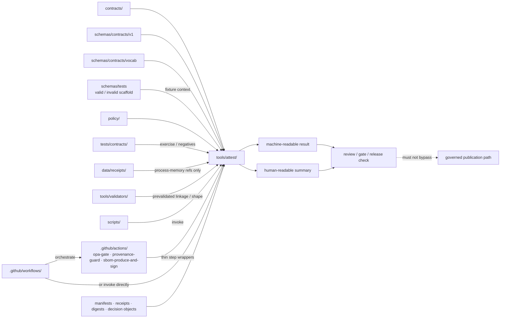

<!-- [KFM_META_BLOCK_V2]
doc_id: kfm://doc/TODO-NEEDS-VERIFICATION
title: tools/attest
type: standard
version: v1
status: draft
owners: @bartytime4life
created: TODO-NEEDS-VERIFICATION
updated: 2026-04-16
policy_label: public
related: [
  ../README.md,
  ../../README.md,
  ../../.github/CODEOWNERS,
  ../../contracts/README.md,
  ../../schemas/README.md,
  ../../schemas/contracts/README.md,
  ../../schemas/contracts/v1/README.md,
  ../../schemas/tests/README.md,
  ../../schemas/promotion/decision-envelope.schema.json,
  ../../policy/README.md,
  ../../tests/README.md,
  ../../tests/contracts/README.md,
  ../../data/receipts/README.md,
  ../../data/work/README.md,
  ../../.github/actions/README.md,
  ../../.github/workflows/README.md,
  ../../.github/watchers/README.md,
  ../../scripts/README.md,
  ../../tools/validators/README.md,
  ../../tools/validators/promotion_gate/README.md,
  ../../tools/probes/README.md
]
tags: [kfm, tools, attest, release-evidence, provenance, signatures, verification, proofs, receipts]
notes: [
  Merged from the older doctrine-heavy tools/attest README and the newer Promotion Gate thin-slice attestation flow.
  This revision aligns the lane with updated workflow, watcher, receipt, and validator documentation: attest helpers may consume validated receipts and decision objects, but they do not own receipt storage, workflow orchestration, or proof authority.
  doc_id and document-record dates need verification; owners reflect current public CODEOWNERS coverage for /tools/; exact executable inventory, workflow wiring, and trust-root handling remain NEEDS VERIFICATION.
]
[/KFM_META_BLOCK_V2] -->

<a id="top"></a>

# `tools/attest`

Proof-pack, digest, signature, and attestation helper surface for governed KFM release evidence.

> [!IMPORTANT]
> **Status:** experimental  
> **Owners:** `@bartytime4life` *(current `/tools/` owner inherited from visible `CODEOWNERS`; narrower lane-specific ownership is not separately declared on current public `main`)*  
> **Path:** `tools/attest/README.md`  
> **Repo fit:** child lane of [`../README.md`](../README.md) · upstream [`../../README.md`](../../README.md) · governance [`../../.github/CODEOWNERS`](../../.github/CODEOWNERS) · control-plane neighbors [`../../.github/actions/README.md`](../../.github/actions/README.md) and [`../../.github/workflows/README.md`](../../.github/workflows/README.md) · authority neighbors [`../../contracts/README.md`](../../contracts/README.md), [`../../schemas/README.md`](../../schemas/README.md), [`../../schemas/contracts/README.md`](../../schemas/contracts/README.md), and [`../../policy/README.md`](../../policy/README.md) · proof neighbors [`../../tests/README.md`](../../tests/README.md), [`../../tests/contracts/README.md`](../../tests/contracts/README.md), [`../../scripts/README.md`](../../scripts/README.md), [`../../data/receipts/README.md`](../../data/receipts/README.md), and [`../../tools/validators/README.md`](../../tools/validators/README.md)  
> **Evidence posture:** doctrine-grounded · current-public-`main` repo-grounded for visible tree state · deeper local checkout parity, platform settings, non-public callers, and live trust-root handling remain bounded  
> **Role:** reusable helper lane for verification, signing, summarization, digest checks, and attestation-adjacent release-evidence support  
> **Not this lane:** canonical schema-home authority, policy truth, receipt storage, secret custody, or hidden publish logic  
>
> 
> 
> 
> 
> 
> 
> 
>
> **Quick jumps:** [Scope](#scope) · [Repo fit](#repo-fit) · [Accepted inputs](#accepted-inputs) · [Exclusions](#exclusions) · [Current verified snapshot](#current-verified-snapshot) · [Directory tree](#directory-tree) · [Quickstart](#quickstart) · [Usage](#usage) · [Trust model](#trust-model) · [Attest helper behavior contract](#attest-helper-behavior-contract) · [Diagram](#diagram) · [Operating tables](#operating-tables) · [Task list](#task-list) · [FAQ](#faq) · [Appendix](#appendix)

> [!WARNING]
> Three adjacent seams matter here and should remain explicit:
>
> 1. the repo now shows a **split contract surface** (`contracts/` as the stronger human-readable guide, `schemas/contracts/v1/` as the live machine-file scaffold),  
> 2. the repo also shows a **placeholder-heavy local-action surface** under [`.github/actions/`](../../.github/actions/README.md), and  
> 3. the updated docs now treat **receipts as governed process memory** and **proofs as separate higher-order trust objects**.
>
> `tools/attest/` may complement all three. It must not quietly settle any of them.

> [!TIP]
> **Current executable snapshot (thin slice)**  
> The current documented thin slice for this lane includes the following attestation helpers used by the Promotion Gate flow:
>
> **Attestation helpers**
> - `tools/attest/sign_decision_envelope.py`
> - `tools/attest/verify_decision_envelope.py`
>
> **Primary downstream consumer**
> - `tools/validators/promotion_gate/README.md`
>
> **Typical trust objects touched**
> - `decision.json`
> - `decision-sign-result.json`
> - `decision-verify-result.json`
> - derived promotion record / PROV / bundle objects downstream
>
> This snapshot is stronger than the older README state, which described the lane primarily as a verification and summarization surface while public `main` remained README-only here. Keep this block synchronized with the mounted implementation as executable helpers, schemas, or trust objects land.

> [!NOTE]
> The parent [`tools/README.md`](../README.md) remains the family contract for the wider helper surface. This file narrows that contract to `attest/` while grounding adjacent schema, policy, receipt, validator, watcher, action, verification, and promotion-trust seams in the visible repo.

---

## Scope

`tools/attest/` is the narrow KFM helper lane for reusable commands that inspect, verify, summarize, sign, or package **release-evidence support artifacts** without quietly becoming the release system itself.

In KFM terms, this lane belongs **downstream of doctrine** and **adjacent to** — not above — the contract, schema, policy, workflow, watcher, validator, script, and runtime trust surfaces.

### What belongs here

Helpers in this directory should generally do one or more of the following:

- verify digests, manifests, proof objects, or attestation payloads
- summarize release evidence for reviewers or CI logs
- assemble small support bundles for review or release checks
- sign already contract-bound trust objects
- check that declared proof objects are present, shaped correctly, and internally consistent
- consume validated receipt or decision references when higher-order proof construction needs them
- emit machine-readable pass/fail results that higher-level callers can consume

### What this lane must protect

- **fail-closed behavior** over best-effort ambiguity
- **read-mostly verification by default**
- **discoverability** of release-evidence support logic
- **clear caller boundaries** between tools, scripts, local actions, validators, and workflows
- **schema-home clarity** instead of silent path guessing
- **receipt/proof separation**
- **no secret ownership drift** into helper code
- **no silent publish path**
- **honest placeholder awareness** when adjacent schemas or action lanes are still scaffolds

### What changed around this lane

| Surrounding surface | Current public read | Why this revision incorporates it |
|---|---|---|
| [`../../contracts/README.md`](../../contracts/README.md) | `contracts/` now explicitly describes a **split but asymmetric** contract surface | This README should no longer speak as if root `contracts/` were the only nearby contract signal |
| [`../../schemas/contracts/v1/README.md`](../../schemas/contracts/v1/README.md) | `schemas/contracts/v1/` is a **live public family lane** with checked-in `*.schema.json` files, still placeholder-heavy | Helper claims need to separate inventory checks from deep schema enforcement |
| [`../../.github/actions/README.md`](../../.github/actions/README.md) | `.github/actions/` is real and named, but still **placeholder-heavy** | Future callers may arrive through thin repo-local actions before full workflow YAML returns |
| [`../../tests/contracts/README.md`](../../tests/contracts/README.md) | `tests/contracts/` is a named contract-facing verification family, currently README-only in public view | Negative-path and valid/invalid proof burden belongs there, not hidden inside helper code |
| [`../../tools/validators/promotion_gate/README.md`](../../tools/validators/promotion_gate/README.md) | Promotion Gate now expects signing and verification helpers as part of the fuller thin slice | This lane now has a concrete downstream trust consumer to document |
| [`../../data/receipts/README.md`](../../data/receipts/README.md) | receipts are now documented more explicitly as governed process memory | Attest helpers may consume validated receipt refs, but should not own receipt storage |
| [`../../.github/watchers/README.md`](../../.github/watchers/README.md) | watcher doctrine now treats receipts, validation, and non-self-publishing posture as explicit | Attestation helpers must not turn watcher automation into a hidden publish path |
| [`../../tools/validators/README.md`](../../tools/validators/README.md) | validators now explicitly consume receipts, check linkage, and gate side effects fail-closed | This lane should remain downstream of validation, not a replacement for it |

### Evidence posture used in this README

| Label | Meaning here |
|---|---|
| **CONFIRMED** | Directly supported by the current public repo tree or by adjacent repo/doctrine material already visible |
| **INFERRED** | Strongly implied by repo structure and KFM doctrine, but not directly implemented here yet |
| **PROPOSED** | Recommended starter pattern for this lane |
| **UNKNOWN** | Not proven strongly enough from current public repo evidence |
| **NEEDS VERIFICATION** | Important enough to surface before merge or rollout |

[Back to top](#top)

---

## Repo fit

`tools/attest/` should feel native inside the existing repo lattice, not like an isolated scripts bin.

| Direction | Surface | Why it matters |
|---|---|---|
| Parent | [`../README.md`](../README.md) | Defines the overall `tools/` family contract and helper-lane boundaries |
| Upstream | [`../../README.md`](../../README.md) | Root repo posture: governed, evidence-first, map-first, time-aware |
| Governance | [`../../.github/CODEOWNERS`](../../.github/CODEOWNERS) | Grounds current visible ownership coverage for `/tools/` |
| Control-plane orchestration | [`../../.github/workflows/README.md`](../../.github/workflows/README.md) | Workflow YAML may call helpers here, but should not become the only place their logic exists |
| Watcher boundary | [`../../.github/watchers/README.md`](../../.github/watchers/README.md) | Watcher doctrine now depends on receipts and validation without moving watcher logic into this lane |
| Control-plane step reuse | [`../../.github/actions/README.md`](../../.github/actions/README.md) | Repo-local actions are the thin step-wrapper seam; heavy reusable logic should still stay reviewable outside workflow glue |
| Adjacent action names | [`../../.github/actions/opa-gate/README.md`](../../.github/actions/opa-gate/README.md), [`../../.github/actions/provenance-guard/README.md`](../../.github/actions/provenance-guard/README.md), [`../../.github/actions/sbom-produce-and-sign/README.md`](../../.github/actions/sbom-produce-and-sign/README.md) | These names are already visible on public `main`; future callers may route through them |
| Root contract guide | [`../../contracts/README.md`](../../contracts/README.md) | Human-readable trust-object meaning still leans here more strongly than anywhere else |
| Machine-file scaffold | [`../../schemas/README.md`](../../schemas/README.md), [`../../schemas/contracts/README.md`](../../schemas/contracts/README.md), [`../../schemas/contracts/v1/README.md`](../../schemas/contracts/v1/README.md) | Versioned machine-file paths are now visible and relevant, but canonical schema-home authority is still unresolved |
| Schema fixture scaffold | [`../../schemas/tests/README.md`](../../schemas/tests/README.md) | Current public scaffold context for nested `valid/` and `invalid/` example folders |
| Policy authority | [`../../policy/README.md`](../../policy/README.md) | Policy owns allow/deny outcomes, reasons, obligations, and no-silent-publish rules |
| Contract-facing proof | [`../../tests/contracts/README.md`](../../tests/contracts/README.md) | Stronger current family for valid/invalid examples, schema drift checks, and negative-path proof |
| Broader proof / orchestration | [`../../tests/README.md`](../../tests/README.md), [`../../scripts/README.md`](../../scripts/README.md) | Tests carry verification burden; scripts may orchestrate local/operator flows |
| Process-memory surface | [`../../data/receipts/README.md`](../../data/receipts/README.md) | Receipts remain governed process memory rather than attestation-owned objects |
| Bounded work surface | [`../../data/work/README.md`](../../data/work/README.md) | Temporary state belongs there, not in attestation helpers |
| Neighbor helper lanes | [`../validators/README.md`](../validators/README.md), [`../ci/README.md`](../ci/README.md), [`../diff/README.md`](../diff/README.md), [`../catalog/README.md`](../catalog/README.md), [`../probes/README.md`](../probes/README.md), [`../docs/README.md`](../docs/README.md) | Keep helper responsibilities separated and reviewable rather than collapsing into one catch-all lane |
| Thin-slice downstream | [`../../tools/validators/promotion_gate/README.md`](../../tools/validators/promotion_gate/README.md) | Promotion currently provides the clearest end-to-end consumer for signing and verification helpers |

### Working interpretation

`tools/attest/` is a **helper surface**, not a sovereign authority surface.

- **`contracts/`** explains what trust-bearing objects mean.
- **`schemas/contracts/v1/`** exposes current versioned machine-file families.
- **`policy/`** decides allow/deny behavior, reasons, obligations, and no-silent-publish outcomes.
- **`tests/contracts/`** should hold contract-facing proof burden and negative-path examples.
- **`data/receipts/`** holds process memory.
- **`tools/validators/`** checks linkage, shape, and fail-closed expectations before stronger actions proceed.
- **`.github/actions/`** and **`.github/workflows/`** are control-plane seams, still placeholder-heavy or README-led on public evidence.
- **`scripts/`** should stay thin and operator-safe.
- **`tools/attest/`** should provide reusable verification, signing, or summarization building blocks for higher-order trust objects.

[Back to top](#top)

---

## Accepted inputs

The parent `tools/` guidance and adjacent repo surfaces imply that this lane should accept **evidence-support inputs**, not arbitrary application data.

| Input class | Examples | Status | Notes |
|---|---|---|---|
| Digests and checksum material | `sha256` digests, `spec_hash` outputs, checksum manifests, manifest-linked file hashes | **CONFIRMED / INFERRED** | Core fit for small verification helpers |
| Release proof metadata | `ReleaseManifest`, `ReleaseProofPack`, run receipts, rollback refs, correction refs | **CONFIRMED / INFERRED** | Object family is visible in doctrine and adjacent repo docs, but executable public examples are not yet fully surfaced here |
| Runtime and review trust objects | `DecisionEnvelope`, `EvidenceBundle`, `RuntimeResponseEnvelope`, `CorrectionNotice` | **CONFIRMED / INFERRED** | Current public machine-file families and policy docs now make these names harder-edged than before |
| Schema-path and vocabulary refs | `schemas/contracts/v1/*/*.schema.json`, `schemas/contracts/vocab/*.json` | **CONFIRMED path / NEEDS VERIFICATION body maturity** | Good helper input for path echoing, registry lookup, and profile reporting |
| Review-safe fixtures | `tests/contracts/`, `schemas/tests/fixtures/contracts/v1/{valid,invalid}/` | **CONFIRMED family / scaffold** | Fixture burden belongs outside helper code; current public state is still scaffold-heavy |
| CI / local invocation parameters | explicit input paths, output report paths, strict/fail flags, format selectors | **PROPOSED** | Strong fit for reusable helpers once executable inventory exists |
| Optional provenance attachments | SBOMs, attestation statements, provenance JSON, transparency-log refs, support bundles | **PROPOSED / doctrine-grounded** | Keep these as inputs or refs, not as secret-bearing control material |
| Stable artifact URIs | OCI refs, KFM URIs, immutable subject refs | **PROPOSED / thin-slice-aligned** | Needed when signing or verifying trust objects rather than just inspecting them |
| Validated receipt refs | `receipt_ref`, receipt IDs, receipt-linked decision refs | **INFERRED / doctrine-aligned** | Useful when proofs are assembled from already validated process memory without owning receipt storage |

### Preferred input posture

- explicit file paths over hidden discovery
- declared schema or profile versions over implicit assumptions
- release-scoped references over ad hoc loose files
- public-safe fixtures over production secrets
- echoed schema paths over guessed authority
- explicit “placeholder schema / preflight-only” reporting when deep validation is not actually proven
- stable subject refs when binding signatures or attestations to a trust object
- validated receipts or decision refs over ad hoc, unvalidated process traces

[Back to top](#top)

---

## Exclusions

This directory should stay sharp. The following do **not** belong here as primary responsibility:

| Excluded from `tools/attest/` | Put it here instead |
|---|---|
| Canonical schema-home authority or trust-object meaning | `../../contracts/`, `../../schemas/contracts/`, and the eventual authority-resolution change that settles between them |
| Policy bundles, reasons, obligation registries, or review logic | `../../policy/` and `../../schemas/contracts/vocab/` where machine registries are the chosen home |
| Whole repo-local action wrappers | `../../.github/actions/` |
| Workflow orchestration logic | `../../.github/workflows/` or `../../scripts/` |
| Receipt storage or receipt archives | `../../data/receipts/` |
| Working caches or temporary transform state | `../../data/work/` |
| Long-lived review artifacts, proof packs, or release objects as storage | governed release / data / evidence surfaces |
| Secret keys, signing identities, private trust roots | infra / secret manager / environment-specific secure storage |
| Runtime publish or promote logic | governed runtime / release lane |
| Ad hoc “misc signing helpers” scattered across repo | centralize in `tools/attest/` once real helper logic exists |
| Hidden enforcement by UI or shell behavior alone | `../../policy/`, `../../tests/`, and caller lanes |

> [!CAUTION]
> A helper in `tools/attest/` may **support** release evidence. It must not quietly become the release authority, the policy engine, the schema authority, the receipt owner, or the only place where provenance meaning survives.

[Back to top](#top)

---

## Current verified snapshot

| Evidence item | Status | Why it matters |
|---|---|---|
| `tools/attest/README.md` exists on current public `main` | **CONFIRMED** | This is a real lane surface, not a hypothetical path |
| Older public state showed `tools/attest/` as README-only | **CONFIRMED historical public posture** | Keeps executable claims bounded unless current branch inventory is checked |
| The lane contract here is already substantive on public `main` | **CONFIRMED** | Future edits should revise in place rather than reverting to scaffold text |
| The live public `tools/` listing confirms sibling families `attest/`, `catalog/`, `ci/`, `diff/`, `docs/`, `probes/`, and `validators/` | **CONFIRMED** | Grounds relative links and current family context from the tree itself |
| `/tools/` ownership is covered by current visible `CODEOWNERS` | **CONFIRMED** | Grounds the owners line for this file |
| Public `.github/workflows/` remains documented as a governed workflow surface, with current branch inventory still bounded by verification posture | **CONFIRMED / bounded** | Prevents overclaiming checked-in workflow callers |
| Public `.github/actions/` is now visible and named | **CONFIRMED** | Caller-adjacent control-plane seams are no longer purely hypothetical |
| `.github/actions/` currently exposes `metadata-validate/`, `metadata-validate-v2/`, `opa-gate/`, `provenance-guard/`, `sbom-produce-and-sign/`, a root `action.yml`, and `src/`, but remains placeholder-heavy | **CONFIRMED** | `tools/attest/` should complement those names, not duplicate them blindly |
| `contracts/README.md` now explicitly describes a **split but asymmetric** contract surface | **CONFIRMED** | This README should no longer treat root `contracts/` as the lone nearby contract signal |
| `schemas/contracts/v1/` exists with multiple family lanes and checked-in `*.schema.json` files | **CONFIRMED** | There is now a live public machine-file scaffold relevant to this lane |
| Reopened raw `v1` schema bodies remain placeholder-heavy in public view | **CONFIRMED / bounded maturity** | Helper claims must separate preflight or inventory checks from deep schema enforcement |
| `schemas/contracts/vocab/` is visible with machine-readable vocabularies | **CONFIRMED** | Vocabulary lookups may matter here, but vocabulary authority still lives elsewhere |
| `tests/contracts/` exists as the sharper contract-facing verification family, but current public inventory there is README-only | **CONFIRMED** | Negative-path and valid/invalid burden has a named home, but not yet a visible executable suite |
| Promotion Gate README now explicitly depends on signing and verification helpers in this lane | **CONFIRMED via adjacent documentation** | There is now a concrete downstream consumer to design around |
| Updated receipt, watcher, and validator docs now reinforce receipt/proof separation and fail-closed preconditions | **CONFIRMED in-session doctrine alignment** | This lane should now speak more explicitly about consuming validated receipts without owning them |
| Exact executable helper inventory, workflow callers, trust-root handling, and any live attestation pipeline | **UNKNOWN / NEEDS VERIFICATION** | These are not derivable from current public tree inspection alone unless checked on the active branch |
| Any repo-ratified Cosign / in-toto / OCI attestation profile | **UNKNOWN / NEEDS VERIFICATION** | Doctrine and thin-slice drafts discuss them, but the public lane alone does not yet prove full adoption here |
| Any live release proof-pack examples on current public `main` | **UNKNOWN / NEEDS VERIFICATION** | Promotion, rollback, and publication proof remain conceptual until a real example is surfaced |

[Back to top](#top)

---

## Directory tree

### Current public subtree

```text
tools/attest/
└── README.md
```

### Current documented thin-slice shape

```text
tools/attest/
├── README.md
├── sign_decision_envelope.py
└── verify_decision_envelope.py
```

### Adjacent current public seams relevant to `attest/`

```text
.github/actions/
├── metadata-validate/
├── metadata-validate-v2/
├── opa-gate/
├── provenance-guard/
└── sbom-produce-and-sign/

schemas/contracts/v1/
├── common/
├── correction/
├── data/
├── evidence/
├── policy/
├── release/
├── runtime/
└── source/
```

> [!NOTE]
> The action directories above are currently placeholder-heavy on public `main`, and machine-file maturity across visible schema surfaces remains bounded. Treat that as **real inventory with bounded maturity**, not as proof of deep automation or enforcement depth.

### Doctrine-aligned nearby shape

```text
data/work/**         # bounded temporary state
data/receipts/**     # governed process memory
tools/validators/**  # fail-closed validation logic
tools/attest/**      # proof-pack / attestation logic
.github/workflows/** # orchestration and side-effect control
```

### PROPOSED landing shape for a slightly richer helper set

```text
tools/attest/
├── README.md
├── sign_*.py|sh|mjs
├── verify_*.py|sh|mjs
├── summarize_*.py|mjs
├── fixtures/
└── examples/
```

The key rule is not the filename pattern itself. The key rule is that the helper inventory stays:

- small
- explicit
- reviewable
- easy to invoke from CI, local actions, validators, or scripts
- impossible to confuse with canonical storage or secret custody

[Back to top](#top)

---

## Quickstart

Start by verifying the surrounding repo state before you extend executable content.

### 1) Inspect the surrounding surfaces

```bash
sed -n '1,260p' tools/README.md
sed -n '1,180p' .github/CODEOWNERS
sed -n '1,260p' .github/actions/README.md
sed -n '1,260p' .github/workflows/README.md
sed -n '1,260p' .github/watchers/README.md
sed -n '1,260p' contracts/README.md
sed -n '1,260p' schemas/README.md
sed -n '1,260p' schemas/contracts/README.md
sed -n '1,260p' schemas/contracts/v1/README.md
sed -n '1,260p' schemas/tests/README.md
sed -n '1,260p' policy/README.md
sed -n '1,260p' tests/README.md
sed -n '1,260p' tests/contracts/README.md
sed -n '1,260p' data/receipts/README.md
sed -n '1,260p' data/work/README.md
sed -n '1,260p' tools/validators/README.md
sed -n '1,260p' tools/validators/promotion_gate/README.md
sed -n '1,260p' scripts/README.md
```

### 2) Confirm the current subtree and live sibling / action / schema context

```bash
find tools/attest -maxdepth 2 \( -type f -o -type d \) | sort
find tools -maxdepth 2 -type d | sort
find .github/actions -maxdepth 2 -type f | sort
find schemas/contracts/v1 -maxdepth 3 -type f | sort
find schemas/tests -maxdepth 6 -type f | sort
```

### 3) Search for existing trust and release-evidence terminology before inventing anything new

```bash
rg -n "attest|attestation|proof[- ]pack|release manifest|ReleaseManifest|ReleaseProofPack|DecisionEnvelope|EvidenceBundle|RuntimeResponseEnvelope|CorrectionNotice|SBOM|cosign|in-toto|provenance|spec_hash|run_receipt|receipt_ref|sign_decision|verify_decision" \
  tools contracts schemas policy tests scripts .github data docs -S 2>/dev/null
```

### 4) Re-open actual schema bodies before claiming validation depth

```bash
find schemas/contracts/v1 -type f -name '*.schema.json' -print -exec sed -n '1,80p' {} \;
```

### 5) Verify whether workflow or local-action callers actually exist

```bash
find .github/workflows -maxdepth 2 -type f | sort
grep -R "uses: ./.github/actions/" -n .github/workflows 2>/dev/null || true
```

### 6) Exercise the current thin-slice sign / verify flow

```bash
python tools/attest/sign_decision_envelope.py \
  decision.json \
  --artifact-uri "ghcr.io/example/promotion:overlay-floodplain-kansas-v1" \
  --output decision-sign-result.json \
  --yes

python tools/attest/verify_decision_envelope.py \
  "ghcr.io/example/promotion:overlay-floodplain-kansas-v1" \
  --output decision-verify-result.json
```

> [!TIP]
> Where a lane depends on receipts, prefer validating receipt shape and linkage **before** invoking helpers here. `tools/attest/` should usually consume validated decision or receipt refs, not raw unchecked process traces.

[Back to top](#top)

---

## Usage

### Use this lane for narrow, testable helper responsibilities

A helper added here should answer a small question cleanly.

Examples:

- “Does this release manifest point to all required proof objects?”
- “Do declared digests match the referenced files?”
- “Are required decision, evidence, runtime, correction, or receipt refs missing?”
- “Can we emit one structured summary for CI logs and reviewers?”
- “Are declared attestation or SBOM refs present and reviewable without touching secrets?”
- “Was this DecisionEnvelope signed?”
- “Did the attestation verify against the declared subject?”
- “Can a validated receipt or decision be carried forward into a higher-order proof check without collapsing trust roles?”

### Choose the right seam

| Surface | Use it when | Do **not** use it for |
|---|---|---|
| `tools/attest/` | a reusable verifier, signer, or summarizer deserves stable machine-readable output and should serve more than one caller | whole workflow lanes, schema authority, policy truth, or receipt storage |
| `.github/actions/*` | you need a thin repo-local step wrapper around repeated workflow steps | deep reusable logic, hidden release authority, or secret-bearing trust ownership |
| `.github/workflows/` | you are defining orchestration, permissions, triggers, and blocking gates | repeated step logic that should be reviewable outside workflow YAML |
| `scripts/` | you need a thin local/operator entrypoint or bounded wrapper | mature helper families, stable CLIs, or shared contract logic |
| `tests/contracts/` | you are proving valid/invalid behavior, schema drift, or negative-path outcomes | hidden operational helpers or undocumented release tooling |
| `data/receipts/` | you are storing process memory for replay, correction, or audit | higher-order proof logic or signing helpers |

### Keep the call chain explicit

```text
workflow / script / local operator command
            ↓
   optional validator pre-check
            ↓
    optional repo-local action
            ↓
      tools/attest helper
            ↓
 machine-readable result + human-readable summary
            ↓
 review / gate / follow-up action
```

### Prefer validation before signing

The safer first move is usually:

- validate shape
- verify linkage or completeness
- summarize
- gate
- only then sign or verify richer attestations

That order keeps this lane useful without overclaiming secret custody, key management, or supply-chain authority that the current public repo does not yet prove.

### Illustrative sign result shape

```json
{
  "command": [
    "cosign",
    "attest",
    "--predicate",
    "decision.json",
    "--type",
    "kfm.promotion.decision",
    "--yes",
    "ghcr.io/example/promotion:overlay-floodplain-kansas-v1"
  ],
  "returncode": 0,
  "stdout": "signed",
  "stderr": "",
  "artifact_uri": "ghcr.io/example/promotion:overlay-floodplain-kansas-v1",
  "predicate_type": "kfm.promotion.decision"
}
```

### Illustrative verify result shape

```json
{
  "command": [
    "cosign",
    "verify-attestation",
    "--type",
    "kfm.promotion.decision",
    "ghcr.io/example/promotion:overlay-floodplain-kansas-v1"
  ],
  "returncode": 0,
  "stdout": "verified",
  "stderr": "",
  "artifact_uri": "ghcr.io/example/promotion:overlay-floodplain-kansas-v1",
  "predicate_type": "kfm.promotion.decision"
}
```

> [!NOTE]
> The JSON above is **illustrative** unless the active branch confirms that exact shape.

[Back to top](#top)

---

## Trust model

KFM distinguishes between **process memory** and **release-significant trust objects**.

### Receipts vs proofs

| Surface | Meaning |
|---|---|
| **Receipt** | what happened during a run; useful for audit, replay, or diagnostics |
| **Proof** | trust-bearing object used to justify or verify a release-significant claim |

### Attest lane posture

`tools/attest/` should help with:

- **signing** a trust object
- **verifying** a trust object
- **summarizing** verification state
- **persisting** machine-readable results for downstream review
- **building small proof-support outputs** once validation preconditions are satisfied

It should **not**:

- claim that something is promotable on its own
- override schema or policy failures
- turn unverifiable objects into accepted release artifacts by convenience
- convert every receipt into a proof object
- bypass the validator or workflow lane that gates side effects

### Current promotion-oriented trust flow

```text
DecisionEnvelope
    ↓
schema validation
    ↓
sign
    ↓
verify
    ↓
promotion record / PROV / bundle carry verification state forward
```

### Receipt-aware trust flow

For receipt-bearing lanes, the healthier reading is:

```text
Receipt / process memory
    ↓
validator checks shape + linkage
    ↓
decision / trust object becomes eligible
    ↓
attest helper signs or verifies higher-order object
    ↓
proof / promotion / review surfaces carry the result forward
```

This keeps receipts, validations, and proofs in their own roles.

[Back to top](#top)

---

## Attest helper behavior contract

A helper in this lane should keep its behavior small, explicit, and safe to reason about in Git review.

| Rule | Expected posture |
|---|---|
| Subject selection | The thing being checked or signed should be explicit: manifest path, bundle path, decision path, digest file, or equivalent ref |
| Determinism | Same inputs should produce the same result shape, exit status, and blocking posture |
| Read-mostly default | A helper may write only a caller-chosen report path; it should not mutate canonical truth or promotion state |
| Machine-readable first | Primary output should be stable JSON or equivalent structured output suitable for CI, tests, or scripts |
| Reviewer-readable second | Optional human summary should be concise, safe to print, and easy to link from PR or release review |
| Schema-home clarity | Echo the actual schema path or profile used; do not quietly guess between `contracts/` and `schemas/contracts/` |
| Placeholder awareness | If the helper is pointed at a placeholder `{}` schema body, say so plainly and avoid implying enforcement depth that is not real |
| Profile visibility | Declared profile, schema, and vocabulary assumptions should be echoed rather than buried |
| Receipt boundary respect | If a helper consumes receipt refs, it should treat them as inputs, not as lane-owned artifacts |
| Secret posture | Helpers must not become owners of signing keys, trust roots, or private identity material |
| Unsupported state | Unknown formats or unsupported profiles should fail clearly rather than bluff verification |
| Log safety | CI-facing summaries should avoid leaking unpublished evidence, private bundle contents, or secret-bearing internals |

### Minimal result classes worth preserving

| Condition | Expected helper behavior |
|---|---|
| Required artifact missing | fail clearly; blocking when caller says the artifact is mandatory |
| Digest mismatch or broken linkage | fail clearly; include the failed check id and subject |
| Placeholder schema only | report preflight / inventory-only posture rather than pretending full contract validation happened |
| Optional artifact absent | emit an explicit non-pass state only if the caller marked it optional |
| Unsupported profile or version | return a clear unsupported result instead of pretending to verify |
| Signing or trust-root ownership required to continue | stop and hand control back to the proper security or runtime lane |
| Verification failure | fail non-zero and preserve a machine-readable verification result |
| Receipt ref supplied but unresolved | fail clearly rather than silently dropping receipt/proof linkage |

> [!WARNING]
> An attestation helper may eventually wrap external verifiers. It must still remain a reusable helper boundary, not the sovereign owner of release trust.

[Back to top](#top)

---

## Diagram



### Interpretation

- `tools/attest/` sits in the **helper** layer.
- It may block or inform a gate.
- It should stay legible to both machines and reviewers.
- It should **consume** contract, schema, validator, receipt, and proof surfaces — not silently replace them.

[Back to top](#top)

---

## Operating tables

### Helper classes for this lane

| Helper class | Primary job | Typical outputs | Status |
|---|---|---|---|
| Verification helper | Check integrity, presence, linkage, and consistency of proof-support objects | pass/fail JSON, exit code, concise report | **CONFIRMED fit / PROPOSED first-wave** |
| Signing helper | Sign an already contract-bound trust object | signed artifact + command result | **Thin-slice aligned / NEEDS VERIFICATION in active branch** |
| Summary helper | Turn raw verification state into reviewer-facing summaries | markdown/text/JSON summary | **PROPOSED first-wave** |
| Support-bundle checker | Confirm a review bundle is complete enough to inspect | completeness report | **PROPOSED** |
| Schema / profile inspector | Echo active schema path, version, vocabulary refs, and placeholder-awareness before deeper checks run | preflight inventory report | **PROPOSED but strongly aligned to current repo reality** |
| Advanced signing wrapper | Call external signing or attestation tooling without owning trust roots | wrapped execution report | **NEEDS VERIFICATION / governance-heavy** |

### First-wave helper map against current repo state

| Helper | First useful question | Likely upstream refs | Best-fit callers |
|---|---|---|---|
| `sign_decision_envelope` | Can a schema-valid promotion decision be signed against a stable subject ref? | Promotion Gate outputs, decision schema, CI identity context | promotion CI flow, scripts, future local actions |
| `verify_decision_envelope` | Does the signed promotion decision verify against its declared subject and predicate type? | attestation system, decision subject ref | promotion CI flow, reviewers, future bundle checks |
| `verify_release_manifest_linkage` | Do required proof refs exist and link coherently from a `ReleaseManifest`-shaped subject? | `schemas/contracts/v1/release/...`, `contracts/README.md` | `scripts/`, future local actions, future workflow lanes |
| `summarize_release_evidence` | Can reviewers and CI see blocking gaps in one stable summary? | manifest / receipt / digest files, vocab registries | `tools/ci/`, PR summaries, operator checks |
| `inspect_attestation_refs` | Are SBOM, provenance, and attestation refs present and reviewable without touching secrets? | `.github/actions/provenance-guard/`, `.github/actions/sbom-produce-and-sign/`, digest or receipt inputs | local actions, scripts, future workflow gates |

### KFM object touchpoints

| Object family | Current public clue | Likely `tools/attest/` use |
|---|---|---|
| `ReleaseManifest` / `ReleaseProofPack` | release-facing schema families and contract docs are visible | manifest / bundle linkage checks |
| `DecisionEnvelope` | promotion lane now treats it as the primary trust object to sign and verify | signing and verification helper inputs |
| `EvidenceBundle` | visible in doctrine and schema families | support-path or completeness checks |
| `RuntimeResponseEnvelope` | visible in schema families | downstream runtime linkage preflight checks |
| `CorrectionNotice` | visible in schema families | supersession, rollback, or correction continuity checks |
| receipt refs / run receipts | receipts are documented as governed process memory | optional input linkage for proof-support checks, not storage ownership |
| `reason_codes` / `obligation_codes` / `reviewer_roles` | visible under vocab surfaces | summary/report enrichment, not authority ownership |

[Back to top](#top)

---

## Task list

### Definition of done for the first executable helper

- [ ] The helper has **one narrow job**
- [ ] Caller surface is documented (`scripts/`, repo-local action, workflow, local operator, validator, or tests)
- [ ] Actual schema path or profile assumptions are echoed in output
- [ ] If the active schema body is placeholder `{}`, the helper says so plainly
- [ ] Inputs are explicit and reviewable
- [ ] Exit behavior is fail-closed for blocking checks
- [ ] Machine-readable output shape is stable enough to test
- [ ] At least one valid and one invalid example exists where appropriate
- [ ] Adjacent docs are updated if the helper adds a new repo expectation
- [ ] No secret material or environment-specific trust roots are committed
- [ ] The helper does **not** publish, promote, or mutate canonical truth directly
- [ ] Any advanced signing or provenance pattern is clearly labeled **PROPOSED** until ratified and evidenced
- [ ] If receipt refs are consumed, the helper keeps receipt/proof separation explicit

### Merge checks worth asking before landing code here

- [ ] Does this belong in `tools/attest/`, or is it actually a contract, schema, policy, test, local action, workflow, validator, or script concern?
- [ ] Is the helper verifying or merely asserting?
- [ ] Could a reviewer understand what failed from the output alone?
- [ ] Does the helper keep KFM’s trust membrane intact?
- [ ] Does it stay useful even if workflow or local-action inventory changes later?
- [ ] Does it make schema-home ambiguity more explicit instead of burying it?
- [ ] If signing is involved, is the signed subject already contract-bound and schema-valid before the helper runs?
- [ ] If verification fails, is the failure preserved for downstream record / PROV / bundle surfaces instead of being silently dropped?
- [ ] If receipt-linked inputs are used, are they already validated rather than blindly promoted into proof logic?

[Back to top](#top)

---

## FAQ

### Why a dedicated `tools/attest/` instead of scattered helper scripts?

Because the parent `tools/` guidance already gives this family a stable purpose. Centralizing this helper class makes release-evidence support easier to discover, test, and govern.

### Does this README claim active attestation automation already exists?

No. The current public tree historically evidences a README-only subtree and a substantive lane contract. Newer thin-slice documentation adds specific helper names, but active-branch executable inventory and wiring still require verification.

### Can `tools/attest/` settle the `contracts/` versus `schemas/contracts/` split on its own?

No. It should consume that seam carefully, echo actual paths, and keep ambiguity visible until the repo settles authoritative schema-home law elsewhere.

### What should happen with `.github/actions/provenance-guard` and `sbom-produce-and-sign`?

Keep them thin. If the reusable logic becomes real and broad enough to outlive one workflow step wrapper, it should move into a helper or script surface that stays reviewable outside workflow YAML.

### Should this directory own signing keys or trust roots?

No. That would collapse helper logic and sensitive operational authority into one place.

### What is the safest first helper to add?

Usually a **verification** or **summary** helper around manifests, digests, receipts, linkage, or support-bundle completeness. In the current promotion thin slice, a small DecisionEnvelope sign/verify pair is also a good fit because the signed subject is explicit and contract-bound.

### Can this lane emit blocking CI results?

Yes — that is a good fit. But the caller lane should still stay explicit, and the helper should remain a reusable building block rather than the whole workflow.

### Does a visible `*.schema.json` file mean deep validation already exists?

No. Current public schema path materialization is real, but body maturity may still be placeholder-heavy. Helper output should reflect that difference instead of bluffing maturity.

### Do proof objects live here?

Helpers live here. Durable proof objects should live in the appropriate governed release, evidence, data, or runtime surfaces instead of accumulating as ad hoc tool-side storage.

### Can attestation helpers consume watcher or workflow receipts?

Yes, but only as inputs or refs after appropriate validation. They should not turn process memory into proof authority by implication, and they should not become receipt storage owners.

[Back to top](#top)

---

## Appendix

<details>
<summary><strong>Appendix A — Current-state reading rule</strong></summary>

Treat this README as:

1. a **directory contract**
2. a **boundary clarifier**
3. a **landing guide** for the first real helper set

Do **not** treat it as proof that executable attestation tooling, CI wiring, signing identity management, or release-proof automation is already implemented on current public `main` unless the active branch confirms it directly.

</details>

<details>
<summary><strong>Appendix B — Split contract surface reading rule</strong></summary>

The public tree now shows both:

- a stronger human-readable contract guide in [`../../contracts/README.md`](../../contracts/README.md)
- a live machine-file scaffold under [`../../schemas/contracts/v1/README.md`](../../schemas/contracts/v1/README.md)

Read that as:

- **real current inventory**
- **unresolved canonical-home authority**
- **a reason for helpers to echo actual schema paths**
- **not** a reason for `tools/attest/` to pick a winner silently

</details>

<details>
<summary><strong>Appendix C — Public control-plane signal is not current helper inventory</strong></summary>

Two nearby signals are useful, but neither should be overread:

1. [`.github/actions/`](../../.github/actions/README.md) is **visible and named**, but still placeholder-heavy on public `main`.
2. [`.github/workflows/`](../../.github/workflows/README.md) documents orchestration seams, but current public workflow inventory may remain bounded or README-led depending on branch state.

Use those as:

- caller-shape clues
- naming context
- reconstitution hints
- reasons to keep helper naming legible

Do **not** use them as proof that a current checked-in public attestation pipeline already exists.

</details>

<details>
<summary><strong>Appendix D — Receipt / proof reading rule</strong></summary>

The updated adjacent docs now sharpen this distinction:

- **receipts** preserve process memory
- **proofs** preserve higher-order, release-significant trust claims

Read `tools/attest/` accordingly:

- it may consume validated receipt refs
- it may help build or verify proofs
- it does **not** own receipt storage
- it should not quietly imply that every receipt is now a proof object

</details>

<details>
<summary><strong>Appendix E — Optional advanced patterns (explicitly PROPOSED)</strong></summary>

These patterns may eventually become relevant here, but none should be implied as current repo fact without direct evidence:

- Cosign-based signing or verification wrappers
- in-toto / SLSA-style provenance verification
- OCI-attached geospatial artifact proof flows
- SBOM verification helpers
- reviewer-facing provenance bundle assembly for release lanes

Use them only when:

- the repo has chosen the pattern explicitly
- adjacent contracts, policy, validators, and tests exist
- the caller lane is documented
- secret handling and trust-root ownership are resolved elsewhere

</details>

[Back to top](#top)
