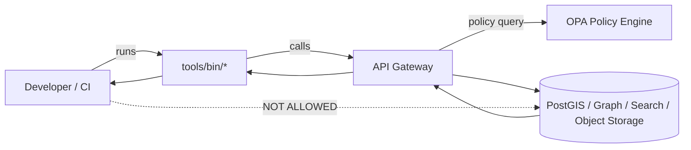

# tools/bin — KFM CLI utilities


**What this folder is:** `tools/bin/` is the **single place for repo-local executable entrypoints** used for KFM development, validation, and operations. These tools are designed to be safe, repeatable, and CI-friendly.

**What this folder is not:** a place for one-off personal scripts, ad-hoc experiments, or anything that bypasses governance controls (e.g., direct DB pokes, “quick” publication hacks, undocumented dataset transforms).

---

## Quick start

### 1) Run a tool directly (recommended)

From the repo root:

```bash
./tools/bin/<tool-name> --help
```

### 2) Add `tools/bin` to your PATH (optional)

This makes tools callable without `./tools/bin/…`:

```bash
export PATH="$(pwd)/tools/bin:$PATH"
```

> ✅ Tip: add that line to your shell profile if you work on KFM frequently (`~/.bashrc`, `~/.zshrc`, etc.).

### 3) Discover what’s available

List executable files:

```bash
find tools/bin -maxdepth 1 -type f -perm -111 -print | sort
```

Generate a quick “catalog” by printing each tool’s first help lines:

```bash
set -euo pipefail
for f in tools/bin/*; do
  [[ -f "$f" && -x "$f" ]] || continue
  echo
  echo "================================================================"
  echo "$(basename "$f")"
  echo "================================================================"
  "$f" --help 2>/dev/null | sed -n '1,25p' || echo "(no --help output)"
done
```

---

## Non‑negotiable governance invariants

These are **hard contracts**. Tools in `tools/bin` must not provide “escape hatches” around them.

1. **Trust membrane is real**
   - No client tooling should encourage or enable **direct UI-to-database** access.
   - Any access to governed data/services should flow through the **API boundary + policy enforcement**.

2. **Fail closed**
   - If a tool cannot validate required inputs, provenance artifacts, signatures, schemas, or policy decisions, it must **error** (not warn-and-continue).

3. **Cite-or-abstain**
   - Any AI-facing tooling (evaluation harnesses, Focus Mode tests, response validators) must enforce: **answers must include citations or explicitly abstain**.

4. **No promotion without provenance**
   - Tools that publish/promote anything must enforce: **STAC/DCAT/PROV exist and validate** (plus checksums and a run receipt/record).

> ⚠️ If you need something that violates any invariant for debugging, that work must happen in a **separate, explicitly labeled, non-default pathway** and be subject to governance review. Do not ship it in `tools/bin/`.

---

## How tools/bin fits into the repo

KFM’s expected repo layout places “utility scripts, validators, and devops tools” under `tools/`. `tools/bin/` is the executable edge of that toolbox (entrypoints), while shared libraries/helpers should live elsewhere (commonly `tools/lib/` or `tools/src/`).

```text
tools/
  bin/        # executable entrypoints (this folder)
  lib/        # shared functions/modules for tools (recommended)
  templates/  # skeletons for receipts, manifests, policy tests (optional)
```

---

## Standard CLI behavior (required)

To keep the toolchain predictable, tools in this folder must follow the conventions below.

### Required flags

All tools should implement:

- `--help`  
  Prints usage, examples, environment variables, and exit codes.

- `--version`  
  Prints tool version (or git SHA) for reproducibility.

- `--json` *(when output is structured)*  
  Emits machine-readable output (for CI and downstream steps).

- `--dry-run` *(when a tool mutates anything)*  
  Shows what would happen without making changes.

### Standard exit codes

| Code | Meaning | Notes |
|---:|---|---|
| 0 | Success | All checks passed / operation completed |
| 1 | General failure | Unexpected error |
| 2 | Usage error | Invalid flags/args, missing required params |
| 3 | Validation failure | Schema/provenance/policy checks failed |
| 4 | Dependency missing | Required binary/service not available |
| 5 | Permission denied | Auth/policy denies the operation |

---

## Logging, receipts, and reproducibility

### Structured logs

Tools should default to human-readable logs, and support structured logs:

- Human logs: good for local dev
- JSON logs: good for CI, indexing, and audit correlation

Minimum recommended fields for JSON logs:

- `ts` (timestamp)
- `level` (`debug|info|warn|error`)
- `tool`
- `run_id`
- `dataset_id` *(if applicable)*
- `request_id` *(if tool calls an API)*
- `audit_ref` *(if tool triggers governed operations)*
- `msg`

### Run receipts (run manifests)

Any tool that produces artifacts, transforms data, or promotes content must emit a **receipt** (a run record) that can be attached to provenance and audit flows.

Recommended characteristics:
- Deterministic identifiers (`run_id`)
- Content-addressable hashes for inputs/outputs
- Links to validation reports
- Git commit / image digest references for reproducibility

Example shape (illustrative; adjust to your repo’s schema):

```json
{
  "run_id": "run_2026-02-14T12-34-56Z_9c3f",
  "tool": "kfm.<tool-name>",
  "dataset_id": "example_dataset",
  "inputs": [{"uri": "data/raw/example.csv", "sha256": "…"}],
  "outputs": [{"uri": "data/processed/example.parquet", "sha256": "…"}],
  "code": {"git_sha": "…", "image": "…"},
  "validation": {
    "report_uri": "data/work/example/validation_report.json",
    "passed": true
  }
}
```

> ✅ Rule of thumb: if a future auditor can’t answer “**what ran, on what inputs, producing what outputs, under what code version**?” from your receipt + catalogs, the tool is not done.

---

## Safety and sensitivity handling

KFM data can include sensitive locations, culturally restricted knowledge, and restricted-access datasets. Tooling must be designed to avoid accidental disclosure.

### Required safety behaviors

- Never print secrets to stdout.
- Never write tokens into receipts/logs.
- Never publish raw precise sensitive geometries to “public” outputs.
- If a tool detects a sensitive classification and the caller lacks authorization, it must:
  - refuse (default), **or**
  - produce a generalized/redacted derivative (only if explicitly implemented and policy-approved)

### Recommended redaction posture

- Prefer generating:
  - **public/generalized** artifacts for broad audiences
  - **restricted/precise** artifacts for authorized roles
- Maintain **separate provenance chains** for generalized vs restricted derivatives.

---

## CI parity

The goal is: **a contributor can run locally what CI will run**, and get the same pass/fail.

Recommended local parity workflow:

1. Run doc + story validators
2. Run catalog validators (STAC/DCAT/PROV) + checksum checks
3. Run policy unit tests
4. Run minimal integration checks (if configured)

Example commands (your repo may wire these via `scripts/` or directly in `tools/bin/`):

```bash
# docs / story nodes
./scripts/lint_docs.sh
./scripts/validate_story_nodes.sh

# data catalogs and checksums
./scripts/validate_catalogs.sh
./scripts/validate_checksums.sh

# policy tests
opa test policy -v
```

> If your repo does not use `scripts/`, implement equivalent entrypoints in `tools/bin/` and keep CI calling the same stable interfaces.

---

## Trust membrane at a glance



---

## Authoring a new tool

### Where it goes

- **Executable entrypoint:** `tools/bin/<name>`
- **Shared helper code:** `tools/lib/...` (preferred)  
- **Schemas/templates:** `schemas/` and/or `tools/templates/` as appropriate

### Requirements checklist (Definition of Done)

- [ ] `--help` includes at least one real example and describes side effects
- [ ] `--version` prints something traceable (semver or git SHA)
- [ ] Exits non‑zero on validation/policy failure (fail-closed)
- [ ] Emits a receipt if it produces/changes governed artifacts
- [ ] Does **not** bypass the API boundary for governed data access
- [ ] Includes at least one automated test (unit or contract-level)
- [ ] Produces deterministic output where applicable (stable ordering, stable hashing)
- [ ] Handles sensitive classifications safely (deny or approved redaction path)
- [ ] CI can invoke it non-interactively (no prompts unless explicitly gated)

---

## Troubleshooting

### “Permission denied” when running a tool
- Ensure the file is executable:
  ```bash
  chmod +x tools/bin/<tool-name>
  ```
- Confirm you’re executing from repo root or your PATH includes `tools/bin`.

### Tool says a dependency is missing
Common dependencies for a KFM toolchain include:
- `git`
- `jq`
- `python` (and venv tooling if used)
- `node` / `pnpm` (if UI-related tooling exists)
- `docker` or `podman` (if container workflows exist)
- `opa` (for policy tests)

A good tool will tell you exactly what’s missing and how to install it.

### “Validation failed”
Treat this as expected—not exceptional. Fix the underlying issue:
- missing required metadata
- schema mismatch
- missing checksum
- missing STAC/DCAT/PROV artifacts
- policy denies the operation

---

## Support and escalation

- **Bug reports:** open an issue with:
  - command line used
  - tool version (`--version`)
  - relevant receipt/run_id
  - minimal repro inputs (redacted if sensitive)
- **Governance exceptions:** require explicit review and approval; do not ship “temporary bypass” flags.

---

## License

This directory’s contents are licensed under the **same terms as the repository**. See the root `LICENSE` file (or repository policy docs) for details.

