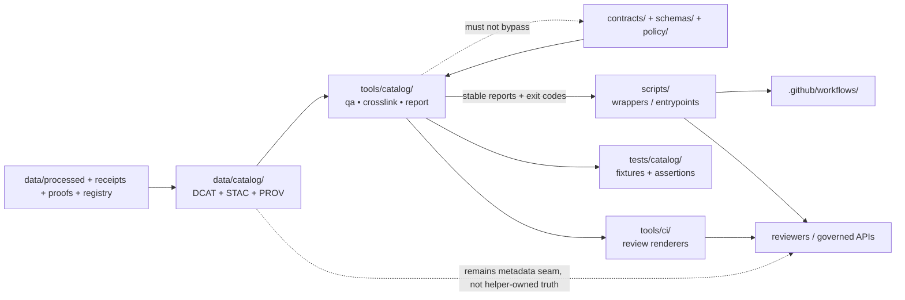

<!-- [KFM_META_BLOCK_V2]
doc_id: kfm://doc/NEEDS_VERIFICATION
title: tools/catalog
type: standard
version: v1
status: draft
owners: @bartytime4life
created: NEEDS_VERIFICATION
updated: 2026-04-16
policy_label: public
related: [
  ../README.md,
  ../../README.md,
  ../../data/README.md,
  ../../data/catalog/README.md,
  ../../data/catalog/dcat/README.md,
  ../../data/catalog/stac/README.md,
  ../../data/catalog/prov/README.md,
  ../../data/receipts/README.md,
  ../../data/proofs/README.md,
  ../../scripts/README.md,
  ../../contracts/README.md,
  ../../schemas/README.md,
  ../../policy/README.md,
  ../../tests/README.md,
  ../../tests/catalog/README.md,
  ../../tests/contracts/README.md,
  ../../.github/README.md,
  ../../.github/CODEOWNERS,
  ../../.github/workflows/README.md,
  ../../.github/watchers/README.md,
  ../../tools/validators/README.md,
  ../../tools/validators/promotion_gate/README.md,
  ../../tools/ci/README.md,
  ../../tools/attest/README.md,
  ../../tools/diff/README.md
]
tags: [kfm, tools, catalog, dcat, stac, prov, crosslink, qa, review, receipts, proofs]
notes: [
  Updated to reflect the catalog_crosslink.py thin slice and the adjacent tests/catalog/test_catalog_crosslink.py proof lane.
  This revision aligns the lane with newer receipt/proof, validator/attest, workflow, watcher, and CI-renderer documentation.
  doc_id placeholder and created date still need live file-history verification; ownership remains grounded by visible CODEOWNERS fallback for /tools/.
]
[/KFM_META_BLOCK_V2] -->

<a id="top"></a>

# `tools/catalog/`

Catalog QA, cross-link, and review-support helper surface for Kansas Frontier Matrix.

> [!NOTE]
> **Status:** experimental  
> **Document status:** draft  
> **Owners:** `@bartytime4life`  
> **Path:** `tools/catalog/README.md`  
>         
> **Quick jumps:** [Scope](#scope) · [Repo fit](#repo-fit) · [Accepted inputs](#accepted-inputs) · [Exclusions](#exclusions) · [Current evidence snapshot](#current-evidence-snapshot) · [Directory tree](#directory-tree) · [Quickstart](#quickstart) · [Usage](#usage) · [Diagram](#diagram) · [Reference tables](#reference-tables) · [Task list](#task-list) · [FAQ](#faq) · [Appendix](#appendix)

> [!IMPORTANT]
> `tools/catalog/` is **not** `data/catalog/`.
>
> This directory is the reusable helper lane that inspects, validates, cross-checks, or summarizes catalog closure.
>
> The catalog records themselves belong in [`../../data/catalog/README.md`](../../data/catalog/README.md) and remain release-backed metadata, not helper-owned truth.

> [!TIP]
> Keep the KFM trust split visible here:
>
> **receipt ≠ proof ≠ catalog ≠ publication**
>
> Catalog helpers may inspect joins across those surfaces, but they must not collapse them into one helper-owned authority.

> [!NOTE]
> This README intentionally does two jobs at once:
>
> 1. describe the **confirmed** live subtree honestly  
> 2. define the **proposed** wider helper shape that would make this lane more useful without smuggling policy, schema authority, receipt ownership, proof ownership, or publish logic into shell glue

---

## Scope

`tools/catalog/` is the KFM helper surface for **catalog closure quality**.

In practice, that means reusable tools that operate on the outward metadata seam anchored in **DCAT, STAC, and PROV**. These helpers should strengthen governed discovery, lineage inspection, triplet consistency, and promotion-readiness review without quietly becoming the source of truth for metadata law, policy law, receipt storage, proof storage, or release state.

This lane exists because KFM treats catalog closure as operational infrastructure rather than optional metadata garnish. A good helper here should make catalog-backed trust easier to review, easier to automate, and easier to re-run locally.

### What this README is for

This file helps maintainers do five things quickly:

1. understand what belongs in `tools/catalog/`
2. keep this lane separate from `data/catalog/`, `data/receipts/`, `data/proofs/`, `scripts/`, `contracts/`, `schemas/`, and `policy/`
3. extend the subtree without overclaiming mounted executable inventory
4. make helper changes land with a clear boundary, caller, and proof burden
5. keep catalog-helper behavior aligned with the newer validator, attestation, workflow, watcher, and CI-renderer docs

### Working question

> **Do the declared catalog artifacts and their adjacent trust refs still describe one coherent outward release surface, and can we prove helper behavior when they do not?**

### Evidence markers used here

| Marker | Meaning in this README |
|---|---|
| `CONFIRMED` | directly supported by the live repo tree or documentary repo evidence |
| `INFERRED` | strongly suggested by adjacent repo docs and KFM doctrine, but not proven as current subtree reality |
| `PROPOSED` | doctrine-consistent target structure, helper family, or workflow pattern |
| `UNKNOWN` | not established strongly enough from visible repo evidence |
| `NEEDS VERIFICATION` | a placeholder or repo/platform detail that should be checked before merge |

[Back to top](#top)

---

## Repo fit

`tools/catalog/` sits between the **catalog artifacts that already exist** and the **reviewable helper logic** that should keep those artifacts coherent.

### Path and adjacent surfaces

| Relation | Surface | Why it matters |
|---|---|---|
| Parent lane | [../README.md](../README.md) | defines the broader `tools/` contract and helper-family expectations |
| Upstream metadata seam | [../../data/catalog/README.md](../../data/catalog/README.md) | owns the governed `DCAT + STAC + PROV` closure surface that this lane should inspect, not replace |
| Catalog child lanes | [../../data/catalog/dcat/README.md](../../data/catalog/dcat/README.md), [../../data/catalog/stac/README.md](../../data/catalog/stac/README.md), [../../data/catalog/prov/README.md](../../data/catalog/prov/README.md) | the triplet surfaces this lane should QA and cross-link |
| Parent lifecycle contract | [../../data/README.md](../../data/README.md) | defines the `RAW -> WORK / QUARANTINE -> PROCESSED -> CATALOG -> PUBLISHED` truth path |
| Receipt boundary | [../../data/receipts/README.md](../../data/receipts/README.md) | helpers may inspect or report receipt refs, but receipt storage and process memory remain there |
| Proof boundary | [../../data/proofs/README.md](../../data/proofs/README.md) | higher-order trust objects may be linked or summarized without turning this lane into proof storage |
| Adjacent orchestration | [../../scripts/README.md](../../scripts/README.md) | thin wrappers and CI entrypoints may call catalog helpers, but reusable logic should not be buried there |
| Shared object law | [../../contracts/README.md](../../contracts/README.md) and [../../schemas/README.md](../../schemas/README.md) | helpers may validate declared authority, but must not silently define schema authority |
| Policy boundary | [../../policy/README.md](../../policy/README.md) | rights, sensitivity, and deny-by-default rules belong there, even when helpers evaluate their consequences |
| Verification surfaces | [../../tests/README.md](../../tests/README.md), [../../tests/catalog/README.md](../../tests/catalog/README.md), [../../tests/contracts/README.md](../../tests/contracts/README.md) | fixtures and assertions should prove helper behavior instead of leaving README prose as the only evidence |
| Repo governance | [../../.github/README.md](../../.github/README.md), [../../.github/CODEOWNERS](../../.github/CODEOWNERS), [../../.github/workflows/README.md](../../.github/workflows/README.md), [../../.github/watchers/README.md](../../.github/watchers/README.md) | review boundaries, owner map, workflow posture, and watcher-orchestration boundaries live here |
| Neighbor helper lanes | [../../tools/ci/README.md](../../tools/ci/README.md), [../../tools/attest/README.md](../../tools/attest/README.md), [../../tools/diff/README.md](../../tools/diff/README.md), [../../tools/validators/README.md](../../tools/validators/README.md) | catalog helpers should stay aligned with CI rendering, attestation, comparison, and validation lanes without absorbing their jobs |
| Promotion consumer | [../../tools/validators/promotion_gate/README.md](../../tools/validators/promotion_gate/README.md) | promotion now makes catalog closure a first-class review surface; this lane is the natural helper boundary for closure QA and triplet checks |

### Operating rule

Use this lane when the work is:

- reusable
- catalog-specific
- callable by humans, scripts, or CI
- reviewable as a helper rather than as hidden business logic
- capable of producing stable machine-readable output when downstream review or CI depends on it

Do **not** use this lane when the work is really:

- the catalog itself
- policy ownership
- schema ownership
- receipt or proof storage
- runtime API behavior
- one-off operator glue that should stay in `scripts/`

[Back to top](#top)

---

## Accepted inputs

The following belong here when they remain helper inputs rather than truth stores:

- DCAT, STAC, and PROV records from `../../data/catalog/`
- related manifests, checksums, receipts, proofs, and release refs
- declared contract/schema surfaces used for validation
- read-only policy results or rule inputs needed to explain allow/deny/generalize outcomes
- bounded fixtures or non-sensitive sample records used to prove helper behavior
- reviewer/operator parameters for coverage, freshness, or cross-link summaries

### Accepted input profile

| Input family | Typical examples | Keep it here when |
|---|---|---|
| Catalog records | STAC collection/item JSON, DCAT JSON-LD, PROV bundles | the helper inspects or cross-checks them |
| Release linkage | manifests, checksums, receipts, proof refs | the helper verifies joinability or completeness |
| Contract surfaces | JSON Schemas, profile fragments, field expectations | the helper validates declared law without owning it |
| Review fixtures | valid/invalid samples, smoke inputs, snapshot outputs | the helper proves behavior in a repeatable way |
| CI/operator flags | `--root`, `--fail-on-warn`, explicit paths | the helper stays deterministic and easy to re-run |
| Promotion artifacts | decision refs, promotion records, bundle manifests | the helper checks whether outward catalog closure still aligns with governed promotion artifacts |
| Diff support | normalized prior/current catalog records | the helper checks closure or linkage, not policy meaning |
| Receipt/proof references | `receipt_ref`, `proof_ref`, `release_ref`, `catalog_refs` | the helper preserves trust-chain visibility without owning those surfaces |

### Minimum bar for anything added here

- it is clearly **helper-shaped** rather than metadata-shaped
- it is safe to rerun locally and in CI
- it emits stable outputs when automation or review depends on it
- it points back to concrete artifacts, refs, or digests
- it does not silently become the only understandable source of catalog law
- if it touches receipts or proofs, it keeps those roles explicit instead of flattening them

[Back to top](#top)

---

## Exclusions

The following do **not** belong here:

| Do not keep here | Better home | Why |
|---|---|---|
| Authoritative DCAT/STAC/PROV records | [../../data/catalog/README.md](../../data/catalog/README.md) | helper code must not become metadata truth |
| Raw or processed payloads | `../../data/raw/`, `../../data/work/`, `../../data/processed/` | payload storage and transformation live upstream |
| Policy bundles, reason codes, obligation registries | [../../policy/README.md](../../policy/README.md) | policy law must remain explicit and reviewable |
| Canonical contract/schema authority decisions | [../../contracts/README.md](../../contracts/README.md) and [../../schemas/README.md](../../schemas/README.md) | helpers may validate the chosen authority, not choose it silently |
| One-shot shell orchestration | [../../scripts/README.md](../../scripts/README.md) | wrappers may call helpers, but helper logic should stay reusable |
| Runtime API handlers or response envelopes | app/package surfaces | public behavior deserves stronger lifecycle ownership |
| Secret-bearing fixtures or unrestricted sensitive location dumps | governed secure lanes | public tooling must stay safe to clone and review |
| Signature generation or verification | [../../tools/attest/README.md](../../tools/attest/README.md) | catalog helpers may inspect signed state, but attestation belongs there |
| Reviewer rendering | [../../tools/ci/README.md](../../tools/ci/README.md) | catalog helpers should emit stable outputs that CI helpers can render |
| Promotion decisions | [../../tools/validators/README.md](../../tools/validators/README.md) | this lane can inform promotion, not decide it |
| Receipt archives or proof-pack archives | [../../data/receipts/README.md](../../data/receipts/README.md), [../../data/proofs/README.md](../../data/proofs/README.md) | trust-bearing storage belongs in governed data surfaces, not helper lanes |

> [!CAUTION]
> If deleting a helper from `tools/catalog/` would erase the only understandable explanation of what is publishable, how policy was applied, or how catalog closure works, the helper is carrying too much meaning and should graduate to a stronger governed surface.

[Back to top](#top)

---

## Current evidence snapshot

| Evidence item | Status | How this README uses it |
|---|---|---|
| `tools/` exists with sibling families `attest/`, `catalog/`, `ci/`, `diff/`, `docs/`, `probes/`, and `validators/` | `CONFIRMED` | grounds this file as one lane inside a broader helper family |
| `data/catalog/` exists with `dcat/`, `prov/`, and `stac/` child surfaces | `CONFIRMED` | grounds the adjacent metadata seam this lane should support |
| `tests/` exists as a top-level governed verification surface | `CONFIRMED` | grounds the expectation that helpers should land with fixtures or assertions instead of prose alone |
| `/tools/` is owned by `@bartytime4life` in `/.github/CODEOWNERS` | `CONFIRMED` | grounds the owner line for this subtree |
| Promotion Gate documentation treats catalog closure as part of review-significant promotion validation | `CONFIRMED via adjacent documentation` | strengthens the downstream value of reusable catalog QA and cross-link helpers |
| `tools/catalog/catalog_crosslink.py` is the current thin-slice executable helper | `CONFIRMED` | this README now documents one concrete helper rather than a purely README-only lane |
| `tests/catalog/test_catalog_crosslink.py` is the current thin-slice proof surface | `CONFIRMED in adjacent documentation` | the first helper now lands with explicit test coverage in the documentation stream |
| Updated adjacent docs now make receipt/proof separation explicit across tests, validators, attestation, workflows, and CI rendering | `CONFIRMED in-session doctrine alignment` | this lane now needs clearer wording about trust-chain refs without taking ownership of them |
| Wider helper families such as `qa/`, `crosslink/`, and `report/` | `PROPOSED` | these remain target shapes rather than fully proven current inventory |
| Exact file-history dates, repo-internal document ID, full caller inventory, and any additional mounted helpers | `NEEDS VERIFICATION` | left as placeholders in the KFM meta block above |

[Back to top](#top)

---

## Directory tree

### Current live public neighborhood

```text
tools/
├── README.md
├── attest/
├── catalog/
│   ├── README.md
│   └── catalog_crosslink.py
├── ci/
├── diff/
├── docs/
├── probes/
└── validators/
```

### Thin-slice executable shape

```text
tools/catalog/
├── README.md
└── catalog_crosslink.py

tests/catalog/
└── test_catalog_crosslink.py
```

### Adjacent live catalog seam

```text
data/catalog/
├── README.md
├── dcat/
├── prov/
└── stac/
```

### `PROPOSED` stable family shape to prefer

```text
tools/catalog/
├── README.md
├── qa/          # fast structural STAC / DCAT / PROV checks
├── crosslink/   # triplet + manifest / receipt consistency helpers
└── report/      # reviewer-facing completeness, freshness, and readiness summaries
```

That proposed shape is intentionally narrow.

- `qa/` keeps structural validation obvious
- `crosslink/` keeps triplet closure and evidence joins explicit
- `report/` keeps reviewer summaries separate from blocking validators

It avoids turning this lane into a hidden metadata factory.

[Back to top](#top)

---

## Quickstart

Run these inventory-first commands before adding or moving anything under `tools/catalog/`.

### 1. Confirm what actually exists in your checkout

```bash
find tools/catalog -maxdepth 3 -print 2>/dev/null | sort
find tests/catalog -maxdepth 3 -print 2>/dev/null | sort
find data/catalog -maxdepth 4 -print 2>/dev/null | sort
```

### 2. Re-read the parent helper contract and adjacent metadata / verification seams

```bash
sed -n '1,240p' tools/README.md 2>/dev/null
sed -n '1,260p' tests/README.md 2>/dev/null
sed -n '1,260p' tests/catalog/README.md 2>/dev/null
sed -n '1,260p' data/catalog/README.md 2>/dev/null
sed -n '1,260p' data/catalog/dcat/README.md 2>/dev/null
sed -n '1,260p' data/catalog/stac/README.md 2>/dev/null
sed -n '1,260p' data/catalog/prov/README.md 2>/dev/null
sed -n '1,260p' data/receipts/README.md 2>/dev/null
sed -n '1,260p' data/proofs/README.md 2>/dev/null
sed -n '1,260p' scripts/README.md 2>/dev/null
sed -n '1,260p' tools/validators/promotion_gate/README.md 2>/dev/null
sed -n '1,260p' tools/ci/README.md 2>/dev/null
```

### 3. Search for current callers and references before inventing names

```bash
rg -n "catalog|stac|dcat|prov|crosslink|closure|receipt_ref|proof_ref|promotion-record" \
  tools scripts tests .github docs data policy contracts schemas pipelines -S 2>/dev/null
```

### 4. Inspect executable reality instead of assuming it exists

```bash
find tools scripts -maxdepth 4 -type f \( -name "*.py" -o -name "*.sh" -o -name "*.mjs" -o -name "*.ts" \) 2>/dev/null | sort
```

### 5. Thin-slice local run

```bash
python tools/catalog/catalog_crosslink.py \
  --decision decision.json \
  --record promotion-record.json \
  --output catalog-crosslink-report.json
```

### 6. Thin-slice test run

```bash
pytest -q tests/catalog/test_catalog_crosslink.py
```

> [!TIP]
> Inventory first, then name the helper. In KFM, a clear negative result is better than a confident fantasy inventory.

[Back to top](#top)

---

## Usage

### Add a reusable catalog helper

Use `tools/catalog/` when the helper has one clear job, for example:

- structural STAC / DCAT / PROV QA
- triplet cross-link verification
- release-readiness summaries for catalog closure
- freshness, completeness, or drift reporting for review surfaces
- promotion-oriented closure checks that ensure outward catalog records still align with governed release artifacts
- trust-chain visibility checks that preserve receipt/proof linkage without moving those surfaces into helper-owned truth

A good helper here should usually:

1. read explicit paths or flags
2. default to read-only inspection
3. emit stable machine-readable output when CI or review surfaces parse it
4. fail non-zero when it is meant to block
5. point back to concrete artifacts, paths, digests, receipts, proofs, or release refs

### Keep helper logic separate from orchestration

A healthy split looks like this:

- `tools/catalog/` owns reusable helper behavior
- `scripts/` owns wrapper entrypoints and operator choreography
- `.github/workflows/` owns when the gate runs
- `tests/` owns fixtures and assertions
- `data/catalog/` owns the metadata being inspected
- `tools/ci/` owns reviewer-readable rendering of stable helper outputs
- `data/receipts/` and `data/proofs/` remain distinct upstream trust surfaces

### Tool behavior contract

| Concern | Required posture |
|---|---|
| Determinism | same inputs should yield the same output shape and exit code |
| Failure semantics | blocking checks return non-zero and describe what failed |
| Output shape | prefer JSON / JSONL or another stable format when CI or review surfaces consume it |
| Cross-link discipline | reports should reference the concrete STAC/DCAT/PROV objects and any related manifest / receipt / proof paths |
| Boundary discipline | no silent schema arbitration, no hidden policy law, no direct promotion shortcuts |
| Safety | no secret scraping, unrestricted sensitive fixtures, or logs that leak policy-restricted material |
| Reviewability | humans, scripts, and CI should be able to call the same helper without semantic drift |
| Local/CI parity | a merge-blocking helper should be runnable locally with the same core behavior |
| Trust-chain clarity | receipt refs, proof refs, and catalog refs must stay distinguishable when present |

### Thin-slice behavior

The current thin slice checks:

- STAC ref presence
- DCAT ref presence
- PROV ref presence
- subject alignment across the catalog triplet
- version alignment across the triplet
- release-ref alignment against the triplet version

It does **not yet** inspect mounted STAC/DCAT/PROV payload contents directly. It currently operates at the outward-ref alignment layer.

### When to graduate out of this lane

A helper should move out of `tools/catalog/` when it becomes:

- a reusable package or library
- the canonical place where schema or profile law is decided
- the only path that can generate valid metadata
- a service or runtime component rather than a helper CLI

[Back to top](#top)

---

## Diagram



[Back to top](#top)

---

## Reference tables

### Catalog helper boundary matrix

| Surface | Primary job | Must not quietly become |
|---|---|---|
| `data/catalog/` | release-backed DCAT/STAC/PROV metadata seam | helper-owned truth |
| `data/receipts/` | process memory for runs and validation | proof storage or catalog authority |
| `data/proofs/` | higher-order trust objects | helper-owned summary output |
| `tools/catalog/` | reusable catalog QA, cross-link, and review support helpers | schema authority, policy authority, receipt owner, proof owner, or release truth |
| `scripts/` | thin wrappers and operator/CI entrypoints | the only place helper behavior is documented |
| `contracts/` / `schemas/` | declared object grammar and validation law | implicit shell glue |
| `policy/` | rights, sensitivity, and deny-by-default rule ownership | undocumented helper side effects |
| `tools/ci/` | reviewer-facing rendering of stable outputs | hidden validator logic |

### Helper class matrix

| Helper class | Typical inputs | Typical outputs | Status in this README |
|---|---|---|---|
| Structural QA | STAC items / collections, DCAT JSON-LD, PROV bundles | pass/fail report, structured errors | `PROPOSED` executable family |
| Cross-link checks | STAC + DCAT + PROV + manifest / receipt / proof refs | consistency report, missing-link diagnostics | **Thin-slice implemented** |
| Reviewer summaries | catalog directories, release refs, timestamps | completeness / freshness / readiness summary | `PROPOSED` executable family |
| Promotion closure helpers | promotion records, bundle refs, catalog triplet refs | closure alignment report | **Thin-slice implemented** |
| Scaffold-only current state | `README.md` | documentation only | historical / superseded public snapshot |

### Triplet questions this lane should answer well

| Question | Typical helper family |
|---|---|
| Does STAC link cleanly to the matching outward subject? | `qa/` or `crosslink/` |
| Does DCAT point to the same release-backed thing as STAC? | `crosslink/` |
| Does PROV name the same promoted subject and lineage context? | `crosslink/` |
| Do triplet members drift from receipts or release refs? | `crosslink/` |
| Is the closure fresh / complete / reviewable enough for promotion review? | `report/` |

[Back to top](#top)

---

## Task list

### Definition of done for the current thin slice

- [x] current local inventory rechecked before merge
- [x] helper placed in the narrowest fitting lane under `tools/catalog/`
- [x] representative passing and failing inputs exist in `tests/catalog/`
- [x] helper output format and exit semantics are documented here
- [x] boundary against `data/catalog/`, `contracts/`, `schemas/`, `policy/`, `data/receipts/`, and `data/proofs/` remains explicit
- [x] merge-blocking behavior is runnable locally as well as in CI
- [x] no secrets or policy-restricted sample payloads are committed here

### Next sensible expansions

- [ ] extend triplet checking from outward ref-shape alignment to declared subject/property alignment inside mounted catalog records
- [ ] add freshness/report helper for reviewer-facing closure summaries
- [ ] add optional rendering handoff to `tools/ci/`
- [ ] add fixture families for mounted-record content mismatches, not just ref mismatches
- [ ] document wrapper relationships in `scripts/README.md` if helper callers are added there
- [ ] add explicit receipt/proof-ref examples only when the checked helper contract actually requires them

[Back to top](#top)

---

## FAQ

### Why is this not just part of `scripts/`?

Because KFM distinguishes **thin orchestration** from **reusable helper behavior**. Wrappers may live in `scripts/`; repeatable catalog checks belong in a reusable helper lane.

### Why not write catalog logic directly in workflow YAML?

Because reviewer-facing logic should stay inspectable outside CI configuration. Stable tool entrypoints are easier to run locally, easier to diff, and easier to test.

### Can `tools/catalog/` generate catalog files?

Only in a narrow support role and only when the authoritative metadata rules live somewhere stronger. This lane should support declared law, not become undeclared law.

### Where should fixtures live?

Prefer `../../tests/` or another governed fixture surface. Keep this lane focused on helpers, not fixture ownership.

### Is `tools/catalog/` allowed to decide which schema home is authoritative?

No. It may validate the declared authority. It must not silently choose one.

### Can this lane help promotion review?

Yes. Catalog closure is now visibly relevant to promotion review. But this lane should report and cross-check closure state, not decide whether release should proceed.

### What exactly is implemented today?

Today’s thin slice is `catalog_crosslink.py`, which checks outward triplet ref presence and alignment using `decision.json` and `promotion-record.json`. It does not yet parse mounted STAC/DCAT/PROV records deeply.

### Why mention receipts and proofs here?

Because downstream promotion and review surfaces may need those refs to remain visible and aligned. Mentioning them does not move their authority or storage into this lane.

[Back to top](#top)

---

## Appendix

<details>
<summary>Illustrative adjacent wrapper pattern (<strong>PROPOSED</strong>, document-grounded, not current subtree proof)</summary>

The broader KFM documentation corpus already uses thin-wrapper examples like this:

```text
scripts/catalog/validate_stac.py
scripts/catalog/validate_jsonld.sh
scripts/evidence/crosslink_consistency.py
```

A healthy relationship would keep those as wrappers while reusable catalog-checking logic lives here.

</details>

<details>
<summary>Illustrative blocking output shape</summary>

```json
{
  "tool": "catalog-crosslink",
  "status": "fail",
  "blocking": true,
  "catalog_root": "data/catalog/",
  "checks": [
    {
      "id": "stac_self_ref_present",
      "result": "pass"
    },
    {
      "id": "prov_subject_alignment",
      "result": "fail",
      "message": "PROV ref subject `wrong-subject` != expected `floodplain-kansas`"
    }
  ]
}
```

Use a stable output shape when CI, review summaries, or release evidence need to parse the result.

</details>

<details>
<summary>Illustrative promotion-oriented closure output (<strong>current thin-slice aligned</strong>)</summary>

```json
{
  "tool": "catalog-crosslink",
  "status": "pass",
  "blocking": false,
  "candidate_id": "overlay:floodplain-kansas",
  "spec_hash": "0123456789abcdef0123456789abcdef0123456789abcdef0123456789abcdef",
  "checks": [
    {
      "id": "catalog.stac_ref_present",
      "result": "pass",
      "message": ""
    },
    {
      "id": "catalog.dcat_subject_alignment",
      "result": "pass",
      "message": ""
    },
    {
      "id": "catalog.triplet_version_alignment",
      "result": "pass",
      "message": ""
    }
  ]
}
```

That helper belongs here because it remains a closure checker and does not become a promotion authority surface.

</details>

[Back to top](#top)
