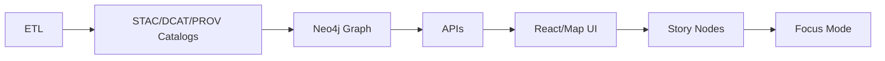

# 🧰 tools/ci — Continuous Integration Runbook 🚦

[](#-where-ci-runs)
[](#-minimum-ci-gates-v13)
[](#-data--metadata-gates)
[](#-security--governance-gates)

> **Rule of thumb 🧠:** If it can’t be validated, it can’t be merged.  
> KFM/Kansas-Matrix work is *evidence-first* and *contract-first* — CI is the enforcement layer.

---

## 🗺️ Contents

- [🎯 Purpose](#-purpose)
- [📦 What lives in `tools/ci/`](#-what-lives-in-toolsc i)
- [🧬 Canonical pipeline (why CI is strict)](#-canonical-pipeline-why-ci-is-strict)
- [✅ Minimum CI gates (v13)](#-minimum-ci-gates-v13)
- [🧪 Gate matrix](#-gate-matrix)
- [🏃 Run CI locally](#-run-ci-locally)
- [🧱 Adding a new gate](#-adding-a-new-gate)
- [🧾 Data & metadata gates](#-data--metadata-gates)
- [🕸️ Graph + API contract gates](#️-graph--api-contract-gates)
- [🔐 Security & governance gates](#-security--governance-gates)
- [⚡ Performance & cost control](#-performance--cost-control)
- [🆘 Troubleshooting](#-troubleshooting)
- [📚 Project Library Index](#-project-library-index)

---

## 🎯 Purpose

`tools/ci/` is the **single home** for CI utilities that:

- run in **GitHub Actions** (or your CI runner of choice),
- run **locally** the same way (no “works on my machine”),
- enforce KFM’s **contract-first** and **evidence-first** standards,
- protect the repo from **broken metadata**, **broken links**, **schema drift**, **unsafe content**, and **silent regressions**.

> [!IMPORTANT]
> CI is not “just tests.” For this project, CI is the *governance engine* that keeps the pipeline order intact and keeps the catalog trustworthy.

---

## 📦 What lives in `tools/ci/`

This directory should contain small, composable building blocks (scripts + configs) that can be wired into workflows.

**Recommended structure (adapt as needed):**
```text
📁 tools/ci/
├── 📄 README.md                # (this file) runbook + gate contract
├── 📁 bin/                     # tiny entrypoints (bash / python)
│   ├── 🧪 run_unit_tests.*
│   ├── 🧾 validate_markdown.*
│   ├── 🧬 validate_catalog.*
│   ├── 🧩 validate_schemas.*
│   ├── 🕸️ graph_smoke_test.*
│   └── 🔐 security_scans.*
├── 📁 fixtures/                # small test datasets + sample graph fixtures
├── 📁 reports/                 # CI artifacts (json summaries, junit, coverage, etc.)
└── 📁 workflows/               # reusable workflow snippets (optional)
```

**Design constraints (non-negotiable):**
- ✅ deterministic output (seeded randomness, stable ordering)
- ✅ clear exit codes (`0` pass, non‑zero fail)
- ✅ CI-friendly logs (no interactive prompts)
- ✅ *fast by default* — heavy checks go to nightly/scheduled lanes

---

## 🧬 Canonical pipeline (why CI is strict)

KFM’s “canonical pipeline” ordering is enforced culturally **and** mechanically:



> [!NOTE]
> CI gates are aligned to this ordering: you don’t get to publish a Story Node if the catalogs, graph, and contracts aren’t valid.

---

## ✅ Minimum CI gates (v13)

These are the **baseline** gates expected for v13 contributions (docs + data + code):

### 🧾 Documentation gates
- **Markdown protocol & front‑matter checks** (YAML front-matter, required sections, governed templates)
- **Link/reference validation** (no broken internal references, unresolved citations)

### 🧩 Schema gates
- **JSON Schema validation** for:
  - STAC Items/Collections
  - DCAT Datasets
  - PROV JSON‑LD
  - Story Node schemas
  - UI/telemetry config schemas (when present)

### 🕸️ Graph + API gates
- **Graph integrity tests** (fixture graph constraints, ontology invariants)
- **API contract tests** (OpenAPI/GraphQL linting + contract tests against known inputs)

### 🔐 Security + governance gates
- **Secret scanning**
- **PII / sensitive content scanning**
- **Sensitive location checks**
- **Classification consistency checks** (prevent “downgrading” restricted → public without approved de‑identification)

> [!TIP]
> Treat metadata like code: it must “compile” before it merges. Aim for a **zero‑defect** policy for catalogs and dataset metadata.

---

## 🧪 Gate matrix

A practical way to keep CI fast *and* strict is to split gates into lanes:

| Gate 🧷 | PR (required) | `main` (required) | Nightly/Scheduled | Notes |
|---|:---:|:---:|:---:|---|
| Format + lint (Py/JS) 🎨 | ✅ | ✅ | — | Fast feedback |
| Unit tests 🧪 | ✅ | ✅ | ✅ | Full matrix runs at night |
| Markdown/front-matter 🧾 | ✅ | ✅ | ✅ | Must never be flaky |
| Link validation 🔗 | ✅ | ✅ | ✅ | Prevent doc rot |
| STAC/DCAT/PROV schema 🧩 | ✅ | ✅ | ✅ | “Metadata compile” gate |
| Catalog QA (geo sanity) 🗺️ | ✅ | ✅ | ✅ | geometry/CRS/extents |
| Graph smoke + constraints 🕸️ | ✅* | ✅ | ✅ | `*` can be PR-only on graph-touch changes |
| API contract tests 📜 | ✅ | ✅ | ✅ | OpenAPI/GraphQL + mocks |
| Security scans 🔐 | ✅ | ✅ | ✅ | also on dependency updates |
| Performance smoke ⚡ | — | ✅* | ✅ | `*` keep PR fast |

---

## 🏃 Run CI locally

CI is most effective when contributors can reproduce failures locally.

> [!NOTE]
> Command names below are **recommended conventions**. If your repo already has scripts, mirror them here and update this README.

### 1) Environment setup (Python + Node + containers)
```bash
# Python (recommended: venv)
python -m venv .venv
source .venv/bin/activate
python -m pip install -U pip

# Node (if web UI exists)
# npm ci

# Optional: bring up integration dependencies (PostGIS/Neo4j/etc.)
# docker compose up -d
```

### 2) Run the “PR lane”
```bash
# Format/lint/test/doc checks (example)
# pre-commit run --all-files
# python -m pytest -q
# python -m mypy src/
# npm run lint && npm test
```

### 3) Run the “catalog lane”
```bash
# Validate schemas + catalog QA (example)
# python tools/ci/bin/validate_schemas.py
# python tools/ci/bin/validate_catalog.py
```

### 4) Run the “integration lane”
```bash
# Graph + API contract tests (example)
# python tools/ci/bin/graph_smoke_test.py
# python tools/ci/bin/api_contract_test.py
```

> [!TIP]
> Keep fixtures **tiny**. CI should validate correctness, not reprocess the whole world.

---

## 🧱 Adding a new gate

When you add a gate, aim for **clarity, determinism, and speed**.

### ✅ Gate contract
Every gate should:
- accept `--help`
- return non‑zero on failure
- print a **human summary** + optionally emit a **machine artifact** (JSON/JUnit)
- have a clear owner + “why it exists” documented

### 🧩 Typical workflow
1. Add script to `tools/ci/bin/…`
2. Add local entrypoint (Makefile task or `./tools/ci/bin/...`)
3. Add/adjust pre-commit hook (if relevant)
4. Wire into GitHub Actions workflow
5. Add a short section to this README:
   - what it checks
   - where it runs (PR/main/nightly)
   - how to reproduce locally
   - common failure reasons

---

## 🧾 Data & metadata gates

This project’s “data quality” is not optional — CI is expected to validate:

### 🧩 Schema compliance (STAC/DCAT/PROV + extensions)
- validate all catalog JSON against schemas
- enforce required fields (license, spatial/temporal extents, links, etc.)
- prevent schema drift (profiles change only via deliberate PR)

### 🗺️ Geospatial sanity (Catalog QA)
Examples of “basic but essential” checks:
- geometry validity (e.g., no self‑intersections)
- CRS consistency (no accidental reprojection drift)
- spatial extents plausibility (bounds match Kansas + domain constraints)
- attribute ranges (e.g., non-negative values where required)
- file/link integrity (no broken artifact references)

> [!IMPORTANT]
> Data changes should trigger CI lanes the same way code changes do. If a dataset update breaks validation, the PR should be blocked.

### 📦 Reproducible ETL runs
For heavier pipelines:
- containerize (GDAL/OGR/geospatial deps are painful to install repeatedly)
- isolate dependencies (don’t rely on runner global state)
- store artifacts with run IDs / timestamps
- avoid “silent overwrites” unless explicitly versioned

---

## 🕸️ Graph + API contract gates

### 🕸️ Graph integrity tests
Use a small fixture dataset to ensure:
- required labels exist
- relationships follow ontology rules
- unique IDs and required properties are enforced
- “contract invariants” remain true across refactors

### 📜 API contract tests
CI should:
- lint OpenAPI/GraphQL definitions
- run contract tests against known requests/responses
- require backward compatibility **or** explicit contract migration

> [!TIP]
> If you change the API, change the contract + tests in the same PR. No exceptions.

---

## 🔐 Security & governance gates

CI must act like a **tripwire** for:
- secrets (keys/tokens/passwords)
- accidental PII inclusion
- sensitive location disclosures
- classification downgrades without approved transformations

**Practical additions that pay off quickly:**
- dependency vulnerability scanning (incl. transitive deps)
- container image scanning (if images are built)
- permission hardening in workflow YAML (principle of least privilege)

> [!CAUTION]
> If you ever use self-hosted runners: treat them as a high-trust environment. Lock down permissions, secrets exposure, and workflow write access aggressively.

---

## ⚡ Performance & cost control

CI should keep a tight feedback loop **without** becoming expensive or slow.

### 🧯 Keep PR checks fast
- default to unit/smoke tests on PRs
- move “full dataset rebuild” and “full integration matrix” to nightly

### 📈 Profile the pipeline
- measure per-step duration
- treat slowdowns as regressions (especially for data pipelines)

### 🧠 Performance gates (optional but recommended)
- simple budgets: build time, test duration, memory
- DB query plan regression checks for critical endpoints
- “hot path” benchmarks in nightly lane

---

## 🆘 Troubleshooting

### “Schema validation failed”
- The file is structurally invalid (missing fields / wrong types)
- The profile changed but schema wasn’t updated
- A link points to a moved/renamed artifact

✅ Fix: validate locally, then update schema/profiles deliberately.

### “Catalog QA failed”
Common causes:
- invalid geometry
- CRS mismatch
- missing license
- broken links
- out-of-range values

✅ Fix: correct data or metadata; don’t bypass the gate.

### “Graph integrity failed”
Common causes:
- missing required node properties
- changed label/relationship naming
- fixture data doesn’t satisfy new constraints

✅ Fix: update migration + fixture + constraints together.

### “Contract test failed”
Common causes:
- response shape changed
- new required field without versioning
- endpoint behavior changed unexpectedly

✅ Fix: update API + contract + tests in one PR, or add a versioned endpoint.

---

## 📚 Project Library Index

This repo carries a **large embedded library** of PDFs/books that inform CI policy, testing strategy, data quality, security, modeling rigor, and geospatial correctness.

<details>
<summary><b>📦 Core KFM/Kansas-Matrix governance & architecture</b></summary>

- 📄 **Kansas Frontier Matrix (KFM) – Comprehensive Technical Documentation.pdf**
- 📄 **MARKDOWN_GUIDE_v13.md.gdoc** (Master Guide / repo structure / validation & CI gates)
- 📄 **Kansas-Frontier-Matrix_ Open-Source Geospatial Historical Mapping Hub Design.pdf**
- 📄 **Scientific Method _ Research _ Master Coder Protocol Documentation.pdf**
- 📄 **Comprehensive Markdown Guide.docx**
</details>

<details>
<summary><b>🧪 Scientific computing, stats, experiments, ML</b></summary>

- 📄 Scientific Modeling and Simulation_ A Comprehensive NASA-Grade Guide.pdf
- 📄 Understanding Statistics & Experimental Design.pdf
- 📄 regression-analysis-with-python.pdf
- 📄 Regression analysis using Python - slides-linear-regression.pdf
- 📄 graphical-data-analysis-with-r.pdf
- 📄 think-bayes-bayesian-statistics-in-python.pdf
- 📄 Data Mining Concepts & applications.pdf
- 📄 Deep Learning for Coders with fastai and PyTorch - Deep.Learning.for.Coders.with.fastai.and.PyTorchpdf
- 📄 S-T programming Books.pdf (supervised learning / bias-variance concepts)
- 📄 I-L programming Books.pdf (ML implementation patterns)
</details>

<details>
<summary><b>🗺️ Geospatial, remote sensing, mapping & media</b></summary>

- 📄 python-geospatial-analysis-cookbook.pdf
- 📄 KFM- python-geospatial-analysis-cookbook-over-60-recipes-to-work-with-topology-overlays-indoor-routing-and-web-application-analysis-with-python.pdf
- 📄 Cloud-Based Remote Sensing with Google Earth Engine-Fundamentals and Applications.pdf
- 📄 making-maps-a-visual-guide-to-map-design-for-gis.pdf
- 📄 Mobile Mapping_ Space, Cartography and the Digital - 9789048535217.pdf
- 📄 Archaeological 3D GIS_26_01_12_17_53_09.pdf
- 📄 compressed-image-file-formats-jpeg-png-gif-xbm-bmp.pdf (tile/image outputs)
</details>

<details>
<summary><b>🌐 Web/UI engineering</b></summary>

- 📄 responsive-web-design-with-html5-and-css3.pdf
- 📄 webgl-programming-guide-interactive-3d-graphics-programming-with-webgl.pdf
</details>

<details>
<summary><b>🗄️ Databases, scaling, performance</b></summary>

- 📄 PostgreSQL Notes for Professionals - PostgreSQLNotesForProfessionals.pdf
- 📄 Database Performance at Scale.pdf
- 📄 Scalable Data Management for Future Hardware.pdf
- 📄 concurrent-real-time-and-distributed-programming-in-java-threads-rtsj-and-rmi.pdf
- 📄 Spectral Geometry of Graphs.pdf (graph reasoning foundations)
</details>

<details>
<summary><b>🔐 Security, governance, ethics & law</b></summary>

- 📄 ethical-hacking-and-countermeasures-secure-network-infrastructures.pdf
- 📄 Gray Hat Python - Python Programming for Hackers and Reverse Engineers (2009).pdf
- 📄 Data Spaces.pdf (classification/access-control concepts)
- 📄 Introduction to Digital Humanism.pdf
- 📄 On the path to AI Law’s prophecies and the conceptual foundations of the machine learning age.pdf
- 📄 Principles of Biological Autonomy - book_9780262381833.pdf
</details>

<details>
<summary><b>🧑‍💻 Programming reference bundles (multi-book PDFs)</b></summary>

These are “mega” references used across the project (languages, tooling, protocols, DevOps patterns):

- 📄 A programming Books.pdf
- 📄 B-C programming Books.pdf
- 📄 D-E programming Books.pdf
- 📄 F-H programming Books.pdf
- 📄 I-L programming Books.pdf
- 📄 M-N programming Books.pdf
- 📄 O-R programming Books.pdf
- 📄 S-T programming Books.pdf
- 📄 U-X programming Books.pdf
</details>

---

### 🔭 CI roadmap ideas (good next increments)
- 🧬 Make the “Catalog QA” CLI the single authoritative entrypoint (local + CI)
- 🧪 Add fixture-based **round-trip** tests for critical ETL → catalog outputs
- 🕸️ Add graph migrations + constraint regression fixtures
- 📜 Add API schema diff gate (break detection)
- 🧯 Add performance budgets (build/test/query) with nightly trend reporting
- 🧾 Add docs link checker + reference resolver for Story Nodes

> [!NOTE]
> Keep CI strict, but keep it kind: error messages should tell contributors **exactly** how to fix the issue.

