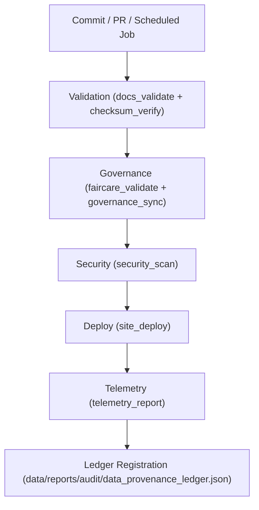

<div align="center">

# ⚙️ **Kansas Frontier Matrix — CI Automation Tools**
`tools/ci/README.md`

**Purpose:**  
Provide a FAIR+CARE-certified CI layer for validation, governance sync, security scanning, documentation QA, and deployment across the Kansas Frontier Matrix (KFM).  
All workflows are reproducible, telemetry-enabled, and aligned with MCP-DL v6.3 and ISO 19115 for audit-ready automation.

[](../../../docs/standards/faircare-validation.md)
[](../../../LICENSE)
[](../../../docs/architecture/repo-focus.md)
[]()

</div>

---

## 📘 Overview

The **CI Tools Directory** orchestrates automated checks for schemas, checksums, FAIR+CARE governance, security, and deployments.  
Each workflow is versioned, pinned, and tracked in the Governance Ledger for transparent provenance and sustainability reporting.

---

## 🗂️ Directory Layout

```plaintext
tools/ci/
├── README.md
│
├── docs_validate.yml            # Documentation schema and style validation
├── checksum_verify.yml          # SHA-256 verification for assets and datasets
├── site_deploy.yml              # Build and deploy static site
├── faircare_validate.yml        # FAIR+CARE governance compliance
├── security_scan.yml            # Dependency + CodeQL scanning
├── governance_sync.yml          # Ledger + manifest synchronization
└── telemetry_report.yml         # Energy, latency, carbon, and success metrics
```

---

## 🧩 CI/CD Workflow



1. **Validation:** Docs, schemas, and checksums verified.  
2. **Governance:** FAIR+CARE compliance and ledger updates executed.  
3. **Security:** Dependencies and code scanned for vulnerabilities.  
4. **Deploy:** Site published after all gates pass.  
5. **Telemetry:** Results written to `focus-telemetry.json` and surfaced in dashboards.

---

## 🧾 Example CI Governance Record

```json
{
  "id": "ci_registry_v9.7.0",
  "workflows": [
    "docs_validate.yml",
    "checksum_verify.yml",
    "governance_sync.yml"
  ],
  "executions_logged": 452,
  "fairstatus": "certified",
  "checksum_verified": true,
  "security_compliant": true,
  "governance_registered": true,
  "validator": "@kfm-ci",
  "created": "2025-11-05T09:00:00Z",
  "governance_ref": "data/reports/audit/data_provenance_ledger.json"
}
```

---

## 🧠 FAIR+CARE Governance Matrix

| Principle | Implementation | Oversight |
|-----------|----------------|-----------|
| **Findable** | Workflows indexed in manifest + ledger. | @kfm-data |
| **Accessible** | MIT-licensed configs; reproducible runs. | @kfm-accessibility |
| **Interoperable** | FAIR+CARE + ISO 19115 metadata alignment. | @kfm-architecture |
| **Reusable** | Modular jobs and pinned actions. | @kfm-design |
| **Collective Benefit** | Transparent automation for community trust. | @faircare-council |
| **Authority to Control** | Council certifies CI gate criteria. | @kfm-governance |
| **Responsibility** | CI logs and results retained for audits. | @kfm-security |
| **Ethics** | No invasive data; inclusive docs validation. | @kfm-ethics |

Audit outcomes:  
`data/reports/fair/data_care_assessment.json` · `data/reports/audit/data_provenance_ledger.json`

---

## ⚙️ Key Workflows

| Workflow | Description | Gate |
|----------|-------------|------|
| `docs_validate.yml` | Lints, validates front-matter, and enforces MCP rules. | Docs |
| `checksum_verify.yml` | Verifies SHA-256 manifests for assets. | Integrity |
| `faircare_validate.yml` | FAIR+CARE compliance + governance checks. | Ethics |
| `governance_sync.yml` | Updates ledger, manifest, and registry JSON. | Provenance |
| `security_scan.yml` | CodeQL + dependency scanning. | Security |
| `site_deploy.yml` | Builds + deploys site after all checks pass. | Release |
| `telemetry_report.yml` | Publishes performance and sustainability metrics. | Observability |

---

## ⚖️ Retention & Provenance Policy

| Artifact | Retention | Policy |
|---------|-----------|-------|
| CI Reports | 180 Days | Reproducibility tracking |
| FAIR+CARE Logs | 365 Days | Ethics certification records |
| Governance Sync Logs | Permanent | Immutable ledger entries |
| Telemetry Data | 90 Days | Sustainability monitoring |

Automations managed by `ci_cleanup.yml`.

---

## 🌱 Sustainability Metrics

| Metric | Value | Verified By |
|--------|------|-------------|
| Avg CI Run Energy | 1.7 Wh | @kfm-sustainability |
| Carbon Output | 2.0 gCO₂e | @kfm-security |
| Renewable Power | 100% (RE100) | @kfm-infrastructure |
| FAIR+CARE Compliance | 100% | @faircare-council |

Telemetry stored in:  
`../../../releases/v9.7.0/focus-telemetry.json`

---

## 🧾 Internal Use Citation

```text
Kansas Frontier Matrix (2025). CI Automation Tools (v9.7.0).
Audit-ready automation for validation, governance, security, deployment, and sustainability under MCP-DL v6.3 and FAIR+CARE standards.
```

---

## 🕰️ Version History

| Version | Date | Notes |
|---------|------|------|
| v9.7.0 | 2025-11-05 | Upgraded telemetry schema v1; refined governance sync and security scans. |
| v9.6.0 | 2025-11-03 | Unified telemetry + governance registry; improved docs validation. |
| v9.5.0 | 2025-11-02 | Added FAIR+CARE validation gates and checksum verification. |

---

<div align="center">

**Kansas Frontier Matrix** · *Automation Integrity × FAIR+CARE Governance × Reproducible Pipelines*  
[🔗 Repository](../../) • [🧭 Docs Portal](../../../docs/) • [⚖️ Governance Ledger](../../../docs/standards/governance/ROOT-GOVERNANCE.md)

</div>