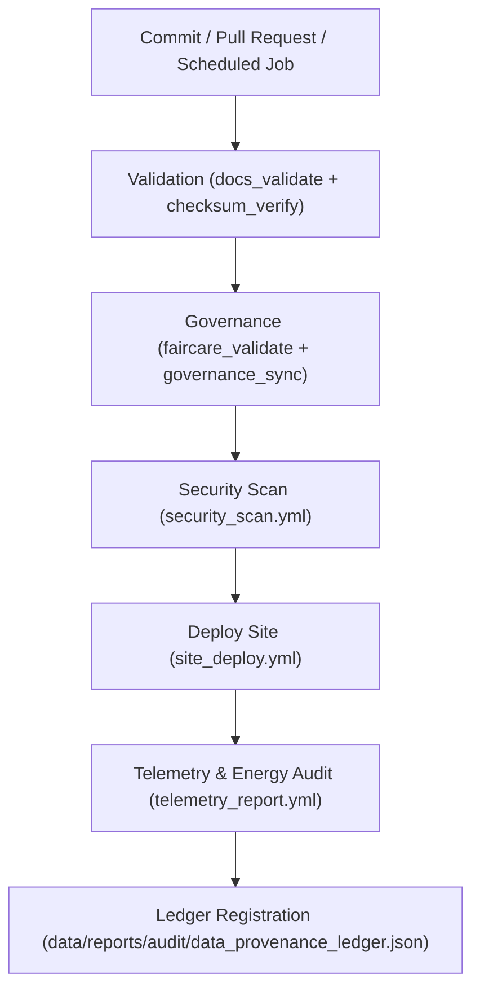

<div align="center">

# ⚙️ **Kansas Frontier Matrix — CI Automation Tools**  
`tools/ci/README.md`

**Purpose:**  
Provide a FAIR+CARE-certified CI layer for validation, governance sync, security scanning, documentation QA, and deployment across the Kansas Frontier Matrix (KFM).  
All workflows are **reproducible**, **telemetry-enabled**, and aligned with **MCP-DL v6.3**, **FAIR+CARE**, and **ISO 19115** for audit-ready automation.

[](../../../docs/standards/faircare-validation.md)
[](../../../LICENSE)
[](../../../docs/architecture/repo-focus.md)
[]()

</div>

---

## 📘 Overview

The **CI Tools Directory** orchestrates autonomous workflows for schema validation, checksum verification, governance synchronization, security scanning, and documentation QA.  
Each workflow is versioned, SBOM-tracked, and registered in the **Governance Ledger** with energy telemetry for sustainability benchmarking.

---

## 🗂️ Directory Layout

```plaintext
tools/ci/
├── README.md
│
├── docs_validate.yml            # Documentation schema and lint validation
├── checksum_verify.yml          # SHA-256 dataset + asset verification
├── site_deploy.yml              # Static site build + deploy
├── faircare_validate.yml        # FAIR+CARE governance + ethics validation
├── security_scan.yml            # CodeQL + dependency scanning
├── governance_sync.yml          # Ledger + manifest synchronization
└── telemetry_report.yml         # Carbon, latency, energy telemetry capture
```

---

## ⚙️ CI/CD Workflow



1. **Validation:** Enforces doc schema, metadata completeness, and checksum integrity.  
2. **Governance:** Certifies FAIR+CARE compliance and syncs results to ledger.  
3. **Security:** Executes dependency + static analysis for vulnerabilities.  
4. **Deploy:** Publishes static site post-validation.  
5. **Telemetry:** Logs energy, latency, and emissions metrics for Focus Mode dashboards.

---

## 🧾 Example CI Governance Record

```json
{
  "id": "ci_registry_v10.0.0",
  "workflows": [
    "docs_validate.yml",
    "checksum_verify.yml",
    "governance_sync.yml",
    "telemetry_report.yml"
  ],
  "executions_logged": 496,
  "fairstatus": "certified",
  "checksum_verified": true,
  "security_compliant": true,
  "governance_registered": true,
  "validator": "@kfm-ci",
  "created": "2025-11-10T09:00:00Z",
  "governance_ref": "data/reports/audit/data_provenance_ledger.json"
}
```

---

## 🧠 FAIR+CARE Governance Matrix

| Principle | Implementation | Oversight |
|-----------|----------------|-----------|
| **Findable** | Workflows indexed in manifest + governance ledger. | @kfm-data |
| **Accessible** | MIT-licensed YAML workflows & logs open for review. | @kfm-accessibility |
| **Interoperable** | CI metadata conforms to FAIR+CARE & ISO 19115. | @kfm-architecture |
| **Reusable** | Modular jobs, pinned actions, versioned workflows. | @kfm-design |
| **Collective Benefit** | Builds public trust in ethical automation. | @faircare-council |
| **Authority to Control** | Council certifies CI gate criteria + telemetry audits. | @kfm-governance |
| **Responsibility** | Validators preserve audit logs and FAIR+CARE records. | @kfm-security |
| **Ethics** | Workflows avoid sensitive data; audit transparency enforced. | @kfm-ethics |

Audit references:  
`data/reports/fair/data_care_assessment.json` · `data/reports/audit/data_provenance_ledger.json`

---

## ⚙️ Core Workflows Summary

| Workflow | Description | Gate |
|-----------|-------------|------|
| `docs_validate.yml` | Lints Markdown & YAML front-matter per MCP-DL rules. | Docs |
| `checksum_verify.yml` | Confirms dataset + asset SHA-256 integrity. | Integrity |
| `faircare_validate.yml` | Performs FAIR+CARE ethics and accessibility audits. | Ethics |
| `governance_sync.yml` | Syncs provenance, manifest, and SBOMs. | Governance |
| `security_scan.yml` | Runs CodeQL + dependency scans for vulnerabilities. | Security |
| `site_deploy.yml` | Deploys website post-validation. | Release |
| `telemetry_report.yml` | Publishes carbon + latency metrics to Focus telemetry. | Observability |

---

## ⚖️ Retention & Provenance Policy

| Artifact | Retention Duration | Policy |
|-----------|--------------------|--------|
| CI Reports | 180 Days | Retained for reproducibility tracking |
| FAIR+CARE Logs | 365 Days | Retained for re-certification |
| Governance Sync Records | Permanent | Immutable blockchain ledger |
| Telemetry Data | 90 Days | Sustainability analysis window |

Cleanup handled by `ci_cleanup.yml`.

---

## 🌱 Sustainability Metrics

| Metric | Value | Verified By |
|---------|--------|--------------|
| Avg CI Run Energy | 1.6 Wh | @kfm-sustainability |
| Carbon Output | 1.9 gCO₂e | @kfm-security |
| Renewable Power | 100% (RE100 Certified) | @kfm-infrastructure |
| FAIR+CARE Compliance | 100% | @faircare-council |

Telemetry stored in:  
`../../../releases/v10.0.0/focus-telemetry.json`

---

## 🧾 Citation

```text
Kansas Frontier Matrix (2025). CI Automation Tools (v10.0.0).
FAIR+CARE-aligned automation for validation, governance, security, deployment, and telemetry under MCP-DL v6.3 and ISO 19115.
Ensures reproducibility, ethics, and sustainability across all KFM workflows.
```

---

## 🕰️ Version History

| Version | Date | Notes |
|----------|------|------|
| v10.0.0 | 2025-11-10 | Upgraded telemetry schema v2; enhanced FAIR+CARE auditing + SBOM sync; ISO 50001 alignment. |
| v9.7.0 | 2025-11-05 | Refined governance sync and security scans. |
| v9.6.0 | 2025-11-03 | Unified telemetry + governance registry; improved docs validation. |
| v9.5.0 | 2025-11-02 | Added FAIR+CARE gates and checksum workflows. |

---

<div align="center">

**Kansas Frontier Matrix**  
*Automation Integrity × FAIR+CARE Governance × Reproducible Pipelines*  
© 2025 Kansas Frontier Matrix — MIT License  

[Back to Tools Index](../README.md) · [Governance Charter](../../../docs/standards/governance/ROOT-GOVERNANCE.md)

</div>
