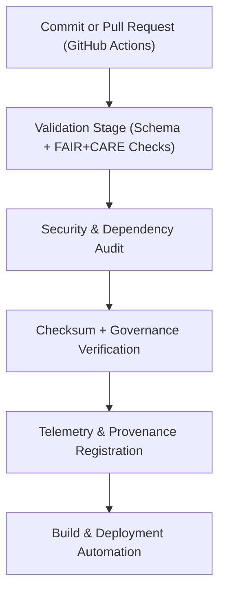

<div align="center">

# ⚙️ Kansas Frontier Matrix — **CI/CD Automation Tools**
`tools/ci/README.md`

**Purpose:**  
Comprehensive FAIR+CARE-certified **Continuous Integration / Continuous Deployment (CI/CD)** toolkit managing automated testing, validation, and governance synchronization across all modules of the Kansas Frontier Matrix (KFM).  
These tools enforce consistency, transparency, and ethical automation for all KFM pipelines.

[](../../../docs/standards/faircare-validation.md)
[](../../../LICENSE)
[](../../../docs/architecture/repo-focus.md)

</div>

---

## 📚 Overview

The `tools/ci/` directory contains automation scripts, CI/CD configuration templates, and validation utilities supporting KFM’s reproducible, FAIR+CARE-governed workflows.  
These tools power the autonomous build, validation, testing, and governance systems across every data and AI domain.

### Core Responsibilities
- Run continuous schema and FAIR+CARE validation in all ETL workflows.  
- Automate code security, checksum, and AI explainability audits.  
- Synchronize validated artifacts into governance ledgers and manifests.  
- Provide provenance-aware build automation and transparency in deployment pipelines.  

---

## 🗂️ Directory Layout

```plaintext
tools/ci/
├── README.md                              # This file — documentation for CI/CD tools
│
├── ci_validate.yml                        # Schema, checksum, and FAIR+CARE validation pipeline
├── ci_focus_validate.yml                  # Focus Mode AI validation automation
├── ci_sync.yml                            # Governance and ledger synchronization workflow
├── ci_security_scan.yml                   # Automated security and dependency vulnerability scanner
├── ci_checksum_verify.yml                 # Integrity and reproducibility verification workflow
├── ci_codeql.yml                          # Static code analysis for security and compliance
└── metadata.json                          # Provenance, governance linkage, and version metadata
```

---

## ⚙️ CI/CD Workflow



### Workflow Description
1. **Validation Stage:**  
   Executes FAIR+CARE, schema, and checksum validation workflows via CI pipelines.  
2. **Security Audit:**  
   Runs vulnerability scanning, license compliance checks, and static analysis.  
3. **Checksum Verification:**  
   Confirms data reproducibility and build integrity using hash registries.  
4. **Governance Sync:**  
   Logs validated artifacts in blockchain-backed governance ledgers.  
5. **Build & Deploy:**  
   Publishes certified releases to manifests, documentation, and production endpoints.  

---

## 🧩 Example CI Governance Record

```json
{
  "id": "ci_governance_tools_v9.5.0_2025Q4",
  "pipelines_executed": [
    "ci_validate.yml",
    "ci_focus_validate.yml",
    "ci_security_scan.yml"
  ],
  "builds_completed": 142,
  "checksum_verified": true,
  "security_scan_passed": true,
  "fairstatus": "certified",
  "governance_registered": true,
  "telemetry_ref": "releases/v9.5.0/focus-telemetry.json",
  "governance_ref": "reports/audit/ai_ci_ledger.json",
  "created": "2025-11-02T23:59:00Z",
  "validator": "@kfm-ci-system"
}
```

---

## 🧠 FAIR+CARE Governance Matrix

| Principle | Implementation |
|------------|----------------|
| **Findable** | CI/CD runs indexed by build hash, telemetry record, and governance ledger entry. |
| **Accessible** | Logs, manifests, and reports stored in open-access repositories. |
| **Interoperable** | YAML pipelines compliant with GitHub Actions and FAIR+CARE schema standards. |
| **Reusable** | Fully documented workflows with reproducibility metadata. |
| **Collective Benefit** | Promotes transparent and ethical automation for open science. |
| **Authority to Control** | FAIR+CARE Council reviews governance registration and security results. |
| **Responsibility** | Validators ensure all pipelines log checksum and provenance metadata. |
| **Ethics** | Automation pipelines aligned with ethical AI and open data governance policies. |

Governance results recorded in:  
`reports/audit/ai_ci_ledger.json` • `reports/fair/ci_tools_summary.json`

---

## ⚙️ CI/CD Validation Artifacts

| File | Description | Format |
|------|--------------|--------|
| `ci_validate.yml` | Pipeline for schema, FAIR+CARE, and checksum validation. | YAML |
| `ci_focus_validate.yml` | Focus Mode AI explainability validation automation. | YAML |
| `ci_sync.yml` | Synchronizes validated artifacts with governance ledgers. | YAML |
| `ci_security_scan.yml` | Security and vulnerability scanning workflow. | YAML |
| `ci_checksum_verify.yml` | Confirms data and artifact integrity across builds. | YAML |
| `ci_codeql.yml` | Runs static analysis for code quality and security compliance. | YAML |
| `metadata.json` | Provenance record linking pipelines, runs, and governance events. | JSON |

Automation managed via `ci_tools_sync.yml`.

---

## 🧾 Retention Policy

| File Type | Retention Duration | Policy |
|------------|--------------------|--------|
| CI/CD Logs | 90 days | Archived in telemetry system for governance review. |
| FAIR+CARE Reports | 365 days | Retained for transparency and audit validation. |
| Governance Metadata | Permanent | Maintained in ledger for reproducibility and lineage tracking. |
| Security Scans | 180 days | Stored for compliance and re-audit readiness. |

Cleanup managed by `ci_tools_cleanup.yml`.

---

## 🧾 Internal Use Citation

```text
Kansas Frontier Matrix (2025). CI/CD Automation Tools (v9.5.0).
FAIR+CARE-certified automation pipelines for schema validation, checksum verification, and ethical governance synchronization.
Ensures transparent and reproducible automation under MCP-DL v6.3 compliance.
```

---

## 🧾 Version Notes

| Version | Date | Notes |
|----------|------|--------|
| v9.5.0 | 2025-11-02 | Added governance synchronization and FAIR+CARE telemetry validation automation. |
| v9.3.2 | 2025-10-28 | Improved checksum registry and static security scan workflows. |
| v9.3.0 | 2025-10-26 | Established CI/CD tools workspace for ethical automation and provenance governance. |

---

<div align="center">

**Kansas Frontier Matrix** · *Automation Integrity × FAIR+CARE Ethics × Provenance Accountability*  
[🔗 Repository](https://github.com/bartytime4life/Kansas-Frontier-Matrix) • [🧭 Docs Portal](../../../docs/) • [⚖️ Governance Ledger](../../../docs/standards/governance/)

</div>